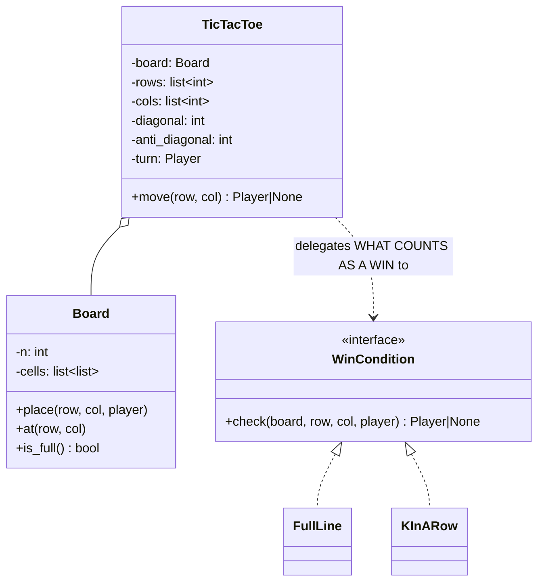
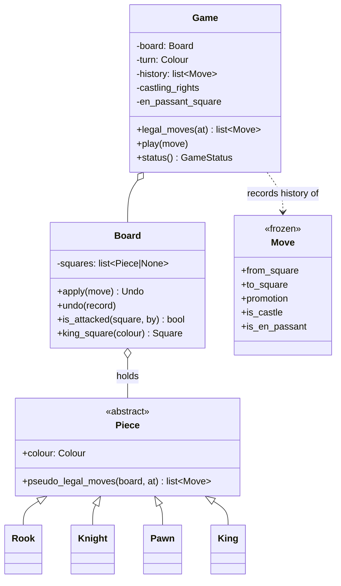

# Day 083 · System design — Design tic-tac-toe, and then chess

**After today you can:** You can design a board game so the rules live in one replaceable place.

**The interviewer asks it as:** *Design tic-tac-toe. Now make it work for an N by N board.*

---

## 1. What this is, and why they ask it

Tic-tac-toe is the smallest possible board game, and that is exactly why it is asked: there is nowhere
to hide. Nine squares, two players, one win condition. Anybody can make it work. The interview is
about what happens next.

Two things happen next, and they are the whole lesson. First: *"now make it N by N"*, where the naive
win check — scan every row, column and diagonal after every move — becomes O(N²) per move, and the
good answer is O(1) using running counters. Second: *"now design chess"*, where the board is the same
grid and everything else is different, and the question becomes **where do the rules live so that
changing the game does not mean rewriting the board?**

They ask it because a candidate who writes `if board[0][0] == board[0][1] == board[0][2]` nine times
has told you something, and a candidate who writes four counters has told you something else. And
because chess is the cleanest example of a rule that cannot live on any single object: whether a bishop
may move is not a property of the bishop.

---

## 2. The story

Every evening in the courtyard behind the flats the children play the chalk game, and Shivanna, who is
eighty-one and sits on the step by the meter box, is the umpire, because nobody trusts anybody else.

The game is old and the children have made it bigger over the years. It used to be three across. Then
somebody drew four. Now they draw ten by ten with a bit of broken tile, which takes about ten minutes
and always ends in an argument about whether the lines are straight.

Two teams. They take turns filling in one square each. The first team to fill a whole line — across,
down, or corner to corner — wins.

The children check for a winner the same way every time. When a square is filled, four or five of them
crouch over the grid and read every line, one after another, out loud, while everybody else waits. On
the ten-by-ten grid that takes the better part of a minute. It happens after every single square. By
the end of a game they have read that grid two hundred times.

Shivanna does not look at the grid at all.

He keeps numbers. One for each row across, one for each line going down, and one for each of the two
corner-to-corner lines. Twenty-two numbers, in his head. When a child fills a square he adds one to
that row's number and one to that column's number, and if the square happens to sit on a corner-to-corner
line, to that number too. If any number reaches ten, he says so. He does not look at the other
ninety-nine squares, because nothing that just happened could have changed them.

He has been doing it since the game was three across and there were only eight numbers.

The children changed the game again last winter — now it is five in a row rather than a whole line, on
the same ten-by-ten grid. Shivanna adapted in about four seconds. The counting is the same. Only the
number he is waiting for changed.

And when the older boys play their own game on the same chalk grid, with completely different rules
about who may go where, Shivanna will not umpire. He says the grid is the same grid and the marks are
the same marks, but the rules are somebody else's business, and he has not learned them.

---

## 3. The idea in plain English

Shivanna's twenty-two numbers are the O(1) win check. And his last sentence — *the grid is the same,
the rules are somebody else's business* — is the answer to the chess half.

### The naive win check, and why it stops being acceptable

After a move, scan every row, every column and both diagonals:

```
 3 x 3:      3 rows + 3 cols + 2 diagonals = 8 lines × 3 cells  =  24 checks per move
 N x N:      2N + 2 lines × N cells                             =  O(N²) per move
```

At N = 3 that is 24 checks and nobody cares. At N = 1000 it is about two million checks **per move**,
and a full game is a million moves, so 2 × 10¹² operations. The naive version is not slow because it
is badly written; it is slow because it re-derives everything from scratch each time.

### The counter trick

**A move can only affect the lines that pass through the square it was played on** — one row, one
column, and at most two diagonals. Nothing else on the board changed, so nothing else needs checking.

So keep a running count per line. The neat encoding is `+1` for player X and `−1` for player O:

```python
    delta = 1 if player is Player.X else -1
    self._rows[row] += delta
    self._cols[col] += delta
    if row == col:
        self._diagonal += delta
    if row + col == self._n - 1:
        self._anti_diagonal += delta
```

Then a line is won when its count reaches `+n` or `−n`, because that can only happen if every cell in
it belongs to one player:

```python
    if abs(self._rows[row]) == n or abs(self._cols[col]) == n \
       or abs(self._diagonal) == n or abs(self._anti_diagonal) == n:
        return player
```

**Four increments and four comparisons. O(1) per move, whatever N is.** The `+1/−1` encoding is what
makes it one number per line instead of two counts; `abs(count) == n` is unambiguous because you can
only reach `n` by having all `n` cells and `−n` by having none of them for the other player.

Space is `O(N)`: two arrays of length N and two integers, against the `O(N²)` board itself. So the
counters are free.

### The diagonal conditions, which are the two lines people get wrong

```
 main diagonal      row == col                 (0,0) (1,1) (2,2)
 anti-diagonal      row + col == n - 1         (0,2) (1,1) (2,0)
```

Both, not one — a cell can be on both, and the centre of an odd-sized board always is. Write them as
two separate `if`s, never an `elif`.

### Making the win condition replaceable

Shivanna adapting to "five in a row" in four seconds is the design point. The board did not change; the
*condition* did.

That earns an interface, by the usual gate from [day 076](../day-076-lru-cache/README.md) — **can you
name a second implementation somebody actually wants?**

```python
class WinCondition(Protocol):
    def check(self, board: Board, row: int, col: int, player: Player) -> Player | None: ...
```

- `FullLine` — the whole row, column or diagonal. Classic tic-tac-toe.
- `KInARow` — any run of k, anywhere. That is Gomoku at k = 5 on 15×15, and Connect Four at k = 4 with
  gravity.

Two real implementations, so the interface is justified. Nothing else in tic-tac-toe is, and inventing
a `MoveValidatorFactory` for a nine-square game is the drill through the wall from
[day 076](../day-076-lru-cache/README.md).

Note that `KInARow` cannot use the whole-line counters — a run of five inside a row of fifteen is a
different question. It scans outward from the played cell in four directions, which is O(k) per move,
still independent of N. Say that rather than pretending one trick covers both.

### Now chess: what changes, and what does not

The board barely changes. It is still a grid of squares, each holding a piece or nothing, and it still
knows nothing about rules.

What changes is that **"is this move legal?" is no longer a property of one object.** That is the whole
difficulty and it is worth stating flatly, because a candidate who puts `can_move` on `Piece` and stops
has missed it.

Three reasons a piece cannot answer alone:

**One: the path.** A rook moving from a1 to a8 is geometrically fine and illegal if anything stands
between. So the piece needs the board.

**Two: check.** A move that is perfectly legal for the piece is illegal if it leaves your own king
attacked. A pinned bishop may not move at all, even though nothing about the bishop has changed. This
is not a piece rule; it is a *position* rule.

**Three: moves that involve more than one piece or the past.** Castling moves two pieces and depends on
whether either has moved before, and on whether the king passes through an attacked square. En passant
depends on what the *opponent did on the previous move*. Promotion replaces the piece with a different
one. None of these can live inside a single piece object.

### The structure that survives all three

Two stages, and naming them is what shows you have thought about chess rather than about class
diagrams:

```
 1. PSEUDO-LEGAL generation   the piece + the board:
                              "where could this piece go, ignoring check?"
 2. LEGALITY filtering        the game:
                              "make the move, is my king attacked? if so, discard it"
```

```python
class Piece:
    def pseudo_legal_moves(self, board: Board, at: Square) -> list[Move]: ...


class Game:
    def legal_moves(self, at: Square) -> list[Move]:
        moves = self._board[at].pseudo_legal_moves(self._board, at)
        legal = []
        for move in moves:
            undo = self._board.apply(move)
            if not self._board.is_attacked(self._board.king_square(self._turn), by=other(self._turn)):
                legal.append(move)
            self._board.undo(undo)          # make, test, unmake
        return legal
```

**Make, test, unmake.** That is how every real chess engine does it, and the `undo` is not an
optimisation — it is what makes legality checking possible at all without copying the board thirty-five
times per position.

### Where the rules actually live

- **`Piece`** — geometry only. How this kind of piece moves on an empty-ish board. One class per type,
  or one class holding a movement rule; either is defensible, and the second composes better because a
  fairy-chess variant can add a piece without a new subclass.
- **`Board`** — squares, what is on them, `apply`, `undo`, and `is_attacked`. Mechanics, no rules.
- **`Game`** — turn order, history, the check filter, castling rights, the en passant square, the
  fifty-move counter, and the end conditions. **The rules that are about the position rather than about
  a piece live here.**

That split is the answer to "so the rules live in one replaceable place". The replaceable place is
`Game` plus the piece movement rules — and a variant like Chess960 changes only castling rights inside
`Game`, while a variant with a new piece changes only a movement rule.

---

## 4. The picture

The counters, on a 3×3 after four moves:

```
        col 0   col 1   col 2      row counts
      +-------+-------+-------+
 r0   |   X   |   O   |       |      0     (+1 -1)
      +-------+-------+-------+
 r1   |       |   X   |       |     +1
      +-------+-------+-------+
 r2   |   O   |       |       |     -1
      +-------+-------+-------+
 col     0      0       0
        (+1-1) (-1+1)

 diagonal      (0,0)(1,1)(2,2) = X, X, _   -> +2
 anti-diagonal (0,2)(1,1)(2,0) = _, X, O   ->  0

 X plays (2,2):
   rows[2] += 1  -> 0
   cols[2] += 1  -> +1
   row == col    -> diagonal += 1 -> +3
   abs(+3) == 3  -> X WINS, and we touched four numbers, not nine squares
```

What to notice: the only numbers that changed are the ones for lines through (2,2). Shivanna not
looking at the other squares, because nothing that just happened could have changed them.

The two designs, side by side:



And chess, where the split is the point:



What to notice: **`Piece` has `pseudo_legal_moves`, not `can_move`.** That one name change carries the
whole design — it says out loud that the piece cannot decide legality, only geometry, and that
somebody else finishes the job.

The two-stage filter, drawn:

```
  Piece.pseudo_legal_moves()          Game.legal_moves()
  "where could I go?"                 "which of those are actually allowed?"

   Bishop c1 -> [d2, e3, f4, g5, ...]   for each move:
                                          board.apply(move)
                                          if my king is attacked -> discard
                                          board.undo()

   result: [] if the bishop is pinned — the bishop's geometry did not change,
           the POSITION made it illegal.
```

---

## 5. How it actually works

### Move 1 · Clarify (minutes 0–5)

> **"Fixed 3×3, or general N×N?"** — Design for N, since it costs nothing.
> **"Win is a full line, or k in a row?"** — Start with a full line; ask whether k-in-a-row is coming,
> because it changes the win check.
> **"Two players only?"** — Yes, but the counter trick generalises to more with a count per player.
> **"Do I need undo, or a computer opponent?"** — Ask, because both change the design: undo needs a
> move history, and an opponent needs move generation and evaluation.

### Move 2 · The nouns for tic-tac-toe (minutes 5–10)

- **`Player`** — an enum, X and O. Not a string, so a typo is a failure at the boundary.
- **`Board`** — the grid and what is on each square. **No rules.**
- **`WinCondition`** *(interface)* — what counts as a win.
- **`Game`** — turn order, move validation, the counters, and the result.

Four. One interface, and only because k-in-a-row is a real second implementation.

### Move 3 · The game, with the counters

```python
class TicTacToe:
    def __init__(self, n: int = 3) -> None:
        self._n = n
        self._cells: list[list[Player | None]] = [[None] * n for _ in range(n)]
        self._rows = [0] * n
        self._cols = [0] * n
        self._diagonal = 0
        self._anti_diagonal = 0
        self._turn = Player.X
        self._moves_played = 0
```

`O(N)` of bookkeeping against an `O(N²)` board. Say that ratio out loud — it is why the optimisation is
unarguable rather than a trade.

```python
    def move(self, row: int, col: int) -> Player | None:
        if not (0 <= row < self._n and 0 <= col < self._n):
            raise ValueError(f"({row}, {col}) is off the board")
        if self._cells[row][col] is not None:
            raise ValueError(f"({row}, {col}) is already taken")
        if self._winner is not None:
            raise ValueError("the game is over")
```

Three guards before touching anything. The third is the one people leave out, and it lets a finished
game keep accepting moves.

```python
        player = self._turn
        self._cells[row][col] = player
        self._moves_played += 1
        delta = 1 if player is Player.X else -1

        self._rows[row] += delta
        self._cols[col] += delta
        if row == col:
            self._diagonal += delta
        if row + col == self._n - 1:              # a separate `if`, never `elif`
            self._anti_diagonal += delta
```

Two separate `if`s. The centre of an odd board is on both diagonals, and an `elif` silently drops one
of them — a bug that only shows up on odd boards with a diagonal win through the middle.

```python
        n = self._n
        if (abs(self._rows[row]) == n or abs(self._cols[col]) == n
                or abs(self._diagonal) == n or abs(self._anti_diagonal) == n):
            self._winner = player
            return player

        self._turn = Player.O if player is Player.X else Player.X
        return None
```

Only the four lines through this square are checked. That is the entire optimisation and it is five
lines of code.

### Move 4 · The k-in-a-row condition, which needs a different method

```python
class KInARow:
    """A run of k anywhere. Cannot use whole-line counters — scan outward from
    the played cell in four directions. O(k) per move, still independent of N."""

    def __init__(self, k: int) -> None:
        self._k = k

    DIRECTIONS = ((0, 1), (1, 0), (1, 1), (1, -1))       # →  ↓  ↘  ↙

    def check(self, cells, row, col, player, n):
        for dr, dc in self.DIRECTIONS:
            run = 1
            run += self._count(cells, row, col, dr, dc, player, n)
            run += self._count(cells, row, col, -dr, -dc, player, n)
            if run >= self._k:
                return player
        return None
```

Four directions, not eight, because each direction and its opposite are counted together. Getting that
wrong doubles the work and is the usual first version.

### Move 5 · Chess — the classes, and the one that matters

```python
@dataclass(frozen=True)
class Move:
    from_square: int
    to_square: int
    promotion: str | None = None
    is_castle: bool = False
    is_en_passant: bool = False
```

Frozen, and it carries the three special cases as flags rather than as separate types. Those three
flags are exactly the moves that no piece can describe on its own, and having them on `Move` is what
lets `Board.apply` do the right thing.

```python
class Rook(Piece):
    DIRECTIONS = ((0, 1), (0, -1), (1, 0), (-1, 0))

    def pseudo_legal_moves(self, board, at):
        moves = []
        for dr, dc in self.DIRECTIONS:
            square = at
            while True:
                square = step(square, dr, dc)
                if square is None:                    # off the board
                    break
                occupant = board[square]
                if occupant is None:
                    moves.append(Move(at, square))
                    continue
                if occupant.colour is not self.colour:
                    moves.append(Move(at, square))    # capture
                break                                 # blocked either way
        return moves
```

The sliding loop, which the rook, bishop and queen all share — so it belongs in a shared helper with a
direction list, and the three pieces become three tuples. Knight and king use the same helper with a
single step instead of a slide.

```python
class Board:
    def apply(self, move: Move) -> "Undo":
        """Make the move and return everything needed to take it back."""
        captured = self._squares[move.to_square]
        record = Undo(move, captured, self._en_passant, self._castling)
        self._squares[move.to_square] = self._squares[move.from_square]
        self._squares[move.from_square] = None
        ...
        return record

    def undo(self, record: "Undo") -> None:
        """Restore exactly. This is what makes legality checking affordable."""
```

`apply` returning an `Undo` rather than the board copying itself is the single most important
performance decision in a chess program. Copying a board per candidate move is about thirty-five copies
per position; make-and-unmake is two pointer writes.

```python
class Game:
    def legal_moves(self, at: int) -> list[Move]:
        piece = self._board[at]
        if piece is None or piece.colour is not self._turn:
            return []
        legal = []
        for move in piece.pseudo_legal_moves(self._board, at):
            undo = self._board.apply(move)
            in_check = self._board.is_attacked(
                self._board.king_square(self._turn), by=opposite(self._turn))
            self._board.undo(undo)
            if not in_check:
                legal.append(move)
        return legal
```

Nine lines, and they are the answer to "where do the rules live". The piece contributed geometry; the
game contributed the rule that you may not leave your own king attacked. **Neither could have done it
alone**, which is why `can_move` on a piece is the wrong shape.

```python
    def status(self) -> GameStatus:
        moves = [m for sq in self._board.squares_of(self._turn) for m in self.legal_moves(sq)]
        if moves:
            return GameStatus.IN_PLAY
        in_check = self._board.is_attacked(
            self._board.king_square(self._turn), by=opposite(self._turn))
        return GameStatus.CHECKMATE if in_check else GameStatus.STALEMATE
```

**Checkmate and stalemate are the same test with one extra question.** No legal moves plus in check is
checkmate; no legal moves and not in check is a draw. Getting that in one method is a small, real
demonstration of understanding the domain.

### Real systems

- **Stockfish and every serious engine** use **bitboards**: one 64-bit integer per piece type per
  colour, where each bit is a square. Move generation becomes bit shifts and masks, and "all squares a
  rook attacks" is a table lookup. That is the production answer for performance, and mentioning it —
  while noting you would not write it in an interview — shows you know where this goes.
- **Make/unmake with an undo record** is universal in engines, for exactly the reason above: a search
  visits millions of positions and cannot copy the board at each one.
- **FEN and PGN** are the standard formats for a position and a game, and a design that can produce FEN
  has, by construction, remembered castling rights, the en passant square, the half-move clock and the
  side to move — the four bits of state people forget.
- **python-chess** is the reference library, and its API is exactly this shape: a `Board` that generates
  legal moves, `push`/`pop` for make and unmake.

---

## 6. The numbers

### Why the counters are not a micro-optimisation

```
 naive check per move:  (2N + 2) lines × N cells  =  2N² + 2N  ≈ O(N²)
 counter check:         4 increments + 4 comparisons  =  O(1)

 N = 3:      24 checks   vs 8    — nobody cares
 N = 100:    20,200      vs 8    — 2,500x
 N = 1000:   2,002,000   vs 8    — 250,000x
```

And over a whole game, where the number of moves is itself O(N²):

```
 N = 1000, a full board = 10^6 moves
   naive:    10^6 moves × 2 × 10^6 checks  =  2 × 10^12 operations
   counters: 10^6 moves × 8                =  8 × 10^6 operations
```

**Two trillion against eight million.** That is the difference between a program that finishes and one
that does not, and it comes from one observation: only the lines through the played square can have
changed.

### Memory

```
 board       N² cells × 8 B (a reference)      N = 1000 -> 8 MB
 counters    2N integers + 2                   N = 1000 -> 16 KB
 ratio                                         0.2% overhead
```

The optimisation costs **one fifth of one percent** of the board's memory. There is no trade-off to
discuss, which is worth saying — most optimisations cost something and this one does not.

### Chess, in numbers

```
 squares                     64
 board as an array           64 references × 8 B  =  512 B
 board as bitboards          12 pieces × 8 B      =   96 B
 average legal moves         ~35 per position
 average game length         ~40 moves per side = 80 plies
```

```
 legality filtering, per position:
   35 pseudo-legal moves × (apply + is_attacked + undo)
   is_attacked ≈ 8 directions × up to 7 squares  ≈ 50 checks
   -> 35 × 50  ≈  1,750 operations per position

 with board COPYING instead of undo:
   35 copies × 512 B  =  18 KB of copying per position
   at 1,000,000 positions/second in a search: 18 GB/s of memcpy — impossible
```

**That is the argument for make-and-unmake**, in a number rather than as a principle. It is also why a
naive object-per-square design with `deepcopy` cannot be the basis of an engine.

### The state people forget

```
 side to move                 1 bit
 castling rights              4 bits   (each side, each rook)
 en passant target square     6 bits
 half-move clock (50-move)    ~7 bits
 full-move number             ~10 bits
```

Under four bytes, and every one of them is required for the rules to be correct. A design that stores
only "which piece is on which square" **cannot** answer whether castling is legal or whether the game
is a draw by the fifty-move rule. Listing them is a quick way to show you know the domain rather than
the diagram.

---

## 7. The trade-offs

### What this design gives up

**The counters only work for whole-line wins.** They are exactly wrong for k-in-a-row, where a run of
five inside a row of fifteen is not visible in a row total. That is why `WinCondition` is an interface
rather than a flag — the two conditions do not share an algorithm, only a question. If I had bolted
k-in-a-row on as a parameter to the counter version, it would have needed rewriting.

**Counters have to be maintained by every mutation, so undo becomes a hazard.** If undo is added later,
it must reverse the counters as well as the board, and forgetting that gives a board and a set of
counters that disagree — with no error. If undo is a requirement, I would either store deltas with each
move or drop back to scanning, and I would decide that *before* building the counters, not after.

**Chess with a class per piece is inheritance, with all that implies.** A variant that adds a piece
needs a new subclass; a variant that changes how an existing piece moves needs an override. Composing a
movement rule into a single `Piece` class — the Strategy shape from
[day 071](../day-071-monotonic-stack/README.md) — handles both without new types, at the cost of one
more indirection. For an interview I would write subclasses and *name* the composition alternative,
because subclasses read faster on a whiteboard.

**Make-and-unmake makes the board mutable and stateful.** That is fast and it is a genuine source of
bugs: any early return between `apply` and `undo` leaves the board corrupt. In production this is a
context manager or a rigid try/finally, and the bug it prevents — a search that silently explores an
impossible position — is very hard to find.

**Nothing here handles the draw rules properly.** Threefold repetition needs a hash of every position
seen, insufficient material needs a piece-count table, and the fifty-move rule needs the half-move
clock. Each is small and each is easy to leave out, and a chess design that cannot detect a draw is
not a chess design.

### "I would change this design if..."

- **...the board is large and the win is k-in-a-row.** Different win condition, different algorithm —
  scan outward from the played cell, and drop the whole-line counters entirely.
- **...undo or replay is required.** Then a move history is the primary structure and the board becomes
  a projection of it, which also gives you replay and analysis for free.
- **...there is a computer opponent.** Then move generation performance dominates everything, and I
  would move to bitboards and accept that the code stops being readable.
- **...variants must be pluggable** — Chess960, fairy pieces, three-check. Then movement becomes
  composed rules rather than subclasses, and `Game` gets a rule set rather than hard-coded castling.

### The honest concession

Tic-tac-toe does not need any of this. Nine squares and eight lines is twenty-four comparisons and a
first-year student can write it correctly in ten minutes. Everything in this lesson is a response to
the *second* question — "now make it N by N", "now design chess" — and the reason to know it is that
the second question is always asked. Building the counters for a 3×3 game and calling it engineering
would be the drill through the wall; building them because the interviewer said N is judgement.

---

## 8. In the interview

### How it gets asked

- The opener: *"Design tic-tac-toe."* Ten minutes, and it is a warm-up.
- The real question, always: *"Now make it work for an N by N board. What is the cost of checking for a
  winner?"*
- The variation probe: *"Now the win condition is five in a row on a large board."*
- The escalation: *"Now design chess."* Sometimes the whole round is this.
- The chess probe that separates people: *"Where does the rule live that you cannot move into check?"*

### The timed script

**Minutes 0–5 · Clarify.** N×N or 3×3? Full line or k-in-a-row? Undo or an opponent? Those three
answers change the design and none of them is guessable.

**Minutes 5–10 · The naive version, said and costed.** "The obvious check scans every line after every
move — 2N+2 lines of N cells, so O(N²) per move. At N=1000 that is two million checks per move and two
trillion over a game."

**Minutes 10–18 · The counters.** The observation first — only lines through the played square can have
changed — then the `+1/−1` encoding, then the two separate diagonal `if`s.

**Minutes 18–25 · The classes**, with `WinCondition` as an interface and the honest note that
k-in-a-row does not share the counters' algorithm.

**Minutes 25–35 · Chess.** The three reasons a piece cannot decide legality, then pseudo-legal
generation plus the check filter, then make-test-unmake with the copying number.

**Minutes 35–40 · The state people forget** — castling rights, en passant square, half-move clock — and
the draw conditions.

### The follow-ups

**"How do you check for a winner on an N×N board?"**
"Not by scanning. A move can only change the lines that pass through the square just played — one row,
one column, and at most two diagonals — so I keep a running count per line and update four of them. I
encode X as +1 and O as −1, so a line is won when its absolute value reaches N. That is O(1) per move
against O(N²) for scanning: at N=1000, eight operations instead of two million. And the counters are
O(N) memory against an O(N²) board, so it costs about a fifth of a percent — there is no trade to
discuss."

**"Two diagonals — is one `if` enough?"**
"No, they must be two separate `if`s, not an `if/elif`. The centre of any odd-sized board is on both
diagonals, so an `elif` silently drops the update to the second one, and the bug only appears on an
odd board with a diagonal win through the middle — which is precisely the classic 3×3 game."

**"Now the win is five in a row on a 15×15 board."**
"Different algorithm, and I would say that rather than parameterise the counters, because a run of five
inside a row of fifteen is not visible in a row total. I scan outward from the played cell in four
directions — right, down, and the two diagonals — counting the run in both directions along each. That
is O(k) per move, still independent of N. It is why the win condition is behind an interface: the two
rules share a question, not an implementation."

**"Now design chess. Where does 'you cannot move into check' live?"**
"Not on the piece, and that is the key point. A piece can only answer geometry — where could I go given
what is on the board — and it cannot know that moving would expose its own king. So I split it in two:
the piece generates *pseudo-legal* moves, and the game filters them for legality by making each move,
asking whether its own king is attacked, and unmaking it. The name `pseudo_legal_moves` rather than
`can_move` is deliberate — it says out loud that the piece does not finish the job."

**"Why make and unmake rather than copying the board?"**
"Cost. There are about thirty-five legal moves in a typical position, so filtering means thirty-five
trial moves. Copying a 64-square board each time is about 18 KB per position, and a search visiting a
million positions a second would need 18 GB a second of copying, which is not possible. Make-and-unmake
is two writes and an undo record. The price is that the board is mutable and any early return between
apply and undo corrupts it, so in real code that pairing is a context manager or a try/finally."

**"What about castling and en passant?"**
"Those are the moves that prove a piece cannot own the rules. Castling moves two pieces and depends on
history — whether the king or that rook has ever moved — and on whether the king passes through an
attacked square. En passant depends on what the opponent did on the *previous* move. Promotion replaces
the piece entirely. So `Move` carries flags for those cases, `Board.apply` knows how to perform them,
and the *rights* — castling availability and the en passant target square — live on the game state. If
I can produce a FEN string, I have by construction remembered all of it: side to move, castling rights,
en passant square, half-move clock, move number. Under four bytes, and every bit is needed for
correctness."

**"How do you detect checkmate?"**
"Checkmate and stalemate are the same test with one extra question: generate all legal moves for the
side to move; if there are none, ask whether that side is currently in check. In check and no moves is
checkmate; not in check and no moves is stalemate, a draw. And a complete implementation needs the
other draws too — threefold repetition, which needs a hash of every position seen; insufficient
material; and the fifty-move rule, which is why the half-move clock is part of the state."

### A model answer

Asked: *design tic-tac-toe, then make it N by N.*

> "Let me start with what I would not do, because it is the thing the N by N question is aimed at.
>
> The obvious win check is to scan every row, every column and both diagonals after each move. That is
> 2N+2 lines of N cells, so O(N²) per move. At three by three it is twenty-four comparisons and nobody
> cares. At a thousand by a thousand it is two million checks per move, and a full board is a million
> moves, so two trillion operations over a game.
>
> The observation that fixes it: **a move can only change the lines that pass through the square it was
> played on.** One row, one column, and at most two diagonals. Everything else on the board is exactly
> as it was, so there is nothing to re-check.
>
> So I keep a running count per line — one per row, one per column, and two for the diagonals — and I
> encode one player as plus one and the other as minus one. A move updates at most four numbers. A line
> is won when its absolute value reaches N, because you can only get there by owning all N cells. Four
> increments and four comparisons: O(1) per move, whatever N is. At N=1000 that is eight operations
> instead of two million.
>
> The counters are two arrays of length N against an N-squared board, so about a fifth of a percent of
> the memory. There is no trade-off to weigh, which is unusual and worth saying.
>
> One detail that catches people: the two diagonal updates must be two separate `if`s, not an
> `if/elif`. The centre square of any odd board is on both diagonals, and an `elif` silently drops one —
> and the bug only shows up on a diagonal win through the middle, which is the most common way an actual
> three-by-three game ends.
>
> For the classes: `Player` as an enum so a typo fails at the boundary; a `Board` that holds the grid
> and knows no rules; and a `Game` that owns turn order, validation, the counters and the result. I
> would put the win condition behind an interface, but only because I can name a second implementation
> somebody actually wants — five in a row on a large board, which is Gomoku. And I would say plainly
> that the k-in-a-row version cannot reuse the counters: a run of five inside a row of fifteen is not
> visible in a row total, so it scans outward from the played cell in four directions instead. The two
> conditions share a question, not an algorithm, which is exactly what an interface is for.
>
> Three guards before every move: on the board, not already taken, and the game is not already over —
> the third is the one people forget, and it lets a finished game keep accepting moves.
>
> If you want chess after this, the thing that changes is not the board — it is that legality stops
> being a property of any single object. A rook's move depends on what is in the way, so the piece needs
> the board. And a perfectly legal rook move is illegal if it leaves your own king attacked, which is a
> fact about the position and not about the rook at all. So the piece generates *pseudo-legal* moves and
> the game filters them by making each move, testing whether its own king is attacked, and unmaking it."

---

## 9. Recall card

- **The N×N question is the real question, and the answer is one observation: a move can only change the
  lines through the square it was played on.** Keep a running count per row, per column, and for the two
  diagonals; encode one player **+1** and the other **−1**; a line is won when **`abs(count) == n`**.
  **O(1) per move** against O(N²) — **8 operations vs 2,000,000 at N = 1000** — for **O(N)** memory,
  about **0.2%** of the board.
- **The two diagonal updates are two separate `if`s, never `if/elif`** — the centre of an odd board is
  on both, and an `elif` drops one, which is invisible except on a diagonal win through the middle.
  Guard three things before every move: **on the board · not taken · game not already over.**
- **`WinCondition` earns an interface because k-in-a-row is a real second implementation — and it does
  NOT share the counters' algorithm.** A run of 5 inside a row of 15 is invisible in a row total, so it
  scans outward from the played cell in **four** directions (each direction plus its opposite), O(k) per
  move. *The two rules share a question, not an implementation.*
- **Chess: legality is not a property of a piece.** Three reasons — the **path** (needs the board),
  **check** (a pinned piece may not move though nothing about it changed), and moves involving **two
  pieces or the past** (castling, en passant, promotion). So: **`Piece.pseudo_legal_moves`** for
  geometry, and **`Game`** filters by **make → test `is_attacked` → unmake**. The method name
  `pseudo_legal_moves` rather than `can_move` carries the design.
- **Make-and-unmake instead of copying, and the reason is a number:** ~35 moves per position × 512 B is
  **18 KB of copying per position**, so a million-position search would need **18 GB/s**. And **remember
  the state people forget** — side to move, **castling rights**, **en passant square**, **half-move
  clock**, move number: under 4 bytes, and without them castling and the fifty-move draw are
  unimplementable. **Checkmate and stalemate are one test plus one question:** no legal moves, and are
  you in check.
