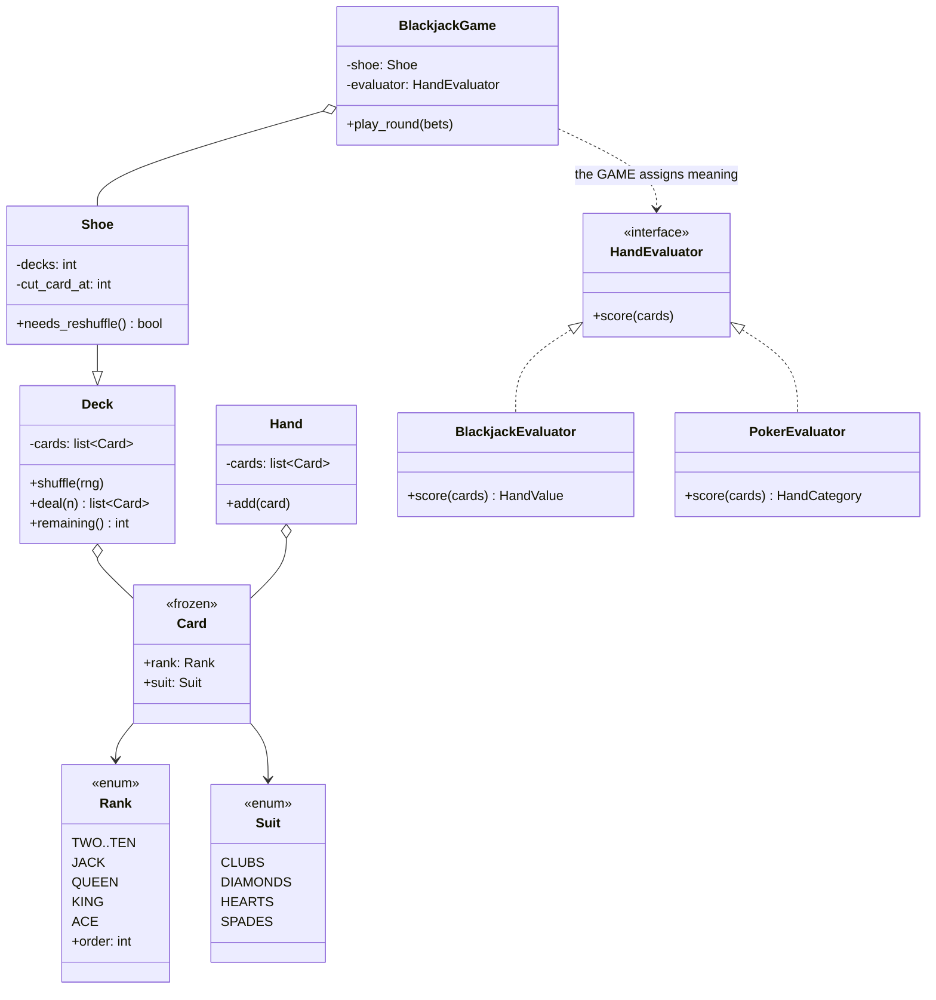

# Day 084 · System design — Design a deck of cards and a card game

**After today you can:** You can model shuffling, dealing and hand comparison cleanly.

**The interviewer asks it as:** *Design a deck of cards. Now build blackjack on top of it.*

---

## 1. What this is, and why they ask it

A deck of cards is fifty-two things with two attributes each. It is the smallest design prompt there
is, and it is asked precisely because there is nothing to hide behind — the whole interview is in
three decisions.

**One: a card is a value object, not an entity.** The seven of hearts has no identity beyond its suit
and rank; two of them are the same card. That means immutable, with equality and hashing by value.

**Two: a card has no value.** This is the one candidates get wrong. An ace is worth 1 or 11 in
blackjack, is the highest card in poker and the lowest in some rummy variants. `Card.value` is a
*game* rule wearing a card's clothes, and putting it on `Card` means the deck can only ever play one
game.

**Three: shuffling is an algorithm with a wrong version that looks right.** "For each card, swap it
with a random card" is the natural thing to write and it is measurably biased. The correct one is
Fisher–Yates, it is three lines, and knowing why the other one is wrong is the part being tested.

They ask it as a warm-up before a longer round, and because the follow-up — *now build blackjack* —
immediately exposes whether your deck knew about games.

---

## 2. The story

Sunday afternoons at Prakash's house have been cards for as long as anyone can remember, and the same
pack has been in the drawer under the television for about nine years.

They play three different games depending on who has turned up.

In the first one the queen is the highest card in the pack and the ace is nothing much. In the second
the ace is worth one, the picture cards are worth ten each, and you are trying to reach a number. In
the third the ace beats everything, including the queen, and the twos are wild.

It is the same fifty-two cards. Nobody has ever suggested buying a different pack for a different
game, and if you asked Prakash what the ace of spades is *worth* he would say it depends what we are
playing, in the tone of somebody being asked something silly.

The argument, which happens about twice a year, is about Vasu's shuffling.

Vasu shuffles the way he has always shuffled. He cuts the pack roughly in half, pushes the two halves
together, squares them up, and does it three times. It looks like shuffling. It sounds like shuffling.

Prakash's nephew, who is at engineering college and is insufferable about it, sat down last Deepavali
and wrote down every hand for two hours. Then he showed them: the three cards that had been together
at the end of one hand were still together, in the same order, four hands later. Not always. Often
enough that he had a page of them.

Vasu said that was coincidence. The nephew said it was not, and that a proper shuffle means every one
of the orders the pack could be in is equally likely, and three quick riffles does not come close.

Nobody changed their mind that evening. But Prakash's daughter, who plays for money with people from
her office, does it differently now. She spreads the whole pack face down on the table and pushes them
around with both hands for a good thirty seconds before gathering them up, and she does that every
single hand, and she will not start until she has.

---

## 3. The idea in plain English

Prakash's answer — *it depends what we are playing* — is the design. And the nephew's page of repeated
sequences is the shuffling half.

### A card is a value object

```python
class Suit(Enum):
    CLUBS = "♣"
    DIAMONDS = "♦"
    HEARTS = "♥"
    SPADES = "♠"


class Rank(Enum):
    TWO = "2"
    ...
    ACE = "A"


@dataclass(frozen=True)
class Card:
    rank: Rank
    suit: Suit
```

`frozen=True` gives you three things at once, and they are exactly the three from
[day 065](../day-065-hashing-custom-objects/README.md). Immutability, so a card cannot be edited after
it is dealt. `__eq__` by value, so two seven-of-hearts objects are equal. And `__hash__`, so cards can
go in sets and be dictionary keys — which you need the moment you want "which cards have been played".

**No `value` field.** That is the decision, and §3 continues with why.

### A card has no value — the game decides

This is the same question as [day 082](../day-082-runner-technique/README.md)'s late fee: *where does
the rule live?* And the answer has the same shape.

```
 ace, in blackjack:  1 or 11, whichever helps      -> a rule about a hand, not a card
 ace, in poker:      high, or low in a wheel       -> a rule about a hand
 ace, in rummy:      1, or sometimes high          -> depends on the variant
 king, in blackjack: 10
 king, in a trick game: beats a queen, worth 0     -> ordering, not arithmetic
```

Not one of those is a property of the piece of card. Put `value = 11` on the ace and your deck can
play exactly one game, and the second game forces either a second `Card` class or a flag.

So `Rank` is an **identity**, not a number. The game supplies a mapping:

```python
class HandEvaluator(Protocol):
    def score(self, cards: list[Card]) -> int: ...
```

- `BlackjackEvaluator` — face cards are 10, an ace is 11 unless that busts, then 1.
- `PokerEvaluator` — returns a category and tie-breakers, not a single number at all.

Two implementations that do not even agree on the *return type* of "score", which is the strongest
possible evidence that this does not belong on `Card`.

If ranks need an ordering for a trick game, give `Rank` an ordinal — `Rank.KING.order == 13` — and let
the *game* decide whether higher wins, whether the ace wraps, and whether trumps override it.

### Shuffling: the wrong version, measured

The natural thing to write:

```python
    for i in range(n):
        j = random.randint(0, n - 1)        # ANY position, including ones already done
        cards[i], cards[j] = cards[j], cards[i]
```

It looks fine and it is biased. The reason is counting: this makes `n` independent choices from `n`
options, so there are `nⁿ` equally likely execution paths — but only `n!` possible orderings. `nⁿ` is
not divisible by `n!` for `n > 2`, so the orderings **cannot** come out equally likely.

Enumerated exhaustively for three cards:

```
 27 equally likely paths, 6 possible orders

   (0,1,2)  4/27 = 14.81%
   (0,2,1)  5/27 = 18.52%
   (1,0,2)  5/27 = 18.52%
   (1,2,0)  5/27 = 18.52%
   (2,0,1)  4/27 = 14.81%
   (2,1,0)  4/27 = 14.81%

 uniform would be 16.67%.  Some orders are 25% more likely than others.
```

**That is not a rounding artefact; it is exact arithmetic.** And it is exactly the kind of bias a
player who watches for two hours will find — Prakash's nephew with his page of repeats.

The correct algorithm, **Fisher–Yates**, walks from the end and picks only from the *unshuffled*
prefix:

```python
    for i in range(n - 1, 0, -1):
        j = random.randint(0, i)            # 0..i, NOT 0..n-1
        cards[i], cards[j] = cards[j], cards[i]
```

One character group different, and now the number of paths is `n × (n−1) × … × 2 = n!` — exactly one
path per ordering, so every ordering is equally likely. For three cards: six paths, six orders, one
each.

In Python you write `random.shuffle(cards)`, which is Fisher–Yates. **Write the loop in the interview
to show you know it, then say you would call the library.**

### The randomness itself, if money is involved

```
 52! = 8.07 × 10^67 possible orderings, which needs about 226 bits to index
 Python's Mersenne Twister has 19,937 bits of state — enough
 but if it is seeded from a 32-bit value, only 2^32 ≈ 4.3 × 10^9 shuffles are reachable
 -> 4 billion out of 8 × 10^67. Effectively none of them.
```

And Mersenne Twister is **not** cryptographically secure: observe enough outputs and the internal
state can be reconstructed, after which every future "shuffle" is predictable. For a game with money
on it you use `secrets` or `random.SystemRandom`, which draw from the operating system's entropy
source. Saying this unprompted is one of the highest-value sentences available in this prompt.

### Dealing, and the shoe

A `Deck` deals from one end and knows how many remain. Casinos use a **shoe** of six or eight decks and
do not deal it to the end — they place a cut card at about 75 percent, so about a quarter is never
seen. That is specifically to defeat card counting, and it is a design constraint that comes from the
domain rather than from engineering.

```python
class Shoe:
    def __init__(self, decks: int = 6, penetration: float = 0.75) -> None:
        self._cards = [c for _ in range(decks) for c in standard_deck()]
        random.shuffle(self._cards)
        self._cut = int(len(self._cards) * penetration)
        self._dealt = 0
```

### Blackjack, and the only interesting rule in it

A hand's value depends on the aces, and the standard mistake is to try to decide each ace as it
arrives. You cannot — an ace's value depends on the cards that come *after* it.

The clean way is two lines:

```python
    total = sum(10 if c.rank in FACES else 11 if c.rank is Rank.ACE else int(c.rank.value)
                for c in cards)
    aces = sum(1 for c in cards if c.rank is Rank.ACE)
    while total > 21 and aces:              # downgrade aces from 11 to 1, one at a time
        total -= 10
        aces -= 1
```

**Count every ace as 11, then downgrade while you are bust.** No branching per card, no ordering
problem, and it handles four aces correctly (11+1+1+1 = 14). A hand that still counts an ace as 11 is
called **soft**, and that matters because the dealer's rule is often "stand on hard 17, hit on soft
17" — so the evaluator has to report softness, not just a number.

---

## 4. The picture

The classes, with the line that matters marked:



What to notice: **there is no arrow from `Card` to anything about value or scoring.** `Card` points at
`Rank` and `Suit` and stops. The two evaluators do not even return the same type — one returns a
number and softness, the other returns a hand category with tie-breakers — which is the proof that
"the value of a card" was never a single idea.

The shuffle bias, drawn as counts rather than described:

```
 THREE CARDS

 naive: swap i with a random position in 0..n-1
   27 equally likely execution paths, 6 possible orders

   order      paths     probability
   (0,1,2)      4        14.81%   <-- under
   (0,2,1)      5        18.52%   <-- over
   (1,0,2)      5        18.52%   <-- over
   (1,2,0)      5        18.52%   <-- over
   (2,0,1)      4        14.81%   <-- under
   (2,1,0)      4        14.81%   <-- under
                                   uniform = 16.67%

   27 / 6 = 4.5, which is not a whole number, so equal probability is IMPOSSIBLE.

 Fisher-Yates: swap i with a random position in 0..i
   3 x 2 x 1 = 6 paths, 6 orders, exactly one path each.  Uniform, provably.
```

And the shoe:

```
  6 decks = 312 cards

  |<---------------- 234 dealt (75%) ---------------->|<-- 78 never seen -->|
  [################################################### | cut card | .......]
                                                        ^
                                            reshuffle when reached

  the last quarter is deliberately never dealt — that is what defeats counting
```

---

## 5. How it actually works

### Move 1 · Clarify (minutes 0–5)

> **"One deck or a shoe?"** — Ask, because it changes `Deck` into `Shoe` with a cut card.
> **"Which game, or several?"** — This is the question that decides the whole design. If it is several,
> the deck must know nothing about scoring.
> **"Is money involved?"** — Because that changes the random number generator from `random` to
> `secrets`, and it is not a detail.
> **"Do I need to support undo, replay or an audit trail?"** — A dealt-cards log rather than mutation.

> "I will assume a standard 52-card deck with no jokers, that a card is never modified once created,
> and that we start with blackjack but should be able to add another game without touching the deck."

### Move 2 · The nouns (minutes 5–10)

- **`Suit`, `Rank`** — enums. Not strings, so a typo fails at the boundary rather than silently.
- **`Card`** — frozen dataclass of a rank and a suit. **No value.**
- **`Deck`** — the cards, shuffling and dealing. Knows no game.
- **`Shoe`** — several decks plus a cut card. Extends or wraps `Deck`.
- **`Hand`** — the cards one player holds.
- **`HandEvaluator`** *(interface)* — turns cards into whatever this game means by a score.
- **`BlackjackGame`** — turn order, dealer rules, betting, and the round.

Seven, one interface. The gate: can you name a second implementation? Blackjack and poker, and they do
not even share a return type. Easily justified.

### Move 3 · The card and the deck

```python
@dataclass(frozen=True, order=False)
class Card:
    rank: Rank
    suit: Suit

    def __str__(self) -> str:
        return f"{self.rank.value}{self.suit.value}"
```

`order=False` deliberately: cards are **not** orderable, because "is the king greater than the ace" is
a question with no answer until a game is named. Making them orderable would invite exactly the bug
this design exists to prevent.

```python
class Deck:
    def __init__(self, cards: list[Card] | None = None, rng: random.Random | None = None) -> None:
        self._cards = cards if cards is not None else standard_deck()
        self._rng = rng or random.SystemRandom()      # injected: testable AND secure
        self._dealt = 0
```

The random number generator is **injected**, and that is worth a sentence: it makes the deck testable
with a seeded `random.Random(42)`, and it lets production use `SystemRandom`. A deck that calls
`random.shuffle` directly can be neither tested deterministically nor made secure.

```python
    def shuffle(self) -> None:
        """Fisher-Yates. Written out to show the algorithm; in production this
        is exactly what random.shuffle does."""
        cards = self._cards
        for i in range(len(cards) - 1, 0, -1):
            j = self._rng.randint(0, i)               # 0..i, NOT 0..n-1
            cards[i], cards[j] = cards[j], cards[i]
        self._dealt = 0
```

The comment on `randint(0, i)` is the whole lesson. Everything else about this method is bookkeeping.

```python
    def deal(self, count: int = 1) -> list[Card]:
        if count > len(self._cards) - self._dealt:
            raise OutOfCards(f"{count} requested, {self.remaining()} left")
        dealt = self._cards[self._dealt:self._dealt + count]
        self._dealt += count                          # move a marker; do not mutate the list
        return dealt
```

Dealing moves an index rather than popping, which keeps the shuffled order intact for an audit trail —
the same head-marker idea as the queue on [day 073](../day-073-queues/README.md), and for a similar
reason.

### Move 4 · The evaluator, which is the interesting part

```python
@dataclass(frozen=True)
class HandValue:
    total: int
    soft: bool                    # is an ace still counting as 11?

    @property
    def is_bust(self) -> bool:
        return self.total > 21


class BlackjackEvaluator:
    TEN_VALUED = {Rank.TEN, Rank.JACK, Rank.QUEEN, Rank.KING}

    def score(self, cards: list[Card]) -> HandValue:
        total = 0
        aces = 0
        for card in cards:
            if card.rank is Rank.ACE:
                aces += 1
                total += 11                   # count every ace high first
            elif card.rank in self.TEN_VALUED:
                total += 10
            else:
                total += int(card.rank.value)

        while total > 21 and aces > 0:        # then downgrade, one at a time
            total -= 10
            aces -= 1

        return HandValue(total, soft=aces > 0)
```

Count high, then downgrade. Say why out loud: an ace's value depends on the cards that come *after*
it, so deciding per card as it arrives is impossible. This handles `A A A A` correctly — 44, then 34,
24, 14 — which is the case people's per-card version gets wrong.

`soft` is returned because the dealer's rule needs it: *stand on hard 17, hit on soft 17* is a real
casino variant, and an evaluator returning only a number cannot express it.

### Move 5 · The game, which owns the rules

```python
class BlackjackGame:
    def deal_round(self, players: list[Player]) -> None:
        if self._shoe.needs_reshuffle():
            self._shoe.reshuffle()                    # at the cut card, not when empty
        for _ in range(2):
            for player in players:
                player.hand.add(self._shoe.deal()[0])
            self._dealer.hand.add(self._shoe.deal()[0])

    def dealer_plays(self) -> None:
        while True:
            value = self._evaluator.score(self._dealer.hand.cards)
            if value.total > 17:
                break
            if value.total == 17 and not (self.HITS_SOFT_17 and value.soft):
                break
            self._dealer.hand.add(self._shoe.deal()[0])
```

The dealer's rule is a **constant on the game**, not on the evaluator and certainly not on the cards —
because it is a house rule that varies between casinos. `HITS_SOFT_17` being a class attribute you can
flip is the smallest possible version of "the rules live in one replaceable place".

### Real systems

- **`random.shuffle`** in Python is Fisher–Yates, and the CPython source says so. So is Java's
  `Collections.shuffle` and JavaScript's… nothing, which is why every JavaScript project eventually
  contains someone's hand-rolled shuffle and about half of them are the biased version.
- **`random.SystemRandom`** and the `secrets` module draw from the OS entropy pool
  (`/dev/urandom`, `CryptGenRandom`). The default `random` is the **Mersenne Twister**: excellent
  statistically, and reconstructible from 624 consecutive 32-bit outputs, so useless where an
  adversary can watch.
- **Regulated gaming** requires certified RNGs — GLI-19 and similar standards — and the certification
  is about the generator and the seeding, not about the shuffle algorithm, which everybody agrees on.
- **Continuous shuffling machines** in casinos return played cards to the shoe after every hand,
  making the cut card irrelevant. That is a hardware answer to the same problem the cut card solves.
- **The 2001 online poker exploit** is the canonical story: a site seeded a 32-bit RNG with the clock,
  which reduced the reachable shuffles to a number small enough that the current deck could be deduced
  from a few visible cards, in real time.

---

## 6. The numbers

### The size of the space you are sampling from

```
 52! = 8.07 × 10^67 orderings
 log2(52!) ≈ 225.6 bits needed to name one
```

For context: that is more orderings than there are atoms in the observable universe, by about twelve
orders of magnitude. **A properly shuffled deck has almost certainly never existed before.**

### Why the seed matters more than the algorithm

```
 Mersenne Twister internal state:  19,937 bits   — plenty, in principle
 seeded from a 32-bit integer:     2^32 = 4.29 × 10^9 reachable shuffles
 as a fraction of 52!:             4.29e9 / 8.07e67 ≈ 5 × 10^-59
```

**Five in a hundred billion billion billion billion billion billion.** With a 32-bit seed, effectively
none of the possible decks can ever be produced — and, worse, an observer who can guess the seed knows
the whole deck. That is the arithmetic behind "use `secrets` if there is money on it", and it is far
more convincing than the phrase "cryptographically secure".

### The bias of the wrong shuffle, exactly

```
 n = 3:  27 paths / 6 orders = 4.5   -> impossible to be uniform
         actual: three orders at 4/27 (14.81%), three at 5/27 (18.52%)
         the most likely order is 25% more likely than the least
 n = 4:  256 paths / 24 orders ≈ 10.67
 n = 52: 52^52 ≈ 1.7 × 10^89 paths / 8.07 × 10^67 orders — never divisible
```

The bias does not go away with more cards; the counting argument shows it cannot. And the practical
consequence is exactly Prakash's nephew's page: sequences that were together stay together more often
than chance.

### The shoe

```
 6 decks × 52 = 312 cards
 penetration 75%: deal 234, never deal the last 78
 blackjack round: ~5.5 cards per player-round with 4 players + dealer ≈ 12 cards
 rounds per shoe: 234 / 12 ≈ 19 rounds before reshuffling
```

```
 a counter's edge with 100% penetration:  ~1.5% over the house
 with 75% penetration:                    ~0.5%
 with a continuous shuffling machine:      0%
```

**That is why the cut card exists**, and it is a nice example of a design constraint that comes from
the business rather than from the code.

### Memory, so you can dismiss it

```
 Card (frozen dataclass, 2 enum refs)   ~64 B
 52 cards                               ~3.3 KB
 a 6-deck shoe                          ~20 KB
```

Twenty kilobytes. There is nothing to optimise here, and the interesting decisions are all about
correctness and responsibility. Say that early so the time goes to the right place.

### The evaluator's cost

```
 blackjack score: one pass over ≤ 11 cards, then ≤ 4 downgrades  ->  ~15 operations
 poker 5-card evaluation, naive:  compare against 9 categories   ->  ~100 operations
 poker 7-card best-of-21-combinations, naive: 21 × 100 ≈ 2,100
 production poker evaluators: a perfect-hash lookup, ~5 operations
```

Worth knowing that real poker evaluators are table lookups rather than logic, because it is the same
move as the chess bitboards from [day 083](../day-083-cycle-detection/README.md): when the domain is
small and fixed, precompute it.

---

## 7. The trade-offs

### What this design gives up

**Enums for rank mean arithmetic needs a mapping.** `int(Rank.SEVEN.value)` is uglier than
`card.value`. That ugliness is the point — it makes the game do the converting, which is where the
knowledge belongs — but it is real friction and it will tempt somebody to add `Rank.numeric` "just for
convenience", after which blackjack's ace problem quietly reappears.

**Injecting the RNG makes the deck harder to construct.** Every caller now has to supply or default
one. The payoff is deterministic tests and a swappable secure generator, and I would take that trade
every time, but it is a trade.

**Dealing by moving an index means the deck never shrinks.** Good for audit — you can reconstruct the
entire dealt order — and it means `remaining()` is arithmetic rather than `len()`. If memory mattered
you would pop, and it does not.

**`Shoe` extending `Deck` is inheritance for a small gain.** Composition — a shoe *holds* a deck-like
list — would be more flexible, especially for a continuous shuffling machine, which is not a deck with
a cut card but a fundamentally different dealing rule. If CSMs were a requirement I would make
`CardSource` an interface and have `Deck`, `Shoe` and `ContinuousShuffler` implement it.

**Nothing here is thread-safe or multi-table.** One shoe, one game, one thread. A real casino backend
has thousands of concurrent tables, and the deck becomes per-table state in a service — at which point
the interesting problems are session management and auditability, not shuffling.

**No audit trail.** Regulated gaming requires that every shuffle and every deal be logged and
reproducible. That means recording the seed and the deal order, which is easy if the RNG is injected
and impossible if it is not — another argument for the injection.

### "I would change this design if..."

- **...money is involved.** `random.SystemRandom` or `secrets`, a logged seed, and a certified
  generator. Not optional and not a detail.
- **...there is a continuous shuffling machine.** Then `CardSource` is an interface, because a CSM has
  no concept of a shoe running out.
- **...jokers, or a 32-card piquet deck, or two-suit spider solitaire.** `standard_deck()` becomes a
  parameter, and this is easy precisely because nothing else knows what 52 means.
- **...poker is the target rather than blackjack.** The evaluator returns a category and tie-breakers
  rather than a number, and I would use a lookup table rather than logic, which changes the shape of
  that class entirely — and nothing else.

### The honest concession

Almost all of this design is one decision repeated: **the deck knows nothing about the game.** The
frozen card, the absence of a value field, the injected evaluator and the game-owned dealer rule are
four expressions of the same idea. If the requirement were genuinely "blackjack, for ever, and nothing
else", a `Card` with a `blackjack_value` property and a `Deck` that scored hands would be shorter and
perfectly defensible — and it would be rewritten from scratch the day somebody asks for rummy. The
choice is a bet on the second game arriving, and in this prompt the interviewer has already told you it
will.

---

## 8. In the interview

### How it gets asked

- The opener: *"Design a deck of cards."* Ten minutes.
- The follow-up that is the actual question: *"Now build blackjack on top of it."* — and the score is
  how little of the deck you have to change.
- The algorithm probe: *"How do you shuffle it?"* and then *"why is that correct?"*
- The security probe: *"This is for a real-money site. Does anything change?"*
- The modelling probe: *"Should `Card` have a `value`?"* — sometimes asked as a leading question to see
  whether you agree.

### The timed script

**Minutes 0–5 · Clarify.** One deck or a shoe? Which game, or several? Is money involved? Do you need
an audit trail? The second and third answers change the design materially.

**Minutes 5–12 · The card and the deck.** `Suit` and `Rank` as enums, `Card` as a frozen dataclass, and
**say the no-value decision explicitly** with the ace-in-three-games justification. Then `Deck` with an
injected RNG.

**Minutes 12–20 · Shuffling.** Write the naive version, say why it is biased with the counting argument,
then write Fisher–Yates and point at the one changed range. Then the security note about seeding.

**Minutes 20–30 · Blackjack.** The evaluator behind an interface, the count-high-then-downgrade
algorithm, and the `soft` flag with the dealer rule that needs it.

**Minutes 30–40 · The shoe, the cut card and its business reason, then failure and extension** — what
changes for poker, for a CSM, for real money.

### The follow-ups

**"Should `Card` have a value?"**
"No, and this is the decision I would defend hardest. An ace is 1 or 11 in blackjack, the highest card
in poker, and something else again in rummy. A king is worth 10 in blackjack and worth nothing in a
trick game where it merely beats a queen. So 'value' is a rule about a *game*, not a property of a
card. If I put it on `Card`, the deck can play exactly one game. Instead `Rank` is an identity, and the
game supplies an evaluator. The strongest evidence is that a blackjack evaluator returns a number and
a poker evaluator returns a category with tie-breakers — they do not even share a return type, so
'the value of a card' was never one idea."

**"How do you shuffle?"**
"Fisher–Yates: walk from the last position down, and for each position swap it with a random position
between zero and that index *inclusive* — not zero to n−1. That produces exactly n! execution paths for
n! orderings, so every ordering is equally likely, and that is provable rather than empirical. In
production I would call `random.shuffle`, which is this algorithm; I write it out to show I know why it
is correct."

**"Why is the obvious version wrong?"**
"The obvious version swaps each position with a random position anywhere in the deck. That makes n
independent choices from n options, so there are n-to-the-n equally likely paths but only n! possible
orderings — and n-to-the-n is not divisible by n! for n above two, so equal probability is arithmetically
impossible. For three cards it is 27 paths over 6 orderings: three orderings come out at 4/27, about
14.8 percent, and three at 5/27, about 18.5 percent, against a uniform 16.7. The most likely ordering
is 25 percent more likely than the least, and that is exact, not simulated."

**"It is a real-money site. What changes?"**
"The generator, and it matters more than the algorithm. The default `random` is a Mersenne Twister,
which is statistically excellent and completely predictable once you have seen 624 outputs — so an
adversary who can watch enough hands knows the deck. And the seed is the bigger problem: 52 factorial
is about 8 times 10 to the 67, but a 32-bit seed reaches only about 4 billion distinct shuffles, which
is effectively none of them. I would use `secrets` or `random.SystemRandom`, log the seed for audit,
and for a regulated market use a certified generator. That is also why I inject the RNG rather than
calling `random` directly — it makes the deck both testable and swappable."

**"How do you score a blackjack hand with aces?"**
"Count every ace as 11 first, then subtract 10 for each ace while the total is over 21. Two lines, and
it is correct for four aces — 44 down to 14. The reason not to decide each ace as it arrives is that an
ace's value depends on the cards that come *after* it, so a per-card decision is impossible in
principle. I also return whether an ace is still counting as 11 — a 'soft' hand — because the dealer
rule is often 'stand on hard 17, hit on soft 17', and an evaluator that returns only a number cannot
express that."

**"Why not deal all the way to the end of the shoe?"**
"Because of card counting. A counter's edge grows with how much of the shoe has been seen — roughly
1.5 percent with full penetration against about half a percent at 75 percent. So the cut card is
placed about three quarters of the way in and the last quarter is never dealt. It is a business
constraint expressed in the design, and the modern hardware answer is a continuous shuffling machine,
which returns played cards to the shoe and removes the concept entirely."

**"Now build poker instead."**
"Only the evaluator changes, which is the test this design was built to pass. The deck, the card, the
shuffle and the dealing are all untouched. What changes shape is the evaluator's return type: poker
needs a category plus tie-breakers rather than a single number, and a production one is a perfect-hash
lookup table rather than logic, because evaluating the best five of seven cards is 21 combinations per
hand and table lookups are about twenty times faster than branching."

### A model answer

Asked: *design a deck of cards, then build blackjack on top of it.*

> "Three decisions carry this, and I will take them in order.
>
> First, a card is a **value object**. The seven of hearts has no identity beyond its rank and suit —
> two of them are the same card — so I make it a frozen dataclass over two enums. Frozen gives me
> immutability, equality by value, and hashing, which I need the moment I want a set of cards already
> played. Enums rather than strings so that a typo fails at construction.
>
> Second, and this is the one I would defend hardest: **a card has no value.** An ace is 1 or 11 in
> blackjack, the highest card in poker, and something else in rummy. A king is worth ten in blackjack
> and worth nothing in a trick game where it merely beats a queen. 'Value' is a rule about a game
> wearing a card's clothes. So `Rank` is an identity, and the *game* supplies an evaluator. The
> evidence that this is right: a blackjack evaluator returns a number and a poker evaluator returns a
> category with tie-breakers. They do not share a return type, so there was never one idea called 'the
> value of a card'.
>
> Third, **shuffling has a wrong version that looks right.** The natural thing to write is: for each
> position, swap it with a random position anywhere in the deck. That is biased, and the argument is
> counting, not statistics — it makes n independent choices from n options, so n-to-the-n equally
> likely paths, but only n factorial orderings, and n-to-the-n is not divisible by n factorial. For
> three cards it is 27 paths over 6 orderings, and exactly three orderings come out at 4/27 and three
> at 5/27, so the most likely is 25 percent more likely than the least.
>
> The correct one is Fisher–Yates: walk from the end, and swap each position with a random position
> from zero to *that index*, not to n−1. That gives exactly n factorial paths for n factorial
> orderings. One changed range. In production I would call `random.shuffle`, which is exactly this.
>
> I would also inject the random number generator rather than calling `random` directly, for two
> reasons: tests can seed it deterministically, and production can swap in `SystemRandom`. Which
> matters, because if there is money involved the default Mersenne Twister is predictable from 624
> outputs, and a 32-bit seed reaches about four billion shuffles out of the 8 times 10-to-the-67 that
> exist — effectively none of them.
>
> Now blackjack, and the point is how little of the above changes: nothing. A `BlackjackEvaluator`
> implements the evaluator interface. Its only interesting rule is aces: count every ace as eleven
> first, then subtract ten for each ace while the total is over twenty-one. That is two lines and it
> is correct for four aces. Deciding each ace as it arrives is impossible in principle, because an
> ace's value depends on the cards dealt after it.
>
> The evaluator returns the total *and* whether an ace is still counting as eleven — a soft hand —
> because the dealer's rule is commonly 'stand on hard seventeen, hit on soft seventeen', and that
> rule lives on the game as a house constant, not on the evaluator and certainly not on the cards.
>
> Two domain details I would add: a shoe of six decks rather than one deck, and a cut card at about
> 75 percent so the last quarter is never dealt — which exists specifically because a counter's edge
> grows with penetration, roughly 1.5 percent at full against half a percent at three quarters.
>
> If you asked for poker next, only the evaluator changes, and that is the whole reason for the shape."

---

## 9. Recall card

- **A card is a value object: frozen dataclass over `Rank` and `Suit` enums** — immutability, equality
  by value and hashing all come free, and a typo fails at construction rather than silently.
  Deliberately **not orderable**, because "is the king above the ace" has no answer until a game is
  named.
- **A card has NO value, and this is the decision the prompt is testing.** Ace = 1 or 11 in blackjack,
  high in poker, variable in rummy; a king is 10 in one game and merely beats a queen in another. So
  `Rank` is an **identity** and the **game** supplies a `HandEvaluator` — and the proof is that a
  blackjack evaluator returns a *number* while a poker evaluator returns a *category*, so "value" was
  never one idea.
- **The naive shuffle is biased and the argument is counting, not statistics.** Swapping each position
  with a random position in `0..n-1` gives **nⁿ paths for n! orderings**, and nⁿ is not divisible by n!
  — for n = 3 that is **27/6 = 4.5**, so three orderings land at **4/27 (14.8%)** and three at
  **5/27 (18.5%)** against a uniform 16.7%. **Fisher–Yates** picks from `0..i` instead: **exactly n!
  paths, one per ordering.**
- **If money is involved the seed matters more than the algorithm.** 52! ≈ **8.07 × 10⁶⁷** (~226 bits),
  but a **32-bit seed reaches only 4.3 × 10⁹ shuffles** — 5 × 10⁻⁵⁹ of them — and Mersenne Twister is
  reconstructible from **624 outputs**. Use `secrets` / `SystemRandom`, log the seed, and **inject the
  RNG** so the deck is both testable and swappable.
- **Blackjack's only interesting rule: count every ace as 11, then subtract 10 while bust** — correct
  for `A A A A` (44 → 14), and a per-card decision is impossible because an ace depends on cards dealt
  *after* it. Return **`soft`** too, because the dealer rule is "stand on hard 17, hit on soft 17" —
  and that rule lives on the **game**, not the evaluator. The **cut card at ~75%** exists because a
  counter's edge is ~1.5% at full penetration and ~0.5% at three quarters.
