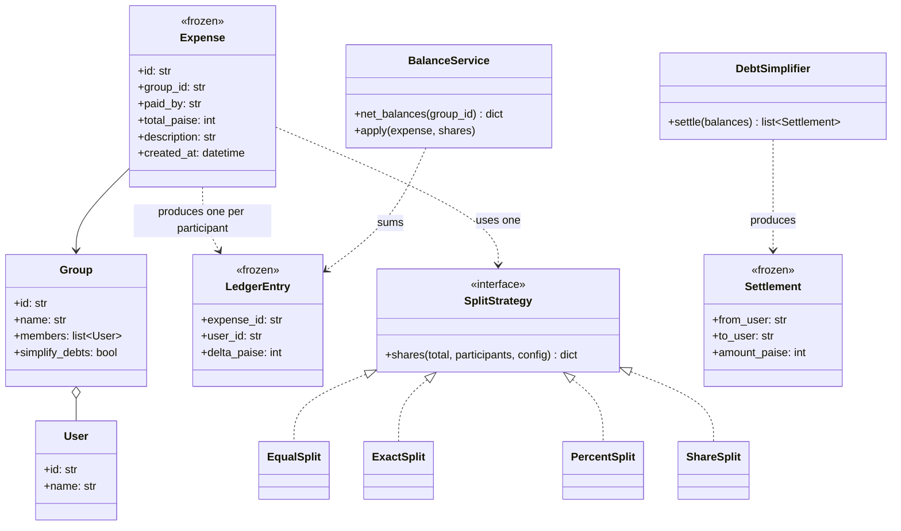

# Day 085 · System design — Design Splitwise

**After today you can:** You can model groups, expenses, splits and settlement, with the simplification algorithm.

**The interviewer asks it as:** *Design Splitwise. How do you minimise the number of transactions?*

---

## 1. What this is, and why they ask it

Splitwise records who paid for what and works out who owes whom. Six friends go on a trip; one pays
for the hotel, another for petrol, a third for dinner twice. At the end, everybody wants one number:
what do I owe, and to whom.

There are three real problems in that, and the prompt names the third.

**Splitting an expense** is not one rule but four — equally, by exact amounts, by percentage, by
shares — and the totals have to come out exact in a currency that does not divide by three.

**Tracking balances** means deciding whether "what Ravi owes Priya" is a number you store or a number
you compute, and both answers have consequences.

**Minimising transactions** is the interesting part. Six friends can owe each other across fifteen
different pairs, and the answer is that at most five payments settle everything. Getting from fifteen
to five is one clean idea, and knowing that the *true* minimum is NP-hard — so what you are writing is
a good heuristic and not an optimal algorithm — is what separates a strong answer from a confident
one.

They ask it because everybody has been in the group chat where this goes wrong, because the money
arithmetic has a real correctness trap in it, and because the simplification question has a
satisfying answer that most candidates get most of the way to and then overclaim about.

---

## 2. The story

Six of them went to Gokarna for four days, and the trouble started on the bus home.

Sandeep had paid for the rooms, because he booked them, and that was eleven thousand four hundred for
two rooms for three nights. Meera paid for the petrol, both ways, which came to about three thousand
two hundred with the tolls. Ravi paid for dinner on the first night and again on the third. Anjali
bought all the water and the snacks and a beach umbrella that nobody used. The other two had not paid
for anything and were slightly embarrassed about it.

Nobody had been keeping track, so the conversation on the bus was six people scrolling through their
phones reading out numbers, and every number changed the answer for everybody else.

Then it got worse, because they started settling in pairs. Ravi worked out that he owed Sandeep one
thousand nine hundred. Sandeep pointed out that he owed Ravi eight hundred and fifty for the dinners.
So they sat there for a while trying to send each other money in both directions before Meera said,
quite sharply, that Ravi should send eleven hundred and fifty and they should stop.

That was the first thing they learned. Two people owing each other is one payment, not two.

The second thing took Anjali until the next morning. She wrote out every pair — Ravi to Sandeep,
Ravi to Meera, Ravi to Anjali, Sandeep to Meera, and so on — and there were fifteen pairs, and
about nine of them had money moving. Nine payments to settle one weekend.

What she did instead was work out one number per person. Not what each pair owed each other — what
each *person* was up or down overall. Sandeep was up by a lot. Meera was up a bit. Ravi was roughly
even. The other three were down.

Then it was easy, and slightly obvious once she saw it. The three who were down pay the two who are
up, and you only need five payments, because each payment either finishes off somebody who is down or
finishes off somebody who is up, and there are only six people.

The one complaint came from Vinod, who was down four hundred and was told to send it to Meera. He
said, reasonably enough, that he had never taken anything from Meera in his life — he had eaten
Ravi's dinners. Anjali said it did not matter and the money comes out the same. Vinod said it
mattered to him.

---

## 3. The idea in plain English

Anjali's move — **stop tracking pairs and track one number per person** — is the whole algorithm. And
Vinod's complaint is the trade-off, which is real and which Splitwise takes seriously enough to make
simplification optional.

### Money is integers, and the remainder has to go somewhere

Before anything else. **Never use floating point for money.** Store paise as an integer; `0.1 + 0.2`
is not `0.3` in binary floating point, and a system that adds a hundred thousand of those is wrong in
a way nobody can trace.

Then the problem that integers do not solve for you:

```
 ₹1,000 split equally between 3 people
 = 100,000 paise / 3 = 33,333.33...

 33,333 × 3 = 99,999.  One paisa is unaccounted for.
```

You cannot leave it. If the shares do not sum to the total, the group's balances do not sum to zero,
and the error compounds with every expense. So the rule is: **compute the shares, then assign the
remainder deterministically.**

```python
    base, remainder = divmod(total_paise, len(participants))
    shares = {person: base for person in participants}
    for person in sorted(participants)[:remainder]:      # deterministic, not arbitrary
        shares[person] += 1
```

Sorted, so it is reproducible: the same expense recalculated gives the same shares, which matters when
an expense is edited and the balances are recomputed. Giving the remainder to the payer is also fine.
Giving it to "whoever comes first in a set" is not, because sets have no order and the answer changes
between runs.

**Assert the invariant.** `sum(shares.values()) == total_paise`, every time. It is one line and it
makes an entire class of money bugs impossible.

### Four ways to split, which is a genuine interface

```python
class SplitStrategy(Protocol):
    def shares(self, total_paise: int, participants: list[UserId], config: dict) -> dict[UserId, int]:
        ...
```

- **Equal** — divide by the count, distribute the remainder.
- **Exact** — the caller supplies an amount per person; validate that they sum to the total.
- **Percentage** — the caller supplies percentages; validate they sum to 100, then apply the same
  remainder rule.
- **Shares** — "Ravi eats twice as much": weights of 2, 1, 1 mean sixths.

Four real implementations, none hypothetical, so the interface passes the gate from
[day 076](../day-076-lru-cache/README.md) comfortably. And every one of them ends with the same
assertion that the parts sum to the whole.

### Balances: derive them, and then cache the derivation

An expense produces a set of **ledger entries**: the payer is owed, each participant owes their share.

```
 Sandeep pays ₹11,400 for a room shared equally by 6:
   Sandeep:  +11,400 - 1,900 = +9,500
   each of the other five:    -1,900
```

Now, does "Ravi owes Sandeep ₹1,900" get stored, or computed?

**Store the expenses; derive the balances.** The expense list is the truth — it is what actually
happened, it is what the user can see and edit, and it is auditable. A balance is a *derived* quantity,
and deriving it means summing every ledger entry for that user, which is O(expenses).

That is too slow to do on every screen, so you keep a **materialised balance** per (group, user),
updated in the same database transaction as the expense insert, and you run a periodic job that
recomputes balances from the ledger and alerts on any mismatch.

That combination is the honest answer: **the ledger is the source of truth, the balance is a cache,
and there is a reconciliation job because caches drift.** A design that stores only balances cannot
answer "why do I owe this?", and one that only derives cannot render a screen.

### Now the actual question: minimising transactions

**Step one: net out each person.** For each user in the group, add up everything they are owed and
subtract everything they owe. One number each.

```
 Sandeep  +9,500
 Meera    +1,800
 Ravi        +50
 Anjali   -2,300
 Vinod    -4,600
 Kiran    -4,450
 --------------
 sum          0     <- always, and a useful assertion
```

The sum of all net balances is **always zero**, because every rupee that one person is owed is a rupee
somebody else owes. Assert it.

This step alone does most of the work. Ravi and Sandeep owing each other in both directions collapses
into one number — Meera's sharp remark on the bus.

**Step two: match the biggest creditor with the biggest debtor, repeatedly.**

```python
    while creditors and debtors:
        creditor, owed = max(creditors)          # a max-heap in practice
        debtor, owes = max(debtors)
        amount = min(owed, -owes)
        record(debtor -> creditor, amount)
        # whichever is now zero drops out; the other keeps its remainder
```

Each payment **zeroes at least one person**, so with `k` people having a non-zero balance you need at
most `k − 1` payments. Six friends: at most five. Anjali's answer.

Compare with settling pairwise: `n(n−1)/2` possible pairs, and in this group nine of the fifteen had
money moving. **Nine payments become five**, and in a group of twenty it is up to 190 pairs against at
most 19 payments.

### The part most candidates overclaim

The greedy algorithm gives **at most `k − 1`** transactions. It does **not** always give the minimum.

The true minimum is smaller whenever a subset of people happens to net to exactly zero among
themselves — then that subset can be settled internally and separated from the rest. Finding the best
such partition is the **subset-sum / set-partition problem**, which is NP-hard. So the exact minimum
cannot be computed efficiently for large groups.

```
 balances: A +5, B +5, C -5, D -5
 greedy:   C pays A 5, D pays B 5   ->  2 transactions
 optimal:                              2 transactions   (same here)

 balances: A +3, B +2, C -5
 greedy:   C pays A 3, C pays B 2   ->  2 transactions  = k - 1 = 2, optimal

 the gap appears when zero-sum subsets exist and greedy splits them:
 balances: A +4, B +1, C -1, D -4
 greedy:   D pays A 4, C pays B 1   ->  2   (greedy happens to find it)
 a worse ordering could give 3.
```

**Say this.** "Greedy gives at most k−1 and is not guaranteed optimal, because the exact problem is
NP-hard" is a sentence that changes how the rest of the interview goes. Claiming the greedy is optimal
is the single most common mistake in this question.

### And Vinod's complaint, which is a design decision not a bug

Simplification **destroys provenance**. After it, Vinod owes Meera money for dinners he ate that Ravi
paid for. The arithmetic is right and the story is gone, and people mind — because a payment request
from someone you never transacted with looks like a mistake.

Real Splitwise makes simplification an **opt-in setting per group**, and that is the right answer:
it is a preference, not an optimisation, and the correct design keeps both views available because
the underlying ledger is still there.

---

## 4. The picture

The collapse from pairs to nets, which is the algorithm in one image:

```
 PAIRWISE — up to n(n-1)/2 = 15 edges for 6 people, 9 with money on them

        Sandeep
        /  |  \  \
   1900/   |1900\ \1900
      /    |     \  \
   Ravi--Meera--Anjali--Vinod--Kiran
      \850 /  \    ...        /
       \  /    \             /
        (money moving in BOTH directions between some pairs)

 NET — one number per person, and the sum is always zero

   Sandeep  +9,500     |    Anjali  -2,300
   Meera    +1,800     |    Vinod   -4,600
   Ravi        +50     |    Kiran   -4,450
   ------------------------------------------
   creditors +11,350   |    debtors -11,350

 SETTLE — biggest creditor against biggest debtor, repeatedly

   Vinod  -> Sandeep  4,600     (Vinod is done)
   Kiran  -> Sandeep  4,450     (Kiran is done)
   Anjali -> Sandeep    450     (Sandeep is done: 9,500 settled)
   Anjali -> Meera    1,800     (Meera is done)
   Anjali -> Ravi        50     (Anjali and Ravi are done)
   ------------------------------------------
   5 transactions for 6 people.  At most k - 1, always.
```

What to notice: **every single payment finishes somebody off.** That is the whole reason the bound is
`k − 1` rather than something larger, and it is the sentence to say when asked why.

The classes:



What to notice: `Expense` and `LedgerEntry` are **frozen**, and the balance is a *service* rather than
a field on `User`. The ledger is what happened; the balance is a conclusion drawn from it. That is the
same records-versus-rules line as the library's fines on
[day 082](../day-082-runner-technique/README.md).

---

## 5. How it actually works

### Move 1 · Clarify (minutes 0–5)

> **"Groups only, or also one-to-one expenses between friends?"** — Both; a one-to-one expense is a
> group of two, which keeps the model uniform.
> **"Which split types?"** — Equal, exact, percentage and shares.
> **"Multiple currencies?"** — Ask. If yes, every amount needs a currency and settlement across
> currencies needs a rate at a point in time, which is materially more design.
> **"Should the app simplify debts automatically?"** — The right answer is "make it a per-group
> setting", and saying why is worth more than either yes or no.

> "I will assume all amounts are in one currency stored as integer paise, that expenses can be edited
> and deleted, and that settlements are recorded rather than actually moving money — no payment gateway
> in scope."

### Move 2 · The nouns (minutes 5–12)

- **`User`**, **`Group`** — obvious, and `Group` carries the `simplify_debts` flag.
- **`Expense`** — frozen: who paid, how much, when, in which group.
- **`LedgerEntry`** — frozen: one per participant per expense, a signed delta. This is the truth.
- **`SplitStrategy`** *(interface)* — four implementations.
- **`BalanceService`** — nets the ledger, and maintains the materialised balances.
- **`DebtSimplifier`** — balances to a list of settlements.
- **`Settlement`** — frozen: from, to, amount.

Seven, one interface with four implementations. `DebtSimplifier` is a plain class, not an interface —
there is only one algorithm and I cannot name a second implementation anyone wants.

### Move 3 · Money, before anything else

```python
def equal_shares(total_paise: int, participants: list[str]) -> dict[str, int]:
    """Split as evenly as integers allow, then assign the remainder DETERMINISTICALLY."""
    if not participants:
        raise ValueError("no participants")
    base, remainder = divmod(total_paise, len(participants))
    shares = {person: base for person in participants}
    for person in sorted(participants)[:remainder]:
        shares[person] += 1
    assert sum(shares.values()) == total_paise      # the invariant, every time
    return shares
```

Three things worth narrating as you write them: **integers, never floats**; the remainder goes
somewhere **deterministic** so an edited expense recomputes identically; and the assertion, which
turns a whole family of silent money bugs into a loud failure.

### Move 4 · The ledger

```python
def record(expense: Expense, shares: dict[str, int]) -> list[LedgerEntry]:
    """One signed entry per participant. The payer is credited the whole amount
    and debited their own share, so the entries always sum to zero."""
    entries = [LedgerEntry(expense.id, expense.paid_by, +expense.total_paise)]
    entries += [LedgerEntry(expense.id, person, -share) for person, share in shares.items()]
    assert sum(e.delta_paise for e in entries) == 0
    return entries
```

**The entries for one expense always sum to zero**, which is the double-entry idea in one assertion.
It also means the sum of *all* balances in a group is always zero, which is the assertion the
simplifier starts from.

### Move 5 · The simplifier — the interesting part

```python
def simplify(balances: dict[str, int]) -> list[Settlement]:
    """Fewest-ish transactions to settle a group.

    Net each person first, then repeatedly match the largest creditor with the
    largest debtor. Each payment zeroes at least one person, so this produces at
    most k-1 settlements for k people with a non-zero balance.

    NOT guaranteed optimal: the true minimum requires finding zero-sum subsets,
    which is the set-partition problem and is NP-hard.
    """
    assert sum(balances.values()) == 0, "balances must net to zero"

    creditors = [(-amount, user) for user, amount in balances.items() if amount > 0]
    debtors = [(amount, user) for user, amount in balances.items() if amount < 0]
    heapq.heapify(creditors)         # min-heap of negatives = max-heap
    heapq.heapify(debtors)

    settlements: list[Settlement] = []
    while creditors and debtors:
        credit, creditor = heapq.heappop(creditors)
        debit, debtor = heapq.heappop(debtors)
        amount = min(-credit, -debit)
        settlements.append(Settlement(debtor, creditor, amount))

        if -credit > amount:
            heapq.heappush(creditors, (credit + amount, creditor))
        if -debit > amount:
            heapq.heappush(debtors, (debit + amount, debtor))

    return settlements
```

Two heaps, because "largest creditor" and "largest debtor" have to be found repeatedly. Python's
`heapq` is a min-heap, so amounts are negated — worth saying, because it looks like a bug otherwise.

**Say the two claims separately.** At most `k − 1` settlements, because each payment zeroes somebody.
And not necessarily the minimum, because the exact problem is NP-hard.

### Move 6 · The concurrency question

Two people add an expense to the same group at the same moment.

```sql
BEGIN;
  INSERT INTO expenses (...);
  INSERT INTO ledger_entries (...);                      -- several rows
  UPDATE balances SET net_paise = net_paise + $delta
   WHERE group_id = $g AND user_id = $u;                 -- read-modify-write, in SQL
COMMIT;
```

The important detail is `net_paise = net_paise + $delta` **inside the UPDATE**, not read-then-write in
application code. The database applies the delta atomically under a row lock, so two concurrent
expenses both land. Reading the balance into Python, adding, and writing it back is the classic lost
update, and it loses money.

### Real systems

- **Splitwise** itself makes "simplify debts" a per-group toggle, exactly because of Vinod's
  complaint. Their published description of the feature emphasises that the totals are unchanged.
- **Double-entry bookkeeping** is the model here and is four hundred years old: every transaction
  produces entries that sum to zero, and balances are derived. Ledger systems — **Stripe**,
  **Modern Treasury**, **TigerBeetle** — are all built on it, and none of them store a balance as the
  primary truth.
- **Integer minor units** are universal for money: Stripe's API is in the smallest currency unit,
  `java.math.BigDecimal` and Python's `decimal` exist for the cases where fractions of a paisa
  genuinely matter, and floating point is used by nobody who has been burned once.
- **The banker's-rounding question** appears in payroll and tax systems for the same reason as the
  remainder here, and the answer is the same: pick a deterministic rule and assert the total.

---

## 6. The numbers

### Pairwise against netted

```
 n people, worst case pairwise debts:  n(n-1)/2
   n = 6:    15 possible pairs   (9 with money moving, in the trip)
   n = 20:  190 possible pairs
   n = 50: 1,225 possible pairs

 after netting and greedy settlement:  at most k - 1  (k = people with non-zero balance)
   n = 6:     5 transactions
   n = 20:   19 transactions
   n = 50:   49 transactions
```

```
 n = 20:  190 -> 19,  a 10x reduction
 n = 50:  1,225 -> 49, a 25x reduction
```

**The saving grows with the group**, because pairs grow quadratically and settlements grow linearly.
That is the number to lead with.

### The rounding leak, which is the correctness argument

```
 one paisa dropped per 3-way split
 50,000,000 expenses on the platform
 -> 500,000 rupees unaccounted for, and every group's balances fail to sum to zero
```

Five lakh, from one missing line. And the damage is not the money — it is that balances stop summing
to zero, so the simplifier's assertion fires, or worse, does not and produces settlements that leave
residue. **Assign the remainder and assert the total.**

### Scale

```
 users              10,000,000
 groups              3,000,000
 expenses               50,000,000 total, ~40,000/day
 average group size          5
 ledger entries     50,000,000 × 5  =  250,000,000

 Expense row     ~120 B × 50M   =   6 GB
 LedgerEntry row  ~48 B × 250M  =  12 GB
 Balance row      ~40 B × 15M   = 600 MB
 ------------------------------------------
 total                          ≈  19 GB
```

Nineteen gigabytes fits on one database server comfortably. **This is not a scale problem**, and
saying so keeps the interview on the parts that matter — the money arithmetic and the simplification.

### Deriving a balance, and why it needs a cache

```
 a heavy group: 8 members, 400 expenses over two years
 deriving one user's balance: sum 400 × 8 = 3,200 ledger rows
 at ~1 µs per row from a warm index:  ~3 ms
 the home screen shows balances for ALL of a user's groups, say 12
 -> 36 ms of pure summation per screen load, per user
```

Thirty-six milliseconds is not fatal and it is not free, and it is entirely wasted work because the
answer changes only when an expense changes. Hence a materialised balance updated in the same
transaction, and a nightly reconciliation that recomputes from the ledger and alerts on drift.

### The simplifier's cost

```
 k people with a non-zero balance
 heapify:            O(k)
 each settlement:    2 pops + up to 2 pushes  =  O(log k)
 settlements:        at most k - 1
 -----------------------------------------------
 total:              O(k log k)

 k = 50:  ~300 heap operations, microseconds
```

Nothing. The algorithm is cheap and the interesting question about it is correctness, not speed —
which is worth saying, because it steers the follow-up to the NP-hardness point rather than to
optimisation.

---

## 7. The trade-offs

### What this design gives up

**Simplification destroys provenance, and users notice.** After it, Vinod owes Meera for dinners Ravi
paid for. The totals are right; the story is gone. That is why it must be a per-group setting rather
than always-on, and why the ledger has to survive underneath so the unsimplified view is still
available. A design that simplifies destructively — overwriting the ledger with the settlements —
cannot answer "why?" and cannot be undone.

**Greedy is not optimal and I would not claim it is.** The exact minimum requires finding subsets that
net to zero, which is set-partition and NP-hard. For a group of six the difference is usually zero or
one transaction; for fifty it could be more. The honest position: `k − 1` is a good bound, it is
achieved in one pass, and the exact optimum is not worth exponential time to save one payment.

**Materialised balances can drift.** Any bug in the update path, any expense edited outside the
transaction, any partial failure, and the balance disagrees with the ledger. That is why the
reconciliation job is part of the design rather than an operational afterthought — and why the ledger,
not the balance, is what the app shows when they disagree.

**Editing and deleting expenses is harder than it looks.** An edit is not an update; it should be a
reversing set of ledger entries plus a new set, so history is preserved and the balance moves by the
difference. Overwriting the original entries makes the audit trail lie, and makes a concurrent edit
lose data.

**One currency.** Multi-currency turns every amount into an amount-plus-currency, and settlement
across currencies needs a rate *at a point in time* which then has to be stored with the settlement,
or the same debt is worth different amounts on different days. That is a genuinely bigger design and I
would scope it out explicitly rather than hand-wave it.

**Partial settlements and disputes.** Someone pays half. Someone says they already paid in cash.
Both are just more ledger entries — a settlement is an expense with one payer and one participant —
which is a nice property of the model, and worth pointing at.

### "I would change this design if..."

- **...groups get very large** — a shared house of 50, or an office lunch group. Then deriving is too
  slow to fall back on and the reconciliation job needs to be incremental rather than a full recompute.
- **...money actually moves.** A payment gateway makes settlements real transactions, which brings
  idempotency keys, reversals and the whole failure model from the ATM on
  [day 080](../day-080-dummy-head/README.md).
- **...multiple currencies are required.** Store the currency with every amount, never convert on
  write, and freeze the rate onto each settlement.
- **...users want the story preserved.** Then simplification is a *view* rendered on demand rather
  than a stored set of settlements, and the pairwise debts stay derivable.

### The honest concession

The design's centre is a very old idea — **double-entry bookkeeping** — and almost everything good
about it follows from one decision: the ledger is the truth and the balance is derived. The
simplification algorithm is a small, cheap piece of graph arithmetic on top, and it is the part
everybody talks about because it is the part that looks clever. If I had to defend one decision, it
would not be the simplifier; it would be that expenses and ledger entries are immutable, because that
is what makes edits, disputes, reconciliation and "why do I owe this?" all answerable.

---

## 8. In the interview

### How it gets asked

- The standard: *"Design Splitwise."* Then, quickly: *"How do you minimise the number of
  transactions?"*
- The arithmetic probe, which is a trap: *"Three people split a thousand rupees. What do you store?"*
- The modelling probe: *"Do you store balances, or compute them?"*
- The correctness probe: *"Two people add an expense to the same group at the same moment."*
- The one that separates people: *"Is your simplification optimal?"*

### The timed script

**Minutes 0–5 · Clarify.** Groups and one-to-one? Which split types? Multiple currencies? Should
simplification be automatic — and answer that one yourself as "a per-group setting, and here is why".

**Minutes 5–10 · Money first.** Integer paise, never floats. The three-way split remainder, the
deterministic assignment, and the assertion. This takes two minutes and it is the correctness
foundation for everything after.

**Minutes 10–18 · The model.** Expense and LedgerEntry, both immutable, entries summing to zero per
expense. `SplitStrategy` with its four implementations. Balances derived, materialised, reconciled.

**Minutes 18–30 · The deep dive: simplification.** Net each person, assert the sum is zero, greedy
match by two heaps, the `k − 1` bound with *why*, and the NP-hardness caveat.

**Minutes 30–36 · Provenance and the setting.** Vinod's complaint, and why it makes simplification a
preference rather than an optimisation.

**Minutes 36–40 · Failure and scale.** The concurrent-expense update, the reconciliation job, and the
19 GB figure that says this is not a scale problem.

### The follow-ups

**"Three people split a thousand rupees. What do you store?"**
"Integer paise — 100,000 — never a float, because binary floating point cannot represent a tenth and a
system that adds a hundred thousand of those is wrong in a way nobody can trace. Then 100,000 divided
by three is 33,333 with a remainder of one paisa, and that paisa has to go somewhere deterministic —
I sort the participant ids and give it to the first, or give it to the payer. Deterministic matters
because an edited expense gets recomputed, and the same input must give the same shares. And I assert
that the shares sum to the total, every time. Without that, balances stop summing to zero and every
downstream calculation is quietly wrong."

**"Do you store balances or compute them?"**
"Both, and the order matters. The expenses and their ledger entries are the source of truth — they are
what happened, they are what the user can see and edit, and they are immutable. A balance is derived
by summing ledger entries, which for a heavy group is a few thousand rows and a few milliseconds; the
home screen needs a dozen of those, so I materialise the balance per group and user and update it in
the same database transaction as the expense. And then a reconciliation job recomputes from the ledger
periodically and alerts on any mismatch, because a cache that nobody checks eventually lies. If they
ever disagree, the ledger wins."

**"How do you minimise the number of transactions?"**
"Two steps. First, net everybody out: one number per person instead of a debt per pair. That alone
collapses two people owing each other in both directions into one payment, and it turns up to
n-times-n-minus-one-over-two pairs into n numbers. Second, repeatedly match the largest creditor with
the largest debtor and settle the smaller of the two amounts, using two heaps. Every payment zeroes at
least one person, so for k people with a non-zero balance you need at most k−1 payments. Six friends:
at most five, against fifteen possible pairs. Twenty people: nineteen against a hundred and ninety."

**"Is that optimal?"**
"No, and I would not claim it is. It gives at most k−1, which is a good bound and achieved in one
pass. But the true minimum can be lower whenever a subset of people happens to net to zero among
themselves — that subset can be settled internally and cut out of the rest. Finding the best such
partition is the set-partition problem, which is NP-hard, so there is no efficient exact algorithm for
large groups. In practice the greedy is within a transaction or two, and I would not spend exponential
time to save one payment."

**"A user complains they are being asked to pay someone they never borrowed from."**
"That is the real cost of simplification and it is not a bug — the arithmetic is right and the story
is gone. Which is why it should be a per-group setting rather than always on, and why the ledger must
survive underneath so the unsimplified view is still available. Splitwise does exactly this. The
design consequence is that simplification produces a *view* or a set of suggested settlements, and
never overwrites the ledger."

**"Two people add an expense to the same group at the same instant."**
"The expense inserts are independent and both land. The risk is the materialised balance, and the fix
is to write the update as `net = net + delta` inside the SQL rather than reading the balance into
application code, adding, and writing it back — that is the classic lost update and it loses money.
With the arithmetic in the UPDATE, the database applies both deltas atomically under a row lock. And
because the ledger is the truth, the reconciliation job will catch it even if something goes wrong."

**"What if someone edits or deletes an expense?"**
"Not an update — a reversal plus a new expense. I would write reversing ledger entries for the
original, then entries for the new version, so history is preserved, the audit trail is honest, and
the balance moves by the difference rather than being recomputed and hoped for. It also makes
concurrent edits safe, because two reversals and two new sets of entries all commute, whereas two
overwrites do not."

### A model answer

Asked: *design Splitwise. How do you minimise the number of transactions?*

> "Let me do the money arithmetic first, because it is the correctness foundation and it takes two
> minutes.
>
> Everything is integer paise. Never floating point — binary floating point cannot represent a tenth,
> and a system that adds a hundred thousand of those is wrong in a way that is untraceable. And then
> the problem integers do not solve: a thousand rupees between three people is 100,000 paise divided by
> three, which is 33,333 with one paisa left over. That paisa has to be assigned somewhere
> deterministic — sorted participant order, or the payer — because an edited expense will be
> recomputed and must give the same answer. And I assert that the shares sum to the total. Without
> that assertion, balances stop summing to zero, and at fifty million expenses a dropped paisa per
> three-way split is about five lakh unaccounted for.
>
> The model is double-entry bookkeeping. An `Expense` is immutable — who paid, how much, when, in which
> group. It produces one immutable `LedgerEntry` per person: the payer credited the full amount, each
> participant debited their share. The entries for one expense always sum to zero, which I assert too,
> and that is what makes every group's balances sum to zero.
>
> How the shares are computed varies four ways — equal, exact amounts, percentages, and shares like
> 'Ravi eats twice as much' — so that is an interface with four real implementations, and each ends
> with the same total assertion.
>
> Balances are *derived* by summing ledger entries. The ledger is the truth; the balance is a
> conclusion. But deriving is a few thousand rows for a heavy group, and the home screen wants a dozen
> groups at once, so I materialise the balance per group and user and update it in the same transaction
> as the expense — with the arithmetic written as `net = net + delta` inside the SQL, not read-modify-write
> in application code, which is the classic lost update. And a reconciliation job recomputes from the
> ledger periodically, because a cache nobody checks eventually lies.
>
> Now the question. Six people can owe each other across fifteen pairs, and on a real trip about nine
> of those have money moving. Two steps take it to five.
>
> Step one: net everybody out. One number per person instead of a number per pair. This alone collapses
> two people owing each other in both directions into a single payment.
>
> Step two: repeatedly match the largest creditor with the largest debtor and settle the smaller of the
> two amounts — two heaps, O(k log k) overall, microseconds. **Every payment zeroes at least one
> person, so for k people with a non-zero balance you need at most k−1 payments.** Six people, five
> payments. Twenty people, nineteen instead of up to a hundred and ninety.
>
> One thing I want to be precise about: that is at most k−1, and it is **not guaranteed optimal.** The
> true minimum is smaller whenever some subset of people nets to zero among themselves, because that
> subset can be settled internally and separated. Finding the best partition is the set-partition
> problem, which is NP-hard, so there is no efficient exact algorithm. The greedy is a good heuristic
> and I would not spend exponential time to save one payment.
>
> And the cost that is not arithmetic: simplification destroys provenance. After it, someone is asked
> to pay a person they never transacted with, and users mind, because it looks like a mistake. So
> simplification should be a per-group setting, and it must produce suggested settlements rather than
> overwriting the ledger — which the immutable ledger makes easy.
>
> On scale: ten million users, fifty million expenses, a quarter of a billion ledger entries is about
> nineteen gigabytes. That fits on one server. This is not a scale problem, and I would rather spend
> the remaining time on the money arithmetic and the edit path, because that is where the bugs are."

---

## 9. Recall card

- **Money is integer paise, never floats — and the remainder must be assigned deterministically.**
  ₹1,000 ÷ 3 = 33,333 paise each with **one paisa left over**; sort the participants and give it to
  the first (or to the payer), then **assert `sum(shares) == total`**. A dropped paisa per 3-way split
  across 50M expenses is **₹5 lakh** and, worse, balances stop summing to zero.
- **Double entry: the ledger is the truth, the balance is derived.** `Expense` and `LedgerEntry` are
  **immutable**, the entries for one expense **sum to zero**, and every group's balances therefore sum
  to zero. Materialise balances for speed, update them with `net = net + delta` **inside the SQL** (not
  read-modify-write), and run a **reconciliation job** — if they disagree, the ledger wins. An edit is
  a **reversal plus a new expense**, never an overwrite.
- **Minimising transactions is two steps.** *Net each person* — one number instead of a debt per pair,
  which alone collapses mutual debts. Then *repeatedly match the largest creditor with the largest
  debtor* with two heaps, O(k log k). **Every payment zeroes at least one person, so at most k − 1
  payments**: 6 people → **5**, against **15** possible pairs; 20 people → **19** against **190**.
- **Say it is NOT optimal.** The exact minimum needs zero-sum subsets found and separated, which is the
  **set-partition problem — NP-hard**. "At most k−1, in one pass, not guaranteed minimal" is the strong
  answer; claiming optimality is the most common mistake in this prompt.
- **Simplification destroys provenance, and that is a design decision not a bug** — you end up owing
  someone you never transacted with. Make it a **per-group setting**, produce **suggested settlements**
  rather than overwriting the ledger, and keep the unsimplified view derivable. Scale is a non-issue:
  10M users and 250M ledger entries ≈ **19 GB**, so spend the interview on the arithmetic and the edit
  path.
