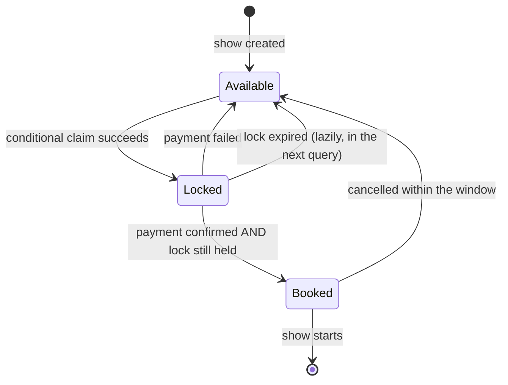
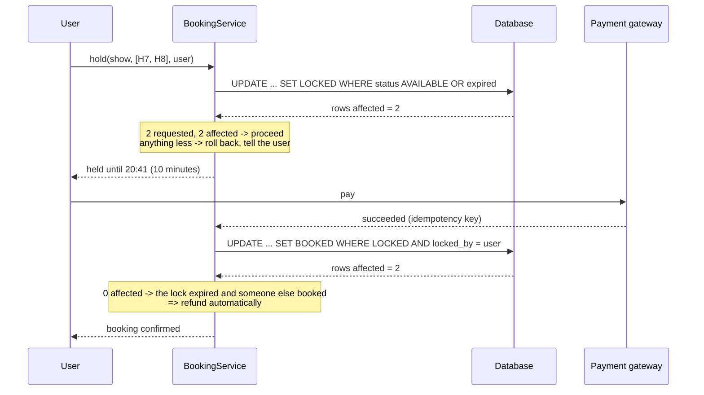

# Day 086 · System design — Design BookMyShow

**After today you can:** You can model shows, seats and the booking lock that stops double-selling a seat.

**The interviewer asks it as:** *Design BookMyShow. Two users click the same seat at the same moment.*

---

## 1. What this is, and why they ask it

BookMyShow lists films, cinemas and showtimes, draws a seat map, and lets you book seats. The catalogue
half is straightforward. The prompt names the half that is not: **two users click seat H7 for the same
show at the same instant, and exactly one of them must get it.**

Two ideas carry the design.

**A seat is two things.** H7 is a physical seat in screen 3, and it is also "H7 for the 9:30 show on
Friday" — which is available or not, independently of H7 at every other show. Those are different
objects, and merging them makes the whole problem unexpressible. It is the same title-versus-instance
split as the library's `Book` and `BookItem` on [day 082](../day-082-runner-technique/README.md).

**Selecting a seat is not booking it.** Between choosing a seat and paying there is a gap of minutes,
and during that gap the seat must be held for you and must not be held for ever. That is a **lock with
an expiry**, and getting its two halves right — the claim being atomic, and the expiry being
automatic — is the whole interview.

They ask it because everyone has used it, because the race is easy to state and easy to get subtly
wrong, and because the follow-ups are unusually good: what if the payment fails, what if the user
closes the tab, what happens when a hundred thousand people open the same seat map in the same second.

---

## 2. The story

The Alankar has been running four shows a day since 1978, and until about ten years ago the whole thing
was managed on one board behind the counter.

It is a big black board with two hundred and forty little squares chalked on it — twelve rows of
twenty — and it is wiped and redrawn between every show. When somebody buys a seat, the man at the
counter puts a cross in that square.

There are two windows, because on a Friday one window is not enough. And for years those two windows
shared that one board, which worked until it did not.

What went wrong was always the same thing, maybe once a month. Two people, one at each window, ask for
the same two seats at almost the same moment. Both clerks look at the board. Both squares are empty.
Both clerks take the money, and both put a cross in the same square, and the second cross goes on top
of the first and looks exactly like one cross. Nobody finds out until eight o'clock, when two families
are standing in row H arguing in front of everybody.

Ratnamma, who has run the place since her husband died, fixed it with a duster.

There is one duster. Whoever is holding it may mark the board, and the other one waits. It takes four
seconds and it has not happened since.

The second thing took her longer to see. People would ask for seats and then say wait, I will get the
money from the car, and go. The clerk would leave those squares empty, because the sale was not done,
and somebody else would buy them, and then the first man would come back with his money and there
would be a row about it.

So now the clerk draws a small circle instead of a cross. A circle means somebody is coming back. And
the rule — this is the part Ratnamma is strict about — is that a circle gets rubbed out at the interval
bell of the previous show. If he is not back by then, the seat is empty again and anybody may have it.

She says people always understand the circle. What they will not accept is being told a seat is gone
when nobody is sitting in it.

---

## 3. The idea in plain English

The duster is the atomic claim. The circle is the lock. The interval bell is the expiry. Ratnamma
solved this in the 1990s and the design has not changed.

### A seat is two things

- **`Seat`** — a physical seat in a screen. Row H, number 7, screen 3, seat type (recliner, regular),
  and that is all. It exists whether or not there is a show.
- **`ShowSeat`** — that seat, for that show. It has a **status** — available, locked, booked — and a
  price, because the same seat costs more on a Saturday night.

One `Seat` produces one `ShowSeat` per show. A 200-seat screen with 5 shows a day produces 1,000
`ShowSeat` rows a day.

The payoff, in one sentence: **the seat map you draw is a `ShowSeat` query, and the thing you lock is
a `ShowSeat` row.** If you tried to lock a `Seat`, you would block that seat for every show in the
building.

### Selecting is not booking

The naive flow is: user picks seats, user pays, seats are marked booked. It has an obvious hole — the
seats are unprotected during the payment, which takes minutes — and the fix is a middle state:

```
 AVAILABLE  --select-->  LOCKED (with an expiry)  --payment ok-->  BOOKED
                                |
                                +--payment fails, or the expiry passes--> AVAILABLE
```

Three states, and both arrows out of `LOCKED` are required. Ratnamma's circle, and the interval bell.

The expiry is not a nicety. Without it, every abandoned checkout removes seats from sale for ever, and
on a busy Friday that is most of the auditorium. **A lock with no expiry is a leak.**

### The race, stated precisely

Two users, one seat. Both browsers loaded the seat map ten seconds ago; both show H7 as available. Both
click. Both requests arrive at the server within a millisecond of each other.

The mistake is to check and then act:

```python
    seat = db.get(show_id, "H7")
    if seat.status == "AVAILABLE":       # both requests see AVAILABLE here
        seat.status = "LOCKED"           # and both write it
        db.save(seat)
```

Both succeed. Two people own H7. **Check-then-act is not atomic**, and it is the same shape as the
parking spot on [day 078](../day-078-nodes-and-links/README.md) and the shipped order on
[day 073](../day-073-queues/README.md).

The fix is one statement that checks *and* claims:

```sql
UPDATE show_seats
   SET status = 'LOCKED', locked_by = :user, locked_until = :now_plus_10_min
 WHERE show_id = :show
   AND seat_id IN (:seats)
   AND (status = 'AVAILABLE'
        OR (status = 'LOCKED' AND locked_until < :now));   -- expired locks count as free
```

Then **check the affected row count**. If you asked for four seats and it reports four, you have them.
If it reports three, somebody took one and you must roll back and tell the user. That row count is the
whole mechanism.

### All four seats, or none

A family booking four seats must get four or nothing. Three seats plus an apology is a worse product
and, worse, two users each holding a partial set can block each other indefinitely.

Two rules make it safe:

**One statement, one transaction.** The `UPDATE … WHERE seat_id IN (…)` above claims all of them or
you roll back. Not four separate updates.

**A fixed order, if you must take row locks.** If the implementation ends up locking rows one at a
time — `SELECT … FOR UPDATE` — always order by seat id. Two transactions taking the same rows in
opposite orders is a textbook deadlock, and the database will resolve it by killing one of them, which
the user sees as a random failure.

### Expiry: lazy, not scheduled

There are two ways to make locks expire.

**A background job** that sweeps expired locks back to available every minute. It works, and it means
correctness depends on a scheduler running — if it stops, seats silently stay locked.

**Lazily**, by treating an expired lock as available *in the query itself* — the `OR (status =
'LOCKED' AND locked_until < now)` clause above. Nothing has to run. A lock that expired an hour ago is
just as claimable as one that expired a second ago.

**Prefer lazy.** The sweeper then becomes an optimisation for the seat *map* — so the display does not
show stale locks — rather than something correctness depends on. Saying which one is load-bearing is
the kind of distinction that reads as experience.

### Where the lock lives: the database or Redis

Both are defensible and the trade is worth stating.

**In the database**, as a status column on `ShowSeat`. One source of truth, the lock and the booking
are in the same transaction, and nothing can drift. Slower — every claim is a write to the primary —
and hot rows for a blockbuster show all sit in one place.

**In Redis**, as `SET show:123:H7 user42 NX EX 600` — set if not exists, expiring in ten minutes.
Extremely fast, and expiry is free. But now there are two systems, and a Redis failure or a
lock-expiring-mid-payment leaves them disagreeing: Redis says free, the database says booked, or the
reverse.

**Use the database for the seat state, and Redis only if you measure that you need it** — and if you
do, the database remains the authority and the final booking is still a conditional update. The
sentence to say: *the lock may live in Redis, but the truth must live where the booking lives.*

### Payment, and the two failures that matter

```
 lock 4 seats (10 minute expiry)
   -> user pays
        -> payment succeeds -> UPDATE ... SET status='BOOKED' WHERE locked_by = :user
        -> payment fails     -> release: back to AVAILABLE
        -> payment times out -> do nothing; the lock expires on its own
```

Two subtleties.

**The confirming update must also be conditional** — `WHERE status = 'LOCKED' AND locked_by = :user`.
Otherwise a payment that arrives after the lock expired, and after somebody else booked the seat,
overwrites their booking. That is the worst failure in the system: a customer with a valid ticket loses
their seat.

**If the payment succeeds and the lock has expired, you owe a refund**, and it must be automatic. This
is the ATM's problem from [day 080](../day-080-dummy-head/README.md) in a different costume: the money
moved and the goods did not, so reverse it. Keeping the lock window comfortably longer than the payment
timeout makes it rare; it does not make it impossible.

---

## 4. The picture

The two ideas of "a seat", drawn:

```
  Seat (physical, in a screen)          ShowSeat (that seat, for that show)
  +------------------------+           +----------------------------------+
  | screen 3, row H, no. 7 |---------->| show 9:30 Fri | AVAILABLE | ₹250 |
  | type: RECLINER         |     |     +----------------------------------+
  +------------------------+     +---->| show 6:30 Fri | BOOKED    | ₹250 |
                                 |     +----------------------------------+
                                 +---->| show 9:30 Sat | LOCKED    | ₹350 |
                                       +----------------------------------+

  the seat map you DRAW is a ShowSeat query
  the thing you LOCK is a ShowSeat row
  locking the Seat would block it for every show in the building
```

The state machine for one `ShowSeat`, which is the design:



What to notice: **two different arrows go from `Locked` back to `Available`**, and only one of them is
an action anybody takes. The other happens by the passage of time and is evaluated lazily, which means
nothing has to be running for it to be correct.

The race, and the fix:

```
  WRONG — check, then act

  user A                      database                     user B
    |  SELECT H7 -----------> AVAILABLE
    |                                    <----------------- SELECT H7
    |                          AVAILABLE ----------------->
    |  UPDATE -> LOCKED (A) -->
    |                                    <----------------- UPDATE -> LOCKED (B)
                              LOCKED by B     both users think they hold H7


  RIGHT — one statement that checks and claims

  user A                      database                     user B
    |  UPDATE ... WHERE status='AVAILABLE' -->  1 row  (A wins)
    |                          <-------------- UPDATE ... WHERE status='AVAILABLE'
    |                                          0 rows (B loses, and KNOWS it)

  the affected row count IS the answer
```

And the whole booking flow:



---

## 5. How it actually works

### Move 1 · Clarify (minutes 0–5)

> **"Just the booking flow, or the catalogue and search too?"** — Focus on booking; the catalogue is
> ordinary CRUD.
> **"Can a user book several seats in one go?"** — Yes, and it must be all-or-nothing.
> **"How long do we hold seats during payment?"** — Ask, and propose ten minutes. This number is the
> whole design's main tuning knob.
> **"Is cancellation allowed?"** — Ask; it adds a transition back from `BOOKED`.

> "I will assume one seat is one ticket, that prices are per show-and-seat-type, and that payment is an
> external gateway behind an interface. I am not designing search, recommendations, or the seat-map
> rendering."

### Move 2 · The nouns (minutes 5–12)

- **`Cinema`**, **`Screen`** — a building and an auditorium.
- **`Seat`** — physical: screen, row, number, type. No status.
- **`Show`** — a film, on a screen, at a time.
- **`ShowSeat`** — the seat for that show: status, price, `locked_by`, `locked_until`. **This is the
  row everything happens to.**
- **`Booking`** — a user, a show, a set of seats, an amount, a state.
- **`Payment`** — an attempt with an idempotency key and an outcome.
- **`BookingService`** — hold, confirm, release. Holds no rules beyond sequencing.
- **`PricingPolicy`** *(interface)* — seat type × show time → amount. Weekend surge and matinee
  discounts are real second implementations.

Eight, one interface. Note what is absent: no `SeatLock` class, because the lock is a *state* of a
`ShowSeat` rather than a separate object — and inventing a lock entity is how people end up with two
sources of truth.

### Move 3 · The claim, which is the whole design

```python
def hold(self, show_id: str, seat_ids: list[str], user_id: str, now: datetime) -> Hold:
    """Claim seats atomically. Either all of them, or none.

    The WHERE clause both checks and claims, so there is no window between
    them. The affected row count is the answer: fewer rows than requested
    means somebody else won a seat, and we roll back the whole thing.
    """
    expires = now + self.HOLD_DURATION                  # 10 minutes
    with self._db.transaction():
        affected = self._db.execute(
            """
            UPDATE show_seats
               SET status = 'LOCKED', locked_by = %s, locked_until = %s
             WHERE show_id = %s
               AND seat_id = ANY(%s)
               AND (status = 'AVAILABLE'
                    OR (status = 'LOCKED' AND locked_until < %s))
            """,
            user_id, expires, show_id, seat_ids, now,
        )
        if affected != len(seat_ids):
            raise SeatsUnavailable(f"{len(seat_ids) - affected} of your seats were just taken")
        return Hold(show_id, seat_ids, user_id, expires)
```

Three things to narrate while writing this, because each is a decision:

**One statement, not a loop.** Four separate updates can partially succeed and leave two users each
holding two seats of a four-seat block, blocking each other until both expire.

**Expired locks are claimable in the `WHERE` clause.** No sweeper is required for correctness.

**The exception rolls the transaction back**, so a partial claim never persists. The user sees "those
seats have just gone", which is the honest message.

### Move 4 · Confirming, and the conditional that prevents the worst bug

```python
def confirm(self, hold: Hold, payment: Payment, now: datetime) -> Booking:
    with self._db.transaction():
        affected = self._db.execute(
            """
            UPDATE show_seats
               SET status = 'BOOKED', booking_id = %s
             WHERE show_id = %s AND seat_id = ANY(%s)
               AND status = 'LOCKED' AND locked_by = %s
            """,
            payment.booking_id, hold.show_id, hold.seat_ids, hold.user_id,
        )
        if affected != len(hold.seat_ids):
            self._payments.refund(payment, reason="hold expired before confirmation")
            raise HoldExpired("your hold expired; you have been refunded")
        ...
```

**`AND status = 'LOCKED' AND locked_by = user`** is the line that stops the worst failure in the whole
system: a payment that arrives late, after the lock expired and somebody else booked, must not
overwrite their booking. Without that clause, a customer with a valid ticket silently loses their
seat, and they find out in row H at eight o'clock.

And when it does fire, the refund is **automatic**, not a support ticket — the same
money-moved-goods-did-not shape as the ATM.

### Move 5 · Reading the seat map

```python
def seat_map(self, show_id: str, now: datetime) -> list[SeatView]:
    """Expired locks are displayed as available, because they ARE available."""
    return self._db.query(
        """
        SELECT seat_id, seat_type, price_paise,
               CASE WHEN status = 'BOOKED' THEN 'BOOKED'
                    WHEN status = 'LOCKED' AND locked_until >= %s THEN 'LOCKED'
                    ELSE 'AVAILABLE' END AS display_status
          FROM show_seats WHERE show_id = %s
        """,
        now, show_id,
    )
```

The same lazy-expiry rule applied to reads, so the display and the claim agree. And this query is
**cacheable for a few seconds** — the map is read enormously more often than it is written, and a
five-second stale map is fine because the claim is authoritative anyway. **Being wrong on the display
is cheap; being wrong on the claim is not.** That asymmetry is what makes this system scalable.

### Real systems

- **BookMyShow, Ticketmaster and airline seat maps** all work this way: a temporary hold with a visible
  countdown, then payment, then confirmation. The visible timer is deliberate — it makes the expiry a
  feature the user understands rather than a surprise.
- **`SELECT … FOR UPDATE`** is the row-lock version, and it is why lock ordering matters: two
  transactions taking the same rows in different orders deadlock, and Postgres resolves it by killing
  one with `deadlock detected`.
- **Redis `SET key value NX EX seconds`** is the distributed-lock primitive, and **Redlock** is the
  multi-node version — which its own author notes is not safe for correctness-critical locks without
  fencing tokens. Worth naming, and worth not depending on for money.
- **Idempotency keys** on the payment, exactly as in the ATM: the gateway must recognise a retry rather
  than charging twice.
- **Virtual waiting rooms** — the queue page you see for a big concert — exist because the seat map
  itself falls over when a hundred thousand people arrive at once. That is an admission-control
  answer, not a locking answer.

---

## 6. The numbers

### The size of the inventory

```
 cinemas               8,000
 screens per cinema        3       ->  24,000 screens
 seats per screen        200       ->   4.8 M physical seats
 shows per screen/day      5       ->  120,000 shows/day
 ShowSeat rows/day  = 120,000 × 200  =  24,000,000 rows per day
```

```
 ShowSeat row: show_id 16 B + seat_id 8 B + status 1 B + price 4 B
               + locked_by 16 B + locked_until 8 B + overhead  ≈ 80 B
 24 M × 80 B = 1.9 GB per day of seat rows
 kept for 90 days: ~170 GB
```

**Twenty-four million rows a day**, which is why `ShowSeat` rows are generated per show and archived
after the show — not kept for ever. That is a real design conclusion from arithmetic: the physical
seats are five million and permanent; the show-seats are twenty-four million a day and disposable.

### The traffic, and where it actually hurts

```
 average: 500,000 bookings/day  =  ~6 bookings/second
 seat-map views: 30 views per booking  =  180 views/second

 blockbuster opening, first minute:
   100,000 users on ONE show's seat map
   -> 100,000 reads/second on ~200 rows
   -> and perhaps 3,000 claim attempts/second on those same rows
```

The asymmetry is the whole scaling story:

```
 reads:   100,000/s, on data that may be a few seconds stale     -> CACHE
 writes:  3,000/s,   on data that must be exactly right          -> the database
```

**Reads outnumber writes by about thirty to one normally and thirty thousand to one at a peak.** So
cache the seat map aggressively with a short TTL and never cache the claim. A stale map shows a seat
as free that has just gone, and the user's claim fails with an honest message — which is exactly the
failure you can afford.

### The race window, quantified

```
 without a conditional claim:
   time between SELECT and UPDATE in application code  ≈ 2 ms
   3,000 claim attempts/second on one hot show
   -> collisions per second ≈ 3,000 × 3,000 × 0.002 / 200 seats ≈ 90/second
```

**Ninety double-sold seats a second on an opening night.** Not a theoretical risk — a catastrophe.
With the conditional update the window is zero, because the check and the claim are the same statement.

### The hold duration, which is the main tuning knob

```
 hold = 10 minutes, abandonment rate ≈ 20%
 on a hot show: 3,000 holds in the first minute, 600 abandoned
 -> 600 seats unsellable for 10 minutes

 hold = 5 minutes:  seats return twice as fast
                    but users on slow connections lose their seats mid-payment
 hold = 15 minutes: fewer failed payments, ~50% more dead inventory at peak
```

**Too long and the auditorium is full of nobody; too short and paying customers lose seats.** Ten
minutes is the industry norm because it comfortably exceeds a card-plus-OTP flow, which is typically
60–120 seconds. Say the number *and* say what it is trading.

### Storage and cost of the rest

```
 Booking row  ~200 B × 500,000/day  =  100 MB/day  =  36 GB/year   (keep for ever)
 Payment row  ~150 B × 500,000/day  =   27 GB/year
 seat map cache: 200 rows × 80 B = 16 KB per show
   120,000 shows × 16 KB ≈ 2 GB — the entire day's seat maps fit in one Redis node
```

That last line is worth saying: **every seat map for every show in the country fits in two gigabytes
of cache.** It makes the read-scaling answer obvious rather than hand-waved.

---

## 7. The trade-offs

### What this design gives up

**A hold is dead inventory.** Every held seat is a seat nobody can buy, and 20 percent of holds are
abandoned. At peak that is hundreds of seats unsellable for ten minutes on exactly the show where
demand is highest. Shortening the window recovers them and costs paying customers their seats mid-OTP.
There is no setting that is right for everybody, which is why the timer is shown to the user — it turns
a constraint into an expectation.

**A stale seat map means avoidable failures.** Caching for five seconds means a user can click a seat
that went two seconds ago and get an error. That is a deliberate trade: the alternative is 100,000
uncached reads a second against the primary during exactly the minute it can least afford it. The
mitigation is a good message — "those seats have just gone, here are the nearest available" — rather
than a stale-free map.

**Everything hot is in one place.** All the contention for a blockbuster is on 200 rows of one show,
and no amount of sharding by show helps, because it is *one* show. The honest answers are: keep the
transaction as short as possible, put the whole claim in one statement, and use admission control — a
virtual waiting room — when demand exceeds what the rows can serve. Sharding is not the answer here
and claiming it is would be wrong.

**A lock in Redis is faster and adds a second source of truth.** If Redis and the database disagree
you can double-sell or dead-lock inventory, and the failure is hard to reason about. Keeping the state
in the database is slower and always consistent, and I would start there and move only with a
measurement.

**Cancellation reopens every question.** A cancelled seat must return to `AVAILABLE`, which means the
seat map changes after the show is "sold out", refunds have their own state machine, and partial
cancellation of a four-seat booking needs a rule. It is a whole second design and I would scope it
explicitly.

**Nothing here handles seat *selection* quality.** Real systems will not let you leave a single
orphaned seat between two bookings, because a lone seat rarely sells. That is a placement rule on top
of availability, and it interacts with locking in ways worth mentioning and not building in forty
minutes.

### "I would change this design if..."

- **...one show can attract a hundred thousand simultaneous users.** Then a virtual waiting room in
  front of the seat map, so the number of people who can attempt a claim is controlled rather than
  hoped about.
- **...holds must survive a database failover instantly.** Then Redis with fencing tokens, and the
  database still authoritative for the booking.
- **...there are unreserved or general-admission events.** Then there are no seats to lock at all —
  just a counter, decremented conditionally, which is a much simpler problem and worth noticing.
- **...seats have adjacency rules.** Then holding is not per-seat but per-block, and the claim has to
  reason about what it leaves behind.

### The honest concession

Almost every difficulty in this system comes from one gap: the minutes between choosing a seat and
paying for it. Remove that gap — pay instantly, or hold nothing — and the design collapses to a
conditional update and nothing else. The lock, the expiry, the refund path, the dead inventory and the
stale map are all consequences of the fact that a human being needs two minutes and a one-time
password. That is worth saying out loud, because it frames every trade-off as a variation on the same
question: *how long are we willing to hold a seat for somebody who may not come back?*

---

## 8. In the interview

### How it gets asked

- The standard: *"Design BookMyShow."* Then within five minutes: *"Two users click the same seat at
  the same moment."*
- The modelling probe: *"Where does the seat's availability live?"* — they are checking for the
  `Seat`/`ShowSeat` split.
- The failure probe: *"The user pays and the hold has expired. Now what?"*
- The scale probe: *"A blockbuster opens and a hundred thousand people load the same seat map."*
- The distributed probe: *"Would you use Redis for the lock?"* — a question about trade-offs, not about
  Redis.

### The timed script

**Minutes 0–5 · Clarify.** Booking only? Multiple seats, all-or-nothing? How long is the hold? Is
cancellation in scope? Propose ten minutes and say it is the main tuning knob.

**Minutes 5–10 · The modelling split, early.** "A seat is two things: the physical seat in the screen,
and that seat for that show. Availability belongs to the second. Locking the first would block it for
every show in the building."

**Minutes 10–15 · Estimation.** 24 million ShowSeat rows a day, and reads outnumbering writes thirty to
one. Say the conclusion: *rows are per-show and disposable, and the seat map is cacheable while the
claim is not.*

**Minutes 15–25 · The deep dive: the lock.** The three states, both arrows out of `LOCKED`, the
conditional update as one statement, the affected-row-count check, all-or-nothing, and lazy expiry.

**Minutes 25–33 · The payment path**, including the conditional confirm and the automatic refund when
the hold expired.

**Minutes 33–40 · Scale and failure.** The blockbuster case, cache the map and never the claim, the
virtual waiting room, and the honest note that sharding does not help when the contention is one show.

### The follow-ups

**"Two users click the same seat at the same moment."**
"Exactly one gets it, and the mechanism is that the check and the claim have to be the same statement.
The mistake is to read the seat, see it is available, and then write — both requests see available and
both write, so both users own it. Instead: one `UPDATE` that sets the status to locked `WHERE` the
status is still available, and then check the affected row count. One row means I won; zero means I
lost and I tell the user honestly. Without that, at three thousand claim attempts a second on a hot
show and a two-millisecond gap between the read and the write, I make it roughly ninety double-sold
seats per second on an opening night."

**"A user wants four seats. What if only three are free?"**
"All or nothing. One `UPDATE` with `seat_id IN (…)` and a check that the affected count equals four —
anything less rolls the transaction back and the user is told the seats have just gone. Four separate
updates would be the bug: two users each end up holding two seats of the same block, and neither can
complete until both expire. And if I ever ended up taking row locks one at a time, I would order them
by seat id, because two transactions taking the same rows in different orders is a textbook deadlock."

**"How do the holds expire?"**
"Lazily, and that is a deliberate choice. Each locked row carries a `locked_until` timestamp, and every
claim query treats an expired lock as available in its `WHERE` clause. That means correctness does not
depend on any scheduler running — if a sweeper job dies, nothing breaks. I would still run a sweeper,
but only so the *displayed* map is not misleading, which is a cosmetic concern rather than a
correctness one. Ten minutes is the usual window, because a card-plus-OTP flow is one to two minutes
and you want comfortable headroom."

**"The payment succeeds but the hold has expired."**
"Two things must happen. First, the confirming update has to be conditional — set booked `WHERE` the
status is still locked *and* locked by this user. Without that clause, a late payment overwrites
whoever booked the seat in the meantime, and a customer with a valid ticket silently loses their seat.
That is the worst failure in the system. Second, when the confirm affects zero rows, I refund
automatically — the money moved and the goods did not, exactly like a failed ATM dispense, and it has
to be a pipeline and not a support ticket. Making the hold window comfortably longer than the payment
timeout makes this rare, not impossible."

**"A hundred thousand people load the same seat map in one second."**
"Two different problems, and they need opposite answers. The reads — a hundred thousand a second on two
hundred rows — go to a cache with a short TTL, a few seconds, and I accept that a user may click a seat
that has just gone, because the claim is authoritative and the failure message is cheap. The writes
cannot be cached at all, and they are all on the same two hundred rows, so sharding does not help —
there is one show. What actually helps is keeping the transaction as short as possible, doing the claim
in one statement, and admission control: a virtual waiting room, which is what every ticketing site
does for a big release. It is worth noting the whole country's seat maps for a day are about two
gigabytes, so caching them is easy."

**"Would you use Redis for the lock?"**
"I would start with the database, because then the lock and the booking are in the same transaction and
cannot disagree. Redis is genuinely faster and gets expiry for free with `SET NX EX`, and I would move
if I measured the need — but the sentence I would hold onto is that *the lock may live in Redis, but
the truth must live where the booking lives.* With two systems, a Redis failover or a lock expiring
mid-payment gives you a state where one says free and the other says booked, and resolving that is
harder than the performance problem I was solving. And Redlock specifically is not something I would
depend on for money without fencing tokens."

**"Where does the seat's availability live?"**
"On the `ShowSeat`, not on the `Seat`. A seat is a physical thing in a screen — row H, number 7,
recliner — and it exists whether or not a film is playing. Availability and price belong to that seat
*for a particular show*, because H7 can be booked at 6:30 and free at 9:30 and cost more on Saturday.
It is the same distinction as a book title versus a physical copy. The practical payoff: the seat map I
draw is a `ShowSeat` query and the row I lock is a `ShowSeat` row — if I locked the `Seat` I would block
it for every show in the building."

### A model answer

Asked: *design BookMyShow. Two users click the same seat at the same moment.*

> "Let me settle one modelling question first, because the rest depends on it. A seat is two things.
> There is the physical seat — screen three, row H, number seven, recliner — which exists whether or
> not anything is showing. And there is that seat *for a particular show*, which has a status and a
> price, because H7 can be booked at six thirty and free at nine thirty and cost more on a Saturday.
> Those are two classes. The seat map I draw is a query over the second, and the row I lock is a row of
> the second. If I locked the physical seat I would block it for every show in the building.
>
> Some quick arithmetic, because it changes a decision. Eight thousand cinemas, three screens each, two
> hundred seats, five shows a day is about twenty-four million show-seat rows a day, roughly two
> gigabytes. So those rows are generated per show and archived after it — they are disposable, unlike
> the five million physical seats. And reads beat writes about thirty to one normally and far more at a
> peak, which tells me the seat map is cacheable and the claim is not.
>
> Now the actual question. The gap that causes all the difficulty is that choosing a seat and paying for
> it are minutes apart. So there are three states: available, locked, booked. Selecting a seat locks it
> with an expiry — ten minutes — and there are two ways out of locked: the payment confirms it, or the
> expiry returns it. Both are required. A lock with no expiry means every abandoned checkout removes
> seats from sale for ever.
>
> Two users clicking the same seat: exactly one must win, and the mechanism is that the check and the
> claim have to be the same statement. The bug is to select the seat, see it is available, and then
> update — both requests read available, both write, both users own H7. Instead: one `UPDATE` that sets
> the status to locked *where* the status is still available, and then look at the affected row count.
> One row means I won. Zero means somebody beat me and I say so. With a two-millisecond gap between a
> read and a write, and a few thousand attempts a second on an opening night, I make the naive version
> about ninety double-sold seats a second — so this is not a theoretical concern.
>
> For a family booking four seats it is all or nothing: one statement with the four seat ids and a check
> that four rows were affected, otherwise roll back. Four separate updates would let two users each hold
> half of the same block and block each other until both expire.
>
> The expiry I would do lazily rather than with a sweeper: each locked row carries a `locked_until`, and
> the claim query treats an expired lock as available. That way correctness does not depend on a
> scheduled job running. I would still run a sweeper, but only so the displayed map is not misleading —
> which is cosmetic.
>
> On confirmation, the update must also be conditional — booked *where* it is still locked by this user.
> Without that, a payment that arrives after the hold expired overwrites whoever booked the seat in the
> meantime, and a customer with a valid ticket loses it. When that check fails I refund automatically,
> because the money moved and the seat did not.
>
> And for a blockbuster: the reads go to a cache with a few seconds' TTL, and I accept that a user may
> click a seat that has just gone, because the claim is authoritative and that error is cheap. The
> writes are all on two hundred rows of one show, so sharding does not help — there is one show. The
> real answer there is admission control, a virtual waiting room, which is what every ticketing site
> does."

---

## 9. Recall card

- **A seat is two classes: `Seat` (physical, in a screen) and `ShowSeat` (that seat, for that show).**
  Availability, price, `locked_by` and `locked_until` live on the second. **The map you draw is a
  `ShowSeat` query and the row you lock is a `ShowSeat` row** — locking the physical seat would block
  it for every show in the building. Same split as `Book` / `BookItem`.
- **Selecting is not booking: AVAILABLE → LOCKED (with an expiry) → BOOKED**, and **both** arrows out
  of LOCKED are required — payment failure, and the expiry. *A lock with no expiry is a leak.*
- **The race is fixed by making the check and the claim one statement.**
  `UPDATE … SET LOCKED WHERE status='AVAILABLE' OR (LOCKED AND locked_until < now)`, then **check the
  affected row count** — fewer than requested means roll back and tell the user. Check-then-act at a
  2 ms gap and ~3,000 attempts/s gives roughly **90 double-sold seats per second**. Multiple seats:
  **one statement, all-or-nothing**; if you ever take row locks, **order them by seat id** or you
  deadlock.
- **Expire locks LAZILY, in the WHERE clause — then correctness needs no scheduler**; a sweeper is only
  cosmetic. And **the confirming update must also be conditional** (`AND status='LOCKED' AND
  locked_by = user`), or a late payment overwrites somebody else's booking — the worst failure here —
  and when it affects zero rows, **refund automatically**.
- **Reads and writes need opposite answers.** ~**100,000 reads/s** on a hot show's 200 rows, on data
  that may be seconds stale → **cache** (every seat map in the country is ~2 GB); ~3,000 claims/s that
  must be exact → **never cache**. Sharding does not help — *there is one show* — so the real lever is
  **admission control (a virtual waiting room)**. The hold duration is the main knob: **10 minutes**,
  because a card-plus-OTP flow is 1–2 minutes, and 20% abandonment means hundreds of seats are dead
  inventory at peak.
