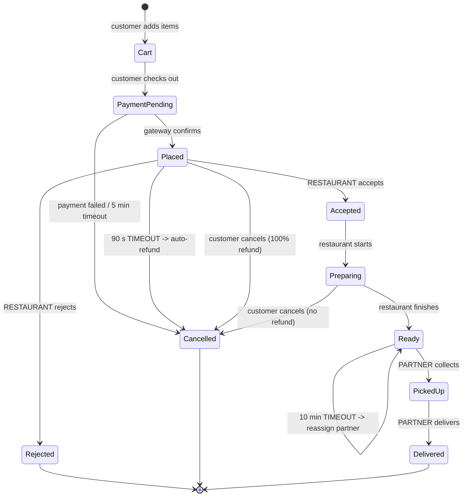
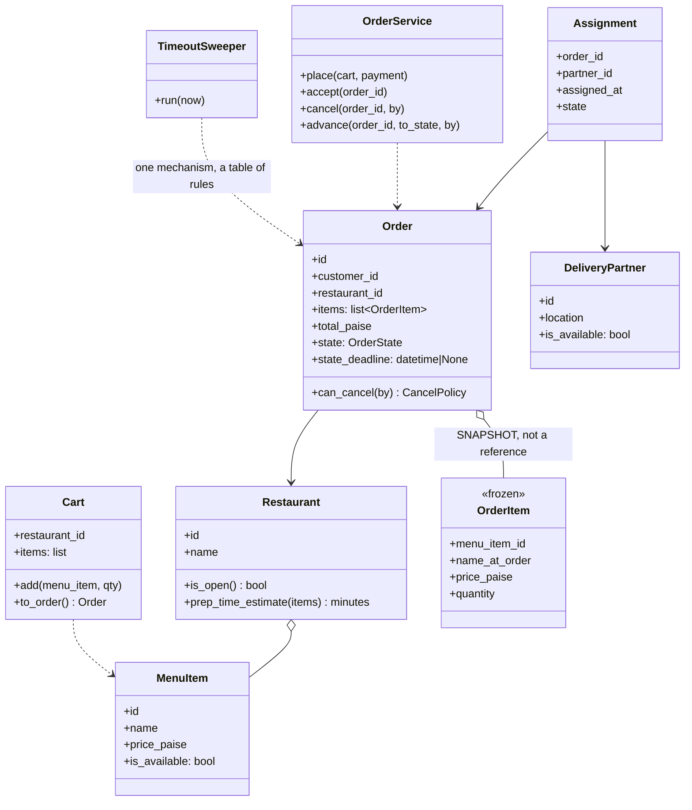

# Day 087 · System design — Design a food delivery order flow

**After today you can:** You can model restaurants, carts, orders and the delivery state machine.

**The interviewer asks it as:** *Design the order flow for a food delivery app.*

---

## 1. What this is, and why they ask it

A customer builds a cart from one restaurant's menu, pays, the restaurant accepts and cooks, a delivery
partner collects it, and it arrives. Eight steps, and the design is entirely about those eight steps
and what happens when one of them does not occur.

Three things make this different from the state machines you have already built.

**The transitions come from different actors.** The customer places, the restaurant accepts, the
partner picks up. No single party drives the order forward, so no single party can be asked "what
state is it in?" and be trusted.

**Time is one of the actors.** If the restaurant does not accept within ninety seconds, something must
happen anyway. A transition with no actor and no timeout is an order stuck for ever, and at two
million orders a day even a rare stuck state is thousands of angry customers.

**The price must be frozen.** Menus change during the day; a dish costing ₹240 at 7:58 and ₹260 at
8:02 must be charged at whatever the customer saw. That is the same immutability rule as the library's
loan and the cinema's booking, and it is the source of most real billing disputes.

They ask it because everyone has used one of these apps, because the happy path is boring and the
failure paths are not, and because "what happens if the restaurant never responds?" separates a
candidate who has drawn a state machine from one who has run a system.

---

## 2. The story

Lakshmi has been sending out tiffins from the house since her husband's factory closed, and it is now
about ninety boxes a day.

There are three of them. Lakshmi cooks. Her daughter Shruthi takes the calls and writes the orders into
the tablet. And her son Kiran does the deliveries on the scooter, two runs, one at half past eleven and
one at half past twelve.

Three rules run the whole thing, and each of them came out of something going wrong.

The first is about the price. For a while Shruthi would quote whatever that day's rate was, and then if
vegetables had been dear that morning Lakshmi would want to charge ten rupees more, and the customer
would say but she told me sixty. It caused a bad argument with a regular customer in the second month.
Now the rule is: whatever Shruthi said on the phone is the price. It is written into the tablet when
the order is taken and it does not change, even if tomatoes doubled.

The second is about time. There was a day when Shruthi took eleven orders before realising her mother
had gone to the hospital with her aunt and nothing was cooking. The customers found out at one o'clock.
So now the rule is that Shruthi does not confirm an order to the customer until Lakshmi has said yes to
it — and if Lakshmi has not said yes within a few minutes, Shruthi rings the customer back and says
sorry, not today. Not at one o'clock. Straight away.

The third is about cancelling, and it is the one Shruthi has had to explain most often. If you ring
before the food is made, that is fine, no problem, nothing is lost. If you ring while it is cooking,
Lakshmi will usually still say fine, but she has spent the ingredients. And if you ring after Kiran has
left the house with the box on the back of the scooter, the answer is no — not because they are being
difficult, but because the food is thirty minutes away on a scooter and it is not coming back.

Shruthi says the customers who get upset are almost always the ones who assumed the answer was the
same at every stage. Once she explains that it depends where the box is, they understand it
immediately, because everybody understands that a box on a scooter is a different situation from a box
that does not exist yet.

---

## 3. The idea in plain English

Lakshmi's three rules are the three design decisions. The price frozen at order time. A timeout on the
step somebody else has to take. And cancellation being a function of *where the order is*, not a
setting.

### The states, and who moves each one

```
 CART            the customer is still choosing            (no order exists yet)
 PAYMENT_PENDING payment initiated
 PLACED          paid; the restaurant has not seen it yet
 ACCEPTED        the restaurant said yes
 PREPARING       cooking
 READY           waiting for a partner to collect
 PICKED_UP       on the scooter
 DELIVERED       done

 REJECTED        the restaurant said no
 CANCELLED       the customer, or the system, stopped it
```

The important column is not the state. It is **who causes the transition, and what happens if they do
not**:

| Transition | Actor | Timeout | What happens on timeout |
|---|---|---|---|
| PAYMENT_PENDING → PLACED | payment gateway | 5 min | Cancel, release the cart |
| PLACED → ACCEPTED | **restaurant** | **90 s** | Auto-cancel and refund, or offer to a backup restaurant |
| ACCEPTED → PREPARING | restaurant | — | Usually merged with ACCEPTED |
| PREPARING → READY | restaurant | prep estimate + 10 min | Alert operations; notify the customer of a delay |
| READY → PICKED_UP | **partner** | 10 min | Reassign to another partner |
| PICKED_UP → DELIVERED | partner | ETA + 20 min | Alert operations; the customer sees a delay |

**Every row has a timeout except the ones the restaurant does back-to-back.** That is the design.
A transition whose actor is somebody else, with no timeout, is an order that can sit for ever — and
the thing customers actually complain about is not failure, it is silence.

### Time as an actor

The cleanest way to model this is that **each state carries a deadline**, and a single sweeper asks
"which orders are past their deadline?" and applies that state's timeout rule.

```python
@dataclass(frozen=True)
class StateRule:
    timeout: timedelta | None
    on_timeout: Callable[["Order"], None]

RULES = {
    OrderState.PLACED:  StateRule(timedelta(seconds=90), auto_cancel_and_refund),
    OrderState.READY:   StateRule(timedelta(minutes=10), reassign_partner),
    OrderState.PICKED_UP: StateRule(None, None),          # no automatic action
}
```

One table, one sweeper, and the alternative — a scheduled job per transition type — is six jobs that
can each independently stop running. **One mechanism with a table of rules is much easier to keep
correct than six mechanisms.**

Note what this is *not*: it is not the lazy expiry from [day 086](../day-086-linked-lists-revision/README.md).
A cinema seat lock can expire lazily because nothing has to *happen* when it does — the seat simply
becomes claimable again. Here the timeout must trigger a refund and a notification, so something
active is required. Knowing which situations allow lazy expiry and which do not is the distinction
worth drawing.

### The price snapshot

```python
@dataclass(frozen=True)
class OrderItem:
    menu_item_id: str
    name_at_order: str        # the menu can be renamed
    price_paise: int          # the price AT THE MOMENT OF ORDERING
    quantity: int
```

`OrderItem` copies the name and the price rather than pointing at the `MenuItem`. That looks like
denormalisation and it is deliberate: the order is a **record of what was agreed**, and joining to the
live menu to compute a total means an order's price changes after the fact.

The same rule applies to the delivery fee, the taxes, the surge multiplier and the discount. **Freeze
everything that was shown to the customer**, and store the total as well, so a rounding-rule change
next year cannot alter last year's invoices.

Shruthi writing the price into the tablet when she takes the call.

### Cancellation is a function of state

```python
def can_cancel(order: Order, by: Actor) -> CancelPolicy:
    match order.state:
        case OrderState.PLACED:
            return CancelPolicy(allowed=True, refund_percent=100)
        case OrderState.ACCEPTED | OrderState.PREPARING:
            return CancelPolicy(allowed=True, refund_percent=0 if by is Actor.CUSTOMER else 100)
        case OrderState.READY | OrderState.PICKED_UP:
            return CancelPolicy(allowed=False, reason="the order has left the restaurant")
        case _:
            return CancelPolicy(allowed=False, reason=f"cannot cancel a {order.state.name} order")
```

Not a boolean on the order. A **question asked of the state**, and the answer depends on who is asking
— a restaurant cancelling after accepting is a refund to the customer, while a customer cancelling
after the food is cooked is not. Shruthi's third rule, and the reason customers accept it once it is
explained.

### The partner assignment decision, which is the genuinely interesting trade

When do you assign a delivery partner?

**At `ACCEPTED`** — as soon as the restaurant says yes. The partner arrives during cooking, so the food
goes out the instant it is ready. But the partner waits at the restaurant, unpaid, unable to take
another job, and if the kitchen is slow that is fifteen wasted minutes.

**At `READY`** — when the food is actually done. No partner waiting. But now the food sits getting cold
while somebody is found and travels there, which is five to ten minutes on average.

**In practice: at `ACCEPTED` plus the predicted prep time minus the predicted travel time**, so the
partner arrives as the food does. That turns the assignment into a prediction problem, and the honest
statement is that the *design* is a scheduled assignment with a predicted timestamp, and the
*prediction* is a separate system.

Say all three. The interviewer is looking for whether you notice there is a choice at all — most
candidates assign at one of the ends without remarking on it.

### The one-restaurant rule

A cart holds items from **one** restaurant, and that is not an arbitrary simplification. It means one
order has one pickup point, one acceptance, one prep time and one partner. Multi-restaurant orders turn
one order into several sub-orders with independent states and a join at the end, which is a materially
larger design — and it is exactly why the apps that support it charge extra for it.

Name the restriction and say what relaxing it would cost. That is worth more than silently assuming it.

---

## 4. The picture

The state machine, with the actor on every arrow — which is the thing to draw:



What to notice: **three different kinds of arrow leave `Placed`** — the restaurant accepts, the
restaurant rejects, or nobody does anything and the clock fires. That third arrow is the one candidates
leave off, and it is the one that matters at scale: at two million orders a day and a five percent
no-response rate, it fires a hundred thousand times.

The three parties and what each one can do:

```
                 CUSTOMER            RESTAURANT           PARTNER            CLOCK
  Cart              add/remove          -                    -                 -
  PaymentPending    -                   -                    -               cancel @5m
  Placed            cancel (100%)       accept / reject      -               cancel @90s
  Accepted          cancel (0%)         start preparing      -                 -
  Preparing         cancel (0%)         mark ready           -               alert @est+10m
  Ready             -                   -                    pick up         reassign @10m
  PickedUp          -                   -                    deliver         alert @eta+20m
  Delivered         rate                -                    -                 -

  every blank in the CLOCK column is a decision, not an omission
```

And the classes:



What to notice: **`OrderItem` copies the name and price rather than pointing at `MenuItem`.** That
dashed comment is the difference between an order that means something a year later and one that
silently re-prices itself.

---

## 5. How it actually works

### Move 1 · Clarify (minutes 0–5)

> **"One restaurant per order, or several?"** — One, and I would say what relaxing it costs.
> **"What happens if the restaurant does not respond?"** — This is the question I would ask first,
> because the answer is the design. Propose: auto-cancel and refund after ninety seconds.
> **"Is the delivery partner assigned before or after the food is ready?"** — The interesting trade,
> and worth surfacing early.
> **"Can the customer cancel, and is there a refund?"** — Yes, and it depends on the state.

> "I will assume payment is upfront through a gateway behind an interface, that prices are integer
> paise frozen at order time, and that partner matching and ETA prediction are separate systems I will
> call into. I am not designing search, recommendations, or the maps."

### Move 2 · The nouns (minutes 5–12)

- **`Restaurant`**, **`MenuItem`** — the catalogue. `MenuItem` has a live price and availability.
- **`Cart`** — the customer's working set, tied to one restaurant. Not persisted as an order.
- **`Order`** — the record. State, deadline, totals.
- **`OrderItem`** *(frozen)* — a **snapshot** of name, price and quantity.
- **`DeliveryPartner`**, **`Assignment`** — who is carrying it, and since when.
- **`OrderService`** — the transitions, and nothing else.
- **`TimeoutSweeper`** — one mechanism driven by a table of per-state rules.

Seven, and note there is no `OrderStateMachine` class: the states are an enum plus a transition table,
because here the states carry very little behaviour of their own — the *actors* and *deadlines* are
what differ. That is a deliberate difference from [day 073](../day-073-queues/README.md)'s State
pattern, where each state carried real work, and saying why you chose differently is worth more than
applying the pattern reflexively.

### Move 3 · Placing the order — the snapshot

```python
def place(self, cart: Cart, customer_id: str, now: datetime) -> Order:
    restaurant = self._restaurants.get(cart.restaurant_id)
    if not restaurant.is_open(now):
        raise NotAllowed("the restaurant is closed")

    items = []
    for line in cart.lines:
        menu_item = self._menu.get(line.menu_item_id)
        if not menu_item.is_available:
            raise NotAllowed(f"{menu_item.name} is no longer available")
        items.append(OrderItem(                       # SNAPSHOT, not a reference
            menu_item_id=menu_item.id,
            name_at_order=menu_item.name,
            price_paise=menu_item.price_paise,
            quantity=line.quantity,
        ))
```

Validate against the *live* menu, then **copy** what you validated. The order now means the same thing
in a year's time as it does today.

```python
    subtotal = sum(item.price_paise * item.quantity for item in items)
    order = Order(
        id=new_id(), customer_id=customer_id, restaurant_id=restaurant.id,
        items=items,
        subtotal_paise=subtotal,
        delivery_fee_paise=self._fees.delivery(restaurant, cart.address, now),
        tax_paise=self._fees.tax(subtotal),
        state=OrderState.PAYMENT_PENDING,
        state_deadline=now + timedelta(minutes=5),
    )
```

Every money component is stored, not just the total. When a customer disputes a bill eight months
later, "subtotal 480, delivery 35, tax 24, total 539" answers it; a single number does not.

### Move 4 · The transition, with the actor and the deadline

```python
def advance(self, order_id: str, to_state: OrderState, by: Actor, now: datetime) -> Order:
    order = self._orders.get_for_update(order_id)     # row lock: one transition at a time

    allowed = TRANSITIONS.get((order.state, to_state))
    if allowed is None:
        raise IllegalTransition(f"{order.state.name} -> {to_state.name} is not a legal move")
    if by not in allowed.actors:
        raise NotAllowed(f"a {by.name.lower()} cannot make this order {to_state.name}")

    order.state = to_state
    rule = RULES.get(to_state)
    order.state_deadline = now + rule.timeout if rule and rule.timeout else None
    self._history.append(Transition(order.id, order.state, to_state, by, now))
    self._events.publish(OrderStateChanged(order.id, to_state))
    return order
```

Four things in one place, and that is the point of routing every change through one method:

**The transition table** decides legality, so an illegal move is impossible rather than merely
discouraged. **The actor check** stops a customer marking their own order delivered. **The deadline**
is set from the table, so no state can accidentally be left without one. And **the history row plus the
published event** happen for every transition, which gives the audit trail and the notifications for
free — the observer hook from [day 072](../day-072-largest-rectangle/README.md).

### Move 5 · The sweeper

```python
class TimeoutSweeper:
    def run(self, now: datetime) -> int:
        overdue = self._orders.query(
            "SELECT * FROM orders WHERE state_deadline IS NOT NULL AND state_deadline < %s "
            "ORDER BY state_deadline LIMIT 500 FOR UPDATE SKIP LOCKED",
            now,
        )
        for order in overdue:
            RULES[order.state].on_timeout(order, now)
        return len(overdue)
```

`FOR UPDATE SKIP LOCKED` is the line worth explaining: it lets several sweeper instances run at once
without two of them picking up the same order, and without them blocking each other. That is how you
make a sweeper horizontally scalable, and it is one clause.

The rules themselves are small:

```python
def auto_cancel_and_refund(order: Order, now: datetime) -> None:
    """PLACED for 90 seconds with no response from the restaurant."""
    service.advance(order.id, OrderState.CANCELLED, Actor.SYSTEM, now)
    payments.refund(order.payment_id, reason="restaurant did not respond")
    notify(order.customer_id, "Sorry — the restaurant could not take your order. Refunded.")
    metrics.increment("orders.auto_cancelled.no_restaurant_response")
```

The metric is not decoration. **The rate at which this fires is a restaurant quality signal**, and it
is the input to deciding whether that restaurant should stay in search results.

### Move 6 · Partner assignment

```python
def schedule_assignment(order: Order, now: datetime) -> None:
    prep = predictor.prep_minutes(order)              # a separate system
    travel = predictor.travel_minutes_to(order.restaurant_id)
    assign_at = now + max(timedelta(0), prep - travel)
    queue.schedule(AssignPartner(order.id), at=assign_at)
```

Assign so the partner **arrives when the food does**. And the honest sentence to say: the design here
is "assign at a predicted moment", and the quality of the prediction is a different system with its own
data and its own failure modes. Do not pretend the prediction is the easy part.

### Real systems

- **Swiggy, Zomato, Uber Eats and DoorDash** all show the customer a state machine — a progress bar
  with named steps — which is the state machine leaking deliberately into the interface, because the
  main complaint about food delivery is not lateness, it is not knowing.
- **Restaurant acceptance timeouts** are real and short, typically 60–120 seconds, and the
  auto-rejection rate is a published quality metric for restaurants on these platforms.
- **Order price snapshots** are why your invoice from six months ago still shows the old price. It is
  also a legal requirement in most tax regimes: the invoice must reflect what was charged.
- **`SELECT … FOR UPDATE SKIP LOCKED`** is the standard Postgres pattern for a work queue and is what
  lets several sweepers share the same table. Many teams reach for Kafka here and a table plus SKIP
  LOCKED is enough for a long time.
- **Assignment as a scheduled job** rather than an immediate one is the difference between a partner
  network that idles and one that does not; DoorDash has published on assigning by predicted ready
  time for exactly this reason.

---

## 6. The numbers

### Traffic

```
 orders per day                 2,000,000
 peak: 40% in the two dinner hours
   800,000 / 7,200 s          ≈  111 orders/second
 state transitions per order    ~8
   -> 16,000,000 transitions/day, ~890/second at peak
```

**One hundred and eleven orders a second is not large**, and it is worth saying so — the difficulty in
this system is correctness across three parties, not throughput.

### The timeout that actually fires

```
 restaurants failing to respond within 90 s:  ~5%
 2,000,000 × 5%  =  100,000 auto-cancellations per day
                 =  ~5.5 per second at peak
```

**A hundred thousand times a day.** That is not an edge case; it is a feature with its own refund
pipeline, its own notification and its own metric. A design that treats it as an exception has designed
for a system that does not exist.

### Storage

```
 Order row        ~500 B × 2M/day   =  1.0 GB/day  =  365 GB/year
 OrderItem row    ~120 B × 3 items × 2M  = 720 MB/day
 Transition row   ~100 B × 8 × 2M   =  1.6 GB/day
 -----------------------------------------------------------
 total                              ≈  3.3 GB/day  ≈  1.2 TB/year
```

The transition history is **half the storage**, which is the moment to decide deliberately: keep 90
days hot for support and archive the rest to object storage. Deleting it is the wrong answer — it is
what answers "why was I charged for this?".

### The price snapshot, priced

```
 menu items changed per day:  ~2% of a restaurant's items
 orders touching a changed item: ~2% × 2,000,000  =  40,000/day

 without a snapshot: 40,000 orders/day whose price could be recomputed differently
 at an average dispute rate of 1%:  400 disputes/day  ->  ~146,000/year
 at a ₹50 support cost each:  ₹73 lakh/year
```

**Seventy-three lakh a year, from one denormalisation decision.** That is the argument for the snapshot,
and it is far more convincing than "orders should be immutable".

### The assignment trade, in minutes

```
 assign at ACCEPTED:
   partner waits at the restaurant  ≈ 8 min average
   at 2M orders/day: 16,000,000 partner-minutes/day wasted  =  266,000 partner-hours

 assign at READY:
   food waits for a partner         ≈ 6 min average
   -> 6 minutes colder, and 6 minutes later, on every order

 assign at (ACCEPTED + prep - travel):
   both waits ≈ 1-2 min, subject to prediction error
```

**Two hundred and sixty-six thousand partner-hours a day** is the cost of assigning too early, and six
minutes of cold food on every order is the cost of assigning too late. That comparison is the whole
argument for predicting.

### The sweeper

```
 orders with a live deadline at any moment: ~111/s × ~5 min of exposure  ≈ 33,000
 sweeper runs every 5 s, batch 500, several instances
 -> comfortably keeps up; the deadline column needs an index
```

A single index on `state_deadline` is the difference between a sweeper that scans two million rows and
one that touches a few hundred. Worth one sentence.

---

## 7. The trade-offs

### What this design gives up

**The transition table plus an enum is not the State pattern, and that is deliberate.** Here the states
carry almost no behaviour of their own — what differs is who may act and what the deadline is, and both
are data. Using a class per state would put five nearly-empty classes in the codebase. But it means an
illegal transition is caught by a lookup rather than by the type system, and a typo in the table is a
runtime failure. If states started carrying real work — different pricing while preparing, different
refunds by state — I would move to classes.

**One sweeper is a single point of failure and a single point of correctness.** If it stops, nothing
times out and orders pile up in `PLACED` invisibly. So the sweeper needs its own alert on "time since
last successful run", and that alert matters more than most of the application's own monitoring. The
alternative — a scheduled job per transition — spreads the risk across six things that can each fail
quietly, which is worse.

**Denormalising the order items means the order and the menu can disagree**, and reporting has to
choose which one it means. "Revenue for dish X" is a different number depending on whether you join to
the menu or read the snapshot. That is real and it is the right trade, and the answer is that the
snapshot is authoritative for money and the menu for the catalogue.

**Cancellation policy in code will end up in configuration.** Refund percentages by state, by city, by
whether the restaurant has already started — those change by business decision, on a Monday, and no
engineer should deploy for them. I would build it as a policy object first and move it to a rules
table on the second change.

**Nothing here handles partial fulfilment.** One item out of four is unavailable after acceptance is
extremely common, and the honest options are: cancel the whole order, or substitute, or refund the
line and deliver the rest — each of which needs the customer's consent while the food is cooking.
That is a whole conversation flow and I would scope it out explicitly rather than pretend the state
machine covers it.

**No multi-restaurant orders.** One order, one pickup, one acceptance, one prep time. Relaxing that
turns one order into several sub-orders with independent states, a join at the end, and a partner
routing problem — which is why platforms charge extra for it.

### "I would change this design if..."

- **...the restaurant response rate got worse.** Then `PLACED` needs a fallback to a backup restaurant
  rather than a cancellation, which changes the state machine and needs the customer's consent.
- **...orders could contain several restaurants.** Sub-orders with their own states, and the parent
  order becomes a coordinator — closer to a saga than a state machine.
- **...cancellation rules changed more than twice a year.** A rules table a support lead can edit,
  not classes an engineer deploys.
- **...the volume grew tenfold.** The sweeper would need partitioning by deadline bucket, and the
  transition history would move to a separate store. Neither changes the model.

### The honest concession

The state machine is the easy half and it is what everybody draws. The half that decides whether the
system works is the **timeout column** — the fact that every transition performed by somebody else has
a deadline and a defined thing that happens when it passes. A design with eight states and no clock is
a design where a hundred thousand orders a day sit silently in `PLACED`, and the customer finds out at
one o'clock, like Shruthi's eleven customers.

---

## 8. In the interview

### How it gets asked

- The standard: *"Design the order flow for a food delivery app."*
- The failure probe, which is the real question: *"What happens if the restaurant never accepts?"*
- The money probe: *"The restaurant changes the price while the order is in the cart. What is
  charged?"*
- The trade probe: *"When do you assign the delivery partner?"*
- The policy probe: *"Can the customer cancel? When, and is there a refund?"*

### The timed script

**Minutes 0–5 · Clarify.** One restaurant per order? What happens when the restaurant does not respond
— ask this first, because the answer *is* the design. Partner assigned before or after ready?
Cancellation and refunds?

**Minutes 5–10 · Estimation.** Two million orders a day, 111 a second at peak, and — the number that
matters — a five percent restaurant no-response rate meaning a hundred thousand automatic
cancellations a day. Say that early: it turns the timeout from an edge case into a feature.

**Minutes 10–20 · The state machine, drawn with the actor on every arrow.** Then the timeout column,
which is the part most candidates omit.

**Minutes 20–28 · The two immutability decisions.** The price snapshot with the dispute arithmetic, and
the transition history.

**Minutes 28–35 · The interesting trade: partner assignment**, with the partner-hours-versus-cold-food
comparison and the prediction as a separate system.

**Minutes 35–40 · Failure modes.** The sweeper as a single point of correctness, partial availability
after acceptance, and what would change at ten times the volume.

### The follow-ups

**"What happens if the restaurant never accepts?"**
"That is the transition I would design first, because it happens about five percent of the time — a
hundred thousand times a day at two million orders. The order sits in `PLACED` with a deadline ninety
seconds out. A sweeper picks up anything past its deadline, cancels it, refunds automatically, notifies
the customer immediately rather than at dinner time, and increments a metric — because the rate at
which this fires is a restaurant quality signal and feeds back into search ranking. The important
design point is general: **every transition performed by somebody else needs a deadline and a defined
thing that happens when it passes.** A state with an actor and no timeout is an order that can sit for
ever, and silence is what customers actually complain about."

**"The restaurant changes the price while the order is in the cart."**
"The customer is charged what they saw. `OrderItem` stores a *snapshot* — the name, the price and the
quantity at the moment of ordering — rather than a reference to the menu item, and I store every money
component separately, not just the total. It looks like denormalisation and it is deliberate: an order
is a record of what was agreed, and joining to the live menu means an order silently re-prices itself
after the fact. There is an arithmetic argument too — about two percent of menu items change daily, so
roughly forty thousand orders a day touch a changed item, and even a one percent dispute rate on those
is a few hundred support tickets a day."

**"When do you assign the delivery partner?"**
"There is a genuine trade here and I would name all three options. At acceptance, the partner arrives
during cooking and the food goes out instantly — but the partner waits about eight minutes on average,
unable to take another job, which across two million orders a day is roughly two hundred and sixty
thousand partner-hours. At ready, no partner waits — but the food sits about six minutes getting cold
while somebody is found and travels. So in practice you assign at a *predicted* moment: acceptance plus
prep time minus travel time, so the partner arrives as the food does. That makes the design a scheduled
assignment and pushes the difficulty into a prediction system, which I would name as a separate
component with its own failure modes rather than pretend it is easy."

**"Can the customer cancel?"**
"It depends on the state, and I would model it as a question you ask the order rather than a flag on
it. Before the restaurant accepts, yes, full refund, nothing has been lost. While it is being prepared,
allowed but no refund, because ingredients have been spent. Once the partner has collected it, no —
the food is on a scooter and it is not coming back. And the answer also depends on *who* is asking: a
restaurant cancelling after accepting is a full refund to the customer. Those percentages will end up
in configuration rather than code, because they change by business decision, but the *shape* — a
policy derived from state and actor — is the design."

**"How do the timeouts actually fire?"**
"Each order carries a `state_deadline` set from a per-state rules table when it enters that state, and
one sweeper queries for orders past their deadline and applies that state's rule. One mechanism with a
table beats six scheduled jobs that can each fail quietly. The query uses `FOR UPDATE SKIP LOCKED` so
several sweeper instances can run without picking up the same order or blocking each other, and the
deadline column is indexed. And I would alert on time-since-last-successful-sweep, because the sweeper
is a single point of *correctness* — if it stops, nothing times out and orders pile up invisibly."

**"Why not a class per state, like the State pattern?"**
"Because here the states carry very little behaviour of their own. What differs between them is who may
act and what the deadline is, and both of those are data — so a transition table plus an enum expresses
it directly and a class per state would be five nearly-empty classes. I would switch to classes if
states started carrying real work: different refund arithmetic per state, or a state that has to call
out to another system on entry. That is the same judgement as any pattern — the gate is whether the
implementations differ in *behaviour* or only in *values*."

**"An item becomes unavailable after the restaurant accepts."**
"Very common, and the state machine alone does not cover it. The options are to cancel the whole order,
to substitute, or to refund that line and deliver the rest — and all three need the customer's consent
while the food is cooking, so it is a conversation flow with its own timeout, not just a transition. I
would scope it explicitly rather than pretend it falls out of the design, and I would note that the
refund-the-line option needs the per-line prices I already store, which is a second reason for the
snapshot."

### A model answer

Asked: *design the order flow for a food delivery app.*

> "Let me start with the question I think decides this design, and ask it rather than assume: what
> happens when the restaurant does not respond? Because the interesting part of this system is not the
> eight happy states, it is the fact that three different parties move the order forward and any of
> them can simply not act.
>
> The states are roughly: cart, payment pending, placed, accepted, preparing, ready, picked up,
> delivered, plus rejected and cancelled. Everybody draws that. The column that matters is next to it:
> **who causes each transition, and what happens if they do not.** The customer places. The restaurant
> accepts and cooks. The partner collects and delivers. And the clock is the third actor — placed times
> out after ninety seconds and auto-cancels with a refund; ready times out after ten minutes and
> reassigns the partner; picked up times out and alerts operations.
>
> That timeout is not an edge case. At two million orders a day and a five percent no-response rate,
> it fires a hundred thousand times a day — so it needs a refund pipeline, an immediate customer
> notification, and a metric, because the rate at which it fires is a restaurant quality signal.
>
> I would implement time as one mechanism rather than six. Each order carries a `state_deadline`, set
> from a per-state rules table when it enters that state, and a single sweeper picks up anything past
> its deadline and applies that state's rule. One thing to keep correct instead of six things that can
> each fail quietly — and I would alert on how long since the sweeper last succeeded, because if it
> stops, nothing times out and orders pile up invisibly.
>
> The second decision is immutability. `OrderItem` stores a *snapshot* of the name and price at the
> moment of ordering, not a reference to the menu item, and I store the subtotal, the delivery fee and
> the tax separately as well as the total. An order is a record of what was agreed. About two percent
> of menu items change on a given day, so roughly forty thousand orders a day touch a changed item —
> without the snapshot, every one of those could be re-priced after the fact, and that is where billing
> disputes come from.
>
> Third, cancellation is a question you ask the state, not a flag. Before acceptance: allowed, full
> refund. While preparing: allowed, no refund, because ingredients are spent. After pickup: not
> allowed — the food is on a scooter. And the answer depends on who is asking, since a restaurant
> cancelling after accepting refunds the customer fully. Those percentages will move to configuration,
> but the shape is a policy derived from state and actor.
>
> The one genuinely interesting trade is when to assign the delivery partner. At acceptance, the food
> leaves instantly but the partner waits about eight minutes — across two million orders that is
> roughly two hundred and sixty thousand partner-hours a day. At ready, nobody waits but the food sits
> six minutes getting cold. So you assign at a predicted moment — acceptance plus prep time minus
> travel time — which makes it a scheduled job and pushes the difficulty into a prediction system with
> its own data and its own failure modes. I would name that as a separate component rather than
> pretend it is easy.
>
> On scale: a hundred and eleven orders a second at peak, about three gigabytes a day of storage, half
> of it transition history. That is not a throughput problem. The difficulty here is correctness across
> three parties who can each fall silent, which is why I would spend the design time on the timeout
> column rather than on the states."

---

## 9. Recall card

- **Everybody draws the eight states; the column that matters is next to them — WHO causes each
  transition, and WHAT HAPPENS IF THEY DO NOT.** Three parties (customer, restaurant, partner) plus
  **the clock as a third actor**. *A transition performed by somebody else with no timeout is an order
  that sits for ever, and silence is what customers actually complain about.*
- **The restaurant timeout is a feature, not an edge case: ~5% of 2M orders/day = 100,000 auto-cancels
  a day**, each needing a refund, an *immediate* notification, and a metric that feeds restaurant
  ranking. Implement time as **one sweeper plus a per-state rules table** (`state_deadline`, indexed,
  `FOR UPDATE SKIP LOCKED` so instances share the work) — one thing to keep correct instead of six that
  fail quietly. **Not** lazy expiry, because something must actively *happen*.
- **`OrderItem` is a SNAPSHOT of name and price, not a reference to the menu** — and store every money
  component, not just the total. ~2% of menu items change daily → ~40,000 orders/day touch a changed
  item, which is where billing disputes come from. Same immutability rule as a loan and a booking.
- **Cancellation is a question you ask the state, and the answer also depends on the actor.** Placed →
  full refund; preparing → allowed, no refund (ingredients spent); picked up → refused, *the food is on
  a scooter*. Expect the percentages to move to configuration; the *shape* stays.
- **The one genuinely interesting trade is when to assign the partner.** At ACCEPTED: the partner waits
  ~8 min → **~266,000 partner-hours/day**. At READY: the food waits ~6 min and arrives cold. So assign
  at **ACCEPTED + prep − travel**, which makes it a scheduled job and moves the difficulty into a
  *prediction* system — name that as separate rather than pretend it is easy. And at **111 orders/s**,
  this is a correctness problem, not a throughput one.
