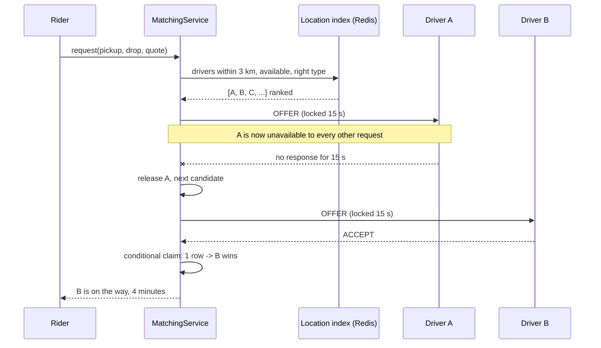
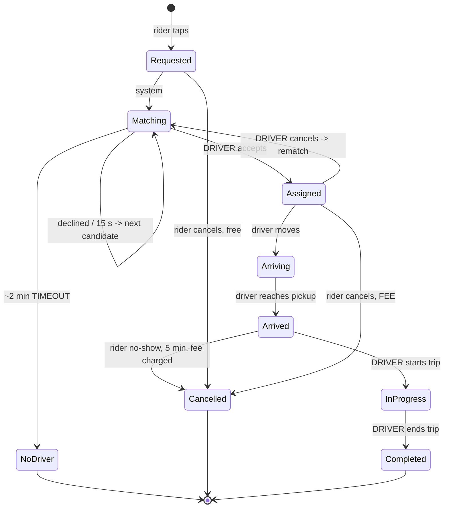

# Day 088 · System design — Design a ride-hailing booking flow

**After today you can:** You can model riders, drivers, matching and trip state at the object level.

**The interviewer asks it as:** *Design the booking flow for a cab app.*

---

## 1. What this is, and why they ask it

A rider asks for a car from A to B. The system finds a driver, the driver agrees, drives over, picks
them up, drives to B, and gets paid. The trip state machine is ordinary — you have built three of them
this phase.

The part that is not ordinary is **matching**, and it has a shape you have already met twice this
week without noticing. Offering a ride to a driver is a **lock with a short expiry**: while the offer
is out, that driver must not be offered anything else, and if they do not answer in fifteen seconds
the offer has to move on. It is the cinema seat from [day 086](../day-086-linked-lists-revision/README.md)
and the restaurant timeout from [day 087](../day-087-recursion-leap-of-faith/README.md), applied to a
person who is driving.

The second unusual thing is the **write volume from something that is not a booking**. A hundred
thousand online drivers sending a location every four seconds is twenty-five thousand writes a second
— hundreds of times the booking rate — and it needs a completely different storage answer from the
trips. Noticing that the location firehose and the trip records are two different systems is most of
the scaling insight.

They ask it because everyone has used it, because "two riders, one driver" is a race that is easy to
state, and because the follow-ups are unusually good: what if nobody accepts, what if the driver
cancels after accepting, and what does the rider get charged when the fare changes on the way.

---

## 2. The story

The auto stand outside the station has about forty autos on a good evening, and it is run by
Shivanand, who does not own any of them.

He stands at the head of the rank with a whistle he never uses and a system everybody has agreed to
because the alternative was drivers racing each other down the ramp.

The autos are in a line, and the one at the front gets the next passenger. That part is simple and it
works for the ordinary fares — station to the market, station to the hospital.

The trouble is the fares nobody wants. Late at night, a long way out to the industrial area where
nothing comes back. When one of those comes up, the driver at the front says no.

What Shivanand does then, and he is completely rigid about it, is go to the second auto. Not the third,
not whoever is shouting. The second. And while he is standing there asking the second driver, the first
driver's refusal is final and the passenger is not offered to anybody else. One driver at a time.

He tried it the other way for about a week, years ago — announcing the fare to the whole rank at once
and letting whoever wanted it come forward. Two things happened. Three drivers came forward for the
good fares and started an argument, and for the bad ones nobody moved at all and the passenger stood
there while everyone looked at the ground.

The other rule is the clock. He gives a driver a few seconds — genuinely a few, and he counts them —
and if the man is finishing a phone call or pretending not to hear, Shivanand moves on. He says if you
wait for a driver who is not going to say yes, you are not waiting for that driver, you are making the
passenger wait for nothing.

And the last thing, which is the one passengers argue about. He tells them the fare before the auto
leaves. If it turns out longer because of the flyover being shut, that is the driver's bad luck, and
if it is shorter the driver keeps the difference. He fixed that after too many evenings of people
shouting at the far end of a trip about a number that had changed on the way.

---

## 3. The idea in plain English

Shivanand's three rules are the design. **One driver at a time.** **Count the seconds and move on.**
**The price is agreed before the vehicle moves.**

### An offer is a lock on a driver

The naive matching loop is: find nearby drivers, tell all of them, first to accept wins. That is
Shivanand's bad week. Two problems, both real:

- **Several accept at once**, and now you have a race and two drivers who each believe they have the
  ride. You can resolve it with a conditional claim — first `UPDATE` wins — but the loser has already
  turned the car around.
- **Nobody accepts**, and there is no mechanism that notices, because nothing was ever *owed*.

So: **offer to one driver, exclusively, with an expiry.**

```
 driver state:  ONLINE  ->  OFFERED (locked, 15 s)  ->  ASSIGNED
                            |
                            +-- declines, or 15 s pass --> ONLINE, offer the next
```

An `OFFERED` driver is not available to any other request, exactly as a `LOCKED` seat is not available
to any other booking. The claim must be conditional for the same reason:

```sql
UPDATE drivers SET status = 'OFFERED', offered_ride = :ride, offer_expires = :now_plus_15s
 WHERE id = :driver
   AND (status = 'ONLINE' OR (status = 'OFFERED' AND offer_expires < :now));
```

Zero rows updated means somebody else got that driver first, and you move to the next candidate. Same
pattern as the seat, the parking spot and the shipped order — **find-then-claim needs a conditional
claim** — and by now it should be automatic.

### Sequential, broadcast, or something in between

The honest answer names all three:

| | Latency | Driver experience | Race |
|---|---|---|---|
| **Sequential**, one at a time | slow: 15 s per decline | fair, calm | none |
| **Broadcast** to all candidates | fast | several accept, all but one disappointed | needs a conditional claim |
| **Batched**: offer to the best 3 at once | fast | mild competition | needs a conditional claim |

Sequential at a 60 percent acceptance rate averages **1.7 offers**, and if each takes about eight
seconds that is roughly **fourteen seconds** to match. That is acceptable in a city and terrible at an
airport queue where a hundred requests arrive together.

**Batching is the usual production answer**: offer to a small number simultaneously, first conditional
claim wins, the rest get a "taken" notification quickly. It trades a little driver goodwill for a lot
of latency, and saying which you would choose and why is worth more than picking one.

### Choosing the candidates: the location problem

To offer at all, you need "drivers within three kilometres, available, right vehicle type".

A plain database index does not answer that well. Indexing latitude and longitude separately means the
database can narrow on one and then scan the other, and "within 3 km" is a circle, not a rectangle. The
standard answers turn two dimensions into one:

- **Geohash** — interleave the bits of latitude and longitude into a single string, so nearby points
  share a prefix. `tdr1v` is a cell of about 5 km; one more character is about 1.2 km. Then "nearby" is
  a prefix query, which an ordinary index handles.
- **S2 cells** or **H3 hexagons** — the same idea with better-behaved cell shapes; H3's hexagons have
  uniform neighbour distances, which matters for "expand the search radius" logic.

**The catch that is worth mentioning**: a geohash cell has edges, and two points either side of an edge
are close in reality and share no prefix. So a real query looks at the cell **and its eight
neighbours**, and then filters by true distance. Knowing that is the difference between having read
about geohashing and having used it.

And the storage: driver locations are **not** a database table. They are hot, they are overwritten
every few seconds, and nobody needs last Tuesday's. That is Redis — a geospatial set per city, or a
hash keyed by driver — and the durability requirement is genuinely "none".

### The fare is agreed before the car moves

A rider is quoted a fare at request time. That quote must **survive the trip**:

```python
@dataclass(frozen=True)
class FareQuote:
    base_paise: int
    per_km_paise: int
    per_minute_paise: int
    surge_multiplier: float          # frozen at REQUEST time, not at completion
    estimated_paise: int
    quoted_at: datetime
```

The **surge multiplier especially** is frozen. Surge changes minute by minute; a rider who accepts at
1.4× and is charged 2.1× because demand rose during the trip has been cheated, and that is the single
most damaging thing this kind of app can do to trust.

Same immutability rule as the food order's price snapshot and the library's fine — and by the third
time you meet it, it should be automatic: **anything shown to a customer before they commit is frozen
at that moment.**

The *actual* fare is computed at completion from real distance and time, and then reconciled against
the quote by whatever policy the business has — usually "charge the lower", or "charge the quote unless
the route changed materially".

### The trip state machine, and who moves it

```
 REQUESTED -> MATCHING -> ASSIGNED -> ARRIVING -> ARRIVED -> IN_PROGRESS -> COMPLETED
```

| Transition | Actor | Timeout | On timeout |
|---|---|---|---|
| REQUESTED → MATCHING | system | — | — |
| MATCHING → ASSIGNED | **driver** accepts | 15 s **per offer**, ~2 min overall | give up, tell the rider, widen the radius or raise surge |
| ASSIGNED → ARRIVING | driver starts moving | 60 s | nudge, then reassign |
| ARRIVED → IN_PROGRESS | driver starts the trip | 5 min waiting | driver may cancel with a fee to the rider |
| IN_PROGRESS → COMPLETED | driver ends the trip | — | operations alert on a very long trip |

Exactly the same shape as yesterday's food order: **every transition performed by somebody else carries
a deadline**, and the interesting cell is what happens when it passes. Matching failing entirely — no
driver in two minutes — is a real outcome with a real product decision behind it, not an error.

### Cancellation, which is a policy on state and actor

```
 rider cancels before ASSIGNED      free
 rider cancels after ASSIGNED       fee, because a driver is now driving to them
 rider cancels after ARRIVED        larger fee plus waiting time
 driver cancels after ASSIGNED      no fee to the rider; counts against the driver
 system cancels (no match)          free, and an apology
```

Same shape as the food order, with one addition that matters: **driver cancellations are counted**,
because a driver who accepts everything and cancels the bad ones is gaming the offer system. The
cancellation *rate* is an input to who gets offered rides — which is a design consequence, not an
afterthought.

---

## 4. The picture

The offer loop, which is the heart of it:



What to notice: **between the offer and the answer, driver A is locked** — not "preferred", locked. Any
other request that considers A gets zero rows from its conditional claim and moves on. That is the same
mechanism as the cinema seat, applied to a person.

The trip state machine with the actors marked:



The two systems that look like one and are not:

```
  LOCATION FIREHOSE                        TRIP RECORDS
  100,000 online drivers                   2,000,000 trips/day
  1 ping every 4 s                         ~40 trips/second at peak
  = 25,000 writes/second                   = 40 writes/second

  overwritten constantly                   written once, kept for years
  durability required: NONE                durability required: ABSOLUTE
  storage: Redis geo set, in memory        storage: the database
  size: 100,000 x ~100 B = 10 MB           500 B x 2M/day = 1 GB/day

  625x the write rate, and none of it is worth keeping
```

And the geohash edge problem, which is the detail worth knowing:

```
        cell  tdr1v          cell  tdr1w
      +----------------+----------------+
      |            D1  |  D2            |     D1 and D2 are 200 m apart
      |                |                |     and share NO prefix
      +----------------+----------------+

  so a "nearby" query must read the cell AND its 8 neighbours,
  then filter by true distance
```

---

## 5. How it actually works

### Move 1 · Clarify (minutes 0–5)

> **"Just the booking flow, or pricing and driver payouts too?"** — Booking and the fare quote;
> payouts are a separate system.
> **"Is the fare quoted upfront or metered?"** — Quoted upfront. This decides whether surge is frozen,
> which is the most user-visible decision here.
> **"One rider per trip, or pooled rides?"** — One. Pooling changes matching from "find a driver" to
> "find a driver whose route can absorb this", which is a much larger problem.
> **"What should happen if no driver accepts?"** — Ask, because it is a product decision: give up and
> apologise, widen the radius, or raise the surge and retry.

> "I will assume drivers are already onboarded and online, that payment is a gateway behind an
> interface, and that ETA and surge prediction are separate services I call into. I am not designing
> maps, routing, or the driver app's UI."

### Move 2 · The nouns (minutes 5–12)

- **`Rider`**, **`Driver`**, **`Vehicle`** — the participants. `Driver` carries a **status** and, when
  offered, `offered_ride` and `offer_expires`.
- **`RideRequest`** — pickup, drop, vehicle type, the frozen `FareQuote`.
- **`Trip`** — the record: rider, driver, state, timestamps, actual distance and time, final fare.
- **`Offer`** — a driver, a ride, an expiry, an outcome. Worth being its own record because the
  *history* of offers is how you measure acceptance rates.
- **`LocationIndex`** *(interface)* — `update(driver, point)` and `nearby(point, radius, filters)`.
  Behind an interface because the in-memory test version and the Redis version are both real.
- **`MatchingService`** — the offer loop.
- **`FarePolicy`** *(interface)* — quote and final fare; surge and city rules are genuine second
  implementations.

Eight, two interfaces. Note there is no `Ride` *and* `Trip`: a request that never matches is a
`RideRequest` that ended in `NO_DRIVER`, and one that matches becomes a `Trip`. Two names for the same
thing is how state machines get duplicated.

### Move 3 · The location index

```python
class LocationIndex(Protocol):
    def update(self, driver_id: str, lat: float, lng: float, at: datetime) -> None: ...
    def nearby(self, lat: float, lng: float, radius_m: int,
               vehicle_type: str) -> list[tuple[str, float]]: ...


class RedisLocationIndex:
    """Driver locations are hot, overwritten every few seconds, and worthless
    once stale — so they live in Redis, not in the database.

    GEOADD/GEOSEARCH do the geohash work; the TTL means a driver whose app
    dies simply falls out of the index instead of being offered rides for ever.
    """

    STALE_AFTER = 30                                  # seconds

    def update(self, driver_id, lat, lng, at):
        key = f"drivers:{self._city_of(lat, lng)}"
        self._redis.geoadd(key, (lng, lat, driver_id))
        self._redis.setex(f"driver:live:{driver_id}", self.STALE_AFTER, "1")

    def nearby(self, lat, lng, radius_m, vehicle_type):
        found = self._redis.geosearch(
            f"drivers:{self._city_of(lat, lng)}",
            longitude=lng, latitude=lat, radius=radius_m, unit="m",
            withdist=True, sort="ASC", count=30,
        )
        return [(d, dist) for d, dist in found
                if self._redis.exists(f"driver:live:{d}")
                and self._vehicle_type(d) == vehicle_type]
```

Two details worth narrating. **The staleness key** means a driver whose phone dies drops out in thirty
seconds rather than being offered rides for ever — a location index without an expiry accumulates
ghosts. And **`count=30`** because you only need enough candidates to make a handful of offers;
fetching every driver in three kilometres at an airport would be thousands.

### Move 4 · The offer loop — the interesting part

```python
class MatchingService:
    OFFER_TIMEOUT = timedelta(seconds=15)
    OVERALL_TIMEOUT = timedelta(minutes=2)
    BATCH = 3                                          # offer to 3 at once

    def match(self, request: RideRequest, now: datetime) -> Trip | None:
        deadline = now + self.OVERALL_TIMEOUT
        tried: set[str] = set()

        while datetime.now() < deadline:
            candidates = self._rank(
                self._locations.nearby(request.pickup_lat, request.pickup_lng,
                                       radius_m=3000, vehicle_type=request.vehicle_type)
            )
            batch = [d for d, _ in candidates if d not in tried][:self.BATCH]
            if not batch:
                self._widen_or_wait(request)
                continue
```

`tried` matters: without it, a driver who declined is immediately re-offered the same ride, which is
maddening for them and wastes the whole window.

```python
            offered = [d for d in batch if self._claim(d, request.id, now)]
            tried.update(batch)
            accepted = self._await_first_acceptance(offered, self.OFFER_TIMEOUT)
            for driver_id in offered:
                if driver_id != accepted:
                    self._release(driver_id)            # release the losers immediately
            if accepted is not None:
                return self._create_trip(request, accepted, now)

        return None                                     # NO_DRIVER: a real outcome
```

**Releasing the losers immediately** is the line people forget. If three drivers are offered and one
accepts, the other two must be returned to `ONLINE` in the same breath — not left to time out — or you
have taken two drivers off the market for fifteen seconds for nothing, and at an airport that is most
of your supply.

```python
    def _claim(self, driver_id: str, ride_id: str, now: datetime) -> bool:
        """Conditional claim: an OFFERED driver belongs to exactly one ride."""
        affected = self._db.execute(
            """
            UPDATE drivers
               SET status = 'OFFERED', offered_ride = %s, offer_expires = %s
             WHERE id = %s
               AND (status = 'ONLINE'
                    OR (status = 'OFFERED' AND offer_expires < %s))
            """,
            ride_id, now + self.OFFER_TIMEOUT, driver_id, now,
        )
        return affected == 1
```

The same shape as the seat, the spot and the order. **By the fourth time you meet find-then-claim, the
conditional update should be automatic**, and saying "this is the same pattern as the seat lock" out
loud is a good use of five seconds.

### Move 5 · Ranking, which is not just distance

```python
    def _rank(self, candidates: list[tuple[str, float]]) -> list[tuple[str, float]]:
        """Nearest is a poor proxy for soonest. Rank by predicted ARRIVAL TIME,
        then break ties toward drivers who accept and do not cancel."""
        scored = []
        for driver_id, metres in candidates:
            eta = self._eta.seconds(driver_id, metres)       # a separate service
            reliability = self._stats.acceptance_rate(driver_id)
            scored.append((eta - 30 * reliability, driver_id, metres))
        scored.sort()
        return [(driver_id, metres) for _, driver_id, metres in scored]
```

A driver 500 metres away across a river is further, in time, than one two kilometres down the same
road. **Rank by predicted arrival time, not by straight-line distance** — and note that the prediction
is somebody else's system, which is the same honest boundary as the food app's prep-time estimate.

### Move 6 · The fare

```python
    def quote(self, request: RideRequest, now: datetime) -> FareQuote:
        surge = self._surge.multiplier(request.pickup_cell, now)   # changes minute to minute
        distance_km, minutes = self._eta.route(request.pickup, request.drop)
        estimate = round((self.BASE + self.PER_KM * distance_km
                          + self.PER_MIN * minutes) * surge)
        return FareQuote(self.BASE, self.PER_KM, self.PER_MIN,
                         surge_multiplier=surge, estimated_paise=estimate, quoted_at=now)
```

Frozen at quote time, stored on the request, and used at completion:

```python
    def final_fare(self, trip: Trip) -> int:
        metered = round((trip.quote.base_paise
                         + trip.quote.per_km_paise * trip.actual_km
                         + trip.quote.per_minute_paise * trip.actual_minutes)
                        * trip.quote.surge_multiplier)      # the QUOTED surge
        return min(metered, trip.quote.estimated_paise) if self.HONOUR_QUOTE else metered
```

`trip.quote.surge_multiplier`, not today's surge. That one attribute access is the difference between a
rider who trusts the app and one who does not.

### Real systems

- **Uber and Ola** both use hexagonal spatial indexing; Uber open-sourced **H3** for exactly this, and
  their published reason is that hexagons have uniform neighbour distances, which makes "expand the
  search" behave sensibly. Google's **S2** is the square-cell equivalent.
- **Redis `GEOADD` / `GEOSEARCH`** implement geohashing directly, which is why driver-location services
  so often sit on Redis rather than on a relational database.
- **Batched offers with a short expiry** are the industry norm; the visible countdown in a driver app
  *is* the lock's TTL, exposed to the user, exactly as the cinema's booking timer is.
- **Upfront pricing** — quoting before the trip rather than metering — was a deliberate product change
  by Uber and Ola precisely because end-of-trip surprises destroy trust. The engineering consequence is
  the frozen quote.
- **Driver acceptance and cancellation rates** are tracked and used in dispatch by every major
  platform, which is the design consequence of drivers being able to game an offer system.

---

## 6. The numbers

### Two systems, not one

```
 online drivers at peak            100,000
 location ping interval                  4 s
 -> location writes                 25,000 per second

 trips per day                   2,000,000
 peak: 30% in 4 hours -> 600,000 / 14,400 s
 -> trip creations                      42 per second
```

```
 25,000 / 42  ≈  600x
```

**The location firehose is six hundred times the booking rate, and not one byte of it is worth
keeping.** That is the single most important number in this design: it says locations go to an
in-memory store with an expiry, and trips go to the database, and treating them as one system is how
you end up with a database doing twenty-five thousand writes a second of data nobody will ever read.

```
 location state: 100,000 drivers × ~100 B  =  10 MB   — the whole country, in RAM
 trip records:   ~500 B × 2M/day           =  1 GB/day  =  365 GB/year
```

### The matching loop

```
 candidates within 3 km, city centre:      ~30 drivers
 driver acceptance rate:                    ~60%
 offers needed, sequential:  1 / 0.6      ≈  1.7
 seconds per offer (accept or time out):   ~8 s average
 -> time to match, sequential              ≈  14 s

 with a batch of 3:
   probability at least one of 3 accepts = 1 - 0.4^3 = 94%
   -> usually one round
   -> time to match                       ≈   6 s
```

**Fourteen seconds against six.** That is the argument for batching, and the cost is that two drivers
out of three get an offer that evaporates — which is why releasing the losers *immediately* rather than
letting them time out matters so much.

### The cost of not releasing losers

```
 batch of 3, 42 matches/second at peak
 losers per second: 2 × 42 = 84 drivers

 released immediately:      locked for ~3 s each  ->  ~250 drivers locked at any moment
 left to time out:          locked for 15 s each  ->  1,260 drivers locked at any moment
```

**A thousand extra drivers off the market at all times**, out of a hundred thousand — one percent of
supply, permanently, from a missing line of code. At an airport rank where the local supply is thirty,
it is catastrophic rather than merely wasteful.

### Failing to match

```
 requests with no driver in 2 minutes:  ~2% in a city, ~15% in outer areas at 2 a.m.
 2,000,000 × 2%  =  40,000 per day
```

**Forty thousand a day**, so "no driver found" is a designed outcome with its own screen, its own
metric and its own product decision — widen the radius, raise the surge, or apologise. Not an error
path.

### The geohash query

```
 geohash precision 6:  cell ≈ 1.2 km × 0.6 km
 a 3 km radius: read the cell + 8 neighbours  =  9 cells
 drivers per cell in a busy area: ~50
 -> ~450 candidates fetched, filtered by true distance, take the nearest 30
```

Nine reads of a Redis geo set, sub-millisecond. And the reason for the nine rather than one is the edge
problem: two drivers two hundred metres apart on either side of a cell boundary share no prefix.

### The fare quote

```
 surge changes: every minute, and can move 1.2x -> 2.0x in five minutes during rain
 an average trip: 18 minutes

 without freezing the multiplier:
   a rider quoted at 1.4x could be charged at 2.0x  =  43% more than agreed
   at an average fare of ₹250, that is ₹107 of surprise
```

**Forty-three percent more than agreed** is not a pricing decision, it is a trust incident. That
arithmetic is the whole argument for the frozen quote, and it is more convincing than "orders should be
immutable".

---

## 7. The trade-offs

### What this design gives up

**Batched offers waste driver attention.** Two of every three offers evaporate, and drivers notice and
resent it. Sequential is fairer and more than twice as slow. There is no right answer; there is a knob,
and the batch size is the knob. I would start at three and tune it against measured match time and
driver complaints.

**Locking drivers reduces effective supply.** At any instant a percentage of the fleet is in `OFFERED`
and unavailable, and that percentage rises with batch size and with the offer timeout. It is a real
cost that does not show up as an error anywhere — it shows up as slightly worse match times for
everyone else — which is exactly why releasing losers immediately matters.

**Locations in Redis means locations are lost on failure.** That is deliberate — they are worthless
after thirty seconds — but it means a Redis failover briefly empties the index and matching stops
entirely for that region. The mitigation is replication and the fact that drivers re-ping within four
seconds, so recovery is fast. Worth stating rather than pretending the choice is free.

**Ranking by predicted ETA depends on a prediction.** A bad ETA service produces bad matches that look
like a matching bug. And ranking partly by acceptance rate creates a feedback loop: reliable drivers
get more offers, get busier, and become less available — which needs damping or it concentrates all
the work on a few people.

**Freezing the quote transfers route risk to the platform.** If the flyover is shut and the trip takes
twice as long, somebody absorbs it. Charging the rider breaks the promise; charging the driver is
unfair; absorbing it costs money. Most platforms honour the quote unless the *route* changed
materially, and that "materially" is a policy with an appeals process behind it — which I would name
rather than design in forty minutes.

**Nothing here handles pooling.** Shared rides change matching from "find a driver" to "find a driver
whose current route can absorb this detour within the other rider's tolerance", which is a routing
optimisation and a different system.

### "I would change this design if..."

- **...supply is dense and demand is spiky** — an airport, a stadium at closing time. Then the rank is
  a genuine queue, first-come-first-served among drivers, and offering by proximity is both unfair and
  pointless because everybody is fifty metres away.
- **...matching must consider a whole city at once.** Batch matching every few seconds — solving an
  assignment problem over all pending requests and all free drivers — beats greedy per-request matching
  on total waiting time, at the cost of adding a few seconds of latency to every request.
- **...pooling is required.** Matching becomes route-aware, and the trip state machine gains riders
  boarding and alighting mid-trip.
- **...regulators require metered fares.** Then the quote is an estimate only and the surge freeze has
  no meaning, and the whole trust argument changes shape.

### The honest concession

Nothing in this design is new. The offer is the cinema's seat lock. The timeout table is the food
order's. The frozen quote is the library's fine snapshot and the menu price snapshot. The conditional
claim is the parking spot. What makes ride-hailing feel harder is the **location firehose**, and that
turns out to be a separate system with an entirely separate answer — six hundred times the write rate
and zero durability requirement. Recognising that the hard-looking part is a different problem, and
that the rest is patterns you already have, *is* the design.

---

## 8. In the interview

### How it gets asked

- The standard: *"Design the booking flow for a cab app."*
- The matching probe, which is the real question: *"How do you decide which driver gets the request?"*
- The race probe: *"Two riders request at the same moment and the same driver is nearest to both."*
- The scale probe: *"How do you store and query driver locations?"*
- The trust probe: *"Surge goes up during the trip. What does the rider pay?"*

### The timed script

**Minutes 0–5 · Clarify.** Booking only? Quoted or metered fare — this decides the surge question. One
rider or pooling? And what should happen when nobody accepts, because that is a product decision.

**Minutes 5–10 · Split the problem in two, out loud.** "There are two systems here with completely
different requirements: the location firehose at twenty-five thousand writes a second with no
durability requirement, and the trip records at forty a second that must never be lost. I will treat
them separately." That sentence reframes the whole round.

**Minutes 10–18 · Matching, the deep dive.** The offer as a lock with a TTL, the conditional claim, the
sequential-versus-batched trade with both latency numbers, releasing losers immediately, and ranking by
ETA rather than distance.

**Minutes 18–25 · The location index.** Geohash or H3, the cell-plus-neighbours query, the staleness
key, and why Redis rather than the database.

**Minutes 25–32 · The trip state machine** with the actor and timeout on every transition, and
cancellation as a policy on state and actor.

**Minutes 32–40 · The fare quote and trust**, with the 43-percent arithmetic, then failure modes:
no-driver as a designed outcome, driver cancellation and its rate, Redis failover.

### The follow-ups

**"How do you decide which driver gets the request?"**
"An offer is a **lock on a driver with a short expiry** — while it is out, that driver is unavailable to
every other request, exactly like a locked cinema seat. I claim the driver with a conditional update —
set status to offered where the status is online or the previous offer has expired — and zero rows
means somebody else got them first, so I move to the next candidate. On how many at once: sequential is
fairest but at a sixty percent acceptance rate it averages 1.7 offers and about fourteen seconds.
Offering to three at once gives a ninety-four percent chance one accepts in the first round, so about
six seconds. I would batch, and the critical detail is releasing the losers *immediately* rather than
letting them time out — at forty matches a second that difference is about a thousand drivers
needlessly off the market at any moment."

**"Two riders request at the same moment and the same driver is nearest to both."**
"Exactly one gets the offer, and it is the conditional claim that decides — the same find-then-claim
pattern as the parking spot, the cinema seat and the shipped order. The other request sees zero rows
affected, marks that driver as tried, and immediately offers to its next candidate. What must *not*
happen is offering to both and resolving it when they accept, because by then one driver has already
turned the car around."

**"How do you store and query driver locations?"**
"Separately from everything else, because it is a different problem. A hundred thousand online drivers
pinging every four seconds is twenty-five thousand writes a second — about six hundred times the
booking rate — and none of it is worth keeping for more than thirty seconds. So it goes in Redis with a
geospatial index, not in the database. The query 'drivers within three kilometres' needs a spatial
index because separate latitude and longitude indexes cannot answer a circle: geohash interleaves the
two into one string so nearby points share a prefix, and Uber's H3 and Google's S2 are the
better-behaved cell versions. The detail worth knowing is that cells have edges, so two drivers two
hundred metres apart across a boundary share no prefix — a real query reads the cell and its eight
neighbours and then filters by true distance. And every driver key has a TTL, so a phone that dies
drops out of the index instead of being offered rides for ever."

**"Surge goes up during the trip. What does the rider pay?"**
"What they were quoted. The surge multiplier is frozen onto the fare quote at request time and stored
with the trip, and the final fare uses that multiplier, not today's. The arithmetic is the argument:
surge can move from 1.4 to 2.0 during a rainy eighteen-minute trip, which on a ₹250 fare is about ₹107
more than the rider agreed to — a forty-three percent surprise. That is not a pricing decision, it is a
trust incident. It is the same immutability rule as a menu price snapshot or a library fine: anything
shown to a customer before they commit is frozen at that moment."

**"Nobody accepts the ride."**
"That is a designed outcome, not an error — roughly two percent of requests in a city and much more at
two in the morning in outer areas, so about forty thousand a day. After an overall timeout of a couple
of minutes I stop offering and tell the rider, and what I do *instead* is a product decision I would
ask about: widen the radius, raise the surge to attract supply, or apologise and suggest trying later.
Each has a screen and a metric. What I would not do is let the request sit silently, which is the same
lesson as the food order's restaurant timeout."

**"Should you offer to the nearest driver?"**
"Nearest by straight-line distance is a poor proxy for soonest. A driver five hundred metres away
across a river is further in time than one two kilometres down the same road, so I rank by predicted
arrival time — which means calling an ETA service, and I would name that as a separate system with its
own failure modes rather than pretend it is a distance calculation. I would also break ties toward
drivers with a good acceptance record, with the caveat that ranking on reliability creates a feedback
loop that concentrates work on a few drivers, so it needs damping."

**"A driver accepts and then cancels."**
"The trip goes back to matching and the rider is told immediately, which is the important part — a
silent re-match feels like the app has forgotten them. There is no fee to the rider. And the
cancellation is *counted*, because a driver who accepts everything and cancels the long ones is gaming
the offer system, and acceptance and cancellation rates feed back into who gets offered rides. That
feedback is a design consequence rather than an afterthought: any system that offers scarce work to
people has to measure whether they honour it."

### A model answer

Asked: *design the booking flow for a cab app.*

> "Before the classes, let me split this into two systems, because they have completely different
> requirements and merging them is the main mistake available here.
>
> There is the **location firehose**: a hundred thousand online drivers sending a position every four
> seconds, which is twenty-five thousand writes a second — about six hundred times the booking rate —
> and none of it matters after thirty seconds. And there are the **trip records**: forty a second at
> peak, which must never be lost. The first goes in Redis with a geospatial index and a TTL. The second
> goes in the database. If I put locations in the database I have a primary doing twenty-five thousand
> writes a second of data nobody will ever read.
>
> Now the interesting part, which is matching.
>
> The key idea is that **an offer to a driver is a lock with a short expiry**. While the offer is out,
> that driver is unavailable to every other request — exactly like a locked cinema seat. I claim them
> with a conditional update: set status to offered where they are online, or where a previous offer has
> already expired. Zero rows means another request got them first and I move on. That is the same
> find-then-claim pattern as the parking spot and the seat, and by now it should be the reflex.
>
> How many drivers to offer at once is a genuine trade and I would name both ends. Sequential is
> fairest — one driver at a time, nobody disappointed — but at a sixty percent acceptance rate it takes
> about 1.7 offers and roughly fourteen seconds. Offering to three simultaneously gives a ninety-four
> percent chance somebody accepts in the first round, so about six seconds. I would batch at three, and
> the detail that matters is **releasing the losers the instant somebody accepts** rather than letting
> them time out — at forty matches a second, that is the difference between about two hundred and fifty
> drivers locked at any moment and about twelve hundred.
>
> For choosing candidates, 'drivers within three kilometres' needs a spatial index — separate latitude
> and longitude indexes cannot answer a circle. Geohash interleaves the coordinates so nearby points
> share a prefix; Uber's H3 hexagons are the better-behaved version. The detail worth knowing is that
> cells have edges, so the query reads the cell and its eight neighbours and then filters by true
> distance. And I rank by predicted *arrival time*, not distance, because five hundred metres across a
> river is further than two kilometres down the same road.
>
> The trip state machine is the same shape as any other in this phase — requested, matching, assigned,
> arriving, arrived, in progress, completed — and the column that matters is who moves each transition
> and what happens if they do not. Fifteen seconds per offer, about two minutes overall, and 'no driver
> found' is a real outcome about two percent of the time, so forty thousand a day. It gets a screen and
> a metric, not an error log.
>
> The last thing, and it is the most user-visible: **the fare quote is frozen at request time,
> especially the surge multiplier.** Surge can move from 1.4 to 2.0 during a rainy eighteen-minute
> trip, which on a ₹250 fare is about a hundred rupees more than the rider agreed to — a forty-three
> percent surprise. That is a trust incident, not a pricing decision. Same rule as a menu price
> snapshot: anything shown to a customer before they commit is frozen at that moment."

---

## 9. Recall card

- **Split it in two before designing anything: the location firehose and the trip records.** 100,000
  drivers × a ping every 4 s = **25,000 writes/second, ~600× the booking rate, with zero durability
  requirement** → Redis geo set with a TTL. Trips at ~42/s must never be lost → the database. *The
  hard-looking part is a different system.*
- **An offer to a driver is a LOCK with a short expiry** — while it is out, that driver is unavailable
  to every other request, exactly like a cinema seat. Claim with a **conditional update** (`WHERE
  status='ONLINE' OR offer_expires < now`), **0 rows = you lost**. Same find-then-claim as the parking
  spot, the seat and the shipped order.
- **Sequential vs batched is a real trade with real numbers.** 60% acceptance → sequential averages
  **1.7 offers ≈ 14 s**; a batch of 3 accepts in the first round **94%** of the time ≈ **6 s**. And
  **release the losers immediately** rather than letting them time out — at 42 matches/s that is ~250
  drivers locked instead of ~1,260, a full percent of supply.
- **Spatial queries need a spatial index: geohash / S2 / H3, because separate lat and lng indexes
  cannot answer a circle.** Cells have **edges**, so read the cell **and its 8 neighbours**, then filter
  by true distance. Give every driver key a **staleness TTL**, or a dead phone gets offered rides for
  ever. And **rank by predicted ETA, not distance** — 500 m across a river beats 2 km down the road.
- **Freeze the fare quote, and the surge multiplier especially.** Surge 1.4× → 2.0× over an 18-minute
  trip is **+43%, about ₹107 on a ₹250 fare** — a trust incident, not a pricing decision. Same
  immutability rule as the menu price and the library fine. And **"no driver found" is a designed
  outcome** (~2% of requests, ~40,000/day) with a screen, a metric and a product decision behind it.
