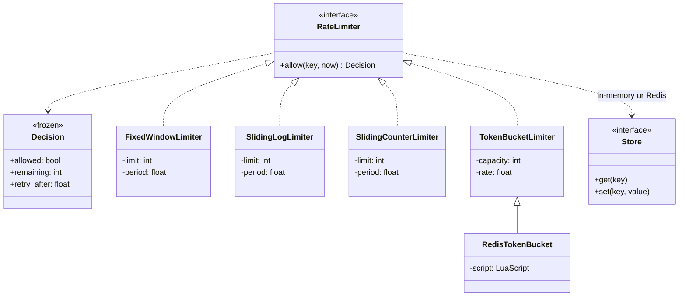

# Day 089 · System design — Design a rate limiter, at the object level

**After today you can:** You can implement fixed window, sliding window and token bucket as classes.

**The interviewer asks it as:** *Implement a rate limiter class. Which algorithm, and why?*

---

## 1. What this is, and why they ask it

A rate limiter answers one question: **may this caller do this now?** A hundred requests a minute per
user, five logins an hour per IP address, one password-reset email a day per account.

The interface is one method returning a boolean, which is why this looks like a small problem. It is
not, and the reason is that there are five different algorithms with genuinely different behaviour, and
the obvious one — count requests per minute, reset the counter each minute — lets a caller send
**twice the limit** in a two-second window, at exactly the moment when they are most likely to be
attacking you.

The second reason is memory. The exact algorithm keeps a timestamp per request per caller, which at a
hundred requests a minute and a million users is nearly a gigabyte of Redis. The approximate ones keep
two numbers per caller. Choosing between exactness and eight hundred megabytes is the interesting
decision, and it is one you can only make if you know what the approximation actually gives up.

They ask it because it is small enough to write in twenty minutes, because the algorithm comparison is
a real engineering trade with numbers on both sides, and because the distributed version has a
race condition that most implementations ship with.

---

## 2. The story

Sundaram has held the kerosene licence for four streets since 1998, and the rule from the office has
always been the same: two litres per card per month.

For years it worked. Then, some time around 2015, he started running out on the second of every month
and having nothing at all by the sixth, and he could not understand it, because the total he was
issuing had not changed.

It took him about three months to see it, and he saw it standing at the shutter on the first of
February with forty people outside and no kerosene.

People were taking their two litres on the last day of one month and their next two litres on the
first day of the next. Four litres in two days. Then nothing for eight weeks, and then four litres in
two days again.

The month total was exactly right. Every card, two litres a month, no exceptions. And his shop was
empty for two days and then idle for four weeks.

What he did — and he had to argue about it at the office for a while — was stop counting by month.

Now it works differently. Every card builds up an allowance, half a litre a week. You can let it
build; the most it will ever hold is two litres, so there is no point saving longer than a month. And
you can take what you have built up whenever you like, all at once if you want. If you have not come
for three weeks, you can take one and a half litres today. If you came yesterday, you have almost
nothing today and you come back next week.

The households were suspicious for about two months and then stopped noticing. What changed for
Sundaram is that his shop is never empty and never idle. The same total goes out every month. It just
goes out at roughly the rate it is used, instead of in a two-day rush against a line on a calendar.

He says the mistake was that the rule was about the calendar and not about the person.

---

## 3. The idea in plain English

Sundaram's month is a **fixed window**. The four litres in two days is the **boundary burst**. And what
he replaced it with — an allowance that builds up at a steady rate and stops at a cap — is a **token
bucket**, which is the answer to almost every rate-limiting question you will be asked.

### The interface, before the algorithms

```python
@dataclass(frozen=True)
class Decision:
    allowed: bool
    remaining: int              # how many more, right now
    retry_after: float          # seconds until the next one would be allowed


class RateLimiter(Protocol):
    def allow(self, key: str, now: float) -> Decision: ...
```

Three things about that signature are worth defending.

**It returns a `Decision`, not a boolean.** The caller needs to send `X-RateLimit-Remaining` and
`Retry-After` headers, and a client that knows when to come back is worth far more than one that
retries blindly and gets refused again. A boolean forces every caller to guess.

**`now` is a parameter.** A limiter that calls the clock itself cannot be tested without sleeping, and
tests that sleep are tests nobody runs. Injecting time is the single most important testability
decision in this class.

**The key is a string.** Per user, per IP, per API key, per user-and-endpoint — the limiter does not
care, and the *choice* of key is the caller's design decision. Say that: the algorithm and the key are
separate questions and people conflate them.

### Algorithm one: fixed window counter

Divide time into fixed minutes. Count. Reset.

```python
    window = int(now // self.period)                 # which minute are we in
    if window != self.current_window:
        self.count, self.current_window = 0, window  # reset
    if self.count < self.limit:
        self.count += 1
        return Decision(True, ...)
```

**Two numbers per key.** Trivial to implement, trivial to distribute — Redis `INCR` on a key named
after the window, with an expiry.

And it has Sundaram's problem:

```
 limit: 100 per minute

 10:00:59   100 requests   -> all allowed (window "10:00")
 10:01:00   100 requests   -> all allowed (window "10:01")
 -------------------------------------------------------
 200 requests in about one second, against a limit of 100 per minute
```

**Twice the limit, in the time it takes to cross a boundary.** And the boundary is *predictable* — it
is the top of the minute — so anybody attacking you can aim for it deliberately.

That is usually the disqualifying fact. Not always: for a coarse quota where the burst does not matter
— "1,000 API calls a day, billing purposes" — fixed window is exactly right and the simplest thing that
works.

### Algorithm two: sliding window log

Keep the timestamp of every request. Drop the ones older than the window. Count what is left.

```python
    hits = self._hits[key]
    while hits and hits[0] <= now - self.period:     # expire from the front
        hits.popleft()
    if len(hits) < self.limit:
        hits.append(now)
        return Decision(True, ...)
```

This is **exactly correct** — no boundary effect, no approximation — and it is the version you already
wrote on [day 077](../day-077-stacks-queues-revision/README.md) as a deque of timestamps.

The price is memory:

```
 limit 100/minute, per key: up to 100 timestamps × 8 B  =  800 B
 1,000,000 active keys                                  =  800 MB
```

**Eight hundred megabytes** to be exactly right, against about a hundred for fixed window. For a limit
of 100 that is a real but survivable cost; for a limit of 10,000 requests an hour it is not.

And one rule that is easy to get wrong and which you met on day 077: **a rejected request must not be
recorded.** Append only when you allow, or a client hammering the endpoint keeps refreshing their own
ban and never escapes.

### Algorithm three: sliding window counter

The compromise almost every CDN actually ships. Keep two counters — this window and the previous one —
and estimate the sliding count by weighting the previous window by how much of it is still in view.

```python
    elapsed = (now % self.period) / self.period      # how far into the current window
    estimate = self.previous_count * (1 - elapsed) + self.current_count
    if estimate < self.limit:
        ...
```

```
 limit 100/min, 30 seconds into the current minute
 previous minute: 80 requests, current minute so far: 40
 estimate = 80 × 0.5 + 40 = 80  ->  allowed, and 20 remain
```

**Two numbers per key, and the boundary burst is gone.** It assumes requests were spread evenly across
the previous window, which is not true — so it can be slightly wrong in both directions. Cloudflare
published measurements putting the error under one percent for real traffic, which is why it is the
default in a lot of production.

### Algorithm four: token bucket — the usual answer

A bucket holds up to `capacity` tokens. Tokens are added at `rate` per second. A request takes one
token if there is one.

```python
    elapsed = now - self.last_refill
    self.tokens = min(self.capacity, self.tokens + elapsed * self.rate)   # lazy refill
    self.last_refill = now
    if self.tokens >= 1:
        self.tokens -= 1
        return Decision(True, ...)
```

Sundaram's half a litre a week, capped at two litres.

Three properties, and together they are why this wins:

- **Two numbers per key** — the token count and the last refill time. Same memory as fixed window.
- **No boundary at all.** Time is continuous; there is no calendar to game.
- **Bursts are allowed, deliberately and boundedly.** A client that has been quiet accumulates up to
  `capacity` tokens and may spend them at once. That is usually what you *want* — a user who has not
  called for an hour should be able to load a page that makes ten requests — and the burst is capped
  by the bucket, not open-ended like the fixed window's.

**Capacity and rate are separate knobs**, which is the real advantage: "100 per minute sustained, but
up to 20 at once" is `rate = 100/60` and `capacity = 20`, and no other algorithm here can express those
two independently.

The **lazy refill** is the implementation trick: no timer, no background job. You compute how many
tokens *would* have arrived since the last call, at the moment of the call. Nothing has to be running,
which is the same lazy-expiry idea as the cinema seat lock — and here it applies, because nothing has
to *happen* when tokens accrue.

### Algorithm five: leaky bucket

Requests join a queue that drains at a fixed rate; the queue has a maximum length and overflow is
rejected. Output is perfectly smooth — no bursts at all, ever.

Use it when the thing downstream cannot absorb a burst: a payment provider that allows exactly 10
requests a second, a legacy system, a serial device. The cost is **latency** — a request may wait in
the queue — and that makes it wrong for a user-facing API, where you would rather refuse quickly than
hold a connection.

**Token bucket limits the rate you accept. Leaky bucket shapes the rate you emit.** That one sentence
tells them apart.

### The comparison, which is the answer to "which algorithm"

| | Memory per key | Boundary burst | Bursts allowed | Exact | Use it when |
|---|---|---|---|---|---|
| Fixed window | 2 numbers | **yes, 2× the limit** | accidental | no | Coarse quotas where a burst is harmless |
| Sliding log | up to `limit` timestamps | no | no | **yes** | Small limits, exactness required |
| Sliding counter | 2 numbers | no | no | ~1% error | High-volume API gateways |
| **Token bucket** | 2 numbers | no | **yes, bounded** | n/a | **The default** |
| Leaky bucket | queue | no | no | n/a | Protecting something downstream |

**Default to token bucket** and be able to say why you would not: a hard quota with no bursts allowed
(sliding log), or a billing counter where the boundary does not matter (fixed window).

### The distributed version, and the race everybody ships

One process is easy. Ten application servers sharing one limit is not, because the state has to be
shared — Redis — and the update has to be atomic.

The obvious Redis fixed-window implementation:

```
 INCR   ratelimit:user42:10:01
 EXPIRE ratelimit:user42:10:01 60
```

**Two commands, and there is a gap between them.** If the process dies, or the connection drops, or
Redis fails over between the `INCR` and the `EXPIRE`, the key has no expiry and lives for ever. The
user is now permanently at their limit, and the only symptom is one user complaining that they are
rate-limited and nobody else is.

Three correct fixes:

- **A Lua script**, which Redis executes atomically — read, compute, write, expire, in one round trip.
  This is the standard answer and it is also what makes token bucket possible in Redis at all, since
  the refill is a read-modify-write.
- **`SET key 1 NX EX 60`** followed by `INCR` for subsequent hits — the first write sets the expiry
  atomically.
- **Redis 7's `EXPIRE ... NX`**, or a pipeline in a `MULTI/EXEC` transaction.

Say the race out loud even if you then use the Lua script. Recognising that `INCR` plus `EXPIRE` is not
atomic is the distributed-systems half of this question.

---

## 4. The picture

The boundary burst, which is the reason fixed window is usually wrong:

```
 limit: 100 per minute, fixed window

   window "10:00"                    window "10:01"
   |------------------------------|------------------------------|
                             ####                ####
                          100 requests        100 requests
                          at 10:00:59         at 10:01:00
                             |__________________|
                                 ~1 second
                              200 requests

 the counter is correct in both windows, and the client sent 2x the limit
 in one second — at a boundary they can predict exactly
```

Token bucket, drawn as Sundaram's allowance:

```
  capacity 20                        tokens accrue at 100/60 = 1.67 per second
  +--------+
  |  ####  |  <- refill: min(capacity, tokens + elapsed × rate)
  |  ####  |
  |  ####  |  <- a request takes 1
  +--------+
       |
       v  spend

  quiet for 12 s:   tokens = min(20, 0 + 12 × 1.67) = 20      (capped)
  20 requests now:  all allowed, bucket empty
  next request:     tokens = 0.  retry_after = (1 - 0) / 1.67 = 0.6 s

  bursts are allowed, and BOUNDED by the capacity — which the fixed window's are not
```

The three memory profiles, at 1,000,000 active keys with a limit of 100 per minute:

```
 FIXED WINDOW      2 numbers                 ~100 B/key   ->  100 MB
 SLIDING COUNTER   2 numbers                 ~100 B/key   ->  100 MB
 TOKEN BUCKET      2 numbers                 ~120 B/key   ->  120 MB
 SLIDING LOG       up to 100 timestamps      ~800 B/key   ->  800 MB

 exactness costs 700 MB, and it buys you correctness at the boundary
 that the sliding counter already approximates to within about 1%
```

And the classes:



What to notice: **four implementations of one interface, and every one of them is real.** This is a
case where the strategy interface is unarguable — the gate from
[day 076](../day-076-lru-cache/README.md) is "can you name a second implementation somebody wants",
and here there are four with different trade-offs and different customers.

---

## 5. How it actually works

### Move 1 · Clarify (minutes 0–5)

> **"What are we limiting per — user, IP, API key, or user-and-endpoint?"** — The key is a caller
> decision, but I need to know whether it is one limit or several.
> **"Is a burst acceptable, or must the rate be strictly smooth?"** — This chooses token bucket versus
> leaky bucket, and it is the question that actually decides the algorithm.
> **"One process or many?"** — Because a shared limit needs shared state and an atomic update.
> **"What should a limited caller be told?"** — Propose `429` with `Retry-After`, because a client that
> knows when to come back is worth more than one that guesses.

> "I will assume a single limit per key for now, that some burst is acceptable, and that we run several
> application servers so the state is shared. I am not designing the policy — who gets what limit —
> only the mechanism."

### Move 2 · The interface, first

```python
@dataclass(frozen=True)
class Decision:
    allowed: bool
    remaining: int
    retry_after: float           # seconds; 0.0 when allowed


class RateLimiter(Protocol):
    def allow(self, key: str, now: float) -> Decision: ...
```

Write this before any algorithm, and say the two design points: **`Decision` rather than a boolean**, so
the caller can send useful headers, and **`now` injected**, so the tests do not sleep.

### Move 3 · Fixed window, and its failure demonstrated

```python
class FixedWindowLimiter:
    def __init__(self, limit: int, period: float = 60.0) -> None:
        self._limit, self._period = limit, period
        self._counts: dict[tuple[str, int], int] = {}

    def allow(self, key: str, now: float) -> Decision:
        window = int(now // self._period)
        slot = (key, window)
        count = self._counts.get(slot, 0)
        if count >= self._limit:
            return Decision(False, 0, (window + 1) * self._period - now)
        self._counts[slot] = count + 1
        return Decision(True, self._limit - count - 1, 0.0)
```

Ten lines, and then **show the burst rather than describe it**: allow 100 at `t = 59.9` and 100 more at
`t = 60.1`, and print that 200 were allowed inside a quarter of a second. Demonstrating the flaw is
worth more than asserting it.

### Move 4 · Sliding log, exact and expensive

```python
class SlidingLogLimiter:
    def allow(self, key: str, now: float) -> Decision:
        hits = self._hits[key]
        cutoff = now - self._period
        while hits and hits[0] <= cutoff:
            hits.popleft()                        # expire from the FRONT
        if len(hits) >= self._limit:
            return Decision(False, 0, hits[0] + self._period - now)
        hits.append(now)                          # only on ALLOW
        return Decision(True, self._limit - len(hits), 0.0)
```

Two details worth pointing at. `retry_after` is exact and free here — the oldest hit plus the period is
precisely when a slot opens, which no other algorithm can tell you as precisely. And **`hits.append`
comes after the rejection check**, so a rejected request is not recorded; the alternative bans a
hammering client for ever.

### Move 5 · Token bucket, the one to write

```python
class TokenBucketLimiter:
    """capacity = how big a burst is allowed; rate = the sustained limit.

    LAZY refill: nothing runs in the background. At each call, compute how many
    tokens would have accrued since the last one. No timer, no sweeper.
    """

    def __init__(self, capacity: int, rate_per_second: float) -> None:
        self._capacity, self._rate = capacity, rate_per_second
        self._state: dict[str, tuple[float, float]] = {}      # key -> (tokens, last)

    def allow(self, key: str, now: float) -> Decision:
        tokens, last = self._state.get(key, (float(self._capacity), now))
        tokens = min(self._capacity, tokens + (now - last) * self._rate)

        if tokens < 1.0:
            self._state[key] = (tokens, now)
            return Decision(False, 0, (1.0 - tokens) / self._rate)

        self._state[key] = (tokens - 1.0, now)
        return Decision(True, int(tokens - 1.0), 0.0)
```

Fifteen lines, two numbers of state, no background job, no boundary. Say the three properties as you
write: **capacity and rate are independent knobs**, the refill is lazy, and the burst is bounded.

Note the new-key default is a **full** bucket. That is a deliberate choice — a first-time caller gets
their full burst — and the alternative, starting empty, punishes new users. Say which you chose.

### Move 6 · Making it distributed, and the race

```python
TOKEN_BUCKET_LUA = """
local tokens_key, ts_key = KEYS[1], KEYS[2]
local rate, capacity, now = tonumber(ARGV[1]), tonumber(ARGV[2]), tonumber(ARGV[3])

local tokens = tonumber(redis.call('GET', tokens_key)) or capacity
local last   = tonumber(redis.call('GET', ts_key))     or now
tokens = math.min(capacity, tokens + (now - last) * rate)

local allowed = tokens >= 1
if allowed then tokens = tokens - 1 end

local ttl = math.ceil(capacity / rate) * 2
redis.call('SET', tokens_key, tokens, 'EX', ttl)
redis.call('SET', ts_key, now, 'EX', ttl)
return { allowed and 1 or 0, tokens }
"""
```

Three things to say about this script, and they are the whole distributed answer.

**It is atomic.** Redis runs a script to completion with nothing interleaved, so the read-modify-write
of the token count cannot race between ten application servers. Doing the same thing with `GET`,
compute, `SET` from Python would lose updates under concurrency, and the symptom would be that the
limit is silently too generous.

**It sets the expiry in the same command as the value.** The classic bug is `INCR` followed by
`EXPIRE`: if anything fails between the two, the key never expires and that caller is limited **for
ever**, with no symptom except one user complaining.

**The TTL is derived, not guessed** — twice the time it takes to refill a full bucket, after which the
state is meaningless anyway. That is what keeps a million idle keys from accumulating.

### Real systems

- **`nginx`'s `limit_req`** is a leaky bucket with an optional `burst` parameter, and `limit_req_zone`
  sizes the shared memory — the memory arithmetic in §6 is exactly what you are doing when you set it.
- **Envoy, Kong and AWS API Gateway** all offer token bucket; AWS's API Gateway exposes it directly as
  a **rate** and a **burst**, which is the two-knob property made into configuration.
- **Stripe** publishes its approach and returns `429` with `Retry-After`; **GitHub** returns
  `X-RateLimit-Remaining` and `X-RateLimit-Reset` on every response, which is why their clients can
  back off intelligently.
- **Cloudflare** uses the sliding window *counter* and published the measurement that its error is
  under one percent on real traffic — which is the evidence behind choosing an approximation.
- **`redis-cell`** is a Redis module implementing the "generic cell rate algorithm", a token bucket
  variant, as a single atomic command — worth naming as the version where somebody else has already
  written the Lua.

---

## 6. The numbers

### Memory, which is the decision

```
 limit: 100 requests per minute
 active keys: 1,000,000

 fixed window      key + 2 ints                    ~100 B  ->  100 MB
 sliding counter   key + 2 ints                    ~100 B  ->  100 MB
 token bucket      key + 2 floats                  ~120 B  ->  120 MB
 sliding log       key + up to 100 × 8 B timestamps ~800 B  ->  800 MB
```

**Exactness costs about 700 MB at a million keys**, and buys correctness at a boundary that the sliding
counter already approximates to within about one percent. At a limit of 100 that is arguable. At a
limit of 10,000 an hour:

```
 sliding log at limit 10,000:  10,000 × 8 B  =  80 KB per key
 1,000,000 keys                              =  80 GB
```

**Eighty gigabytes.** The sliding log does not scale with the limit, and that is the sentence that
decides against it whenever the limit is large.

### The boundary burst, exactly

```
 fixed window, limit 100/minute
 worst case: 100 at t = 59.999 and 100 at t = 60.001
 -> 200 requests in 2 milliseconds, against a stated limit of 100 per minute

 the effective worst-case rate is 2x the configured limit,
 and the boundary is at a predictable instant
```

**Twice the limit, aimable.** That is the number that disqualifies fixed window for anything
security-adjacent — a login limiter that can be doubled at the top of the minute is a login limiter
that will be doubled at the top of the minute.

### Throughput and the cost of checking

```
 50,000 requests/second across the fleet
 -> 50,000 rate-limit checks/second

 in-memory (single process):  ~0.5 µs per check   -> 0.025 core-seconds/second
 Redis Lua script:            ~0.2 ms round trip  -> 10 core-seconds/second of WAITING
```

The Redis round trip is not CPU, it is latency — but it is **0.2 ms added to every single request**,
which on a 20 ms endpoint is one percent, and on a 2 ms endpoint is ten percent. That is the argument
for a **two-tier limiter**: a local in-process bucket sized at, say, the fleet limit divided by the
number of servers, backed by the shared Redis one. Most requests never leave the process.

### Redis sizing

```
 1,000,000 keys × 120 B (token bucket)  =  120 MB of data
 Redis overhead per key, roughly 2x     ->  ~250 MB
 ops: 50,000/second, 1 script call each
 a single Redis node handles ~100,000 simple ops/second
 -> comfortably one node, and one is a single point of failure
```

Which is the honest note: one node is enough for throughput and is a **single point of failure for
every request in the system**. The usual answer is that a rate limiter should **fail open** — if Redis
is unreachable, allow the request rather than refuse it, because refusing everything to protect
against overuse is a worse outage than the overuse. Say that; it is a real operational decision and it
is the opposite of what most people's instinct is.

### The bucket knobs, worked

```
 "100 per minute sustained, bursts of up to 20"
   rate     = 100 / 60  =  1.67 tokens per second
   capacity = 20

 a client quiet for 12 s:  tokens = min(20, 12 × 1.67) = 20  -> 20 at once
 sustained:                1.67 per second = 100 per minute
 empty bucket:             retry_after = 1 / 1.67 = 0.6 s
```

**No other algorithm here can express those two numbers independently**, and that is the practical
reason token bucket wins.

---

## 7. The trade-offs

### What this design gives up

**Token bucket allows bursts, and sometimes that is exactly wrong.** If the thing you are protecting
cannot absorb twenty requests at once — a payment provider with a hard 10/second ceiling, a legacy
system, a database with a small connection pool — then a bounded burst still knocks it over. That is
what leaky bucket is for, and the cost is queueing latency. **Token bucket limits what you accept;
leaky bucket shapes what you emit.**

**Approximate algorithms are approximately right, and the error is not symmetric in importance.** The
sliding counter can allow slightly more than the limit or slightly fewer. Allowing 101 when the limit
is 100 is harmless for an API quota and unacceptable for "three login attempts before lockout". For
small, security-relevant limits, use the exact log — the memory cost is trivial because the limit is
small.

**Shared state adds latency to every request, including the allowed ones.** A Redis round trip on the
hot path is 0.2 ms whether the answer is yes or no. The two-tier mitigation — a local bucket in front
of the shared one — means the local limits are only approximately fair between servers, which is
usually fine and occasionally is not.

**A rate limiter is a single point of failure in front of everything.** Which is why it should **fail
open**: if the store is unreachable, allow. Failing closed converts a Redis blip into a total outage,
and that trade is almost always wrong — the exception being a limiter protecting something that
genuinely cannot survive being overrun, where failing closed is the lesser harm. Decide deliberately
and write it in the code as a comment, because the default behaviour of an exception is to fail closed
by accident.

**The key choice is not the algorithm's problem, and it is where the real bugs are.** Limiting by IP
punishes everybody behind one office NAT and does nothing against a botnet. Limiting by user account
does nothing to the signup endpoint, where there is no user yet. Real systems use several limiters with
different keys at once, and the interesting design work is choosing them.

**No per-endpoint or per-plan variation here.** Real APIs have tiers, and that turns a limiter into a
lookup of "which limit applies to this caller and this route" followed by the mechanism. Worth naming
as a separate concern — the *policy* and the *mechanism* — rather than tangling them.

### "I would change this design if..."

- **...the downstream cannot absorb bursts at all.** Leaky bucket, and accept the latency.
- **...the limit is small and security-relevant** — login attempts, password resets. Sliding log, exact,
  and the memory is nothing because the limit is five.
- **...the check is on a very low-latency endpoint.** Two-tier: a local bucket in front of the shared
  one, so most requests never make a network call.
- **...limits vary by plan and endpoint.** Separate the policy lookup from the mechanism, and cache the
  policy.

### The honest concession

Four algorithms and an interface is a lot of machinery for one boolean. If the requirement were "stop
one broken script hammering us" with no tiers, no bursts and one server, a dictionary of counters and a
fixed window would be twenty lines and completely adequate — the boundary burst does not matter when
you are defending against an accident rather than an adversary. The reason to build the strategy
interface here is unusual and worth stating plainly: **all four implementations are genuinely wanted by
somebody**, which is exactly the gate an interface has to pass, and the algorithm choice is a per-limit
decision rather than a system-wide one.

---

## 8. In the interview

### How it gets asked

- The direct version: *"Implement a rate limiter. Which algorithm and why?"*
- The flaw probe: *"What is wrong with counting requests per minute and resetting?"*
- The memory probe: *"How much memory does that need for a million users?"*
- The distributed probe, which is the important one: *"Now ten servers share the limit."*
- The operational probe: *"Redis is down. What happens?"*

### The timed script

**Minutes 0–5 · Clarify.** Limit per what key? Are bursts acceptable, or must the rate be smooth? One
process or many? What does a limited caller get told? The burst question decides the algorithm, so ask
it first.

**Minutes 5–8 · The interface.** `Decision` rather than a boolean, with `remaining` and `retry_after`,
and `now` injected for testability. Both are one-sentence justifications and both are noticed.

**Minutes 8–16 · Fixed window, and demonstrate the burst.** Write it, then show 200 requests in two
milliseconds against a limit of 100 a minute. Say when it is still the right answer.

**Minutes 16–24 · Sliding log and its memory**, then the sliding counter as the compromise, with the
one-percent error figure.

**Minutes 24–32 · Token bucket, written out.** Lazy refill, two independent knobs, bounded burst, two
numbers of state.

**Minutes 32–40 · Distributed.** The `INCR`/`EXPIRE` race, the Lua script, the derived TTL, the
two-tier latency mitigation, and fail-open.

### The follow-ups

**"What is wrong with a counter that resets every minute?"**
"The boundary. A caller can send the full limit in the last moments of one window and the full limit
again in the first moments of the next — a hundred at 10:00:59 and a hundred at 10:01:00 — which is
twice the configured limit inside about a second. And the boundary is at a predictable instant, so it
can be aimed at deliberately. That is disqualifying for anything security-adjacent, like a login
limiter. It is still the right answer for a coarse quota where a burst is harmless — a thousand API
calls a day for billing — because it is two numbers per key and trivially distributable."

**"Which algorithm would you use, and why?"**
"Token bucket, by default. Two numbers of state per key, so the same memory as a fixed window. No
boundary to game, because time is continuous. And crucially the **rate and the burst are separate
knobs**: 'a hundred a minute sustained, up to twenty at once' is a rate of 1.67 tokens a second and a
capacity of twenty, and no other algorithm here can express those two independently. The refill is
lazy — at each call you compute how many tokens would have accrued since the last one — so nothing runs
in the background. I would move off it in two cases: a small security-relevant limit like login
attempts, where I want the exact sliding log and the memory is trivial because the limit is five; or a
downstream that genuinely cannot take a burst, where I want a leaky bucket and accept the queueing
latency."

**"How much memory for a million users?"**
"Depends entirely on the algorithm, and this is usually the deciding number. Token bucket, fixed window
and sliding counter are all two numbers per key — call it a hundred to a hundred and twenty bytes with
the key, so a hundred-odd megabytes. A sliding log keeps a timestamp per request in the window: at a
limit of a hundred a minute that is eight hundred bytes a key and eight hundred megabytes. And it
scales with the *limit* — at ten thousand an hour it is eighty kilobytes per key and eighty gigabytes,
which rules it out entirely. So exactness costs about seven hundred megabytes at a small limit and
becomes impossible at a large one."

**"Now ten servers share the limit."**
"The state moves to Redis, and the update has to be atomic — which is where most implementations have
a bug. The obvious version is `INCR` on a key named for the window, then `EXPIRE`. Those are two
commands, and if anything fails between them the key never expires and that caller is rate-limited for
ever, with no symptom except one user complaining. The fix is a Lua script, which Redis runs
atomically: read the tokens and the timestamp, refill, decide, write both back with a TTL, in one
round trip. That is also what makes token bucket possible in Redis at all, since the refill is a
read-modify-write that would otherwise lose updates under concurrency."

**"What does that cost on the hot path?"**
"About 0.2 milliseconds per request for the Redis round trip, on every request including the allowed
ones. On a twenty-millisecond endpoint that is one percent and I would not care; on a
two-millisecond endpoint it is ten percent and I would. The mitigation is two tiers: a local
in-process bucket sized at roughly the fleet limit divided by the number of servers, backed by the
shared one, so most requests never make a network call. The cost is that the local limits are only
approximately fair between servers, which is usually acceptable."

**"Redis is down. What happens?"**
"It should **fail open** — allow the request. That is the opposite of most people's instinct, and the
reasoning is that a rate limiter sits in front of everything, so failing closed converts a Redis blip
into a total outage. Being briefly over-permissive is almost always the lesser harm than serving
nothing. The exception is a limiter protecting something that genuinely cannot survive being overrun,
where failing closed is correct. Either way it has to be a *decision written in the code*, because the
default behaviour of an unhandled exception is to fail closed by accident."

**"What do you return to a limited caller?"**
"A 429, and — the part that matters — `Retry-After` with the number of seconds until a slot opens, plus
`X-RateLimit-Remaining` on every response. A client that knows when to come back backs off correctly;
a client that just gets `false` retries immediately and makes the problem worse. That is why the method
returns a `Decision` object rather than a boolean, and it is nearly free: the sliding log knows exactly
when a slot opens, and the token bucket computes it as the tokens still needed divided by the rate."

### A model answer

Asked: *implement a rate limiter. Which algorithm, and why?*

> "Before the algorithm, one question that decides it: are bursts acceptable, or does the rate have to
> be strictly smooth? Because that is the difference between a token bucket and a leaky bucket, and
> everything else follows.
>
> I would start with the interface, because two decisions there matter. The method returns a
> `Decision` — allowed, remaining, and retry-after — not a boolean, because the caller needs to send a
> `Retry-After` header, and a client that knows when to come back is worth far more than one that
> retries blindly. And the current time is a parameter, not something the class reads from the clock,
> because otherwise every test has to sleep and nobody runs tests that sleep.
>
> Now the algorithms, and I want to start with the obvious one specifically to show why it is wrong.
> Fixed window: count requests in each minute, reset the counter each minute. Two numbers per key,
> trivially distributable — and a caller can send the full limit at 10:00:59 and the full limit again
> at 10:01:00, which is twice the limit in about a second, at an instant they can predict exactly. For
> a billing quota that is harmless. For a login limiter it is disqualifying.
>
> The exact fix is a sliding log: keep the timestamp of every request, drop the ones outside the
> window, count what is left. It is precisely correct and it tells you exactly when the next slot
> opens. The cost is memory — one timestamp per request per key, so at a hundred a minute and a
> million users that is eight hundred megabytes, against a hundred for the counter versions. Worse, it
> scales with the *limit*: at ten thousand an hour it is eighty gigabytes, which rules it out.
>
> So the answer I would actually give is a **token bucket**. A bucket holds up to `capacity` tokens,
> tokens accrue at a fixed rate, a request spends one. Three properties make it the default. Two
> numbers of state, so the same memory as the fixed window. No boundary, because time is continuous
> and there is no calendar to game. And the rate and the burst are *independent knobs* — 'a hundred a
> minute sustained, up to twenty at once' is a rate of 1.67 a second and a capacity of twenty, and no
> other algorithm here can express those separately.
>
> The implementation trick is the lazy refill: nothing runs in the background. At each call I compute
> how many tokens would have accrued since the last call and cap at the capacity. Fifteen lines, no
> timer, no sweeper.
>
> For several servers sharing a limit, the state goes to Redis and the update must be atomic — and
> this is where most implementations have a bug. `INCR` followed by `EXPIRE` is two commands, and if
> anything fails between them the key never expires and that user is limited for ever, with no symptom
> except one person complaining. So: a Lua script, which Redis runs atomically, doing the read,
> refill, decide and write with a derived TTL in one round trip.
>
> Two operational notes. That round trip is about 0.2 milliseconds on every request, so on a very fast
> endpoint I would put a local bucket in front of the shared one. And the limiter should **fail open**
> — if Redis is unreachable, allow — because it sits in front of everything and failing closed turns a
> Redis blip into a total outage. That has to be written down deliberately, because an unhandled
> exception fails closed by accident."

---

## 9. Recall card

- **Return a `Decision` (allowed, remaining, retry_after), not a boolean, and inject `now`.** A client
  that knows when to come back backs off correctly; a limiter that reads its own clock cannot be tested
  without sleeping.
- **Fixed window's flaw is the boundary and it is aimable: the full limit at 10:00:59 plus the full
  limit at 10:01:00 is 2× the limit in ~1 second.** Fine for a coarse billing quota, disqualifying for
  anything security-adjacent.
- **Memory is the deciding number.** Fixed window / sliding counter / token bucket are **2 numbers per
  key** (~100–120 B → ~100 MB at 1M keys). **Sliding log is exact and keeps a timestamp per request** —
  800 B/key at a limit of 100 → **800 MB**, and it scales with the *limit*: **80 GB** at 10,000/hour.
  Cloudflare's sliding **counter** approximates to within ~1% for two numbers.
- **Default to the token bucket.** Two numbers, no boundary, **lazy refill** (nothing runs in the
  background), and — the real reason — **rate and burst are independent knobs**: "100/min with bursts of
  20" = rate 1.67/s, capacity 20. *Token bucket limits what you accept; leaky bucket shapes what you
  emit.*
- **Distributed: `INCR` then `EXPIRE` is the bug everybody ships** — a failure between them leaves a key
  with no TTL and that caller limited **for ever**. Use a **Lua script** (atomic read-modify-write, TTL
  derived from capacity ÷ rate). Add a **local bucket in front** if 0.2 ms per request matters. And
  **fail open** when the store is down — a limiter sits in front of everything, so failing closed turns
  a blip into an outage.
