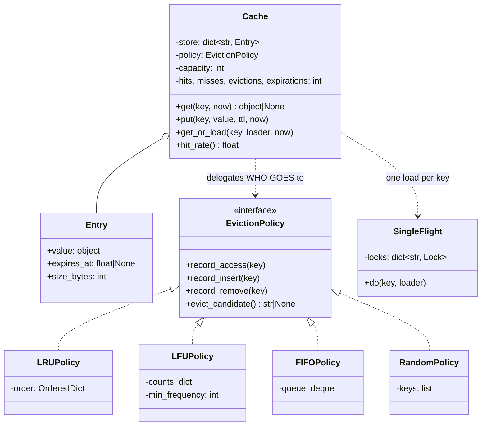

# Day 090 · System design — Design an in-memory cache with eviction

**After today you can:** You can design a cache with a pluggable eviction policy and a TTL.

**The interviewer asks it as:** *Design an in-memory cache. Now make the eviction policy swappable.*

---

## 1. What this is, and why they ask it

A cache is a small fast store in front of a big slow one. It holds a bounded number of entries, and
when it is full and something new arrives, it has to throw something out.

You built one on [day 076](../day-076-lru-cache/README.md) — a hash map plus a doubly linked list,
O(1) get and put, least-recently-used eviction. Today the question is what happens when the requirement
grows, and it grows in three directions that people routinely merge into one.

**Eviction is about capacity.** The cache is full; something must go. Which one is a *policy* — least
recently used, least frequently used, first in, or at random — and the four have genuinely different
behaviour on real workloads.

**Expiry is about correctness.** This entry is now too old to trust, whether or not the cache is full.
An entry can be expired and still resident, and evicted while still perfectly fresh. **They are two
different mechanisms and merging them is the standard design mistake.**

**And the third thing nobody mentions until it happens**: when a popular key expires, every request
that wanted it misses at the same instant and they all go to the database together. That is a **cache
stampede**, and a cache that does not handle it can be worse than no cache at all — because at least
without a cache the load is steady.

They ask it because everyone has used a cache and few have designed one, because the policy interface
is a case where Strategy is unarguably justified, and because the stampede is a real production
failure that has taken down real systems.

---

## 2. The story

Mohan's medical shop is deeper than it is wide, and everything about how it works comes from that.

Behind the counter there is one shelf he can reach without moving his feet. It holds about two hundred
boxes. Behind him, in the racks going back into the dark, there are perhaps four thousand more, and
fetching one means putting the ladder up, and that is a minute and a half with somebody waiting.

So the two hundred boxes on the front shelf are the whole business. Get them right and he serves
someone in fifteen seconds; get them wrong and he is up the ladder all day.

He has never written down how he chooses. Watching him, it is two rules.

The first is that whatever he has just been asked for goes back on the front shelf, near the middle,
and something that has not been asked for in a long time gets pushed along and eventually goes to the
back. He does this without thinking, while talking to the next customer.

The second rule is different in kind and he is strict about it. Some boxes have dates on them. When
the date has gone, the box goes — and it does not matter at all how popular it is. The most-asked-for
thing in the shop, if it is out of date, comes off the shelf. Popular and usable are two different
questions, and the shelf being full has nothing to do with either.

He checks dates in a way that surprised his son. He does not go through the whole shelf. When he picks
a box up for a customer, he looks at the date then — most of the checking happens for free, while
doing something else. And once a week, on the quiet Thursday afternoon, he pulls out a handful at
random and checks those, because the ones nobody asks for are exactly the ones that quietly go out of
date at the back of the shelf and never get looked at.

The bad day is the first cold morning of the season.

On that morning, thirty or forty people come in wanting the same cough syrup, and it is not on the
front shelf because nobody has asked for it since February. So the first customer sends him up the
ladder. And while he is up the ladder, six more people come in and ask for the same thing, and his
son, who does not know the box is already coming down, starts to go for the ladder too.

What they do now is that whoever asks first is told a minute, and everybody who asks after that is
told to wait for the same box. One trip up the ladder, not seven.

---

## 3. The idea in plain English

Mohan's front shelf is the cache. Pushing the untouched boxes to the back is **eviction**. The dates
are **expiry** — a completely separate mechanism. And the first cold morning is a **cache stampede**.

### The three mechanisms, kept apart

| | Question it answers | Triggered by | Applies to |
|---|---|---|---|
| **Eviction** | The cache is full — what goes? | a `put` when at capacity | a *fresh* entry, chosen by policy |
| **Expiry** | Is this entry still trustworthy? | a TTL passing | *any* entry, regardless of capacity |
| **Invalidation** | The source changed — drop it now | an external event | one specific key |

An entry can be **expired but resident** (nobody has looked at it since it expired) and **evicted while
fresh** (something newer arrived and it was the least recently used). Mohan's out-of-date bestseller,
and his perfectly good box pushed to the back.

Merging them produces the classic bug: an "LRU cache with TTL" where expired entries are only removed
when they happen to be the least recently used — so the least popular expired entries sit there for
ever, and the cache is full of things it will never serve.

### The entry, and what it has to carry

```python
@dataclass
class Entry:
    value: object
    expires_at: float | None      # None = never expires
    size_bytes: int               # for byte-based capacity
    # whatever the policy needs lives in the policy, NOT here
```

The last line is the design decision. `Entry` does not hold `last_used` or `hit_count`, because those
belong to whichever policy is installed — an LFU cache needs a counter that an LRU cache does not, and
putting both on the entry means the entry knows about policies.

### The eviction policy, which is a real interface

```python
class EvictionPolicy(Protocol):
    def record_access(self, key: str) -> None: ...   # a get, or a put of an existing key
    def record_insert(self, key: str) -> None: ...
    def record_remove(self, key: str) -> None: ...
    def evict_candidate(self) -> str | None: ...     # who goes next
```

Four implementations, all real:

- **LRU** — evict the least recently used. Good when access has *recency* locality, which most
  workloads do. The hash map plus doubly linked list from
  [day 076](../day-076-lru-cache/README.md).
- **LFU** — evict the least frequently used. Better when there is a stable set of hot keys and a long
  tail of one-off requests, because LRU lets a burst of scans push the hot set out. Needs a third
  structure and a `min_frequency` counter to stay O(1), and it **never forgets**: an entry that was hot
  last month holds a huge count and will not leave. Real implementations decay the counts or use a
  window.
- **FIFO** — evict the oldest inserted. Trivial, ignores usage entirely, and surprisingly acceptable
  when entries all have similar value.
- **Random** — evict a random entry. Almost no bookkeeping, no locks on the hot path, and its hit rate
  is usually **within a few percent of LRU**. Redis's default `allkeys-lru` is in fact an
  *approximation* built on random sampling for exactly this reason.

**Four implementations that somebody genuinely wants is the gate an interface has to pass** — the same
test as [day 076](../day-076-lru-cache/README.md) — and this one passes it more clearly than almost any
other example in the course.

### Expiry: lazy plus sampled, which is what Redis does

Two mechanisms, and you need both.

**Lazy expiry, on read.** When `get` finds an entry, check the expiry; if it has passed, delete it and
report a miss. Costs nothing, needs nothing running, and is *correct* — no expired value is ever
served. Mohan checking the date as he picks the box up.

**Active expiry, by sampling.** Lazy alone leaks: an entry nobody ever asks for again is never read, so
its expiry is never noticed, and it occupies capacity for ever. So a background loop samples a handful
of keys — Redis takes twenty at a time, ten times a second — deletes the expired ones, and if more than
a quarter were expired, samples again immediately. Mohan's Thursday afternoon handful.

**Lazy alone is correct but leaks. Sampling alone is wasteful. Both together is the answer**, and being
able to say why each is insufficient on its own is the point.

Note that this is the opposite of the food order on
[day 087](../day-087-recursion-leap-of-faith/README.md), where a timeout had to *do* something — refund
and notify — so a sweeper was mandatory. Here nothing needs to happen when an entry expires; it only
must not be served. **When expiry has no side effect, lazy is enough for correctness**, and the sweep
is only about memory.

### The stampede, which is the failure that hurts

A hot key expires. Every request for it now misses. Every miss goes to the database. If the key gets
five thousand requests a second and the database query takes two hundred milliseconds, then in the two
hundred milliseconds it takes the first request to load it, **a thousand more requests have arrived and
all of them have also missed**.

```
 5,000 requests/second × 0.2 s load time = 1,000 concurrent identical queries
```

A thousand identical queries against one row. The database slows down, so the load takes longer, so
more requests pile up. This is how a cache expiry takes down a database, and it is not rare — it is the
first cold morning, every time.

Two fixes, and the first is the one to name:

**Single-flight.** The first request to miss takes a per-key lock and loads. Everyone else who misses
that key **waits for the same load** rather than starting their own. One trip up the ladder.

```python
    with self._loading_lock(key):        # per key, not global
        cached = self._store.get(key)
        if cached is not None:           # somebody loaded it while we waited
            return cached.value
        value = loader()
        self.put(key, value)
        return value
```

The double check inside the lock is essential: by the time you get the lock, the first request may have
finished, and re-loading would defeat the whole thing.

**Probabilistic early expiry.** Instead of everything expiring at exactly `t`, each read has a small
chance of treating the entry as expired slightly early, rising as the true expiry approaches. Hot keys
are read often, so one of those reads refreshes the value *before* it expires — and the misses are
spread out rather than simultaneous. Cheaper than locking and it never fully blocks.

A third, blunter one worth naming: **jitter the TTLs**. If a thousand keys are all loaded at start-up
with a ten-minute TTL, they all expire in the same second. `ttl + random(0, ttl/10)` costs one line and
removes an entire class of synchronised stampede.

### Sizing: entries or bytes

"Capacity 10,000 entries" is easy and often wrong, because entries differ:

```
 10,000 entries × 200 B     =  2 MB
 10,000 entries × 2 MB      = 20 GB
```

Same configuration, four orders of magnitude apart. If values vary in size, **bound by bytes**, which
means measuring each value on insert — `sys.getsizeof` is a rough answer and a serialised length is a
better one — and evicting until you are under the limit rather than evicting exactly one thing.

The cost is that measurement is not free and is not exact for nested Python objects. Say which you
chose and why: entries when values are uniform, bytes when they are not.

### The one number that matters

```python
    @property
    def hit_rate(self) -> float:
        total = self._hits + self._misses
        return self._hits / total if total else 0.0
```

**A cache with no hit-rate metric cannot be tuned**, and every question about capacity or policy is
unanswerable without it. Expose hits, misses, evictions and expirations separately, because they mean
different things: rising evictions means too small, rising expirations means the TTL is too short, and
a falling hit rate with neither means the workload changed.

---

## 4. The picture

The three mechanisms, and how an entry leaves:

```
                          +---------------------------+
   put(key, value) ---->  |        THE CACHE          |
                          |   capacity: 200 entries   |
                          +---------------------------+
                             |        |            |
                   EVICTION  |        | EXPIRY     | INVALIDATION
                   "full"    |        | "too old"  | "source changed"
                             v        v            v
                   chosen by policy   any entry    one named key
                   (LRU/LFU/FIFO/     regardless   regardless of
                    Random)           of capacity  everything

   an entry can be EXPIRED AND RESIDENT   (nobody has read it since)
   an entry can be EVICTED WHILE FRESH    (something newer arrived)
```

The stampede, drawn on a timeline:

```
 hot key, 5,000 requests/second, database load takes 200 ms

  t=0.000   TTL passes. Entry expires.
  t=0.001   request 1 misses -> starts loading
  t=0.002   request 2 misses -> starts loading      <- nothing stops it
  t=0.003   request 3 misses -> starts loading
   ...
  t=0.200   request 1,000 misses -> starts loading
  t=0.200   request 1 finishes, fills the cache
  -----------------------------------------------------
  1,000 identical queries for one row, all in flight at once

 WITH SINGLE-FLIGHT

  t=0.001   request 1 misses -> takes the key's lock -> loads
  t=0.002   request 2 misses -> waits on the lock
   ...      requests 3..1000 wait on the same lock
  t=0.200   request 1 fills the cache and releases
  t=0.200   requests 2..1000 wake, re-check, FIND IT, return
  -----------------------------------------------------
  1 query
```

And the class structure, where the policy interface is the design:



What to notice: **`Entry` holds no policy bookkeeping.** No `last_used`, no `hit_count` — those live in
whichever policy is installed. An entry that knew about recency *and* frequency would be an entry that
knows about policies, and swapping the policy would then mean changing the entry.

---

## 5. How it actually works

### Move 1 · Clarify (minutes 0–5)

> **"In-process, or shared across servers?"** — In-process. A shared cache is Redis and a different
> conversation.
> **"Do entries expire, or only get evicted when full?"** — Both, and I would separate them explicitly.
> **"Are the values similar in size?"** — Because that decides whether capacity is counted in entries
> or bytes.
> **"Is it read by several threads?"** — Because that decides the locking, and a single lock in front
> of a cache can be slower than no cache.

> "I will assume values are immutable once cached, that a stale value is unacceptable but a missing one
> is fine, and that the loader function is supplied by the caller. I am not designing distribution or
> persistence."

### Move 2 · The nouns (minutes 5–10)

- **`Entry`** — the value, its expiry, its size. No policy state.
- **`EvictionPolicy`** *(interface)* — four implementations.
- **`Cache`** — the store, the capacity, the stats. Holds no policy logic.
- **`SingleFlight`** — one in-flight load per key.
- **`Stats`** — hits, misses, evictions, expirations, exposed separately.

Five, one interface with four implementations. Notice that there is no `TTLManager` class: expiry is a
field on the entry plus a check on read, and inventing a manager for it is how the two mechanisms get
merged.

### Move 3 · `get`, where expiry is lazy

```python
    def get(self, key: str, now: float) -> object | None:
        entry = self._store.get(key)
        if entry is None:
            self._misses += 1
            return None

        if entry.expires_at is not None and entry.expires_at <= now:
            self._remove(key)                  # expired: delete and report a MISS
            self._expirations += 1
            self._misses += 1
            return None

        self._policy.record_access(key)        # a read is a use — LRU depends on this
        self._hits += 1
        return entry.value
```

Two things to say while writing it. **An expired hit is a miss**, not a hit — counting it as a hit
makes the hit-rate metric lie in exactly the situation you need it to be honest. And
`record_access` is the line from [day 076](../day-076-lru-cache/README.md): **a read is a write**, and
leaving it out gives a cache that evicts by insertion order while returning perfectly correct values.

### Move 4 · `put`, where eviction happens

```python
    def put(self, key: str, value: object, now: float, ttl: float | None = None) -> None:
        if key in self._store:
            self._store[key] = Entry(value, now + ttl if ttl else None, sizeof(value))
            self._policy.record_access(key)     # an overwrite is a use
            return

        while len(self._store) >= self._capacity:      # WHILE, not IF
            victim = self._policy.evict_candidate()
            if victim is None:
                break
            self._remove(victim)
            self._evictions += 1

        self._store[key] = Entry(value, now + ttl if ttl else None, sizeof(value))
        self._policy.record_insert(key)
```

**`while`, not `if`.** With byte-based capacity, one large value may require evicting several entries,
and even with entry counts a `while` is correct and an `if` is only accidentally correct. The
`victim is None` guard stops an infinite loop when the policy has nothing left to give.

### Move 5 · The policies

```python
class LRUPolicy:
    """Recency. An OrderedDict is a dict plus a doubly linked list, so
    move_to_end and popitem(last=False) are the two O(1) operations."""

    def __init__(self) -> None:
        self._order: OrderedDict[str, None] = OrderedDict()

    def record_access(self, key: str) -> None:
        self._order.move_to_end(key)           # most recent at the end

    def record_insert(self, key: str) -> None:
        self._order[key] = None

    def record_remove(self, key: str) -> None:
        self._order.pop(key, None)

    def evict_candidate(self) -> str | None:
        return next(iter(self._order), None)   # least recent is first
```

```python
class LFUPolicy:
    """Frequency, kept O(1) with a min_frequency counter.

    The honest weakness: plain LFU NEVER FORGETS. An entry that was hot last
    month holds a huge count and refuses to leave. Real implementations decay
    counts periodically or count within a window.
    """

    def evict_candidate(self) -> str | None:
        while self._min_frequency in self._buckets and not self._buckets[self._min_frequency]:
            self._min_frequency += 1
        bucket = self._buckets.get(self._min_frequency)
        return next(iter(bucket), None) if bucket else None
```

```python
class RandomPolicy:
    """Almost no bookkeeping, and its hit rate is usually within a few percent
    of LRU. Redis's allkeys-lru is itself an APPROXIMATION built on random
    sampling, for exactly this reason."""

    def evict_candidate(self) -> str | None:
        return random.choice(self._keys) if self._keys else None
```

Writing `RandomPolicy` and saying that it is nearly as good as LRU is worth doing. It is
counter-intuitive, it is true, and it demonstrates that you know why LRU's bookkeeping costs something.

### Move 6 · Single-flight, which is the failure fix

```python
    def get_or_load(self, key: str, loader, now: float, ttl: float | None = None):
        cached = self.get(key, now)
        if cached is not None:
            return cached

        with self._lock_for(key):              # PER KEY, never a global lock
            cached = self.get(key, time.time())     # somebody may have loaded it
            if cached is not None:
                return cached
            value = loader()
            self.put(key, value, time.time(), ttl)
            return value
```

Three details, all necessary.

**The lock is per key.** A global load lock serialises every miss in the system, which is slower than
having no cache at all.

**The re-check inside the lock** is what makes it work. By the time you acquire it, the first request
has usually finished, and skipping the re-check means every waiter loads anyway.

**And `now` is re-read** after waiting, because you may have been blocked for two hundred milliseconds.

### Move 7 · Active expiry, sampled

```python
    def sweep(self, now: float, sample: int = 20) -> int:
        """Redis's approach: sample a handful, delete the expired, and if more
        than a quarter were expired, go again. Lazy expiry alone is correct but
        leaks — an entry nobody reads is never noticed."""
        removed = 0
        for _ in range(4):
            keys = random.sample(list(self._store), min(sample, len(self._store)))
            expired = [k for k in keys
                       if (e := self._store[k]).expires_at and e.expires_at <= now]
            for key in expired:
                self._remove(key)
                self._expirations += 1
            removed += len(expired)
            if len(expired) <= len(keys) // 4:      # not many left; stop
                break
        return removed
```

The "sample again if more than a quarter were expired" rule is the clever part and it is Redis's: it
makes the sweep adaptive, doing almost nothing when few keys are expiring and working hard when many
are.

### Real systems

- **Redis** does exactly this pairing: lazy expiry on access, plus an active cycle sampling twenty keys
  and repeating while more than 25 percent are expired. And `maxmemory-policy allkeys-lru` is
  **approximate** LRU by sampling, not exact — because exact LRU bookkeeping at ten million keys costs
  more than the accuracy is worth.
- **Caffeine** (Java) uses **W-TinyLFU**, a windowed frequency sketch, and reports hit rates
  consistently better than LRU on real traces — evidence that "LRU is the best policy" is folklore
  rather than fact.
- **Memcached** uses a segmented LRU with a lazy expiry and no active sweep at all, which is why an
  entry can occupy memory long after it expired.
- **`functools.lru_cache`** is the standard-library version with no TTL and no thread-shared eviction
  policy — worth naming as the thing you would use before writing any of this.
- **Single-flight** is a named pattern with implementations in most ecosystems — Go's
  `golang.org/x/sync/singleflight`, Caffeine's loading caches — precisely because everybody hits the
  stampede eventually.

---

## 6. The numbers

### Why a cache is worth having, and when it stops being

```
 database read   100 µs
 cache read        1 µs

 hit rate 99%:  0.99 × 1 + 0.01 × 100  =  1.99 µs   ->  50x
 hit rate 95%:  0.95 × 1 + 0.05 × 100  =  5.95 µs   ->  17x
 hit rate 90%:  0.90 × 1 + 0.10 × 100  = 10.90 µs   ->   9x
 hit rate 50%:  0.50 × 1 + 0.50 × 100  = 50.50 µs   ->   2x
```

**The value falls off a cliff below about 95 percent.** That is why the hit rate is the number to
measure, and why "add a cache" without measuring it is not a plan.

### Sizing

```
 100,000 entries × 2 KB value                      =  200 MB
 + Entry object overhead ~120 B                    =   12 MB
 + dict entry ~100 B                               =   10 MB
 + LRU OrderedDict node ~100 B                     =   10 MB
 --------------------------------------------------------------
 total                                             ≈  232 MB
```

**About 16 percent overhead on 2 KB values** — and on 200-byte values the same bookkeeping is 160
percent overhead, more than the data. That is the argument for byte-based capacity and for not caching
tiny values individually.

```
 the same 100,000 entries at 2 MB each  =  200 GB
```

Same "capacity: 100,000", four orders of magnitude apart. **Count bytes when values vary.**

### The stampede, quantified

```
 a hot key: 5,000 requests/second
 database load for that key: 200 ms

 without single-flight:
   concurrent identical queries = 5,000 × 0.2 = 1,000
   each holding a connection from a pool of, say, 100
   -> the pool is exhausted 10x over; unrelated queries also fail

 with single-flight:
   concurrent queries = 1
   the other 999 wait ~200 ms and are then served from the cache
```

**A thousand identical queries against one row, versus one.** And note the second-order failure: it is
not the hot key that breaks, it is everything *else*, because the connection pool is shared.

### Synchronised expiry

```
 1,000 keys loaded at start-up, all with a 600 s TTL
 -> all 1,000 expire within the same second, 10 minutes later
 -> 1,000 stampedes at once

 with jitter: ttl + random(0, 60)
 -> the same 1,000 expiries spread over 60 seconds  =  ~17 per second
```

**One line of jitter converts a cliff into a slope.** This is the cheapest fix in the whole lesson.

### Expiry sweep cost

```
 100,000 entries, 20 sampled 10 times a second = 200 checks/second
 -> 0.2% of the keyspace per second
 an entry that nobody reads is found, on average, within ~500 s
```

That lag is the honest cost of sampling: expired entries occupy memory for a few minutes on average.
Scanning everything would be exact and would cost 100,000 checks per cycle — which is why nobody does
it.

### Policy comparison, honestly

```
 typical web workload, cache holding 10% of the working set:

   FIFO      ~ 8-10 percentage points worse than LRU
   Random    ~ 1-3 points worse than LRU
   LRU       baseline
   LFU       better on stable hot sets, worse on shifting ones
   W-TinyLFU ~ 3-8 points better than LRU on published traces
```

**Random is within a few points of LRU for almost no bookkeeping**, which is why Redis approximates
rather than implements exact LRU. Quote this rather than asserting that LRU is best.

---

## 7. The trade-offs

### What this design gives up

**A pluggable policy costs an indirection on every access.** `record_access` is called on every hit,
and with a policy behind an interface that is a method call and a data-structure update on the hottest
path in the system. For a cache doing a million gets a second, that is measurable. The mitigation is
that the policies are small and the interface is narrow — and the honest note is that if you only ever
want LRU, `OrderedDict` inline is faster and shorter.

**LFU never forgets, and plain LFU is a trap.** An entry that was hit ten thousand times last month
outranks one hit fifty times this morning, for ever. Any real LFU needs decay or a window, and a
candidate who proposes LFU without mentioning that has not used one.

**Byte-based sizing is approximate.** `sys.getsizeof` does not follow references, so a list of a
thousand strings reports as a few kilobytes when the strings are megabytes. Serialised length is more
honest and costs a serialisation. Either way the limit is a guide, not a guarantee, and you should size
the process with headroom.

**Single-flight adds a lock on the miss path and can cascade.** If the loader is slow or hangs, every
waiter for that key is blocked, and without a timeout on the wait, one slow query becomes a thousand
stuck threads. A bounded wait, after which a waiter either loads anyway or returns a stale value, is
the safer shape.

**A stale-but-available answer is often better than a correct-but-slow one**, and this design does not
offer it. `stale-while-revalidate` — serve the expired value immediately and refresh in the background
— removes the stampede entirely and trades a few seconds of staleness. For most read paths that is the
right trade, and it should be a per-key policy rather than a global one.

**Thread safety is not free.** One lock around the whole cache serialises every access and can make the
cache slower than the database it fronts. Sharding into sixteen caches by `hash(key) % 16` cuts
contention by roughly the shard count and is what real implementations do — but then the capacity is
per shard, and an uneven key distribution wastes some of it.

**In-process caches do not share.** Ten servers means ten copies, ten times the memory, and ten
independent stampedes on the same key. A shared Redis fixes that and adds a network hop of about 0.2 ms
to every hit — which, against a 1 µs local hit, is two hundred times slower. **Local and shared caches
are different tools**, and the usual production answer is both, with the local one in front.

### "I would change this design if..."

- **...values vary wildly in size.** Byte-based capacity, and refuse to cache anything above a
  threshold at all.
- **...staleness is acceptable.** `stale-while-revalidate`, which deletes the stampede problem.
- **...the workload is a stable hot set with a scanning tail.** LFU with decay, or W-TinyLFU, because
  LRU lets the scan evict the hot set.
- **...several processes need the same cache.** Redis, with a local cache in front of it, and accept
  the invalidation problem that two tiers create.
- **...I only ever need LRU with no TTL.** `functools.lru_cache`, and delete all of this.

### The honest concession

The eviction policy is the part that looks like the design and it is the part that matters least. The
difference between LRU and random is a few percentage points of hit rate. The difference between having
single-flight and not having it is a thousand concurrent queries against one row, and the difference
between jittered and unjittered TTLs is whether a thousand keys expire in the same second. **The
interesting engineering here is in the failure modes, not in the policy** — and a candidate who spends
thirty minutes on LRU internals and never mentions the stampede has answered the wrong question.

---

## 8. In the interview

### How it gets asked

- The standard: *"Design an in-memory cache."* Then: *"Now make the eviction policy swappable."*
- The separation probe: *"What is the difference between eviction and expiry?"*
- The failure probe, which is the good one: *"A very popular key expires. What happens?"*
- The sizing probe: *"How do you decide the capacity?"*
- The judgement probe: *"Which eviction policy would you use, and does it matter?"*

### The timed script

**Minutes 0–5 · Clarify.** In-process or shared? Do entries expire as well as get evicted? Are values
similar in size? Multi-threaded? Each answer changes a decision.

**Minutes 5–12 · Separate the three mechanisms explicitly.** Eviction is capacity, expiry is
correctness, invalidation is an external event. Say that an entry can be expired-and-resident or
evicted-while-fresh — that sentence is the framing the whole design hangs on.

**Minutes 12–22 · The classes.** `Entry` with no policy state, the `EvictionPolicy` interface with four
real implementations, and the `Cache` holding stats. Point out that four wanted implementations is
what justifies the interface.

**Minutes 22–30 · Expiry done properly** — lazy on read *and* sampled sweep, with why each alone is
insufficient.

**Minutes 30–38 · The stampede.** The arithmetic — 5,000 rps × 200 ms = 1,000 concurrent queries —
then single-flight with the re-check inside the lock, then TTL jitter as the one-line fix.

**Minutes 38–40 · The hit rate**, and that nothing here can be tuned without it.

### The follow-ups

**"What is the difference between eviction and expiry?"**
"They answer different questions and merging them is the standard mistake. Eviction is about
**capacity**: the cache is full, so something must go, and *which* one is a policy — least recently
used, least frequently used, or random. Expiry is about **correctness**: this entry is too old to
trust, whether or not the cache is full. So an entry can be expired and still resident, because nobody
has read it since, and an entry can be evicted while perfectly fresh, because something newer arrived.
The classic bug from merging them is an LRU-with-TTL where expired entries are only removed when they
become least-recently-used — so the least popular expired entries stay for ever and the cache fills
with things it will never serve."

**"How do entries expire?"**
"Two mechanisms, and you need both. Lazily on read — check the expiry when you find the entry, and if
it has passed, delete it and report a miss. That is correct on its own: no expired value is ever
served, and it costs nothing. But it *leaks*, because an entry nobody ever reads again is never checked
and occupies capacity for ever. So there is also an active sweep that samples a handful of keys —
Redis takes twenty, ten times a second — deletes the expired ones, and repeats immediately if more than
a quarter were expired, which makes it adaptive. Lazy alone is correct but leaks; sampling alone is
wasteful; both together is the answer."

**"A very popular key expires. What happens?"**
"A stampede, and the arithmetic is the point. If that key gets five thousand requests a second and the
database load takes two hundred milliseconds, then a thousand more requests arrive and miss before the
first one finishes — so a thousand identical queries against one row, all in flight. And the failure is
not the hot key, it is everything *else*, because they all hold connections from a shared pool. The fix
is single-flight: the first request to miss takes a **per-key** lock and loads, and everyone else waits
for the same load, then re-checks inside the lock and finds it. That re-check is essential — without
it, every waiter loads anyway. I would also jitter the TTLs, because a thousand keys loaded at start-up
with the same TTL all expire in the same second, and one line of random jitter turns a cliff into a
slope."

**"Which eviction policy would you use?"**
"LRU by default, because most workloads have recency locality — but I would be careful not to overclaim
it. Random eviction is typically within one to three percentage points of LRU for almost no
bookkeeping, which is why Redis's `allkeys-lru` is actually an *approximation* built on random
sampling: exact LRU at ten million keys costs more than the accuracy is worth. LFU is better when there
is a stable hot set and a long scanning tail, because a scan will push LRU's hot set out — but plain
LFU **never forgets**, so an entry hot last month refuses to leave, and any real LFU needs decay or a
window. The honest answer is that the policy is worth a few points of hit rate and the failure handling
is worth an outage."

**"How do you decide the capacity?"**
"By measuring the hit rate, which is the only number that makes any of this tunable. With a hundred
microsecond database and a one microsecond cache, ninety-nine percent hits is a fiftyfold improvement,
ninety-five is seventeenfold, and fifty percent is barely twofold — so the value falls off a cliff
below about ninety-five. I would plot hit rate against capacity and stop where the curve flattens. And
I would count **bytes** rather than entries if values vary: a hundred thousand entries is two hundred
megabytes at two kilobytes each and two hundred gigabytes at two megabytes each, from the same
configuration line."

**"Is it thread-safe?"**
"Not as written, and making it so is a real trade. One lock around the whole cache serialises every
access, and a contended lock in front of a one-microsecond operation can make the cache slower than the
database it fronts. The usual answer is sharding — sixteen independent caches keyed by hash of the key
— which cuts contention by roughly the shard count, at the cost of the capacity being per shard and an
uneven key distribution wasting some of it. The single-flight locks are separate and are per key by
design, so they do not serialise anything except duplicate loads of the same key."

**"Would you cache stale data?"**
"Often, yes, and it is the most underrated option here. `stale-while-revalidate` serves the expired
value immediately and refreshes in the background, which removes the stampede entirely — nobody ever
waits for a load. The trade is a few seconds of staleness, and it should be a per-key decision rather
than a global one: a product price can be five seconds old, an account balance cannot. It is worth
raising unprompted, because 'a stale answer now' beats 'a correct answer in two hundred milliseconds'
far more often than people expect."

### A model answer

Asked: *design an in-memory cache, and make the eviction policy swappable.*

> "Let me start by separating three things that get merged, because that framing carries the whole
> design.
>
> **Eviction** is about capacity: the cache is full, something must go, and which one is a policy.
> **Expiry** is about correctness: this entry is too old to trust, whether or not the cache is full.
> And **invalidation** is an external event that drops one named key. They are three different
> mechanisms — an entry can be expired and still resident because nobody has read it, and evicted while
> perfectly fresh because something newer arrived.
>
> So: a `Cache` holding a dict of `Entry` objects, where an entry has the value, an optional expiry
> timestamp and its size — and deliberately **no** policy bookkeeping. No last-used, no hit count. Those
> live in whichever policy is installed, because an LFU cache needs a counter an LRU cache does not, and
> an entry that knew about both would know about policies.
>
> The `EvictionPolicy` interface has four methods — record access, record insert, record remove, and
> choose a victim — and four implementations that somebody genuinely wants: LRU, LFU, FIFO and random.
> Four real implementations is exactly the gate an interface has to pass, and this one passes it more
> clearly than most.
>
> Two things about the policies that I would say rather than let you ask. Random eviction is typically
> within a few percentage points of LRU for almost no bookkeeping, which is why Redis's LRU is actually
> an approximation built on random sampling. And plain LFU never forgets: something hot last month
> outranks something hot this morning for ever, so a real LFU needs decay or a window.
>
> Expiry needs two mechanisms. Lazily on read — check the timestamp when you find the entry, and an
> expired hit counts as a **miss**, not a hit, or the metric lies exactly when you need it. That is
> correct on its own but it leaks, because an entry nobody reads again is never checked. So there is
> also an active sweep that samples twenty keys ten times a second and repeats if more than a quarter
> were expired. Lazy alone leaks; sampling alone is wasteful; both is the answer, and it is what Redis
> does.
>
> Now the part I think actually matters, which is the failure mode. When a hot key expires, every
> request for it misses at the same instant. At five thousand requests a second and a two-hundred
> millisecond load, a thousand more requests arrive and miss before the first one finishes — so a
> thousand identical queries for one row, all holding connections from a shared pool, which takes down
> the queries that had nothing to do with it. The fix is single-flight: the first miss takes a per-key
> lock and loads; everyone else waits, then **re-checks inside the lock** and finds it. That re-check is
> the part people leave out. And I would jitter the TTLs, because a thousand keys loaded at start-up
> with the same TTL expire in the same second — one line of randomness turns a cliff into a slope.
>
> Finally, the cache must expose hits, misses, evictions and expirations separately, because they mean
> different things: rising evictions means it is too small, rising expirations means the TTL is too
> short. And nothing here is tunable without the hit rate — at a hundred microsecond database and a one
> microsecond cache, ninety-nine percent hits is fiftyfold and ninety percent is ninefold, so the value
> falls off a cliff below about ninety-five.
>
> If I had to say what the interesting engineering is: it is not the eviction policy. That is worth a
> few points of hit rate. The stampede is worth an outage."

---

## 9. Recall card

- **Three mechanisms, kept apart — merging them is the standard mistake.** **Eviction** = capacity
  (policy chooses a victim) · **Expiry** = correctness (TTL, regardless of capacity) · **Invalidation**
  = an external event on one key. *An entry can be **expired and resident**, and **evicted while
  fresh**.*
- **`Entry` carries value, expiry and size — and NO policy bookkeeping.** Recency and frequency live in
  the installed policy, or swapping the policy means changing the entry. The `EvictionPolicy` interface
  has **four genuinely wanted implementations** — LRU, LFU, FIFO, Random — which is exactly the gate an
  interface must pass.
- **Expiry needs BOTH lazy and sampled.** Lazy on read is correct and costs nothing but **leaks** — an
  entry nobody reads is never noticed. So sample ~20 keys ~10×/second and repeat while >25% are expired
  (Redis's adaptive rule). An **expired hit is a MISS**, or the hit-rate metric lies.
- **The stampede is the failure that matters, and the policy is not.** A hot key at **5,000 req/s with
  a 200 ms load = 1,000 concurrent identical queries**, exhausting a shared pool and breaking unrelated
  work. Fix with **single-flight**: a **per-key** lock, and **re-check inside the lock**. Then
  **jitter the TTLs** — 1,000 keys with identical TTLs all expire in the same second, and one line of
  randomness spreads them.
- **The hit rate is the only number that makes any of this tunable**: at 100 µs vs 1 µs, **99% → 50×,
  95% → 17×, 90% → 9×, 50% → 2×** — the value falls off a cliff below ~95%. **Count bytes, not entries,
  when values vary** (100,000 entries is 200 MB at 2 KB each and 200 GB at 2 MB each). And **Random is
  within a few points of LRU** — which is why Redis only *approximates* LRU by sampling.
