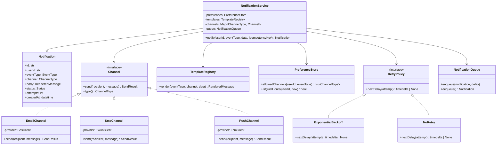
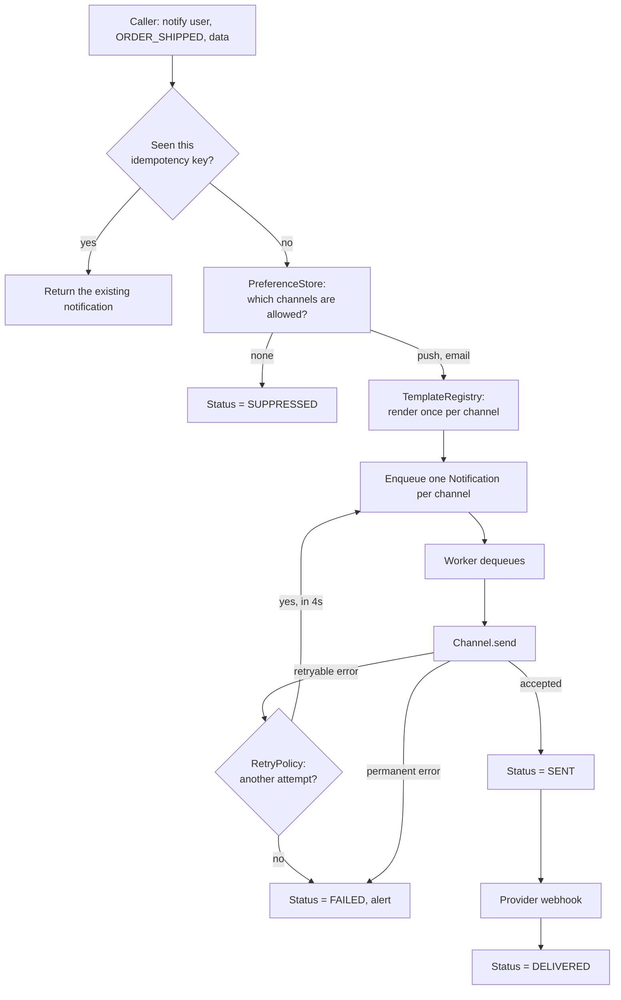

# Day 092 · System Design — Design a notification service

**After today you can:** You can model channels, templates, user preferences and retries.

**The interviewer asks it as:** *Design a notification service that supports email, SMS and push.*

---

## 1. What this is, and why they ask it

A **notification service** is the one piece of code in a company that every other team calls. Orders
calls it when a parcel ships. Payments calls it when a card fails. Growth calls it when it wants to
win somebody back. It takes "tell this user this thing" and turns it into an email, a text message, or
a banner on their phone.

The three sentences that matter: it decides **which channels** a message goes out on, it renders **the
same event into different wordings** for each channel, and it deals with the fact that **sending can
fail** and the message still has to arrive.

They ask it because it is the low-level design prompt where almost every candidate gets the easy part
right and the hard part wrong. The easy part is an interface with three implementations — email, SMS,
push. Everybody writes that. The hard part is the four things underneath it: **user preferences**
(when may you contact this person, and about what), **templates** (one event, several wordings),
**retries** (the network failed; try again, but not forever and not immediately), and
**de-duplication** (the caller retried, and the user must not get the same text twice). A candidate who
only produces the interface has designed a small part of the problem and thinks they have finished.

It is also the prompt where the interviewer's follow-up is guaranteed: *"now add WhatsApp"*. The whole
design is judged on how many files that touches.

---

## 2. The story

The water tanker announcement was Suresh's job that year, because he was the society secretary, and
there were two hundred and four flats.

He got the message from the plumber at half past eight in the evening: no water tomorrow, from six in
the morning until about two in the afternoon. Suresh sat down at the dining table with his phone and
started.

He did not do the same thing for everybody, and that is the part that had taken him three years to work
out.

Most of the flats were in the building group on his phone. One message there covered maybe a hundred
and forty of them. Another forty or so were not in the group — new tenants, mostly — and they got the
message sent to them directly, one at a time. And then there were eleven people he had to actually
ring, because they were old and did not look at their phone, and if he did not call them they would
come down at seven in the morning with a bucket and shout at him.

He had the wording saved. He had typed it out once, months ago, and each time he only changed the two
things that change: the date, and the hours. The rest of it — the apology, the line about the tanker
coming, the line asking everybody to fill their buckets tonight — stayed exactly as it was. He was not
going to write all that again from the beginning every time.

There were rules he had learned the hard way. Mrs D'Souza in 302 had told him plainly never to ring her
after nine at night. The Nairs had asked to be taken off the group altogether and told only about water
and electricity, nothing else. Flat 108 had two brothers in it, and only one of them wanted to hear
from him.

Three of the calls did not connect. He did not give up on them, and he did not sit there pressing the
button over and over either. He tried the first one again after ten minutes, and when it still rang out
he tried once more before going to bed, and then he stopped.

At the end of it he went down his line of two hundred and four flats and could say, for every single
one, whether they had been told, and how.

---

## 3. The idea in plain English

Suresh has built a notification service. Every part of it is in the story.

- The group message, the direct message and the phone call are **channels** — the different ways a
  message can physically reach a person. In software: **email**, **SMS** (a text message to a phone
  number), and **push** (a message that makes a phone buzz, delivered by Apple or Google to the app).
- The saved wording with the date and the hours swapped in is a **template** — a fixed piece of text
  with holes in it, filled in per message.
- "Never ring after nine", "only water and electricity", "only one of the two brothers" are **user
  preferences** — per-person rules about when you may contact them, on which channel, and about what.
- Trying again after ten minutes, then once more, then stopping, is a **retry policy** with a **backoff**
  (each wait longer than the last) and a **maximum attempt count**.
- Going down the line at the end and being able to say who was told is **delivery status tracking**.

### The five decisions the service makes, in order

For every notification request, in this order:

1. **What happened?** An `event` — `ORDER_SHIPPED`, `PAYMENT_FAILED`, `PASSWORD_RESET`. Not a message.
   The caller says what happened, never what to send. That single rule is the most important line in the
   design.
2. **May we contact this user about this?** Look up preferences. If the user has muted this category,
   stop here. This is a **hard stop**, not a warning — in many countries it is the law.
3. **On which channels?** The event has defaults (`PASSWORD_RESET` → email; `ORDER_SHIPPED` → push and
   email), the user's preferences narrow them, and quiet hours may delay some of them.
4. **What exactly do we say?** Render the template for that event *and that channel*. The push version
   is forty characters; the email version has a subject line, a greeting and a footer. Same event,
   different text.
5. **Send it, and remember what happened.** Hand the rendered message to the channel, record the
   attempt, and if it failed with a retryable error, schedule another attempt.

### The one rule that decides whether the design is good

**Callers send events, never messages.**

If the orders team calls `notify(user, "Your parcel has shipped!")`, then every wording change is a
deploy of the orders service, adding a language means touching every caller, and the SMS version and
the email version are two different strings in two different repositories. If they call
`notify(user, ORDER_SHIPPED, {"tracking_id": "AB123"})`, the notification service owns every word, and
nobody else has to know that WhatsApp exists.

### Why "sending" is not one thing

A **request** to notify is not a **delivery**. Between them sit: the preference check, a queue, one or
more provider calls, and possibly several attempts. So a notification has a **status** that moves
through states, and every state is one a support engineer will one day ask you about.

```
 QUEUED -> SENDING -> SENT -> DELIVERED
                  \-> FAILED -> (retry) -> SENDING
                  \-> SUPPRESSED   (preference said no)
```

`SENT` means the provider accepted it. `DELIVERED` means it reached the device, and only some channels
can tell you that. **Do not conflate them** — "we sent it" and "they got it" are different claims, and
the difference is the answer to half the support tickets you will ever see.

---

## 4. The picture

The class diagram. This is the artefact the interviewer is waiting for.



What to notice: **there are two interfaces, not one.** `Channel` is the obvious one. `RetryPolicy` is
the one that separates candidates — a password reset should not be retried for six hours, and a
shipping update should. Putting retry behaviour behind an interface means that difference is
configuration, not an `if` statement buried in the send loop.

The flow of one request:



What to notice: **one request fans out into several notifications, one per channel**, and each of them
retries independently. The email may succeed while the SMS is on its third attempt. The status lives on
the per-channel notification, never on the request.

---

## 5. How it actually works

### Move 1 — clarify

Four questions, with the answers you will assume out loud. Say these before drawing anything.

- *"Are we designing the service that decides and sends, or also the providers themselves?"* — The
  service. Email goes to Amazon SES, SMS to Twilio, push to Firebase Cloud Messaging and Apple Push
  Notification service. **Do not design an SMS gateway.**
- *"Is a notification allowed to be delayed, or must it be immediate?"* — Assume most are allowed a few
  seconds, so I can queue. I will call out the exception: a one-time password must be immediate and
  must not be retried after it expires.
- *"Can the same event be delivered twice?"* — No. Callers will retry on timeout, so I need
  **idempotency**: the caller supplies a key, and a repeat with the same key returns the original
  notification instead of sending again.
- *"Do we need to know it was actually read?"* — Assume delivery, not read. Read receipts are a
  separate feature and only push and in-app can support them honestly.

### Move 2 — the nouns

Pull them straight out of the requirements. One line each on what it is responsible for.

| Class | Responsible for |
|---|---|
| `NotificationService` | The five decisions, in order. Owns nothing else. |
| `Notification` | One message on one channel: its body, status, attempt count. |
| `Channel` (interface) | Handing a rendered message to one provider, and saying what came back. |
| `EmailChannel` / `SmsChannel` / `PushChannel` | The provider-specific call and its error mapping. |
| `TemplateRegistry` | Turning `(event, channel, data)` into a rendered subject and body. |
| `PreferenceStore` | Answering "may we contact this user, on this channel, about this?" |
| `RetryPolicy` (interface) | How long to wait before attempt `n`, and when to give up. |
| `NotificationQueue` | Holding work so the caller is not blocked on a provider. |
| `DeliveryLog` | The record of every attempt: what, when, which provider, what it returned. |

**`User` is not on this list.** The notification service does not own users; it looks up a contact
address and a set of preferences. Saying that out loud shows you know where the boundary is.

### Move 3 — the interesting part

Every LLD prompt has one place where the design is actually decided. Here there are two, and they are
the two interfaces.

**`Channel`, because of the guaranteed follow-up.** "Now add WhatsApp" must be one new class and one
line of registration. Nothing else. If your `NotificationService` contains

```python
        if channel == "EMAIL":
            ses.send(...)
        elif channel == "SMS":
            twilio.send(...)
```

then adding WhatsApp edits a file that is also edited by everyone changing preference logic, and every
change risks every channel. The interface is not decoration; it is the answer to the question they are
definitely going to ask. This is the **open/closed principle** from
[day 056](../day-056-non-comparison-sorts/README.md) doing real work.

**`RetryPolicy`, because not all messages deserve the same effort.**

```
 PASSWORD_RESET   NoRetry after 60s      — the code expires; a late SMS is worse than none
 ORDER_SHIPPED    ExponentialBackoff     — 1s, 2s, 4s, 8s, 16s, then give up
 MARKETING        NoRetry                — if it failed, nobody is harmed
 OTP              1 retry, immediate     — then fail loudly so the user can request another
```

Four different behaviours. As `if` statements inside the worker they are unreadable within a year; as
one object attached to the event type they are a table somebody in support can read.

### Move 4 — the class diagram

Drawn above. When you present it, walk the **request path**, not the class list: "a caller sends an
event; preferences narrow it to channels; templates render one message per channel; each becomes its
own `Notification` on the queue; a worker pulls it, calls the channel, and either marks it sent or asks
the retry policy for another attempt."

### Move 5 — the code that carries the interesting part

The `Channel` interface and one implementation, with the part that people forget: **classifying the
error**.

```python
from abc import ABC, abstractmethod
from dataclasses import dataclass
from enum import Enum


class ChannelType(Enum):
    EMAIL = "email"
    SMS = "sms"
    PUSH = "push"


@dataclass(frozen=True)
class RenderedMessage:
    subject: str | None          # email only; None for SMS and push
    body: str


@dataclass(frozen=True)
class SendResult:
    ok: bool
    provider_id: str | None      # for matching up the delivery webhook later
    retryable: bool              # THE field people forget
    error: str | None
```

`retryable` is the field that matters. A network timeout is retryable. "That phone number does not
exist" is not — retrying it five times wastes money and never succeeds. **Mapping provider errors into
`retryable` is the real work inside a channel**, and it is different for every provider.

```python
class Channel(ABC):
    @abstractmethod
    def send(self, recipient: str, message: RenderedMessage) -> SendResult: ...

    @abstractmethod
    def type(self) -> ChannelType: ...
```

Three methods would be too many. One send, one identity.

```python
class SmsChannel(Channel):
    """Twilio. 160 characters per segment; longer messages cost more."""

    PERMANENT = {21211, 21614, 21610}    # bad number, not mobile, unsubscribed

    def __init__(self, client: "TwilioClient", sender: str) -> None:
        self._client = client
        self._sender = sender

    def type(self) -> ChannelType:
        return ChannelType.SMS

    def send(self, recipient: str, message: RenderedMessage) -> SendResult:
        try:
            resp = self._client.messages.create(
                to=recipient, from_=self._sender, body=message.body[:1600]
            )
            return SendResult(True, resp.sid, retryable=False, error=None)
        except TwilioRestException as exc:
            permanent = exc.code in self.PERMANENT
            return SendResult(False, None, retryable=not permanent, error=str(exc))
        except (TimeoutError, ConnectionError) as exc:
            return SendResult(False, None, retryable=True, error=str(exc))
```

Notice that the subject is ignored — SMS has no subject — and that the truncation is here, in the
channel, rather than in the template. **Channel-specific limits belong to the channel.**

The retry policy, both implementations:

```python
from datetime import timedelta


class RetryPolicy(ABC):
    @abstractmethod
    def next_delay(self, attempt: int) -> timedelta | None:
        """None means stop trying."""


class ExponentialBackoff(RetryPolicy):
    def __init__(self, max_attempts: int = 5, base_seconds: float = 1.0) -> None:
        self._max_attempts = max_attempts
        self._base = base_seconds

    def next_delay(self, attempt: int) -> timedelta | None:
        if attempt >= self._max_attempts:
            return None
        # 1s, 2s, 4s, 8s ... plus jitter so a provider outage does not
        # bring every retry back at exactly the same instant.
        seconds = self._base * (2 ** attempt) * (0.5 + random.random())
        return timedelta(seconds=seconds)


class NoRetry(RetryPolicy):
    def next_delay(self, attempt: int) -> timedelta | None:
        return None
```

The **jitter** — the random factor — is worth a sentence out loud. Without it, a provider that is down
for thirty seconds gets every failed message back at exactly four seconds, then exactly eight, in one
spike. That is a **thundering herd**, and it is how a brief outage becomes a long one.

And the service itself, which should be boring:

```python
class NotificationService:
    def __init__(self, preferences, templates, channels, queue, log, policies):
        self._preferences = preferences
        self._templates = templates
        self._channels = channels        # ChannelType -> Channel
        self._queue = queue
        self._log = log
        self._policies = policies        # EventType -> RetryPolicy

    def notify(self, user_id, event, data, idempotency_key) -> list[Notification]:
        existing = self._log.find_by_key(idempotency_key)
        if existing:
            return existing              # the caller retried; send nothing

        allowed = self._preferences.allowed_channels(user_id, event)
        if not allowed:
            return [self._log.suppressed(user_id, event, idempotency_key)]

        notifications = []
        for channel_type in allowed:
            body = self._templates.render(event, channel_type, data)
            n = self._log.create(user_id, event, channel_type, body, idempotency_key)
            self._queue.enqueue(n, delay=self._delay_for(user_id, channel_type))
            notifications.append(n)
        return notifications
```

**Nine lines of logic and no `if channel ==` anywhere.** That is what "designed well" looks like when
the interviewer says "now add WhatsApp": one new class, one entry in `channels`, one template per event.
Zero changes here.

The worker, which is where the retry lives:

```python
    def process(self, n: Notification) -> None:
        channel = self._channels[n.channel]
        result = channel.send(self._address_for(n.user_id, n.channel), n.body)

        if result.ok:
            self._log.mark_sent(n, result.provider_id)
            return
        if not result.retryable:
            self._log.mark_failed(n, result.error)
            return

        delay = self._policies[n.event].next_delay(n.attempts)
        if delay is None:
            self._log.mark_failed(n, "attempts exhausted")
        else:
            self._log.mark_retrying(n)
            self._queue.enqueue(n, delay=delay)
```

### What real products do this

- **Amazon SES**, **SendGrid**, **Mailgun** for email; **Twilio**, **MessageBird** for SMS; **Firebase
  Cloud Messaging** and **Apple Push Notification service** for push.
- The queue is **Amazon SQS**, **Kafka** or **RabbitMQ**. SQS has a delay parameter per message, which
  is exactly what a backoff needs; Kafka does not, so a Kafka-based design usually needs a separate
  delay topic or a scheduled table.
- **Redis** holds idempotency keys with a time-to-live, because that check is on the hot path of every
  request and does not need to survive forever. See [day 090](../day-090-recursion-on-arrays/README.md)
  for eviction and expiry.
- **Postgres** or **DynamoDB** holds the delivery log, because support will query it by user.
- **Airbnb, Uber, Swiggy and Netflix all run an internal service shaped exactly like this**, usually
  called something like "comms" or "messaging", and the interview question is a direct copy of it.

---

## 6. The numbers

### Volume

A mid-sized consumer app.

```
 users                        10,000,000
 notifications per user/day            5
 -----------------------------------------------
 notifications per day        50,000,000
 seconds per day                  86,400
 average                             578 per second
 peak (evening, 3× average)        1,734 per second
```

But each request fans out across channels:

```
 average channels per event          1.8      (push + email for half of them)
 provider calls per second     578 × 1.8  =  1,040 average
                             1,734 × 1.8  =  3,120 peak
```

**A thousand outbound provider calls a second is the real number**, and it is the reason the queue
exists: a provider that slows from 50 ms to 2 seconds must not make the caller's checkout slow.

### Storage

```
 delivery log row              ~300 bytes  (id, user, event, channel, status, timestamps, provider id)
 rows per day                  50,000,000
 per day                       50M × 300 B  =  15 GB
 per year                      15 GB × 365  =  5.5 TB
```

5.5 TB a year of log rows, growing. So: **keep 90 days hot and archive the rest.**

```
 90 days hot                   15 GB × 90   =  1.35 TB      — indexed, queryable by support
 older, in object storage      5.5 TB/year  ≈  ₹1,100/month at ₹1.7 per GB-month
```

Saying "I would keep 90 days and archive" with those two numbers behind it is worth more than any
amount of talk about scale.

### Money, which is what actually limits SMS

```
 SMS in India, transactional      ₹0.15 each
 5% of 50M notifications are SMS  =  2,500,000 per day
 per day                          2.5M × ₹0.15   =  ₹375,000
 per month                                        ≈ ₹11,250,000
```

Eleven million rupees a month for the SMS channel alone. **This is why preferences and channel choice
are a cost decision, not only a courtesy** — moving 20 percent of those users from SMS to push saves
over two million rupees a month. Push costs nothing per message. Email is about ₹0.008.

A retry costs the same as a send. Retrying a permanently-bad number five times turns ₹0.15 into ₹0.75
for a message that can never arrive, which is why the `retryable` flag pays for itself.

### Objects in memory

```
 in-flight notifications (queue depth, normal)     ~3,000
 each Notification object                          ~500 bytes with the rendered body
 -------------------------------------------------------------------
 working set                                       ~1.5 MB
```

Trivially small — **the state lives in the queue and the log, not in the process.** That is what makes
the workers disposable: kill one mid-batch and the queue redelivers.

### Concurrency

Two things happen at the same time and both need an answer.

1. **The caller retries.** Their HTTP request timed out, so they call `notify` again with the same
   idempotency key. Two workers may now be inside `notify` for that key simultaneously. The fix is a
   **unique constraint on the idempotency key** in the log table — one insert wins, the other gets
   `UniqueViolation` and reads back the winner's row. Not a lock: a constraint. The database is already
   doing the ordering.
2. **The queue delivers the same message twice.** SQS is at-least-once, so this *will* happen. The
   worker must therefore make the send conditional: `UPDATE notifications SET status='SENDING' WHERE
   id=? AND status IN ('QUEUED','RETRYING')` and only proceed if one row was updated. That is a
   **compare-and-set**, the same idea as the atomic operations from
   [day 008](../day-008-reading-a-problem/README.md), and it is the difference between "the user got one
   email" and "the user got four".

**Say "at-least-once delivery, so the worker must be idempotent" out loud.** It is the single sentence
that most reliably marks a candidate as having run one of these in production.

---

## 7. The trade-offs

### Queue everything, or send synchronously?

**Queueing** is the default here, and it costs you the truth: `notify()` returns before anything has
been sent, so the caller cannot tell the user "sent". It also adds a few hundred milliseconds.

**I would not queue if the notification is a one-time password.** The user is staring at the screen.
Every second of queue delay is a second of a sixty-second code gone, and a retry that lands after the
code expires is worse than no message at all — the user has already asked for a second code, and now
two arrive and they cannot tell which is live. For OTP: send inline, one retry at most, fail loudly.

### One service for everyone, or a library per team?

A shared service means one place to change wording, one place to enforce preferences, and one place
that is down when it is down. **A library in each caller has no single point of failure and no single
point of control**, which sounds attractive until the legal team asks you to prove that nobody emails
users who have unsubscribed. You cannot prove that about eleven repositories.

**Take the shared service.** But say the failure mode out loud: if it is down, no product sends
anything, so it needs to be more available than any single caller, which usually means the intake
endpoint does nothing but write to a queue and return.

### Store the rendered body, or re-render at send time?

Storing it costs about 300 extra bytes per row and means the log shows exactly what the user received —
which is what support needs. Re-rendering saves the space but means a template change silently rewrites
history, and you can no longer answer "what did we actually send her on the 14th?"

**Store it.** 15 GB a day is cheap; not being able to answer that question is not.

### Fan out at request time, or at send time?

The design above creates one `Notification` per channel immediately. The alternative is one row that
the worker expands. **Fanning out early means each channel retries independently** — the email is not
held up because Twilio is slow — at the cost of more rows. Fanning out late is fewer rows and one
status, which is a lie whenever the two channels disagree.

**Fan out early.** The whole reason for per-channel status is that channels fail independently.

### Where this design breaks

- **Digests.** "Send one email at 6 p.m. with everything that happened today" is not a notification; it
  is an aggregation. It needs a scheduled job and a store of pending items, and bolting it onto this
  design as "delay the send" does not work, because you must *merge* items rather than delay each one.
- **Broadcast.** "Tell all ten million users the app is updated" is a different problem. This design
  would enqueue ten million rows in a burst and starve every transactional message behind them. The fix
  is **a separate low-priority queue** and rate-limited fan-out — say that, because the interviewer will
  ask.
- **Ordering.** If two events for the same user must arrive in order, this design does not guarantee it:
  independent retries reorder them. You would need a per-user ordering key, which serialises that user's
  notifications and costs throughput.

---

## 8. In the interview

### How it gets asked

- The straight version: *"Design a notification service that supports email, SMS and push."*
- The follow-up that is always coming: *"Now we want to add WhatsApp. What changes?"*
- The reliability probe: *"The SMS provider is down for two minutes. What happens to the messages?"*
- The duplicate probe: *"The user got the same email three times. How did that happen and how do you
  stop it?"*
- The preference probe: *"How do you make sure we never message someone who has unsubscribed?"*

### What to say out loud, in the first ninety seconds

1. **State the boundary.** "I am designing the service that decides and dispatches. The actual sending
   goes to SES, Twilio and Firebase — I am not designing an SMS gateway."
2. **State the one rule.** "Callers send **events**, not messages. `notify(user, ORDER_SHIPPED, data)`,
   never `notify(user, "your parcel shipped")`. That way this service owns every word, and adding a
   channel or a language touches nothing outside it."
3. **Name the five decisions in order.** "For each request: check idempotency, check preferences,
   choose channels, render per channel, enqueue one notification per channel."
4. **Name the two interfaces and why there are two.** "`Channel`, so a new provider is one class. And
   `RetryPolicy`, because a password reset must not be retried for six hours while a shipping update
   should be. Different messages deserve different effort, and that difference should be a policy
   object, not an `if`."
5. **Say the delivery guarantee.** "The queue is at-least-once, so a worker will occasionally see the
   same message twice. I make the send conditional on a compare-and-set of the status, and I take an
   idempotency key from the caller with a unique constraint on it."
6. **Separate sent from delivered.** "`SENT` means the provider accepted it. `DELIVERED` means it
   reached the device, which arrives later by webhook and which only some channels can tell us."

### The follow-ups

**"Now add WhatsApp. What changes?"**
"One new class implementing `Channel` — the provider call and the mapping of its error codes into
retryable or permanent. One line registering it in the channel map. One WhatsApp template per event
type, and WhatsApp specifically needs pre-approved templates, so that is a real constraint rather than
just text. And one new value in the preference table so users can opt in. **Nothing in
`NotificationService` changes**, and that is the point of putting the interface there. If I had written
`if channel == 'SMS'` in the dispatcher, adding WhatsApp would mean editing the file that every other
change also edits."

**"The SMS provider is down for two minutes. What happens?"**
"Every send returns a connection error, which the channel classifies as retryable, so each notification
goes back on the queue with an exponential backoff — one second, two, four, eight, sixteen — with
**jitter**, which matters here: without a random factor, all of them come back at exactly four seconds
and hit the recovering provider in one spike, and a two-minute outage becomes a ten-minute one. With
five attempts over about thirty seconds of backoff, most messages survive a two-minute outage only if
the maximum delay is large enough, so for a real outage I would also want a **circuit breaker**: after
`n` consecutive failures, stop calling the provider for thirty seconds and let everything queue, rather
than burning attempts against a dead endpoint. When it recovers, the queue drains. The user sees a
delayed message, not a lost one."

**"The user got the same email three times. What happened?"**
"Three candidates, and I would check them in this order. One: the caller retried on a timeout without
an idempotency key, so we genuinely created three notifications. Two: the queue redelivered — SQS is
at-least-once, so if the worker crashes after calling the provider but before marking the row `SENT`,
the message comes back and gets sent again. Three: our retry logic treated a *successful* send as
failed, because the provider returned a timeout after accepting the message. The fixes are, in order: a
required idempotency key with a unique constraint; a compare-and-set on the status before sending; and
treating an ambiguous provider timeout as *possibly sent* rather than automatically retrying it. The
honest answer is that you cannot get exactly-once delivery to a third party — you can only make the
window small and make the provider's own de-duplication do the rest."

**"How do you guarantee we never message someone who has unsubscribed?"**
"The preference check happens in `notify`, before anything is enqueued, and a suppression is recorded
as a `SUPPRESSED` notification rather than silently dropped — so the log can prove we chose not to
send. Two subtleties. First, unsubscribe is per **category**, not global: nobody can unsubscribe from a
password reset, and the design must distinguish transactional from marketing events. Second, there is a
race — a user unsubscribes while a message is already on the queue — so I would re-check preferences in
the worker for marketing events, just before sending. That is one extra lookup on the sends where being
wrong is expensive, and it is skipped for transactional ones."

**"How would you support digests — one email a day instead of twenty?"**
"That is a different problem and I would not force it into this design. A digest is an aggregation: you
write pending items to a per-user store, and a scheduled job at 6 p.m. reads them, renders one message
and clears the store. What does not work is 'just delay the send', because delaying twenty notifications
gives you twenty delayed notifications, not one. I would keep this service for immediate sends and put
the digest builder in front of it as a caller."

**"What breaks first at ten times the volume?"**
"Not the service — the workers are stateless and scale horizontally. It is the providers and the money.
At 500 million notifications a day, the SMS bill is over a hundred million rupees a month, and both
Twilio and SES have per-account send rates you have to negotiate. The engineering answer is to shift
volume from SMS to push, batch email where the provider supports it, and keep the delivery log in a
store that partitions by user. The design that fails is anything holding a global counter or a single
queue for all priorities."

### A model answer

Asked: *design a notification service that supports email, SMS and push.*

> "First, the boundary: I am designing the service that decides *what to send and where*, and hands the
> actual sending to SES for email, Twilio for SMS and Firebase for push. I am not designing a mail
> server.
>
> The most important rule in the whole design is at the front door: **callers send events, not
> messages**. The orders team calls `notify(user, ORDER_SHIPPED, {tracking_id})`. They never pass in
> text. That means this service owns every word the company sends, so a wording change is one deploy
> here rather than eleven, and adding a channel or a language is invisible to callers.
>
> Then five decisions per request, in order. Check the **idempotency key** the caller sent — if we have
> seen it, return the original and send nothing, because callers retry on timeout. Ask the
> **preference store** which channels are allowed for this user and this event category; if none, record
> it as suppressed, which is different from dropping it, because legal will one day ask us to prove
> it. Render the **template** once per channel — the push version is forty characters, the email version
> has a subject and a footer, same event, different text. Create one `Notification` per channel and put
> each on a **queue**. A worker picks them up.
>
> Two interfaces. `Channel` — send, and report what came back — so that when you say 'now add WhatsApp',
> my answer is one class and one line of registration and nothing in the dispatcher changes. And
> `RetryPolicy`, which is the one people miss: a shipping update should retry with exponential backoff
> for half a minute, and a password reset should not be retried at all after the code expires, because a
> late one-time password is worse than none. Those are different behaviours attached to different event
> types, so they belong in a policy object rather than an `if` inside the send loop.
>
> The thing I would call out on reliability is that **the queue is at-least-once**. A worker will
> sometimes see the same notification twice — it crashed after calling Twilio but before writing
> `SENT`. So the send is conditional: a compare-and-set that moves the row from `QUEUED` to `SENDING`,
> and only the process that wins that update actually sends. Combined with the caller's idempotency key
> under a unique constraint, that covers both duplicate sources. I would not claim exactly-once to a
> third party; you can only narrow the window.
>
> On numbers: ten million users at five notifications a day is fifty million a day, about 580 a second
> average and 1,700 at peak, and with an average of 1.8 channels each that is roughly three thousand
> outbound provider calls a second at peak. The delivery log at 300 bytes a row is 15 GB a day and 5.5
> TB a year, so I would keep ninety days hot and archive the rest. And the number that actually drives
> product decisions: if five percent of those go by SMS at fifteen paise each, that is 2.5 million
> messages a day and about eleven million rupees a month, which is why moving users from SMS to push is
> a finance conversation and not only a UX one.
>
> The place this design breaks is broadcast. Ten million 'the app has been updated' messages would fill
> the same queue that carries password resets and starve them. That needs a separate low-priority queue
> with rate-limited fan-out, and I would build that as its own path rather than tuning this one."

---

## 9. Recall card

- **Callers send events, never messages.** `notify(user, ORDER_SHIPPED, data)`. That one rule means the
  service owns every word, and a new channel or language touches no caller. Then five decisions in
  order: **idempotency → preferences → channels → render per channel → enqueue one notification per
  channel.**
- **Two interfaces, not one.** `Channel` answers the guaranteed follow-up "now add WhatsApp" — one
  class, one registration line, zero changes to the dispatcher. `RetryPolicy` is the one candidates
  miss: **a shipping update retries with backoff; a password reset must not be retried after the code
  expires**, because a late OTP is worse than none.
- **`SENT` ≠ `DELIVERED`.** Sent means the provider accepted it; delivered arrives later by webhook and
  only some channels report it. And the queue is **at-least-once**, so the worker must be idempotent: a
  **compare-and-set** on the status before sending, plus a **unique constraint** on the caller's
  idempotency key.
- **Classify every provider error as retryable or permanent.** A timeout is retryable; "no such number"
  is not, and retrying it five times costs five times the money for a message that can never arrive. Add
  **jitter** to the backoff, or a brief outage returns as one synchronised spike — a thundering herd.
- **The numbers:** 10M users × 5/day = **50M notifications/day** = 578/s average, ~1,700/s peak, ×1.8
  channels ≈ **3,000 provider calls/s**. Log at 300 B/row = **15 GB/day, 5.5 TB/year** → keep 90 days
  hot. And **SMS at ₹0.15 × 2.5M/day ≈ ₹11M/month**, which is why channel choice is a cost decision.
  **Broadcast needs its own low-priority queue**, or it starves password resets.
