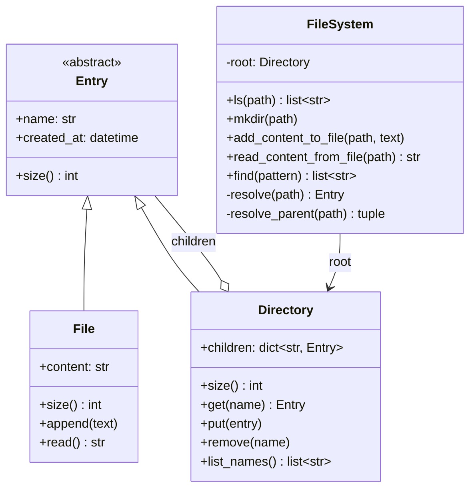

# Day 093 · System Design — Design a file system

**After today you can:** You can model files, directories and paths, and support search.

**The interviewer asks it as:** *Design an in-memory file system.*

---

## 1. What this is, and why they ask it

A **file system** is the thing that turns a name like `/home/anu/notes.txt` into the actual bytes. It
stores two kinds of thing — **files**, which hold content, and **directories**, which hold other things
— and it lets you look them up by a path.

The three sentences that matter: a directory contains files *and other directories*, so the structure
is recursive; a **path** is the sequence of names you walk from the root to get to something; and every
operation is a walk down that sequence followed by one small action.

They ask it because it is the shortest route to finding out whether a candidate can model a recursive
structure without special-casing it. The weak design has a `Directory` class and a `File` class with
nothing in common, and then every operation contains `if isinstance(x, Directory)`. The strong design
has **one type for "thing that lives in a directory"**, with files and directories both being that
thing — and then `ls`, `du`, `find` and `delete` are each about six lines, because the recursion falls
out of the structure instead of being written by hand.

It is also a real interview question in its own right — LeetCode 588 is exactly this — and it is the
foundation of the harder ones: design Dropbox, design S3, design a search over a hierarchy.

---

## 2. The story

The loft above Lakshmi's kitchen had not been opened properly since her father-in-law died, and she
had told herself for two years that she would do it before Deepavali.

She went up on a Sunday morning with a torch. What she found was boxes. Big cardboard cartons, and
inside those, smaller boxes, and inside some of those, tins.

There was no way to describe where anything was except by naming the whole chain. The good steel plates
were not "in the loft". They were in the big carton on the left, inside the blue trunk, inside the tin
with the flower on the lid. If you left out any part of that, nobody could find them.

She noticed something that afternoon that she had not expected. Two of the tins had exactly the same
word written on them — *candles* — and both of them had candles in them. That was not a mistake. One
was inside the box of lamps and one was inside the box of festival decorations, and because they were
in different boxes, nobody had ever been confused. It was only a problem if two tins with the same name
were sitting inside the *same* box, and that had never happened, because whoever put the second one in
would have noticed.

Her son came up in the afternoon and asked how much was up there. She said, I do not know, and there is
only one way to find out. You cannot look at a big carton and know what it weighs. You have to open it,
and for every box inside it you have to open that one too, and keep going until you reach something
that is not a box — a plate, a lamp, a bundle of cloth — and that is the only kind of thing that
actually weighs anything on its own. A box weighs whatever is inside it.

He said that sounded like it would take all day. She said it took all day.

By evening they had a full account. Every box, what was in it, and the weight of everything. And the
useful thing, she said, was that from now on you could ask about any single box on its own and the
answer worked exactly the same way, whether it was the biggest carton or a tin inside a tin.

---

## 3. The idea in plain English

Lakshmi's loft is a file system, and every term in the subject is in that story.

- A **file** is a thing that is not a box: a plate, a lamp. It holds content and nothing else.
- A **directory** (also called a folder) is a box: it holds other things, which may themselves be
  boxes.
- The **root** is the loft itself, written `/`. Everything is inside it.
- A **path** is the chain of names from the root inward: `/loft/carton/trunk/tin`. Written with `/`
  between the names, and starting with `/` when it starts at the root — an **absolute path**.
- Two tins named *thread* in different boxes is fine; two in the same box is not. That is the only
  uniqueness rule a file system has: **names are unique within a directory, not globally.**
- "A box weighs whatever is inside it" is the recursive definition of directory size, and it is the
  reason `du` — the command that reports disk usage — is a six-line function.

### The one design decision

**A file and a directory are both "an entry in a directory".** Give them a common parent type with a
name and a size, and then a directory's children can be a list of that type without caring which kind
each one is.

```python
class Entry:              # the common type
    name: str
    def size(self) -> int: ...

class File(Entry):        # holds content
    content: str

class Directory(Entry):   # holds other Entries — including other Directories
    children: dict[str, Entry]
```

This arrangement — **a container and a leaf sharing one interface, so a client can treat a single item
and a group of items the same way** — is called the **composite** structure. You have met the idea
without the name: a directory is a composite, a file is a leaf, and code that walks them never asks
which is which.

The payoff is immediate:

```python
    class File(Entry):
        def size(self): return len(self.content)

    class Directory(Entry):
        def size(self): return sum(child.size() for child in self.children.values())
```

**Four lines, and `du` works to any depth.** Compare with the design where `Directory` and `File` have
no common type: every caller writes `if isinstance(...)`, and adding a third kind of entry — a symbolic
link, say — means editing every one of those callers.

### Every operation is "resolve, then act"

This is the sentence to say in the interview, because it makes the whole design sound like one idea
instead of six methods.

```
 resolve("/a/b/c")  ->  walk from root: "a", then "b", then "c"
                        return the Entry, or raise
```

Then:

| Operation | Resolve | Act |
|---|---|---|
| `ls(path)` | resolve the path | if it is a file, return `[its name]`; if a directory, return sorted child names |
| `mkdir(path)` | walk the path, **creating** each missing directory | nothing else |
| `add_content(path, text)` | resolve the parent, create the file if absent | append to its content |
| `read(path)` | resolve the path | return the content |
| `du(path)` | resolve the path | `entry.size()` — recursion does the rest |

**`ls` returning the file's own name when the path is a file is the detail everybody forgets**, and it
is the first thing the LeetCode test cases check. It is not arbitrary — it is what the real `ls`
command does.

### Why the children are a dictionary

A directory could hold its children in a list. It should not.

```
 list:   look up one child   ->  scan every child          O(number of children)
 dict:   look up one child   ->  one hash lookup           O(1)
```

Resolving `/a/b/c/d/e` does five lookups. With a list and a directory holding 100,000 files — which is
common, and is what a photo folder looks like — every one of those five is 100,000 comparisons.

The cost is that `ls` must sort, because a dictionary is not ordered by name. Sorting `k` children is
`O(k log k)`, and `ls` is a rare operation while lookup is on every single call. **Optimise the common
path; pay on the rare one.** That trade is the answer to "why a dict and not a list?", and the
interviewer is asking it to see whether you can name which operation is hot.

---

## 4. The picture

The class diagram.



What to notice: **`Directory` holds `Entry`, and `Directory` is itself an `Entry`.** That one arrow
pointing back at the parent type is the whole design. It is what makes boxes able to contain boxes, and
it is what lets `size()` recurse without a single type check.

The tree that comes out of it:

```
                         / (root, Directory)
                    /            |            \
              home/          var/           tmp/
             (Dir)           (Dir)          (Dir)
            /     \             |
       anu/      ravi/       log/
      (Dir)      (Dir)       (Dir)
      /   \                     |
 notes.txt  photos/        app.log
  (File)     (Dir)          (File)
   12 B        |             4096 B
          IMG_001.jpg
            (File)
           2,400,000 B

 size(/home/anu)  =  12 + size(photos/)  =  12 + 2,400,000  =  2,400,012 B
 size(/)          =  the whole thing, by the same rule at every level
```

What to notice: **only the leaves have a size of their own.** Every directory's size is the sum of its
children's, computed the same way at every level — which is why the code has one method and no depth
argument.

And path resolution, step by step:

```
 resolve("/home/anu/notes.txt")

   parts = ["home", "anu", "notes.txt"]        <- "/".split gives an empty first element; drop it

   current = root
   current = current.children["home"]          exists, is a Directory  ->  keep going
   current = current.children["anu"]           exists, is a Directory  ->  keep going
   current = current.children["notes.txt"]     exists, is a File       ->  last part, so return it

 three lookups, one per name. Depth is the cost, not the total number of files.
```

---

## 5. How it actually works

### Move 1 — clarify

Four questions, with the answers you will assume. Say them before you draw.

- *"In-memory, or backed by a disk?"* — In-memory. That removes blocks, inodes and the journal, and
  keeps the question about modelling. I will say what changes for a real disk at the end.
- *"Absolute paths only, or relative ones with `.` and `..` too?"* — Absolute only to start. Relative
  paths need a working directory and a normalisation step, and I will add that if you want it.
- *"Does `mkdir` create intermediate directories?"* — Yes, like `mkdir -p`. `mkdir("/a/b/c")` creates
  all three.
- *"Single-threaded, or do I need concurrent access?"* — Assume single-threaded for the model, then I
  will say where the locks go, because that is where this design actually gets hard.

One more, which candidates rarely ask and which changes the answer a lot: *"Do I need to support search
by name across the whole tree?"* If yes, a plain tree walk is `O(number of files)` per search and you
will want a separate structure. Flag it now rather than being ambushed by it.

### Move 2 — the nouns

| Class | Responsible for |
|---|---|
| `Entry` | The common type: it has a name and it has a size. Nothing else. |
| `File` | Holding content, and reporting its own length. |
| `Directory` | Holding named children, and reporting the sum of theirs. |
| `FileSystem` | Turning a path string into an `Entry`, and the public operations. |
| `Path` | Splitting, validating and joining path strings. Small, but keep it separate. |

**`FileSystem` owns the root and nothing else.** Every method on it is "resolve, then act", and if a
method is longer than eight lines, some of it belongs on `Directory`.

### Move 3 — the interesting part

Two places, and both come up.

**The composite, because it decides how much code every operation takes.** With one shared `Entry` type,
`size` is four lines, `find` is six, and deleting a subtree is one dictionary removal — Python frees the
whole subtree because nothing references it any more. Without it, every operation has a type check and
adding a symbolic link means editing all of them.

**Resolution, because that is where every error comes from.** Every failure a user ever sees is a
resolve failure, and they are not the same failure:

```
 /a/b/c   where /a/b does not exist        ->  FileNotFoundError: no such directory: /a/b
 /a/b/c   where /a/b is a FILE             ->  NotADirectoryError: /a/b is a file
 /a/b/c   where c does not exist, on read  ->  FileNotFoundError: no such file: /a/b/c
 /a/b/c   where c does not exist, on mkdir ->  not an error at all — create it
```

**Four different outcomes from the same walk**, and which one you get depends on the operation. That is
why `resolve` takes a flag, or why there are two of them: one that creates missing directories and one
that raises.

### Move 4 — the class diagram

Drawn above. Present it by walking one path — "`add_content_to_file('/a/b/note.txt', 'hi')` splits into
three parts, resolves `/a/b` as a directory, looks for `note.txt` in its children, creates a `File` if
it is not there, and appends" — rather than by reading out the class list.

### Move 5 — the code

The entries. This is the part worth writing out properly.

```python
from __future__ import annotations

from abc import ABC, abstractmethod
from datetime import datetime, timezone


class Entry(ABC):
    """A file or a directory. The common type is the whole design."""

    def __init__(self, name: str) -> None:
        self.name = name
        self.created_at = datetime.now(timezone.utc)

    @abstractmethod
    def size(self) -> int:
        """Bytes. A file knows its own; a directory sums its children's."""
```

```python
class File(Entry):
    def __init__(self, name: str) -> None:
        super().__init__(name)
        self._chunks: list[str] = []        # not one big string — see the trade-offs
        self._length = 0

    def size(self) -> int:
        return self._length

    def append(self, text: str) -> None:
        self._chunks.append(text)
        self._length += len(text)

    def read(self) -> str:
        if len(self._chunks) > 1:           # collapse lazily, on first read
            self._chunks = ["".join(self._chunks)]
        return self._chunks[0] if self._chunks else ""
```

The chunk list is the one non-obvious choice, and it is worth defending out loud: appending to a Python
string builds a whole new string each time, so ten thousand appends of 100 bytes copies about five
gigabytes in total. A list of chunks makes each append `O(len(text))` and pays the join once, on read.

```python
class Directory(Entry):
    def __init__(self, name: str) -> None:
        super().__init__(name)
        self.children: dict[str, Entry] = {}    # dict, not list: O(1) lookup

    def size(self) -> int:
        return sum(child.size() for child in self.children.values())

    def list_names(self) -> list[str]:
        return sorted(self.children)            # ls is sorted; lookup is not

    def get(self, name: str) -> Entry | None:
        return self.children.get(name)

    def put(self, entry: Entry) -> None:
        self.children[entry.name] = entry
```

`size()` is the four lines the composite bought you. No `isinstance`, no depth parameter, no explicit
recursion beyond the natural one.

The file system itself. Resolution first, because everything else is one line on top of it.

```python
class FileSystem:
    def __init__(self) -> None:
        self.root = Directory("")

    @staticmethod
    def _split(path: str) -> list[str]:
        if not path.startswith("/"):
            raise ValueError(f"path must be absolute: {path!r}")
        return [part for part in path.split("/") if part]    # "/" -> []

    def _resolve(self, path: str) -> Entry:
        """Walk to the entry, raising if any step is missing or is a file."""
        current: Entry = self.root
        for part in self._split(path):
            if not isinstance(current, Directory):
                raise NotADirectoryError(f"{part}: parent is a file")
            nxt = current.get(part)
            if nxt is None:
                raise FileNotFoundError(f"no such file or directory: {path}")
            current = nxt
        return current

    def _resolve_dir_creating(self, parts: list[str]) -> Directory:
        """Walk, creating missing directories. This is `mkdir -p`."""
        current = self.root
        for part in parts:
            nxt = current.get(part)
            if nxt is None:
                nxt = Directory(part)
                current.put(nxt)
            elif not isinstance(nxt, Directory):
                raise NotADirectoryError(f"{part} exists and is a file")
            current = nxt
        return current
```

Two resolvers, because the two behaviours are genuinely different and a boolean flag would make both
harder to read.

```python
    def ls(self, path: str) -> list[str]:
        entry = self._resolve(path)
        if isinstance(entry, File):
            return [entry.name]             # the detail everyone forgets
        return entry.list_names()

    def mkdir(self, path: str) -> None:
        self._resolve_dir_creating(self._split(path))

    def add_content_to_file(self, path: str, content: str) -> None:
        parts = self._split(path)
        parent = self._resolve_dir_creating(parts[:-1])
        existing = parent.get(parts[-1])
        if existing is None:
            existing = File(parts[-1])
            parent.put(existing)
        elif not isinstance(existing, File):
            raise IsADirectoryError(f"{path} is a directory")
        existing.append(content)

    def read_content_from_file(self, path: str) -> str:
        entry = self._resolve(path)
        if not isinstance(entry, File):
            raise IsADirectoryError(f"{path} is a directory")
        return entry.read()

    def du(self, path: str) -> int:
        return self._resolve(path).size()   # one line, any depth
```

And search, which is the follow-up:

```python
    def find(self, path: str, pattern: str) -> list[str]:
        """Every path under `path` whose name matches. O(entries in the subtree)."""
        import fnmatch

        found: list[str] = []

        def walk(entry: Entry, so_far: str) -> None:
            if fnmatch.fnmatch(entry.name, pattern):
                found.append(so_far)
            if isinstance(entry, Directory):
                for name in sorted(entry.children):
                    walk(entry.children[name], f"{so_far}/{name}".replace("//", "/"))

        walk(self._resolve(path), path)
        return found
```

**`find` is a full walk of the subtree, and you should say so.** There is no shortcut in a plain tree.
If search has to be fast, you need a second structure — a map from name to the set of paths holding it,
maintained on every create and delete. That is a real trade: it makes writes slower and doubles the
memory to make reads instant.

### What real systems do this way

- **ext4** on Linux stores directories as **htrees** — hashed B-trees — precisely because a linear
  directory scan collapses at a hundred thousand files. **NTFS** uses B-trees for the same reason. Your
  `dict` is the in-memory version of that decision.
- Real file systems separate the **inode** (the metadata and the pointers to the data blocks) from the
  **directory entry** (the name). That separation is what makes **hard links** possible: two names in
  two directories pointing at one inode. In this design, two `Directory` entries could reference the
  same `File` object and it would work — the model already supports it, which is a nice thing to notice
  out loud.
- **Amazon S3 is the interesting contrast: it has no directories at all.** The key `photos/2024/a.jpg`
  is one flat string, and the "folders" you see in the console are the console faking it by splitting on
  `/`. That is why renaming an S3 "folder" with a million objects costs a million copy-and-delete
  operations, while renaming a directory here is one dictionary key change. **This is the single best
  example of how the data structure decides what is cheap.**
- **HDFS** keeps the whole namespace — every path, in a structure like the one above — in the memory of
  a single NameNode. That is why HDFS is famously bad at small files: the limit is not disk, it is the
  NameNode's RAM, at roughly 150 bytes of metadata per file.

---

## 6. The numbers

### Memory

```
 Entry base (name, timestamp, object overhead)      ~120 bytes
 File adds the chunk list and length                ~ 80 bytes  ->  ~200 B per file
 Directory adds an empty dict                       ~120 bytes  ->  ~240 B + 100 B per child
```

For a million files spread over fifty thousand directories:

```
 files        1,000,000 × 200 B          =  200 MB
 directories     50,000 × 240 B          =   12 MB
 child slots  1,050,000 × 100 B          =  105 MB
 ---------------------------------------------------
 metadata alone                          ≈  317 MB
```

**Three hundred megabytes of metadata for a million empty files**, before a single byte of content. That
number is exactly why HDFS's NameNode is the bottleneck of a Hadoop cluster, and quoting it is far
better than saying "it uses a lot of memory".

### Lookup cost

```
 path "/a/b/c/d/e"          5 parts   ->  5 dict lookups   ->  ~5 × 50 ns  =  250 ns
 same path, children in a list, 100,000 files per directory:
                            5 × 100,000 comparisons        =  500,000 ops  ≈  5 ms
```

**Two hundred and fifty nanoseconds versus five milliseconds — a factor of twenty thousand** — and it is
one word in the design, `dict` instead of `list`. That is the number to have ready when they ask why a
dictionary.

### `ls` and `du`

```
 ls on a directory of k children     sort k names          O(k log k)
   k = 100,000                        ~1.7 million comparisons   ≈ 20 ms
 du on a subtree of m entries        visit every one       O(m)
   m = 1,000,000                                                 ≈ 300 ms
```

`du` on a big subtree is slow and there is no way around it in this design. If it is called often, cache
the size on each directory and invalidate up the chain of parents on every write — which means every
`Entry` needs a `parent` reference, and every append walks up to the root. **That trade turns a 300 ms
read into an O(depth) write cost of about ten pointer hops.** Worth it if reads outnumber writes, which
for `du` they usually do not.

### Search

```
 find("/", "*.jpg") over 1,000,000 entries      one full walk       ≈ 400 ms
 with a name -> paths map maintained on write   one dict lookup     ≈ 1 µs
 cost of the map: ~1,000,000 extra entries      ≈ 150 MB, plus a write on every create/delete
```

**A factor of four hundred thousand on reads, paid for with 150 MB and slower writes.** State it as that
trade, not as "we could add an index".

### Concurrency

Two things happen at once and both have a right answer.

1. **Two threads call `mkdir("/a/b")` at the same time.** Both see `b` missing, both create a
   `Directory`, and one overwrites the other — silently discarding whatever the loser had already put
   inside it. The fix is not a global lock; it is **creating under the parent's lock**, or using
   `dict.setdefault`, which is atomic in CPython and returns the winner's object.
2. **One thread reads a file while another appends.** With the chunk list, a reader that collapses the
   chunks while a writer appends can lose data. **A per-file lock around append and read** is enough,
   and per-file rather than global is the point — a million files are a million independent locks and
   there is no contention between them.

The rule to say out loud: **lock the smallest thing that makes the operation correct.** A single global
lock on the file system makes every operation correct and makes the whole thing single-threaded, which
at a thousand operations a second is fine and at a hundred thousand is not.

---

## 7. The trade-offs

### `dict` of children, or a sorted list?

`dict` gives `O(1)` lookup and unordered `ls`, so `ls` pays `O(k log k)` to sort. A sorted list gives
`O(log k)` lookup by binary search, free ordering, and `O(k)` insertion because everything after the
insertion point shifts.

**Take the dict.** Lookup happens on every path component of every operation; `ls` is rare. **I would
not use a dict if the dominant operation were listing directories in order** — a file browser
back-end, say — where a sorted structure or a tree map would pay for itself.

### One string per file, or a list of chunks?

One string is simpler and reads are free. But `content += text` builds a new string each time:

```
 10,000 appends of 100 bytes to one string:
   total copying  =  100 + 200 + ... + 1,000,000  ≈  5 GB copied
 with a chunk list:
   total copying  =  1 MB, plus one join on the first read
```

**Take the chunks.** The exception is a file that is written once and read a thousand times, where the
join cost is noise and the simplicity wins.

### Store the size, or compute it?

Computing means `du` is `O(subtree)` and writes are free. Storing means `du` is `O(1)` and every write
walks up to the root updating parents, which also forces a `parent` reference on every entry and makes
moving a subtree an update of two chains.

**Compute it, unless `du` is a listed requirement.** Say the alternative and its cost; that is the
answer, not choosing.

### One tree, or a tree plus a search structure?

Covered in the numbers. The honest framing: **a tree is optimised for "where is this exact path", and
search is the query it is worst at.** Everything that makes search fast is a second structure that
duplicates information and has to be kept in step — which is the same trade as an index on a database
table, from [day 025](../day-025-pattern-matching/README.md).

### Where this design breaks

- **Relative paths, `.` and `..`.** These need a per-user working directory and a normalisation pass
  before resolution. `..` is genuinely awkward here because entries do not know their parent — you would
  add a `parent` pointer, and then you must keep it correct on every move.
- **Permissions.** A real file system checks read/write/execute for a user at **every level** of the
  walk, not only at the target. That turns `_resolve` from five lines into fifteen and is the reason
  path resolution is a security-sensitive operation.
- **Persistence.** The moment this has to survive a restart, everything changes: you need blocks, a
  free-space map, and a **journal** so that a crash halfway through a rename does not leave a directory
  pointing at nothing. That is the real subject of file systems and it is not what this question is
  asking.
- **Very wide directories.** A million files in one directory makes `ls` cost 20 million comparisons and
  the child dict alone 100 MB. Real systems answer this with B-trees on disk; in memory you would page
  the listing rather than sort it all.
- **Moving a subtree.** Cheap here — one key removed, one key added — and this is worth saying, because
  it is exactly what S3 cannot do, and the contrast makes the point that the structure decides the cost.

---

## 8. In the interview

### How it gets asked

- The direct version: *"Design an in-memory file system with `ls`, `mkdir`, `addContentToFile` and
  `readContentFromFile`."* LeetCode 588.
- The modelling probe: *"How do you represent a file and a directory?"* — they want to hear one shared
  type.
- The recursion probe: *"Now give me the total size of a directory."*
- The search probe: *"Find all files matching `*.log` under this path."*
- The scale probe: *"A directory has a million files. What breaks?"*
- The contrast: *"How is this different from S3?"*

### What to say out loud, in the first ninety seconds

1. **Say the model in one sentence.** "Two kinds of entry — file and directory — sharing one abstract
   type with a name and a size. A directory holds a map from name to entry, and since a directory *is*
   an entry, directories nest naturally."
2. **Say why the shared type matters.** "That is what makes `du` four lines and `find` six, with no type
   checks. Without it every operation would have an `isinstance` in it and adding symbolic links later
   would mean editing all of them."
3. **Name the one repeated operation.** "Every method is 'resolve the path, then do one small thing'.
   Resolution is a walk down the name list, one dictionary lookup per component."
4. **Say `dict`, and why.** "Children in a dictionary, not a list — lookup is on every component of
   every call. A hundred thousand files in a directory turns a 250-nanosecond resolve into a
   five-millisecond one if it is a list."
5. **State the uniqueness rule.** "Names are unique within a directory, not globally. Two files called
   `notes.txt` in different directories is normal."
6. **Flag the error cases.** "Resolution has four outcomes, not two: missing directory, a file where a
   directory was expected, missing final component — and for `mkdir` that last one is not an error at
   all, it is the work."

### The follow-ups

**"Now give me the total size of a directory."**
"One method on `Entry`. `File.size()` returns its own content length; `Directory.size()` returns the sum
of its children's sizes. Because both are `Entry`, the sum does not care what the children are, and it
recurses to any depth with no explicit depth handling. That is the payoff of the shared type — four
lines instead of a walker with type checks. The cost is `O(entries in the subtree)`, so on a million
entries it is a few hundred milliseconds. If `du` were a hot path I would cache the size on each
directory and invalidate upward on writes, which needs a parent pointer on every entry and turns a slow
read into about ten pointer hops per write."

**"Find all files matching a pattern."**
"In this design it is a full walk of the subtree — there is no shortcut, and I would say that plainly
rather than pretend. If search has to be fast, the answer is a second structure: a map from name, or
from extension, to the set of full paths, updated on every create, delete and move. That takes a
400-millisecond walk down to a microsecond lookup, and it costs about 150 MB per million files plus a
write on every mutation. It is the same trade as adding an index to a database table — faster reads,
slower writes, duplicated state that can drift."

**"A directory has a million files. What breaks?"**
"Three things, in order. `ls` has to sort a million names — around twenty million comparisons, so a few
hundred milliseconds, and it returns a million-element list to a caller who almost certainly wanted the
first page. The child dictionary alone is around 100 MB. And if I had used a list instead of a dict,
every single lookup in that directory would be a million comparisons. The fixes are: paginate `ls` with
a cursor instead of returning everything, keep the dict for lookup, and if ordered listing is genuinely
needed, hold a sorted structure alongside. Real file systems solve this with B-trees on disk — ext4's
htree exists exactly because linear directory scans died at this scale."

**"How is this different from S3?"**
"S3 has no directories. The key `photos/2024/a.jpg` is one flat string in a giant sorted map, and the
folders you see in the console are the console splitting on slashes. The consequence is the interesting
part: renaming a directory here is one dictionary key change, no matter how much is inside it, because
the children hang off the entry. Renaming an S3 'folder' with a million objects is a million copy
operations followed by a million deletes, because there is nothing to rename — the prefix is part of
every key. Same user-visible concept, completely different cost, decided entirely by the data
structure."

**"How would you make this thread-safe?"**
"Not with one global lock, though I would say that is the correct first version and it is fine up to
maybe ten thousand operations a second. The two real races are: two threads creating the same directory,
where both see it missing and one silently overwrites the other along with everything already inside it
— fixed by creating under the parent's lock, or `dict.setdefault`, which is atomic; and a reader
collapsing a file's chunks while a writer appends — fixed by a per-file lock. The rule is to lock the
smallest thing that makes the operation correct, because a million files then means a million
independent locks with no contention between them."

**"What changes if this has to survive a restart?"**
"Almost everything, and it stops being this question. You need blocks and a free-space map instead of
Python objects, and you need a **journal**: write the intent to a log, then perform the change, so a
crash midway leaves something recoverable rather than a directory pointing at nothing. That is what
ext4's journal and NTFS's log are for. I would keep the same logical model — entries, names, a tree —
and change only the storage underneath it, which is a good sign the model was right."

### A model answer

Asked: *design an in-memory file system.*

> "The model first, because everything follows from it. There are two kinds of thing: a **file**, which
> holds content, and a **directory**, which holds other things. The key decision is that they share one
> abstract type — call it `Entry` — with a name and a `size()`. A directory's children are a map from
> name to `Entry`, and since a directory *is* an `Entry`, directories nest without any special handling.
>
> That shared type is not tidiness; it is what makes the operations short. `File.size()` returns its
> content length, `Directory.size()` returns the sum of its children's — four lines, and `du` works to
> any depth with no type checks anywhere. Without the shared type, every operation would carry an
> `isinstance`, and adding symbolic links later would mean editing all of them.
>
> Every public method is then the same two steps: **resolve the path, then do one small thing.**
> Resolution splits the string on slashes and walks down, one lookup per component. `ls` resolves and
> either returns the sorted child names or — if the path is a file — the file's own name, which is the
> detail everybody forgets and the first thing the tests check. `mkdir` walks the same way but creates
> what is missing. `addContentToFile` resolves the parent, creates the file if absent, and appends.
>
> Two implementation choices I would defend. **Children in a dictionary, not a list**, because lookup
> happens on every component of every call: with a hundred thousand files in a directory, a list makes
> resolving a five-part path five hundred thousand comparisons — about five milliseconds instead of two
> hundred and fifty nanoseconds. The price is that `ls` has to sort, which is fine because listing is
> rare. And **file content as a list of chunks rather than one string**, because `content += text` copies
> the whole thing every time — ten thousand appends of a hundred bytes copies about five gigabytes. The
> chunks are joined once, lazily, on the first read.
>
> The uniqueness rule is worth stating: names are unique **within a directory**, not globally. Two files
> called `notes.txt` in different directories is normal and must work.
>
> On scale, a million files is roughly three hundred megabytes of metadata before any content — which is
> exactly why HDFS keeps its whole namespace in one NameNode's RAM and why that machine is the limit of
> the cluster. And search is the weak point: `find` is a full walk of the subtree, and if it needs to be
> fast, that is a second structure mapping names to paths, kept in step on every write — faster reads,
> slower writes, duplicated state.
>
> The contrast I would offer is S3, because it makes the point about structure. S3 has no directories at
> all; the whole path is one flat key. So renaming a directory here is one key change regardless of
> size, and renaming an S3 prefix with a million objects is a million copies and a million deletes.
> Identical concept to the user, completely different cost, decided by the data structure alone."

---

## 9. Recall card

- **One abstract `Entry` with a name and `size()`; `File` and `Directory` both extend it, and a
  `Directory` holds a `dict[str, Entry]`** — so a directory can hold directories. That shared type is
  the design: `du` is four lines and `find` is six, with **no `isinstance` anywhere**.
- **Every operation is "resolve the path, then do one small thing."** Resolution is one dict lookup per
  component. It has **four outcomes, not two**: missing directory, a file where a directory was
  expected, missing final component — and for `mkdir` that last one is the work, not an error. And
  **`ls` on a file returns the file's own name** — the detail everybody forgets.
- **`dict` of children, not a list.** Lookup is on every component of every call: 100,000 files in a
  directory makes a five-part resolve **5 ms instead of 250 ns**. The price is that `ls` sorts, which is
  the rare operation. **Names are unique within a directory, not globally.**
- **File content is a list of chunks, joined lazily** — `content += text` copies the whole string each
  time, about **5 GB of copying for 10,000 appends of 100 bytes**. Lock **per file**, not globally; the
  two real races are two `mkdir`s of the same directory (one silently discards the other's contents) and
  a read collapsing chunks during an append.
- **A million files ≈ 300 MB of metadata before any content** — the reason HDFS's NameNode is the limit
  of a Hadoop cluster. **`find` is a full subtree walk**; making it fast means a second name→paths map,
  ~150 MB per million and a write on every mutation. **S3 has no directories** — the whole path is one
  flat key — so renaming a folder is O(1) here and a million copy-and-deletes there.
