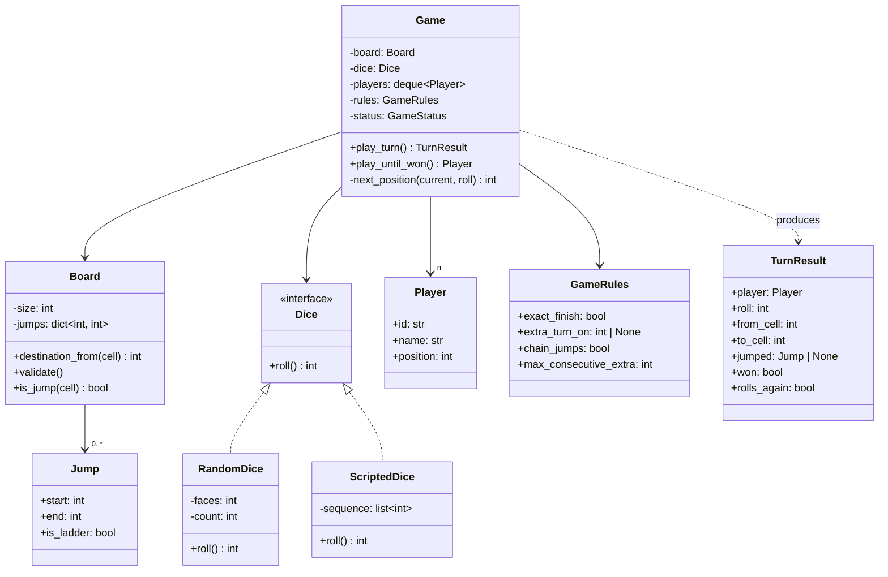
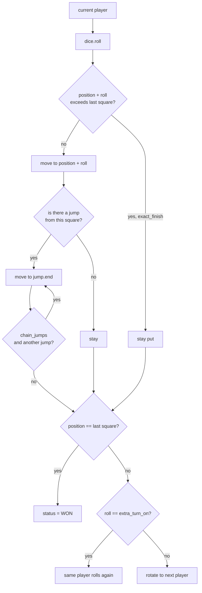

# Day 094 · System Design — Design snake and ladder

**After today you can:** You can model the board, the dice and the players with clean separation.

**The interviewer asks it as:** *Design snake and ladder for n players.*

---

## 1. What this is, and why they ask it

Snake and ladder is a board of numbered squares, some dice, and a rule that certain squares move you
somewhere else the moment you land on them. Players take turns; first to the last square wins.

The three sentences that matter. **A snake and a ladder are the same object** — a jump from one square
to another, one going down and one going up — and a candidate who writes two classes for them has
already lost the point of the exercise. **The dice must be an interface**, not a call to `random`, or
the game cannot be tested. And **the rules that vary between households** — do you need an exact roll to
finish, does a six give you another turn — are configuration, not `if` statements.

They ask it because it is small enough to finish in thirty minutes and rich enough to separate people.
Everybody can produce `Board`, `Player`, `Dice`, `Game`. The interesting questions are: how many classes
do snakes and ladders need between them (one), where does randomness live (behind an interface), what
happens when a jump lands you on another jump (a decision you must make out loud), and what do you
change when the same code has to run a hundred thousand online games at once.

It is the friendliest of the "design a game" prompts, and the same skeleton answers *design tic-tac-toe*,
*design ludo* and *design chess* — which is usually the next question.

---

## 2. The story

The board came out after dinner because it was raining and the power had gone, and the two children had
been fighting since four o'clock.

It was the old cloth one, folded so many times that the creases had gone white. A hundred squares.
Curling green snakes across some of them, and thin brown ladders across others.

Arjun, who was nine, went first. He got a six, moved to the sixth square, and found the bottom of a
ladder there, which took him up to twenty-six in one go. He was extremely pleased.

His sister Ira, who was six and did not fully trust any of this, landed on a snake at forty-seven three
turns later and slid all the way back to nineteen, and there was a period of about ten minutes when the
game was not being played.

Their grandmother had been watching from the chair by the window without saying much.

When it started again she said something that neither of them expected. She said, you know, that snake
and that ladder are the same thing.

Ira said they were absolutely not the same thing.

Her grandmother said: look at what actually happens. You land on a square. The square says go to a
different square. That is all either of them does. One of them sends you forwards and one sends you
backwards, and that is the only difference between them. If you painted the snake as a ladder nothing
about the game would change except how you felt about it.

Then she asked them a question they could not answer. She said, what happens if the top of that ladder
puts you on the head of a snake?

They looked. It did not, on that board. But they could not say what the rule *would* be, and they
argued about it for a while — Arjun said you would go down the snake as well, Ira said that was unfair
and you should stay put — and eventually their mother said that in this house you stay put, and wrote
nothing down, and that was that.

The other two arguments that night were the usual ones. Whether you needed to land on the last square
exactly, or whether going past it counted. And whether a six gave you another turn.

Both were settled the same way: by their mother saying how it was going to be, before anybody rolled.

---

## 3. The idea in plain English

The grandmother has given you the design. Everything else is bookkeeping.

- The board is a set of numbered **cells**, 1 to 100.
- A snake and a ladder are both a **jump**: a pair `(from, to)`. If `to > from` it is a ladder, if
  `to < from` it is a snake. **The type is not stored; it is derived from the numbers.**
- A **player** has a name and a current position, and that is genuinely all.
- The **dice** produces a number between 1 and 6.
- A **turn** is: roll, move, apply any jump, check for a win, decide who goes next.
- "Whether you need to land exactly" and "whether a six gives another turn" are **rules**, decided
  before anybody rolls — configuration, not code.
- "What if a ladder puts you on a snake's head?" is a rule you must **state**, because the code has to
  do something and every household does it differently.

### Why one class and not two

```python
    class Snake:                        class Ladder:
        head: int                           bottom: int
        tail: int                           top: int
```

Two classes with identical shape, identical behaviour, and different words. Every operation then needs
both:

```python
        for snake in board.snakes:
            if snake.head == position: ...
        for ladder in board.ladders:
            if ladder.bottom == position: ...
```

Against:

```python
        position = board.jumps.get(position, position)      # one line, both cases
```

**One dictionary from square to destination, and the whole feature is a `dict.get` with a default.**
That is the answer to "how do you model snakes and ladders", and saying it in that form takes ten
seconds.

If you genuinely need to *display* them differently, that is a presentation concern and one property
answers it:

```python
    @property
    def is_ladder(self) -> bool:
        return self.end > self.start
```

### Why the dice is an interface

This is the single highest-value idea in the whole prompt, and it is not about the dice.

```python
    def roll(self) -> int:
        return random.randint(1, 6)         # the game is now untestable
```

If the game calls `random` directly, you cannot write a test that says "a player at 97 who rolls a 5
does not move". You can only run it a thousand times and hope. Put an interface in front of it:

```python
    class Dice(ABC):
        @abstractmethod
        def roll(self) -> int: ...

    class RandomDice(Dice): ...             # production
    class ScriptedDice(Dice): ...           # tests: returns 6, 6, 2, 1, ...
```

Now every rule in the game can be tested in three lines. **The general principle is that randomness,
time and input/output are the three things you must be able to replace**, and a design that hard-codes
any of them is a design nobody can write a test for. Say that sentence — it applies to every LLD prompt
you will ever get.

It also matters in production for a reason candidates rarely mention: for an online game, the dice
**must** be rolled on the server. If the phone rolls it, the phone can cheat. The interface makes that a
one-line substitution.

### The rules that vary

| Rule | Options | Where it lives |
|---|---|---|
| Finishing | exact roll needed / overshoot wins / bounce back | `GameRules.finish` |
| Rolling a six | another turn / nothing special / three sixes forfeits | `GameRules.extra_turn_on` |
| Starting | any roll / must roll a six to enter | `GameRules.entry` |
| Chained jumps | apply repeatedly / apply once only | `GameRules.chain_jumps` |

**All four are data.** A `GameRules` object holds them, the turn logic reads them, and adding the
household's fifth rule does not touch the `Game` class. The alternative — a boolean parameter per rule
threaded through three methods — is what the interviewer is watching for.

### The chained-jump question

The grandmother's question is the one that separates a thorough candidate. If square 6 has a ladder to
26 and square 26 has a snake to 4, landing on 6 could mean:

```
 apply once:        6 -> 26, stop.               (simplest; most published rules)
 apply repeatedly:  6 -> 26 -> 4, stop.          (needs cycle protection)
```

**If you apply repeatedly, you must prove it terminates.** Two jumps pointing at each other — 30 to 60
and 60 to 30 — is an infinite loop:

```
 while position in jumps:
     position = jumps[position]
```

runs for ever. The fixes are a validated board (no jump may land on another jump's start) or a hard cap
on the number of hops. **Say which one you chose.** Board validation is the better answer, because it
catches the problem when the board is loaded rather than when a child is waiting for their turn.

---

## 4. The picture

The class diagram.



What to notice: **there is no `Snake` class and no `Ladder` class.** There is one `Jump`, and `is_ladder`
is derived. And `Dice` is an interface with two implementations, one of which exists only so the rules
can be tested.

`TurnResult` is the other thing worth noticing. The game does not print anything — it **returns a
description of what happened**, and whoever is displaying the game decides what to do with it. That is
what makes the same `Game` class work behind a terminal, a phone screen and an automated simulation.

One turn, end to end:



What to notice: **the win check comes after the jump, not after the move.** A ladder can win the game.
Checking before the jump is a real bug, and it is the kind an interviewer will construct a test for.

The board, drawn as what it actually is:

```
 jumps = { 6:26, 11:56, 20:88, 36:44, 49:11, 62:19, 74:53, 88:24, 95:56, 98:8 }
           ^ladder ^ladder ^ladder ^ladder  ^snake  ^snake  ^snake  ^snake  ^snake ^snake

 destination_from(6)   -> 26      ladder: end > start
 destination_from(49)  -> 11      snake:  end < start
 destination_from(7)   ->  7      no entry: the default is the square itself

 note 20 -> 88 and 88 -> 24.
 With chain_jumps ON, landing on 20 takes you to 24 — LOWER than 88 you just reached.
 With it OFF, you stop at 88.
 The board above is INVALID under "no jump may land on another jump's start".
```

---

## 5. How it actually works

### Move 1 — clarify

Four questions, with the answers you will assume.

- *"Is this one game on one device, or an online service running many games?"* — Start with the game
  object; I will say what changes for the online version, because that is where the concurrency
  questions live.
- *"Do you need an exact roll to finish, or does overshooting win?"* — Assume exact roll, and make it
  configurable, because households differ and the interviewer will change it.
- *"Does a six give another turn?"* — Assume yes, with a cap of three in a row, and make both
  configurable.
- *"If a jump lands you on the start of another jump, does it chain?"* — Assume no, apply once. If you
  want chaining, I will need to validate the board so it cannot loop.

The question people forget: *"how many dice, and how many faces?"* Ludo uses one six-sided die,
some variants use two. Making `RandomDice(faces=6, count=1)` costs nothing and answers the follow-up
before it arrives.

### Move 2 — the nouns

| Class | Responsible for |
|---|---|
| `Jump` | A pair of squares, and whether it goes up. Immutable. |
| `Board` | The size, the jump map, validation, and "where does this square send me". |
| `Dice` (interface) | Producing a roll. Replaceable, so the rules can be tested. |
| `Player` | A name and a position. Nothing else. |
| `GameRules` | The four decisions that vary between households. Data, not code. |
| `Game` | One turn: roll, move, jump, check, rotate. Owns the turn order. |
| `TurnResult` | A description of what happened, returned rather than printed. |

**`Player` having no methods is correct and worth defending.** A player does not "move themselves" —
where a player ends up depends on the board and the rules, which the player does not and should not
know about. Putting `player.move(roll)` on the player forces `Player` to hold a reference to the board,
and then the two classes cannot be understood separately.

### Move 3 — the interesting part

**Where the turn logic lives, and what it returns.** Every rule variation meets in one method, and the
temptation is to make that method print. Do not. Return a `TurnResult` and let the caller render it.

```
 terminal game:      print(f"{r.player.name} rolled {r.roll} and moved to {r.to_cell}")
 online game:        broadcast(r.as_json()) to both players' connections
 simulation:         count turns; render nothing
```

**Three completely different front ends over one unchanged `Game` class.** That is the payoff, and it is
the same separation as the logging framework's handler on
[day 091](../day-091-subsets/README.md): decide what happened in one place, decide how to show it in
another.

The second interesting part is `Dice`, covered above, and the third is board validation:

```python
    def validate(self) -> None:
        for start, end in self.jumps.items():
            if not (1 <= start <= self.size and 1 <= end <= self.size):
                raise ValueError(f"jump {start}->{end} is off the board")
            if start == end:
                raise ValueError(f"jump {start}->{start} goes nowhere")
            if start == self.size:
                raise ValueError("the winning square cannot have a jump")
            if start == 1:
                raise ValueError("the starting square cannot have a jump")
        if self.chain_jumps:
            overlapping = set(self.jumps) & set(self.jumps.values())
            if overlapping:
                raise ValueError(f"chained jumps would loop at {sorted(overlapping)}")
```

**Validating at load time rather than at play time** is the difference between a clear error message
when someone edits a configuration file and a game that hangs on turn forty.

### Move 4 — the class diagram

Drawn above. Present it by walking one turn out loud, not by listing classes.

### Move 5 — the code

```python
from __future__ import annotations

import random
from abc import ABC, abstractmethod
from collections import deque
from dataclasses import dataclass
from enum import Enum, auto


@dataclass(frozen=True)
class Jump:
    """A snake AND a ladder. The difference is derived, not stored."""

    start: int
    end: int

    @property
    def is_ladder(self) -> bool:
        return self.end > self.start
```

Six lines, and the whole "how do you model snakes and ladders" question is answered.

```python
class Dice(ABC):
    @abstractmethod
    def roll(self) -> int: ...


class RandomDice(Dice):
    def __init__(self, faces: int = 6, count: int = 1) -> None:
        self._faces = faces
        self._count = count

    def roll(self) -> int:
        return sum(random.randint(1, self._faces) for _ in range(self._count))


class ScriptedDice(Dice):
    """For tests. Give it the rolls you want, in order."""

    def __init__(self, sequence: list[int]) -> None:
        self._sequence = list(sequence)
        self._i = 0

    def roll(self) -> int:
        value = self._sequence[self._i % len(self._sequence)]
        self._i += 1
        return value
```

`ScriptedDice` is nine lines and it is the reason every rule in this game can be tested deterministically.
Write it in the interview; it takes twenty seconds and it makes a point.

```python
class Board:
    def __init__(self, size: int = 100, jumps: dict[int, int] | None = None) -> None:
        self.size = size
        self.jumps = dict(jumps or {})

    def destination_from(self, cell: int) -> int:
        return self.jumps.get(cell, cell)       # the entire feature, in one line

    def jump_at(self, cell: int) -> Jump | None:
        end = self.jumps.get(cell)
        return Jump(cell, end) if end is not None else None
```

```python
@dataclass
class GameRules:
    exact_finish: bool = True
    extra_turn_on: int | None = 6
    max_consecutive_extra: int = 3
    chain_jumps: bool = False


@dataclass
class Player:
    id: str
    name: str
    position: int = 0                           # 0 = not yet on the board


class GameStatus(Enum):
    IN_PROGRESS = auto()
    WON = auto()


@dataclass(frozen=True)
class TurnResult:
    player: Player
    roll: int
    from_cell: int
    to_cell: int
    jumped: Jump | None
    won: bool
    rolls_again: bool
```

And the turn itself, which should read like the rules read out loud:

```python
class Game:
    def __init__(self, board: Board, dice: Dice, players: list[Player],
                 rules: GameRules | None = None) -> None:
        if len(players) < 2:
            raise ValueError("need at least two players")
        self.board = board
        self.dice = dice
        self.rules = rules or GameRules()
        self.players = deque(players)           # rotate() is the turn order
        self.status = GameStatus.IN_PROGRESS
        self.winner: Player | None = None
        self._consecutive_extra = 0

    def play_turn(self) -> TurnResult:
        if self.status is GameStatus.WON:
            raise RuntimeError("the game is over")

        player = self.players[0]
        roll = self.dice.roll()
        start = player.position
        target = start + roll

        if target > self.board.size and self.rules.exact_finish:
            target = start                      # overshoot: stay put

        jumped = self.board.jump_at(target)
        target = self._apply_jumps(target)
        player.position = target

        won = target == self.board.size         # AFTER the jump, not before
        if won:
            self.status = GameStatus.WON
            self.winner = player

        again = self._rolls_again(roll, won)
        if not again:
            self._consecutive_extra = 0
            self.players.rotate(-1)             # next player

        return TurnResult(player, roll, start, target, jumped, won, again)

    def _apply_jumps(self, cell: int) -> int:
        cell = self.board.destination_from(cell)
        if not self.rules.chain_jumps:
            return cell
        seen = {cell}                           # cycle guard, even with validation
        while (nxt := self.board.destination_from(cell)) != cell:
            if nxt in seen:
                break
            seen.add(nxt)
            cell = nxt
        return cell

    def _rolls_again(self, roll: int, won: bool) -> bool:
        if won or self.rules.extra_turn_on is None or roll != self.rules.extra_turn_on:
            return False
        self._consecutive_extra += 1
        if self._consecutive_extra >= self.rules.max_consecutive_extra:
            self._consecutive_extra = 0
            return False                        # three sixes: turn forfeited
        return True

    def play_until_won(self, max_turns: int = 10_000) -> Player:
        for _ in range(max_turns):
            result = self.play_turn()
            if result.won:
                return result.player
        raise RuntimeError("game did not finish")
```

Notice `play_until_won` has a turn cap. **Any loop whose exit depends on randomness needs one**, and
being the candidate who writes it unprompted is a small, cheap win.

Testing a specific rule, which is what the `Dice` interface bought:

```python
def test_exact_finish_keeps_you_put():
    board = Board(size=100, jumps={})
    game = Game(board, ScriptedDice([5]), [Player("a", "Anu"), Player("b", "Bharat")])
    game.players[0].position = 97
    result = game.play_turn()
    assert result.to_cell == 97 and not result.won      # 97 + 5 = 102, so no move


def test_a_ladder_can_win_the_game():
    board = Board(size=100, jumps={95: 100})
    game = Game(board, ScriptedDice([3]), [Player("a", "Anu"), Player("b", "Bharat")])
    game.players[0].position = 92
    result = game.play_turn()
    assert result.won and result.jumped.is_ladder      # the win check is AFTER the jump
```

**Three lines each, and deterministic.** That is what "the dice is an interface" is worth.

### What real systems look like

- Online board games — **Ludo King**, **Board Kings** — run the dice on the server for exactly the
  anti-cheat reason above, and send the client a signed roll. The client animates a result it did not
  choose.
- Turn state lives in **Redis** while a game is live (a hash per game, a few hundred bytes) and is
  written to **Postgres** or **DynamoDB** when the game ends, because finished games are read rarely and
  live games are read constantly.
- Turns are pushed over **WebSockets**, not polled, because a poll every second for a game where a turn
  takes eight seconds is seven wasted requests.
- The board configuration is data — a JSON document per board layout — which is what lets a live game
  ship a new board without a release.

---

## 6. The numbers

### One game in memory

```
 Player object                        ~120 bytes
 4 players                              480 bytes
 Board: 100 cells, ~20 jumps          dict of 20 int->int  ≈  1,200 bytes
 Game object + deque + rules          ~  600 bytes
 -------------------------------------------------------------
 one live game                        ≈  2.3 KB
```

**Boards are shared, not copied.** A hundred thousand concurrent games on the same layout share one
`Board` instance, so the per-game cost is really the players and the position:

```
 100,000 concurrent games × ~1.1 KB (players + game state)  =  110 MB
 plus ONE shared board                                      =  1.2 KB
```

A hundred and ten megabytes for a hundred thousand live games. **State this, because the naive answer —
one board per game — would be 120 MB of duplicated identical dictionaries.**

### How long a game takes

Measured by simulation on the standard board, one player, no extra turns:

```
 10,000 simulated games:
   mean turns to finish      ≈ 39
   median                    ≈ 32
   90th percentile           ≈ 72
   longest seen              ≈ 300+
```

The distribution has a long tail because a snake near the end sends you a long way back. **That tail is
the reason `play_until_won` needs a cap**, and it is also the reason an online version needs a turn
timer: a real game where a player walks away must not hold a slot for ever.

For a four-player game, the game ends when the *first* player finishes, so it is shorter in turns per
player and longer in wall-clock time:

```
 4 players × ~30 rounds × ~8 seconds per turn  ≈  16 minutes per game
```

### At service scale

```
 concurrent games                      100,000
 turns per game per minute             ~7      (4 players, 8s per turn)
 -------------------------------------------------------------------
 turns per minute                      700,000
 turns per second                      ~11,700
```

Around twelve thousand turns a second, and **each turn is a dictionary lookup and an integer addition**
— microseconds of CPU. The load is not computation; it is **connections**. A hundred thousand games at
four players is four hundred thousand open WebSockets, and that is the number that decides the
architecture.

```
 400,000 WebSockets ÷ ~50,000 per server  =  8 servers, plus headroom
 memory: 110 MB of game state, trivially sharded by game id
```

### Concurrency, which is where the real bugs are

Two things happen at once and both need a stated answer.

1. **Two players in the same game act simultaneously.** One is on a slow connection and their turn times
   out at the same moment they finally send a roll. Without protection you get two rolls applied for one
   turn. The fix is a **version number on the game state** and a compare-and-set: the turn is accepted
   only if it names the version the server currently holds, exactly like the optimistic locking on
   [day 034](../day-034-at-most-k/README.md). Not a lock — a version check, which costs
   nothing and cannot deadlock.
2. **The same player sends the same roll twice** because their phone retried. A **turn number** in the
   request makes it idempotent: turn 14 can only be applied once.

**A single game is inherently serial — one turn at a time — so the correct model is one writer per game,
not a lock per field.** Say that: it means a hundred thousand games are a hundred thousand independent
serial streams with no contention between them, which is why this scales so easily.

---

## 7. The trade-offs

### `dict` of jumps, or a 101-element array?

An array indexed by square, holding the destination or the square itself, gives you `O(1)` with no
hashing and is arguably clearer. It costs 101 entries whether there are two jumps or forty.

**Take the dict** for a sparse board and a general `size`; take the array if the board is fixed at 100
and you want to remove hashing from the hot path. Either is defensible — **what is not defensible is two
lists to scan.**

### Should `Player` know how to move?

`player.move(roll, board, rules)` reads nicely and puts the board and the rules inside `Player`, so you
can no longer test or reason about a player alone. **Keep `Player` a data holder.** The counter-argument
is worth acknowledging: in a richer game — chess, ludo with four tokens each — a player genuinely owns
pieces and has real behaviour, and then the anaemic version starts to hurt.

### Return a `TurnResult`, or print?

Printing is two fewer classes and thirty seconds faster to write. It also welds the game to a terminal.
**Return the result.** The moment the interviewer says "now make it an online game", printing is a
rewrite and returning is a new caller.

### Server-side dice, or client-side?

Client-side is free and instant. It is also trivially cheatable, and for anything with stakes it is not
an option. **Server-side, always, for a real product** — the `Dice` interface makes this a one-line
change, which is exactly the argument for having had the interface.

### Where this design breaks

- **Multiple tokens per player** — ludo, where each player has four pieces and must choose which to move
  — breaks `Player.position`, because position becomes a list and a turn now requires a *decision*. That
  decision is a `MoveStrategy`, and it is the point where a human player and a computer player become
  two implementations of one interface.
- **A board where cells have behaviour beyond jumping** — "miss a turn", "roll again", "swap with the
  player ahead" — outgrows `dict[int, int]`. That is the moment `Cell` becomes a real object with an
  `on_land(game, player)` method, and jumps become one implementation of it. **Do not build that up
  front**; say that you would build it the moment a second kind of cell appears.
- **Reconnection.** A player closing the app mid-game needs the full state on reconnect, which means the
  state must be serialisable and must not live only in the memory of one process. That is the change
  that forces Redis rather than a Python object, and it is the single biggest difference between the
  interview answer and a shipped game.
- **Fairness.** Going first is a real advantage — roughly a few percentage points in win rate. If that
  matters, the fix is product design (rotate who starts across a match series), not code.

---

## 8. In the interview

### How it gets asked

- The prompt: *"Design snake and ladder for n players."*
- The modelling probe, always: *"How do you represent snakes and ladders?"*
- The testing probe: *"How would you test that a player at 97 who rolls a 5 does not move?"*
- The rules probe: *"Now a six gives another turn."* / *"Now you must land exactly on 100."*
- The nasty one: *"What if a ladder lands you on a snake?"*
- The scale switch: *"Now make it an online game with a hundred thousand concurrent matches."*

### What to say out loud, in the first ninety seconds

1. **Collapse snakes and ladders immediately.** "They are the same object — a jump from one square to
   another. One dictionary from square to destination, and `is_ladder` is derived from whether the
   destination is higher. There is no `Snake` class."
2. **Put the dice behind an interface, and say why.** "`Dice` is an interface with a random
   implementation and a scripted one. That is not ceremony — without it I cannot write a deterministic
   test for any rule in the game, and for an online version the roll has to happen on the server anyway."
3. **Name the rules that vary and make them data.** "Exact finish, extra turn on six, chained jumps, and
   whether you need a six to start. Those are a `GameRules` object, because every household plays
   differently and the interviewer is going to change one."
4. **Say the turn as one sentence.** "Roll, move, apply any jump, check for a win, decide who goes next
   — and the win check comes *after* the jump, because a ladder can win the game."
5. **Return, do not print.** "`play_turn` returns a `TurnResult` describing what happened. The same
   `Game` class then works behind a terminal, a phone and a simulation."
6. **Keep `Player` a data holder, and defend it.** "A player is a name and a position. Where they end up
   depends on the board and the rules, which a player should not know about."

### The follow-ups

**"How do you represent snakes and ladders?"**
"As one thing. Both are a jump from a square to another square; a ladder's destination is higher and a
snake's is lower, and that is the only difference. So the board holds `dict[int, int]` from start square
to destination, and looking one up is `jumps.get(cell, cell)` — the default being the cell itself, so
'no jump here' needs no branch. If I need to display them differently I derive `is_ladder` from the two
numbers. Two classes for these would double every piece of logic that touches them and buy nothing."

**"How would you test that a player at 97 who rolls a 5 does not move?"**
"That is why `Dice` is an interface. I construct the game with a `ScriptedDice([5])`, set the player's
position to 97, call `play_turn`, and assert the resulting position is still 97 and nobody won. Three
lines, deterministic, runs in a millisecond. With `random.randint` inside the game, that test is
impossible — you can only run it many times and hope. The general rule is that **randomness, time and
input/output are the three things a design must let you replace**, and any of them hard-coded makes the
thing untestable."

**"What if a ladder lands you on a snake's head?"**
"That is a rule you have to state, because the code must do something. Two sensible options: apply the
jump once and stop, which is what most published rules say and what I would default to; or apply
repeatedly. If you want repeated application, I need to prove it terminates — two jumps pointing at each
other, 30 to 60 and 60 to 30, is an infinite loop. So I would validate the board at load time: no jump
may end on the start of another jump. That catches the problem when the configuration is written rather
than when a child is waiting for their turn. I would also keep a seen-set in the loop as a belt-and-braces
guard."

**"Now a six gives another turn."**
"One field in `GameRules` and one branch in the turn method: if the roll equals the extra-turn value and
the player has not won, do not rotate the deque. I would add the cap that most people play with — three
sixes in a row forfeits the turn — because without it a player with a very lucky streak, or a broken
dice implementation, holds the turn for ever. Both of those are configuration, so the `Game` class does
not change when you tell me your house rule is different."

**"Now make it an online game with a hundred thousand concurrent matches."**
"The game logic does not change at all, which is the point of returning a `TurnResult` rather than
printing. What changes is around it. First, the dice moves to the server — the client must not choose
its own roll, and the `Dice` interface makes that a one-line substitution. Second, state moves out of
process into Redis, one hash per game at about a kilobyte, so a player can reconnect and so any server
can serve any game. Third, turns arrive over WebSockets rather than polling. The numbers: four players
per game means four hundred thousand open connections, which at fifty thousand per server is eight
servers plus headroom, and the state is only about a hundred and ten megabytes because the board is
shared rather than copied per game. The compute is nothing — a turn is a dictionary lookup and an
addition. The concurrency risk is two actions landing for the same game at once, which I would handle
with a version number on the game state and a compare-and-set, plus a turn number to make retries
idempotent. A single game is inherently serial, so it is one writer per game and there is no contention
between different games."

**"What would you change to support ludo?"**
"Two real changes. A player has four tokens instead of one position, so `Player.position` becomes a
collection and a turn now requires a **choice** of which token to move — and that choice is a strategy
object, which is also how a computer player and a human player become two implementations of one
interface. And cells acquire behaviour beyond jumping: safe squares, capture, the home column. That is
the point at which `dict[int, int]` becomes `dict[int, Cell]` with an `on_land` method, and jumps become
one kind of cell behaviour among several. I would not build that for snake and ladder — but knowing
where the seam is means the change is additive rather than a rewrite."

### A model answer

Asked: *design snake and ladder for n players.*

> "Let me start with the modelling decision that carries the whole design. **A snake and a ladder are the
> same object.** Both say: you landed here, now go there. One goes up and one goes down, and that is the
> only difference. So the board holds a single map from square to destination, and looking up is
> `jumps.get(cell, cell)` — defaulting to the square itself, so there is no branch for 'no jump here'.
> If I need to draw them differently, `is_ladder` is derived from whether the destination is higher.
> There is no `Snake` class and no `Ladder` class.
>
> The classes are: `Jump`, which is two integers; `Board`, which owns the size and the jump map and
> validates itself; `Player`, which is a name and a position and deliberately has no behaviour; `Dice`,
> which is an **interface**; `GameRules`, which is data; and `Game`, which runs a turn.
>
> `Dice` being an interface is the highest-value decision here and it is not really about dice. If the
> game calls `random.randint` directly, I cannot write a test that says 'a player at 97 who rolls a 5
> stays put' — I can only run it a thousand times and hope. With a `ScriptedDice` that returns the rolls
> I give it, every rule in the game is testable in three deterministic lines. The general principle is
> that randomness, time and input/output are the three things a design has to let you replace. It also
> happens to be what lets the roll move to the server for an online game, where the client must not be
> allowed to choose its own number.
>
> The rules that vary between households — exact roll to finish, an extra turn on six, whether jumps
> chain, whether you need a six to start — are fields on a `GameRules` object rather than branches
> scattered through the code, because you are going to change one of them in a minute and I would like
> that to cost nothing.
>
> A turn is: roll; move, unless exact-finish says the overshoot keeps you put; apply any jump from the
> square you landed on; check whether you have reached the last square; then decide whether the same
> player rolls again or the turn passes. Two details there. **The win check comes after the jump**,
> because a ladder can win the game — checking before it is a real bug. And `play_turn` **returns** a
> `TurnResult` describing what happened rather than printing anything, so the same `Game` works behind a
> terminal, a phone and a simulation that runs ten thousand games to measure the turn distribution.
>
> The question you might ask next is what happens when a ladder puts you on a snake's head. That is a
> rule, not a fact, so I state it: apply once by default. If you want chaining, I have to validate the
> board at load time so that no jump ends on another jump's start — otherwise two jumps pointing at each
> other loop for ever. I would rather fail when the configuration is loaded than when a player is
> waiting.
>
> On numbers: one live game is about two kilobytes, and the board is shared rather than copied, so a
> hundred thousand concurrent games is roughly a hundred and ten megabytes of state. A game takes about
> thirty-nine turns on average with a long tail — a snake near the end can send you a long way back —
> which is why any 'play until someone wins' loop needs a cap. And at that scale the load is not
> computation, since a turn is a dictionary lookup and an addition; it is four hundred thousand open
> connections."

---

## 9. Recall card

- **A snake and a ladder are the same object.** One `dict[int, int]` from square to destination;
  `jumps.get(cell, cell)` defaults to the square itself so there is no branch for "no jump". `is_ladder`
  is **derived** from `end > start`, never stored. Two classes here doubles every piece of logic and buys
  nothing.
- **`Dice` is an interface with a `ScriptedDice` for tests** — otherwise no rule in the game is testable,
  only surveyable. **Randomness, time and I/O are the three things a design must let you replace.** It is
  also what moves the roll to the server for an online game, where a client must never choose its own
  number.
- **The rules that vary are data, not branches:** exact finish, extra turn on six (capped at three),
  chained jumps, entry rule — all fields on `GameRules`. And **`play_turn` returns a `TurnResult`, never
  prints**, so one `Game` serves a terminal, a phone and a simulation.
- **The win check comes AFTER the jump** — a ladder can win the game. **Chained jumps must be validated
  at load time** (no jump may end on another jump's start) or 30↔60 loops for ever. Any
  "play until someone wins" loop needs a **turn cap**, because the distribution has a long tail.
- **The numbers:** one game ≈ 2.3 KB, **board shared not copied** → 100,000 concurrent games ≈ **110 MB**;
  mean **~39 turns** to finish, 90th percentile ~72; ~12,000 turns/second is nothing in CPU — the real
  constraint is **400,000 WebSockets ≈ 8 servers**. A game is **inherently serial: one writer per game**,
  so use a **version compare-and-set** plus a turn number for idempotency, never a lock.
