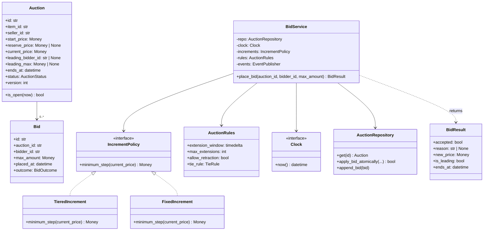
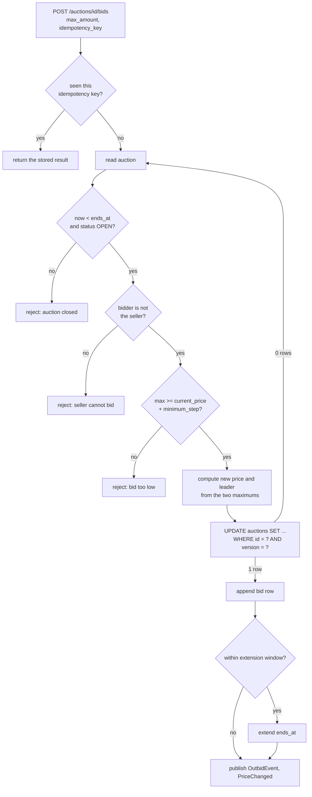

# Day 095 · System Design — Design an online auction

**After today you can:** You can model bids, the closing rule, and concurrent bidding.

**The interviewer asks it as:** *Design an auction site. Two bids arrive in the same millisecond.*

---

## 1. What this is, and why they ask it

An **auction** is a listing with a price that only ever goes up, a deadline, and a rule for who wins.
People place **bids**; the highest one when the deadline passes takes the item.

Three sentences. The state is tiny — an item, a current price, a leading bidder, an end time — and the
difficulty is entirely in **what happens when two people act at the same instant**. The second
difficulty is that a real auction does not store "the price you offered": it stores **the maximum you
are willing to pay**, and shows a lower number. And the third is that **nothing happens at the deadline
unless somebody makes it happen**, which is a design decision candidates almost always skip.

They ask it because it is the smallest realistic problem where **you cannot get away with eventual
consistency**. A like count that is stale for two seconds is fine. A price that is stale for two seconds
means you accepted a bid of ₹500 on an item that was already at ₹600, told the bidder they were
winning, and are now going to have to explain that to them. Money forces a correct answer, and the
correct answer is a single conditional write — not a lock, not a read-then-write, and definitely not a
cache.

*"Two bids arrive in the same millisecond"* is the question. Everything else in the prompt is setup for
it.

---

## 2. The story

The fish came in at about half past four and the selling started at five, on the wet concrete under the
one working light.

Sekhar had been going for eleven years and knew how it worked. The man with the stick stood by the
crate, called out a number, and men in the ring called out higher ones until they stopped.

Three things happened that morning that were worth watching.

The first was a crate of prawns where two men called out eight hundred at the same instant. Not nearly
the same. The same. There was a second of complete silence and then both of them looked at the man with
the stick, because there was no way for either of them to decide it and only he could. He pointed at
the man on his left and said, you, and then immediately said eight hundred and fifty to the ring so
that nobody could argue about it. Sekhar noticed that he did not hesitate. If he had hesitated, both of
them would have started shouting.

The second was Ibrahim, who had to be at the ice house by half past five and could not stay. Before he
left he went up to the man with the stick and said something quietly, and Sekhar knew what it was
because everybody did it. He was leaving a number. Go up to twelve hundred for me on the second crate,
but only as far as you have to. And that is what happened — the crate went to Ibrahim at nine hundred
and fifty, because that is where the next man stopped, and Ibrahim never paid his twelve hundred and
never knew what it would have gone to.

The third was the end of a crate of mackerel. The man with the stick said seven hundred, going, going —
and on the word going, somebody at the back said seven fifty. And instead of finishing, he started
again from seven fifty, going, going. He did that four times on that crate. Sekhar asked him about it
once, years ago, and the man said the obvious thing: if I stop the moment somebody speaks, then the
clever ones learn to speak at the last possible second and nobody else gets a turn. So I always start
again.

By six the concrete was being hosed down.

---

## 3. The idea in plain English

Sekhar has watched the three hard parts of an auction system, in order.

- Two men calling eight hundred at once, and one person deciding, is **concurrency control**. The
  important detail is *where* the decision is made: not by the bidders, and not by two separate people —
  by **one authority, in one place, without hesitating.**
- Ibrahim leaving a number is **proxy bidding**, also called automatic or maximum bidding. You tell the
  system the most you will pay; it bids on your behalf only as high as it needs to.
- Starting the count again when somebody speaks at the last moment is **anti-sniping**: extending the
  deadline whenever a bid arrives near the end.

### The state, which is almost nothing

```
 Auction:  item, seller, start_price, reserve_price, current_price,
           leading_bidder, leading_max, ends_at, status, version
```

**Ten fields.** The whole difficulty is in changing three of them atomically.

An auction moves through states, and each transition has exactly one cause:

```
 DRAFT -> SCHEDULED -> OPEN -> ENDED -> SOLD
                                    \-> UNSOLD  (reserve not met, or no bids)
                        \-> CANCELLED (seller, before any bid)
```

**`ENDED` and `SOLD` are different states on purpose.** The deadline passing ends the bidding; deciding
who won and whether the reserve was met is a separate step that may involve a payment attempt. Merging
them is how you end up with an auction that is "sold" to someone whose card then declines.

### Proxy bidding: what is stored is not what is shown

This is the part that surprises people, and it is how eBay has always worked.

When you "bid ₹1,200", the system does **not** set the price to ₹1,200. It records that your maximum is
₹1,200, and then sets the visible price to **just enough to beat the previous leader** — the second
highest maximum plus one increment.

```
 increment = ₹50

 Ibrahim bids max 1200      -> price 800 (the opening), Ibrahim leading, his max 1200 hidden
 Sekhar   bids max  900     -> Sekhar's 900 loses to Ibrahim's 1200
                            -> price becomes 950 (Sekhar's 900 + one increment, capped at 1200)
                            -> Ibrahim still leading, and never paid 1200
 Sekhar   bids max 1300     -> beats 1200
                            -> price becomes 1250 (Ibrahim's 1200 + increment)
                            -> Sekhar leading
```

**The displayed price is derived from the loser's maximum, not the winner's.** Two consequences worth
saying out loud:

1. **A bid can lose without changing the price at all** — if your maximum is below the leader's, the
   price moves to your maximum plus an increment, still under the leader's ceiling. You "bid and
   immediately lost".
2. **Maximums must never be visible**, not in the response, not in the timeline, not in an admin
   endpoint that the front end happens to call. Leaking a maximum is the single worst bug this system
   can have, because it lets a seller's friend bid the winner up to exactly their ceiling.

### The closing problem

At `ends_at`, nothing happens. Code does not run because a timestamp passed.

Two designs, and you must pick one out loud:

| | **Scheduled close** | **Lazy close** |
|---|---|---|
| How | a job (or a delayed queue message) fires at `ends_at` and finalises | the auction is treated as closed by any read after `ends_at`; a sweeper finalises later |
| Bid at `ends_at + 1ms` | rejected, because the state is already `ENDED` | rejected, because the check is `now < ends_at` |
| If the job is late | the auction stays `OPEN` and **accepts a late bid** | correct anyway — reads compute the truth |
| Cost | one timer per auction | one comparison per read |

**Lazy close is the correct default, with a sweeper for the side effects.** The rule to state: *the
truth about whether bidding is open is `now < ends_at`, evaluated at bid time, not a status field that
something has to remember to update.* Then the scheduled job only does the things that genuinely need
doing once — charging, notifying, releasing the item — and if it runs three seconds late, nothing has
been accepted that should not have been.

### Anti-sniping

A **snipe** is a bid placed in the last second, leaving nobody time to respond. It is not cheating, and
it is rational, and it makes auctions worse: honest bidders stop bothering.

The fix is the man with the stick starting again:

```python
    if bid_time > auction.ends_at - EXTENSION_WINDOW:      # e.g. the last 2 minutes
        auction.ends_at = bid_time + EXTENSION_WINDOW
```

**Two decisions to state.** Is the extension capped — can an auction be extended for ever? And is the
window the same for a ₹500 item and a ₹5,00,000 one? Both are policy, so both belong in a rules object
rather than in the bidding code, exactly as with the game rules on
[day 094](../day-094-backtracking/README.md).

---

## 4. The picture

The class diagram.



What to notice: **`Auction` has no `place_bid` method.** Placing a bid needs the clock, the increment
policy, the rules and an atomic write — none of which an `Auction` object should own. The entity holds
state and answers questions about itself; the service performs the transaction. Putting `place_bid` on
`Auction` is the most common structural mistake in this prompt.

Also notice `Clock` is an interface, for the same reason `Dice` was on
[day 094](../day-094-backtracking/README.md): **you cannot test anti-sniping, closing, or "a bid one
millisecond late" against the real system clock.**

One bid, end to end:



What to notice: **the retry arrow goes back to the read.** The conditional update either wins or it does
not; if it does not, someone else changed the auction, so you re-read and recompute. That loop is the
whole answer to "two bids in the same millisecond".

The two-bids-at-once race, drawn:

```
 Auction at ₹800, version 7.  Two requests arrive together.

  A: read  -> price 800, version 7        B: read  -> price 800, version 7
  A: compute new price 850                B: compute new price 850
  A: UPDATE ... WHERE version = 7  -> 1 row, version becomes 8
                                          B: UPDATE ... WHERE version = 7  -> 0 rows
                                          B: re-read -> price 850, version 8
                                          B: recompute -> 900, or reject as too low
                                          B: UPDATE ... WHERE version = 8  -> 1 row

 Exactly one of them wins each round. Nobody waits on a lock.
 The loser is told the truth: "the price moved, you are now at 900" or "your max is too low".
```

Compare with the version that is wrong, and which most first drafts contain:

```
  A: read 800     B: read 800
  A: write 850    B: write 850           <-- B overwrites A
  result: price 850, ONE of the two bids silently vanished,
          and its bidder was told they were leading.
```

**That is a lost update, and it is money.** Read-modify-write without a condition is the bug this whole
prompt exists to catch.

---

## 5. How it actually works

### Move 1 — clarify

- *"Which kind of auction?"* — English ascending, single item, fixed end time. Not Dutch, not sealed-bid,
  not multi-unit. Say this; it removes half the ambiguity in one sentence.
- *"Proxy bidding, or literal bids?"* — Proxy. Bidders submit a maximum and the system bids on their
  behalf. This is what eBay does and it changes the data model.
- *"Is there a reserve price?"* — Yes, hidden. The auction can end with a highest bid that does not meet
  it, and then nobody wins.
- *"What happens to a bid one millisecond after the end time?"* — Rejected. And I will make the end time
  the authority rather than a status flag, so a late background job cannot accidentally accept it.
- *"Do we handle payment?"* — Out of scope. I will end at `SOLD` with a winner and publish an event.

### Move 2 — the nouns

| Class | Responsible for |
|---|---|
| `Auction` | The state, and answering `is_open(now)`. No bidding logic. |
| `Bid` | One submitted maximum, its bidder, its time, and what happened to it. Immutable. |
| `BidService` | The transaction: validate, compute, write atomically, publish. |
| `IncrementPolicy` (interface) | The minimum step at a given price. Tiered on real sites. |
| `AuctionRules` | Extension window, extension cap, tie rule, retraction policy. Data. |
| `Clock` (interface) | `now()`. Replaceable, or none of the timing is testable. |
| `AuctionRepository` | Reads, and **the one conditional write**. |

**`Money` is a class, not a float.** Say this in one sentence and move on: `0.1 + 0.2 != 0.3`, so
amounts are integer minor units — paise, not rupees — and the type carries the currency.

### Move 3 — the interesting part

There are three, and an interviewer will push on all three. Handle them in this order.

**One: the concurrent bid.** The answer is a single conditional `UPDATE` with a retry loop.

```sql
UPDATE auctions
   SET current_price     = :new_price,
       leading_bidder_id = :new_leader,
       leading_max       = :new_max,
       ends_at           = :maybe_extended,
       version           = version + 1
 WHERE id = :auction_id
   AND version = :read_version
   AND status = 'OPEN';
```

If it updates one row, you won. If it updates zero rows, someone else moved the auction: re-read,
recompute, try again. **This is optimistic concurrency, and it is right here for a specific reason** —
contention is low for almost every auction and extreme for a few in the last thirty seconds, and
optimistic control costs nothing in the common case.

The alternative — `SELECT ... FOR UPDATE`, a pessimistic row lock — is also correct and is what you
should mention as the fallback. It serialises bidders on a hot row and holds a lock for the duration of
your transaction, so a slow bit of logic inside the transaction becomes everyone's problem. **Never a
distributed lock in Redis**: the database row is already the single point of truth, and adding a second
one creates the possibility of them disagreeing.

**Two: proxy resolution.** Given the current leader's hidden maximum and the new bidder's maximum,
compute the new price and leader. It is four cases and it is worth writing out, because getting it right
is the difference between a working auction and a fake one.

**Three: the close.** Covered above — the end time is the authority, and the job only does side effects.

### Move 4 — the class diagram

Drawn above. Present it by walking a bid, and lead with `BidService.place_bid`, because that is the only
interesting method in the system.

### Move 5 — the code

```python
from __future__ import annotations

from abc import ABC, abstractmethod
from dataclasses import dataclass
from datetime import datetime, timedelta
from enum import Enum, auto


@dataclass(frozen=True, order=True)
class Money:
    """Integer minor units. Never a float: 0.1 + 0.2 != 0.3, and this is money."""

    paise: int
    currency: str = "INR"

    def __add__(self, other: "Money") -> "Money":
        assert self.currency == other.currency
        return Money(self.paise + other.paise, self.currency)


class AuctionStatus(Enum):
    SCHEDULED = auto()
    OPEN = auto()
    ENDED = auto()
    SOLD = auto()
    UNSOLD = auto()
    CANCELLED = auto()


@dataclass
class Auction:
    id: str
    seller_id: str
    start_price: Money
    reserve_price: Money | None
    current_price: Money
    leading_bidder_id: str | None
    leading_max: Money | None          # NEVER leaves the service layer
    ends_at: datetime
    status: AuctionStatus
    version: int

    def is_open(self, now: datetime) -> bool:
        """The end TIME is the authority, not the status field.

        A background job that runs late cannot make this return True.
        """
        return self.status is AuctionStatus.OPEN and now < self.ends_at
```

`is_open` taking `now` as an argument rather than calling the clock itself is deliberate: the entity
stays free of dependencies and the caller decides which clock.

```python
class IncrementPolicy(ABC):
    @abstractmethod
    def minimum_step(self, current: Money) -> Money: ...


class TieredIncrement(IncrementPolicy):
    """What real sites use: the step grows with the price, so a ₹5 lakh item
    does not go up in ₹50 steps and take four thousand bids to move."""

    TIERS = [
        (Money(100_00), Money(1_00)),        # under ₹100      -> ₹1
        (Money(1_000_00), Money(25_00)),     # under ₹1,000    -> ₹25
        (Money(10_000_00), Money(100_00)),   # under ₹10,000   -> ₹100
    ]
    TOP = Money(1_000_00)                    # above that      -> ₹1,000

    def minimum_step(self, current: Money) -> Money:
        for ceiling, step in self.TIERS:
            if current < ceiling:
                return step
        return self.TOP
```

The proxy resolution, which is the heart of it:

```python
@dataclass(frozen=True)
class Resolution:
    price: Money
    leader_id: str
    leader_max: Money


def resolve(
    auction: Auction,
    bidder_id: str,
    new_max: Money,
    step: Money,
) -> Resolution:
    """Given the leader's hidden maximum and a new maximum, work out the
    visible price and who is leading.

    The rule: the price rises to just enough to beat the LOSER, never to the
    winner's maximum. That is why Ibrahim's 1200 stayed hidden.
    """
    old_max = auction.leading_max
    old_leader = auction.leading_bidder_id

    if old_leader is None:                          # first bid on the auction
        return Resolution(auction.start_price, bidder_id, new_max)

    if bidder_id == old_leader:                     # raising your own maximum
        return Resolution(auction.current_price, bidder_id, max(old_max, new_max))

    if new_max > old_max:                           # the challenger wins
        price = min(old_max + step, new_max)        # beat the loser, capped at your max
        return Resolution(price, bidder_id, new_max)

    if new_max == old_max:                          # tie: the EARLIER bid holds
        return Resolution(new_max, old_leader, old_max)

    price = min(new_max + step, old_max)            # challenger loses, price still moves
    return Resolution(price, old_leader, old_max)
```

**Four cases, and the last one is the one people miss:** a losing bid still raises the price, because it
has pushed the leader further up their own ceiling. That is exactly the crate going to Ibrahim at 950
instead of 800.

The tie rule is worth one sentence out loud: **an equal maximum loses to the one placed first.** It has
to be somebody, it should be deterministic, and "earliest wins" is what every real site does — the man
with the stick pointing without hesitating.

```python
class BidService:
    MAX_RETRIES = 5

    def __init__(self, repo, clock, increments, rules, events) -> None:
        self._repo = repo
        self._clock = clock
        self._increments = increments
        self._rules = rules
        self._events = events

    def place_bid(self, auction_id: str, bidder_id: str, new_max: Money) -> BidResult:
        now = self._clock.now()

        for _ in range(self.MAX_RETRIES):
            auction = self._repo.get(auction_id)

            if not auction.is_open(now):
                return BidResult.rejected("auction is closed")
            if bidder_id == auction.seller_id:
                return BidResult.rejected("a seller cannot bid on their own item")

            step = self._increments.minimum_step(auction.current_price)
            floor = auction.current_price if auction.leading_bidder_id is None \
                else auction.current_price + step
            if new_max < floor:
                return BidResult.rejected(f"minimum bid is {floor}")

            outcome = resolve(auction, bidder_id, new_max, step)
            ends_at = self._maybe_extend(auction, now)

            won_the_write = self._repo.apply_bid_atomically(
                auction_id=auction.id,
                expected_version=auction.version,       # <- the whole answer
                price=outcome.price,
                leader_id=outcome.leader_id,
                leader_max=outcome.leader_max,
                ends_at=ends_at,
            )
            if not won_the_write:
                continue                                # someone moved it; re-read

            self._repo.append_bid(Bid(auction_id, bidder_id, new_max, now))
            if outcome.leader_id != auction.leading_bidder_id:
                self._events.publish(Outbid(auction.id, auction.leading_bidder_id))
            self._events.publish(PriceChanged(auction.id, outcome.price))
            return BidResult.accepted(outcome.price, outcome.leader_id == bidder_id, ends_at)

        return BidResult.rejected("too much contention, please retry")

    def _maybe_extend(self, auction: Auction, now: datetime) -> datetime:
        window = self._rules.extension_window
        if now < auction.ends_at - window:
            return auction.ends_at
        return now + window                             # the count starts again
```

**Note what `place_bid` returns when the bidder is outbid instantly**: `accepted=True`,
`is_leading=False`. That is a real outcome and the UI has to show it — "your bid was accepted but you
are not the highest bidder" — and a design that has no way to express it will produce a screen that
lies.

### What real systems do

- **eBay** has used proxy bidding since 1995 and it is the reason the price you see is rarely a round
  number: it is the loser's maximum plus one increment. eBay's increments are tiered exactly as above.
- Bids are written to a **strongly consistent** store — a relational database, or DynamoDB with
  conditional writes and strongly consistent reads. **This is not a place for eventual consistency.**
- The auction row is the single writer point. Hot auctions in their final minute are handled by putting
  bids for one auction onto **one partition of a queue keyed by auction id**, so they are serialised by
  arrival rather than by contention — the same one-writer-per-entity idea as
  [day 094](../day-094-backtracking/README.md).
- Price updates are pushed to watchers over **WebSockets**; the read path for "current price" can be
  cached for a second or two, **but the write path must never read from that cache.**
- Closing is a **delayed queue message** (SQS delay, or a scheduled sweeper over
  `ends_at < now AND status = 'OPEN'`), and the sweeper is the safety net for messages that were lost.

---

## 6. The numbers

### Volume

```
 active auctions                        10,000,000
 average bids per auction                       12
 average auction length                     7 days
 ------------------------------------------------------
 bids per auction-week                        12
 bids per day     10M × 12 / 7          ≈ 17,100,000
 bids per second  17.1M / 86,400        ≈       198
```

**Two hundred bids a second is nothing.** That is the point — and it is why candidates who spend the
interview on horizontal scaling have missed the question.

The real number is the distribution:

```
 share of bids in the final 60 seconds of an auction      ~35%
 auctions ending in the same busy minute (evening)        ~2,000
 bids in that minute      17.1M/day × 35% ÷ (auctions/day) ... concentrated:
   a popular auction can take                    1,000-5,000 bids in the last 30 seconds
   = up to                                       ~170 bids per second ON ONE ROW
```

**One hundred and seventy writes a second to a single row, while ten million other auctions are
idle.** That is the actual engineering problem, and it is a concurrency problem, not a throughput one.

### Storage

```
 bid row: id, auction_id, bidder_id, max_amount, placed_at, outcome    ≈ 200 bytes
 bids per day                                                    17,100,000
 per day        17.1M × 200 B                                    =  3.4 GB
 per year                                                        =  1.25 TB
 auction rows   10M × 400 B                                       =  4 GB
```

Bids are **append-only and never updated**, which makes them ideal for partitioning by auction id and
archiving by month. Keep the last ninety days queryable and move the rest to object storage: about
310 GB hot, the rest at roughly ₹1.7 per GB-month.

### Reads against writes

```
 page views per auction over its life        ~400
 bids per auction                              12
 read:write ratio                          ~33:1
```

Thirty-three reads per write, and every viewer of a live auction wants the current price. **Cache the
displayed price with a one-to-two second TTL, and push updates over WebSockets** — but the bid path
reads the row directly. Say that distinction explicitly: *the display may be one second stale; the
decision must not be stale at all.*

### Retries

```
 optimistic write success rate, idle auction         ~100%
 same, at 170 bids/second on one row:
   window between read and conditional write         ~2 ms
   probability of a collision   170/s × 2 ms         ≈ 34%
   expected attempts             1 / (1 - 0.34)      ≈ 1.5
   P(more than 5 attempts)       0.34^5              ≈ 0.5%
```

**About one and a half attempts on average even on the hottest auction**, and half a percent of bidders
would exhaust five retries — which is why the queue-per-auction option exists for the top few hundred
listings. Being able to produce that calculation is what makes "I would use optimistic concurrency"
into an argument rather than a preference.

### Closing

```
 auctions ending per day                     10M / 7      ≈ 1,430,000
 per second, average                                      ≈ 16
 evening peak (3× )                                       ≈ 50
```

Fifty finalisations a second — trivial work, but it must not be late in a way that lets bids through.
Hence: the end time is the authority and the sweeper only does side effects.

### Concurrency, stated plainly

1. **Two bids on the same auction at once.** Conditional update on `version`; loser re-reads and
   recomputes. Never a read-then-write.
2. **The same bid submitted twice** because the phone retried. An **idempotency key** per bid, with a
   unique constraint, so the second submission returns the first result instead of bidding again.
3. **A bid racing the deadline.** The check is `now < ends_at` inside the same transaction as the write,
   so there is no window between checking and accepting.

---

## 7. The trade-offs

### Optimistic concurrency, or a row lock?

**Optimistic** costs nothing when there is no contention, which is 99.99 percent of auctions, and
degrades gracefully — 1.5 attempts on the hottest row. It can starve a very unlucky bidder, which is why
there is a retry cap and an honest error.

**A pessimistic `SELECT ... FOR UPDATE`** never retries and is easier to reason about, and it holds a
lock for however long your transaction takes — so one slow call inside the transaction becomes every
bidder's wait. **I would not use optimistic concurrency if the write path had to do several dependent
updates**; at that point the lock's simplicity wins.

**Neither** is a distributed lock. The row is already the single source of truth; a Redis lock adds a
second one that can disagree with it, and now you have two problems.

### Store the maximum, or the literal bid?

Proxy bidding is more code and it is what users expect. Literal bidding — the price is what you typed —
is simpler and produces a much worse auction: it rewards whoever is refreshing the page at 3 a.m. **Take
proxy bidding**, and accept the hard constraint it brings: the maximum must never leak, anywhere.

### Anti-snipe extension, or a hard close?

Extension makes the auction fairer and makes the end time unpredictable, which breaks "this ends at
8 p.m." in listings, calendars and notifications. A hard close is predictable and rewards sniping.

**Take the extension with a cap** — say, at most ten extensions — and show the rule in the listing.
**I would not extend** for a fixed-price "buy it now" flow or a scheduled charity event where the end
time is the product.

### Push the price, or let clients poll?

At thirty-three reads per write, polling every second wastes most of its requests. WebSockets cost a
persistent connection per viewer — and a popular auction has thousands of viewers in its final minute.
**Push for live auctions in their last hour, poll otherwise**, which is a real hybrid that real sites
use.

### Where this design breaks

- **Multi-unit auctions** — ten identical items, top ten bidders win — break `leading_bidder_id` and the
  whole proxy resolution, because "the price" becomes a clearing price and there are `k` winners.
- **Sealed-bid or Dutch auctions** are different rules, not extensions: no visible price, or a price
  that falls. The `IncrementPolicy` interface does not help; you would want a `AuctionType` strategy
  above the service.
- **Payment failure after `SOLD`.** The winner's card declines. Do you offer it to the second-highest
  bidder at their maximum? That is a business rule with legal weight, and it is why `ENDED` and `SOLD`
  are separate states.
- **Shill bidding** — the seller bidding through a friend to push the price up — is not solved by any of
  this. It is a fraud-detection problem: graph analysis on bidder-seller pairs who repeatedly meet, plus
  the rule that a seller cannot bid on their own listing. Mention it; it shows you know the system has
  adversaries.

---

## 8. In the interview

### How it gets asked

- The prompt: *"Design an online auction site."*
- The one they actually care about: *"Two bids arrive in the same millisecond. What happens?"*
- The data-model probe: *"What exactly do you store when I bid ₹1,200?"*
- The timing probe: *"A bid arrives one millisecond after the end time."* / *"Your closing job is thirty
  seconds late."*
- The fairness probe: *"Someone bids in the last second every time. Is that a problem?"*
- The scale probe: *"One auction is taking a thousand bids in the final thirty seconds."*

### What to say out loud, in the first ninety seconds

1. **Name the kind of auction.** "English ascending, single item, fixed end time, proxy bidding, hidden
   reserve. Payment is out of scope; I will end at a winner and publish an event."
2. **Say what is stored, because it is surprising.** "A bid is a **maximum**, not a price. The visible
   price is the *loser's* maximum plus one increment, so a winner usually pays far less than they
   offered. That means maximums must never appear in any response."
3. **Go straight to the race.** "The interesting part is two bids at once. I do a conditional update:
   set the new price and leader **where the version is still the one I read**. One row updated means I
   won; zero rows means somebody moved it, so I re-read and recompute. Never read-then-write, or one bid
   silently overwrites the other and its bidder is told they are leading."
4. **Make the deadline the authority.** "Whether bidding is open is `now < ends_at`, evaluated inside
   the same transaction as the write — not a status field that a job has to remember to flip. Then a job
   running late cannot accept a bid it should not have."
5. **Mention anti-sniping as a rule, not a feature.** "A bid inside the last two minutes extends the end
   by two minutes, capped. It is policy, so it lives in a rules object."
6. **Give the numbers that reframe the problem.** "Ten million active auctions at twelve bids each is
   about two hundred bids a second globally — nothing. The problem is that one popular auction can take
   a hundred and seventy writes a second **to a single row** in its last thirty seconds. This is a
   concurrency problem, not a throughput problem."

### The follow-ups

**"Two bids arrive in the same millisecond. What happens?"**
"Exactly one is applied first and the other is told the truth. Concretely: both requests read the
auction at price ₹800, version 7. Both compute a new price. Both issue an `UPDATE ... WHERE id = ? AND
version = 7`. The database serialises them, so one updates one row and moves the version to 8, and the
other updates **zero** rows. The loser does not fail — it re-reads at version 8 and recomputes, and
either it now wins at a higher price or its maximum is too low and it is rejected with a clear reason.
Nobody waits on a lock. The version I would never write is read, decide, write — that is a lost update,
and it means one bidder's money quietly disappeared while they were told they were winning."

**"What do you store when I bid ₹1,200?"**
"Your **maximum**, ₹1,200 — not the price. The price becomes just enough to beat the current leader:
their maximum plus one increment, capped at yours. So if the leader's hidden maximum was ₹900 and the
increment is ₹50, the price becomes ₹950 and you are leading with ₹1,200 still hidden. Two consequences.
A bid can be accepted and immediately losing, if your maximum is under the leader's — and the price
still moves, because you have pushed them further up their own ceiling. And the maximums must never
leak: not in the API response, not in an event, not in an admin view the front end calls. Leaking a
maximum lets someone bid you up to exactly your ceiling, which is the worst bug this system can have."

**"A bid arrives one millisecond after the end time."**
"Rejected, and the reason it is reliably rejected is that **the end time is the authority, not a status
column**. The open check is `now < ends_at` evaluated in the same transaction as the write, so there is
no gap between checking and accepting. If I had relied on a background job to flip the status to
`ENDED`, then a job that ran three seconds late would accept three seconds of bids that should not
exist — and that is a real incident, not a theoretical one. The job still exists, but it only does side
effects: decide the winner, check the reserve, notify, release the item."

**"Someone bids in the last second every time."**
"That is sniping, and it is rational rather than cheating — but it makes auctions worse, because honest
bidders learn there is no point participating and the seller gets less. The fix is what a live
auctioneer does: any bid inside the final window extends the end by that window, so there is always time
to respond. I would cap the number of extensions so an auction cannot run for ever, and I would put both
the window and the cap in a rules object rather than in the bidding code, because they are policy and
they differ by category. The cost is a real one: the end time stops being predictable, which breaks
'ends at 8 p.m.' in listings and reminders."

**"One auction is taking a thousand bids in its final thirty seconds."**
"That is about 170 writes a second to one row. With optimistic concurrency the arithmetic is: if the gap
between read and conditional write is around two milliseconds, the collision probability is roughly
thirty-four percent, so the expected number of attempts is about 1.5 and fewer than one in two hundred
bidders would exhaust five retries. That is acceptable. If I wanted it bounded rather than probabilistic,
I would route bids for a single auction through **one partition of a queue keyed by auction id**, so they
are serialised by arrival order with no contention at all — one writer per auction, which also gives a
clean, fair ordering. I would only do that for the top few hundred hot listings, because it adds latency
to every bid it touches."

**"Could you cache the current price?"**
"For **display**, yes — a one-to-two second TTL, plus a WebSocket push on every change, and at
thirty-three reads per write that saves most of the read load. For the **bid path**, absolutely not. The
whole design rests on comparing against the true current state inside the transaction that writes. A
cached price would let me accept a ₹500 bid on an item already at ₹600 and tell that bidder they were
winning. That is the sentence I would want on the record: **the display may be stale; the decision may
not be.**"

### A model answer

Asked: *design an auction site. Two bids arrive in the same millisecond.*

> "Let me set the scope in one line: English ascending auction, single item, fixed end time, proxy
> bidding, hidden reserve. Payment is out of scope — I end at a winner and publish an event.
>
> The state is small: item, seller, current price, leading bidder, the leader's hidden maximum, end
> time, status, version. All the difficulty is in changing three of those fields at once.
>
> First, what a bid actually is, because it surprises people. When you bid ₹1,200 I do **not** set the
> price to ₹1,200. I record ₹1,200 as your **maximum** and set the visible price to just enough to beat
> the current leader — their maximum plus one increment, capped at yours. So the displayed price is
> derived from the *loser's* maximum, not the winner's. Two consequences: a bid can be accepted and
> instantly losing, and it still moves the price because it pushed the leader further up their own
> ceiling. And maximums must never leave the service layer — leaking one lets somebody walk a bidder up
> to exactly their ceiling.
>
> Now the question. Two bids in the same millisecond. Both requests read the auction at, say, ₹800 with
> version 7. Both compute a new price. Then both issue a conditional update: set the price, leader and
> maximum **where the id matches and the version is still 7**. The database serialises those two
> statements, so one of them updates a row and bumps the version to 8, and the other updates **zero**
> rows. The loser is not an error — it re-reads at version 8, recomputes against the new price, and
> either wins at a higher number or is rejected with 'the price moved, your maximum is too low'. Nobody
> holds a lock and nobody waits.
>
> The version I would never write is read, decide, then write unconditionally. That is a lost update:
> the second write silently overwrites the first, one bid disappears, and the bidder who placed it was
> told they were leading. With money, that is not a bug you can log and move on from.
>
> On the deadline: **the end time is the authority, not a status column.** The check is `now < ends_at`
> inside the same transaction as the write, so a bid one millisecond late is rejected even if a
> background job has not got round to marking the auction ended. The job still runs, but only for side
> effects — winner, reserve check, notifications. If it is thirty seconds late, nothing incorrect has
> been accepted in the meantime.
>
> I would add anti-sniping: a bid in the final two minutes extends the end by two minutes, capped at ten
> extensions. That is what a live auctioneer does when someone shouts on 'going, going' — he starts the
> count again, because otherwise everyone learns to shout last and nobody else gets a turn. It is policy,
> so it lives in a rules object with the increment tiers, not in the bidding code.
>
> Finally the numbers, because they reframe the problem. Ten million active auctions at twelve bids each
> over a week is about two hundred bids a second globally, which is nothing. But roughly a third of all
> bids land in the final minute, and a single popular auction can take a thousand bids in thirty seconds
> — about a hundred and seventy writes a second **to one row**. So this is a contention problem, not a
> throughput problem. Optimistic concurrency handles it: with a two-millisecond window the expected
> number of attempts is around 1.5. If I wanted it bounded rather than probabilistic, I would route that
> auction's bids through a single queue partition keyed by auction id — one writer per auction — and I
> would do that only for the hottest few hundred listings, because it adds latency to every bid."

---

## 9. Recall card

- **A bid is a MAXIMUM, not a price.** The visible price is the **loser's** maximum plus one increment,
  capped at the winner's — so ₹1,200 usually wins at ₹950. Consequences: a bid can be **accepted and
  instantly losing**, a losing bid **still raises the price**, and **maximums must never leak** anywhere.
  Ties go to the **earlier** bid.
- **Two bids at once: a conditional write, never read-then-write.** `UPDATE … WHERE id = ? AND version =
  ?` — one row means you won, **zero rows means re-read and recompute**. Read-modify-write is a **lost
  update**: one bid vanishes and its bidder is told they are leading. Not a Redis lock — the row is
  already the single source of truth.
- **The end TIME is the authority, not a status column.** `now < ends_at` is checked inside the same
  transaction as the write, so a late closing job cannot accept bids it should not. The job does only
  side effects, and `ENDED` and `SOLD` are **separate states** because payment can fail.
- **Anti-snipe: a bid in the final window extends the end by that window, capped.** Policy, so it lives
  in a rules object with the tiered increments. The price the design pays is that the end time stops
  being predictable.
- **The numbers reframe it: 10M auctions × 12 bids ÷ 7 days ≈ 200 bids/second globally — nothing.** The
  problem is **~170 writes/second to ONE row** in a hot auction's last 30 seconds. At a 2 ms window that
  is a ~34% collision rate, **~1.5 attempts expected**, 0.5% exhausting five retries. For the hottest
  listings, **one queue partition per auction id = one writer, zero contention.** Cache the price for
  **display** (1–2 s TTL, ~33:1 read:write) — **never for the decision.**
