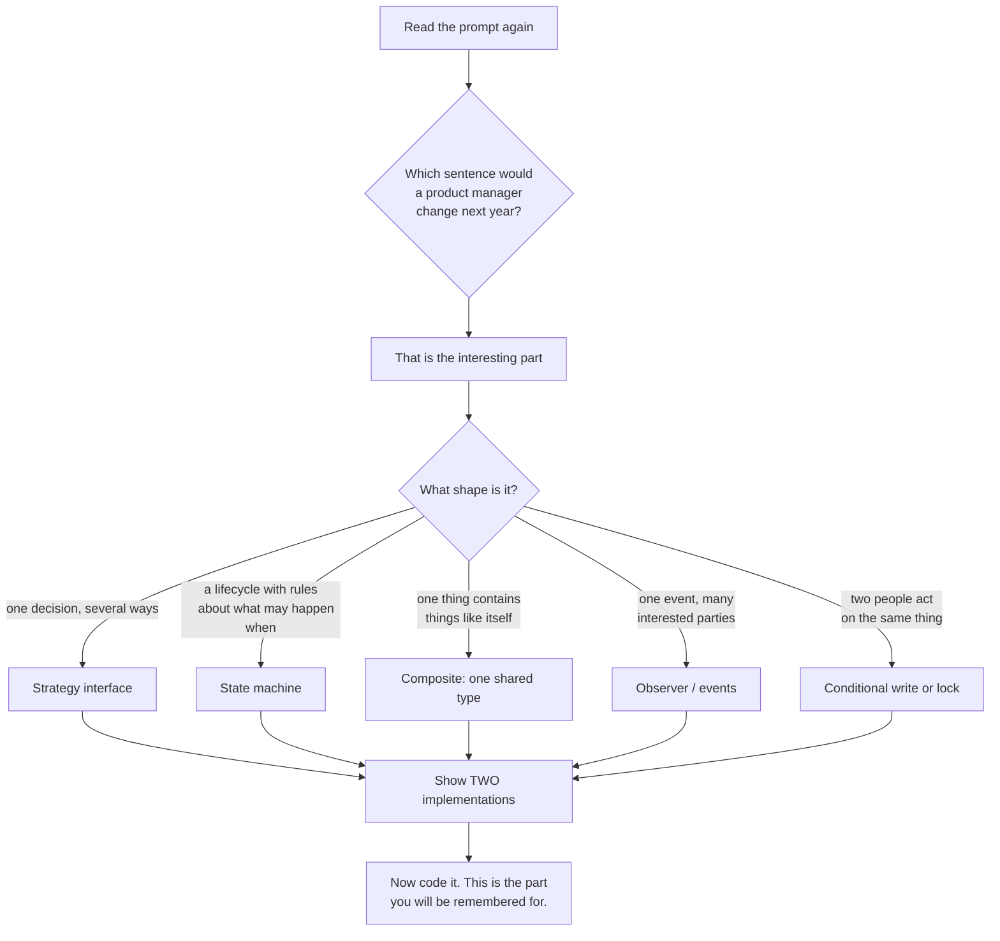
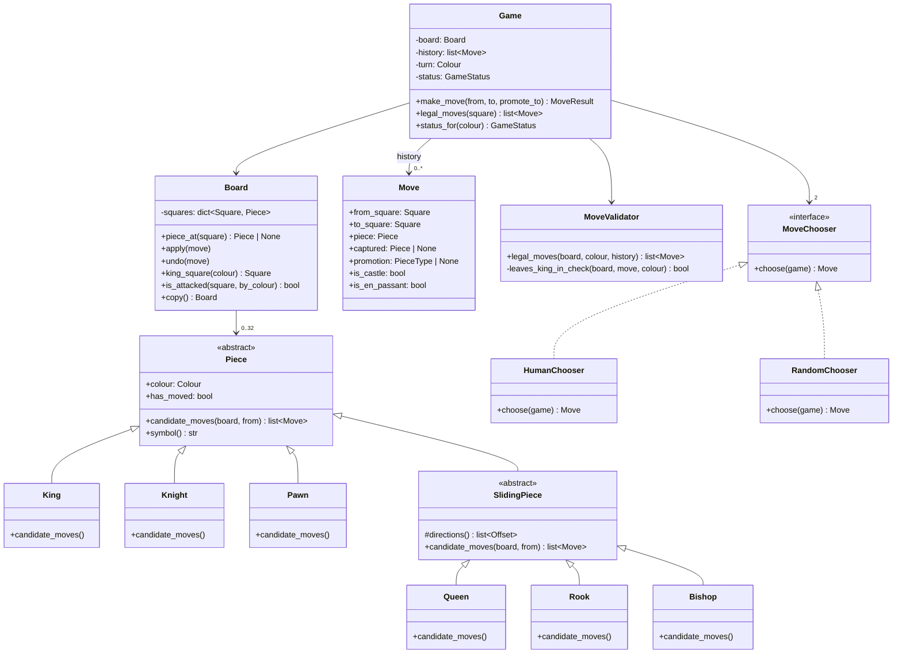

# Day 096 · System Design — Low-level design revision and full mock

**After today you can:** You can take an unseen LLD prompt to a defended class diagram in forty minutes.

**The interviewer asks it as:** *Design a chess game. Forty minutes. Begin.*

---

## 1. What this is, and why they ask it

The **low-level design round** gives you a prompt in one sentence — design a parking lot, an elevator, a
chess game — and forty minutes to produce classes, their responsibilities, and the code for the two or
three that matter.

Three sentences. It is not a knowledge test; there is nothing to recall. It is a **performance**, and
the thing being assessed is whether you can turn vague requirements into objects with clear
responsibilities while thinking out loud. And because it is a performance, **the same five moves work
for every prompt**, which is what today is for.

You have now done eighteen of these — [parking lot](../day-078-nodes-and-links/README.md),
[elevator](../day-079-list-traversal/README.md), [ATM](../day-080-dummy-head/README.md),
[vending machine](../day-081-reversing-a-list/README.md),
[library](../day-082-runner-technique/README.md), [chess](../day-083-cycle-detection/README.md),
[card game](../day-084-merging-and-sorting-lists/README.md),
[Splitwise](../day-085-doubly-and-circular/README.md),
[BookMyShow](../day-086-linked-lists-revision/README.md),
[food delivery](../day-087-recursion-leap-of-faith/README.md),
[ride-hailing](../day-088-the-call-stack/README.md),
[rate limiter](../day-089-recursion-that-terminates/README.md),
[cache](../day-090-recursion-on-arrays/README.md), [logging](../day-091-subsets/README.md),
[notifications](../day-092-permutations/README.md), [file system](../day-093-combinations/README.md),
[snake and ladder](../day-094-backtracking/README.md) and
[auction](../day-095-n-queens/README.md). Today is not new material. It is the extraction: what was the
same in all eighteen, and how do you produce it under a clock with somebody watching.

---

## 2. The story

The shop was one room with a glass front on the main road, and Basheer had been in it since 1989.

People came in wanting all sorts of things. A shirt. A suit for a son's wedding. A blouse to go with a
sari somebody's mother had left them. Curtains, twice. Once, a cover for a motorbike seat.

He did the same thing every time, and it took about four minutes.

First he asked what it was for. Not what they wanted made — what it was *for*. Wedding, office, every
day. Because a shirt for the office and a shirt for a wedding are not the same shirt, and if he did not
ask, he would make the wrong one perfectly.

Then he asked two or three questions that narrowed it. Full sleeve or half. Loose or fitted. Is this
going to be washed every week or twice a year.

Then he took the measurements, and this was the part that never changed. Chest, waist, shoulder, sleeve,
length, neck. The same six, in the same order, for everybody, every time. He called them out and his
nephew wrote them into the phone. Even for the curtains he went through the list in his head first,
which made no sense to anybody watching, and then took the two he actually needed.

Then he said what he was going to do, out loud, before touching anything. This much cloth, this cut,
these buttons, ready on Thursday. And people would correct him at that point — no, not those buttons —
which was exactly why he said it.

Only after all that did he pick up the chalk.

A young man who had come to learn from him spent a week being annoyed by this. He kept saying, you know
what a shirt is. Why do you ask the same six things every single time.

Basheer said: because the day I stop asking is the day somebody walks out with a shirt they cannot wear
to the thing they bought it for. The questions are not for me. They are so that both of us know what we
agreed before I cut anything, and cloth does not go back together.

---

## 3. The idea in plain English

Basheer has an interview script, and it is the same one that works for every LLD prompt.

- "What is it for" is **clarifying requirements**. The prompt is one sentence and it is deliberately
  incomplete.
- The two or three narrowing questions are **scoping** — deciding out loud what you are *not* building.
- The six measurements in the same order are **the five moves**, below. The same procedure regardless of
  the prompt.
- Saying what he is going to do before touching anything is **presenting the design before writing
  code**, so the interviewer can correct you while it is still free.
- "Cloth does not go back together" is why: **in forty minutes there is no time to restart.**

### The five moves

Every one of the eighteen case studies used these, in this order.

| # | Move | Time | What it produces |
|---|---|---|---|
| 1 | **Clarify** | 0–5 min | 3–4 questions, each with the answer you will assume |
| 2 | **The nouns** | 5–10 min | A list of classes, one line each on responsibility |
| 3 | **The class diagram** | 10–20 min | Fields, key methods, relationships |
| 4 | **The interesting part** | 20–30 min | The one decision the prompt is really about, behind an interface |
| 5 | **The code** | 30–40 min | Two or three classes, written properly |

**Move 4 is what you are being marked on.** Moves 1 to 3 are table stakes; almost everybody gets a
`Board`, a `Player` and a `Game`. What separates candidates is spotting that every prompt has exactly
one place where the design is genuinely decided, putting an interface there, and showing two
implementations.

### The interesting part, prompt by prompt

This table is the revision. It is the answer to "what was the same in all eighteen".

| Prompt | The one decision | The interface that goes there |
|---|---|---|
| Parking lot | which spot does this vehicle get | `SpotAllocationStrategy` |
| Elevator | which lift answers this call | `SchedulingStrategy` |
| ATM | how do you make up ₹2,300 from the cassettes | `DispenseStrategy` |
| Vending machine | what does the machine do next | `State` — a state machine |
| Library | when is a book due, and what is the fine | `LoanPolicy` |
| Chess | is this move legal for this piece | `Piece.moves_from(board, square)` |
| Card game | what are the rules of *this* game | `GameRules` |
| Splitwise | how is this expense divided | `SplitStrategy` |
| BookMyShow | how do you hold a seat while someone pays | seat **locking**, with a TTL |
| Food delivery | which courier gets this order | `AssignmentStrategy` |
| Ride-hailing | what does this ride cost | `PricingStrategy` |
| Rate limiter | which counting rule | `RateLimitAlgorithm` |
| Cache | what gets thrown out | `EvictionPolicy` |
| Logging | where does this line go, and in what shape | `Handler` + `Formatter` |
| Notifications | which channel, and how hard do we retry | `Channel` + `RetryPolicy` |
| File system | how do files and directories share a type | one `Entry`, the composite |
| Snake and ladder | where does randomness come from | `Dice` |
| Auction | what happens when two bids collide | a conditional write |

**Fifteen of the eighteen are a strategy** — one method, several implementations, chosen at runtime.
That is not a coincidence and it is the single most useful pattern in this round. When you cannot see
the interesting part, ask yourself: *which sentence in the prompt would a product manager change next
year?* Put an interface there.

### The four tells

Four phrases in a prompt, each of which names its own pattern.

| If the prompt says… | You want… |
|---|---|
| "…depending on", "…based on the type of" | **Strategy**: one interface, several implementations |
| "…and then it becomes", "while it is being…" | **State**: an explicit state machine, and only legal transitions |
| "notify", "when X happens, also…" | **Observer**: publish an event, do not call the other subsystem |
| "contains other", "inside another" | **Composite**: one shared type for the leaf and the container |

And two structural rules that came up in nearly every case study:

- **Randomness, time and input/output must be replaceable.** `Dice`, `Clock`, `Channel`. If any of them
  is hard-coded, nothing in the design can be tested. This came up on
  [snake and ladder](../day-094-backtracking/README.md) and again on
  [auction](../day-095-n-queens/README.md), and it will come up in your round.
- **Return a result object; do not print.** `TurnResult`, `BidResult`, `MoveResult`. It is what lets one
  engine serve a terminal, a phone and a simulation.

### The five mistakes that lose the round

1. **Coding at minute three.** You will design the wrong thing beautifully. Clarify first.
2. **Silence.** They are marking your reasoning, and they cannot mark what they cannot hear. Narrate
   even the boring parts.
3. **Anaemic classes with a God service.** `Order`, `User`, `Item` holding only fields, and one
   `OrderService` with every rule in it. Behaviour belongs with the data it uses.
4. **Enums where polymorphism belongs.** `if piece.type == KNIGHT` repeated in four methods. Every one
   of those is a `switch` you will have to edit when a variant appears.
5. **Getting stuck on completeness.** Nobody finishes. Say what you are leaving out and why, and spend
   the time on the interesting part.

---

## 4. The picture

The forty minutes, drawn.

```
 0        5            10                20                30              40
 |--------|------------|-----------------|-----------------|---------------|
 CLARIFY   NOUNS        CLASS DIAGRAM     INTERESTING PART   CODE
 3-4 Qs    one line     fields, methods,  interface +        2-3 classes,
 with your each         relationships     2 implementations  properly
 assumed   class                          <- THE MARK IS HERE
 answers

 checkpoints, said out loud:
   min 5   "so I am building X, not Y — tell me if that is wrong"
   min 10  "here are my classes; anything you would add before I draw?"
   min 20  "here is the diagram; the interesting part is Z"
   min 30  "I will code Z and the class it lives on"
   min 38  "what I have left out: A, B, C. Here is how each would fit."
```

The decision procedure for finding the interesting part:



And the shape almost every LLD answer takes:

```
        +---------------------------+
        |   Service / Engine        |    the orchestrator: 5-10 line methods,
        |   (Game, BidService,      |    no business rules of its own
        |    NotificationService)   |
        +------------+--------------+
                     |
        +------------+--------------+--------------------+
        |            |              |                    |
   +----v----+  +----v-----+  +-----v------+      +------v-------+
   | Entities|  | Policy   |  | Replaceable|      | Result object|
   | (state, |  | interface|  | dependency |      | (returned,   |
   |  small  |  | (Strategy|  | (Clock,    |      |  never       |
   |  rules) |  |  + 2 impl|  |  Dice, I/O)|      |  printed)    |
   +---------+  +----------+  +------------+      +--------------+

 If your diagram has all four boxes, you have answered the question.
```

---

## 5. How it actually works

### The mock: *Design a chess game. Forty minutes. Begin.*

You met chess on [day 083](../day-083-cycle-detection/README.md). This is the timed performance, written
out as it should sound.

### Minutes 0–5 · Clarify

> "Let me check the scope. Four questions.
>
> **One — am I designing the rules engine, or a playable product?** I will assume the engine: a board,
> pieces, legal move generation, check and checkmate detection, and a game that tracks whose turn it is.
> Not networking, not a UI, not an opponent that chooses moves — although I will leave a seam for that.
>
> **Two — full rules, including castling, en passant and promotion?** I will design so that all three
> fit, and implement promotion, because it is the one that changes the board in an unusual way. If we
> run out of time, castling and en passant are the two I would leave as named gaps.
>
> **Three — do I need move history?** Yes, and not for undo — for *correctness*. Castling depends on
> whether the king or rook has ever moved, en passant depends on the immediately previous move, and the
> threefold-repetition draw depends on the whole history. So history is part of the state, not a
> feature.
>
> **Four — two humans, or does one side need to be a program?** I will put the move *choice* behind an
> interface so a human and an engine are two implementations, but I will not write a chess engine.
>
> Anything there you want changed before I start?"

**Question three is the one that impresses**, because it shows you know the domain has hidden state.
Most candidates discover castling at minute thirty-five.

### Minutes 5–10 · The nouns

> "The classes, one line each.
>
> - **`Square`** — a coordinate. Immutable, and it knows how to add an offset and stay on the board.
> - **`Piece`** — colour, type, and whether it has moved. **Abstract**, with a subclass per kind.
> - **`Board`** — the 8 × 8 arrangement, plus 'which piece is here', 'is this square attacked'.
> - **`Move`** — from, to, the piece, anything captured, promotion, and the flags for castling and en
>   passant. Immutable, and rich enough to be undone.
> - **`MoveValidator`** — is this move legal *in this position*, which is not the same as whether the
>   piece moves that way.
> - **`Game`** — turn order, history, status, and the one public method: `make_move`.
> - **`GameStatus`** — in progress, check, checkmate, stalemate, draw.
> - **`MoveChooser`** (interface) — a human or a program deciding what to play.
>
> I am deliberately not making `Player` do anything. It is a colour and a name."

### Minutes 10–20 · The class diagram



> "Two things to point at.
>
> **`Piece` is abstract with a subclass per kind**, and `candidate_moves` is the polymorphic method. The
> alternative — a `PieceType` enum and a `switch` inside the validator — means every rule change edits
> the same method, and a chess variant with a new piece edits it again. This is the enum-versus-
> polymorphism decision, and chess is the clearest example of it there is.
>
> **`SlidingPiece` sits between them** because rook, bishop and queen differ only in their direction
> list. Sliding — walk outward until you hit the edge, an enemy piece which you may capture, or a
> friendly piece which you may not — is one method written once. Queen's directions are the rook's plus
> the bishop's."

### Minutes 20–30 · The interesting part

> "Chess has one place where the design is really decided, and it is **not** how each piece moves.
> That part is easy. The interesting part is that **legality has two layers.**
>
> A knight moves in an L. That is the piece's rule and it is local. But a knight that is pinned against
> its own king **may not move at all**, even though the L is available — and no amount of knowledge
> about knights tells you that. It depends on the position of a completely different piece.
>
> So I split it in two:
>
> - `Piece.candidate_moves(board, from)` — *how this piece moves*. Local, per subclass, easy to test.
> - `MoveValidator.legal_moves(...)` — *what is actually allowed in this position*: take the candidates
>   and remove any that leave your own king attacked.
>
> And the way you test the second one is the trick worth knowing: **make the move, ask whether your king
> is attacked, then unmake it.** That is exactly the choose-recurse-un-choose from the DSA side of this
> week — apply, check, undo — and it is why `Move` has to carry the captured piece: without it, undo
> cannot restore what was taken.
>
> ```
> for move in candidate_moves:
>     board.apply(move)
>     safe = not board.is_attacked(board.king_square(me), by=opponent)
>     board.undo(move)              # <- this is why Move stores `captured`
>     if safe:
>         legal.append(move)
> ```
>
> That single loop gives me pins, discovered check, and 'you must get out of check' for free — three
> rules I never have to write, because they all fall out of 'your king must not be attacked after your
> move'. **Checkmate then needs no special code at all: it is `in_check and not legal_moves`. Stalemate
> is `not in_check and not legal_moves`.** Two lines, two of the hardest concepts in the game."

### Minutes 30–40 · The code

```python
from __future__ import annotations

from abc import ABC, abstractmethod
from dataclasses import dataclass
from enum import Enum, auto


class Colour(Enum):
    WHITE = auto()
    BLACK = auto()

    @property
    def other(self) -> "Colour":
        return Colour.BLACK if self is Colour.WHITE else Colour.WHITE


@dataclass(frozen=True)
class Square:
    file: int          # 0..7, a..h
    rank: int          # 0..7, 1..8

    def offset(self, df: int, dr: int) -> "Square | None":
        f, r = self.file + df, self.rank + dr
        return Square(f, r) if 0 <= f < 8 and 0 <= r < 8 else None
```

`offset` returning `None` off the board is the same "bounds check first" habit as the grid problems —
one place to get it right instead of eight.

```python
@dataclass
class Move:
    from_square: Square
    to_square: Square
    piece: "Piece"
    captured: "Piece | None" = None      # REQUIRED for undo
    promotion: type["Piece"] | None = None
    is_castle: bool = False
    is_en_passant: bool = False
```

```python
class Piece(ABC):
    def __init__(self, colour: Colour) -> None:
        self.colour = colour
        self.has_moved = False           # castling and the pawn double-step need this

    @abstractmethod
    def candidate_moves(self, board: "Board", origin: Square) -> list[Move]:
        """How this piece moves. NOT whether the move is legal in this position."""


class SlidingPiece(Piece):
    """Rook, bishop and queen differ ONLY in their direction list."""

    @abstractmethod
    def directions(self) -> list[tuple[int, int]]: ...

    def candidate_moves(self, board: "Board", origin: Square) -> list[Move]:
        moves: list[Move] = []
        for df, dr in self.directions():
            square = origin.offset(df, dr)
            while square is not None:
                occupant = board.piece_at(square)
                if occupant is None:
                    moves.append(Move(origin, square, self))
                    square = square.offset(df, dr)          # keep sliding
                    continue
                if occupant.colour is not self.colour:
                    moves.append(Move(origin, square, self, captured=occupant))
                break                                       # blocked either way
        return moves


class Rook(SlidingPiece):
    def directions(self):
        return [(1, 0), (-1, 0), (0, 1), (0, -1)]


class Bishop(SlidingPiece):
    def directions(self):
        return [(1, 1), (1, -1), (-1, 1), (-1, -1)]


class Queen(SlidingPiece):
    def directions(self):
        return Rook(self.colour).directions() + Bishop(self.colour).directions()
```

**Three pieces in nine lines**, because the shared behaviour was factored out rather than repeated.
Saying "rook, bishop and queen are one algorithm with three direction lists" out loud is worth a lot.

```python
class Knight(Piece):
    JUMPS = [(1, 2), (2, 1), (2, -1), (1, -2),
             (-1, -2), (-2, -1), (-2, 1), (-1, 2)]

    def candidate_moves(self, board: "Board", origin: Square) -> list[Move]:
        moves = []
        for df, dr in self.JUMPS:
            square = origin.offset(df, dr)
            if square is None:
                continue
            occupant = board.piece_at(square)
            if occupant is None or occupant.colour is not self.colour:
                moves.append(Move(origin, square, self, captured=occupant))
        return moves
```

And the validator, which is the part the round is really about:

```python
class MoveValidator:
    def legal_moves(self, board: "Board", colour: Colour) -> list[Move]:
        """Candidates minus anything that leaves your own king attacked.

        Apply, check, undo — the same pattern as backtracking, and the reason
        `Move` must carry the captured piece.

        This one loop gives pins, discovered check, and "you must escape
        check" for free. None of the three is written anywhere.
        """
        legal: list[Move] = []
        for origin, piece in board.pieces_of(colour):
            for move in piece.candidate_moves(board, origin):
                board.apply(move)                              # choose
                king = board.king_square(colour)
                safe = not board.is_attacked(king, by=colour.other)
                board.undo(move)                               # un-choose
                if safe:
                    legal.append(move)
        return legal

    def status(self, board: "Board", colour: Colour) -> "GameStatus":
        moves = self.legal_moves(board, colour)
        in_check = board.is_attacked(board.king_square(colour), by=colour.other)
        if moves:
            return GameStatus.CHECK if in_check else GameStatus.IN_PROGRESS
        return GameStatus.CHECKMATE if in_check else GameStatus.STALEMATE
```

**`status` is six lines and it defines checkmate and stalemate.** That is the payoff of splitting
legality into two layers, and it is what you want the interviewer to remember.

```python
class Game:
    def __init__(self, board: Board, validator: MoveValidator) -> None:
        self.board = board
        self.validator = validator
        self.history: list[Move] = []
        self.turn = Colour.WHITE
        self.status = GameStatus.IN_PROGRESS

    def make_move(self, origin: Square, target: Square,
                  promote_to: type[Piece] | None = None) -> MoveResult:
        if self.status in (GameStatus.CHECKMATE, GameStatus.STALEMATE):
            return MoveResult.rejected("the game is over")

        legal = self.validator.legal_moves(self.board, self.turn)
        chosen = next(
            (m for m in legal
             if m.from_square == origin and m.to_square == target
             and m.promotion == promote_to),
            None,
        )
        if chosen is None:
            return MoveResult.rejected("illegal move")

        self.board.apply(chosen)
        chosen.piece.has_moved = True
        self.history.append(chosen)
        self.turn = self.turn.other
        self.status = self.validator.status(self.board, self.turn)
        return MoveResult.accepted(chosen, self.status)
```

### Minute 38 · Say what you left out

> "What I have not built, and where each would go.
>
> **Castling** — a `King` candidate move guarded by four conditions: neither piece has moved, the
> squares between are empty, and the king is not in check on its start, path or destination square. The
> `has_moved` flag and `is_attacked` are already there, so it is one method on `King` plus a special case
> in `Board.apply` to move the rook as well.
>
> **En passant** — needs the previous move, which is why history is on `Game`. `Pawn.candidate_moves`
> takes the last move and adds the diagonal capture when it was an adjacent double-step.
>
> **Draws** — fifty-move rule and threefold repetition. Both are history queries, not board queries, and
> repetition needs a position hash, so I would add a Zobrist-style key on `Board`.
>
> **Performance** — `legal_moves` currently applies and undoes every candidate, which is about thirty-
> five moves in a typical position. For a playable game that is fine. For an engine searching millions of
> positions, you would switch to bitboards and incremental attack maps, and that is a different program."

---

## 6. The numbers

LLD numbers are lighter than high-level design numbers, and skipping them entirely is still a mistake.
Three kinds always apply.

### Objects in memory

```
 chess position:  32 pieces × ~80 B  +  a 64-entry dict × ~100 B  ≈  9 KB
 move history:    ~80 moves × 100 B                               ≈  8 KB
 --------------------------------------------------------------------
 one live game                                                    ≈ 17 KB

 100,000 concurrent games  =  1.7 GB
```

**1.7 GB is the number that decides whether games live in process memory or in Redis.** Compare with
[snake and ladder](../day-094-backtracking/README.md) at 1.1 KB a game, where a hundred thousand games
was 110 MB and the answer was different. Same question, different answer, because the state is fifteen
times bigger.

### Work per operation

```
 legal_moves(): ~35 candidates in a typical position
   each one:    apply + is_attacked + undo
   is_attacked: ~8 sliding rays + 8 knight squares + pawns/king  ≈ 40 checks
 -> ~1,400 checks per legal_moves() call
 -> tens of microseconds in Python
```

Fine for a human game at one move every ten seconds. **Hopeless for a search engine**, which is exactly
the sentence to say: it identifies the limit of your own design before the interviewer does.

### Concurrency

Every LLD prompt has a two-people-at-once question, and it is worth having the map:

```
 two bids on one auction         -> conditional write on a version    (day 095)
 two people booking one seat     -> a lock with a TTL, then payment   (day 086)
 two mkdir of the same directory -> create under the parent's lock    (day 093)
 two players moving at once      -> a game is SERIAL: one writer      (day 094, today)
 two threads in one cache        -> per-shard locks, not one global   (day 090)
```

**The chess answer is the serial one.** A game accepts one move at a time by definition, so the model is
one writer per game, and a hundred thousand games are a hundred thousand independent streams with no
contention between them. A version number on the game plus a move number for idempotency covers a
client that retries.

---

## 7. The trade-offs

### Polymorphic pieces, or an enum with a switch?

The enum version is fewer files and, for a fixed rule set, genuinely defensible — some real engines use
it because a switch on an integer is faster than a virtual call.

**Take polymorphism in an interview.** The prompt is a design question, and the enum version puts the
same `switch` in move generation, in attack detection, and in scoring — three places to edit for one new
piece. **I would use the enum if this were a performance-critical engine**, and I would say so, because
knowing *why* the ugly version exists is worth more than reflexively rejecting it.

### Apply-check-undo, or copy the board?

Copying is simpler and cannot leave the board corrupted if something throws. It also allocates a whole
position per candidate move — thirty-five copies per `legal_moves` call.

**Take apply-undo**, which is why `Move` carries the captured piece. Say the risk: an exception between
apply and undo leaves the board wrong, so in production the pair belongs in a context manager.

### Validate inside `Piece`, or in a separate validator?

Putting "does this leave my king in check" inside the piece means every piece needs to know about kings,
checks and the whole board — and the same code is repeated six times.

**Keep the two layers separate.** *How a piece moves* is local and belongs to the piece. *Whether a move
is legal here* is global and belongs to one validator. This split is the single best idea in the chess
design and it generalises: **local rules on the entity, global rules in a service.**

### Where this design breaks

- **Chess variants.** Chess960 randomises the back rank and changes castling completely; a variant with a
  new piece is one new subclass, which is the win, but a variant that changes the *board* — three players,
  a hexagonal board — breaks `Square` and every direction list.
- **An engine.** Object-per-piece and dictionary lookups are the wrong representation for searching
  millions of positions. Bitboards make the whole thing arithmetic on 64-bit integers. Different program,
  same rules.
- **Time controls.** A clock per player, with increments, is a separate concern that most candidates
  forget entirely. It is a `Clock` and two accumulated durations, and it changes `GameStatus` to include
  "lost on time".

---

## 8. In the interview

### How it gets asked

- The prompt is one sentence: *"Design a chess game."* / *"Design a parking lot."* / *"Design an
  elevator."*
- The scope probe, at minute five: *"Would you support X?"* — they are testing whether you scope or
  panic.
- The extension, at minute thirty-five: *"Now add a new piece / a new pricing rule / a second currency."*
  This is the real question and everything before it was setup.
- The self-criticism probe: *"What is wrong with this design?"*

### What to say out loud, in the first ninety seconds

Whatever the prompt:

1. **Restate the scope in one sentence, including what you are excluding.** "I am designing the rules
   engine — board, pieces, legal moves, check and mate. Not networking, not a UI, not an opponent."
2. **Ask the three or four questions, with your assumed answers attached.** Never ask an open question
   and wait; ask it and answer it yourself so the round keeps moving.
3. **Announce the plan.** "I will list the classes, draw the relationships, then spend most of the time
   on the one part where the design is actually decided, and code that."
4. **Name the interesting part early.** "For chess, the interesting part is that legality has two layers
   — how a piece moves, and whether that move leaves your own king attacked."
5. **Say what you are deliberately deferring.** "Castling and en passant fit in places I will point at;
   I will implement promotion because it changes the board in an unusual way."

### The follow-ups

**"How do you handle check and checkmate?"**
"I do not write them as rules, which is the point. Legality is two layers: each piece produces its
candidate moves, and then the validator filters out anything that leaves my own king attacked — by
applying the move, asking whether the king square is attacked, and undoing it. That one filter gives me
pins, discovered check and 'you must get out of check' for free. Then **checkmate is `in_check and no
legal moves`, and stalemate is `not in_check and no legal moves`** — two lines. If I had written
checkmate as its own rule I would have three overlapping rule sets that can disagree."

**"Now add a new piece — one that moves like a knight and a bishop."**
"One new subclass. It implements `candidate_moves` by returning the knight jumps plus the bishop slides,
and I register it in the piece factory. **Nothing else changes** — not the validator, not the board, not
check detection, because all of those work in terms of `Piece`. That is the whole argument for
polymorphic pieces over a type enum with a switch: with the enum, adding a piece means editing move
generation, attack detection and any scoring, and every edit risks the existing pieces."

**"Why is `MoveValidator` separate from `Board` and from `Piece`?"**
"Because there are two genuinely different kinds of rule and they have different scopes. *How a bishop
moves* is local — it needs the bishop and the board, and it is the same in every position, so it belongs
on the bishop and is trivially testable on its own. *Whether this move is legal right now* is global — it
depends on the position of a piece that may be at the other end of the board — and it is identical for
all six piece types, so writing it once in a validator is the difference between one implementation and
six. The general form of that rule is: **local rules go on the entity, global rules go in a service.**"

**"What is wrong with this design?"**
"Three things I would name before you do. First, `legal_moves` applies and undoes every candidate move,
which is about fourteen hundred board checks per call — fine for a human game, hopeless for an engine
searching millions of positions, where you would move to bitboards. Second, apply-undo without a context
manager means an exception between the two leaves the board corrupted; the pair should be wrapped.
Third, `Board.is_attacked` recomputes attacks from scratch every time, where a real implementation keeps
incremental attack maps. All three are the same trade: I optimised for clarity and for a design
conversation, and I would change all three if this had to search."

**"You have five minutes left and you have not done castling."**
"Then I will describe it rather than write it, which is the right call at five minutes. Castling is a
king move with four guards: neither the king nor that rook has ever moved — which is why `Piece` carries
`has_moved`; the squares between them are empty; and the king is not attacked on its current square, the
square it passes through, or its destination — which uses `is_attacked`, already written. The only
special case in `Board.apply` is that it moves two pieces instead of one, so `Move` needs the
`is_castle` flag it already has. Everything it needs exists; it is one method on `King` and one branch in
`apply`."

### A model answer

Asked, at minute five: *so what are you building?*

> "I am building the chess rules engine: a board, pieces that know how they move, legal move generation,
> check, checkmate and stalemate, and a game that enforces turn order and keeps history. I am not
> building networking, a user interface, or an opponent that chooses moves — although I will put move
> *choice* behind an interface so a human and a program are two implementations of the same thing.
>
> History is part of the state rather than a feature, and I want to say why now rather than discover it
> later: castling depends on whether the king and rook have ever moved, en passant depends on the
> immediately previous move, and threefold repetition depends on the entire game. Any design that treats
> history as an add-on has to be rebuilt when those come up.
>
> The class list is `Square`, `Piece` — abstract, with a subclass per kind — `Board`, `Move`,
> `MoveValidator`, and `Game`. I will add a `SlidingPiece` layer between `Piece` and rook, bishop and
> queen, because those three differ only in a list of directions; sliding until you hit the edge, an
> enemy or a friend is one method written once.
>
> The part I want to spend the most time on is this: **legality has two layers, and conflating them is
> what makes chess designs collapse.** How a knight moves is local — an L shape — and belongs on the
> knight. But a pinned knight may not move at all, and nothing about knights can tell you that; it
> depends on a piece somewhere else entirely. So `Piece.candidate_moves` answers 'how does this piece
> move', and `MoveValidator` answers 'what is allowed in this position' by taking each candidate,
> applying it, asking whether my own king is now attacked, and undoing it. That is apply-check-undo, the
> same pattern as backtracking, and it is why `Move` has to store the captured piece — otherwise undo
> cannot put it back.
>
> The payoff is that three of the hardest rules are never written. Pins, discovered check, and 'you must
> get out of check' all fall out of that one filter. And then **checkmate is 'in check and no legal
> moves', stalemate is 'not in check and no legal moves'** — six lines for the two concepts that
> beginners find hardest.
>
> I will code `SlidingPiece`, the validator, and `Game.make_move`, and at the end I will tell you exactly
> where castling, en passant and the draw rules attach, so you can see the design has room for them."

---

## 9. Recall card

- **Five moves, always, in this order: clarify (0–5) · nouns (5–10) · class diagram (10–20) · the
  interesting part (20–30) · code (30–40).** Moves 1–3 are table stakes. **You are marked on move 4.**
  Find it by asking: *which sentence in the prompt would a product manager change next year?* Put an
  interface there and show **two** implementations.
- **Fifteen of eighteen case studies had a strategy at their centre** — `EvictionPolicy`,
  `PricingStrategy`, `SplitStrategy`, `Channel`, `Dice`, `SpotAllocationStrategy`. The tells: *"depending
  on"* → **strategy**; *"and then it becomes"* → **state machine**; *"notify"* → **observer**;
  *"contains other"* → **composite**.
- **Randomness, time and I/O must be replaceable** (`Dice`, `Clock`, `Channel`) or nothing is testable.
  **Return a result object, never print** — one engine then serves a terminal, a phone and a simulation.
  **Local rules on the entity, global rules in a service.**
- **Chess: legality has two layers.** `Piece.candidate_moves` is local and per subclass;
  `MoveValidator` applies each candidate, asks whether your own king is attacked, and **undoes** it —
  which is why `Move` must carry the captured piece. That one filter gives **pins, discovered check and
  escaping check for free**, and then **checkmate = `in_check and not legal_moves`, stalemate =
  `not in_check and not legal_moves`.**
- **The five ways to lose:** coding at minute three; silence; anaemic classes plus a God service; an
  **enum with a switch where polymorphism belongs**; and chasing completeness instead of naming what you
  left out. **Nobody finishes** — at minute 38, say what is missing and where each piece would attach.
