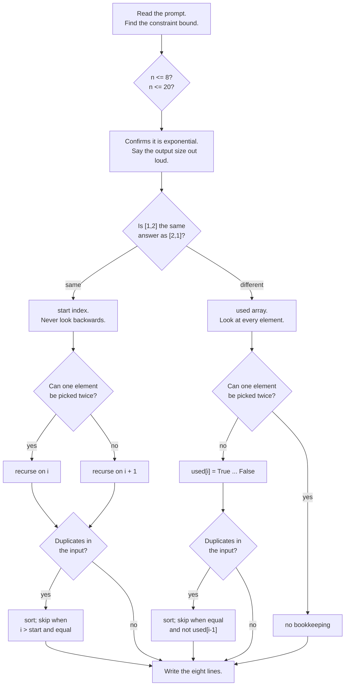

# Day 097 · DSA — Recursion and backtracking revision and mock round

**After today you can:** You can solve two unseen backtracking problems cold.

**The interviewer asks it as:** *Two problems, no hints, talk as you go.*

---

## 1. What this is, and why they ask it

Eleven days ago you had not written a recursive function. Since then:
[the leap of faith](../day-087-recursion-leap-of-faith/README.md),
[the call stack](../day-088-the-call-stack/README.md),
[termination](../day-089-recursion-that-terminates/README.md),
[arrays and strings](../day-090-recursion-on-arrays/README.md),
[subsets](../day-091-subsets/README.md), [permutations](../day-092-permutations/README.md),
[combinations](../day-093-combinations/README.md),
[the undo step](../day-094-backtracking/README.md),
[N-Queens](../day-095-n-queens/README.md) and
[grid search](../day-096-grid-backtracking/README.md).

Three sentences. Every one of those problems is **one of four templates**, and the whole skill is
recognising which one in the first thirty seconds. The recognition is not about the words in the
problem; it is about **two questions** — does order matter, and may things be reused — whose four
answers are the four templates. And once you have picked, the code is eight lines you have already
written five times.

They run a revision round like this because in a real interview nobody tells you it is a backtracking
problem. The prompt says *"find all the ways to…"* or *"is there a sequence such that…"*, and your first
minute decides the next thirty. Today is that first minute, practised until it is automatic.

---

## 2. The story

The bicycle repair stand was two planks and an umbrella at the corner where the school road meets the
main road, and Salim had been standing there for nineteen years.

What he did that nobody else on that road did was listen first.

A boy would arrive pushing a bicycle and start explaining. Salim would take it from him, hold the
handlebars, and lift the back wheel about an inch off the ground with his foot on the stand. Then he
would turn the pedal with his hand, once, slowly, and listen.

That was usually enough. He would say chain, or bearing, or brake block, and be right.

His nephew Faisal came to work with him one summer and could not do it. He would take a bicycle and
open things — the chain, the brake, the wheel nuts — one after another until he found the problem. Some
days he found it in two minutes and some days he took forty and had a bicycle in fifteen pieces on the
ground.

Salim watched this for about a week and then told him what he was actually doing, which turned out to
be very small.

He said, before you touch anything, ask two things. Does it make a noise when it is moving, or only
when you press something. And does the noise happen every turn of the wheel, or only sometimes.

That is it. Two questions, four answers. Noise all the time and every turn — the chain or a bearing.
Noise all the time but not every turn — something bent, and the wheel is the first place to look. Only
when you press — a brake. Only sometimes and only under load — the gears.

Faisal said that seemed too simple to be the whole thing.

Salim said it was not the whole thing, it was the first thirty seconds. After the first thirty seconds
you still have to do the work, and the work is the same work whichever it is — open it, look at it, fix
it, put it back. But if you get the first thirty seconds wrong you spend the morning taking apart the
wrong half of the bicycle, and the boy is late for school.

By August Faisal was doing it too. Not as fast, but he had stopped opening things at random.

---

## 3. The idea in plain English

Salim's two questions are the whole revision. Every problem in this phase is one of four templates, and
two questions choose between them.

### The two questions

```
 Q1: Does ORDER matter?
       yes -> [1,2] and [2,1] are different answers    -> the used-array tree
       no  -> [1,2] and [2,1] are the same answer      -> the start-index tree

 Q2: May an element be used MORE THAN ONCE?
       yes -> recurse on i
       no  -> recurse on i + 1  (or mark it used)
```

Four combinations, four templates:

| Order matters? | Reuse allowed? | Template | Example |
|---|---|---|---|
| No | No | `start` index, recurse on `i + 1` | subsets, combinations, Combination Sum II |
| No | Yes | `start` index, recurse on **`i`** | Combination Sum |
| Yes | No | `used` array, loop over all `n` | permutations |
| Yes | Yes | no bookkeeping at all — every choice always available | letter combinations of a phone number, generate parentheses |

**That table is the phase.** Everything else — pruning, duplicate handling, grids — sits on top of one
of those four.

### The one template, written once

```python
    def explore(state):
        if is_complete(state):
            record(copy_of(state))          # COPY, always
            return
        for choice in options(state):
            if not is_valid(choice, state):
                continue                    # PRUNE, before descending
            apply(choice, state)            # choose
            explore(state)                  # recurse
            undo(choice, state)             # un-choose
```

The four templates differ only in `options`. Everything else is identical.

### The five rules that survive from the whole phase

1. **Append a copy.** `current[:]`. `current` is one object mutated throughout; appending it stores a
   reference, and every reference points at the same list, empty by the end.
2. **Count the chooses and the undoes.** Two chooses need two undoes; four need four. Undo in reverse.
   A missing undo is **always silent**.
3. **Prune before descending, never at the leaf.** N-Queens at n = 8: 2,057 nodes versus 19,173,961.
4. **Anything passed as an argument needs no undo.** Move state into the parameter list wherever you
   can; it is state you cannot forget to restore.
5. **Say the output size first.** `2ⁿ`, `n!`, `C(n,k)` — and that no algorithm can beat it, because the
   output *is* that big. It removes "can you do better?" from the conversation.

### The duplicate rule, in its three outfits

The same idea appeared three times and interviewers use the difference to check whether you understood
it or memorised it.

```
 start-index tree (subsets, combination sum II):
     sort, then:  if i > start and items[i] == items[i-1]: continue

 used-array tree (permutations):
     sort, then:  if i > 0 and items[i] == items[i-1] and not used[i-1]: continue

 swap-based tree (in-place permutations):
     a per-level set of values already tried
```

**All three mean the same sentence:** *do not start two branches with the same value at the same level.*
The bookkeeping differs because the tree shape differs. If you can say that sentence and then derive the
right condition, you never have to remember which is which.

### How to recognise a backtracking problem at all

The prompt almost never says "backtrack". It says one of these:

- **"Find all…"**, **"return every…"**, **"list the ways…"** — enumeration. The output is exponential and
  they know it.
- **"Is there a … such that"** — a search with an early return.
- **"Count the number of ways…"** — careful. If you only need the count and the same sub-state is
  reachable by many paths, that is **dynamic programming**, not this.
- A **tiny constraint**: `n ≤ 8` means factorial, `n ≤ 20` means `2ⁿ`, `target ≤ 500` with small
  candidates means combination sum. **The bound is the hint**, and reading it is free.

---

## 4. The picture

The family tree of the phase.

```
                        recursion
                            |
        +-------------------+--------------------+
        |                                        |
   ONE branch per call                   MANY branches per call
   (linear recursion)                    (tree recursion)
   factorial, reverse a string,                  |
   binary search                                 |
                                          BACKTRACKING
                                                 |
              +----------------------------------+---------------------+
              |                                                        |
      order does NOT matter                                    order DOES matter
      -> `start` index                                         -> `used` array
              |                                                        |
      +-------+--------+                                     +---------+---------+
      |                |                                     |                   |
  no reuse         reuse allowed                        no reuse            reuse allowed
  build(i+1)       build(i)                             used[i]             no bookkeeping
      |                |                                     |                   |
  subsets          combination sum                     permutations        phone letters
  combinations                                         N-Queens            parentheses
  comb. sum II                                         word search
```

The four templates, side by side, with only the differences shown:

```
 SUBSETS / COMBINATIONS            COMBINATION SUM
 for i in range(start, n):         for i in range(start, n):
     choose(items[i])                  choose(items[i])
     build(i + 1)     <-- i+1          build(i)         <-- i
     unchoose()                        unchoose()

 PERMUTATIONS                      PHONE LETTERS / PARENTHESES
 for i in range(n):                for ch in options_at_this_level:
     if used[i]: continue              choose(ch)
     used[i] = True                    build(depth + 1)
     choose(items[i])                  unchoose()
     build()                       (nothing is consumed, so nothing
     unchoose()                     is tracked)
     used[i] = False
```

The decision, as a thirty-second procedure:



---

## 5. The code, built step by step

### Step 1 — the four templates, from memory

Write these four before the mock. If any of them takes more than a minute, that is the one to practise.

### Step 2 — mock problem one: **Palindrome Partitioning**

*"Given a string, return every way of cutting it into pieces where every piece is a palindrome. For
`"aab"`, the answer is `[["a","a","b"], ["aa","b"]]`."*

Think out loud, in this order:

> "Order does not matter in the sense that matters here — I am cutting left to right, so each choice is
> 'where does the next cut go', and I never go backwards. That is the `start`-index shape. Nothing is
> reused, because each character is consumed exactly once, so I move `start` forward past whatever I
> took.
>
> The choices at each level are the possible end points of the next piece: `start+1` up to `n`. The
> validity check is 'is `s[start:end]` a palindrome', and it goes **before** the recursive call, so I
> never descend into a cut that is already invalid.
>
> Size: at worst every character is its own palindrome, so a string of `n` characters has `2^(n-1)`
> cutting points — for `"aaaa"` that is 8 partitions, all valid. So this is exponential and `n` will be
> small; the constraint says 16, which confirms it."

```python
def partition(s: str) -> list[list[str]]:
    """Every partition of s into palindromic pieces.

    start-index tree, no reuse: each character is consumed once.
    The palindrome check is the PRUNE and it goes before the recursion.
    """
    result: list[list[str]] = []
    current: list[str] = []

    def build(start: int) -> None:
        if start == len(s):
            result.append(current[:])           # COPY
            return
        for end in range(start + 1, len(s) + 1):
            piece = s[start:end]
            if piece != piece[::-1]:
                continue                        # PRUNE before descending
            current.append(piece)               # choose
            build(end)                          # recurse: past what we took
            current.pop()                       # un-choose

    build(0)
    return result
```

**The follow-up is guaranteed: "the palindrome check is O(n) inside a loop — can you avoid it?"** Yes:
pre-compute a table of which substrings are palindromes, in `O(n²)`, then each check is one lookup.

```python
def partition_with_table(s: str) -> list[list[str]]:
    """The same, with an O(n^2) palindrome table so each check is O(1).

    is_pal[i][j] means s[i:j+1] is a palindrome. Built from short pieces
    outward, so is_pal[i+1][j-1] is always already known.
    """
    n = len(s)
    is_pal = [[False] * n for _ in range(n)]
    for length in range(1, n + 1):
        for i in range(n - length + 1):
            j = i + length - 1
            is_pal[i][j] = s[i] == s[j] and (length < 3 or is_pal[i + 1][j - 1])

    result: list[list[str]] = []
    current: list[str] = []

    def build(start: int) -> None:
        if start == n:
            result.append(current[:])
            return
        for end in range(start, n):
            if not is_pal[start][end]:
                continue                        # now O(1)
            current.append(s[start:end + 1])
            build(end + 1)
            current.pop()

    build(0)
    return result
```

### Step 3 — mock problem two: **Restore IP Addresses**

*"Given a string of digits, return every valid IP address you can make by inserting three dots. Each of
the four parts must be between 0 and 255, and must not have a leading zero unless it is exactly `"0"`."*

> "This is the same `start`-index shape — I am cutting left to right — with two extra constraints: there
> must be exactly four pieces, and each piece has its own validity rule. So the state is `start` and the
> number of pieces so far, and there are two prunes rather than one.
>
> The prunes are worth stating separately, because one of them is easy to miss. Obviously a piece must be
> a number from 0 to 255 with no leading zero. Less obviously, **if the characters remaining cannot
> possibly fill the remaining parts, stop** — with `k` parts left, I need between `k` and `4k` characters.
> That second check is what stops a 12-character string wasting the whole tree.
>
> The size is tiny — at most three positions for each of three dots, so at most `C(11,3) = 165`
> candidates. That is worth saying, because it means the answer is 'this is not really exponential at
> all'."

```python
def restore_ip_addresses(digits: str) -> list[str]:
    """LeetCode 93. Insert three dots to make four valid parts.

    start-index tree with a fixed piece count. Two prunes:
      1. each part is 0..255 with no leading zero
      2. the characters left must be able to fill the parts left
    """
    n = len(digits)
    if not 4 <= n <= 12:
        return []                               # cannot possibly work

    result: list[str] = []
    parts: list[str] = []

    def build(start: int) -> None:
        if len(parts) == 4:
            if start == n:                      # used every character
                result.append(".".join(parts))
            return

        remaining_parts = 4 - len(parts)
        remaining_chars = n - start
        if not remaining_parts <= remaining_chars <= remaining_parts * 3:
            return                              # PRUNE: cannot fit

        for length in (1, 2, 3):
            if start + length > n:
                break
            piece = digits[start:start + length]
            if piece[0] == "0" and length > 1:
                break                           # leading zero: and longer is worse
            if int(piece) > 255:
                break                           # sorted by length, so stop
            parts.append(piece)                 # choose
            build(start + length)               # recurse
            parts.pop()                         # un-choose

    build(0)
    return result
```

**Two `break`s, and both are justified by monotonicity**: a longer piece starting with `0` is also
invalid, and a longer piece is a larger number. That is the same "sorted plus monotone means `break`"
rule from [day 093](../day-093-combinations/README.md).

### The complete revision file

All four templates in one place, to be written from memory.

```python
# ----- TEMPLATE 1: order does NOT matter, no reuse -------------------------
def template_subsets(items: list[int]) -> list[list[int]]:
    """Subsets, combinations, Combination Sum II, palindrome partitioning."""
    result, current = [], []

    def build(start: int) -> None:
        result.append(current[:])               # or: if complete -> record
        for i in range(start, len(items)):
            current.append(items[i])
            build(i + 1)                        # i + 1: consumed
            current.pop()

    build(0)
    return result


# ----- TEMPLATE 2: order does NOT matter, reuse allowed --------------------
def template_combination_sum(candidates: list[int], target: int) -> list[list[int]]:
    """Combination Sum. The ONLY difference from template 1 is `i` vs `i + 1`."""
    candidates = sorted(candidates)
    result, current = [], []

    def build(start: int, remaining: int) -> None:
        if remaining == 0:
            result.append(current[:])
            return
        for i in range(start, len(candidates)):
            if candidates[i] > remaining:
                break                           # sorted -> break, not continue
            current.append(candidates[i])
            build(i, remaining - candidates[i])  # i: may reuse
            current.pop()

    build(0, target)
    return result


# ----- TEMPLATE 3: order DOES matter, no reuse -----------------------------
def template_permutations(items: list[int]) -> list[list[int]]:
    """Permutations, N-Queens, word search. TWO chooses, TWO un-chooses."""
    result, current = [], []
    used = [False] * len(items)

    def build() -> None:
        if len(current) == len(items):
            result.append(current[:])
            return
        for i in range(len(items)):             # every element, not from start
            if used[i]:
                continue
            used[i] = True
            current.append(items[i])
            build()
            current.pop()
            used[i] = False                     # the one people forget

    build()
    return result


# ----- TEMPLATE 4: order matters, everything always available --------------
def template_free_choice(digits: str) -> list[str]:
    """Letter combinations of a phone number. Nothing is consumed, so there
    is no `start`, no `used`, and nothing to restore beyond the prefix."""
    keypad = {"2": "abc", "3": "def", "4": "ghi", "5": "jkl",
              "6": "mno", "7": "pqrs", "8": "tuv", "9": "wxyz"}
    if not digits:
        return []
    result, current = [], []

    def build(depth: int) -> None:
        if depth == len(digits):
            result.append("".join(current))
            return
        for letter in keypad[digits[depth]]:
            current.append(letter)
            build(depth + 1)
            current.pop()

    build(0)
    return result


# ----- the duplicate rule, in both outfits ---------------------------------
def dedupe_start_index(items: list[int]) -> list[list[int]]:
    """`i > start`: another FIRST choice at this level."""
    items = sorted(items)
    result, current = [], []

    def build(start: int) -> None:
        result.append(current[:])
        for i in range(start, len(items)):
            if i > start and items[i] == items[i - 1]:
                continue
            current.append(items[i])
            build(i + 1)
            current.pop()

    build(0)
    return result


def dedupe_used_array(items: list[int]) -> list[list[int]]:
    """`not used[i-1]`: my identical twin has not been placed yet."""
    items = sorted(items)
    result, current = [], []
    used = [False] * len(items)

    def build() -> None:
        if len(current) == len(items):
            result.append(current[:])
            return
        for i in range(len(items)):
            if used[i]:
                continue
            if i > 0 and items[i] == items[i - 1] and not used[i - 1]:
                continue
            used[i] = True
            current.append(items[i])
            build()
            current.pop()
            used[i] = False

    build()
    return result


if __name__ == "__main__":
    print(len(template_subsets([1, 2, 3])))                      # 8
    print(template_combination_sum([2, 3, 6, 7], 7))             # [[2,2,3],[7]]
    print(len(template_permutations([1, 2, 3])))                 # 6
    print(template_free_choice("23"))
    # ['ad','ae','af','bd','be','bf','cd','ce','cf']

    print(partition("aab"))                                      # [['a','a','b'],['aa','b']]
    print(restore_ip_addresses("25525511135"))
    # ['255.255.11.135', '255.255.111.35']

    print(dedupe_start_index([1, 2, 2]))
    # [[], [1], [1,2], [1,2,2], [2], [2,2]]
    print(dedupe_used_array([1, 1, 2]))
    # [[1,1,2],[1,2,1],[2,1,1]]
```

---

## 6. What it costs

The whole phase in one table. Learn it as a table; interviewers ask for these directly.

```
 problem                 answers          time                 extra space
 ---------------------   --------------   ------------------   ------------
 subsets                 2^n              O(n · 2^n)           O(n)
 subsets with dupes      <= 2^n           O(n · 2^n)           O(n)
 permutations            n!               O(n · n!)            O(n)
 combinations C(n,k)     C(n,k)           O(k · C(n,k))        O(k)
 combination sum         varies           O(n^(target/min))    O(target/min)
 palindrome partition    <= 2^(n-1)       O(n · 2^n)           O(n)
 N-Queens                see below        O(n!) loose          O(n)
 word search             n/a (boolean)    O(rows·cols·3^L)     O(L)
 phone letters           4^n worst        O(n · 4^n)           O(n)
```

**Extra space is O(depth) in every single row.** That is the sentence to have ready: time is the whole
tree, space is the deepest path.

### The growth, so the constraint bounds make sense

```
 n     2^n            n!                    C(n, n/2)
 ---   ------------   -------------------   -----------
  8    256            40,320                70
 10    1,024          3,628,800             252
 15    32,768         1,307,674,368,000     6,435
 20    1,048,576      2.4 × 10^18           184,756
 25    33,554,432     1.6 × 10^25           5,200,300
```

**The reading rule:** `n ≤ 8` means they expect `n!`. `n ≤ 20` means they expect `2ⁿ`. `n ≤ 25` means
`2ⁿ` and they expect it to be tight. Anything larger is not this phase.

### The prunes, measured

Two numbers worth carrying into the room:

```
 N-Queens n = 8      check while descending      2,057 nodes
                     check at the leaf      19,173,961 nodes        9,321×

 combinations(20, 18)  with the size prune           191 calls
                       without                  ~220,000 calls      1,150×
```

### Where the stack actually matters

```
 subsets n = 20        ~2,000,000 calls,     20 frames
 permutations n = 10   ~9,900,000 calls,     10 frames
 N-Queens n = 12         ~856,000 calls,     12 frames
 combination sum, target 5000, min candidate 1:   5,000 frames  -> RecursionError
```

**Only one problem in the entire phase can overflow the stack**, and it is combination sum, because its
depth is driven by the target rather than by `n`. Everything else has depth `n` and `n` is small by
construction.

---

## 7. The traps

The eight that account for almost every wrong answer in this phase.

### Trap 1 — appending the list instead of a copy

```
 subsets([1,2,3]) with result.append(current)  ->  [[], [], [], [], [], [], [], []]
```

Right count, all empty, all the same object, no error. `current[:]`.

### Trap 2 — an unmatched undo

```
 permutations([1,2,3]) without used[i] = False  ->  [[1, 2, 3]]
```

One answer instead of six. **Count the chooses, count the undoes.**

### Trap 3 — `i` where `i + 1` belongs, or the reverse

```
 combination_sum([2,3,6,7], 7) with i + 1  ->  [[7]]          instead of [[2,2,3],[7]]
 combination_sum_ii([1,1,2], 2) with i     ->  duplicates, and a 1 used twice
```

One character, no error either way. Say "reuse is allowed" or "each element once" out loud before typing
the call.

### Trap 4 — the wrong duplicate condition for the tree

```
 permutations_unique([1,1]) with `i > start`-style condition  ->  []
 subsets_with_dupes([2,2])  with `i > 0`                      ->  loses [2,2]
```

`i > start` for the start-index tree; `not used[i-1]` for the used-array tree.

### Trap 5 — `break` and `continue` swapped

```
 combination_sum_ii: break on the duplicate  ->  2 answers instead of 4
 combination_sum:    continue on too-big     ->  correct, and much slower
```

**Sorted plus monotone means `break`. Anything else means `continue`.** One swap gives wrong answers,
the other gives silence and a timeout.

### Trap 6 — checking validity at the leaf

Correct answer, catastrophic cost. N-Queens n = 8 is nineteen million nodes instead of two thousand, and
n = 10 does not finish. **The check goes before the descent.**

### Trap 7 — forgetting the sort

Every duplicate rule and every "too big, so break" prune compares **adjacent** elements. Without the
sort, both are silently wrong: duplicates come out anyway, and the `break` cuts off valid candidates.

### Trap 8 — enumerating when they asked how many

```
 len(combination_sum([1,2,5], 500))   ~50,000 lists built,  seconds
 dp count                              1,500 steps,          instant
```

**"How many ways" is never backtracking** when the sub-state repeats. Hearing the word "count" and
switching approach is the cheapest point in the phase.

Two real errors to be able to quote:

```
 RecursionError: maximum recursion depth exceeded
 TypeError: unhashable type: 'list'
```

The first comes from combination sum with a large target, or a region-style grid search on a big grid.
The second comes from trying to de-duplicate a list of lists with a `set`.

---

## 8. In the interview

### How it gets asked

The prompt never says "backtracking". It says:

- *"Return all possible …"* / *"Find every way to …"* — enumeration, and the size is exponential.
- *"Is there a … such that …"* — search with an early return.
- *"Partition this string so that …"* — the `start`-index tree with a validity check.
- *"Place these items so that no two …"* — constraint search with three sets.
- *"How many ways are there to …"* — probably **not** this phase. Check whether the sub-state repeats.

### What to say out loud, in the first ninety seconds

The same six things, whatever the problem.

1. **Read the constraint out loud.** "`n ≤ 14`, so an exponential answer is expected. That is the first
   thing I want to confirm."
2. **State the output size.** "There are at most `2ⁿ` / `n!` / `C(n,k)` answers, so nothing can be faster
   than that — the output alone is that big."
3. **Answer the two questions.** "Does order matter here? … so it is the `start`-index tree. Can an
   element be reused? … so I recurse on `i + 1`."
4. **Name the pattern.** "Choose, recurse, un-choose. I will append a copy at the base case, and I am
   changing two things before the call, so there are two lines after it."
5. **Point at the prune.** "The validity check goes before the recursive call so the branch is never
   walked — that is what makes this backtracking rather than brute force."
6. **Give both complexities separately.** "Time is the whole tree; extra space is the deepest path,
   which is `O(n)`."

### The follow-ups

**"Can you do better than exponential?"**
"Not for this question as asked, because the **output** is exponential — I have to write down every
answer, and there are `2ⁿ` of them. What I can do is not walk branches that cannot produce an answer,
which is what the pruning does, and that is often the difference between milliseconds and not finishing.
If you change the question to 'how many' or 'the best one', that is a completely different answer:
counting is usually a dynamic programming array, and 'the best one' is either DP or greedy. So the
honest answer is: no for enumeration, and yes if the question is really something else."

**"Your solution is too slow. What would you do?"**
"Three things in order, cheapest first. **One: prune earlier.** Move any validity check from the leaf to
before the descent, and add cheap impossible-to-succeed checks — 'not enough elements left', 'the
remaining characters cannot fill the remaining parts', 'the grid does not contain enough of this
letter'. Those are one line each and they cut whole subtrees. **Two: order the choices** so that the
most constrained decision is made first — the most-constrained-cell rule for Sudoku, or reversing the
word in word search so the search starts from the rarer letter. That makes the search fail fast rather
than deep. **Three: reconsider the approach.** If the same state is reachable by many different paths,
backtracking is re-solving it every time and the answer is memoisation or dynamic programming."

**"How do you know it terminates?"**
"There is a quantity that strictly decreases on every call and cannot go below zero. For subsets and
permutations it is the number of elements left to consider. For combination sum it is the remaining
target, which decreases because every candidate is positive — and that guarantee matters: a candidate of
zero would recurse with identical arguments for ever. For grid search it is the number of unmarked
cells. If I cannot name that quantity, I do not yet have a correct recursion."

**"Which of the four templates would you write for a problem you have never seen?"**
"I answer two questions before writing anything. Does order matter — is `[1,2]` the same answer as
`[2,1]`? If they are the same, I carry a `start` index and never look backwards, which removes every
duplicate ordering with one loop bound. If they are different, I need to track which elements are already
used, which is a boolean per element. Then: can an element be used more than once? If yes I recurse on
`i`, if no I recurse on `i + 1` or mark it used. Those two questions have four answers and they are
exactly the four templates. Everything after that — pruning, duplicate handling — is the same in all
four."

**"What is the space complexity, really?"**
"Extra space is `O(depth)` in every problem in this family — one working list, any marker arrays, and
the stack. The output is separate and is usually the dominant term, and I would state the two separately
because they say different things. The one exception worth flagging is combination sum, where the depth
is `target / smallest candidate` rather than `n` — so a target of five thousand with a candidate of one
is five thousand frames and a `RecursionError`. That is the only place in this phase where the stack is
a real risk."

### A model answer

Asked, cold: *given a string, return every way of cutting it into palindromic pieces.*

> "Let me check the constraint first — the string is at most sixteen characters. That tells me an
> exponential answer is expected, and it also tells me roughly which one: with `n` characters there are
> `n − 1` places I could cut, so at most `2^(n−1)` partitions. For `"aaaa"` every piece is a palindrome
> and all eight partitions are valid, so that bound is reachable. **Nothing can beat it, because the
> output is that big.**
>
> Now the two questions I ask on every problem in this family. **Does order matter?** Here I am cutting
> left to right, so each decision is 'where does the next piece end', and I never go backwards — that is
> the `start`-index shape. **Can anything be reused?** No; each character is consumed exactly once, so
> after taking a piece I move `start` past it.
>
> So: one function taking `start`. If `start` has reached the end of the string, every character has been
> used, so the current list of pieces is a complete answer and I record a **copy** of it — a copy,
> because the working list is one object that keeps being mutated. Otherwise I loop over the possible end
> points, take the substring, and — this is the part that matters — **check that it is a palindrome
> before I recurse**, not at the bottom. If it is not a palindrome, that entire subtree is pointless and
> I skip it. Then choose, recurse, un-choose: append the piece, recurse from the new position, pop.
>
> One choose and one un-choose, so one line before the call and one after. I count them before running,
> because a missing undo here would be completely silent.
>
> Complexity: `O(n · 2ⁿ)` in the worst case — up to `2^(n−1)` partitions, each costing `O(n)` to copy —
> and extra space `O(n)` for the working list and the stack.
>
> If you tell me it is too slow, the first thing I would change is that palindrome check: it is `O(n)`
> inside the loop, so I would pre-compute a table of which substrings are palindromes in `O(n²)` once,
> and then each check is a single lookup. That does not change the exponential output, but it removes a
> factor of `n` from every node in the tree."

---

## 9. Recall card

- **Two questions choose the template, and that is the whole first minute.** *Does order matter?* Same
  answer for `[1,2]` and `[2,1]` → **`start` index, never look backwards**; different → **`used` array,
  look at everything**. *Reuse allowed?* Yes → **recurse on `i`**; no → **`i + 1`** or `used[i]`. Four
  combinations, four templates, and everything else sits on top of one of them.
- **The five rules that survive the phase:** append a **copy**; **count the chooses and the undoes** and
  undo in reverse; **prune before descending, never at the leaf** (N-Queens n = 8: **2,057 vs
  19,173,961**); **anything passed as an argument needs no undo**; and **say the output size first** —
  `2ⁿ`, `n!`, `C(n,k)` — which removes "can you do better?".
- **The duplicate rule, three outfits, one sentence:** *do not start two branches with the same value at
  the same level.* `i > start` in the start-index tree, `not used[i-1]` in the used-array tree, a
  per-level `set` in the swap tree. **Always sort first**, or both the dedupe and the `break` are
  silently wrong.
- **`break` when sorted and monotone; `continue` otherwise.** Too-big → `break`; duplicate → `continue`.
  Swapping the first loses speed silently; swapping the second loses **half the answers**.
- **Read the bound: `n ≤ 8` means `n!`, `n ≤ 20` means `2ⁿ`, `n ≤ 25` means `2ⁿ` and it is tight.** Extra
  space is **O(depth)** in every problem here — time is the whole tree, space is the deepest path — and
  the **only** stack risk in the phase is **combination sum**, whose depth is `target / min candidate`.
  **"How many ways" is not backtracking** when the sub-state repeats: that is dynamic programming.
