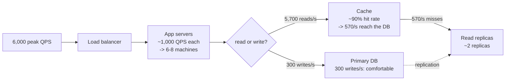

# Day 097 · System Design — What scale actually means, in numbers

**After today you can:** You stop saying millions of users and start saying requests per second.

**The interviewer asks it as:** *This app has ten million users. What is the read QPS?*

---

## 1. What this is, and why they ask it

**QPS** stands for *queries per second* — the number of requests arriving at your system each second. It
is the only number that decides how many machines you need, and "ten million users" does not tell you
what it is.

Three sentences. A user count is a **stock**; a request rate is a **flow**, and you get from one to the
other by asking how often each user does something. Every capacity decision in system design — how many
servers, how big a database, whether you need a cache — is downstream of a rate, never of a total. And
the arithmetic to get there is four multiplications you can do in your head.

They ask it because this is the exact point where the interview changes from vague to concrete. A
candidate who says "we'll need to scale horizontally because there are a lot of users" has said nothing.
A candidate who says "ten million daily users at twenty requests each is two hundred million a day,
which is about 2,300 a second average and maybe 7,000 at peak — so roughly ten application servers and
one database with read replicas" has just designed the system's shape in twenty seconds, and every later
decision now has a number behind it.

This is the first day of the scaling phase, and every day after it uses these numbers.

---

## 2. The story

Ganesh had catered about four hundred weddings and he had one rule he would not bend: he did not accept
a booking until somebody told him a number.

The father of the bride sat across from him in November and said it would be a big gathering. Ganesh
asked how many. The man said, you know, the whole family, plus my colleagues, plus her mother's side.
Ganesh asked again how many, and the man said maybe four hundred, maybe five.

Ganesh wrote down five hundred and said that was the figure they were both agreeing to now, in
November, because in February it would be too late to agree to anything.

Then he asked the question that the man had not been expecting, which was about time.

He said, five hundred people is not the problem. Five hundred people eating over two hours is one
problem and five hundred people eating in twenty-five minutes is a completely different one, and they
need different kitchens. When is the muhurtham?

Half past eleven.

Then they will all come to eat at once, Ganesh said, between twelve and half past. Not spread out. In
about thirty minutes I have to serve five hundred people, which is roughly seventeen a minute, which
means I need six counters, not three, and I need the rice to be coming out of the kitchen continuously
from half past eleven rather than being cooked at twelve.

Then he did the rest of it aloud while the man watched. Five hundred people, three sweets each because
people take more than they eat, that is fifteen hundred pieces. Two hundred grams of rice per head is a
hundred kilos, and he always made a hundred and twenty because running out of rice at a wedding is the
one thing nobody forgets. Curd, one small cup each, five hundred cups, and they come in trays of fifty,
so ten trays.

The man said he had been to weddings where the food ran out.

Ganesh said yes, and it was never because somebody had cooked too little for five hundred people. It
was because they had cooked exactly enough for five hundred people, spread over two hours, and then
everybody arrived at the same time.

---

## 3. The idea in plain English

Ganesh does back-of-the-envelope estimation, and he does the two things candidates forget: he converts a
total into a **rate**, and he multiplies that rate by a **peak factor**.

### Stock and flow

- **Stock** is a total: five hundred guests, ten million users, fifty million photos.
- **Flow** is a rate: seventeen guests a minute, 2,300 requests a second, 600 uploads a second.

**Servers are sized by flow. Storage is sized by stock.** Almost every wrong answer in a system design
interview comes from using one where the other belongs.

### The words, defined

- **DAU** — daily active users. People who use the product on a given day.
- **MAU** — monthly active users. Usually three to five times DAU for a consumer app; a DAU/MAU ratio
  above 0.5 is exceptional and means people open it every day.
- **QPS** — queries per second. Requests arriving per second, averaged over the day.
- **Peak QPS** — the rate at the busiest moment. **Two to three times average for a global product**,
  and much higher for anything with a scheduled event: a ticket sale, a match, a results announcement.
- **Read:write ratio** — how many reads there are per write. **This single number decides whether you
  need a cache**, and for social products it is between 10:1 and 1000:1.
- **Latency** — how long one request takes. Always quoted as a percentile, never as an average.

### The conversion, which is one division

```
 seconds in a day  =  24 × 60 × 60  =  86,400
```

**Round it to 100,000.** Every estimate in an interview is approximate anyway, and dividing by 100,000
is moving a decimal point. It makes your answer about 15 percent low, which nobody minds and everybody
notices you did deliberately.

```
 1 million requests per day    ≈  10 per second
 100 million per day           ≈  1,000 per second
 1 billion per day             ≈  10,000 per second
```

**Memorise those three lines.** They convert almost any daily figure in one step.

### The four multiplications

Given "ten million users", you produce every number an interviewer wants with four multiplications.

```
 1.  DAU × actions per user per day        =  requests per day
 2.  requests per day ÷ 100,000            =  average QPS
 3.  average QPS × peak factor             =  peak QPS
 4.  writes per day × bytes per record     =  storage per day
```

Worked, out loud:

```
 10,000,000 DAU × 20 actions       =  200,000,000 requests/day
 200,000,000 ÷ 100,000             =  2,000 QPS average
 2,000 × 3                         =  6,000 QPS peak
 writes are 5% of that: 100 QPS average, 300 peak
 10,000,000 writes/day × 1 KB      =  10 GB/day  =  3.65 TB/year
```

**Thirty seconds, five numbers, and the shape of the system is decided.** That is the skill.

### What one machine can actually do

Numbers are useless without something to compare them to. These are the ones to carry:

```
 a plain application server, simple request        1,000 - 5,000 QPS
 the same, doing real work per request               200 - 1,000 QPS
 one relational database, simple indexed read      5,000 - 15,000 QPS
 one relational database, writes                     500 -  5,000 QPS
 Redis, single instance                          100,000 +      ops/s
 one machine's network                            ~1 GB/s (10 Gbps link)
 one SSD                                       ~500 MB/s, ~50,000 IOPS
```

So `6,000` peak QPS is **a handful of application servers and one database**, and saying that is the
whole point of having done the arithmetic.

### Latency, and why the average is a lie

```
 memory read (L1 cache)                         ~1 nanosecond
 main memory read                             ~100 nanoseconds
 SSD random read                               ~100 microseconds
 network round trip, same datacentre            ~0.5 milliseconds
 network round trip, same continent              ~30 milliseconds
 network round trip, across the world           ~150 milliseconds
 spinning disk seek                              ~10 milliseconds
```

Two things fall out of that table, and both come up in every interview.

**Memory is roughly a thousand times faster than an SSD, and an SSD is roughly a hundred times faster
than a cross-continent hop.** That is why caching works and why it is always the first thing you reach
for.

**And you cannot beat the speed of light.** Mumbai to New York is about 12,000 km; light in fibre goes
roughly 200,000 km per second, so one way is 60 ms and a round trip is 120 ms before any computer does
anything at all. **That is why content delivery networks exist** — no amount of server optimisation can
fix distance.

### Percentiles, not averages

```
 p50  — half of requests are faster than this. The typical experience.
 p95  — 1 request in 20 is slower. What your unlucky users see.
 p99  — 1 in 100. What your busiest users see, constantly.
```

**A user who makes 100 requests loading one page will hit their p99 on almost every page load.** That is
why p99 is the number that gets quoted, and why "our average latency is 50 ms" is a claim that hides a
p99 of two seconds.

---

## 4. The picture

The conversion ladder. This is the diagram to reproduce from memory.

```
     USERS  (a stock)                      10,000,000 DAU
        |
        |  × actions per user per day (ask! typical: 10-50)
        v
   REQUESTS PER DAY                       200,000,000
        |
        |  ÷ 100,000   (86,400 rounded — say you are rounding)
        v
   AVERAGE QPS  (a flow)                        2,000
        |
        |  × peak factor (2-3× normally; 10×+ for a scheduled event)
        v
   PEAK QPS                                     6,000
        |
        +---------------------------+
        |                           |
        v                           v
   × read share (95%)         × write share (5%)
   READ QPS  5,700            WRITE QPS  300
        |                           |
        v                           v
   -> cache, read replicas    × bytes per record
                              -> STORAGE PER DAY -> per year
```

Where the load actually lands:



What to notice: **the cache turns 5,700 reads a second into 570.** That is the entire reason a cache is
the first thing you add — and it is a number, not an opinion. Without it you would need six or seven
read replicas; with it you need two.

The orders of magnitude, drawn on one line so the gaps are visible:

```
 1 ns        100 ns        100 µs        0.5 ms       30 ms        150 ms
  |------------|-------------|-------------|-----------|-------------|
 L1        main memory      SSD        same DC     same       across the
 cache                      read     round trip   continent      world

 |<--- 100x --->|<-- 1,000x -->|<-- 5x -->|<-- 60x -->|<-- 5x -->|

 memory -> SSD                 is about 1,000x
 SSD -> across the world       is about 1,500x
 memory -> across the world    is about 1,500,000x
```

**Every caching and placement decision in the whole course is explained by that line.**

---

## 5. How it actually works

### The six-step estimation, in order

Do these in this order, out loud, every time. It takes about three minutes.

**Step 1 — get a number, and say you are assuming it.**
"You said ten million users. I will assume that is daily active, not registered — and if it is
registered, daily active is usually ten to twenty percent of that, so a million, and every number below
divides by ten."

**Never proceed on 'a lot of users'.** Pick a number, say it is an assumption, and continue.

**Step 2 — actions per user per day.** This is the number you have to reason about rather than look up.

```
 a messaging app       30-100 messages sent + far more read
 a social feed         10-20 opens, each loading 20 items
 an e-commerce app     5-10 page views, 0.05 orders
 a ride-hailing app    0.3 rides, but ~120 location updates per active ride
 a video service       2-4 sessions, plus continuous streaming
```

Say where the number came from: "I will assume twenty actions a day, which is a user opening the app
three or four times and doing a few things each time."

**Step 3 — convert to QPS.** Divide by 100,000. Say "I am rounding 86,400 to a hundred thousand."

**Step 4 — apply a peak factor.** Three, normally. Then ask whether the product has a *spike* shape:

```
 always-on global product        peak ≈ 2-3× average
 single-country consumer app     peak ≈ 3-5× (evenings)
 ticket sales, exam results      peak ≈ 100-1,000× for a few minutes
 live sport, an election         peak ≈ 50-100×
```

**The spike case changes the architecture, not just the machine count.** A system that has to absorb a
thousand times its average for two minutes needs a queue, not more servers.

**Step 5 — split reads from writes.** Ask for the ratio, or assume it and say so.

```
 social feed / news        100:1 to 1000:1 reads to writes
 messaging                 ~1:1 (roughly one read per message sent, in a 1-1 chat)
 e-commerce browse/buy     ~200:1
 analytics ingestion       write-heavy, sometimes 1:100 the other way
```

**This ratio is the single most useful number in the interview**, because it tells you whether to reach
for a cache and read replicas or for sharding and a write-optimised store.

**Step 6 — storage.** Stock, not flow.

```
 records per day × bytes per record  =  bytes per day
 × 365                               =  bytes per year
 × replication factor (usually 3)    =  bytes actually stored
```

**Do not forget the replication factor.** Three copies is the default in almost every distributed store,
so your 3.65 TB of data occupies about 11 TB of disk. Candidates who mention it unprompted stand out.

### A full worked example: a photo-sharing app

Do this out loud in under three minutes.

```
 GIVEN:  100 million daily active users

 1. Reads
    each user opens the feed 5 times a day, 20 photos per feed
    100M × 5                      =    500,000,000 feed loads/day
    500M ÷ 100,000                =          5,000 QPS average
    × 3 peak                      =         15,000 QPS peak
    photo fetches: × 20           =        300,000 image requests/s at peak
                                              ^^^ this is a CDN's job, not a server's

 2. Writes
    each user uploads 0.2 photos a day
    100M × 0.2                    =     20,000,000 uploads/day
    20M ÷ 100,000                 =            200 QPS average
    × 3                           =            600 QPS peak

 3. Read:write ratio
    500,000,000 : 20,000,000      =           25:1
    -> read-heavy: cache the feed, replicate the database

 4. Storage
    photo, compressed             =          2 MB
    plus 3 thumbnail sizes        =       ~0.3 MB
    20M uploads × 2.3 MB          =          46 TB/day
    × 365                         =      16,790 TB/year  ≈  16.8 PB/year
    × 3 replicas                  =        ~50 PB/year
                                              ^^^ object storage, never a database

    metadata row (id, user, caption, timestamps, geo)   ≈ 500 bytes
    20M × 500 B                   =          10 GB/day
    × 365                         =         3.6 TB/year   <- this fits in one database

 5. Bandwidth
    outbound at peak: 300,000 image requests/s × 200 KB (thumbnail)
                                  =         60 GB/s
    ÷ 1 GB/s per machine's link   =         60 machines' worth of network
                                              ^^^ which is exactly what a CDN is
```

**The two conclusions fall straight out of the arithmetic**, and they are the answer to the question:
photos go to object storage behind a CDN, and metadata goes in a database that is not large by modern
standards. Nobody needed an opinion.

### Where these numbers come from in the real world

- **Twitter** disclosed around 6,000 tweets per second average and 143,000 at peak (a 2013 spike during
  a television broadcast) — a 24× peak factor for an event, which is why the event case is worth calling
  out separately.
- **WhatsApp** ran roughly 2 million connections per server on tuned FreeBSD boxes, which is the number
  people quote when arguing that connection counts and request counts are different problems.
- **Amazon** reported that every 100 ms of added latency cost about 1 percent of sales, and **Google**
  found that half a second of extra delay reduced traffic by 20 percent. That is why latency budgets are
  treated as product requirements rather than engineering preferences.
- The **latency table** above descends from Jeff Dean's "numbers every programmer should know". The
  original figures are from 2009; SSDs and networks have improved, and the *ratios* — which are what
  matter — have not.

---

## 6. The numbers

### The reference table to memorise

```
 seconds in a day             86,400          -> round to 100,000
 seconds in a month           2,600,000       -> round to 2.5 million
 seconds in a year            31,500,000      -> round to 30 million

 1 million/day                ≈       10 QPS
 100 million/day              ≈    1,000 QPS
 1 billion/day                ≈   10,000 QPS

 1 KB × 1 million             =    1 GB
 1 KB × 1 billion             =    1 TB
 1 MB × 1 million             =    1 TB
 1 MB × 1 billion             =    1 PB
```

**That last block is the one that saves you.** "A billion records of a kilobyte each" is one terabyte,
and you should be able to say it without pausing.

### Typical record sizes

```
 a tweet / short post              ~300 bytes    (text + ids + timestamps)
 a database row with 10 columns    ~500 bytes - 1 KB
 a chat message                    ~200 bytes
 a log line                        ~200 - 500 bytes
 a JSON API response               ~2 - 20 KB
 a web page, total                 ~2 MB
 a compressed photo                ~1 - 5 MB
 a minute of 1080p video           ~50 MB
```

### What things cost, roughly

```
 cloud object storage              ~₹1.7 per GB-month
 cloud block storage (SSD)         ~₹8 per GB-month
 outbound bandwidth                ~₹7 per GB
 a mid-size application server     ~₹8,000 - 15,000 per month
 a managed database instance       ~₹25,000 - 200,000 per month
```

The one that surprises people: **bandwidth is usually more expensive than storage.** Serving 60 GB/s of
images is a bandwidth bill, not a disk bill, and that is a large part of why CDNs exist commercially as
well as technically.

### The conversions worth having automatic

```
 peak factor                       ×3 by default; say when you think it is more
 replication factor                ×3 by default
 DAU from registered users         ~10-20%
 MAU to DAU                        ÷3 to ÷5
 cache hit rate, well-chosen key   90-95%
 compression on text               ~3-5×
```

### An availability table, since it always comes up

```
 99%       "two nines"     3.65 days of downtime per year
 99.9%     "three nines"   8.8 hours per year
 99.99%    "four nines"    53 minutes per year
 99.999%   "five nines"    5.3 minutes per year
```

**Four nines means you may be down for less than an hour in a whole year**, which is why it costs so
much more than three. Being able to convert nines to minutes on the spot is a small, reliable signal.

---

## 7. The trade-offs

### Estimating is not the same as being right

The purpose of these numbers is **to decide the shape of the design**, not to be accurate. Six thousand
QPS and nine thousand QPS lead to the same architecture; six thousand and six million do not.

**Round aggressively and say that you are.** "I am rounding 86,400 to a hundred thousand, so this is
about fifteen percent low, and that does not change the answer." That sentence buys you both speed and
credibility.

### Averages hide everything that matters

Ganesh's whole point. Five hundred people over two hours and five hundred people in thirty minutes need
different kitchens, and the average — 250 an hour — describes neither.

The same is true of latency. **Report p99, and design for peak, not for average.** A system sized for
average QPS falls over every evening.

### When the peak factor is the design

A 3× peak is a machine-count question. A 500× peak is an architecture question, and they are not the
same conversation:

```
 exam results published at 10 a.m.
   normal traffic                          500 QPS
   at 10:00:00                         250,000 QPS for about 90 seconds
```

You do not buy 250 times the servers for ninety seconds. **You put a queue in front, you serve a
pre-computed static file from a CDN, and you accept that some requests wait.** Recognising which kind of
peak you have is more valuable than the arithmetic itself.

### Where the estimate misleads

- **Fan-out multiplies writes invisibly.** A celebrity with 50 million followers posting once is one
  write to you and 50 million to the feed system. The user-facing rate says nothing about it, and it is
  the single biggest trap in estimating a social product.
- **Connections are not requests.** A chat app with a million idle users has a million open connections
  and almost no QPS. Memory per connection, not CPU per request, is the constraint — which is why
  WhatsApp's number is about connections.
- **Storage grows and never shrinks.** QPS is roughly flat if usage is flat; storage accumulates for
  ever. Always quote storage per year, and always ask about retention.
- **The 80/20 of data is real.** Ninety percent of reads hit a few percent of the data. That is what
  makes a 90 percent cache hit rate achievable on a small cache, and assuming a uniform distribution
  makes caching look much worse than it is.

---

## 8. In the interview

### How it gets asked

- Directly: *"This app has ten million users. What is the read QPS?"*
- As the opening move of any design: *"Before we design it, give me some rough numbers."*
- As a probe: *"How many servers do you need?"* / *"How much storage in a year?"*
- As a trap: *"Would a single database handle this?"* — they want to know if you can compare your number
  against a machine's capacity.
- As a follow-up: *"What is your p99 latency budget for this endpoint?"*

### What to say out loud, in the first ninety seconds

1. **Turn the stock into a flow, and name the assumption.** "Ten million — I will assume that is daily
   active. Each user does about twenty actions a day, so two hundred million requests a day."
2. **Convert, and say you are rounding.** "There are 86,400 seconds in a day and I will round that to a
   hundred thousand, so about two thousand QPS on average."
3. **Peak it.** "Peak is two to three times average for a product used all day, so call it six thousand
   QPS. If there is a scheduled event in this product, that number is completely different and I would
   want to know."
4. **Split reads and writes.** "What is the read-to-write ratio? If it is a feed, I would assume
   something like fifty to one — so 5,900 reads a second and 120 writes."
5. **Compare against a machine.** "One application server handles roughly a thousand QPS of real work,
   so six to eight machines. One database handles maybe ten thousand simple reads a second, so with a
   cache in front, one primary and a couple of replicas."
6. **Then storage, separately.** "Ten million writes a day at a kilobyte each is 10 GB a day, 3.6 TB a
   year, and with three replicas about 11 TB on disk."

### The follow-ups

**"Where did your peak factor come from?"**
"Two to three times average is the normal shape for a product used throughout the day — traffic follows
waking hours, and if the users are in one country it is more pronounced, maybe three to five times in
the evening. But the factor depends entirely on whether the product has a **scheduled** event. Ticket
sales, exam results, a live match — those are hundreds of times average for a few minutes, and that is
not a bigger-servers problem, it is a different architecture: a queue in front, pre-computed responses
served from a CDN, and admitting that some requests will wait. So I would ask you which shape this is,
because it changes the design rather than the machine count."

**"Would a single database handle this?"**
"Let us compare. One well-provisioned relational database handles roughly five to fifteen thousand
simple indexed reads a second, and something like five hundred to five thousand writes a second
depending on how much index maintenance each write causes. My estimate was 5,900 reads and 120 writes at
peak. The writes are comfortable. The reads are borderline on their own — but with a cache at even a
ninety percent hit rate, only 590 reach the database, which is very comfortable. So yes, one primary
plus a cache, and I would add read replicas as headroom rather than necessity. If the write rate were
five thousand a second I would be having a completely different conversation, about sharding."

**"How much storage in a year?"**
"Depends on which data. Metadata and media are different problems and I would separate them. Twenty
million uploads a day, with a metadata row of about five hundred bytes, is 10 GB a day and 3.6 TB a year
— that fits comfortably in one database. The media is 2 MB a photo plus thumbnails, so 46 TB a day and
about 17 petabytes a year, and with three-way replication around 50 petabytes. That obviously does not
go in a database; it goes in object storage like S3, with the database holding only the key. And I would
ask about retention, because storage is the one number that only ever goes up."

**"What is a good p99 target?"**
"For a user-facing read, I would aim for under 200 milliseconds at p99 for the server portion, because
the perceptual threshold where an interaction stops feeling instant is around 100 to 200 milliseconds
and the network is already spending some of that. I would quote p99 rather than the average
deliberately: a page that makes a hundred requests will hit its p99 on nearly every load, so the p99 is
the *typical* page experience, not the rare one. And I would ask whether this endpoint is on the
critical path, because a background write can happily take a second and nobody notices."

**"Why do you keep dividing by a hundred thousand?"**
"Because it is 86,400 rounded, and every input to this calculation is an assumption anyway. Rounding up
makes my QPS about fifteen percent low, which never changes the architecture — the difference between
2,000 and 2,300 QPS is nothing, and the difference between 2,000 and 200,000 is everything. I say I am
rounding so it is clearly a choice. The three lines I actually carry are: a million a day is ten a
second, a hundred million a day is a thousand a second, a billion a day is ten thousand a second."

**"Your users are in India and your servers are in Virginia. What does that cost you?"**
"About 200 milliseconds of round trip before anything computes, and there is no way to engineer it away
— it is distance. Light in fibre travels around 200,000 kilometres a second, so 13,000 kilometres is 65
milliseconds each way, and real routes are not straight lines. If the page makes several sequential
requests, that multiplies. The fixes are all about placement rather than speed: put static content and
media on a CDN with edge locations in India, put a read replica or a full regional deployment closer to
the users, and reduce the number of round trips the client needs. This is the one performance problem
that no amount of faster code solves."

### A model answer

Asked: *this app has ten million users. What is the read QPS?*

> "Let me convert that into a rate, because a user count on its own does not size anything.
>
> First, an assumption I want to state: I am taking ten million as **daily active** users. If that is
> registered users instead, daily active is usually ten to twenty percent of it, so a million, and every
> number I am about to give divides by ten.
>
> Next, actions per user per day. For a feed-shaped product I would assume each person opens it three or
> four times and does a handful of things each time — call it twenty requests a day. So ten million times
> twenty is **two hundred million requests a day**.
>
> There are 86,400 seconds in a day and I am going to round that to a hundred thousand, which makes the
> arithmetic a decimal shift and my answer about fifteen percent low — that does not change any decision.
> Two hundred million divided by a hundred thousand is **two thousand QPS on average**.
>
> Average is not what you size for. For a product used throughout the day, peak is two to three times
> average, so I will design for **six thousand QPS**. I would want to check one thing though: does this
> product have a scheduled event — a sale, a results announcement, a live match? Because that is not a
> three-times peak, it is a hundred-times peak for a couple of minutes, and that is a queue-and-CDN
> problem rather than a more-servers problem.
>
> Then reads against writes. For a feed I would assume something like fifty to one, so about **5,900
> reads a second and 120 writes a second at peak**. That ratio is the most useful number here, because it
> is what tells me this is a caching problem and not a sharding problem.
>
> Now I can compare against what machines actually do. One application server handles roughly a thousand
> requests a second of real work, so **six to eight app servers** with headroom. One relational database
> does five to fifteen thousand simple indexed reads a second, so 5,900 is borderline alone — but a cache
> at a ninety percent hit rate takes it to **590 reaching the database**, which is very comfortable. One
> primary, a couple of read replicas, and a cache in front.
>
> And storage separately, because that is a stock rather than a flow: if writes are ten million a day at
> about a kilobyte each, that is 10 GB a day, **3.65 TB a year**, and roughly 11 TB once you count three
> replicas. If there is media involved, that number changes by three orders of magnitude and belongs in
> object storage behind a CDN rather than in the database."

---

## 9. Recall card

- **A user count is a stock; QPS is a flow. Servers are sized by flow, storage by stock.** Four
  multiplications get you there: **DAU × actions/day = requests/day; ÷ 100,000 = average QPS; × 3 =
  peak QPS; writes/day × bytes = storage/day.** Round 86,400 to **100,000** and say you are rounding.
- **The three conversions to carry: 1 million/day ≈ 10 QPS · 100 million/day ≈ 1,000 QPS · 1 billion/day
  ≈ 10,000 QPS.** And for storage: **1 KB × 1 billion = 1 TB; 1 MB × 1 billion = 1 PB.**
- **Compare against what one machine does**, or the numbers mean nothing: app server **~1,000 QPS**,
  relational DB **~10,000 simple reads/s** and **~1,000 writes/s**, Redis **100,000+ ops/s**, one
  network link **~1 GB/s**. Then **6,000 peak QPS = 6–8 app servers + one DB with a cache.**
- **Peak factor is 2–3× normally — but 100×+ for a scheduled event, and that changes the architecture,
  not the machine count** (queue in front, pre-computed responses on a CDN). **Always multiply storage
  by a replication factor of 3.** And **the read:write ratio is the most useful single number**: high
  means cache and replicas, low means sharding and write-optimised stores.
- **Memory ≈ 1,000× faster than SSD; SSD ≈ 1,500× faster than a cross-world round trip.** Mumbai↔New
  York is **~200 ms of pure distance** that no code can remove — which is what CDNs are for. Quote
  **p99, never the average**: a page making 100 requests hits its p99 on nearly every load. And
  **99.99% availability is 53 minutes of downtime a year.**
