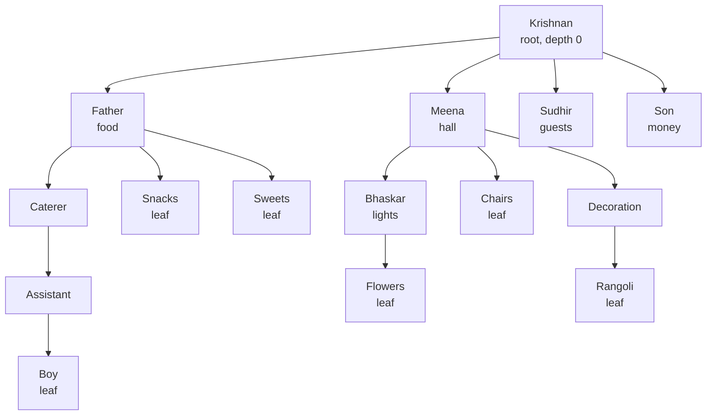

# Day 098 · DSA — What a tree is, and the vocabulary you need

**After today you can:** You can use root, leaf, height, depth, parent and subtree correctly and without hesitation.

**The interviewer asks it as:** *What is the height of this tree? What is the depth of that node?*

---

## 1. What this is, and why they ask it

A **tree** is a way of arranging things where each item has one thing above it and any number of things
below it, and there are no loops. One item at the very top has nothing above it.

Three sentences. Everything you have stored so far has been **linear** — a list, a string, a stack, a
queue — where each item has at most one thing before it and one thing after it. A tree is the first
structure where an item can have *several* things after it, and that single change is what makes
searching a million items cost twenty steps instead of a million. And the reason a tree can do that is
that it has no cycles: from the top, there is **exactly one path** to any item.

They ask about the vocabulary directly, and they ask early, because the rest of the topic is unusable
without it. **Height and depth are the two that get confused**, and confusing them in the first minute
of a tree question makes every sentence afterwards ambiguous. An interviewer who hears "the depth of
the tree" when you mean the height will start checking whether you know the difference, and you will
spend the round proving vocabulary instead of solving the problem.

This is the first day of fifteen on trees. Everything in the next two weeks — traversals, balance,
binary search trees, tries, heaps — is this shape with rules added.

---

## 2. The story

The wedding was in April and there were eleven days of work before it, and Ravi's uncle Krishnan took
charge of all of it the way he had for every wedding in that family since 1994.

He did not do any of it himself. What he did was sit in the front room with a cup of tea and give four
people a job each.

Food went to Ravi's father. The hall and everything in it went to Meena aunty. Guests — that is,
receiving them, feeding them, putting the outstation ones somewhere — went to Ravi's cousin Sudhir.
Money went to Krishnan's own son, because money always goes to your own son.

Then each of those four did the same thing.

Ravi's father did not cook. He gave the main meals to the caterer, the coffee and snacks to two of the
younger cousins, and the sweets to a woman in the next street who had made the sweets for four weddings
already. Meena aunty split hers into the decoration, the chairs and the lights, and gave each one to
somebody.

By the fourth day, if you stood in that front room, you could ask any question and get an answer in
about a minute, and the way it worked was always the same. You asked Krishnan. He said, that is
Meena's. You asked Meena. She said, lights, that is Bhaskar. You asked Bhaskar, and Bhaskar actually
knew, because Bhaskar was standing on a ladder holding the lights.

There were two things Ravi noticed that week.

The first was that everybody had exactly one person above them. Nobody was working for two people.
When somebody tried it — one of the cousins doing both snacks and chairs — there was a whole argument
about who he had to tell when he went home, and it was sorted out by giving the chairs to somebody
else.

The second was about counting. Somebody asked how many steps it took to get from Krishnan to the man
tying the flowers, and the answer was three: Krishnan, Meena, Bhaskar, flowers. And then somebody else
asked a different question — what is the longest chain anywhere in this whole arrangement — and that
was four, through the food side, because the caterer had his own assistant and his assistant had a boy.

Two different questions. Everybody kept answering the second one when they had been asked the first.

---

## 3. The idea in plain English

Krishnan has built a tree, and every word in the topic is in that front room.

- Krishnan is the **root** — the one item with nothing above it. A tree has exactly one.
- Everybody else has exactly one person above them: their **parent**.
- The people directly below someone are their **children**. Children of the same parent are
  **siblings**.
- Bhaskar on the ladder has nobody below him. He is a **leaf** — an item with no children.
- The line from Krishnan down to anybody is a **path**, and there is exactly one such path to each
  person. That is what "no loops" buys you.
- Meena and everybody under her, taken together, is a **subtree**. Every item in a tree is the root of
  its own subtree, and that fact is why almost every tree function is recursive.
- The connection between a parent and a child is an **edge**.

### Depth and height, which are the two questions from the story

**Depth is measured downwards from the root. Height is measured upwards from the lowest leaf.**

```
 depth of a node   = the number of edges from the ROOT to that node
                     (the root has depth 0)

 height of a node  = the number of edges on the LONGEST path from that node
                     down to a leaf
                     (a leaf has height 0)

 height of a TREE  = the height of its root
```

Say them as sentences until they stick:

- **Depth is about a node.** "How far down is this one?" Every node has its own depth.
- **Height is about the deepest thing below.** "How far does it go from here?" A leaf's height is 0
  whatever its depth.
- **The height of the tree is the height of the root**, which equals the largest depth in the tree.

**The most common error is off by one, and it comes from counting nodes instead of edges.** The
convention in interviews, and on LeetCode, is:

```
 a single node alone:   height 0 by the EDGE count
                        height 1 by the NODE count
```

**Both conventions exist and both are used.** LeetCode's *Maximum Depth of Binary Tree* counts **nodes**
and answers 1 for a single node. The textbook definition counts **edges** and answers 0. The safe move
is one sentence: *"I will count edges, so a single node has height zero — tell me if you want the node
count and I will add one."* That sentence takes four seconds and removes the entire class of off-by-one
arguments.

### The rest of the vocabulary, defined once

- **Level** — all the nodes at the same depth. The root is level 0. "Level order" means one whole level
  at a time.
- **Ancestor** — anybody on the path from a node up to the root. Krishnan is an ancestor of the flower
  man.
- **Descendant** — anybody in your subtree.
- **Degree** — how many children a node has.
- **Internal node** — a node that is not a leaf.
- **Forest** — a collection of trees. What you get if you delete the root.

### The two facts that are always true

**One: a tree with `n` nodes has exactly `n − 1` edges.**

Every node except the root has exactly one edge going up to its parent. That is the whole proof, and it
is worth being able to say in one line.

**Two: there is exactly one path between any two nodes.** More than one path would be a loop, and a loop
is what makes something not a tree. This is why you never need a `visited` set when walking down a tree
from the root — unlike a graph, where you always do.

### Binary trees

A **binary tree** is a tree where **every node has at most two children**, called `left` and `right`.
The two are distinguishable: a node with only a right child is a different tree from a node with only a
left child, even though both have one child.

That restriction is what makes trees usable in code, because a node becomes a fixed-size object:

```python
class TreeNode:
    def __init__(self, value: int) -> None:
        self.value = value
        self.left: "TreeNode | None" = None
        self.right: "TreeNode | None" = None
```

Almost every interview tree is a binary tree, and [tomorrow](../day-099-binary-trees-in-code/README.md)
is entirely about writing them.

The named shapes, which come up in the same breath as balance:

```
 FULL       every node has 0 or 2 children — never exactly 1
 COMPLETE   every level filled except possibly the last, which fills LEFT to right
 PERFECT    every level completely filled; 2^h+1 - 1 nodes for height h
 BALANCED   the left and right heights differ by at most 1, at every node
 DEGENERATE every node has one child — a linked list wearing a hat
```

**Complete is the one that matters most**, because it is the shape that lets a tree live in an array
with no pointers at all, which is the [heap](../day-113-the-heap/README.md).

### Why any of this matters

```
 a linked list of 1,000,000 items:  up to 1,000,000 steps to find something
 a balanced tree of 1,000,000:      about 20 steps
```

Because each step down a balanced binary tree can halve what is left. **20 is `log₂(1,000,000)`.** That
is the entire reason trees exist, and it only holds while the tree is balanced — a degenerate tree is a
linked list and gives you the million back. That tension is [day 109](../day-109-balanced-trees/README.md).

---

## 4. The picture

Krishnan's wedding, drawn as a tree.



What to notice: **every node has exactly one arrow coming into it, except Krishnan.** That is what makes
it a tree rather than a general graph, and it is what the cousin doing both snacks and chairs broke.

The same tree with the two measurements marked:

```
                          Krishnan            depth 0    height 4
                         /   |    |   \
                     Father Meena Sudhir Son  depth 1    Father height 2
                      / | \    |  \   \                  Meena  height 2
              Caterer Sn Sw  Dec Ch Lights   depth 2      Sudhir height 0
                   |            |     |
              Assistant      Rangoli Flowers depth 3      Caterer height 2
                   |
                 Boy                          depth 4     Boy height 0

 DEPTH of Flowers  = 3      (Krishnan -> Meena -> Lights -> Flowers: 3 edges)
 HEIGHT of Meena   = 2      (Meena -> Lights -> Flowers: 2 edges to the deepest leaf)
 HEIGHT of the tree = 4     (the longest chain anywhere: Krishnan -> Father ->
                             Caterer -> Assistant -> Boy)

 the two questions in the story:
   "how many steps from Krishnan to the flower man?"  -> a DEPTH question -> 3
   "what is the longest chain anywhere?"              -> a HEIGHT question -> 4
```

**Depth is a property of one node. Height is a property of a node and everything under it.** They are
equal only for the root, and even then only because the height of the root is the maximum depth.

The two conventions, side by side, so the off-by-one never surprises you:

```
        A                edges     nodes
       / \               ------    -----
      B   C     height(A)   2        3
     /                height(B)  1        2
    D                 height(D)  0        1
                      depth(D)   2        2   <- depth is the same either way,
                                                because the root is 0 either way
```

And the shapes:

```
 PERFECT (h=2)        COMPLETE            FULL                DEGENERATE
      o                    o                 o                     o
    /   \                /   \             /   \                    \
   o     o              o     o           o     o                    o
  / \   / \            / \   /           / \                          \
 o   o o   o          o   o o           o   o                          o
                                                                        \
 7 nodes = 2^3-1     last level fills   every node has 0    every node has 1
 all leaves same     LEFT to right      or 2 children       child: a list
 depth                                                      height = n-1
```

---

## 5. The code, built step by step

### Step 1 — the node

```python
class TreeNode:
    def __init__(self, value: int) -> None:
        self.value = value
        self.left: "TreeNode | None" = None
        self.right: "TreeNode | None" = None
```

Four lines, and that is the whole data structure. **A tree is not an object — it is a reference to its
root node.** A function that takes "a tree" takes a `TreeNode | None`, and `None` is the empty tree.

### Step 2 — the shape every tree function takes

```python
    def something(node):
        if node is None:
            return <the answer for an empty tree>
        left = something(node.left)
        right = something(node.right)
        return <combine left, right and node.value>
```

**Every function in the next fifteen days is that shape.** The base case is `None`, the recursion is on
the two children, and the work is in the combining step. Write those five lines first, every time, and
then fill in the two blanks.

Why it is always recursive: **every child is itself the root of a subtree**, so the question you are
asking about the tree is exactly the question you ask about each child. That is the
[leap of faith](../day-087-recursion-leap-of-faith/README.md), and trees are where it feels natural for
the first time.

### Step 3 — height, which is the base case that catches people

```python
    def height(node) -> int:
        if node is None:
            return -1                       # EDGE convention: empty tree is -1
        return 1 + max(height(node.left), height(node.right))
```

**`-1` for the empty tree, not `0`.** Then a single leaf is `1 + max(-1, -1) = 0`, which is correct for
the edge convention. If you return `0` for `None`, you get the node count instead — which is also a
valid convention, and is what LeetCode's *Maximum Depth* wants. **Pick one, say which, and be
consistent.**

### Step 4 — depth needs something height does not

Height is computed by looking *down*, so a node can compute it alone. Depth is measured from the root,
so a node cannot know its own depth — **the information has to be carried down from above**.

```python
    def depth_of(node, target, current_depth=0):
        if node is None:
            return -1                       # not found on this branch
        if node is target:
            return current_depth
        ...
```

That difference — **height comes up from the children, depth goes down from the parent** — is the single
most useful structural idea in the whole topic. It reappears on
[day 102](../day-102-height-and-diameter/README.md) as "return one thing to the parent while tracking
another", and on [day 104](../day-104-tree-path-problems/README.md) as the return-value trick.

### Step 5 — counting, which is the same shape again

```python
    def count(node) -> int:
        if node is None:
            return 0
        return 1 + count(node.left) + count(node.right)
```

Base case `0`, combine by adding one for yourself. **Compare it with `height` and notice that only the
combining line changed** — `max` became `+`. That is what "every tree function is the same shape" means
in practice.

### The complete solution

```python
from collections import deque


class TreeNode:
    """A binary tree node. The whole data structure.

    A "tree" is just a reference to its root. `None` is the empty tree, and
    every function must handle it — it is the base case of everything.
    """

    def __init__(self, value: int,
                 left: "TreeNode | None" = None,
                 right: "TreeNode | None" = None) -> None:
        self.value = value
        self.left = left
        self.right = right

    def __repr__(self) -> str:
        return f"TreeNode({self.value})"


def height(node: TreeNode | None) -> int:
    """Edges on the longest downward path. A LEAF has height 0.

    The empty tree is -1, so that a leaf computes 1 + max(-1, -1) = 0.
    Returning 0 for None gives the NODE count instead — also valid, and what
    LeetCode 104 wants. Say which convention you are using.
    """
    if node is None:
        return -1
    return 1 + max(height(node.left), height(node.right))


def max_depth_nodes(node: TreeNode | None) -> int:
    """LeetCode 104's convention: count NODES, so a single node is 1.
    The only difference from `height` is the base case."""
    if node is None:
        return 0
    return 1 + max(max_depth_nodes(node.left), max_depth_nodes(node.right))


def count_nodes(node: TreeNode | None) -> int:
    """Same shape as height. Only the combining line differs: + instead of max."""
    if node is None:
        return 0
    return 1 + count_nodes(node.left) + count_nodes(node.right)


def count_leaves(node: TreeNode | None) -> int:
    """A leaf has no children. Note the empty tree is NOT a leaf."""
    if node is None:
        return 0
    if node.left is None and node.right is None:
        return 1
    return count_leaves(node.left) + count_leaves(node.right)


def count_edges(node: TreeNode | None) -> int:
    """Always exactly count_nodes - 1, for a non-empty tree. Every node except
    the root has exactly one edge going up to its parent."""
    n = count_nodes(node)
    return max(n - 1, 0)


def depth_of_value(node: TreeNode | None, target: int, depth: int = 0) -> int:
    """DEPTH is measured from the root, so it must be carried DOWN as an
    argument. Contrast with height, which is computed UP from the children.

    Returns -1 if the value is not in the tree.
    """
    if node is None:
        return -1
    if node.value == target:
        return depth
    left = depth_of_value(node.left, target, depth + 1)
    if left != -1:
        return left
    return depth_of_value(node.right, target, depth + 1)


def nodes_at_depth(node: TreeNode | None, want: int, depth: int = 0) -> list[int]:
    """Everything on one level. Depth carried down again."""
    if node is None:
        return []
    if depth == want:
        return [node.value]
    return (nodes_at_depth(node.left, want, depth + 1)
            + nodes_at_depth(node.right, want, depth + 1))


def levels(root: TreeNode | None) -> list[list[int]]:
    """Level by level, using a queue rather than recursion.

    The trick is to record the queue's length BEFORE the loop: that count is
    exactly one level, because nothing added inside the loop belongs to it.
    Day 101 is this idea in full.
    """
    if root is None:
        return []
    result: list[list[int]] = []
    queue = deque([root])
    while queue:
        level_size = len(queue)             # the boundary — capture it first
        level: list[int] = []
        for _ in range(level_size):
            node = queue.popleft()
            level.append(node.value)
            if node.left:
                queue.append(node.left)
            if node.right:
                queue.append(node.right)
        result.append(level)
    return result


def is_leaf(node: TreeNode | None) -> bool:
    return node is not None and node.left is None and node.right is None


def is_full(node: TreeNode | None) -> bool:
    """Every node has 0 or 2 children — never exactly 1."""
    if node is None:
        return True
    if (node.left is None) != (node.right is None):
        return False                        # exactly one child
    return is_full(node.left) and is_full(node.right)


def is_perfect(root: TreeNode | None) -> bool:
    """Every level completely filled: n == 2^(h+1) - 1."""
    return count_nodes(root) == 2 ** (height(root) + 1) - 1


def is_balanced(node: TreeNode | None) -> bool:
    """Left and right heights differ by at most 1, AT EVERY NODE.

    Written the obvious way, which is O(n^2) because height is recomputed at
    every node. Day 109 does it in one pass.
    """
    if node is None:
        return True
    if abs(height(node.left) - height(node.right)) > 1:
        return False
    return is_balanced(node.left) and is_balanced(node.right)


def ancestors_of(node: TreeNode | None, target: int,
                 trail: list[int] | None = None) -> list[int] | None:
    """Everybody on the path from the root down to `target`, exclusive.

    This is choose-recurse-un-choose from day 094, on a tree: append on the
    way down, pop on the way back up.
    """
    if node is None:
        return None
    if node.value == target:
        return list(trail or [])
    trail = trail if trail is not None else []
    trail.append(node.value)                        # choose
    found = (ancestors_of(node.left, target, trail)
             or ancestors_of(node.right, target, trail))
    trail.pop()                                     # un-choose
    return found


def build_sample() -> TreeNode:
    """Krishnan's wedding, with numbers instead of names.

              1                 depth 0
            /   \
           2     3              depth 1
          / \     \
         4   5     6            depth 2
        /
       7                        depth 3
    """
    return TreeNode(1,
                    TreeNode(2, TreeNode(4, TreeNode(7)), TreeNode(5)),
                    TreeNode(3, None, TreeNode(6)))


if __name__ == "__main__":
    root = build_sample()

    print(height(root), max_depth_nodes(root))          # 3 4  <- the two conventions
    print(height(None), max_depth_nodes(None))          # -1 0
    print(height(TreeNode(1)), max_depth_nodes(TreeNode(1)))   # 0 1

    print(count_nodes(root), count_edges(root))         # 7 6   <- always n-1
    print(count_leaves(root))                           # 3     (7, 5, 6)

    print(depth_of_value(root, 7))                      # 3
    print(depth_of_value(root, 3))                      # 1
    print(depth_of_value(root, 99))                     # -1

    print(nodes_at_depth(root, 2))                      # [4, 5, 6]
    print(levels(root))                                 # [[1], [2, 3], [4, 5, 6], [7]]

    print(is_full(root), is_perfect(root), is_balanced(root))   # False False False
    perfect = TreeNode(1, TreeNode(2, TreeNode(4), TreeNode(5)),
                          TreeNode(3, TreeNode(6), TreeNode(7)))
    print(is_full(perfect), is_perfect(perfect), is_balanced(perfect))  # True True True

    print(ancestors_of(root, 7))                        # [1, 2, 4]

    # a degenerate tree: a linked list wearing a hat
    chain = TreeNode(1, TreeNode(2, TreeNode(3, TreeNode(4))))
    print(height(chain), count_nodes(chain))            # 3 4   <- height = n-1
```

---

## 6. What it costs

### Every function in this lesson

```
 height, count_nodes, count_leaves, is_full     visit every node once   O(n)
 depth_of_value                                  worst case every node   O(n)
 nodes_at_depth                                  every node             O(n)
 levels (queue)                                  every node once        O(n)
 is_balanced, as written                         height at every node   O(n^2)
```

**`O(n)` is the default for a tree walk**, because there are `n` nodes and each is visited once. That is
the sentence to say. Anything worse than `O(n)` in a tree function means you are recomputing something,
and `is_balanced` above is the standard example — it calls `height` at every node, and `height` itself
walks a whole subtree.

```
 is_balanced on a balanced tree of n nodes:
   height() is called once per node
   each call walks that node's subtree
   -> total work = sum of subtree sizes = O(n log n) for a balanced tree
   -> O(n^2) for a degenerate one
```

Fixing that is [day 109](../day-109-balanced-trees/README.md), and the fix is the return-value trick:
compute the height and the balance in the same pass.

### Space

```
 recursion stack:   O(height)
   balanced tree of n nodes  -> O(log n)      n = 1,000,000 -> ~20 frames
   degenerate tree           -> O(n)          n = 1,000,000 -> 1,000,000 frames
 level-order queue: O(width)
   widest level of a perfect tree  =  n/2
```

**The stack depth is the height, not the node count** — and that is exactly why balance matters. On a
balanced tree, recursion is free. On a degenerate one:

```
 RecursionError: maximum recursion depth exceeded
```

at about a thousand nodes, with Python's default limit. **A tree problem with `n ≤ 10⁵` and no balance
guarantee is telling you that a recursive solution may blow the stack**, and that an iterative version
is expected.

Note the queue and the stack trade places: **depth-first uses `O(height)` and breadth-first uses
`O(width)`**, and for a perfect tree the widest level holds half the nodes. So level-order on a million-
node perfect tree holds 500,000 nodes in the queue at once, where the recursive walk holds 20 frames.
Neither is universally cheaper.

### The numbers that justify trees at all

```
 height of a PERFECT binary tree with n nodes  =  log2(n + 1) - 1

 n = 1,000            height ≈ 9
 n = 1,000,000        height ≈ 19
 n = 1,000,000,000    height ≈ 29
```

**A billion items, thirty steps.** And the same billion in a degenerate tree is a billion steps. The
entire value of the structure sits on that one condition, which is why "is it balanced?" is the first
question about any tree in a real system.

```
 n = 1,000,000
   balanced:    ~20 comparisons per lookup
   degenerate:  1,000,000 comparisons per lookup
   ratio:       50,000×
```

---

## 7. The traps

### Trap 1 — height and depth swapped

The single most common vocabulary error. "The depth of the tree" is not a thing — trees have a **height**;
**nodes** have a depth.

```
 wrong:  "this tree has depth 4"
 right:  "this tree has height 4"  or  "the deepest node is at depth 4"
```

Both sentences describe the same number here, which is exactly why the mistake survives — until a
question asks for the depth of a *particular node* and the two stop agreeing.

### Trap 2 — the off-by-one from the two conventions

```python
    def height(node):
        if node is None:
            return 0                        # NODE convention
        return 1 + max(height(node.left), height(node.right))
```

This returns 1 for a single node, not 0. It is not wrong — it is a different convention — but mixing it
with an edge-based definition inside one solution gives answers that are off by one in some branches and
not others.

**Say the convention out loud before writing the base case**, and then never think about it again.

### Trap 3 — forgetting the `None` case

```python
    def height(node):
        return 1 + max(height(node.left), height(node.right))
```

```
 AttributeError: 'NoneType' object has no attribute 'left'
```

Every tree function begins with the `None` check. It is not defensive coding — **`None` is the base
case**, and a recursion without a base case is not a recursion.

### Trap 4 — treating "no children" and "None" as the same thing

```python
    def count_leaves(node):
        if node is None:
            return 1                        # WRONG: the empty tree is not a leaf
```

On a node with one child, this counts the missing child as a leaf:

```
 count_leaves(TreeNode(1, TreeNode(2)))  ->  3      correct answer: 1
```

**A leaf is a real node with no children.** The empty tree is not a leaf; it is nothing.

### Trap 5 — assuming the tree is balanced

Nothing in the definition of a tree says anything about balance. An interviewer who says "a binary tree"
means a possibly-degenerate one, and any argument that starts "since the height is log n" is wrong
unless they said "balanced" or "binary search tree with balancing".

```
 building a tree by inserting 1, 2, 3, ..., 1000 in order  ->  a chain of height 999
```

### Trap 6 — assuming a binary tree is a binary *search* tree

They are different. A binary tree has at most two children per node. A **binary search tree** adds a
rule about the *values* — everything left is smaller, everything right is larger — and that rule is what
lets you skip half the tree.

**You cannot search a plain binary tree in `O(log n)`.** Finding a value in one is `O(n)`, because you
have no idea which way to go. Saying "I would search the left subtree, and if I do not find it, the
right" is the correct answer for a plain binary tree and the wrong answer for a BST.

### Trap 7 — recursing on a degenerate tree

```python
    height(chain_of_10000_nodes)
```

```
 RecursionError: maximum recursion depth exceeded
```

Python's default limit is 1000 frames. A tree question with `n` up to 10⁵ and no balance guarantee is a
hint that an iterative solution is expected — or at least that you should mention the risk.

### Trap 8 — a node with two parents

If a node has two things pointing at it, it is **not a tree**. It might be a directed acyclic graph, and
every algorithm in this topic will either loop for ever or count things twice.

```
 shared = TreeNode(5)
 root = TreeNode(1, TreeNode(2, shared), TreeNode(3, shared))
 count_nodes(root)  ->  5      but there are only 4 distinct nodes
```

The cousin doing both snacks and chairs. **One parent each, or it is not a tree.**

---

## 8. In the interview

### How it gets asked

- Straight, as a warm-up: *"What is the height of this tree? What is the depth of that node?"*
- The definitional probe: *"What makes something a tree rather than a graph?"*
- The convention check: *"Is the height of a single node 0 or 1?"*
- The first real problem: *"Return the maximum depth of a binary tree."* LeetCode 104.
- The trap: *"Can you find a value in a binary tree in `O(log n)`?"*

### What to say out loud, in the first ninety seconds

1. **Define a tree by its constraints.** "Every node has exactly one parent except the root, which has
   none, and there are no cycles — so there is exactly one path from the root to any node. That is why I
   never need a visited set walking down a tree, unlike a graph."
2. **Separate the two measurements immediately.** "Depth is a property of a node, measured downwards
   from the root. Height is a property of a node measured to its deepest leaf, and the height of the
   *tree* is the height of its root."
3. **Declare the convention.** "I will count edges, so a leaf has height 0 and a single-node tree has
   height 0. If you want the node count — which is what LeetCode's maximum-depth problem uses — that is
   the same code with a base case of 0 instead of −1."
4. **Name the structural asymmetry.** "Height is computed on the way *up* from the children, so a node
   can work it out alone. Depth has to be passed *down* from the parent, because a node cannot see the
   root. That distinction drives most tree solutions."
5. **State the default complexity.** "Any full walk is `O(n)` time and `O(height)` space for the stack —
   about 20 frames on a balanced million-node tree, and a million on a degenerate one."
6. **Do not assume balance.** "Unless you tell me the tree is balanced, I will assume the worst case is a
   chain, so `O(log n)` claims need the balance to be given."

### The follow-ups

**"Is the height of a single node 0 or 1?"**
"Both conventions are in use and I would state mine rather than guess yours. Counting **edges**, a single
node has height 0 and an empty tree is −1 — that is the textbook definition and it makes the arithmetic
clean, because height plus depth relationships work out. Counting **nodes**, a single node is 1 and empty
is 0 — that is what LeetCode's *Maximum Depth of Binary Tree* expects. The code is identical except for
the base case, so I will say which I am using and it will be consistent throughout. What I would not do
is mix them, because then only some branches are off by one and it is very hard to see."

**"What makes a tree different from a graph?"**
"Two things, and the second follows from the first. Every node has exactly one parent except the root,
and there are no cycles. Together those give the property I actually use: **exactly one path from the
root to any node**. That is why tree traversals need no visited set — you cannot arrive at the same node
twice — and why every tree function is naturally recursive, since each child is the root of a subtree
that looks exactly like the original problem. A tree with `n` nodes has exactly `n − 1` edges, because
every node except the root contributes exactly one edge upward. The moment a node has two parents, all
of that stops being true: walks double-count, and the recursion can loop."

**"Find a value in a binary tree."**
"In a plain binary tree, `O(n)` — I have to search the left subtree and, if it is not there, the right,
because nothing about the values tells me which way to go. You only get `O(log n)` in a **binary search
tree**, where every value in the left subtree is smaller and every value in the right is larger, so one
comparison discards half the remaining tree. And even then, `O(log n)` needs the tree to be balanced: if
it was built by inserting sorted data, it is a chain and lookup is `O(n)` again. So the honest answer is
`O(n)` for a binary tree, `O(height)` for a BST, and `O(log n)` only for a *balanced* BST."

**"What is the space complexity of your recursive solution?"**
"`O(height)` for the call stack — one frame per level. On a balanced tree of a million nodes that is
about twenty frames, which is nothing. On a degenerate tree it is a million frames, and Python's default
recursion limit is a thousand, so it raises `RecursionError`. If the constraint says `n` up to 10⁵ with
no balance guarantee, I would either write it iteratively with an explicit stack or say the risk out
loud. Worth adding: depth-first costs `O(height)` and breadth-first costs `O(width)`, and for a perfect
tree the widest level is half the nodes — so on a million-node tree, level order holds half a million
nodes in the queue while the recursive walk holds twenty frames. Neither is always cheaper."

**"Why do trees exist at all?"**
"Because each step down can eliminate a large fraction of what is left. A balanced binary tree of a
million nodes has height about twenty, so a lookup is twenty comparisons instead of a million — a factor
of fifty thousand. And unlike a sorted array, which also gives `log n` lookup, a tree keeps that
guarantee while you insert and delete, because you only rearrange a few pointers instead of shifting
everything. That is the trade trees are actually making: a bit more memory and pointer-chasing, in
exchange for insertion and lookup both being logarithmic."

**"How would you check whether a tree is balanced?"**
"The obvious version compares the heights of the two subtrees at every node — but computing a height is
itself a full walk of that subtree, so calling it at every node makes the whole thing `O(n log n)` on a
balanced tree and `O(n²)` on a chain. The fix is to compute the height and the balance in **one** pass:
a function that returns the height, or a sentinel meaning 'already unbalanced', so a failure short-
circuits all the way up. That is the return-value trick, and it is the same idea that makes diameter and
maximum path sum one pass instead of two."

### A model answer

Asked: *what is the height of this tree, and what is the depth of that node?*

> "Let me separate the two, because they are measured in opposite directions and it is worth being
> precise before I give you numbers.
>
> **Depth belongs to a node.** It is the number of edges from the root down to that node, so the root is
> at depth 0, its children are at depth 1, and so on. Every node has its own depth, and it only makes
> sense relative to the root.
>
> **Height also belongs to a node, but it looks the other way.** It is the number of edges on the longest
> path from that node *down* to a leaf. So every leaf has height 0, whatever its depth. And when people
> say 'the height of the tree', they mean the height of the root — which happens to equal the largest
> depth in the tree.
>
> That difference is not just terminology; it decides how the code is written. **Height is computed
> upwards** — a node asks its two children for their heights and returns one more than the larger — so a
> node can work it out with no information from above. **Depth has to be carried downwards** as an
> argument, because a node has no way of seeing the root. Almost every tree problem is one of those two
> shapes, and knowing which one you are in tells you immediately whether the answer comes back from the
> recursion or goes in as a parameter.
>
> One thing I would pin down before writing code: I will count **edges**, so a leaf has height 0 and a
> single-node tree has height 0. The other convention counts nodes, and gives 1 — that is what LeetCode's
> maximum-depth problem uses. The code is identical apart from the base case, `−1` versus `0` for the
> empty tree, and the only real mistake is mixing them.
>
> For this tree specifically: the height is 4, because the longest chain from the root to a leaf has four
> edges. The node you pointed at is at depth 3 — three edges from the root. Those are different numbers
> answering genuinely different questions, and if I had said 'the depth of the tree' I would have hidden
> that.
>
> On cost: computing either is `O(n)`, since I visit every node once, and `O(height)` space for the call
> stack. On a balanced million-node tree that stack is about twenty frames; on a degenerate one — a tree
> built by inserting sorted values — it is a million, and Python raises a `RecursionError` at about a
> thousand. So unless you tell me the tree is balanced, I will assume it might be a chain."

---

## 9. Recall card

- **A tree: every node has exactly one parent except the root, and no cycles — so there is exactly one
  path from the root to any node.** That is why tree walks need **no visited set** (a graph does), and why
  every tree function is recursive: **each child is the root of a subtree that looks like the original
  problem.** A tree with `n` nodes has exactly **`n − 1` edges**.
- **Depth belongs to a node and is measured DOWN from the root (root = 0). Height belongs to a node and
  is measured UP from its deepest leaf (leaf = 0). The height of the *tree* is the height of the root.**
  "The depth of the tree" is not a thing.
- **Height is computed UP from the children — a node can work it out alone. Depth must be passed DOWN as
  an argument.** That asymmetry decides how nearly every tree problem is written.
- **Say the convention before the base case: edges (`None` → −1, single node → 0) or nodes (`None` → 0,
  single node → 1).** LeetCode 104 uses nodes. The code differs by one character; mixing them makes only
  *some* branches off by one.
- **Every full walk is `O(n)` time and `O(height)` space** — ~20 frames on a balanced million-node tree,
  **1,000,000 on a degenerate one** (`RecursionError` at ~1,000). **Never assume balance**, and never
  confuse a **binary tree** (≤ 2 children) with a **binary search tree** (ordered values): finding a
  value in a plain binary tree is **`O(n)`**, not `O(log n)`. DFS costs `O(height)`; **BFS costs
  `O(width)`**, and the widest level of a perfect tree is `n/2`.
