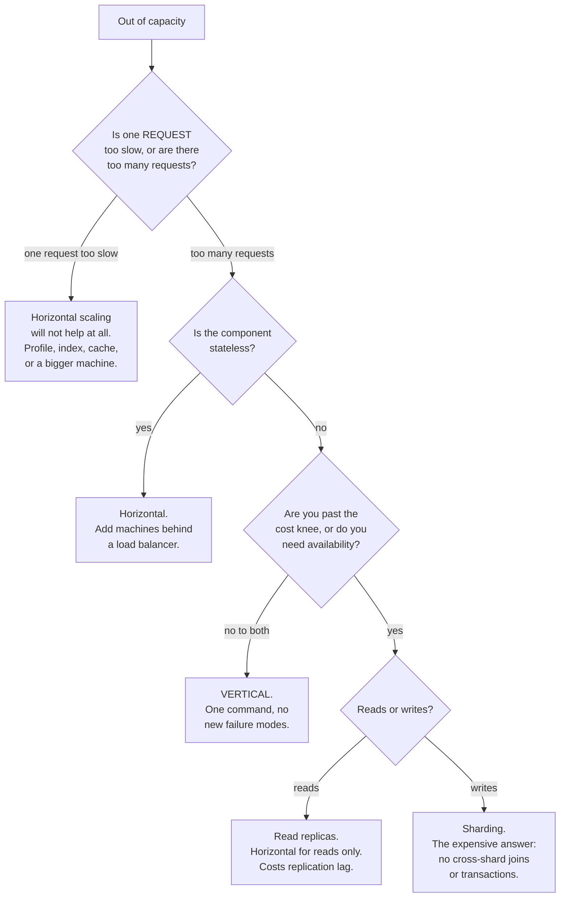

# Day 098 · System Design — Vertical versus horizontal scaling

**After today you can:** You can say when buying a bigger machine is the right answer.

**The interviewer asks it as:** *Your database is at capacity. Bigger box, or more boxes?*

---

## 1. What this is, and why they ask it

When a system runs out of capacity there are exactly two things you can do. **Vertical scaling** means
replacing the machine with a bigger one — more cores, more memory, faster disk. **Horizontal scaling**
means putting more machines beside it and dividing the work.

Three sentences. Vertical scaling changes no code and creates no new problems, and it runs out — there
is a largest machine you can buy, and the price stops being proportional to the power long before you
reach it. Horizontal scaling has no ceiling, and it buys something vertical scaling can never buy:
**surviving the failure of one machine**. But it only works if the work can actually be divided, which
for stateless application servers is easy and for a database is the hardest problem in the subject.

They ask it because the expected answer is not "horizontal" and most candidates say "horizontal"
immediately. The good answer is **"vertical first, and here is the specific number at which I would
stop"** — because vertical scaling is one command and a restart, and horizontal scaling for a database
means replication, sharding, and giving up transactions across shards. Reaching for the hard one when
the easy one still has room is a real engineering mistake, and interviewers are checking whether you
know that.

---

## 2. The story

The photocopy shop was next to the college gate and it was Nafisa's, and for eight years it had one
machine.

In the last week of every semester the queue went out of the door and along the wall. Students with
notes to copy for the whole class, forty pages at a time, and everybody wanting it now.

She had thought about this properly, twice.

The first time, a salesman came and offered her a bigger machine. Faster, he said. Twenty-two pages a
minute instead of fourteen. She worked out that this would clear the queue about half an hour sooner on
a bad day, and it cost eighty thousand rupees, and it took four hours to install during which the shop
would do nothing at all. She bought it anyway, because it was one decision and she did not have to
change anything else about how she worked. Same counter, same person, same everything, just faster.

Two years later she was in the same position again, and this time the salesman offered her the top
model. Thirty-five pages a minute. Two lakh forty thousand rupees.

That was the number that stopped her. Twice the speed of what she had, for three times the money.
Whereas a second machine of the kind she already owned was eighty thousand, and two of those would do
forty-four pages a minute, which was more than the expensive one.

The second machine was more work. It would not fit where the first one was, so the table had to move.
Somebody had to stand at it, which meant paying her nephew. And students had to be sent to the right
counter, which meant she now had to think about who was waiting for what, which she had never had to do
before.

She bought the second machine.

What decided it, in the end, was not the money and not the speed. It was that in March the one machine
had broken on a Tuesday and she had been shut for two days waiting for the part. Two days, in the last
week of the semester.

With two machines, a Tuesday like that is a slow day. With one machine it is a closed shop, and no
amount of buying a faster machine had ever changed that.

---

## 3. The idea in plain English

Nafisa has just worked through the whole decision, in the right order, for the right reasons.

- The faster machine is **vertical scaling** — also called *scaling up*. Same shape, more power.
- The second machine is **horizontal scaling** — *scaling out*. More units, work divided between them.
- The nephew and the moving table are the **operational cost** of going horizontal: it is never only the
  hardware.
- Sending students to the right counter is a **load balancer**.
- Two days shut in March is **availability**, and it is the real reason to go horizontal.

### Vertical scaling: what it is and what it buys

You stop the process, move to a bigger machine, and start it again. On a cloud provider that is
literally one command and a reboot.

**What it buys:**

- **No code changes.** Nothing about your program knows how big the machine is.
- **No new failure modes.** One machine still means one machine; there is no network between parts of
  your system that was not there before.
- **It is fast to do.** Minutes, not a quarter's project.

**What it costs, and where it stops:**

- **Downtime to resize.** Usually a few minutes, and always at least a restart.
- **A hard ceiling.** There is a largest machine, and you can look up what it is.
- **A price curve that bends.** This is the one people do not expect: past a certain size, doubling the
  machine costs much more than double.
- **Still one machine.** If it dies, everything is down. **No amount of vertical scaling improves
  availability** — that is the sentence to say.

### Horizontal scaling: what it is and what it demands

You put `n` machines behind a **load balancer** — a component that receives every request and hands it
to one of them.

**What it buys:**

- **No ceiling.** Ten machines, a hundred, a thousand.
- **Availability.** One dies, the rest carry on. This is the real prize.
- **Cheaper per unit of work at scale**, because you buy many ordinary machines rather than one
  extraordinary one.
- **You can scale down again**, which matters when the load is spiky.

**What it demands:**

- **The work must be divisible.** Ten machines only help if a request can be handled by any one of them.
- **The machines must be stateless**, or requests must always return to the same one — which is
  [tomorrow's](../day-099-binary-trees-in-code/README.md) and
  [day 100's](../day-100-dfs-traversals/README.md) subject.
- **You now have a distributed system**, with everything that implies: partial failures, network delays,
  and two machines that disagree. The load balancer itself needs to not be a single point of failure.

### The rule that decides it

> **Scale vertically until it stops being cheap or until you need availability. Then scale
> horizontally.**

For **application servers** the answer is almost always horizontal, and quickly, because they are
naturally stateless — any server can handle any request — so dividing the work is nearly free.

For **databases** the answer is vertical for much longer than people expect. A single modern database
machine handles a very large business. Horizontal scaling of a database means **replication** (copies for
reading) and then **sharding** (splitting the data), and sharding is the point at which you lose
cross-shard transactions and cross-shard joins. That is a permanent tax on every feature you build
afterwards.

### The two things that are actually different

People argue about cost and ceilings, but the two properties that genuinely differ in kind are these.

**Availability.** One machine has one failure. Two machines, either of which can serve, have a
combined failure probability that is the product of the two — which is a completely different number.

```
 one machine, 99% available     ->  3.65 days down per year
 two machines, either can serve ->  1 - (0.01 × 0.01) = 99.99%  ->  53 minutes per year
```

**Elasticity.** You can add and remove horizontal capacity in minutes and pay only for what is running.
A big machine is a big machine at 3 a.m. as well.

### The thing that is *not* different

**Horizontal scaling does not make one request faster.** A hundred machines serve a hundred times as
many requests; each individual request takes exactly as long, and possibly slightly longer because there
is now a load balancer hop in front. If your problem is that a single query takes eight seconds, adding
machines does nothing at all — that is a vertical, or an indexing, or an algorithm problem.

**Throughput scales horizontally. Latency does not.** Say that sentence; it catches out a lot of people.

---

## 4. The picture

The two directions.

```
 VERTICAL (scale up)                    HORIZONTAL (scale out)

     +--------+                              +----------------+
     |  2 CPU |                              | Load balancer  |
     |  8 GB  |                              +---+--------+---+
     +--------+                                  |        |
         |                                   +---v--+  +--v---+
         v  replace                          | 2CPU |  | 2CPU |
     +--------+                              | 8 GB |  | 8 GB |
     |  8 CPU |                              +------+  +------+
     | 32 GB  |                                  |        |
     +--------+                              +---v--------v---+
         |                                   |   more, later  |
         v  replace                          +----------------+
     +--------+
     | 64 CPU |   <- and then you stop,
     | 512 GB |      because there is no
     +--------+      bigger one to buy

 one machine, always              n machines, any number
 no code change                   requests must be divisible
 restart to resize                add one with no downtime
 IT DIES -> EVERYTHING IS DOWN    one dies -> the rest carry on
```

The cost curve, which is the part candidates do not expect:

```
 relative price against relative power, one cloud provider's general-purpose range

 price
   |                                                        *  (128 vCPU)
   |
   |                                        *  (64 vCPU)
   |
   |                        *  (32 vCPU)
   |            *  (16 vCPU)
   |     *  (8 vCPU)
   |  *  (4 vCPU)
   +-----------------------------------------------------------> power

 up to about 32 vCPU the line is roughly straight: twice the machine, twice the price.
 past that it bends upwards, and the very largest instances cost several times
 what their raw specification suggests, because few people buy them.

 THE KNEE IS THE DECISION POINT.
```

The decision, as a procedure:



What to notice: **the first question is not 'how big is the load'.** It is whether one request is slow
or there are too many of them, because horizontal scaling only ever answers the second.

---

## 5. How it actually works

### Vertical scaling, mechanically

On a cloud provider:

```
 1. stop the instance                     (or use live resize, where supported)
 2. change the instance type              t3.large -> m6i.4xlarge
 3. start it
 -> typically 2-5 minutes of downtime
```

For a managed database (Amazon RDS, Cloud SQL) it is a console setting, and with a standby replica the
provider can do it as a **failover**: resize the standby, promote it, resize the old primary. Downtime
drops to the failover time, usually under a minute.

**The important operational detail: some things do not automatically use the new capacity.** A database
that was configured with a 4 GB buffer pool still uses 4 GB on a 64 GB machine. A JVM with a fixed heap
still has that heap. **Resizing the machine without re-tuning the configuration is a very common way to
pay for capacity you do not use**, and mentioning it is a strong signal of having actually done this.

### The ceiling, in real numbers

The largest generally available cloud instances, as an order of magnitude:

```
 general purpose        ~128 vCPU,   ~512 GB RAM
 memory optimised       ~128 vCPU,   ~4 TB RAM
 the extreme end        ~448 vCPU,  ~24 TB RAM   (specialised, very expensive)
```

**A 4 TB machine holds a very large database entirely in memory.** That is the honest reason vertical
scaling lasts longer for databases than people assume: most companies' entire transactional dataset
fits in the memory of one large machine, and a database that fits in memory is extremely fast.

### Horizontal scaling, mechanically

Three things have to exist:

1. **A load balancer** in front, distributing requests. [Day 099](../day-099-binary-trees-in-code/README.md)
   is entirely about how it chooses.
2. **Stateless machines**, so any of them can serve any request. Anything a request needs must come from
   a shared store, not from the machine's memory. That is
   [day 100](../day-100-dfs-traversals/README.md).
3. **Health checks**, so a broken machine stops receiving traffic. Without this, adding a second machine
   makes availability *worse*: you have doubled the chance that some requests hit a broken box.

For a **database** the same three are much harder, and it happens in two stages:

- **Replication** — one primary takes writes, several replicas serve reads. This scales reads only, and
  it introduces **replication lag**: a replica can be a few milliseconds to a few seconds behind.
  [Days 104 and 105](../day-104-tree-path-problems/README.md).
- **Sharding** — the data is split across machines by a key, so each machine holds a slice and takes
  both reads and writes for it. This scales writes, and it is the expensive one.
  [Days 106 and 107](../day-106-bst-property/README.md).

### What real companies did

- **Stack Overflow** ran one of the busiest sites on the internet on a famously small number of
  machines, with a handful of very large SQL Servers — a deliberate, public argument for vertical
  scaling and careful engineering over horizontal sprawl.
- **Shopify, Instagram and Notion** all sharded their main database only after years, and each described
  it as a major multi-quarter project. Instagram ran on a single PostgreSQL primary with read replicas
  for a long time at very large scale.
- **Netflix** is the horizontal extreme: thousands of stateless instances, auto-scaling on demand, and
  the assumption that any instance can vanish at any moment — which is what
  [Chaos Monkey](../day-111-serialise-a-tree/README.md) exists to enforce.
- **DynamoDB, Cassandra and Kafka** are designed horizontally from the start: they have no single
  primary, and adding a node is a normal operation rather than a project.

The pattern in all of them: **stateless tiers went horizontal early and easily; the database went
vertical for as long as it possibly could.**

---

## 6. The numbers

### The cost knee

Approximate on-demand pricing for a general-purpose cloud instance family, normalised:

```
  vCPU   RAM     relative price   price per vCPU
  ----   -----   --------------   --------------
     2     8 GB        1.0×             0.50
     4    16 GB        2.0×             0.50
     8    32 GB        4.0×             0.50
    16    64 GB        8.0×             0.50
    32   128 GB       16.0×             0.50
    64   256 GB       33.0×             0.52
   128   512 GB       70.0×             0.55
```

**Up to about 32 vCPU, the price per unit of power is flat.** Past that it climbs, and at the very top of
the range — the specialised high-memory instances — it climbs steeply, because those machines are built
for people who have no alternative.

So the honest answer to "when do I stop scaling up" is:

```
 STOP when either:
   (a) the price per unit of work starts rising — around 32-64 vCPU on general hardware, or
   (b) you need to survive a machine failure — which is at ANY size
```

### Availability, which is the argument that actually wins

```
 one machine at 99.9% available     ->  8.8 hours down per year
 two, either can serve              ->  1 - 0.001^2 = 99.9999%  ->  32 seconds per year
 three                              ->  effectively never, from this cause alone
```

**That is a factor of a thousand from one extra machine**, and no amount of vertical scaling produces
any of it. This is the number to lead with when someone insists that a bigger box is always simpler.

The caveat worth adding, because it is where naive redundancy math goes wrong: the two machines must
fail **independently**. Two instances in the same rack, on the same power feed, in the same availability
zone, running the same buggy deploy, do not fail independently — and the arithmetic above quietly stops
applying.

### Sizing a real decision

```
 GIVEN: 6,000 peak QPS, application tier

   one app server, real work                    ~1,000 QPS
   -> 6 machines at 100% utilisation
   -> 9-10 machines at a sane 60-70% utilisation

   vertical alternative: one machine at 6,000 QPS
     needs ~6× the cores of a 1,000-QPS box
     exists, costs about the same in raw price
     and gives 8.8 hours of downtime a year instead of 32 seconds
```

**The horizontal answer here is not about cost — it is about the 8.8 hours.**

```
 GIVEN: a database at 4,000 writes/second on an 8 vCPU box, at 90% CPU

   vertical:   move to 32 vCPU. ~4× headroom. One command, ~1 minute of failover.
               cost: 4× the instance price, still on the flat part of the curve.
   horizontal: shard by user id across 4 machines.
               cost: 3-6 months of engineering, no cross-shard transactions
               afterwards, and every future feature pays that tax.

   -> vertical, obviously, and it buys you two years
```

**That comparison, stated with those numbers, is the answer to the interview question.**

### When vertical genuinely runs out

```
 working set larger than the biggest machine's RAM
   4 TB is the practical top end -> a 10 TB hot dataset cannot fit

 write throughput above one machine's disk
   ~50,000 IOPS on a good SSD; a write-heavy workload above that needs more disks

 a single-country business becoming global
   no machine is close to everybody; distance is not a capacity problem
```

Those three are the real triggers, and each of them is a **fact about the workload**, not a preference.

---

## 7. The trade-offs

### Vertical: simplicity for a ceiling and a single failure

**Take vertical when** the component is hard to distribute (a database), the load is well under the cost
knee, and you can tolerate the downtime — or when you simply do not yet know whether the growth is real.

**I would not scale vertically if** availability is a stated requirement. One box cannot be highly
available, at any price, and buying a bigger one is answering a different question from the one asked.

### Horizontal: no ceiling, for a distributed system you now have to run

**Take horizontal when** the component is stateless, when you need to survive a machine failure, or when
the load is spiky enough that elasticity saves real money.

**I would not scale horizontally if** the work cannot be divided — a single slow query, a single write
stream that must be ordered — or if the component is a database that is still comfortably within one
machine. **Sharding a database you did not need to shard is one of the most expensive mistakes available
in this subject**, because the cost is not the migration, it is every feature afterwards.

### The hybrid, which is what almost everybody actually runs

```
 stateless web/app tier      HORIZONTAL, auto-scaled, small machines
 cache                       HORIZONTAL, sharded by key
 primary database            VERTICAL, one large machine, scaled up as needed
 read replicas               HORIZONTAL, a few copies of that machine
 object storage              somebody else's horizontal problem
```

**Say this out loud in the interview.** "Vertical or horizontal" is a false choice at the system level;
different tiers get different answers, and naming which tier gets which is the actual skill.

### Where the argument gets subtle

- **Utilisation.** Ten machines at 30 percent utilisation cost more than three at 90 percent, and are
  more available. There is a real trade between cost and headroom, and "how much headroom" is a business
  decision, not an engineering one.
- **The load balancer is a component too.** It has capacity, and it can fail. In practice it is either a
  managed service, or several of them behind DNS — but "what if the load balancer dies" is a fair
  question and "it is managed and multi-zone" is a fair answer.
- **Restarts get slower as machines get bigger.** A 512 GB cache takes a long time to warm up. A machine
  that takes twenty minutes to become useful is a machine you cannot casually replace, which quietly
  reduces the availability benefit of having several.
- **Horizontal scaling can make things slower.** More machines means more connections to the database,
  more cache clients, more coordination. A hundred app servers each holding a pool of twenty database
  connections is two thousand connections, which many databases will not accept — and the fix is a
  connection pooler, which is another component.

---

## 8. In the interview

### How it gets asked

- The direct one: *"Your database is at capacity. Bigger box, or more boxes?"*
- The general one: *"How would you scale this?"* — and the expected answer is per tier, not one word.
- The trap: *"Just add more servers, right?"* — they want to hear the stateless requirement, or the fact
  that one slow request stays slow.
- The number probe: *"When would you stop scaling up?"*
- The availability probe: *"You have one very large database server. What is your availability?"*

### What to say out loud, in the first ninety seconds

1. **Ask which problem it is.** "Is one request too slow, or are there too many requests? Horizontal
   scaling only ever answers the second. If a single query takes eight seconds, more machines change
   nothing."
2. **Answer per tier, not for the system.** "The application tier is stateless, so that is horizontal
   and easy. The database is a different conversation."
3. **Default to vertical for the database, and give the stopping condition.** "I would scale the
   database up first. It is one command and a short failover, it changes no code, and it introduces no
   new failure modes. I would stop when either the price per unit of power starts bending — around 32 to
   64 vCPU on general-purpose hardware — or when availability becomes a requirement."
4. **Name what horizontal actually buys.** "The reason to go horizontal is not throughput, it is
   **surviving a machine failure**. One box at 99.9 percent is 8.8 hours a year; two boxes where either
   can serve is about thirty seconds. No amount of vertical scaling produces that."
5. **Name what it costs.** "Horizontal means a load balancer, health checks, and statelessness. For a
   database it means replication first, which scales reads and introduces lag, and then sharding, which
   scales writes and costs you cross-shard joins and transactions for ever."
6. **Say the sentence that separates the two.** "Throughput scales horizontally; latency does not."

### The follow-ups

**"When would you stop scaling up?"**
"Two conditions, and either one is enough. The first is the **cost knee**: up to roughly 32 vCPU the
price per unit of power is basically flat, so doubling the machine doubles the price — that is a fair
deal and I would keep taking it. Past that it bends, and at the top of the range you pay several times
what the specification suggests. The second is **availability**, and it applies at any size: one machine
is one failure, and if the requirement says we survive a machine dying, then no instance type answers it.
There is also a hard third condition, which is a fact rather than a judgement: when the working set no
longer fits in the biggest machine's memory, or the write rate exceeds one machine's disk, vertical is
simply finished."

**"Just add more servers, right?"**
"Only if two things are true. First, the work has to be divisible — if the problem is that one query
takes eight seconds, ten machines give me ten eight-second queries running at once, which helps
throughput and does nothing for the user waiting. Throughput scales horizontally; latency does not.
Second, the machines have to be **stateless**, so any request can go to any of them. If a server keeps
the user's session in its own memory, then adding machines breaks logins for two-thirds of users, and
the usual patch — sticky sessions — reintroduces the single point of failure you were trying to remove.
So my answer is yes for the app tier, and 'let me look at the state' for anything else."

**"You have one very large database server. What is your availability?"**
"Whatever that one machine's availability is — call it 99.9 percent, which is about 8.8 hours of
downtime a year, and that ignores the planned downtime for patching and resizing. And the important
point is that **it does not improve if I buy a bigger machine**. Availability is a function of how many
independent things can serve the request, not how powerful any one of them is. The cheapest real
improvement is a standby replica with automatic failover: it does not add capacity, it turns an outage
into a failover of maybe thirty seconds. I would do that before I did anything else, because it is the
one change that alters the shape of the risk rather than the size of the box."

**"Why not shard the database now and be done with it?"**
"Because sharding is not a one-time cost, it is a permanent tax. Once the data is split across machines
by a key, you lose transactions that span shards and joins that span shards — so every feature built
afterwards has to be designed around the shard key you chose today, and choosing it wrongly is very
expensive to undo. Meanwhile the alternative is one command. So my rule is: shard when the workload
proves you must — the write rate exceeds one machine, or the working set exceeds the biggest machine's
memory — and not because we expect growth. Companies like Instagram and Shopify ran a single primary
with read replicas for years at very serious scale, and each described sharding afterwards as a
multi-quarter project."

**"So which is better?"**
"Neither, and the question is usually the wrong shape — the answer is per tier. In practice almost every
real system is a hybrid: the stateless web and application tier is horizontal and auto-scaled on small
machines, the cache is horizontal and sharded by key, the primary database is vertical and as large as
it needs to be, read replicas are a small horizontal fan-out from it, and media sits in object storage,
which is somebody else's horizontal problem. Naming which tier gets which, and why, is the actual
answer."

**"What breaks when you go from one app server to fifty?"**
"Three things people usually meet in this order. **Connections**: fifty servers with a pool of twenty
database connections each is a thousand connections, and many databases start struggling well before
that — so you need a connection pooler, which is a new component. **State**: anything held in a single
process's memory — sessions, in-process caches, rate-limit counters, scheduled jobs — is now wrong,
either inconsistent or running fifty times. **Observability**: a bug that happens on one machine out of
fifty is very hard to find without centralised logging and request tracing. None of those are reasons
not to scale out; they are the actual work of scaling out, and they are why it is not free."

### A model answer

Asked: *your database is at capacity. Bigger box, or more boxes?*

> "Before choosing, I want to know which problem it is, because the two answers solve different things.
> **Is one query too slow, or are there too many queries?** If a single statement takes eight seconds,
> more machines give me more eight-second statements — throughput scales horizontally, latency does not.
> That case is an indexing or query problem, or possibly a bigger machine, but it is not a sharding
> problem.
>
> Assuming it is genuinely volume: **I would scale up first, and I would say exactly when I would stop.**
>
> The reason to scale up first is that it is close to free in engineering terms. On a managed database it
> is a configuration change and a failover — under a minute of disruption if there is a standby, a few
> minutes if not. No code changes. No new failure modes, because one machine is still one machine. And
> the price is fair: up to around 32 to 64 vCPU, the cost per unit of power is essentially flat, so
> doubling the machine costs about double. If we are on an 8 vCPU box at 90 percent CPU, moving to 32
> vCPU gives roughly four times the headroom for four times the price, and that will very likely buy two
> years.
>
> Compare that with the horizontal answer for a database, which is not one thing but two. **Read
> replicas** scale reads and are relatively cheap, and they cost you replication lag — a user who writes
> and immediately reads may not see their own write, which is a real product problem you have to design
> around. **Sharding** scales writes, and it is a multi-quarter project whose real cost is not the
> migration but everything afterwards: no transactions across shards, no joins across shards, and every
> future feature constrained by the shard key you pick now.
>
> So I would stop scaling up on one of three triggers. Two are judgements: the price curve bends, or we
> need headroom faster than a resize can give it. One is a fact: **the working set no longer fits in the
> largest machine's memory**, which is around 4 TB at the top of the range, or the write rate exceeds one
> machine's disk. Those are not preferences — at that point vertical is finished.
>
> There is one thing I would do immediately regardless, though, because it answers a question the capacity
> discussion is hiding. **A single database server, at any size, is a single point of failure.** At 99.9
> percent that is nearly nine hours a year, and a bigger box does not change it. So I would add a standby
> replica with automatic failover before anything else. It adds no capacity at all — it turns an outage
> into a thirty-second failover, which is the change that actually alters the shape of the risk.
>
> And for the application tier the answer is the opposite and much easier: it is stateless, so it is
> horizontal, behind a load balancer with health checks, sized from peak QPS. Almost every real system is
> that hybrid — horizontal where the work divides cleanly, vertical where it does not."

---

## 9. Recall card

- **Vertical = a bigger machine. Horizontal = more machines.** Ask first: *is one request slow, or are
  there too many?* **Horizontal only answers the second — throughput scales horizontally, latency does
  not.**
- **Default to vertical, and name the stopping condition.** It is one command and a restart, changes no
  code, and adds no failure modes. Stop when **(a)** the price curve bends — flat cost per vCPU to about
  **32–64 vCPU**, rising sharply above — **(b)** availability is required, at any size, or **(c)** the
  working set exceeds the biggest machine (**~4 TB RAM**) or one disk's write rate (**~50,000 IOPS**).
- **The real prize of horizontal is availability, not throughput.** One machine at 99.9% is **8.8 hours
  down a year**; two where either can serve is **~32 seconds** — a 1000× change no bigger box can buy.
  But only if they fail **independently**: same rack, same zone, same bad deploy breaks the arithmetic.
- **Horizontal demands statelessness, a load balancer and health checks.** For a database it is two
  separate steps: **replication** (scales reads, costs lag) then **sharding** (scales writes, costs
  cross-shard joins and transactions **for ever**). **Sharding a database you did not need to shard is
  one of the most expensive mistakes in the subject.**
- **The answer is per tier, not per system.** App tier horizontal and auto-scaled; cache horizontal,
  sharded by key; **primary database vertical, as large as it needs to be**; read replicas a small
  fan-out; media in object storage. Going from 1 to 50 app servers breaks three things in order:
  **connections** (need a pooler), **in-process state** (sessions, counters, cron), and
  **observability**.
