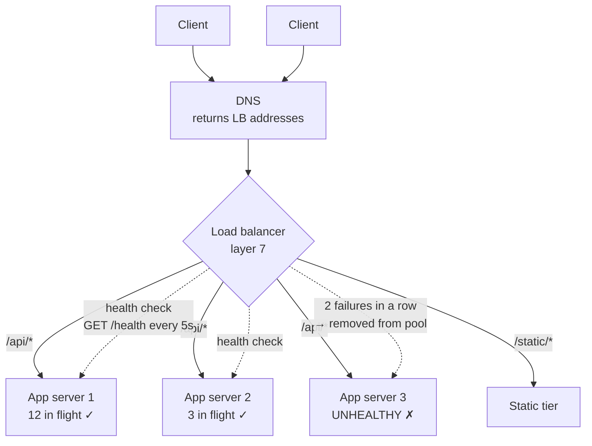

# Day 099 · System Design — Load balancers

**After today you can:** You can name the layer, the algorithms, and what happens on health-check failure.

**The interviewer asks it as:** *How does a load balancer decide which server gets the request?*

---

## 1. What this is, and why they ask it

A **load balancer** is the machine that sits in front of your servers, receives every request, and sends
it to one of them. Clients only ever talk to it; they never know how many servers exist or which one
answered.

Three sentences. It exists for two separate reasons that get muddled — **spreading load**, which is the
obvious one, and **hiding failure**, which is the one that actually matters, because a load balancer
that keeps sending requests to a dead server is worse than having no load balancer at all. How it
chooses is a short list of algorithms, and **the right one depends on whether your requests are all the
same size**. And the whole thing rests on **health checks**, which are the part candidates forget and
interviewers always ask about.

They ask it because it is the component that makes [yesterday's](../day-098-what-a-tree-is/README.md)
horizontal scaling possible, and because "round robin" is where most candidates stop. The follow-up is
always the same: *what happens when one server is slow rather than dead?* Round robin keeps sending it
one request in every `n`, for ever, and every one of those users waits. Knowing that failure mode, and
which algorithm fixes it, is the difference between having read about load balancers and having thought
about them.

---

## 2. The story

The ration shop on Thursday mornings had four counters open and one man standing at the door, and the
man at the door was the whole system.

His name was Pandian and he had been doing it for years. People came in with their cards and he pointed
— you, three. You, one. You, one again.

He was not being fair in the sense of taking turns. He had tried taking turns, years ago, and it had not
worked, because the counters were not the same.

Counter one was the fastest man in the shop. Counter four was a boy who had started in March and was
still checking every entry twice. If Pandian sent one person to each counter in turn, the queue at four
grew all morning while the queue at one emptied and the fastest man stood there doing nothing.

So what he actually did was look. He looked at the four queues and sent the next person to the shortest
one. That was it, and it handled everything by itself — if the boy was slow, his queue stayed long and
Pandian stopped sending him people, without ever having to decide that the boy was slow.

There was one exception he made. If somebody came in with a big monthly card for a whole joint family,
he sent them to counter one whatever the queues looked like, because that transaction took eight
minutes at counter one and twenty-five at counter four.

The part that took him longest to work out was what to do about a counter that had stopped.

Twice a morning somebody would leave their counter — tea, or the toilet, or a supervisor calling them
over — and Pandian, watching from the door twenty feet away, would not notice for a while. He kept
sending people. Those people stood there. And then they came back to the door, angry, and he had to put
them at the front of another queue, which made the people in that queue angry.

His solution was to glance at each counter every so often rather than only at the queues. If a counter
had not moved at all since the last time he looked, he stopped sending people there.

He learned to be careful about two things with that. If he checked too rarely, people waited at a dead
counter for a long time. If he reacted to the very first glance, he would pull people away from a
counter whose clerk had just bent down to pick up a dropped pen, and then the queue at the other three
jumped for no reason. So he waited until he had seen it still twice in a row before he stopped sending
people, and he waited until he had seen it working twice in a row before he started again.

---

## 3. The idea in plain English

Pandian is a load balancer, and he arrived at every important part of one by trial and error.

- Pointing people at counters is **load balancing**. Pandian is the load balancer; the counters are the
  **backends** (also called *servers*, *instances*, or the *target group*).
- Taking strict turns is **round robin**.
- Sending to the shortest queue is **least connections**.
- The joint-family card going to counter one is **request-aware routing** — some requests are much more
  expensive than others.
- Glancing at each counter is a **health check**.
- Waiting for two bad glances before pulling a counter out, and two good ones before putting it back, is
  the **unhealthy and healthy threshold**, and it exists to prevent **flapping**.

### The two jobs, which are not the same job

**Spreading load.** Requests are divided so no single server is overwhelmed. This is what people mean by
"load balancer".

**Hiding failure.** When a server dies, the load balancer stops sending it traffic and clients notice
nothing. **This is the more important job**, and it is why a load balancer improves availability rather
than only throughput.

A useful way to say it: a load balancer turns *n* unreliable servers into one apparently reliable
service. That only works if it knows which of the *n* are currently reliable, which is what health
checks are for.

### Layer 4 and layer 7

The two kinds, and this is the first thing an interviewer checks.

**Layer 4** works at the level of connections. It sees an incoming connection with an address and a port
and forwards the bytes to a backend, without reading them.

- Very fast, because there is nothing to parse — millions of connections per machine.
- Cannot make decisions based on the content: it cannot route `/api` differently from `/images`.
- Cannot retry a failed request, because it does not know where one request ends.

**Layer 7** understands the requests themselves. It reads the request line and headers, so it can route
on the path, the host name, a cookie, or a header.

- Path-based routing, host-based routing, header-based routing.
- Can **retry** a failed request on another backend, because it knows what a request is.
- Can terminate encryption, compress responses, rewrite headers, and enforce rate limits.
- Costs more CPU per request and adds a little delay — sub-millisecond in practice.

**Layer 7 unless you need the raw speed.** The retry ability alone usually decides it: a layer 4 balancer
that forwards a connection to a server which dies mid-request gives the user an error, where a layer 7
one quietly tries the next server.

### The algorithms, and the failure each one has

| Algorithm | How it chooses | Fails when |
|---|---|---|
| **Round robin** | strict rotation | requests differ in cost, or a server is slow but alive |
| **Weighted round robin** | rotation, but bigger servers get more | the weights are static and reality is not |
| **Least connections** | fewest in-flight requests | requests are very short — the count is stale before you use it |
| **Least response time** | fewest connections, tie-broken by latency | needs measurement; slightly more state |
| **Random** | pick one uniformly | uneven in the short run, fine in the long run |
| **Power of two choices** | pick two at random, send to the less loaded of them | almost nothing — see below |
| **IP hash / consistent hash** | the same client always lands on the same backend | a backend leaves and its clients all move |

**Round robin is the default and it is the wrong default whenever requests differ in cost.** Pandian's
original mistake: it is perfectly fair in *number of requests* and completely unfair in *work*.

**Least connections is the right default for most real systems**, because it is self-correcting. A slow
server keeps its requests longer, so its in-flight count stays high, so it receives fewer new ones — with
nobody having to decide anything. That is Pandian looking at queue lengths.

**Power of two choices deserves its own sentence**, because it is a genuinely surprising result: pick two
backends at random and send the request to whichever has fewer in-flight requests. That single extra
comparison gets you nearly all the benefit of checking all `n`, with none of the cost, and it avoids the
herd problem where every balancer sends the next request to the same "least loaded" server at the same
moment. It is what several large systems actually use.

**Consistent hashing** is the one to reach for when the backends have per-client state worth preserving —
a cache, or a session. [Day 108](../day-108-validating-a-bst/README.md) is entirely about it.

### Health checks, which are the real subject

A health check is the balancer asking each backend "are you alive?" on a schedule.

**Active** — the balancer sends a request, usually `GET /health`, every few seconds and looks at the
response.
**Passive** — the balancer watches real traffic and marks a backend unhealthy after several failed or
timed-out responses.

Real systems use both: active to notice a server that has gone quiet, passive to notice one that is
failing requests it was given.

Four settings, and the interviewer will ask about the interaction between them:

```
 interval           how often to check                    e.g. every 5 seconds
 timeout            how long to wait for a reply          e.g. 2 seconds
 unhealthy threshold  consecutive failures before removal   e.g. 2
 healthy threshold    consecutive successes before return   e.g. 2
```

**The thresholds exist to prevent flapping** — a server bouncing in and out of the pool because one check
happened to time out. Pandian's dropped pen.

And the arithmetic those settings imply is the thing to be able to do on the spot:

```
 worst case time to notice a dead server
   = interval × unhealthy_threshold + timeout
   = 5 × 2 + 2
   = 12 seconds
```

**For twelve seconds, that dead server keeps receiving one request in every `n`.** With four servers at
1,000 requests a second, that is 3,000 failed requests. Saying that number is what shows you understand
that health checks are not free.

### What the health endpoint should actually check

This is a small question with a genuinely good answer, and it comes up.

- **Too shallow** — `return 200` — reports healthy while the database connection is dead. The balancer
  keeps sending traffic to a server that fails every request.
- **Too deep** — check the database, the cache, and three downstream services — and when the shared
  database has a hiccup, **every server fails its health check at once and the balancer removes all of
  them**. You have turned a slow database into a total outage.

**The right answer is: check what this instance alone needs to serve a request** — its own process, its
own connection pool — **and expose the deep checks on a separate endpoint for monitoring, not for the
balancer.** That distinction is worth stating; it is a real production failure that has taken down real
systems.

### Where load balancers sit

There is usually more than one, at different levels:

```
 DNS                 -> spreads across regions or data centres (crude, cached, slow to change)
 edge / global LB    -> anycast, picks the nearest healthy region
 layer 7 LB          -> the one you draw in the diagram; routes by path and host
 internal LB         -> in front of each internal service, service to service
 client-side LB      -> the caller holds the list and chooses; no extra hop
```

**Drawing exactly one load balancer box and never mentioning the others is fine for an interview** —
just do not claim it is the only one, because "who balances the load balancer?" is a standard follow-up
and the answer is DNS and multiple balancer instances.

---

## 4. The picture

Where it sits and what it decides.



What to notice: **the health checks are a separate set of arrows from the traffic.** They run on their
own schedule whether or not requests are arriving, which is what lets the balancer notice a server that
has gone quiet rather than one that is failing.

The algorithms, on the same four backends:

```
 four backends, current in-flight requests:   A:12   B:3   C:7   D:0
                                              (D just joined)

 ROUND ROBIN          next -> A, then B, then C, then D, then A...
                      ignores that A has 12 in flight and D has none.

 LEAST CONNECTIONS    next -> D (0), then D or C, ...
                      self-correcting: A stops receiving until it drains.

 RANDOM               next -> any of the four, 25% each.
                      fine over thousands of requests, lumpy over ten.

 POWER OF TWO         pick two at random, say C and A -> choose C (7 < 12).
                      one extra comparison, nearly the quality of least-connections,
                      and no herd effect from every balancer picking D at once.

 IP HASH              hash(client_ip) % 4 -> the SAME client always gets the same
                      backend. Good for per-client state; terrible for balance
                      if one client is much busier than the others.
```

The health-check timeline, drawn, because the timing is the whole point:

```
 interval 5s · timeout 2s · unhealthy threshold 2 · healthy threshold 2

 t=0    check -> 200 OK          healthy, receiving traffic
 t=5    check -> 200 OK          healthy
 t=8    ** the server dies **
 t=10   check -> timeout (2s)    failure 1 of 2   STILL IN THE POOL
 t=15   check -> timeout (2s)    failure 2 of 2   REMOVED at t=17
 |-------------------------------------------|
 t=8 .......... 9 seconds of traffic to a dead server .......... t=17

 at 4,000 req/s across 4 servers, that is 1,000 req/s to the dead one
 -> ~9,000 failed requests before it is removed

 shorten the interval to 2s and the threshold stays at 2:
   worst case = 2 × 2 + 2 = 6 seconds  -> ~6,000 failures
   but the checks now cost 4 servers × 0.5/s = 2 extra requests per second,
   and a single slow moment is twice as likely to trigger a removal.
```

**That trade — faster detection against more false removals and more check traffic — is the answer to
"how would you tune it".**

---

## 5. How it actually works

### The request path, step by step

```
 1. client resolves your domain name           -> DNS returns one or more LB addresses
 2. client opens a connection to the LB
 3. LB terminates TLS                          (decrypts here; see the trade-offs)
 4. LB parses the request line and headers     (layer 7 only)
 5. LB picks a backend                         algorithm + health state
 6. LB forwards the request                    usually over a reused, warm connection
 7. backend responds
 8. LB may rewrite headers, compress, log
 9. LB returns the response to the client
```

Steps 3 to 6 add well under a millisecond in practice. **The one to notice is step 6**: the balancer
keeps a pool of already-open connections to each backend, so a new client connection does not cause a new
backend connection. That is why a hundred thousand clients do not become a hundred thousand database
connections.

### What happens when a backend fails mid-request

This is the difference between the two layers, made concrete.

```
 LAYER 4: the connection is broken. The client sees a reset. There is no retry,
          because the balancer does not know what a "request" was.

 LAYER 7: the balancer knows the request. If the backend fails BEFORE sending any
          response bytes, it can transparently retry on another backend and the
          client never knows.
```

**And the caveat that separates a careful candidate: retries are only safe for idempotent requests.** A
`GET` can be retried freely. A `POST` that charges a card cannot — if the first backend actually
processed it before dying, the retry charges twice. So layer 7 balancers retry `GET`, `HEAD` and `PUT`
by default and do **not** retry `POST` unless you explicitly say it is safe.

### Sticky sessions, and why they are a compromise

If a server keeps the user's session in its own memory, requests from that user must return to the same
server. A balancer can do that with a cookie, or by hashing the client address.

It works, and it costs you three things:

- **Uneven load**, because users are not uniform and sessions last a long time.
- **A broken session when that server dies** — which is precisely the failure the balancer existed to
  hide.
- **You cannot drain a server** for deployment without disrupting the users pinned to it.

**Stickiness is a workaround for state in the wrong place.** The real fix is to move the session into a
shared store, which is [tomorrow's](../day-100-dfs-traversals/README.md) lesson.

### Draining, which is how deployments stop hurting

When you take a server out for a deploy, you do not kill it. You mark it **draining**: it stops receiving
new requests and keeps serving the ones already in flight, then shuts down when they finish or after a
timeout.

```
 without draining:  in-flight requests are killed -> user-visible errors on every deploy
 with draining:     zero-error deploys, at the cost of a slower rollout
```

**"How do you deploy without dropping requests?" is a very common follow-up** and "connection draining,
with a grace period longer than my slowest request" is the whole answer.

### Real products

- **Hardware and software:** **HAProxy** and **nginx** are the classic software balancers. **Envoy** is
  the modern one and is the data plane inside most service meshes.
- **Cloud:** AWS **ALB** (layer 7), **NLB** (layer 4, millions of connections, very low latency), Google
  **Cloud Load Balancing** (global anycast), Azure **Front Door**.
- **Edge:** **Cloudflare** and **Fastly** are load balancers with a cache in front, distributed to
  hundreds of locations.
- **Client-side:** **gRPC** and service meshes often put the balancing in the *caller*, which removes a
  network hop entirely — the caller holds the list of healthy backends and chooses one itself. That is
  how internal service-to-service traffic is usually balanced at large companies.

---

## 6. The numbers

### What one balancer handles

```
 layer 4 (NLB-class)         millions of concurrent connections, ~100 µs added
 layer 7 (nginx/ALB-class)   50,000 - 200,000 requests/second per instance
                             ~0.5 - 1 ms added latency
 TLS handshakes              ~5,000 - 20,000 new handshakes/s per core
```

**The TLS number is the one that surprises people.** A new HTTPS connection is far more expensive than a
request on an existing one, which is why connection reuse — keep-alive — matters so much:

```
 10,000 req/s, all on new connections   -> 10,000 handshakes/s  -> several cores of pure crypto
 10,000 req/s, 100 requests per conn    ->    100 handshakes/s  -> negligible
```

### Health check overhead

```
 20 backends × 1 check every 5 s   =  4 checks/second
 negligible in traffic terms

 but the DETECTION time is the number that matters:
   interval 5 s, threshold 2, timeout 2 s  ->  worst case 12 s
   interval 2 s, threshold 2, timeout 1 s  ->  worst case  6 s
   interval 1 s, threshold 3, timeout 1 s  ->  worst case  4 s, and far more
                                               likely to remove a healthy-but-busy server
```

Cost of the detection window:

```
 4,000 req/s across 4 backends  =  1,000 req/s to each
 12-second detection window     =  12,000 failed requests
  6-second detection window     =   6,000 failed requests
```

**Halving the interval halves the damage and doubles the false-positive risk.** That is the trade, and
stating it in those terms is the answer.

### Sizing the balancer tier

```
 peak 6,000 QPS
   one layer 7 instance handles ~100,000 QPS  ->  one is plenty on capacity

 but: one instance = one point of failure
   -> at least TWO, in different availability zones, behind DNS or anycast
```

**You never run one load balancer**, and the reason is availability rather than capacity — the same
argument as [yesterday](../day-098-what-a-tree-is/README.md). A managed balancer already does this and
presents a single name.

### Connection multiplication

```
 100,000 client connections at the balancer
   × reused backend connections (keep-alive pool of ~100 per backend)
   = a few hundred backend connections, not 100,000
```

**The balancer is a connection funnel**, and this is a genuine reason to have one even at low request
rates. Without it, every client's connection becomes a backend connection, and databases and application
servers run out of file descriptors long before they run out of CPU.

### Uneven distribution, measured

Round robin with equal-cost requests is perfectly even. With unequal costs it is not:

```
 4 backends, requests: 90% take 10 ms, 10% take 1,000 ms

 round robin:        each backend gets 25% of the SLOW requests by luck.
                     variance is high; one backend can hold several slow ones at once.
 least connections:  a backend holding a slow request has a high in-flight count,
                     so it stops receiving new ones until it drains.

 measured effect on p99 latency in this kind of workload: often 2-5× better
 with least connections.
```

---

## 7. The trade-offs

### Layer 4 or layer 7?

**Layer 4** is faster, cheaper, and handles far more connections. It is the right choice for raw TCP,
for very high connection counts, and for anything where you must not decrypt the traffic.

**Layer 7** can route by path, retry failed requests, terminate TLS, and enforce limits. **Take layer 7
for HTTP services** — the retry ability alone usually justifies it. **I would not use layer 7 if** the
traffic is not HTTP, if end-to-end encryption is a requirement, or if the connection count is in the
millions and the per-request parsing cost matters.

### Terminate TLS at the balancer, or pass it through?

Terminating means the balancer decrypts, which is what lets it read paths and headers at all — and it
means traffic between the balancer and the backends is unencrypted unless you re-encrypt.

**Terminate, and re-encrypt to the backends if the network is not trusted.** The pure pass-through
option gives you end-to-end encryption and gives up every layer 7 feature at once.

### Least connections, or round robin?

**Least connections by default.** It is self-correcting, it needs no configuration, and it handles the
case round robin cannot: a server that is slow but alive.

**I would use round robin if** every request costs the same and is very short, because then the
in-flight count is stale by the time you act on it and the extra bookkeeping buys nothing. **And I would
use power-of-two-choices** if there are several balancer instances, because the herd problem — every
balancer independently deciding the same backend is least loaded — is real.

### How aggressive should health checks be?

Covered in the numbers, and the shape of the answer is: **detect faster, and you remove healthy servers
more often.** A removal is not free — the remaining servers absorb that load, and if the removal was
caused by a load spike, removing a server makes the spike worse on the others and can cascade.

**The specific failure to name: a health check that is too deep.** If `/health` checks the shared
database, then one database hiccup fails every server's health check simultaneously and the balancer
removes the entire pool. The system goes from degraded to completely down, caused by the safety
mechanism.

### Where this design breaks

- **The balancer is on the path of every request**, so its failure is total. The answer is several
  instances behind DNS or anycast, and it is why managed balancers exist.
- **It cannot fix a slow backend dependency.** If every server is slow because the database is slow, the
  balancer has nowhere good to send anything. Load balancing distributes load; it does not create
  capacity.
- **Stickiness undermines the whole thing.** Every sticky session is a small piece of the availability
  guarantee given back.
- **Long-lived connections rebalance badly.** WebSockets last for hours, so a newly added server receives
  nothing until existing connections close. Solving that means forcing periodic reconnection, which is a
  real design decision rather than a setting.

---

## 8. In the interview

### How it gets asked

- The direct one: *"How does a load balancer decide which server gets the request?"*
- The one that separates people: *"One server is slow but not dead. What happens?"*
- The mechanism probe: *"How does it know a server is down, and how long does that take?"*
- The layers question: *"Layer 4 or layer 7? Why?"*
- The recursion: *"What if the load balancer fails?"*
- The deployment question: *"How do you deploy without dropping requests?"*

### What to say out loud, in the first ninety seconds

1. **Give both jobs, and rank them.** "It spreads load, and it hides failure. The second matters more —
   a balancer that keeps routing to a dead server is worse than none."
2. **Pick a layer and justify it.** "Layer 7 for an HTTP service, because it can route on path and, more
   importantly, retry a failed request on another backend. Layer 4 if I need millions of connections or
   must not decrypt."
3. **Name the algorithm and its failure mode together.** "Least connections by default. Round robin is
   the common answer, and it breaks when requests differ in cost or a server is slow but alive — it keeps
   sending that server one request in every `n`, for ever."
4. **Go straight to health checks.** "The choice is only over *healthy* backends, so the health check is
   the real mechanism: active checks on an interval, plus thresholds so one slow response does not remove
   a good server."
5. **Do the detection arithmetic.** "With a five-second interval, a threshold of two and a two-second
   timeout, worst case detection is twelve seconds — and at a thousand requests a second to that backend,
   that is twelve thousand failed requests before it is removed."
6. **Say what the health endpoint must not do.** "It should check only what this instance needs to serve
   a request. If it checks the shared database, one database hiccup fails every server at once and the
   balancer removes the whole pool."

### The follow-ups

**"One server is slow but not dead. What happens?"**
"With **round robin**, the worst possible thing: it is still passing health checks, so it keeps getting
one request in every `n`, indefinitely, and every one of those users waits. Round robin is fair in
request *count* and blind to request *cost*. With **least connections**, it fixes itself — a slow server
holds its requests longer, so its in-flight count stays high, so the balancer sends it fewer new ones,
with nobody deciding anything. That self-correction is exactly why I would default to least connections.
If I wanted to go further I would add **outlier detection**: track per-backend latency and eject a
backend whose p99 is far above its peers, then let it back in after a cool-down. And I would make the
health check itself latency-aware, so a server that responds correctly but slowly counts as unhealthy."

**"How does it know a server is down, and how long does it take?"**
"Active health checks — usually a `GET /health` on a fixed interval — plus passive observation of real
traffic failures. Four settings matter: the interval, the timeout, the unhealthy threshold and the
healthy threshold. The two thresholds exist to prevent flapping: without them a single timed-out check
pulls a healthy server out, and a single good one puts it straight back. The detection time is
`interval × unhealthy_threshold + timeout` — with five seconds, two and two, that is twelve seconds worst
case. That number matters because during it the dead server is still receiving its share: at four
thousand requests a second across four servers, twelve seconds is about twelve thousand failed requests.
I can halve that by halving the interval, and the price is more check traffic and a higher chance of
removing a server that was merely busy."

**"What should the health endpoint check?"**
"Only what this instance needs in order to serve a request — the process is up, its own connection pool
is usable. **Not** the shared database, and this is a real production failure rather than a theoretical
one: if every server's health check depends on the same database, then one database hiccup fails all of
them simultaneously and the balancer removes the entire pool. You have converted a degraded system into
a complete outage using the safety mechanism. The deep checks — database, cache, downstream services —
belong on a separate endpoint that monitoring and alerting read, and that no balancer acts on."

**"What if the load balancer itself fails?"**
"It is on the path of every request, so its failure is total — which is why you never run one. In
practice you run at least two instances in different availability zones and put them behind either DNS
with multiple A records, or **anycast**, where the same address is announced from several locations and
the network routes to the nearest healthy one. A managed balancer does this for you and presents a single
name, which is most of why people use managed ones. DNS is the crudest layer and the slowest to react,
because clients cache the answer for the record's TTL — so DNS gives you regional failover in minutes,
not seconds, and you should not rely on it for instance-level failure."

**"How do you deploy without dropping requests?"**
"Connection draining. When I take a server out, I mark it draining rather than killing it: the balancer
stops sending it new requests, and it keeps serving the ones already in flight until they finish or a
grace period expires. The grace period has to be longer than my slowest normal request, otherwise I am
just killing requests on a delay. Then I roll through the fleet a few servers at a time, waiting for the
new ones to pass their **healthy threshold** before continuing — which is why that setting matters in
both directions. The failure mode without draining is that every deploy produces a burst of user-visible
errors, and it is often mistaken for an application bug."

**"Would you use sticky sessions?"**
"Only as a temporary measure, and I would name it as a compromise rather than a design. Stickiness means
the balancer sends a given user back to the same server, usually via a cookie, and it exists because that
server is holding state in its own memory. It costs three things: load becomes uneven, because users are
not uniform and sessions are long; when that server dies, those users lose their session — which is
exactly the failure the balancer was supposed to hide; and you cannot drain a server for deployment
without disrupting the users pinned to it. The real fix is to move the session into a shared store so any
server can serve any request, which makes the balancer's job trivial again."

### A model answer

Asked: *how does a load balancer decide which server gets the request?*

> "Before the algorithm, I would separate the two jobs, because the second one is the one people skip. A
> load balancer **spreads load**, and it **hides failure**. Hiding failure is the more important job — a
> balancer that happily keeps routing to a dead server is worse than not having one, because at least
> without it you would notice.
>
> So the decision is really two decisions: *which backends are eligible*, and *which of those gets this
> request*.
>
> Eligibility is health checking. Active checks, typically a `GET /health` every few seconds, plus
> passive observation of real failures. Two thresholds matter as much as the interval: a server has to
> fail several checks in a row before it is removed, and succeed several in a row before it comes back,
> otherwise one unlucky timeout pulls a healthy server out and one lucky response puts it straight back.
> The number I would put on the board is the detection time: interval times the unhealthy threshold, plus
> the timeout. Five seconds, threshold two, two-second timeout is twelve seconds — and at a thousand
> requests a second reaching that backend, that is twelve thousand failed requests before it is removed.
> I can halve it by halving the interval, and I pay in false removals.
>
> One thing about the health endpoint that is worth saying explicitly: it should check only what **this
> instance** needs to serve a request. If it checks the shared database, then a single database hiccup
> fails every server's check at the same moment and the balancer removes the entire pool — turning a
> degraded system into a total outage, using the safety mechanism.
>
> Then the choice among healthy backends. **Round robin** is the usual answer and it is the wrong
> default: it is fair in the number of requests and blind to their cost, so a server that is slow but
> alive keeps receiving one request in every `n`, indefinitely. **Least connections** is what I would
> use, because it is self-correcting — a slow server holds its requests longer, its in-flight count stays
> high, and it therefore receives fewer new ones without anyone deciding that it is slow. If there are
> several balancer instances I would prefer **power of two choices**: pick two backends at random and take
> the less loaded one. That single comparison gets nearly the quality of least-connections without every
> balancer stampeding onto the same idle server at once. **Consistent hashing** is the one I would use if
> backends hold per-client state, like a cache.
>
> On the layer: **layer 7** for an HTTP service, so I can route by path and, more importantly, **retry** a
> failed request on another backend — with the caveat that retries are only safe for idempotent requests,
> so `GET` yes and `POST` only if the caller says so. Layer 4 if the traffic is not HTTP, or the
> connection count is in the millions and I cannot afford to parse anything.
>
> And I would never draw exactly one of these. It is on the path of every request, so its failure is
> total: at least two instances in different zones, behind DNS or anycast."

---

## 9. Recall card

- **Two jobs, and the second matters more: spread load, and hide failure.** A balancer turns *n*
  unreliable servers into one apparently reliable service — but only if it knows which are healthy, so
  **health checks are the real mechanism**, not the algorithm.
- **Least connections by default, not round robin.** Round robin is fair in request *count* and blind to
  *cost*, so **a server that is slow but alive keeps getting one request in every `n`, for ever**. Least
  connections self-corrects. **Power of two choices** (pick two at random, take the lighter) gets nearly
  the same quality with no herd effect. **Consistent hashing** when backends hold per-client state.
- **Detection time = `interval × unhealthy_threshold + timeout`** — 5 s × 2 + 2 = **12 seconds**, which at
  1,000 req/s to that backend is **~12,000 failed requests**. Thresholds exist to stop **flapping**.
  Halving the interval halves the damage and doubles the false removals.
- **The health endpoint must check only what THIS instance needs.** A check that touches the shared
  database fails **every** server at once during one hiccup, and the balancer removes the whole pool —
  degraded becomes down, caused by the safety mechanism. Deep checks go on a separate endpoint for
  monitoring.
- **Layer 7 for HTTP** — path routing, TLS termination, and **retries** (safe for `GET`, not for `POST`);
  **layer 4** for raw speed and millions of connections. **Never run one balancer** — two zones behind
  DNS or anycast. **Connection draining** is how you deploy without dropping requests. **Sticky sessions
  are a compromise**, not a design: uneven load, sessions lost on failure, and no clean draining.
