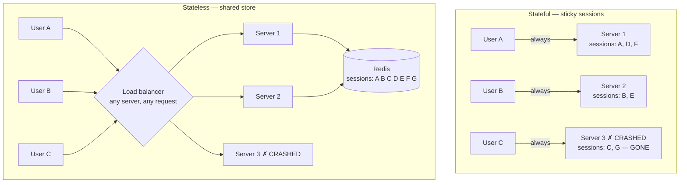

# Day 100 · System Design — Stateless services and why they scale

**After today you can:** You can explain why sticky sessions are a scaling bug.

**The interviewer asks it as:** *Why should a web server be stateless?*

---

## 1. What this is, and why they ask it

A service is **stateless** when handling a request needs nothing that is only in *that particular
machine's* memory. Everything the request needs either arrives with the request or comes from a shared
store that all the machines can reach.

Three sentences. Stateless does not mean there is no state — **the state exists, it just does not live
in the server** — and that distinction is the whole lesson. It matters because it is the precondition
for everything in [yesterday's](../day-099-binary-trees-in-code/README.md) load balancer and
[the day before's](../day-098-what-a-tree-is/README.md) horizontal scaling: if any server can serve any
request, then adding machines works, removing machines works, and a machine dying is invisible. And the
moment one server holds something the others do not, all three of those stop being true at once.

They ask it because **"stateless" is the word candidates use most and understand least.** The good
answer is not "so it scales" — it is the specific list of things that break: you cannot add a server
without redistributing users, you cannot remove one without losing their sessions, you cannot deploy
without disrupting people, and auto-scaling stops working. And the follow-up is always sticky sessions,
which are the workaround that quietly gives all of that back.

---

## 2. The story

There were three doctors at the clinic near the bus stand, and for years it had worked one way and then
it changed.

The old way was that each doctor kept their own patients. Dr Menon had a wooden cupboard behind his
chair with his patients' folders in it. Dr Raghavan had his own cupboard. The third doctor, who changed
every year or so, had a shelf.

If you were Dr Menon's patient you waited for Dr Menon. It did not matter that Dr Raghavan was sitting
there with nobody in front of him — he could not see you, because he did not have your folder and had
no idea what you had been given last time.

Two things went wrong with that, regularly.

The queues were never even. On a Tuesday there would be fourteen people waiting for Menon and two for
Raghavan, and everybody could see it, and it made people angry in a way that was hard to argue with.

And when Dr Menon's mother fell ill in Trichy and he was away for eleven days, his patients simply could
not be seen. Not slowly — at all. Somebody found the cupboard key eventually, and then the folders were
on a desk in a heap and nobody could find anything.

The new receptionist changed it, and it took her about two months to push through because the doctors
did not like it.

She put every folder in one cabinet at the front desk. When your name was called, whoever gave you your
folder gave it to whichever doctor was free, and that doctor read it and saw you.

Nobody's folder belonged to a doctor any more. It belonged to the cabinet.

What that bought was not obvious until it happened. In December they were very busy and they brought in
a fourth doctor for three weeks — a young woman doing a locum — and she just started working. There was
no handover, no list of which patients were hers. She called a name, took the folder, read it, and saw
the patient. On her last day she stopped, and nothing had to be untangled.

The old receptionist, who still came in sometimes, said the folders had always been in the cupboards
and what was the difference.

The new one said the difference was that before, you had to ask which doctor, and now you only had to
ask which folder.

---

## 3. The idea in plain English

The clinic has just gone from stateful servers to stateless ones, and every consequence in the topic
appeared in the story.

- Each doctor's own cupboard is **server-local state**. The folder exists only on that machine.
- The shared cabinet at the front desk is a **shared store** — a database, or Redis.
- "Whichever doctor is free" is the **load balancer**, and it can only work that way once the folders
  moved.
- The locum starting with no handover is **elastic scaling**: add a machine and it is immediately
  useful.
- Dr Menon away for eleven days is a **server failure**, and the difference between "his patients wait"
  and "nobody notices" is the entire argument.

### What stateless actually means

**Stateless does not mean stateless.** The state is still there. It has moved.

```
 STATEFUL SERVER                        STATELESS SERVER
 request -> server 2                    request -> any server
            server 2 holds the                    server reads state from
            session in memory                     a shared store, uses it,
            and answers                           writes back, and forgets
```

The precise definition worth memorising:

> **A service is stateless if any instance can handle any request, and killing an instance mid-life
> loses nothing that mattered.**

That is a testable claim. Take one machine out at random; if some users are affected differently from
others, it was not stateless.

### The four things that break without it

This is the answer to "why should a web server be stateless", and it is a list, not a slogan.

**One: you cannot add a machine.** New machine, no sessions, so a third of users hitting it are logged
out. Adding capacity causes an incident.

**Two: you cannot remove a machine.** Whatever it held is gone. Scaling down is destructive, so you
stop doing it, so you pay for peak capacity all night.

**Three: you cannot deploy.** Every deployment restarts every process, and each restart drops whatever
those processes were holding. Deployment becomes a scheduled outage, which means you deploy rarely,
which means each deployment is bigger and riskier.

**Four: a crash is user-visible.** The load balancer's health check removes the machine correctly and
promptly — and its users are still logged out, because the thing they needed was inside it.

**Say all four.** "It scales better" is one sentence; those four are the actual content.

### What counts as state, including the ones people miss

The obvious one is the login session. The others are where real systems go wrong:

| State | Where it wrongly lives | Where it belongs |
|---|---|---|
| Login session | server memory | Redis, or a signed token in the cookie |
| Shopping cart | server memory | database or Redis |
| In-process cache | server memory | fine, **if** it is a pure optimisation |
| Uploaded file, mid-upload | the local disk | object storage, or a resumable upload |
| Rate-limit counters | server memory | Redis — otherwise the limit is `n × limit` |
| WebSocket connection | that machine, unavoidably | see below |
| Scheduled jobs | every machine's timer | a leader, or a scheduler service |
| Generated ids from a counter | a per-process counter | UUIDs, or a shared allocator |

**The rate-limit one is worth its own sentence** because it is silent: with ten servers each keeping
their own count, a limit of "100 requests per minute" is really 1,000, and nothing in the logs says so.

**Scheduled jobs are the other silent one**: a nightly job in every process means the job runs once per
machine. Ten servers, ten billing runs.

### The in-process cache exception, which is worth getting right

An in-memory cache is state, and it is usually **fine**:

```
 acceptable:   a cache — if it is missing, the server fetches from the source and is
               merely slower. Correctness does not depend on it.
 not acceptable: anything where a miss produces a WRONG ANSWER rather than a slow one.
```

**The test: if this machine lost its memory right now, would the answer be wrong, or just slow?** Slow is
fine. Wrong is state that must move.

### Sticky sessions: the workaround, and why it is a bug

**Sticky sessions** (also *session affinity*) mean the load balancer sends each user back to the same
server every time — usually with a cookie, or by hashing the client address.

It works. It also gives back most of what the load balancer was for:

- **Load becomes uneven.** Users are not identical and sessions are long, so one machine ends up with
  the heavy users and the balancer cannot correct it.
- **A crash is user-visible again.** The server dies and its users lose their sessions — precisely the
  failure the balancer existed to hide.
- **You cannot drain for deployment** without disrupting the users pinned to that machine.
- **Auto-scaling is broken.** A new machine attracts only new users, so it stays cold while the old ones
  stay hot; and removing a machine is destructive.

**The sentence to say: sticky sessions are not a scaling technique, they are a symptom of state in the
wrong place.** They are a legitimate short-term measure — sometimes the only option for a legacy
application — and they should be described that way rather than as a design.

### Where to put the session instead

Three options, and each is a real trade.

**In a shared store (Redis).** The server reads the session by id on every request. Simple, revocable
instantly, and it costs one network round trip — sub-millisecond in the same data centre. **This is the
default.**

**In a signed token in the cookie** — a JWT, from [day 020](../day-020-building-strings/README.md).
The state travels with the request, so there is no store at all and no lookup. The price is real:

- **You cannot revoke it.** It is valid until it expires, so "log out everywhere" and "this account is
  compromised" do not work without adding a revocation list — which is a shared store, which is the thing
  you were avoiding.
- **It is sent on every request**, so a large token is bandwidth on every call.
- **It cannot be updated by the server** — changing a permission means the old token keeps the old
  permission until it expires.

**In the database.** Correct, durable, and slower than Redis for something read on every single request.

**The usual answer: short-lived signed token for identity, Redis for anything that must be revocable or
mutable.**

### The special case: WebSockets

A WebSocket connection is genuinely pinned to one machine — the socket exists there and nowhere else. You
cannot make that stateless.

What you do instead is **keep only the connection on the machine and none of the meaning**: the
conversation, the presence, the undelivered messages all live in a shared store, and the machine holds a
socket and a user id. Then losing a machine drops connections, clients reconnect — possibly to a
different machine — and nothing is lost but a second of downtime.

**"Connections are stateful; the application does not have to be"** is the sentence.

---

## 4. The picture

The two designs, side by side.



What to notice: in the stateful design, **the crash of server 3 is visible to users C and G and to nobody
else** — an unfair, unpredictable, hard-to-explain failure. In the stateless design the crash costs one
retry.

What actually moves where:

```
 REQUEST ARRIVES
      |
      +-- carried IN the request:   the user's identity token, the request body,
      |                             everything about what to do
      |
      +-- read from SHARED STORE:   session, cart, permissions, counters
      |
      +-- held ON THIS MACHINE:     nothing that matters
      |                             (a cache is allowed: a miss is SLOW, not WRONG)
      |
      +-- written back:             to the shared store, before responding

 TEST: kill this machine now. Was anything lost that mattered?
```

The cost of the two session designs, drawn:

```
 SESSION IN REDIS                        SESSION IN A SIGNED TOKEN
 ---------------------------             ------------------------------
 request carries a session id            request carries the whole session
 server does 1 lookup   ~0.5 ms          server verifies a signature ~0.05 ms
 store: ~1 KB × active users             store: NOTHING
 revoke: delete the key    instant       revoke: IMPOSSIBLE until it expires
 update: write the key     instant       update: not until the next login
 bandwidth: ~40 bytes/request            bandwidth: ~800 bytes on EVERY request

 1M active users:
   Redis:  1 GB, and one round trip per request
   token:  0 GB, and 800 MB/day of extra upload at 1,000 req/s
```

---

## 5. How it actually works

### Making a service stateless, in order

**Step 1 — find the state.** Search the codebase for module-level variables, singletons, in-memory
dictionaries, `session[...]` backed by memory, local file writes, and timers. That list is the work.

**Step 2 — classify each one.** For each: *if this machine lost its memory now, would the answer be
wrong or just slow?* Slow can stay. Wrong must move.

**Step 3 — move it.** Sessions and counters to Redis. Uploads to object storage. Scheduled jobs to a
scheduler, or behind a leader election. Generated ids to UUIDs or a shared allocator.

**Step 4 — verify by killing something.** Terminate one instance during a load test and watch the error
rate. If it is a blip, you are stateless. If a fraction of users see errors proportional to your
instance count, you are not.

**Step 5 — turn off stickiness.** If it was on, it can now be off, and only now.

### The session lookup, concretely

```
 GET /orders
 Cookie: sid=8f2a...

 1. server extracts sid                            ~0 µs
 2. GET session:8f2a from Redis                    ~0.3-0.5 ms in the same DC
 3. server handles the request
 4. SET session:8f2a with a refreshed TTL          ~0.3 ms (often skipped)
```

**Under a millisecond, and that is the entire cost of statelessness.** Compare it against the cost of not
being able to deploy without an outage, and the trade is not close.

Two implementation details worth mentioning:

- **The TTL is the session expiry.** Redis expires it automatically, so there is no cleanup job.
- **Do not write the session on every request** unless something changed. A read-only request that
  refreshes the TTL doubles your Redis traffic for very little.

### The shared store is now the critical dependency

This is the honest cost, and a good candidate raises it before the interviewer does.

**Every request now depends on Redis being up.** You have removed a per-machine failure and created a
shared one. Three things follow:

- **Redis must be replicated**, with automatic failover — otherwise you replaced ten small failures with
  one total one.
- **Decide what happens when it is down.** Fail the request, or fall back to a signed token, or serve
  logged-out content? That is a product decision and having an answer is a strong signal.
- **It is now a hot dependency** at the full request rate, so size it: 6,000 QPS against Redis is
  nothing (it does 100,000+), but it is a real capacity line.

### What real systems do

- **Twelve-Factor App**, the widely cited deployment guide, states it directly: *processes are stateless
  and share nothing; any data that must persist goes in a stateful backing service.* That phrasing is
  worth borrowing in an interview.
- **Kubernetes** encodes the distinction in its object types: a `Deployment` for stateless pods, which
  are interchangeable and can be replaced freely, and a `StatefulSet` for pods with stable identities and
  attached storage — used for databases, and deliberately harder to operate.
- **AWS auto-scaling groups** assume statelessness. Instances are launched and terminated on a metric,
  and scale-in picks an instance without asking what is on it.
- **Netflix's Chaos Monkey** terminates production instances at random during working hours. It only
  makes sense as a practice if the services are stateless — it is statelessness enforced by
  experiment rather than by policy.
- **Session stores in practice:** Redis or Memcached for server-side sessions, and signed cookies (JWT or
  a framework's own signed session) where revocation is not needed.

---

## 6. The numbers

### The cost of moving the session out

```
 Redis GET, same data centre        ~0.3 - 0.5 ms
 typical request handling            ~50 - 200 ms
 -> the lookup is 0.25% - 1% of the request
```

**Under one percent.** That is the number that ends the argument.

```
 6,000 peak QPS × 1 session read     = 6,000 Redis ops/s
 one Redis instance                  = 100,000+ ops/s
 -> ~6% of one instance
```

### Session storage

```
 session record: user id, roles, expiry, a little context   ~1 KB
 1,000,000 active sessions × 1 KB                           = 1 GB
 with a 30-minute TTL, "active" means the last 30 minutes
```

**One gigabyte for a million concurrent sessions**, on a machine with a hundred. This is not a capacity
problem, and saying so pre-empts the objection.

### Signed tokens instead

```
 a JWT with a few claims             ~600 - 900 bytes
 sent on EVERY request
 1,000 req/s × 800 B                 = 800 KB/s = ~69 GB/day of extra upload
 -> at ~₹7/GB egress-equivalent, a real number if it crosses a billing boundary
 -> and mobile users pay it on their own data
```

**Trade one Redis lookup for 800 bytes on every request.** For a chatty API that is a bad trade; for a
service with few, large requests it is a good one.

### The cost of stickiness, measured

```
 10 servers, sticky sessions, one dies:
   users affected                    10% of logged-in users, immediately
   they see                          logged out, cart lost, form contents gone

 10 servers, stateless, one dies:
   users affected                    the in-flight requests only
   they see                          one retry, ~200 ms, or nothing at all
```

And in normal operation:

```
 deploys per day, stateful with stickiness    ~1, in a maintenance window
 deploys per day, stateless with draining     as many as you like, zero errors
```

**That second table is the real argument.** The failure case is dramatic; the deployment case is what
you live with every day.

### Load imbalance under stickiness

```
 10 servers, sticky, sessions lasting ~30 minutes, heavy users are 5% of traffic
 -> observed spread between busiest and quietest server: commonly 2-3×
 -> you must provision every server for the BUSIEST one
 -> ~30-50% wasted capacity
```

**Stickiness costs money continuously**, not only during incidents, and that is the argument that lands
with people who are not worried about failure.

### The rate-limiter bug, in numbers

```
 intended limit          100 requests per minute per user
 in-memory counters, 10 servers, round-robin balancing
 -> each server sees ~10% of that user's requests
 -> each allows 100
 -> effective limit    1,000 requests per minute
```

**Ten times the intended limit, with nothing in the logs to say so.** This is the most common concrete
example of accidental state, and it is worth naming because it is a correctness bug rather than a
performance one.

---

## 7. The trade-offs

### Session in Redis, or in a signed token?

**Redis** costs one sub-millisecond lookup per request and gives you instant revocation, server-side
updates, and small cookies. **Take it by default.**

**A signed token** removes the lookup and the store entirely, which genuinely matters for a service that
must work across regions without a shared store, or at extreme scale where the lookup is a real line item.
**I would not use a token alone if** logging out has to be immediate, if permissions change during a
session, or if the session data is large enough to matter on every request. The usual compromise is a
short-lived token — five to fifteen minutes — with a refresh token that *is* checked against a store, so
revocation takes effect within one token lifetime.

### Statelessness costs a shared dependency

You have traded `n` independent partial failures for one shared total failure. **That is a real trade,
not a free win.** The mitigation is that the shared store is a well-understood, replicated, failover-
capable component, and it is one thing to make reliable rather than `n` things — but if it is a single
un-replicated Redis, you have made availability worse, and you should say so before someone else does.

### In-process caching: allowed, with a rule

Keeping a cache in each server's memory is faster than any shared store and it is legitimate. The rule is
**a miss must produce a slow answer, never a wrong one**, and the corollary is that per-machine caches
can disagree with each other for as long as their TTL — so anything requiring all users to see the same
value at the same time cannot live there.

### When stateful is genuinely right

- **Databases.** They are stateful by definition, and the whole point of pushing state into them is that
  they are built for it.
- **WebSocket and long-lived connections.** The connection is pinned; keep the meaning elsewhere.
- **Stream processing with local state** — a windowed aggregation over a Kafka partition keeps state on
  the machine deliberately, and recovers it from a changelog if the machine dies. That is stateful by
  design, with a recovery story.
- **Very large per-user working sets**, where fetching from a shared store on every request would cost
  more than the request itself. Then you shard users to machines deliberately — which is stickiness, but
  chosen and managed rather than inherited.

**Naming these matters**, because "everything should be stateless" is as unthinking as "everything should
be sticky".

### Where this design breaks

- **The shared store becomes the bottleneck** long before the stateless tier does. Your app servers scale
  to a hundred; Redis is still one logical thing.
- **Statelessness does not survive careless code.** One module-level dictionary added in a hurry, and
  the property is quietly gone with no error. The only reliable check is the experiment: kill an
  instance and watch.
- **Sequential ids from a per-process counter** collide across machines silently — two servers both
  issue order number 1041. This is one of the nastiest examples because it corrupts data rather than
  degrading service.

---

## 8. In the interview

### How it gets asked

- The direct one: *"Why should a web server be stateless?"*
- The follow-up, always: *"So where does the session live?"*
- The trap: *"Could you use sticky sessions instead?"*
- The probe: *"What in your design is holding state right now?"*
- The extension: *"What about WebSockets? They are inherently stateful."*

### What to say out loud, in the first ninety seconds

1. **Define it precisely.** "Stateless means any instance can handle any request, and killing an instance
   loses nothing that mattered. It does not mean there is no state — the state exists, it just does not
   live in the server."
2. **Give the four consequences, not a slogan.** "Without it: I cannot add a machine without logging some
   users out, cannot remove one without losing their sessions, cannot deploy without disrupting people,
   and a crash is user-visible to exactly the fraction of users who were on that box."
3. **Say where the state goes.** "Session in Redis, keyed by a session id in the cookie. That is one
   lookup of about half a millisecond against a request that takes fifty to two hundred — under one
   percent."
4. **Pre-empt the sticky-session question.** "Sticky sessions are not a scaling technique; they are a
   symptom of state in the wrong place. They give back the uneven load, the visible crashes, the
   inability to drain, and auto-scaling."
5. **Name the state people forget.** "The obvious one is the session. The ones that bite are rate-limit
   counters — with ten servers each counting separately, a hundred-per-minute limit is really a thousand
   — and scheduled jobs, which run once per machine unless something elects a leader."
6. **Admit the cost.** "The trade is that every request now depends on the shared store, so I have swapped
   ten partial failures for one total one. That store has to be replicated with automatic failover, and I
   should decide what happens to a request when it is unavailable."

### The follow-ups

**"So where does the session live?"**
"Default is Redis, keyed by a session id in the cookie. One `GET` of about half a millisecond in the same
data centre, against a request that takes fifty to two hundred — so under one percent of the request. A
million active sessions at about a kilobyte each is one gigabyte, which is nothing. The alternative is a
signed token — a JWT — where the state travels in the cookie and there is no store or lookup at all. That
is genuinely attractive for a multi-region service, and it costs three things: **you cannot revoke it**,
so 'log out everywhere' does not work until it expires; the server cannot update it, so a permission
change does not take effect until the next login; and it is sent on every request, so eight hundred bytes
times a thousand requests a second is about sixty-nine gigabytes a day of extra upload. The usual
compromise is a short-lived token for identity plus a refresh token checked against a store, so revocation
takes effect within one token lifetime."

**"Could you use sticky sessions instead?"**
"You can, and it works, and I would describe it as a temporary measure rather than a design — often the
only option for an application you cannot change. What it costs is most of what the load balancer was
for. Load becomes uneven, because users are not identical and sessions last half an hour; in practice the
spread between the busiest and quietest server is two to three times, and you have to provision every
server for the busiest one, so you are paying thirty to fifty percent extra continuously. A crash becomes
user-visible again: ten servers, one dies, ten percent of logged-in users are logged out — the exact
failure the balancer existed to hide. You cannot drain a server for deployment without disrupting the
users pinned to it. And auto-scaling stops working, because a new machine only attracts new users and
stays cold while the old ones stay hot."

**"What in your design is holding state right now?"**
"Let me go through it deliberately, because the obvious one is not the dangerous one. The session — moved
to Redis. **Rate-limit counters** — these must be shared, because with ten servers each counting locally,
a limit of a hundred a minute is really a thousand, and nothing in the logs tells you. **Scheduled
jobs** — a nightly billing run in every process runs once per machine, so that needs a leader or a
scheduler service. **File uploads** — writing to local disk means the retry lands on a different machine
and cannot find the partial file, so those go to object storage. **Generated ids** — a per-process counter
collides across machines and issues the same order number twice, so UUIDs or a shared allocator. And an
**in-process cache** is fine, on one condition: a miss must make the answer slow, never wrong."

**"What about WebSockets? They are inherently stateful."**
"The connection is, and there is no way around that — the socket exists on one machine. What I can do is
make sure the machine holds **only the connection and none of the meaning**. The conversation history,
the presence state, and undelivered messages all live in a shared store; the machine holds a socket and a
user id. Then when a machine dies, its clients drop, reconnect — possibly to a different machine — and
nothing is lost but a second. Delivering a message to a user on another machine needs a pub/sub layer:
the sender's machine publishes to a channel for that user, and whichever machine holds their connection
is subscribed and pushes it down. So: connections are stateful, the application does not have to be."

**"What does statelessness cost you?"**
"A shared dependency on the request path. Every request now needs the session store, so I have traded ten
independent partial failures for one shared total one — and if that store is a single un-replicated
instance, I have made availability worse rather than better. So it has to be replicated with automatic
failover, and I should decide explicitly what a request does when it is unavailable: fail closed, fall
back to a signed token, or serve logged-out content. The other cost is that the property is fragile
against careless code — one module-level dictionary added in a hurry and it is silently gone. The only
reliable check is the experiment: terminate an instance during a load test and see whether the error rate
is a blip or a fixed fraction of users."

**"How would you verify a service is actually stateless?"**
"Kill an instance under load and look at the shape of the errors. A blip that recovers on retry means
stateless. A sustained error rate that is roughly one over the number of instances, affecting the same
users repeatedly, means something was in there. That experiment is exactly what Netflix's Chaos Monkey
institutionalises — terminating production instances at random during working hours, which only makes
sense as a practice if the services genuinely are stateless. I would also grep for module-level mutable
variables, local file writes and timers as a static check, but the experiment is the one that finds what
the grep misses."

### A model answer

Asked: *why should a web server be stateless?*

> "Let me start with what the word means, because it is used loosely. **Stateless means any instance can
> handle any request, and killing an instance mid-life loses nothing that mattered.** It does not mean
> there is no state — the session, the cart, the counters all still exist. They have just moved out of
> the server's memory into somewhere every server can reach.
>
> The reason is not really 'it scales better'. It is four specific things that stop working without it.
>
> **I cannot add a machine.** A new instance has no sessions, so once the balancer starts sending it
> traffic, a share of users are logged out. Adding capacity causes an incident, which is the wrong way
> round.
>
> **I cannot remove one.** Whatever it held is gone, so scaling in is destructive — which means you stop
> doing it and pay for peak capacity at three in the morning.
>
> **I cannot deploy.** Every deploy restarts every process and drops what they were holding, so
> deployment becomes a maintenance window. That makes you deploy rarely, which makes each deploy larger
> and riskier.
>
> **And a crash becomes user-visible.** With ten servers, one dying logs out ten percent of users — the
> exact failure the load balancer was supposed to hide.
>
> So the session goes into Redis, keyed by a session id in the cookie. That is one lookup of roughly half
> a millisecond against a request that takes fifty to two hundred — under one percent — and a million
> active sessions at a kilobyte each is one gigabyte. Neither number is an obstacle.
>
> The state people forget is more interesting than the session. **Rate-limit counters** kept in memory
> mean ten servers each allow the full limit, so 'a hundred a minute' is really a thousand and nothing in
> the logs says so — that is a correctness bug, not a performance one. **Scheduled jobs** run once per
> machine unless something elects a leader. **File uploads** to local disk break when the retry lands
> elsewhere. **Sequential ids from a per-process counter** collide silently across machines. An
> **in-process cache** is fine, on one condition: a miss must make the answer slow, never wrong.
>
> On sticky sessions, which is usually the next question: they work, and they are not a scaling technique
> — they are a symptom of state in the wrong place. They give back the even load, the invisible crashes,
> the ability to drain for a deploy, and auto-scaling. In steady state they typically leave a two to three
> times spread between the busiest and quietest server, and you have to size every server for the busiest.
>
> And I would name the cost honestly: every request now depends on the session store, so I have swapped
> ten partial failures for one shared total one. That store needs replication and automatic failover, and
> I need an explicit answer for what a request does when it is unavailable."

---

## 9. Recall card

- **Stateless means any instance can serve any request, and killing one loses nothing that mattered.** It
  does **not** mean there is no state — the state moved out of the server into a shared store. The test:
  *if this machine lost its memory now, would the answer be **wrong** or just **slow**?* Slow is fine.
- **Four things break without it, and the list is the answer:** you cannot **add** a machine (new users
  logged out), cannot **remove** one (their sessions gone), cannot **deploy** without disruption, and a
  **crash becomes user-visible** to exactly `1/n` of users.
- **Session in Redis by default** — one lookup of ~0.5 ms against a 50–200 ms request, **under 1%**, and
  1M sessions × 1 KB = **1 GB**. A **signed token** removes the store but **cannot be revoked**, cannot
  be updated server-side, and costs ~800 bytes on **every** request (~69 GB/day at 1,000 req/s). Usual
  answer: short-lived token plus a refresh token that *is* checked.
- **The state people forget:** **rate-limit counters** (10 servers each allowing 100 = an effective limit
  of **1,000**, silently — a correctness bug), **scheduled jobs** (one run per machine), local **file
  uploads**, and **per-process id counters** (two servers issue the same order number). An in-process
  cache is allowed if a miss is only slow.
- **Sticky sessions are not a scaling technique — they are a symptom of state in the wrong place.** They
  cost a **2–3× spread** between busiest and quietest server (so 30–50% wasted capacity), user-visible
  crashes, no draining, and broken auto-scaling. And the honest cost of going stateless: **you swap `n`
  partial failures for one shared dependency**, so the store must be replicated with failover.
  **WebSocket connections are pinned — keep the connection on the machine and the meaning in the store.**
