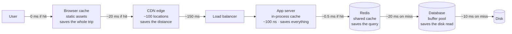

# Day 101 · System Design — Caching: the single biggest win

**After today you can:** You can place a cache at four different layers and say what each one saves.

**The interviewer asks it as:** *Where would you put a cache in this system?*

---

## 1. What this is, and why they ask it

A **cache** is a small, fast copy of data you have already fetched or computed, kept somewhere closer so
that the next request for it does not have to do the work again.

Three sentences. The reason it works is not cleverness — it is the
[latency table](../day-097-recursion-revision/README.md): memory is about a thousand times faster than a
disk and about a million times faster than a request across the world, so keeping a copy one layer up is
an enormous win for almost no effort. The reason it works *in practice* is that real access patterns are
extremely uneven: a few percent of your data serves most of your requests, which is why a small cache
achieves a 90 percent hit rate. And the reason it is dangerous is that a cache is a **second copy of the
truth**, which can disagree with the first.

They ask it because it is the highest-leverage change in most systems, and because "add a cache" is the
answer candidates reach for without being able to say **where**, **what the hit rate would be**, or
**what happens when it is wrong**. The good answer names a layer, gives a hit rate, does the arithmetic
for what reaches the database afterwards, and states the staleness the design is accepting.

---

## 2. The story

The land records office had one clerk at the counter and one storeroom at the back, and the storeroom
was up a half-flight of stairs and along a corridor.

Bhaskar had been at the counter for nine years. A person came, gave a survey number, and he went and got
the file. Forty seconds there, some time looking, forty seconds back. Call it two minutes if the file was
where it should be, and considerably longer if it was not.

Somewhere around his third year he noticed something that changed how he worked.

It was the same files. Not roughly the same — the same. There were about eleven thousand files in that
room and on any given day he fetched maybe sixty, and forty-five of those sixty were from a set of about
twenty files that came up again and again. Two large layouts near the highway that were being subdivided
and sold in pieces, a temple trust property with a dispute running, and a handful of others.

So he stopped putting those back.

He kept them in the drawer of his own desk. Twenty files, and when somebody asked for one of them he had
it open before they had finished saying the number.

The effect was much larger than he expected. He had thought he would save some walking. What actually
happened was that the queue stopped forming. Three out of four people were now dealt with in fifteen
seconds instead of two minutes, so the one person who did need a walk to the storeroom did not have six
people building up behind him while Bhaskar was gone.

There were two problems and he had to solve both.

The drawer only held about twenty-five files, so when a new one became busy he had to take something out.
He used the obvious rule: whatever he had not been asked for in the longest time went back.

And the other problem was the serious one. In his fourth year, a correction was made to one of the
highway files — a subdivision registered, the entry updated in the storeroom copy. His drawer copy said
the old thing. He gave out the old thing for eleven days, to four different people, and one of those
people acted on it.

After that he had a rule. Any file that got touched, he took out of the drawer that same day, whether or
not the drawer was full. He would rather walk to the storeroom than be confidently wrong.

---

## 3. The idea in plain English

Bhaskar has built a cache, and he met both of its problems in the right order: eviction, and then the
one that actually hurts.

- The storeroom is the **origin** — the source of truth. Slow, complete, correct.
- The desk drawer is the **cache**. Small, fast, and a *copy*.
- Finding the file in the drawer is a **cache hit**. Having to walk is a **cache miss**.
- Three out of four is a **hit rate** of 75 percent.
- "Whatever I have not been asked for in the longest time goes back" is **LRU eviction** — least recently
  used, from [day 076](../day-076-lru-cache/README.md).
- Removing a file when it changes is **invalidation**, and the eleven days is **staleness**.

### Why it works: the two facts underneath

**Fact one — the layers are orders of magnitude apart.**

```
 in-process memory                  ~100 nanoseconds
 a cache on another machine (Redis) ~0.5 milliseconds     5,000× slower
 a database query hitting disk      ~10 milliseconds     20× slower again
 a request across the world         ~150 milliseconds    15× slower again
```

**Fact two — access is extremely uneven.** Real traffic follows something close to a power law: a small
fraction of the items get most of the requests. That is why a cache holding one percent of the data can
serve ninety percent of the requests, and it is the fact that makes the whole technique viable.

```
 typical consumer product
   top 1% of items      ->  ~50% of requests
   top 10% of items     ->  ~90% of requests
```

**If access were uniform, caching would barely work.** Say that when you justify a hit rate — it shows
you know the assumption you are relying on.

### The hit-rate arithmetic, which is the number to produce

```
 effective latency  =  hit_rate × cache_time  +  (1 − hit_rate) × origin_time
```

With a 0.5 ms cache and a 20 ms database:

```
 hit rate 0%     0.0 × 0.5  +  1.00 × 20  =  20.0 ms
 hit rate 50%    0.5 × 0.5  +  0.50 × 20  =  10.3 ms
 hit rate 90%    0.9 × 0.5  +  0.10 × 20  =   2.5 ms
 hit rate 95%    0.95 × 0.5 +  0.05 × 20  =   1.5 ms
 hit rate 99%    0.99 × 0.5 +  0.01 × 20  =   0.7 ms
```

**Going from 90 to 95 percent halves the latency**, because what remains is almost entirely the misses.
That is the non-obvious shape of the curve and it is worth saying: **at high hit rates, the misses are
the whole cost**, so a small improvement in hit rate is a large improvement in latency.

And the load side, which matters more:

```
 6,000 reads/second, hit rate 90%
   -> 600/second reach the database        a 10× reduction
 hit rate 95%
   -> 300/second                           a 20× reduction
```

**One number, one order of magnitude off the database.** That is why "add a cache" is the first answer to
almost every read-heavy scaling problem.

### The four layers, and what each one saves

This is the answer to "where would you put a cache", and there are four right answers, not one.

| Layer | Where it lives | What it saves | Typical TTL |
|---|---|---|---|
| **Browser / client** | the user's device | the entire network round trip | minutes to a year, for static assets |
| **CDN / edge** | ~100 locations worldwide | the distance to your servers | minutes to days |
| **Application** | in the server process, or Redis | the database query and the computation | seconds to minutes |
| **Database** | the buffer pool | the disk read | managed automatically |

**Name all four, then say which one this system needs.** Candidates who say "I'd put Redis in front of
the database" have given one of four answers and usually not the biggest one — for a media-heavy product
the CDN saves far more.

Within the application layer there are two sub-choices, and the difference is real:

**In-process cache** — a dictionary in the server's own memory. Roughly 100 nanoseconds, no network at
all. But every server has its own, so they can disagree, and each one warms up separately after a
deploy. **Good for small, rarely-changing data**: feature flags, configuration, a currency table.

**Shared cache (Redis, Memcached)** — one logical cache all servers share. About half a millisecond, one
copy of the truth, survives a deploy. **The default for anything user-specific or frequently written.**

### What to cache, and what not to

**Cache it if** it is read far more than written, expensive to produce, and tolerable slightly stale.

**Do not cache** anything where a stale answer is a wrong answer with consequences: a bank balance at the
moment of a transfer, an inventory count at the moment of purchase, a permission check.
[Yesterday's](../day-100-dfs-traversals/README.md) rule generalises: **a cache miss must make the answer
slow, never wrong.**

The read-to-write ratio is the number that decides it:

```
 100:1 or higher      cache aggressively
 10:1                 cache with a short TTL
 1:1                  a cache mostly adds work — every write invalidates
 write-heavy          do not cache the data; cache derived views if anything
```

### The key is a design decision

```
 user:12345:profile              one user's profile
 feed:12345:page:1               one page of one user's feed
 product:987:price:INR           price, per currency
```

Three rules that come up:

- **Include everything the value depends on.** A price cached without the currency, or a page cached
  without the page number, serves the wrong thing to somebody.
- **Do not include anything it does not depend on.** A key with a timestamp in it never hits.
- **Namespace it**, so you can find and clear a family of keys, and so two features cannot collide.

### The three problems every cache has

**Staleness.** The copy disagrees with the truth. You control it with a TTL and with invalidation, and
[tomorrow](../day-102-height-and-diameter/README.md) is entirely about that.

**Eviction.** The cache is smaller than the data, so something must go. LRU by default —
[day 076](../day-076-lru-cache/README.md).

**The stampede.** A popular key expires and a thousand requests all miss at the same instant and all hit
the database at once. This is the failure that turns a cache into an outage, and it has a name and a
fix:

```
 popular key expires at t=0
   -> 1,000 in-flight requests all miss
   -> 1,000 identical database queries
   -> the database, sized for 600/s, gets 1,600 in one second
```

**The fix is a lock per key**: the first request to miss takes a short lock and does the work; the rest
either wait for it or briefly serve the stale value. That, plus **jittered TTLs** so a thousand keys
written at the same moment do not all expire at the same moment. You met this as *cache stampede* on
[day 090](../day-090-recursion-on-arrays/README.md).

---

## 4. The picture

The four layers, and what each one removes from the path.



What to notice: **each layer removes everything to its right.** A browser hit costs nothing at all; a CDN
hit costs 20 ms instead of 150; a Redis hit costs 0.5 ms instead of 20. The further left the hit, the
more of the path disappears.

The hit-rate curve, drawn, because its shape is the surprising part:

```
 effective latency, 0.5 ms cache, 20 ms origin

 20 ms |*
       |  *
 15 ms |     *
       |        *
 10 ms |           *
       |              *
  5 ms |                  *
       |                      *
  2 ms |                          *  *
  0 ms |                                *  *  *
       +--------------------------------------------
       0%   20%   40%   60%   80%   90%  95%  99%

 the curve is nearly flat until ~70%, then falls off a cliff.
 0 -> 50%   saves  9.7 ms
 90 -> 95%  saves   1.0 ms   (but HALVES the remaining latency)
 90 -> 95%  also HALVES the database load: 600/s -> 300/s
                                            ^^^ usually the point
```

Bhaskar's drawer, as the same arithmetic:

```
 storeroom trip   ~120 seconds
 drawer           ~15 seconds
 hit rate          45 of 60  =  75%

 before:  60 × 120 s                          = 7,200 s of walking per day
 after:   45 × 15 s  +  15 × 120 s            = 675 + 1,800 = 2,475 s
                                                 ^ a 66% reduction

 and the effect he did NOT predict: the queue.
 with 15 fetches a day instead of 60, the one person who needs a walk
 no longer has six people waiting behind him.
```

The stampede, drawn, because it is the failure mode:

```
 normal:     ────────────────────────── 600 req/s to the DB (10% of 6,000)

 key expires at t=0:
             ┌─ 1,000 concurrent requests all miss ─┐
 t=0    ─────┤                                      ├──────────
             │  1,000 identical queries in ~50 ms   │
             └──────────────────────────────────────┘
                          ^ the database sized for 600/s
                            receives 20,000/s for a moment

 fix 1: per-key lock — the first miss fetches, the rest wait (or serve stale)
 fix 2: jittered TTL — expiry ± 10%, so a thousand keys do not expire together
 fix 3: refresh before expiry — at 90% of the TTL, refresh in the background
```

---

## 5. How it actually works

### The read path, in two patterns

**Cache-aside (lazy loading)** — the application does the work. This is the default and what to describe
unless asked otherwise.

```python
    value = cache.get(key)
    if value is None:                       # miss
        value = database.query(...)
        cache.set(key, value, ttl=300)
    return value
```

Three properties worth stating: **only requested data is ever cached**, so the cache stays relevant; the
application controls the key and the TTL; and **a cache failure degrades to slow rather than broken**,
because the code path still works with the cache returning nothing.

**Read-through** — the cache itself fetches on a miss. Cleaner application code, and it makes the cache a
mandatory component: if it is down, nothing works.

**The distinction to say out loud: with cache-aside, the cache being down means the system is slow. With
read-through, it means the system is down.**

### The write path, which is where designs differ

Three options, and interviewers ask you to choose.

**Write-through** — write to the cache and the database together, synchronously.

```
 + the cache is never stale
 - every write pays both costs
 - caches data that may never be read
```

**Write-around** — write to the database only, and invalidate the cache entry.

```
 + no wasted cache space for write-once data
 - the next read is a miss
 -> the usual default for most systems
```

**Write-back (write-behind)** — write to the cache and flush to the database later.

```
 + very fast writes, and repeated writes to one key collapse into one
 - DATA LOSS if the cache dies before the flush
 -> only for data you can afford to lose: counters, view counts, last-seen timestamps
```

**Tomorrow is this in full.** For today: **write-around by default, write-through when reads follow
writes immediately, write-back only for data whose loss is acceptable.**

### Sizing a cache

The question "how big should it be?" has a real answer:

```
 1. what is the working set?  — the data actually requested in a window
 2. what hit rate do you want? — 90% typically needs the top ~10% of items
 3. size = (items × bytes per item) × the fraction you need
```

Worked:

```
 10,000,000 user profiles × 2 KB     = 20 GB total
 90% of reads hit the top 10%        = 1,000,000 profiles
 cache size for a 90% hit rate       = 1,000,000 × 2 KB  =  2 GB
```

**Two gigabytes for a 90 percent hit rate on twenty gigabytes of data.** That number — cache a tenth of
the data, serve nine-tenths of the traffic — is the shape to carry, and it comes straight from the
unevenness of access.

### What real systems use

- **Redis** and **Memcached** for the shared application cache. Redis has data structures, persistence,
  and replication; Memcached is simpler and purely a cache. **Redis is the default answer** and it is
  fair to say so.
- **CDNs** — Cloudflare, Akamai, CloudFront, Fastly — for anything static and anything media. **This is
  usually the biggest single win in a consumer product** and it is the layer candidates most often skip.
- **Database buffer pools** — PostgreSQL's shared buffers, MySQL's InnoDB buffer pool — cache disk pages
  in memory automatically. Sizing this correctly is often worth more than adding Redis, and it is free.
- **HTTP caching headers** — `Cache-Control`, `ETag`, `Last-Modified` — are how you use the browser and
  CDN layers at all. Getting these right is the cheapest performance work available.
- **Facebook's memcached deployment** is the canonical published example of application caching at scale,
  and the paper is where much of the standard vocabulary — leases for stampede protection, cold cluster
  warm-up — comes from.

---

## 6. The numbers

### The layers, in time

```
 in-process dict lookup            ~100 ns
 Redis, same data centre           ~0.5 ms          5,000× the dict
 database, index hit in memory     ~1 ms
 database, hitting disk            ~10 ms
 CDN edge hit                      ~20 ms
 origin across a continent         ~150 ms
```

### Load reduction, which is the real argument

```
 6,000 read QPS at the application

 hit rate    reaches the database    reduction
 --------    -------------------     ---------
   0%             6,000/s               1×
  50%             3,000/s               2×
  80%             1,200/s               5×
  90%               600/s              10×
  95%               300/s              20×
  99%                60/s             100×
```

**At 90 percent you have turned "we need to shard the database" into "one database is fine".** That is
the sentence that connects caching to [day 098](../day-098-what-a-tree-is/README.md).

### Cost

```
 a managed Redis instance, ~13 GB           ~₹20,000 - 30,000 / month
 a database instance able to serve
   6,000 QPS instead of 600                 several times that, plus replicas
 CDN bandwidth                              ~₹1 - 7 per GB, and it REPLACES
                                             your own egress at a similar or
                                             higher rate
```

**The cache is almost always cheaper than the capacity it removes.** Worth saying, because it makes the
decision a business argument rather than a preference.

### Memory sizing, worked twice

```
 SESSIONS
   1,000,000 active × 1 KB                = 1 GB

 USER PROFILES
   10,000,000 × 2 KB total                = 20 GB
   cache the hot 10%                      = 2 GB for a ~90% hit rate

 RENDERED FEED PAGES
   1,000,000 active users × 20 KB         = 20 GB
   -> too big; cache the ID LIST instead:
      1,000,000 × 20 ids × 8 B            = 160 MB
   -> then hydrate the items from a second, much smaller cache
```

**That third one is a real design move**: cache identifiers rather than rendered content, because the ids
are two orders of magnitude smaller and the items are shared between many users' feeds.

### TTL, and what it is really choosing

```
 TTL       max staleness      refreshes/day for one key    DB load per key
 ------    ---------------    -------------------------    ---------------
 10 s      10 s               8,640                        high
 60 s      1 min              1,440
 5 min     5 min              288
 1 hour    1 hour             24
 1 day     1 day              1                            negligible
```

**The TTL is a dial between staleness and database load, and nothing else.** Choosing it is choosing how
wrong you are willing to be, in seconds — and saying it that way is much better than "I'd use five
minutes".

### The stampede, in numbers

```
 one popular key, 1,000 requests in flight when it expires
   without protection:  1,000 identical queries in ~50 ms  =  20,000 QPS burst
   with a per-key lock:     1 query; 999 wait ~20 ms or serve stale

 1,000 keys all written at the same moment with a 300 s TTL
   without jitter:  all 1,000 expire in the same second
   with ±10% jitter: spread over 60 seconds
```

---

## 7. The trade-offs

### Every cache is a second copy of the truth

That is the whole trade, and everything else follows from it. You are buying latency and load reduction
with **correctness risk**, and the currency is seconds of staleness.

**I would not cache** a value where being briefly wrong causes an irreversible action: a balance being
debited, the last unit of stock being sold, a permission being checked. For those, the cache can hold the
*display*, never the *decision* — the same distinction as
[day 095's](../day-095-n-queens/README.md) auction price.

### In-process or shared?

**In-process** is a thousand times faster and needs no network. It costs you consistency between servers
— ten servers can hold ten different values for up to the TTL — and a cold start after every deploy.
**Use it for small, slow-changing, non-user-specific data**: feature flags, configuration, a country list.

**Shared (Redis)** is one copy, survives deploys, and can be invalidated centrally. It costs half a
millisecond and it is a dependency on the request path. **Use it for everything user-specific.**

Many systems run both — a small in-process cache in front of Redis — which multiplies the layers and
also multiplies the invalidation problem.

### A high hit rate is not automatically good

A 99 percent hit rate on data that changes every second means you are serving stale answers 99 percent of
the time. **Hit rate measures how often you avoided work, not how often you were right.** Report it
alongside the staleness the TTL permits.

### Caching makes failures stranger

- **A cache that is down** turns into a load spike on the origin at exactly the moment you least want
  one. That is why the fallback matters: cache-aside degrades to slow, read-through degrades to broken.
- **A cache that is up but empty** — after a restart or a deploy — is the same spike. Large deployments
  warm caches before taking traffic for exactly this reason.
- **A poisoned cache** serves a wrong value fast, to everybody, until the TTL expires. The debugging
  experience is memorable: the database is right, the code is right, and the answer is wrong.

### Where this design breaks

- **Write-heavy data.** If every write invalidates, the cache spends its time being cleared, and you have
  added latency for nothing.
- **Personalised content.** A cache key per user means the hit rate collapses, because each user has
  their own entries and each is read rarely. The fix is to cache the shared parts and assemble per user.
- **Unbounded key space.** Caching search results by query string means most keys are never read twice —
  a hit rate close to zero and a cache full of rubbish. Cache the popular queries only, or nothing.
- **The stampede** is the failure that converts a cache from a benefit into an outage, and it needs an
  explicit answer.

---

## 8. In the interview

### How it gets asked

- The open one: *"Where would you put a cache in this system?"*
- The number one: *"What hit rate would you expect, and what does the database see afterwards?"*
- The correctness one: *"What happens when the underlying data changes?"* — which is tomorrow.
- The failure one: *"Your cache goes down. What happens?"*
- The nasty one: *"A very popular item's cache entry expires. What happens?"*

### What to say out loud, in the first ninety seconds

1. **Name all four layers, then choose.** "There are four places: the browser, the CDN, the application —
   in-process or Redis — and the database's own buffer pool. For a media-heavy product the CDN is the
   biggest win; for this one I think the application layer is."
2. **Justify it with the read-to-write ratio.** "This is read-heavy, roughly fifty reads per write, so a
   cache is the first thing I would add."
3. **Give a hit rate with a reason.** "I would expect around ninety percent, because access is very
   uneven — the top ten percent of items typically serve ninety percent of requests. If access were
   uniform, caching would barely help, and I would want to check that assumption."
4. **Do the load arithmetic.** "At six thousand reads a second and a ninety percent hit rate, six hundred
   reach the database — a tenfold reduction, which is the difference between needing to shard and not."
5. **Say the TTL as a staleness decision.** "A sixty-second TTL means I am accepting up to a minute of
   staleness for this data. The TTL is a dial between how wrong I am willing to be and how much load the
   database takes."
6. **Pre-empt the stampede.** "One thing I would build in: a per-key lock on a miss, and jittered TTLs.
   Otherwise a popular key expiring sends every in-flight request to the database at the same instant."

### The follow-ups

**"What hit rate would you expect, and why?"**
"Around ninety percent for something like user profiles or product pages, and the reason is the shape of
the access pattern rather than the size of the cache. Real traffic is very uneven — the top one percent
of items typically serves about half the requests and the top ten percent serves about ninety. So caching
a tenth of the data gets me nine-tenths of the traffic: twenty gigabytes of profiles, two gigabytes of
cache, ninety percent hits. The assumption I am relying on is that unevenness, and I would say so — if
access were uniform, a cache holding ten percent of the data would give a ten percent hit rate and would
not be worth having. The load effect is the part I care about: at six thousand reads a second, ninety
percent means six hundred reach the database, and going to ninety-five percent halves that again. At high
hit rates the misses are essentially the entire cost, which is why the last few percent are worth
chasing."

**"Your cache goes down. What happens?"**
"That depends on which pattern I used, and it is worth being explicit. With **cache-aside** — the
application checks the cache, and on a miss queries the database and populates it — a cache failure looks
exactly like a hundred percent miss rate. The system still works and it is slow. With **read-through**,
where the cache fetches on my behalf, a cache failure means the system is down. So I would use
cache-aside. But 'still works' has a catch: the database was sized for six hundred queries a second and
is suddenly getting six thousand, so it may not survive. The mitigations are a circuit breaker in front
of the database, request coalescing so identical concurrent queries become one, and — for the important
paths — a small in-process cache as a second line, which cannot be taken out by the same failure. The
same spike happens after a cache restart with an empty cache, which is why large systems warm caches
before taking traffic."

**"A very popular item's cache entry expires. What happens?"**
"That is the **cache stampede**, and it is the failure that turns a cache into an outage. At the instant
it expires, every in-flight request for that key misses, and they all issue the same database query. A
thousand concurrent requests becomes a thousand identical queries in about fifty milliseconds — a
twenty-thousand-per-second burst against a database sized for six hundred. Three fixes and I would use
the first two by default. **A per-key lock**: the first request to miss takes a short lock and does the
fetch, and the others either wait for it or serve the slightly stale value. **Jittered TTLs**: add ten
percent randomness, so a thousand keys written in the same second do not all expire in the same second.
And optionally **refresh ahead**: at ninety percent of the TTL, refresh in the background so the entry
never actually expires under load."

**"Where exactly would you put it — you said four layers."**
"I would work from the outside in, because the outer layers save more. **Browser and CDN** first, for
anything static or media — images, scripts, video. That removes the request entirely rather than making
it faster, and for a media-heavy product it is by far the biggest win and the one people skip.
**Application cache** next, for query results and computed values; Redis if the data is user-specific or
changes, in-process if it is small and slow-changing like feature flags. **Database buffer pool** last,
and it is free — sizing it so the working set fits in memory is often worth more than adding Redis and
costs nothing but a configuration change. The mistake I want to avoid is saying 'put Redis in front of
the database' as though that is the only option, when the CDN might remove ten times as much traffic."

**"What would you not cache?"**
"Anything where a stale answer is a wrong answer with consequences. A bank balance at the moment a
transfer is authorised. Stock level at the moment of purchase. A permission check. The rule I use is that
**a cache miss must make the answer slow, never wrong** — and the corollary is that a cache can hold the
*display* value while the *decision* reads the truth. Showing 'in stock' from a cache is fine; deciding
whether to accept the order is not. Beyond correctness, I would not cache write-heavy data, because every
write invalidates and the cache spends its life being cleared; and I would not cache things with an
unbounded key space, like search queries, because most keys are read once and the hit rate is close to
zero."

**"How would you choose the TTL?"**
"By deciding how stale I am willing to be, and then reading the load off that — the TTL is a dial between
those two and nothing else. A product's price might tolerate five minutes; a user's own profile after
they edit it tolerates zero, so that one I would invalidate on write rather than time out. A ten-second
TTL on one key means 8,640 refreshes a day; an hour means twenty-four. I would also say what I would
measure: hit rate and staleness together, because a ninety-nine percent hit rate on data that changes
every second means I am confidently wrong almost all the time. Hit rate measures avoided work, not
correctness."

### A model answer

Asked: *where would you put a cache in this system?*

> "There are four places, and I want to name all of them before choosing, because they save very
> different amounts.
>
> **The browser**, for static assets — that removes the request entirely rather than making it faster.
> **A CDN**, which puts a copy at about a hundred locations worldwide; for anything media-heavy this is
> usually the single biggest win, because it saves the distance, and no server optimisation can fix
> distance. **The application layer** — either in the server process or in a shared Redis — which saves
> the database query and any computation. And **the database's own buffer pool**, which caches disk pages
> in memory and is free: sizing it so the working set fits is often worth more than adding Redis.
>
> For this system, which is read-heavy at roughly fifty reads per write, I would put the main cache at the
> application layer, in Redis, using **cache-aside**: check the cache, and on a miss query the database and
> populate it. I choose cache-aside over read-through deliberately, because with cache-aside a cache
> failure makes the system **slow**, and with read-through it makes it **down**.
>
> On the numbers. I would expect about a ninety percent hit rate, and the reason is the access pattern
> rather than the cache size: real traffic is very uneven, with the top ten percent of items typically
> serving ninety percent of requests. So twenty gigabytes of profiles needs about two gigabytes of cache
> for ninety percent hits. That assumption is worth stating — if access were uniform, this would not work
> at all.
>
> The effect I care about is on load rather than latency. At six thousand reads a second, ninety percent
> means **six hundred reach the database** — a tenfold reduction, and that is the difference between
> needing to shard and one database being comfortable. Going to ninety-five percent halves it again, and
> that is the shape worth knowing: at high hit rates the misses are essentially the entire cost.
>
> The TTL I would treat as a staleness decision rather than a performance one. Sixty seconds means I am
> accepting up to a minute of being wrong on this data. For anything a user changes about themselves I
> would invalidate on write instead, because 'I saved it and it did not change' is the worst possible
> version of staleness.
>
> Two things I would build in from the start. **Per-key locking on a miss**, so that when a popular key
> expires, one request does the fetch and the others wait or serve stale — otherwise a thousand in-flight
> requests become a thousand identical queries in fifty milliseconds and take the database down. And
> **jittered TTLs**, so a batch of keys written in the same second does not expire in the same second.
>
> And one thing I would not cache: anything where being briefly wrong causes an irreversible action.
> Stock levels can be cached for *display* and must be read from the truth for the *decision*."

---

## 9. Recall card

- **A cache works because of two facts: the layers are orders of magnitude apart** (memory ~100 ns, Redis
  ~0.5 ms, DB ~20 ms, cross-world ~150 ms) **and access is extremely uneven** — the top 10% of items serve
  ~90% of requests. **If access were uniform, caching would barely work** — say that assumption aloud.
- **Four layers, not one: browser · CDN · application (in-process or Redis) · database buffer pool.** Work
  outside in; for media-heavy products the **CDN is the biggest win** and the one candidates skip. The
  buffer pool is **free**.
- **Do the load arithmetic, not just latency: 6,000 reads/s at a 90% hit rate leaves 600/s on the
  database — 10×, the difference between sharding and not.** 95% halves it again, because **at high hit
  rates the misses are the entire cost**. Sizing: cache ~10% of the data for ~90% hits (20 GB → 2 GB).
- **Use cache-aside**: on a miss, query and populate. Then **a cache failure makes the system slow, not
  broken** — read-through makes it broken. Write path: **write-around by default**, write-through when
  reads follow writes, **write-back only for data you can afford to lose**.
- **The TTL is a dial between staleness and load, and nothing else.** And **the stampede is the failure
  that turns a cache into an outage** — a popular key expires, 1,000 in-flight requests issue 1,000
  identical queries in 50 ms. Fix with a **per-key lock** and **jittered TTLs**. Finally: **a cache miss
  must make the answer slow, never wrong** — cache the *display*, never the *decision*.
