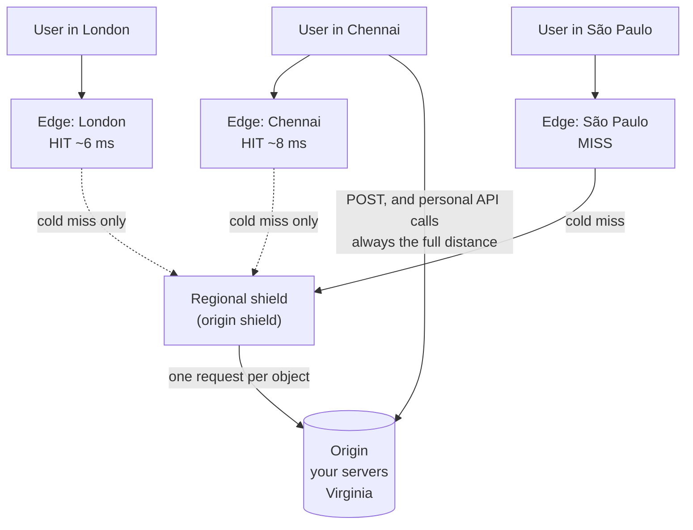

# Day 103 · System Design — Content delivery networks

**After today you can:** You can say what a CDN caches, where it sits, and what it cannot help with.

**The interviewer asks it as:** *Would a CDN help this system? What would it not help with?*

---

## 1. What this is, and why they ask it

A **content delivery network** is a set of caches placed in hundreds of cities around the world, in
front of your servers. A user's request goes to the nearest one, and if it has the content, that is the
end of the journey — your servers never hear about it.

Three sentences. It exists because of one number from [day 097](../day-097-recursion-revision/README.md):
**a round trip from Mumbai to Virginia is about 200 milliseconds of pure distance**, and no amount of
faster code removes it. It works because most of the bytes a typical site sends are the same for
everybody — images, video, scripts, stylesheets — so one copy near the user serves thousands of people.
And its limits are exactly the mirror of that: **anything personal, anything that changes on every
request, and anything that writes** has to come from your servers.

They ask it because it is usually the single biggest performance win available, and because candidates
who have only read about caching put Redis in front of the database and stop there. For a media-heavy
product the CDN removes **more than ninety percent of the bytes** before Redis is even consulted. The
follow-up — *"what would it not help with?"* — is the one that separates people who have used one from
people who have heard of one.

---

## 2. The story

The paper had been printed in Chennai since 1953, and for Madurai that meant the lorry.

It left the press at about half past one in the morning and if everything went well it was in Madurai by
half past six. The bundles were dropped at the agent's, the boys sorted them, and the first houses got
their paper around eight. In Chennai people had been reading it since six.

There were other problems besides the time. If it rained badly on the Trichy road the paper did not
arrive at all. Twice a year the lorry broke down and an entire district got nothing, and the phone at the
office rang all morning.

In 1994 they set up a press in Madurai, and one in Coimbatore the year after.

The thing that people outside the business assumed was that the Madurai press wrote its own paper. It did
not. The paper was still written and laid out in Chennai. What went down the wire at midnight was the
**pages** — the finished layout — and the Madurai press printed from that.

So the writing happened once, in one place, and the printing happened in three places, near the people
reading it. Madurai got its paper at half past five in the morning instead of eight, and a lorry
breaking down stopped mattering.

Two things did not get solved by it, and the editor was clear about both.

The first was that the local pages — the Madurai city section, with the local advertisements and the
school results — could not be prepared in Chennai. Those were genuinely different for each city, so each
press had to have somebody doing them. You cannot print the same thing everywhere if the thing is not the
same everywhere.

The second was worse, and it happened in 1997. A court order came at four in the morning saying a
particular story had to be pulled. Chennai stopped its press in about ten minutes. Getting Coimbatore and
Madurai to stop took nearly an hour of phone calls, and by then a few thousand copies were already on
bicycles.

After that they had a rule about anything legally sensitive: hold it for one edition. Not because the
presses were slow, but because **once a thing has been sent out to three cities, calling it back is a
different and much harder job than never sending it.**

---

## 3. The idea in plain English

The regional presses are a CDN, and the editor's two problems are exactly the two limits of one.

- Chennai is the **origin** — your servers, the source of truth.
- The Madurai and Coimbatore presses are **edge locations**, also called **PoPs** (points of presence).
- Sending the finished pages down the wire is **origin pull**: the edge fetches from the origin on
  demand.
- The paper arriving at 5:30 instead of 8 is the **latency** saved.
- The lorry breaking down no longer mattering is the **availability** and **origin offload** benefit.
- The local city pages are **personalised content**, which a shared cache cannot serve.
- The court order at four in the morning is a **purge**, and its difficulty is the reason for
  **cache-busting URLs**.

### Why it exists: distance is not an engineering problem

```
 Mumbai to Virginia          ~13,000 km
 light in fibre              ~200,000 km/s  (about 2/3 of light in vacuum)
 one way                     ~65 ms
 round trip                  ~130 ms
 real routes are not straight, and there are hops:  ~180-220 ms in practice
```

**No server optimisation touches that number.** A page that makes four sequential requests pays it four
times — nearly a second before any computation. The only fix is to be closer, and being closer means
having a copy somewhere else.

```
 same city / same country edge      ~5-20 ms
 same continent                     ~30-50 ms
 across the world                   ~150-220 ms
```

### What actually goes over the wire

The reason a CDN is such a large win is the **byte** split, not the request split:

```
 a typical page load
   HTML (personal, changes)                 ~30 KB      2%
   JavaScript, CSS (identical for all)     ~500 KB     25%
   images (identical for all)             ~1,400 KB    70%
   API responses (personal)                 ~50 KB      3%
   ----------------------------------------------------
   total                                  ~2,000 KB

 CDN-servable                             ~1,900 KB    95% of the bytes
 must come from origin                      ~100 KB     5%
```

**Ninety-five percent of the bytes and typically seventy to eighty percent of the requests.** That is why
this layer is the biggest win in the [four-layer picture](../day-101-bfs-level-order/README.md), and why
"put Redis in front of the database" is answering a smaller question.

### How content gets to the edge

**Pull (origin pull)** — the default and what to describe. The first user in a city requests something,
the edge does not have it, so it fetches from the origin, keeps a copy, and serves everybody after that.

```
 + nothing to manage; content appears where it is needed
 + you never push things nobody wants
 - the FIRST user in each city pays the full origin latency (a "cold miss")
 - with ~300 locations, up to 300 cold misses per object
```

**Push** — you upload content to the CDN ahead of time. Used for large predictable objects: a game
patch, a film release, a software update where the first-user penalty would be unacceptable.

**Tiered caching / origin shield** — the fix for the cold-miss problem. Edges do not go to the origin
directly; they go to a regional parent cache, and only that parent talks to the origin.

```
 without a shield:  300 edges × 1 cold miss each  =  300 origin requests per object
 with a shield:     300 edges -> ~10 regional parents -> 1 origin request
```

**This is the detail that shows you have run one.** Without it, a popular new object causes a 300-fold
burst at the origin — a stampede at a different scale.

### How the edge knows when to let go

The rules travel with the response, as HTTP headers.

```
 Cache-Control: public, max-age=31536000, immutable
     public       any shared cache may store it
     max-age      seconds the BROWSER keeps it
     immutable    never revalidate; the content will never change at this URL

 Cache-Control: private, no-store
     private      only the user's browser, never a shared cache
     no-store     do not keep it at all

 Cache-Control: public, s-maxage=300, max-age=0
     s-maxage     the CDN keeps it 5 minutes; the browser keeps it 0
     -> the CDN absorbs the load, the user always revalidates
```

**`s-maxage` is the one worth knowing by name** — it lets you cache hard at the edge while keeping the
browser honest, which is exactly what you want for HTML that changes.

And revalidation, so that an unchanged object costs almost nothing:

```
 ETag: "a3f9c2"                    a fingerprint of the content
 client: If-None-Match: "a3f9c2"
 server: 304 Not Modified          ~200 bytes instead of the whole file
```

### The two things it cannot do — and the answer to the follow-up

**One: personalised content.** If the response differs per user, a shared cache has nothing to share. The
edge would need one copy per user, which is not a cache — it is storage with extra steps.

The standard fix is **to split the page**: serve a cacheable shell from the edge and fetch the personal
parts separately. That is why the modern shape is a static HTML shell plus an API call, rather than a
server-rendered page with the user's name baked in.

**Two: writes.** A `POST` cannot be cached, by definition — it has an effect. Every write travels the
full distance to the origin.

That leads to the asymmetry worth stating: **a CDN makes a read-heavy product feel local and does nothing
for a write-heavy one.** A photo-sharing app is transformed; a collaborative editor is not.

There is a real modern exception, and mentioning it is a good signal: **edge compute** — Cloudflare
Workers, Lambda@Edge — runs your code at the edge, so some personalisation and some logic can happen
there without a trip to the origin. It does not change the physics for writes, which still need the
origin, but it moves the "assemble the personal bits" step much closer.

### Cache keys, and the mistake everyone makes

The edge keys on the URL, **including the query string**. So:

```
 /image.jpg                        one cached object
 /image.jpg?utm_source=twitter     a DIFFERENT cached object, same bytes
 /image.jpg?utm_source=facebook    a third
 /image.jpg?t=1717171717           a fourth, and it will never be requested again
```

**Marketing parameters silently destroy hit rates**, because every share link creates a new cache key for
identical content. Every CDN lets you strip or allow-list query parameters, and doing so is often the
single largest hit-rate improvement available on a real site.

The same applies to `Vary`: `Vary: Accept-Encoding` is normal and doubles the entries. `Vary: User-Agent`
multiplies them by thousands and effectively disables caching.

### Invalidation: purge, or rename

From [yesterday](../day-102-height-and-diameter/README.md): explicit invalidation is hard. At the edge it
is harder, because there are hundreds of copies.

```
 PURGE   an API call telling every location to drop a URL
         takes seconds to a minute to propagate
         rate-limited by every provider
         -> the court order at four in the morning
```

**The standard practice is not to purge at all.** Instead, put a fingerprint in the file name:

```
 app.js          ->  app.a3f9c2.js
 style.css       ->  style.7b21e4.css
```

A new build produces a new name, which is a new cache key, which needs no invalidation — and lets you set
`max-age` to a year. **A new name is a new object. Nothing has to be recalled.** That is the
versioned-key idea from yesterday, applied at the edge, and it is why every modern build tool hashes
filenames.

---

## 4. The picture

Where it sits, and what never reaches you.



What to notice: **the dotted arrows are rare and the solid ones are common.** And the bottom arrow —
writes and personal data — bypasses the whole thing and pays the full 200 ms, every time.

The latency, drawn:

```
 WITHOUT a CDN                          WITH a CDN

 user (Chennai)                         user (Chennai)
   │                                      │
   │ ~200 ms round trip                   │ ~8 ms round trip
   │ × every asset                        │ × every asset
   ▼                                      ▼
 origin (Virginia)                      edge (Chennai)
                                          │  only on a cold miss
                                          ▼
                                        origin (Virginia)

 a page with 4 sequential round trips:
   without:  4 × 200 ms  =  800 ms before anything renders
   with:     4 ×   8 ms  =   32 ms
```

The byte split, which is the real argument:

```
 a 2 MB page load

 ████████████████████████████████████░  images + JS + CSS   1,900 KB  (95%)  ← CDN
                                     █  HTML + API             100 KB  ( 5%)  ← origin

 origin bandwidth without a CDN:  2,000 KB × every user
 origin bandwidth with a CDN:       100 KB × every user     a 20× reduction

 at 100,000 page loads/hour:
   without:  200 GB/hour of egress from your servers
   with:      10 GB/hour
```

Cold misses, with and without a shield:

```
 WITHOUT AN ORIGIN SHIELD               WITH AN ORIGIN SHIELD

 300 edges                              300 edges
   │  │  │  ...  │                        │  │  │  ...  │
   └──┴──┴───────┘                        └──┴──┴───────┘
         │                                      │
   300 requests                           ~10 regional parents
         │                                      │
         ▼                                 1 request
     ORIGIN                                     ▼
                                            ORIGIN
 a newly published object causes
 a 300× burst at the origin
```

The query-string problem:

```
 the same 400 KB image, shared four ways:

 /photo.jpg                         key 1   ← the only one anybody needed
 /photo.jpg?utm_source=twitter      key 2
 /photo.jpg?utm_source=whatsapp     key 3
 /photo.jpg?fbclid=IwAR2x...        key 4   ← unique per SHARE. Never hits.

 hit rate on this object: ~25% instead of ~99%
 origin egress: 4× what it should be

 fix: configure the CDN to ignore utm_*, fbclid and friends in the cache key
```

---

## 5. How it actually works

### One request, end to end

```
 1. DNS lookup for cdn.example.com
      the CDN's DNS returns an address near the user,
      or ANYCAST is used: the same IP is announced from every location
      and the internet routes to the nearest one

 2. TCP + TLS handshake to the EDGE
      this is the second big win: the handshake is ~8 ms away
      instead of ~200 ms, and a handshake is 2-3 round trips

 3. the edge looks up the cache key (URL + configured query params + Vary)
      HIT  -> serve, done. Origin never involved.
      MISS -> go to the regional shield, then the origin

 4. on a miss, the edge stores the response according to Cache-Control
      and serves it

 5. subsequent requests in that city: hits
```

**Step 2 is worth calling out**, because people count only the response. A TLS handshake is two or three
round trips, so terminating it at the edge saves 400 to 600 milliseconds on a cold connection from
India to Virginia — often more than the content transfer itself.

### What to put behind it

```
 always:        images, video, fonts, CSS, JS, downloads, anything static
 usually:       API responses that are the same for everyone
                  (a product catalogue, a public feed, exchange rates)
 with care:     HTML — use s-maxage so the edge caches and the browser does not
 never:         anything with a user's data in it
                anything with Set-Cookie
                POST, PUT, DELETE
```

**The `Set-Cookie` rule is worth its own line.** Caching a response that contains a `Set-Cookie` header
serves one user's session cookie to everybody who requests that URL afterwards. It is the most serious
mistake available at this layer, and every CDN has a safeguard against it — which you can accidentally
override.

### Video, which is a different problem

Video is not one file. It is **segmented**: split into two-to-ten-second chunks, at several bitrates,
with a manifest listing them (HLS or DASH).

```
 movie.m3u8               the manifest (small, changes rarely)
 720p/segment_0001.ts     ~2 MB
 720p/segment_0002.ts
 1080p/segment_0001.ts    ~5 MB
 ...
```

Two consequences: each segment is a normal cacheable object, so a CDN serves video with no special
machinery; and **the player switches bitrate between segments**, which is why streaming adapts to a bad
connection rather than stalling. This is why video was the original driver for CDNs and remains most of
their traffic.

### Real products

- **Cloudflare** — ~300+ cities, anycast, and a free tier, which is why it appears in so many
  architectures. **Workers** is its edge-compute product.
- **Akamai** — the oldest and the largest by locations, historically ~4,000 points of presence, deep
  inside carrier networks.
- **CloudFront** (AWS), **Fastly** (known for very fast purges — seconds rather than minutes, which
  changes what you can cache), **Google Cloud CDN**.
- **Netflix Open Connect** is the interesting one: Netflix ships its own hardware to internet providers
  and pre-loads the catalogue overnight, so the film you watch is often served from a box inside your own
  ISP. That is push distribution taken to its conclusion, and it is why Netflix traffic barely touches
  the public internet backbone.

---

## 6. The numbers

### Latency

```
 origin round trip, India to US-East          ~200 ms
 edge round trip, same city                     ~8 ms
 saving per round trip                         ~192 ms

 a page needing 4 sequential round trips
   without a CDN                               ~800 ms
   with                                         ~32 ms

 plus the TLS handshake (2-3 round trips)
   without                                     ~400-600 ms
   with                                         ~16-24 ms
```

**The handshake saving is often larger than the content saving**, and it is the part candidates miss.

### Offload, which is the number to quote

```
 100,000 page loads/hour, 2 MB each

                          origin bytes/hour     origin requests/hour
 no CDN                        200 GB              ~3,000,000
 CDN, 95% byte offload          10 GB                ~700,000
                                                     (personal API calls only)
```

```
 origin bandwidth at ₹7/GB
   without:  200 GB × 24 × 30 × ₹7   =  ₹10,08,000 / month
   with:      10 GB × 24 × 30 × ₹7   =    ₹50,400 / month
   CDN cost:  190 GB × 24 × 30 × ₹1.5 ≈  ₹2,05,000 / month
   ---------------------------------------------------------
   saving                            ≈  ₹7,50,000 / month
```

**A CDN is usually cheaper than the egress it replaces**, because CDN bandwidth is bought in bulk and
priced well below cloud egress. That is a genuine argument, not a hand-wave — cloud providers charge a
premium for data leaving their network.

### Hit rate

```
 well-configured static assets       95 - 99%
 images with fingerprinted names     99%+
 HTML with s-maxage=60                60 - 90%
 anything with utm_* in the key       25 - 60%   ← the query-string problem
 personalised API responses           ~0%
```

**The gap between 99% and 60% on the same content is usually cache-key configuration**, not content.

### Cold misses and the shield

```
 300 edge locations, one new object
   no shield:      up to 300 origin requests, in a burst
   with a shield:  ~10 regional parents -> 1-10 origin requests

 a 200 MB game patch, 300 edges, no shield:
   60 GB pulled from the origin in the first minutes
```

### Purge, and why renaming wins

```
 purge propagation      seconds to ~60 s, provider-dependent
 purge rate limits      commonly a few thousand URLs per day on standard plans
 fingerprinted rename   0 ms, unlimited, and lets max-age be a year

 a deploy changing 400 asset files:
   purge:   400 API calls, rate-limited, and a window where old and new mix
   rename:  0 calls, and old and new coexist safely for anyone mid-session
```

**"Old and new coexist safely" is the underrated part.** A user who loaded the page before the deploy can
still fetch the old JavaScript it referenced, instead of getting a mismatched new file.

### Video

```
 1080p stream                       ~5 Mbit/s
 1,000 concurrent viewers           5 Gbit/s
 -> ~5 machines' worth of network link, from ONE origin

 with a CDN: the origin serves each segment once per region
 1,000 viewers of the same live stream -> a handful of origin fetches
```

**This is why video without a CDN is not a cost problem, it is an impossibility problem** — you cannot
buy that much network out of one location.

---

## 7. The trade-offs

### What you give up

**Control over invalidation.** Content is now in hundreds of places you do not operate. Purges are slow
and rate-limited. **This is why the industry answer is renaming rather than purging** — you avoid the
problem instead of solving it.

**A dependency you cannot debug.** When a CDN misbehaves — a bad configuration, a regional outage, a
stale object in one city — you are looking at a system you cannot log into. Every large CDN has had an
outage that took a visible fraction of the internet down with it.

**Cache-key complexity.** Query strings, `Vary`, cookies and device detection all multiply the number of
stored objects. A misconfiguration does not error; it quietly halves your hit rate.

**Cost, at low volume.** Below a certain traffic level the CDN's minimum charges exceed the egress
saved. It is a win at scale and neutral or negative for a small internal tool.

### When it does not help

**Write-heavy products.** A collaborative editor sends a stream of small writes, all of which must reach
the origin. The CDN can serve the application shell and nothing else.

**Genuinely personal pages.** A banking dashboard is different for every user on every request. Split it:
static shell from the edge, data from the origin.

**Very low-latency interaction.** A CDN adds a hop on a miss. For an API where every response is dynamic,
you are adding a small amount of latency to every request in exchange for nothing — although most CDNs
still help here through **connection reuse and better routing**, which is a genuine but smaller effect.

**Single-region audiences.** If all your users and your servers are in one city, the distance saving is
near zero. You still get offload and DDoS absorption, and those may be reason enough.

### The security angle, which is half the reason people buy one

- **DDoS absorption.** A CDN has vastly more capacity than your origin, and it absorbs volumetric attacks
  before they reach you. For many companies this, not speed, is the purchase justification.
- **TLS termination and certificate management** at the edge.
- **Hiding the origin.** If nobody knows your servers' addresses, they cannot be attacked directly —
  provided you actually firewall them to accept only CDN traffic, which people forget.

### Where it breaks badly

- **Caching a personalised response.** One user's data served to everybody. Usually caused by a
  a `Cache-Control: public` set where it should have been `private`, or by ignoring cookies in the cache
  key. **This is a data-breach class of bug, not a performance bug.**
- **Caching a `Set-Cookie`.** The same, with session cookies.
- **A too-long `max-age` on something that changes.** A one-year cache on `app.js` without a fingerprint
  means users run last year's code and there is no way to reach them.
- **A cold cache during a launch.** The moment you most need the CDN is the moment it has nothing, which
  is exactly what pre-warming and push distribution are for.

---

## 8. In the interview

### How it gets asked

- The direct one: *"Would a CDN help this system? What would it not help with?"*
- Inside a design: *"How do you serve images to users worldwide?"*
- The invalidation probe: *"You deploy a new version of your JavaScript. How do users get it?"*
- The limits probe: *"Can you cache the HTML?"*
- The numbers probe: *"How much traffic does this actually save you?"*

### What to say out loud, in the first ninety seconds

1. **Give the reason in terms of physics.** "A round trip from India to a US data centre is about 200
   milliseconds of pure distance, and no code change touches that. A CDN answers it by having a copy near
   the user."
2. **Say what it serves, by bytes.** "Images, video, CSS and JavaScript are identical for every user and
   are typically ninety-five percent of a page load's bytes. So the CDN removes almost all of my
   bandwidth and most of my requests before any other cache is consulted."
3. **Describe pull, and then the shield.** "Origin pull by default — the first user in a city causes a
   fetch, everybody after that gets a hit. With hundreds of locations that is hundreds of cold misses per
   object, so I would enable an origin shield: edges go to a regional parent and only the parent talks to
   my origin."
4. **Answer the second half of the question before it is asked.** "What it cannot help with: anything
   personalised, and anything that writes. A shared cache has nothing to share if the response differs
   per user."
5. **Say how you invalidate, and that you avoid it.** "I do not purge. I put a content hash in the file
   name, so a new build is a new URL and needs no invalidation — which also lets me set a one-year
   `max-age`."
6. **Mention the security benefit.** "For many companies the DDoS absorption and TLS termination are
   half the reason to have one."

### The follow-ups

**"What would it not help with?"**
"Two things, and they are the same thing seen from two sides. **Personalised content** — if the response
differs per user, a shared cache has nothing to share, and storing one copy per user is not caching, it
is storage with an extra hop. The fix is to split the page: a cacheable shell from the edge, and the
personal parts fetched separately, which is why the modern shape is a static shell plus an API call.
And **writes** — a `POST` has an effect, so it cannot be cached and always travels the full distance. The
consequence worth stating: a CDN transforms a read-heavy product and does almost nothing for a
write-heavy one. A photo app becomes local; a collaborative editor does not. The partial modern exception
is edge compute — running your code at the edge lets some personalisation happen there — but it does not
change the physics for writes."

**"You deploy new JavaScript. How do users get it?"**
"I would not purge, and that is the interesting part of the answer. Purging is slow — seconds to a minute
to propagate across hundreds of locations — and it is rate-limited, and a deploy might change four
hundred files. Instead I put a content hash in the file name: `app.a3f9c2.js`. A new build produces a new
name, which is a new cache key, so there is nothing to invalidate and I can set `max-age` to a year with
`immutable`. Two extra benefits: the old and new files **coexist safely**, so a user who loaded the page
before the deploy can still fetch the old script it references rather than getting a mismatched new one;
and the HTML that references it is the only thing that needs a short TTL. That is the versioned-key idea
applied at the edge — avoid invalidation rather than solve it."

**"Can you cache the HTML?"**
"Sometimes, and it depends entirely on whether it is personalised. If the HTML contains the user's name
or anything from their session, then no — and I would be careful, because caching a personalised response
at the edge is a data-breach class of bug rather than a performance one. One user's page served to
everybody, and the usual causes are a `Cache-Control: public` where it should be `private`, or a cache
key that ignores cookies. If the HTML is the same for everyone, then yes, and I would use `s-maxage` —
which sets the shared-cache lifetime separately from the browser's — so the edge absorbs the load while
the browser still revalidates. The pattern I would default to is a fully static shell cached hard, with
the personal data fetched by a separate API call that is never cached."

**"How much does it actually save?"**
"Two numbers. **Latency**: a round trip drops from about 200 milliseconds to about 8 for a user in India
served by a local edge. And it is not just the response — the TLS handshake is two or three round trips,
so terminating it at the edge saves another 400 to 600 milliseconds on a new connection, which is
frequently larger than the content transfer. **Offload**: on a typical 2 MB page, roughly 95 percent of
the bytes are shared assets, so at a hundred thousand page loads an hour my origin goes from 200 GB an
hour to about 10. In money, that is the difference between about ten lakh a month of cloud egress and
about two lakh of CDN bandwidth plus fifty thousand of residual egress — CDN bandwidth is bought in bulk
and priced well under cloud egress, so it is genuinely cheaper, not just faster."

**"What would you check if the hit rate is only 60 percent?"**
"The cache key, before anything else. The edge keys on the full URL including the query string, so every
`utm_source` and `fbclid` on a shared link creates a separate cached object for identical bytes — a
single image shared four ways becomes four objects and a 25 percent hit rate. Every CDN lets you strip
or allow-list query parameters, and that is usually the single largest improvement available. Next I
would look at `Vary`: `Vary: Accept-Encoding` is normal and roughly doubles the entries, but `Vary:
User-Agent` multiplies them by thousands and effectively turns the cache off. Then cookies — if the
origin sets a cookie on a static asset response, most CDNs will refuse to cache it. And finally TTLs
that are simply too short for content that never changes."

**"What are the risks of putting one in?"**
"Three. **Invalidation control** — content is in hundreds of places I do not operate, purges are slow and
rate-limited, which is why I would design around renaming instead. **An opaque dependency** — when the
CDN misbehaves I cannot log into it, and every major CDN has had an outage that took a visible fraction
of the internet with it, so I would want to know whether I can fail back to serving directly from the
origin. And **misconfiguration**, which fails silently in both directions: too aggressive and I serve one
user's data to another, too conservative and I quietly get a 60 percent hit rate. I would also make sure
the origin is firewalled to accept only CDN traffic — otherwise hiding the origin behind a CDN provides
no protection at all, because the servers are still directly reachable by anyone who finds the address."

### A model answer

Asked: *would a CDN help this system, and what would it not help with?*

> "Yes, and I would start with why, because the reason is not really about caching — it is about distance.
> A round trip from a user in India to a data centre in Virginia is about two hundred milliseconds, and
> that is pure physics: thirteen thousand kilometres at roughly two-thirds the speed of light, in each
> direction, before any computer does anything. **No amount of faster code touches it.** The only fix is
> to be closer, and a CDN is a few hundred copies of your static content placed in cities near your
> users.
>
> The reason it is the biggest single win is the byte split. On a typical two-megabyte page, the images,
> JavaScript, CSS and fonts are identical for every user and are about ninety-five percent of the bytes.
> So the CDN removes almost all of my bandwidth and most of my requests **before** Redis or the database
> is consulted at all. At a hundred thousand page loads an hour, my origin goes from two hundred gigabytes
> an hour to about ten.
>
> I would use **origin pull**: the first user in a city misses, the edge fetches from my origin, and
> everyone after that in that city gets a hit. With a few hundred locations that means a few hundred cold
> misses per new object, so I would enable an **origin shield** — edges go to a regional parent cache and
> only the parent talks to my origin. Otherwise publishing a popular new file produces a three-hundred-fold
> burst at my servers.
>
> The saving is also bigger than people count, because the **TLS handshake** terminates at the edge. A
> handshake is two or three round trips, so on a new connection that is another four to six hundred
> milliseconds saved, often more than the content transfer itself.
>
> Now the second half of your question, which is the more important one. **A CDN cannot help with
> anything personalised, and it cannot help with writes.** If a response differs per user then a shared
> cache has nothing to share — storing one copy per user is not a cache. And a `POST` has an effect, so it
> travels the full two hundred milliseconds every time. The consequence is an asymmetry worth stating: a
> CDN transforms a read-heavy product and does very little for a write-heavy one.
>
> The design that follows is to **split the page**: a fully static shell cached hard at the edge, and the
> personal data fetched by a separate API call that is never cached. And I would be careful here, because
> accidentally caching a personalised response — a `Cache-Control: public` where it should be `private`,
> or a cache key that ignores cookies — serves one user's data to everybody. That is a security bug, not a
> performance bug.
>
> For invalidation I would avoid the problem rather than solve it: **content hashes in file names**, so
> `app.js` becomes `app.a3f9c2.js`. A new build is a new URL, so nothing needs purging, I can set a
> one-year `max-age`, and old and new coexist safely for anyone mid-session. Purging exists, and it is
> slow and rate-limited, and I would keep it for emergencies.
>
> And one thing that is not about performance at all: for many companies the **DDoS absorption** is half
> the reason to buy one, since the CDN has far more capacity than the origin and soaks up volumetric
> attacks before they arrive — provided the origin is firewalled to accept only CDN traffic."

---

## 9. Recall card

- **A CDN exists because distance is physics, not engineering.** India↔Virginia is **~200 ms round trip**
  and no code change removes it. Edges put a copy **~8 ms** away. The **TLS handshake** (2–3 round trips)
  terminates at the edge too — often a **bigger saving** than the content itself.
- **Quote the byte split: ~95% of a page's bytes are shared assets** (images, JS, CSS, video), so a CDN
  removes almost all origin bandwidth **before Redis is consulted** — 200 GB/hour → 10 GB/hour at 100k
  page loads. And CDN bandwidth is **cheaper than cloud egress**, so it usually saves money too.
- **Origin pull by default, plus an ORIGIN SHIELD** — without it, 300 edges each cold-miss and you get a
  **300× burst** at the origin per new object. Push distribution for large predictable objects (game
  patches, film releases; Netflix Open Connect ships boxes into ISPs).
- **What it cannot do: personalised content and writes.** A shared cache has nothing to share if the
  response differs per user; a `POST` always travels the full distance. **Split the page** — static shell
  at the edge, personal data via an uncached API call. **Caching a personalised response or a
  `Set-Cookie` is a data-breach bug, not a performance bug.**
- **Do not purge — rename.** Content hashes (`app.a3f9c2.js`) make a new build a new key: no
  invalidation, `max-age` of a year, and **old and new coexist safely** mid-session. And when the hit rate
  is bad, **check the cache key first**: `utm_*` and `fbclid` create a new object per share link (99% →
  25%), and `Vary: User-Agent` effectively disables caching.
