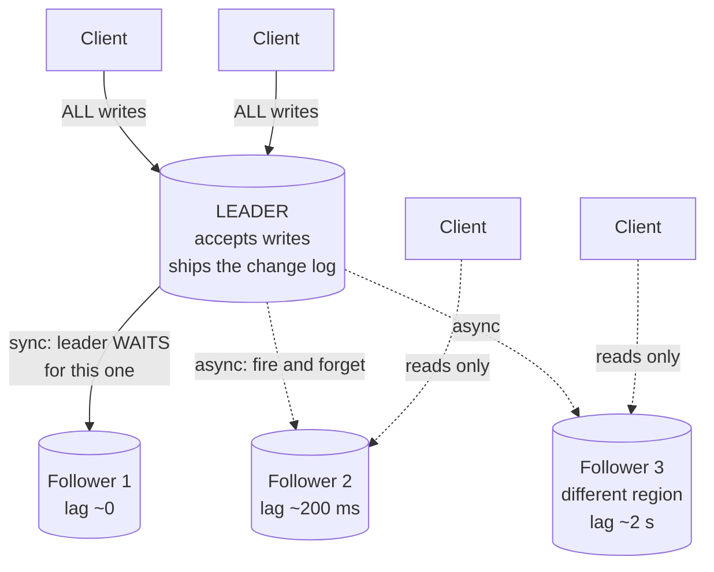

# Day 104 · System Design — Database replication

**After today you can:** You can draw leader-follower replication and say what happens when the leader dies.

**The interviewer asks it as:** *How do you make the database survive a machine failure?*

---

## 1. What this is, and why they ask it

**Replication** means keeping a complete copy of your data on more than one machine, and keeping the
copies in step as writes arrive.

Three sentences. The standard arrangement is **leader-follower**: one machine accepts all the writes, and
sends a stream of changes to the others, which apply them in the same order. It exists for two reasons
that are worth separating — **surviving a machine failure**, which is what today is about, and **serving
more reads**, which is [tomorrow](../day-105-lowest-common-ancestor/README.md). And the entire difficulty
is concentrated in one moment: **the leader dies, and something has to decide which follower takes over,
using incomplete information.**

They ask it because "add a replica" sounds like a checkbox and is not. The interesting questions are:
does the leader wait for the follower before confirming a write, and what does the user lose if it does
not? How long is the system unable to accept writes while a new leader is chosen? And what happens if the
old leader comes back and still thinks it is in charge? A candidate who can answer those three has
actually thought about it.

---

## 2. The story

The two brothers ran the same business from two towns, and it had worked for nineteen years.

Kuppusamy was in Erode and he kept the book. Every purchase, every sale, every advance — all of it went
into the ledger on his desk, in order, numbered.

Selvaraj was in Salem. He did not keep his own book. What he had was a copy, and the way it stayed a copy
was that Kuppusamy read the new entries down the phone every evening at about eight, and Selvaraj wrote
them into his own ledger in exactly the same order with exactly the same numbers.

That was the whole system. One book that things were written into, and one book that only ever received.

The rule about the order was strict, and Selvaraj had learned why the hard way in his second year. He had
once written entry 4,112 before 4,111 because 4,111 was long and he wanted to get the short one down
first. Two months later there was a dispute about which of two payments had come first, and his book said
one thing and Erode's said another. After that he wrote them in order or not at all.

There was one thing they argued about for years and never fully settled.

When a customer stood in front of Kuppusamy in Erode with cash, did he have to ring Salem and wait for
Selvaraj to write it down before giving the receipt?

If he did, the customer waited — sometimes two minutes, sometimes twenty if Selvaraj was out. If he did
not, the customer was served immediately and there was a window, up to a day long, in which Erode knew
about a payment that Salem did not.

They settled on doing it the fast way for ordinary sales and the slow way for anything over fifty
thousand rupees. Wait for the confirmation when the amount is large enough that losing it would matter.

In 2011 Kuppusamy had a heart attack on a Tuesday morning.

Selvaraj had to take over the book, and he discovered what the fast way had cost. The last call had been
Monday evening. Everything Kuppusamy had written on Tuesday morning — nine entries — was in a ledger in a
locked shop in Erode, and Selvaraj had no idea what was in it. He had to start writing from where his own
copy ended, and reconcile the nine entries later from receipts and memory.

And then the part nobody had planned for. Kuppusamy came home from hospital eleven days later, sat down
at his desk, and carried on writing in his book — because as far as he was concerned it was his book.
For two days there were two people writing entries with the same numbers into two different ledgers, and
untangling that took a month.

The rule they wrote down afterwards, and taped inside both ledgers, was one line: **there is only ever
one book being written into, and the way you know it is yours is that the other person has said so out
loud.**

---

## 3. The idea in plain English

The brothers have built leader-follower replication, and every hard part of it happened to them.

- Kuppusamy's ledger is the **leader** (also *primary*, or historically *master*). It is the only place
  writes go.
- Selvaraj's copy is a **follower** (*replica*, *standby*, historically *slave*).
- The evening phone call is the **replication stream**.
- Writing entries in exactly the same order is the fundamental requirement: **replication is an ordered
  log of changes**, not a copy of the data.
- Waiting for Salem before giving the receipt is **synchronous replication**; not waiting is
  **asynchronous**.
- The nine lost Tuesday entries are **data loss on failover**, measured as **RPO**.
- Two people writing into two ledgers is **split-brain**, and it is the worst failure in the subject.

### What actually gets replicated

Not the data — **the changes, in order**. Three ways, and the differences matter:

**Statement replication.** Send the SQL: `UPDATE accounts SET balance = balance - 100 WHERE id = 7`.

Compact, and **dangerous**: any statement that is not deterministic gives a different result on the
follower. `NOW()`, `RAND()`, an auto-increment race — each one silently makes the copy diverge. MySQL
supported this and moved away from it.

**Row-based replication.** Send the resulting rows: *"row 7's balance changed from 500 to 400"*.

Bigger on the wire, and safe, because there is nothing to re-evaluate. **This is the modern default.**

**Write-ahead-log shipping.** Send the database's own internal change log, byte for byte. This is what
PostgreSQL streaming replication does. Extremely efficient and tightly coupled: the follower must run the
same version of the same engine, which makes zero-downtime upgrades harder.

**The point to make: replication ships an ordered stream of changes, and the order is not negotiable.**
Selvaraj writing 4,112 before 4,111.

### Synchronous, asynchronous, and the one in between

This is the decision, and it is a genuine trade rather than a best practice.

```
 ASYNCHRONOUS
   leader writes, confirms to the client immediately, sends to followers whenever
   + fast writes; a slow or dead follower never affects the client
   - a leader crash LOSES whatever had not been sent yet

 SYNCHRONOUS
   leader writes, waits for the follower to confirm, then confirms to the client
   + no data loss on failover — the follower has everything
   - every write pays the round trip; and if the follower is down, WRITES STOP

 SEMI-SYNCHRONOUS
   wait for ONE follower out of several; the rest are asynchronous
   -> the usual real answer
```

**Fully synchronous replication to all followers is almost never used**, and it is worth saying why: it
converts every follower into a single point of failure for writes. One slow replica and the whole system
stops accepting writes. **Semi-synchronous — wait for one, let the others lag — keeps the durability
guarantee and keeps one bad machine from stopping everything.**

The brothers' compromise is exactly semi-synchronous applied selectively: fast for ordinary sales, wait
for confirmation above fifty thousand rupees.

### Failover: the hard part

The leader dies. Five things must happen, and each has a way of going wrong.

**1. Detect it.** Usually a timeout: no heartbeat for `n` seconds. Too short and a slow moment triggers an
unnecessary failover; too long and you are down for that whole period.

**2. Choose a new leader.** Pick the follower with the most complete log. This needs agreement between
the surviving machines — a consensus problem, which is
[day 119](../day-119-heaps-revision/README.md).

**3. Promote it.** It stops following and starts accepting writes.

**4. Redirect the clients.** They were configured to write somewhere; that address must now mean the new
machine. Usually a virtual address, a DNS change, or a proxy layer.

**5. Prevent the old leader from writing.** This is the one people forget, and it is the one that causes
real disasters.

### Split-brain, and fencing

Kuppusamy coming home and carrying on writing.

If the old leader is not actually dead — just unreachable, or paused, or on the far side of a network
problem — it may still be accepting writes from clients that can still see it. Now there are two leaders,
both accepting writes, both assigning the same identifiers. **Every write to the loser is lost, and the
data cannot be automatically reconciled.**

The defences:

- **Fencing** (also called STONITH — "shoot the other node in the head"): the new leader forcibly disables
  the old one — cutting power, revoking its storage lease, or blocking it at the network level — before
  accepting a single write.
- **A quorum**: a leader may only accept writes while it can see a majority of the cluster. A partitioned
  old leader cannot see a majority, so it stops on its own. This is why odd cluster sizes matter.
- **Epoch or term numbers**: every leadership period has an increasing number, and followers reject
  anything stamped with an older one. The old leader's writes are simply refused.

**"There is only ever one book being written into, and you know it is yours because the others said so."**
That is a quorum, in one sentence.

### The two numbers that describe a failure

```
 RPO — Recovery Point Objective
       how much data you are willing to lose, in time
       = the replication lag at the moment of the crash
       synchronous: 0.  asynchronous: seconds, or whatever the lag was.

 RTO — Recovery Time Objective
       how long you are willing to be unavailable
       = detection + election + promotion + client redirection
       typically 10-60 seconds automated; minutes to hours manual.
```

**Give both numbers when you describe a failover design.** "RPO of a few seconds, RTO of about thirty"
is a complete answer; "we have a replica" is not.

### Other topologies, briefly

**Multi-leader.** Two or more machines accept writes, usually one per region. Removes the write
bottleneck and the cross-region latency — and introduces **write conflicts**, because two leaders can
modify the same row at the same time and there is no natural order. You then need conflict resolution:
last-write-wins (which loses data), application-defined merges, or CRDTs. **Only worth it for multi-region
writes or offline-capable clients.**

**Leaderless.** No leader at all; clients write to several nodes and read from several. This is Dynamo,
Cassandra and Riak, and it replaces "who is the leader" with quorum arithmetic — `R + W > N` — which is
[day 117](../day-117-merge-k-sorted/README.md).

**Say the default is leader-follower and name when you would leave it.**

---

## 4. The picture

The standard arrangement.



What to notice: **only one machine has an inbound write arrow.** That is the definition. And exactly one
follower is synchronous — semi-synchronous — so a durability guarantee exists without any single follower
being able to stop writes.

The three replication formats:

```
 STATEMENT              "UPDATE t SET ts = NOW() WHERE id = 7"
                        small on the wire
                        DANGEROUS: NOW(), RAND(), auto-increment races
                        -> the follower computes a DIFFERENT value. Silent divergence.

 ROW-BASED              "row id=7: ts 10:00:01 -> 10:00:04"
                        bigger on the wire
                        SAFE: nothing is re-evaluated
                        -> the modern default

 WAL / LOG SHIPPING     the engine's own byte-level change log
                        smallest and fastest
                        tightly coupled: same engine, same version
                        -> PostgreSQL streaming replication
```

Synchronous against asynchronous, on the clock:

```
 ASYNCHRONOUS                          SYNCHRONOUS

 client ─write─► leader                client ─write─► leader
                 │ ├─ commit                          │ ├─ commit
                 │ └─ ACK ─► client                   │ ├─ send ──► follower
                 │  (fast: ~1 ms)                     │ │           │ commit
                 └─ send ──► follower                 │ │◄── ACK ───┘
                    (whenever)                        │ └─ ACK ─► client
                                                      (~1 ms + the round trip)
 leader crashes here:                  leader crashes here:
   anything not yet sent is LOST         the follower has everything. RPO = 0.
   RPO = the lag                         but if the follower is DOWN,
                                         WRITES STOP ENTIRELY.
```

The failover, with the split-brain danger drawn in:

```
 t=0    leader is healthy, follower lag 200 ms
 t=10   ** leader stops responding **   (crashed? or just unreachable?)
 t=15   no heartbeat for 5 s -> failure suspected
 t=17   surviving nodes agree on the follower with the most complete log
 t=18   ** FENCE the old leader **  ← the step people skip
 t=19   promote: the follower starts accepting writes
 t=21   clients redirected (virtual IP / DNS / proxy)
        |-------- RTO: ~21 s of no writes --------|
        RPO: the 200 ms of writes that never reached the follower

 WITHOUT the fence at t=18:
   the old leader was only unreachable, not dead.
   Some clients can still see it. It keeps accepting writes.
   -> TWO leaders, both assigning the same ids, for as long as nobody notices.
   -> every write to the loser is lost, and reconciliation is manual.
```

---

## 5. How it actually works

### Setting up a follower

```
 1. take a consistent snapshot of the leader, noting the exact log position
 2. copy that snapshot to the new machine
 3. the follower connects and asks for everything since that position
 4. it applies the backlog until it catches up
 5. from then on it applies changes as they arrive
```

**Step 1 is the interesting one**: the snapshot must be tied to a precise position in the change stream,
or the follower does not know where to resume, and applying the wrong range either loses changes or
applies them twice. Every database has a mechanism for this (PostgreSQL's `pg_basebackup` with a
replication slot, MySQL's binlog coordinates).

**Step 4 is the one people forget in an interview**: a new follower for a 2 TB database is not available
in seconds. Copying takes hours, and then it must catch up on everything that happened during the copy.

### How the follower applies changes

The follower has a single-threaded "apply" process in the simplest designs, and that is a common source
of lag: the leader wrote with fifty concurrent connections, and the follower replays it with one.

Modern versions parallelise this — replaying non-conflicting transactions concurrently — but **the
ordering guarantee limits how much parallelism is safe**, and a write-heavy leader can produce a stream a
single follower cannot keep up with.

### Failover, automated versus manual

**Manual** — a human decides. Slow (minutes to hours), and it cannot split-brain, because a person checks.
Still used for small systems where an hour of downtime is survivable.

**Automated** — the cluster decides. Fast (tens of seconds), and it can be wrong: a network hiccup that
makes a healthy leader unreachable triggers an unnecessary failover, and if fencing is imperfect you get
two leaders.

**The honest trade to state: automatic failover trades a rare catastrophic failure for a frequent minor
one.** Most systems take that trade and add fencing.

### What real systems do

- **PostgreSQL** — streaming replication of the write-ahead log; `synchronous_commit` chooses the
  durability level; **Patroni** plus **etcd** is the standard automated-failover stack, using etcd's
  consensus for leader election and fencing.
- **MySQL** — binary-log replication, now row-based by default; **Group Replication** and **Orchestrator**
  handle failover; **semi-synchronous** is a first-class setting.
- **Amazon RDS Multi-AZ** — a synchronous standby in another availability zone, with automatic failover
  in typically 60–120 seconds. **Aurora** replicates at the storage layer instead, so failover is much
  faster and the replicas share one storage volume.
- **MongoDB** — replica sets with an explicit election protocol and a majority requirement, which is
  precisely the quorum defence against split-brain.
- **Redis** — asynchronous replication and **Sentinel** for failover. Redis replication is asynchronous
  even in the failover path, which is why Redis is not a safe place for data you cannot lose.

---

## 6. The numbers

### Lag, in practice

```
 same data centre, moderate write load        1 - 50 ms
 same data centre, heavy write load           100 ms - a few seconds
 cross-region (India to US)                   200 ms + apply time
 during a bulk load or schema change          seconds to MINUTES
```

**The number that matters is not the average, it is the maximum during a bad moment.** A batch job that
writes ten million rows can push a follower minutes behind, and that is exactly when a failover would be
most expensive.

### RPO: what asynchronous replication costs

```
 write rate            1,000 writes/second
 replication lag         200 ms
 -> writes at risk     1,000 × 0.2  =  200 writes

 lag of 5 seconds during a bulk job
 -> writes at risk     5,000
```

**Two hundred lost writes on a normal day; five thousand during a batch job.** That is the concrete answer
to "what does asynchronous cost", and it is far more useful than "you might lose some data".

### RTO: what a failover costs

```
 detection (heartbeat timeout)         5 - 30 s
 election / agreement                  1 - 5 s
 fencing the old leader                1 - 5 s
 promotion                             1 - 10 s
 client redirection (DNS TTL!)         1 - 60 s
 ------------------------------------------------
 total, automated                      10 - 90 s
 total, manual                         5 - 60 minutes
```

**Client redirection is the sneaky one.** If clients resolve the leader through DNS with a 60-second TTL,
your RTO is at least 60 seconds however fast the database part was. That is why production systems use a
proxy or a virtual IP rather than DNS for this.

### The cost of synchronous replication

```
 write to the leader, same AZ, no replication      ~1 ms
 + synchronous follower in the same AZ             ~1.5 ms      (+50%)
 + synchronous follower in another AZ              ~3 ms        (+200%)
 + synchronous follower in another REGION          ~200 ms      (+20,000%)
```

**Cross-region synchronous replication is essentially never done**, and that number is why: every write
would take a fifth of a second. The standard arrangement is synchronous within a region and asynchronous
across regions, which gives zero data loss for a machine failure and some loss for a whole-region
failure.

### Rebuilding a follower

```
 database size                    2 TB
 copy over a 1 Gbit/s link        2 TB ÷ 125 MB/s  ≈  4.4 hours
 plus catch-up on ~4.4 hours of accumulated changes
 -> a new follower is available in ~5-6 hours, not minutes
```

**Say this if someone suggests "just add a replica" during an incident.** It is not a fix for a problem
you are having now.

### How many followers

```
 1 leader + 1 sync follower           survives one machine failure, RPO 0
 1 leader + 1 sync + 1 async          adds a read replica or a cross-region copy
 1 leader + 2 sync                    survives two failures; writes wait for BOTH
 majority quorum of 3 or 5            survives 1 or 2 failures with automatic election
```

**Odd numbers, because a majority of an even number is the same as a majority of the odd number below
it** — four nodes tolerate the same single failure that three do, and cost more.

---

## 7. The trade-offs

### Synchronous or asynchronous?

**Asynchronous** is fast and loses data on failover — the lag, in writes. **Synchronous** loses nothing
and makes every write wait, and turns a follower into a single point of failure for writes.

**Take semi-synchronous: one synchronous follower, the rest asynchronous.** You get the durability
guarantee from the one, and no single follower can stop writes because the others do not block.

**I would use fully asynchronous if** the data is genuinely tolerant of loss — analytics events, caches,
session data — and the write rate is high enough that the round trip matters. **I would use synchronous
across all followers essentially never**, and I would say why.

### Automatic or manual failover?

**Automatic** gives an RTO of tens of seconds and occasionally fails over when it should not — a network
blip, a garbage-collection pause, a slow disk. Each unnecessary failover is a small outage and a risk of
split-brain.

**Manual** cannot split-brain and takes minutes to hours.

**Take automatic, with fencing.** And say the honest framing: **you are trading a rare catastrophe for a
frequent inconvenience**, which is usually the right trade but is a trade.

### Replication is not a backup

This deserves its own line, because it is a real and expensive misunderstanding.

**Replication copies mistakes faithfully and instantly.** A `DELETE` without a `WHERE` clause is
replicated to every follower in milliseconds. So is a bad migration, and so is application-level
corruption.

**You need both**: replication for machine failure, and point-in-time backups for human failure. A
follower with a deliberate delay — an hour behind — is a cheap partial defence, because it gives you an
hour to notice and stop it.

### Where this design breaks

- **The leader is still one machine for writes.** Replication does nothing for write throughput. When one
  machine cannot take the write rate, the answer is sharding, which is
  [day 106](../day-106-bst-property/README.md).
- **Followers can fall behind without limit.** A write burst, a long transaction, a schema change — and
  now failover means losing minutes rather than milliseconds. Monitor lag as a first-class metric and
  alert on it.
- **Cross-region replication cannot be synchronous.** Physics, not engineering — the same
  [day 097](../day-097-recursion-revision/README.md) number. Accept regional data loss, or accept 200 ms
  writes.
- **Schema changes are the classic replication outage.** A migration that locks a table on the leader
  blocks the replication stream, followers fall minutes behind, and now you cannot fail over either.

---

## 8. In the interview

### How it gets asked

- The direct one: *"How do you make the database survive a machine failure?"*
- The trade: *"Synchronous or asynchronous replication? Why?"*
- The hard one: *"The leader dies. Walk me through exactly what happens."*
- The nasty one: *"The old leader comes back. Then what?"*
- The trap: *"So you don't need backups, right?"*

### What to say out loud, in the first ninety seconds

1. **Name the topology and the invariant.** "Leader-follower: one machine takes all the writes and ships
   an ordered log of changes to the others. The invariant is that there is exactly one machine accepting
   writes at any moment."
2. **Say what is replicated.** "The changes, in order — not the data. Row-based by default, because
   statement-based replication breaks on anything non-deterministic like `NOW()` or `RAND()`."
3. **Make the durability choice explicit and pick the middle.** "Semi-synchronous: the leader waits for
   one follower before confirming, and the rest are asynchronous. That gives an RPO of zero for a single
   machine failure without letting any one follower block writes."
4. **Give both failure numbers.** "RPO — how much data I lose — is the replication lag, so a few hundred
   writes at a thousand a second and 200 milliseconds of lag. RTO — how long I cannot write — is
   detection plus election plus promotion plus client redirection, so ten to ninety seconds automated."
5. **Go straight to fencing.** "The step people skip is fencing the old leader before promoting. If it was
   only unreachable rather than dead, you get two leaders, both accepting writes, and that data cannot be
   automatically reconciled."
6. **Separate replication from backup.** "Replication is not a backup. A `DELETE` with no `WHERE` is
   copied to every follower in milliseconds."

### The follow-ups

**"Synchronous or asynchronous?"**
"Semi-synchronous, which is the answer that is actually used. **Asynchronous** means the leader confirms
immediately and ships changes whenever — writes stay fast and a slow follower never affects the client,
but a leader crash loses everything not yet sent. At a thousand writes a second with two hundred
milliseconds of lag, that is about two hundred writes, and during a bulk job when the lag is five seconds
it is five thousand. **Fully synchronous** loses nothing and costs a round trip on every write — and,
worse, it makes every follower a single point of failure for writes: one slow replica and the system stops
accepting writes entirely. So: **wait for one follower, let the others lag.** Zero data loss for a single
machine failure, and no individual follower can stop the system. And across regions I would never do it
synchronously — a 200-millisecond round trip on every write is not a database, it is a queue."

**"The leader dies. Walk me through it."**
"Five steps, and the interesting failures are in the last two. **Detect** — no heartbeat for some timeout,
and that timeout is a real trade: too short and a slow moment causes an unnecessary failover, too long and
that is dead time. **Elect** — pick the follower with the most complete log, which requires the surviving
nodes to agree, so it is a consensus problem. **Fence the old leader** — forcibly stop it from writing,
whether by cutting its power, revoking its storage lease, or blocking it at the network. **Promote** the
chosen follower. **Redirect the clients**, which is usually a virtual IP or a proxy — and I would avoid
DNS here, because a sixty-second TTL means an RTO of at least sixty seconds no matter how fast everything
else was. All in, ten to ninety seconds automated. The data lost is whatever had not reached the new
leader — the lag at the moment of the crash, which is zero if it was the synchronous follower."

**"The old leader comes back. Then what?"**
"That is split-brain, and it is the worst failure in this topic because it cannot be automatically
repaired. If the old leader was only *unreachable* rather than dead — a network partition, a long
garbage-collection pause, a hung disk — it may still have clients that can see it, and it will happily
keep accepting writes. Now two machines are assigning the same identifiers to different data, and when
they reconnect there is no correct merge; somebody has to decide by hand which writes to discard. Three
defences and I would use at least two. **Fencing** — the new leader forcibly disables the old one before
accepting a single write. **A quorum** — a leader may only accept writes while it can see a majority of the
cluster, so a partitioned old leader stops on its own, which is why cluster sizes are odd. And **epoch
numbers** — every leadership term has an increasing number and followers reject anything stamped with an
older one, so the old leader's writes are simply refused."

**"Does this help with read load?"**
"Yes, and that is the second reason to have replicas — but it is a separate conversation with its own
problem, which is replication lag. If reads go to a follower, a user who writes and immediately reads may
not see their own write, because the follower is a few hundred milliseconds behind. That is a very real
product bug — 'I posted a comment and it is not there' — and the fixes are things like routing a user's
reads to the leader for a short window after they write. I would keep that separate from today's
question, which is about surviving a failure rather than serving more reads."

**"So you don't need backups?"**
"No — and this is worth being blunt about, because it is an expensive misunderstanding. **Replication
copies mistakes faithfully and instantly.** A `DELETE` without a `WHERE` clause is on every follower in
milliseconds. So is a bad migration, and so is application-level corruption that writes wrong values.
Replication protects against **machine** failure; backups protect against **human and software** failure,
and they are different threats. I would want point-in-time recovery — a base backup plus the change log,
so I can restore to a moment just before the mistake. A cheap partial defence worth mentioning is a
**deliberately delayed follower**, kept an hour behind, which gives you an hour to notice a catastrophic
statement and stop it before it is applied."

**"How long does it take to add a new follower?"**
"Not minutes, which is worth knowing before you suggest it during an incident. You take a consistent
snapshot of the leader tied to an exact position in the change log, copy it, and then replay everything
since that position. For a two-terabyte database over a gigabit link, the copy alone is about four and a
half hours, and then it has to catch up on the four and a half hours of writes that happened meanwhile.
So five to six hours before it is useful. Which means replicas are capacity you provision in advance, not
a lever you pull under load."

### A model answer

Asked: *how do you make the database survive a machine failure?*

> "Replication, in a leader-follower arrangement: one machine accepts all writes, and ships an ordered
> stream of changes to one or more followers that apply them in the same order. The invariant that makes
> the whole thing work is that **exactly one machine is accepting writes at any moment** — and most of the
> difficulty in this topic is in enforcing that during a failure.
>
> What travels is the **changes, in order** — not the data. I would use row-based replication, because
> statement-based replication ships the SQL and anything non-deterministic — `NOW()`, `RAND()`, an
> auto-increment race — evaluates differently on the follower and silently diverges. PostgreSQL ships its
> write-ahead log, which is the same idea at a lower level.
>
> The decision to make explicit is **durability**. Asynchronous means the leader confirms to the client
> immediately and ships changes whenever — fast, and a crash loses whatever had not been sent. At a
> thousand writes a second with two hundred milliseconds of lag, that is roughly two hundred writes gone,
> and during a bulk job when lag hits five seconds it is five thousand. Fully synchronous loses nothing
> and makes every write wait for the follower — and it turns each follower into a single point of failure
> for writes, so one slow replica stops the system. So I would use **semi-synchronous**: wait for one
> follower, let the rest lag. Zero data loss for a single machine failure, and no individual follower can
> block writes.
>
> When the leader dies, five things happen: detect it by heartbeat timeout; agree on the follower with the
> most complete log; **fence the old leader**; promote the new one; and redirect the clients. Two of those
> are worth dwelling on. **Client redirection** is often the slowest part — if clients find the leader
> through DNS with a sixty-second TTL, the RTO is at least sixty seconds regardless of how fast the
> database was, so I would use a proxy or a virtual IP. And **fencing** is the step people skip, and it is
> the one that causes disasters: if the old leader was merely unreachable rather than dead, it keeps
> accepting writes from clients that can still see it, and you have two leaders assigning the same
> identifiers to different data with no automatic way to reconcile them. The defences are fencing, a
> quorum requirement so a partitioned leader stops on its own, and epoch numbers so followers reject
> writes from a stale term.
>
> I would quote two numbers for any failover design: **RPO**, how much data is lost, which is the
> replication lag at the moment of the crash; and **RTO**, how long writes are unavailable, which is ten to
> ninety seconds automated and minutes to hours manual.
>
> Two limits worth stating up front. This does **nothing for write throughput** — there is still one
> machine taking writes, and when that is the constraint the answer is sharding. And **replication is not a
> backup**: a `DELETE` with no `WHERE` reaches every follower in milliseconds. Machine failure is
> replication's job; human error is what point-in-time backups are for, and a deliberately delayed
> follower an hour behind is a cheap partial defence against exactly that."

---

## 9. Recall card

- **Leader-follower: exactly ONE machine accepts writes and ships an ORDERED log of changes.** Order is not
  negotiable. **Row-based** replication by default — **statement-based breaks on anything
  non-deterministic** (`NOW()`, `RAND()`, auto-increment races) and diverges silently. PostgreSQL ships
  the WAL.
- **Semi-synchronous is the real answer: wait for ONE follower, let the rest lag.** Asynchronous loses the
  lag on a crash (**~200 writes at 1,000/s and 200 ms lag; 5,000 during a bulk job**). Fully synchronous
  loses nothing but makes **every follower a single point of failure for writes**. Cross-region
  synchronous is ~200 ms per write — never.
- **Failover is five steps: detect · elect · FENCE · promote · redirect.** Quote **RPO** (data lost = the
  lag) and **RTO** (10–90 s automated, minutes to hours manual). **Client redirection through DNS makes
  RTO ≥ the TTL** — use a proxy or virtual IP.
- **Split-brain is the worst failure and it cannot be auto-repaired**: an old leader that was only
  *unreachable* keeps accepting writes, and two leaders assign the same ids to different data. Defend with
  **fencing**, a **quorum** (leader must see a majority — hence odd cluster sizes), and **epoch numbers**
  so followers reject a stale term.
- **Replication is NOT a backup** — a `DELETE` with no `WHERE` reaches every follower in milliseconds.
  Machine failure → replication; human error → **point-in-time backups**, plus a **deliberately delayed
  follower** as a cheap partial defence. And replication does **nothing for write throughput** — that is
  sharding. Adding a follower to a 2 TB database takes **~5–6 hours**, so it is not a lever you pull during
  an incident.
