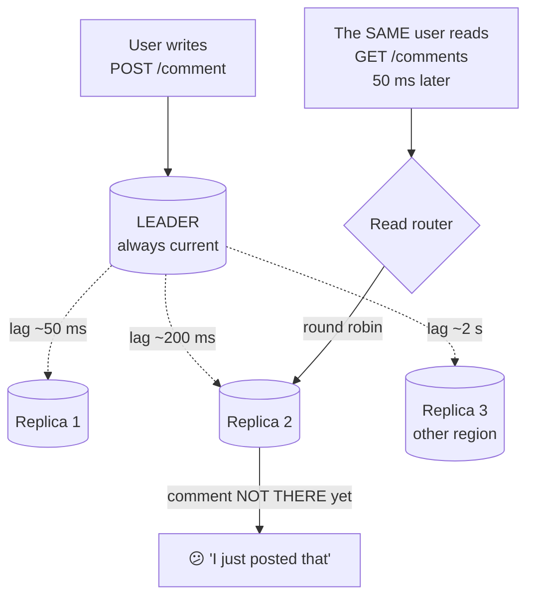

# Day 105 · System Design — Read replicas and replication lag

**After today you can:** You can explain why a user sometimes does not see their own write.

**The interviewer asks it as:** *The user posted a comment and cannot see it. What happened?*

---

## 1. What this is, and why they ask it

A **read replica** is a follower from [yesterday](../day-104-tree-path-problems/README.md) that you also
send queries to. Writes still go to the leader; reads are spread across the copies.

Three sentences. It is the cheapest way to multiply read capacity, and it works because most systems are
read-heavy — fifty to a thousand reads per write. The price is **replication lag**: a follower is always
a little behind, so a read from it can return data that is already out of date. And the specific failure
that lag causes is the one users notice and report: **they do something, then immediately look at it, and
it is not there.**

They ask it because "add read replicas" is the standard answer to a read-heavy system and most candidates
stop there. The interesting part is the bug it introduces. *"The user posted a comment and cannot see
it"* is a real support ticket, it is not a code defect, and being able to name it — **read-your-own-writes
violation** — and give three fixes with their costs is what the question is for.

---

## 2. The story

The electricity board office had four counters and Rajan had been sent to sort out his mother's bill,
which the board said was unpaid and which she was certain she had paid in March.

He paid it again at counter two rather than argue — eleven hundred and forty rupees, receipt, stamp,
the man wrote it in his register and typed it into the machine.

Then he went to counter four, three metres away, to ask for a no-dues letter, because that was what he
had actually come for.

The woman at counter four looked at her screen and said the bill was unpaid.

He said he had paid it four minutes ago. He put the receipt on the counter.

She said the receipt was fine, she could see it was genuine, but her screen said unpaid, and she could
not write a no-dues letter against a screen that said unpaid.

He asked her to look again. She looked again. Still unpaid.

The man at counter two, when Rajan went back, was not surprised at all. He said the machines in the hall
did not all talk to the same place. His counter wrote into the main system directly, because he took
money. The other counters read from a copy that got updated every so often — usually within a few
minutes, sometimes twenty if it was busy, and once, on a day in December when they were doing something
in the back office, not until the next morning.

He said the usual advice was to come back after lunch.

Rajan said that was a strange way to run an office, and the man agreed, and then told him the thing that
actually solved it. He said: do not go to counter four. Come back to me. My counter reads from the same
place it writes to, so I can see it immediately. It is slower because there is a queue, and that is why
they send people to the other counters — but if you have just paid, only my counter will know.

Rajan queued again at counter two, and the same man printed the no-dues letter in about forty seconds.

---

## 3. The idea in plain English

The hall is a leader with three read replicas, and Rajan has just experienced the exact failure they
cause — and the exact fix.

- Counter two is the **leader**: writes go there, and reads from it are always current.
- Counters one, three and four are **read replicas**.
- "Updated every so often" is **replication lag**.
- Not seeing his own payment is a **read-your-own-writes violation**.
- "Come back to me, my counter reads from where it writes" is **routing a user's reads to the leader for
  a period after they write** — the standard fix.

### Why read replicas work at all

```
 read:write ratio, typical products
   social feed / news       100:1 to 1000:1
   e-commerce browsing        200:1
   messaging                    ~1:1
   analytics ingestion      write-heavy
```

If a system does 6,000 reads and 120 writes a second, then **the leader's write load is trivial and its
read load is everything.** Move the reads elsewhere and one leader comfortably handles the writes for a
long time.

```
 1 leader                 6,000 reads/s + 120 writes/s   -> struggling
 1 leader + 3 replicas    120 writes/s on the leader
                          2,000 reads/s on each replica  -> comfortable
```

**This is the cheapest scaling move available for a read-heavy system**, and it needs no application
changes except deciding where each query goes.

### What lag actually is

The follower is applying a stream of changes it received a moment ago. **Lag is how far behind it is,
measured in time.**

```
 same data centre, normal load        1 - 50 ms
 same data centre, heavy writes       100 ms - a few seconds
 cross-region                         200 ms + apply time
 during a bulk load or migration      seconds to MINUTES
```

**The average is not the number that matters. The maximum during a bad moment is.** A follower that is
usually 20 milliseconds behind and occasionally four minutes behind will produce four minutes of
inexplicable support tickets.

### The three guarantees users actually expect

Users do not have a consistency model in their heads, but they have three expectations, and each has a
name.

**Read-your-own-writes.** *If I do something, I see it.* Rajan's payment.

This is the one that generates tickets, because the user knows for certain that they did the thing.

**Monotonic reads.** *Time does not go backwards.* If I refresh and see my comment, then refresh again
and it is gone, something is badly wrong.

This happens when two consecutive reads land on **different replicas** with different lag. It is worse
than plain staleness, because it looks like data loss.

**Consistent prefix reads.** *Cause comes before effect.* You should not see the answer to a question
before the question.

This one is mostly a sharding problem rather than a replica problem, but it is worth naming: if two
related writes are replicated through different channels, they can arrive out of order.

### The fixes for read-your-own-writes

Four, in increasing order of sophistication. **Know all four; the first is usually the answer.**

**One — read from the leader after writing.** For a short window (say thirty seconds), send that user's
reads to the leader. Simple, effective, and it puts some read load back on the leader.

Two ways to decide the window: **time-based** (thirty seconds after any write) or **object-based** (reads
of anything this user recently modified go to the leader). Object-based is more precise and needs you to
track what they touched.

**Two — read from the leader for data the user owns.** A user's own profile always comes from the leader;
everybody else's comes from a replica. Coarse, simple, and it covers most of the real cases because the
things you edit are usually things you own.

**Three — a consistency token.** After a write, the leader returns its current log position, and the
client sends it back with subsequent reads. A replica that has not reached that position either waits or
forwards to the leader.

Precise and correct, and it requires the client to carry the token and the database to expose the
position. **Real systems do this**: DynamoDB's strongly consistent reads and Aurora's session tokens are
versions of it.

**Four — just wait.** The application delays a moment after writing before reading back. **This is not a
fix**, it is a race with better odds, and it is worth naming so you can dismiss it.

### The fix for monotonic reads

**Pin each user to one replica** — by hashing their user id — so their reads always come from the same
copy. They may see stale data, but they never see time run backwards.

The cost: load balance becomes worse, and if that replica dies, those users jump to a different one and
may go backwards once.

### Where the lag actually comes from

Worth knowing, because "reduce the lag" is a real answer and it needs a cause:

- **A single-threaded apply process** on the follower replaying a leader that had fifty concurrent
  writers. Modern databases parallelise this, but the ordering guarantee limits how much.
- **Long transactions**. A transaction is replicated when it commits, so a five-minute transaction
  produces five minutes of lag in one lump.
- **Bulk operations**: a migration, a backfill, a `DELETE` of a million rows.
- **The follower's own read load.** A replica busy serving queries applies changes more slowly, which is
  a genuinely unpleasant feedback loop: more read traffic causes more lag causes more stale answers.
- **Locks on the follower**: a long analytical query can block the apply process outright.

### When replicas stop helping

This is the limit worth stating, because it is not obvious:

> **Every replica applies every write.**

A replica does not reduce write work — it duplicates it. So as the write rate rises, each replica spends
more of its capacity on replication and less on serving reads, and adding more replicas does not help.

```
 write load per machine, 10 replicas at 1,000 writes/s
   -> every one of the 11 machines is doing 1,000 writes/s
   -> if a machine tops out at 5,000 writes/s, the whole design tops out there,
      no matter how many replicas you add
```

**At that point the answer is sharding**, which is [tomorrow](../day-106-bst-property/README.md).

---

## 4. The picture

The arrangement, and the failure.



What to notice: **the write and the read are correct in isolation.** Nothing is broken. The user simply
asked a machine that has not been told yet.

The timeline, which is what to draw when explaining it:

```
 t=0     user POSTs a comment      -> leader commits it.  Leader: [c1]
 t=0     leader ACKs               -> the UI says "posted"
 t=30ms  the change starts shipping to replicas
 t=50ms  user's browser GETs the comment list
         the read router picks Replica 2, which is 200 ms behind
         Replica 2: []             -> "no comments"
 t=200ms Replica 2 applies the change.  Replica 2: [c1]
 t=8s    user refreshes in confusion    -> now it is there

 NOTHING IS BROKEN. The write succeeded, the read was accurate for the
 machine it asked. The user experience is a bug all the same.
```

Monotonic reads, which is the worse-looking failure:

```
 read 1 -> Replica 1 (lag 20 ms)    sees the comment    ✓
 read 2 -> Replica 3 (lag 2 s)      comment GONE        ✗✗

 the user watched their comment DISAPPEAR.
 Plain staleness looks like a delay; this looks like data loss.

 fix: pin the user to ONE replica, by hashing their user id.
      They may be stale, but time never runs backwards.
```

The four fixes, compared:

```
 FIX                      precision   cost                        used by
 ---------------------    ---------   -------------------------   -----------------
 read leader for 30 s     coarse      some read load returns      most systems
   after any write                    to the leader
 read leader for data     medium      needs an ownership rule     social products
   the user owns
 consistency token        exact       client must carry it;       DynamoDB,
   (log position)                     DB must expose the position Aurora
 sleep before reading     none        it is a race, not a fix     nobody, on purpose
```

Where replicas stop helping:

```
 writes/s   leader     each replica     replica capacity left for reads
 --------   -------    -------------    -------------------------------
    100     100 w/s        100 w/s      ~98%   plenty
  1,000     1,000          1,000        ~80%   fine
  4,000     4,000          4,000        ~20%   struggling
  5,000     5,000          5,000          0%   SATURATED — adding replicas
                                                does nothing at all

 EVERY REPLICA APPLIES EVERY WRITE. Replication multiplies read capacity
 and does NOT reduce write work. Past the write ceiling, the answer is
 sharding.
```

---

## 5. How it actually works

### Routing reads

Three places the decision can live, and each is used in practice.

**In the application.** Two connection pools — one to the leader, one to the replicas — and the code
chooses. Explicit and simple; every developer has to remember the rule, which is where the bugs come
from.

**In a proxy.** ProxySQL, PgBouncer with routing, or a managed endpoint. The application sees one
address; the proxy inspects the query and sends `SELECT` to a replica and everything else to the leader.
**The catch: a `SELECT` inside a transaction that also writes must go to the leader**, and a proxy that
routes purely on the verb gets that wrong.

**In the driver.** Some clients understand a replica set and route themselves — MongoDB's read
preferences are the clearest example, with settings like `primary`, `primaryPreferred`,
`secondaryPreferred` and `nearest`.

### Measuring lag

Every database exposes it, and it should be a first-class alert:

```
 PostgreSQL   pg_stat_replication.replay_lag           (a time interval)
 MySQL        Seconds_Behind_Master                     (approximate; it lies during stalls)
 MongoDB      rs.printSecondaryReplicationInfo()
 Managed      CloudWatch ReplicaLag, or the equivalent
```

**A more honest measure**: write a heartbeat row on the leader every second containing the current time,
and on the follower compute *now minus the timestamp of the latest heartbeat you have applied*. That
catches stalls that the built-in counters can miss, and it is what most serious deployments do.

**Then act on it**: if a replica's lag exceeds a threshold, take it out of the read pool automatically.
A replica that is four minutes behind is worse than one fewer replica.

### The consistency token, concretely

```
 1. client writes; the leader returns its current log position (an LSN)
 2. client stores it — in a cookie, a header, or the session
 3. client reads, sending the token
 4. the router picks a replica and compares the token with the replica's applied position
      replica has caught up  -> serve from the replica
      replica is behind      -> wait briefly, or fall back to the leader
```

**This is the only fix that is exactly right**, and its cost is that the token has to survive the round
trip through a client you may not control, and the position has to be comparable across machines.

### Replicas for things other than read scaling

Worth mentioning, because it changes how many you want:

- **A dedicated analytics replica**, so a twenty-minute report never touches the machines serving users.
  Often deliberately allowed to lag.
- **A backup replica**, so taking a backup does not slow the leader.
- **A delayed replica**, an hour behind on purpose, as protection against a destructive statement —
  [yesterday's](../day-104-tree-path-problems/README.md) human-error defence.
- **A cross-region replica**, for disaster recovery and for local reads.

**Different replicas for different jobs, with different lag tolerances**, is a more sophisticated answer
than "three replicas".

### What real systems do

- **Amazon RDS read replicas** are asynchronous with lag typically in the tens of milliseconds, and
  `ReplicaLag` is the metric everyone alerts on. **Aurora** replicates at the storage layer, so its
  replica lag is usually single-digit milliseconds — a genuinely different architecture.
- **MongoDB** exposes read preference per query, and `readConcern: "majority"` plus causal consistency
  sessions provide read-your-own-writes without going to the primary.
- **DynamoDB** makes it explicit and per-request: eventually consistent reads are the default and cost
  half as much; strongly consistent reads cost double and are served from the leader replica. **Pricing
  the consistency is the clearest expression of this trade anywhere.**
- **Facebook** published a design where a write sets a short-lived marker for that user, and reads
  consult the marker to decide whether to go to the primary region — object-based routing at scale.

---

## 6. The numbers

### What replicas buy

```
 6,000 reads/s + 120 writes/s

 one leader alone:        6,120 operations/s on one machine
 leader + 3 replicas:       120 writes/s on the leader
                          2,000 reads/s on each replica
 -> the leader is now at 2% of its previous load
```

**Read capacity scales linearly with replicas; write capacity does not scale at all.**

### The lag window, as a probability

```
 write, then read 50 ms later
 replica lag ~200 ms
 -> the read lands inside the lag window   ->  STALE, guaranteed

 write, then read 3 seconds later (a human clicking)
 replica lag ~200 ms
 -> stale only if the lag spiked           ->  rare
```

```
 how often does a user hit this?
   writes per day per active user            ~5
   reads within 1 second of a write          ~4 of those 5 (the UI reloads)
   P(replica lag > 1 s)                      ~2% under normal load
   -> ~0.4 stale reads per user per day, and MUCH worse during a lag spike
```

**Under one percent, and it is the one percent that files support tickets**, because the user knows for
certain that they did the thing.

### The cost of the leader-read window

```
 30-second window after any write
 5 writes per user per day, ~15 reads inside those windows
 as a share of a user's ~100 daily reads:  ~15%

 -> the leader takes back ~15% of the read load
 -> at 6,000 reads/s that is 900 reads/s on the leader
```

**Worth knowing before you promise the fix is free.** Object-based routing — only reads of things the
user just touched — cuts this to a few percent.

### The write ceiling

```
 a machine that sustains 5,000 writes/s

 write rate   replica capacity used by replication   left for reads
 ----------   ------------------------------------   --------------
    500 w/s                 10%                           90%
  2,000 w/s                 40%                           60%
  4,000 w/s                 80%                           20%
  5,000 w/s                100%                            0%
```

**At 5,000 writes a second, a replica can serve no reads at all**, and adding an eleventh replica adds
nothing. That is the number that says "the next step is sharding, not more replicas".

### Cross-region

```
 replica in the same region        lag ~10-50 ms,  read latency ~1 ms
 replica in another region         lag ~200 ms+,   read latency ~1 ms locally
                                                   but 200 ms if you read across

 a user in India reading from a US replica:  ~200 ms
 a user in India reading from an India replica: ~2 ms, and up to 200+ ms stale
```

**The trade is explicit: a local replica is a hundred times faster and a little more wrong.**

### Lag alerting thresholds

```
 warn at      1 second       something is starting to go wrong
 page at      10 seconds     read-your-own-writes is broken for everybody
 evict at     30 seconds     take it out of the read pool automatically
```

**Automatic eviction is the part people forget.** A replica that is minutes behind is actively harmful,
and serving from four healthy replicas is better than five with one lying.

---

## 7. The trade-offs

### Read replicas buy read capacity and cost correctness

That is the whole trade. You get near-linear read scaling for the price of **a small, unpredictable
window in which reads are wrong**. Every fix trades some of the capacity back.

**I would not add read replicas if** the read:write ratio is near 1:1 — messaging, for example — because
there is little read load to move and every replica still pays the full write cost.

### Which fix for read-your-own-writes?

**Read from the leader after a write** is the default. It is simple, needs no client cooperation, and
costs ten to fifteen percent of the read load. **Take this unless there is a reason not to.**

**Object-based routing** — the leader only for things the user recently touched — is more precise and
cheaper, and it needs you to track what they touched, which is real bookkeeping.

**Consistency tokens** are exactly right and require the client to carry a token and the database to
expose a comparable position. **I would use them when reads and writes cross service boundaries**, where
"thirty seconds after their write" is not something a downstream service knows.

**Sleeping before reading is not a fix.** Say so.

### Stale reads are sometimes fine, and saying which is a strong answer

Not every read needs to be current. Sorting them is more valuable than making everything consistent:

```
 must be current        the user's own data after they change it
                        anything a decision is made on (balance, stock at checkout)
                        a permission check
 can be seconds stale   another user's profile, a feed, a comment count,
                        search results, a dashboard
 can be minutes stale   analytics, reports, trending lists
```

**That triage is the answer to "how would you decide what goes to a replica?"** — and the same rule as
[day 101's](../day-101-bfs-level-order/README.md) cache: the display may be stale; the decision may not.

### Pinning users for monotonic reads

Pinning gives you monotonic reads and gives up even load balancing, because users are not uniform. It also
means a replica failure moves that group of users to a new copy, where they may go backwards once.

**Worth it when users can see a value change back**, which is anything with a visible timeline or count.

### Where this design breaks

- **The write ceiling.** Every replica applies every write, so past a certain write rate replicas stop
  helping entirely. That is a sharding conversation.
- **Lag spikes are correlated with load.** The moment you most need replicas — a traffic peak — is when
  the write rate is highest and lag is worst. The failure arrives exactly when it is least convenient.
- **A slow replica poisons results silently.** Without automatic eviction on lag, one machine serves stale
  answers to a fraction of users indefinitely, and it looks like an intermittent application bug.
- **Analytical queries on a serving replica** cause lag for everyone using it. Give reports their own
  replica.
- **Failover promotes a replica**, and if it was behind, you lose the difference — the RPO from
  [yesterday](../day-104-tree-path-problems/README.md). Read-replica lag and failover data loss are the
  same number wearing two hats.

---

## 8. In the interview

### How it gets asked

- The support ticket: *"The user posted a comment and cannot see it. What happened?"*
- The design: *"This system is read-heavy. How do you scale the database?"*
- The follow-up: *"How do you fix read-your-own-writes?"*
- The worse one: *"A user refreshes and their comment disappears. What is that?"*
- The limit: *"You have ten read replicas and it is still slow. Now what?"*

### What to say out loud, in the first ninety seconds

1. **Name the failure precisely.** "That is a **read-your-own-writes violation** — replication lag. The
   write went to the leader, the read went to a replica that had not applied it yet. Nothing is broken;
   both operations were correct."
2. **Give the shape of the numbers.** "Lag is usually tens of milliseconds and occasionally seconds, so a
   read within a second of a write is at real risk — and the UI almost always reloads immediately after a
   write, which is exactly the worst case."
3. **Give the default fix and its cost.** "Route that user's reads to the leader for a short window after
   they write — thirty seconds. That costs maybe ten to fifteen percent of the read load going back to the
   leader, and it fixes the case users actually notice."
4. **Name the sharper alternatives.** "More precisely: route only reads of things the user just modified;
   or a consistency token, where the write returns a log position and the read waits for a replica that
   has reached it."
5. **Mention the second, uglier failure.** "There is a related one — **monotonic reads**. Two consecutive
   reads landing on replicas with different lag can make a comment appear and then disappear, which looks
   like data loss. The fix is to pin a user to one replica."
6. **State the limit before being asked.** "Replicas multiply read capacity and do nothing for writes —
   every replica applies every write — so past a certain write rate they stop helping and the answer
   becomes sharding."

### The follow-ups

**"How do you fix read-your-own-writes?"**
"Four options and I would default to the first. **Route the user's reads to the leader for a window after
they write** — say thirty seconds. Simple, needs no client cooperation, and it costs roughly ten to
fifteen percent of the read load coming back to the leader, because the reads right after a write are the
ones the UI does automatically. **Object-based routing** is the sharper version: only reads of things this
user recently modified go to the leader, which is a few percent instead of fifteen, at the cost of
tracking what they touched. **A consistency token** is exactly right: the write returns the leader's log
position, the client sends it with subsequent reads, and a replica that has not reached that position
either waits or forwards to the leader — that is what DynamoDB and Aurora do, and I would reach for it
when reads and writes cross service boundaries, where 'thirty seconds after their write' is not something
a downstream service knows. And the fourth is sleeping before the read, which is not a fix — it is a race
with better odds."

**"A user refreshes and their comment disappears. What is that?"**
"That is a **monotonic reads** violation, and it is worse than plain staleness because it looks like data
loss. The first read landed on a replica with 20 milliseconds of lag and saw the comment; the second read
landed on a different replica with two seconds of lag and did not. Both reads were accurate for the
machine they asked. The fix is to **pin each user to one replica**, usually by hashing their user id, so
their reads always come from the same copy. They may see stale data, but time never runs backwards. The
cost is that load balance gets worse, because users are not uniform, and if that replica dies the pinned
users jump to another and may go backwards once at that moment."

**"You have ten read replicas and it is still slow. Now what?"**
"Then I would check what is actually saturated, because more replicas may be doing nothing. **Every
replica applies every write**, so replication is not free capacity — if the write rate is 4,000 a second
and a machine tops out at 5,000, every replica is spending eighty percent of itself on replication and has
only twenty percent left for reads. At that point adding an eleventh replica adds almost nothing. The
answers, in order of what I would try: **cache**, because a ninety percent hit rate removes ten times more
read load than another replica; **check the lag**, because a replica minutes behind may be serving
garbage while still counting as capacity; and if the write rate is genuinely the ceiling, **shard**, which
is the only thing that scales writes. I would also look at whether analytical queries are running on
serving replicas, since one twenty-minute report can stall the apply process for everybody on that
machine."

**"How do you decide which reads go to a replica?"**
"By triaging what can be stale, which is the same rule as caching: **the display may be stale, the
decision may not.** Reads that must be current: the user's own data right after they change it, and
anything a decision is made on — a balance being debited, stock at checkout, a permission check. Reads
that can be seconds stale: other people's profiles, feeds, comment counts, search results. Reads that can
be minutes stale: analytics and reports, which I would give their own dedicated replica so a twenty-minute
query never touches the machines serving users. Making that classification explicit is more valuable than
making everything consistent, because everything-consistent means everything goes to the leader and the
replicas were pointless."

**"How would you detect a replica falling behind?"**
"The built-in metrics — `replay_lag` in PostgreSQL, `Seconds_Behind_Master` in MySQL — and I would not
trust them alone, because they can under-report during a stall. The more honest measure is a **heartbeat**:
write a row on the leader every second containing the current time, and on the follower compute now minus
the timestamp of the latest heartbeat it has applied. That catches a stalled apply process that the
counter misses. Then the important part is acting on it automatically: **evict a replica from the read
pool when its lag exceeds a threshold**, say thirty seconds. A replica that is minutes behind is actively
harmful — four healthy replicas serve users better than five with one lying — and without automatic
eviction it looks like an intermittent application bug for as long as nobody investigates."

**"Does this help with write load at all?"**
"Not at all, and it slightly hurts. Every write is applied on every replica, so replication multiplies the
write work rather than dividing it — a leader plus ten replicas means eleven machines each doing the full
write rate. Read replicas scale **reads** near-linearly and scale writes by exactly zero. When the write
rate is the constraint the only real answer is sharding: splitting the data so each machine takes a
fraction of the writes. That is a much larger change, because you lose transactions and joins across
shards."

### A model answer

Asked: *the user posted a comment and cannot see it. What happened?*

> "That is a **read-your-own-writes violation** caused by replication lag, and the first thing to say is
> that **nothing is broken**. The write went to the leader and succeeded. The read went to a read replica
> which had not yet applied that change, and returned exactly what it had. Both operations were correct;
> the combination is wrong.
>
> The mechanism: the leader takes all the writes and ships an ordered stream of changes to the replicas,
> which apply them a moment later. That moment is usually tens of milliseconds and occasionally seconds —
> and during a bulk load or a long transaction it can be minutes. Meanwhile, the read that follows a write
> is almost always **immediate**, because the interface reloads the list the instant the post succeeds. So
> the read lands squarely inside the lag window, which is why this is the failure users actually
> encounter rather than a theoretical one.
>
> The standard fix is to **route that user's reads to the leader for a short window after they write** —
> thirty seconds is typical. It needs no client cooperation, and the cost is real and worth quoting: the
> reads immediately after a write are perhaps ten to fifteen percent of a user's reads, so that much of
> the read load comes back to the leader. A sharper version routes to the leader only for **objects the
> user recently modified**, which is a few percent instead of fifteen but requires tracking what they
> touched. And the exact version is a **consistency token**: the write returns the leader's log position,
> the client sends it back with reads, and a replica that has not reached that position either waits or
> forwards to the leader. That is what DynamoDB and Aurora expose, and I would use it when reads and
> writes happen in different services, where one cannot know about the other's recent activity.
>
> I would also mention the related failure, because it is worse and it has a different fix. **Monotonic
> reads**: if two consecutive reads land on replicas with different lag, the comment can appear and then
> disappear. Plain staleness looks like a delay; that looks like data loss. The fix is to **pin a user to
> one replica** by hashing their id — they may be stale, but time never runs backwards.
>
> Operationally, the thing I would insist on is **measuring lag with a heartbeat** rather than trusting the
> built-in counter, and **automatically evicting a replica from the read pool when it exceeds a
> threshold**. A replica that is four minutes behind is worse than not having it, and without eviction it
> produces exactly this ticket, intermittently, for one user in five, until somebody investigates.
>
> And the limit worth stating unprompted: replicas scale **reads** and do nothing for writes, because every
> replica applies every write. Past a certain write rate they stop helping altogether, and the next step is
> sharding rather than more copies."

---

## 9. Recall card

- **A read replica is a follower you also query. Reads scale near-linearly; writes do not scale at all** —
  **every replica applies every write**, so at 4,000 w/s on a 5,000 w/s machine each replica has only 20%
  left for reads, and the eleventh replica adds nothing. Past that, the answer is **sharding**.
- **The failure users report is a read-your-own-writes violation, and nothing is broken** — the write went
  to the leader, the read went to a replica that had not applied it. The UI reloads immediately after a
  write, so the read lands **inside** the lag window by design.
- **Four fixes: read from the leader for ~30 s after a write** (default; costs ~10–15% of reads back on the
  leader) · **object-based routing** (only what the user just touched; a few percent) · **a consistency
  token** — the write returns a log position, the read waits for a replica that has reached it (DynamoDB,
  Aurora) · **sleeping, which is not a fix.**
- **Monotonic reads is the uglier sibling**: two reads on replicas with different lag make a comment appear
  and then vanish — it looks like data loss. Fix by **pinning a user to one replica** (hash their id); the
  cost is uneven load and one backwards jump if that replica dies.
- **Measure lag with a heartbeat row, not just `Seconds_Behind_Master`, and evict a replica from the read
  pool automatically past a threshold** — a replica minutes behind is worse than one fewer replica. And
  triage reads like a cache: **the display may be stale, the decision may not** — balances, stock at
  checkout and permission checks always come from the leader.
