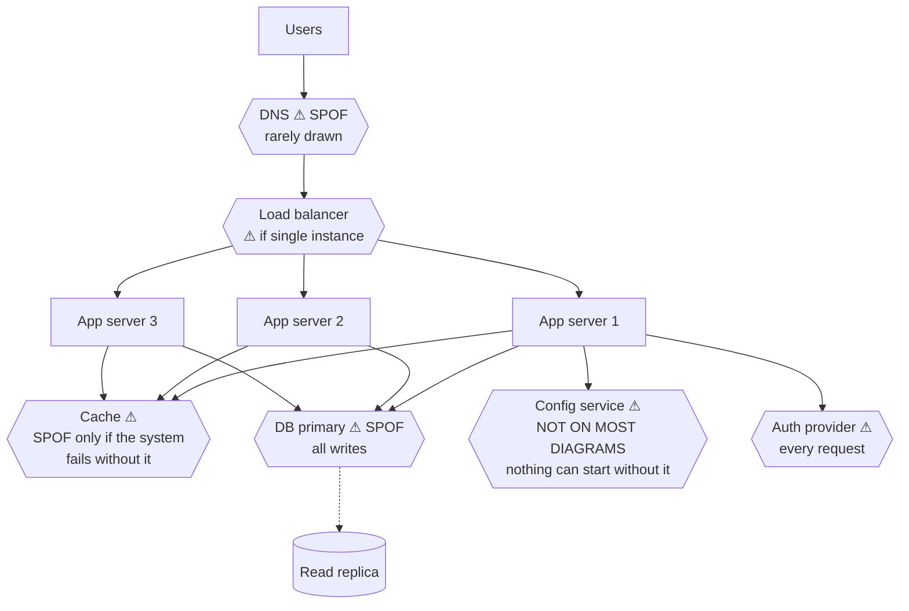

# Day 111 · System Design — Single points of failure

**After today you can:** You can look at an architecture diagram and circle every box that kills the system.

**The interviewer asks it as:** *Which component here takes the whole system down if it fails?*

---

## 1. What this is, and why they ask it

A **single point of failure** — an SPOF — is any component whose failure stops the whole system. Not
degrades it. Stops it.

Three sentences. Finding them is a mechanical procedure — **point at each box in turn and ask "what if
this is gone?"** — and doing it deliberately catches more than intuition does. The ones people find are
the obvious boxes: the database, the load balancer. The ones that cause real outages are the **hidden**
ones: a dependency that several "independent" components secretly share, a configuration service nobody
drew, and a failure that takes out two things at once because they were never really independent.

They ask it because it is the fastest way to find out whether a candidate has operated a system or only
designed one. The follow-up is always the same shape — *"you have two of those, so what?"* — and the good
answer distinguishes **redundancy** (there is another one) from **failover** (something notices and
switches) from **graceful degradation** (the feature is gone but the system is not), because having two of
something with no mechanism to use the second one is not redundancy at all.

---

## 2. The story

Kottai was on the far side of the river and everything the village needed came across the bridge.

It was not a small bridge and it had been there since before anybody living could remember, and the
village had been organised around it for four generations. The school bus, the milk lorry, the ambulance,
the man who came on Fridays with vegetables — all of it, over that bridge.

In August 2015 a lorry carrying rods went through the parapet and the bridge was closed for eleven days.

What the eleven days taught them was not that they needed the bridge. Everybody already knew that. It was
the *list* of things that turned out to depend on it, which was much longer than anyone had guessed. The
water tanker could not come. The mobile phone tower's diesel could not come, so after four days the tower
went off and the village had no telephone either. Two people who were on regular medicines ran out.

The panchayat met afterwards and agreed to fix it, and the fixing took two rounds, which is the
interesting part.

The first round was to build a second crossing — a smaller bridge two kilometres downstream, near the
temple. That took three years and everybody was satisfied.

The second round happened because of a man called Devan, who had spent his working life on the railways
and who came to the meeting where they were celebrating the new bridge and asked one question.

He asked where the diesel came from.

There was a pause and then somebody said: from the bunk on the main road.

And he said: yes, and how does the lorry from the bunk get to either bridge?

It came down the same approach road. Both bridges were fed by one road from the highway, and that road
crossed a culvert about four kilometres out that flooded in a heavy monsoon. So the village had two
bridges and still one way in, and nobody had noticed because the two bridges were drawn on the map as two
separate things and the culvert was not drawn at all.

Devan's point, which the panchayat wrote into their notes, was that you do not find these by looking at
the map. You find them by naming a thing the village needs — water, medicine, telephone — and following
it backwards, one step at a time, until you are outside the village. Anything that shows up in two of
those chains is the real problem, and it is usually something nobody thinks of as infrastructure at all.

---

## 3. The idea in plain English

The village has just done a single-point-of-failure analysis, and it found the two kinds: the obvious one
and the shared one.

- The bridge is an **SPOF** — one component, and everything depends on it.
- The eleven days revealing water, diesel and medicine is **blast radius**: what actually stops.
- The second bridge is **redundancy**.
- The shared approach road is a **hidden SPOF** — two components that are not independent.
- The culvert not being on the map is why **you cannot find these by looking at the diagram alone**.
- Devan's method — pick a thing the system must do, follow it backwards — is **dependency tracing**, and
  it is the technique.

### The procedure for finding them

**Method one: point at every box.** Go through the diagram component by component and ask *"if this is
gone right now, what still works?"* Mechanical, and it catches everything that is drawn.

**Method two: trace a critical path backwards.** Pick something the system must do — "a user logs in",
"an order is placed" — and list every component it touches, including the ones nobody drew. **Anything
appearing in two different critical paths is where the real risk is.** Devan's question.

**Method three: ask what is not on the diagram.** This is where the outages come from:

```
 DNS                     everything resolves names, and nobody draws it
 the configuration       every service reads it at startup; if it is down,
   service                 nothing new can start
 the secrets store       same, and worse: certificate expiry is a scheduled outage
 the deployment pipeline you cannot ship a fix during an incident
 the identity provider   every internal tool and every login
 the monitoring          you are blind, which turns a small outage into a long one
 the certificate         expires at a fixed time, for everything at once
 the shared library      a bad version deploys to every service
 the ONE person          who knows how the failover works, on holiday
```

**Naming three of those unprompted is the answer to "what did I miss?"**

### Series and parallel: the arithmetic

Components **in series** — every one is needed — multiply their availabilities, so **the total is always
worse than the worst one.**

```
 load balancer  99.99%
 app tier       99.95%
 database       99.95%
 cache          99.9%   (if the system fails without it)
 ---------------------------------------------------
 combined       0.9999 × 0.9995 × 0.9995 × 0.999  =  99.79%
                                                     ≈ 18 hours down per year
```

**Four components that are each better than 99.9 percent give a system that is worse than any of them.**
That is the single most useful piece of arithmetic in this lesson, and it is why adding components has a
cost even when each one is reliable.

Components **in parallel** — any one will do — multiply their *failure* probabilities, which is a
completely different shape.

```
 one machine at 99.9%          ->  8.8 hours down per year
 two, either will do           ->  1 - 0.001^2  =  99.9999%  ->  32 seconds
 three                         ->  effectively never, from this cause
```

**One extra machine turns nine hours into thirty seconds.** The catch is the assumption of
**independence**, and that is where the village's approach road comes in.

### Correlated failure, which breaks the arithmetic

The parallel formula assumes the two components fail for unrelated reasons. Very often they do not:

```
 two servers in the same rack        one power strip
 two servers in the same zone        one datacentre, one network
 two replicas of the same version    one bad deploy
 two services using one library      one bug
 two databases on one storage array  one array
 everything, at once                 one expired certificate
 everything, at once                 one bad configuration push
```

**A bad deploy or a bad config push is the correlated failure that redundancy does not help with at all**,
because it reaches every replica simultaneously and on purpose. That is why deployment practice —
canaries, staged rollouts, fast rollback — is an availability technique and not just a process
preference.

### Redundancy, failover, and degradation are three different things

This distinction is what the follow-up is testing.

**Redundancy** — there is more than one. On its own it does nothing.

**Failover** — something detects the failure and switches. This is the part that has to work, and it is
the part that is usually untested: the detection delay, the switching mechanism, and whether the standby
is actually current. **An untested failover is not redundancy; it is a second thing that might also be
broken.**

**Graceful degradation** — the component is gone and the system continues with less. Often better value
than redundancy, and much cheaper.

```
 the recommendation service is down
   with redundancy:   a second copy serves recommendations
   with degradation:  show a default list. Nobody notices.

 the search service is down
   with degradation:  show browse categories instead of a search box
```

**"Which failures should degrade rather than fail?" is a design question worth raising unprompted.** It
turns a total outage into a smaller product.

### Bulkheads and blast radius

A **bulkhead** is a partition that stops a failure spreading — from ships, where a holed compartment does
not sink the vessel.

```
 SHARED                              PARTITIONED
 one thread pool for all callers     a pool per caller
 -> one slow dependency exhausts     -> one slow dependency exhausts only
    it and blocks everybody             its own pool

 one database for all tenants        a shard group per tier
 -> one tenant's heavy query         -> one tenant affects only their group
    slows everyone
```

**The related idea is the circuit breaker**: after `n` consecutive failures, stop calling a dependency for
a while and fail fast. That converts a slow dependency — which fills your thread pool and takes *you* down
— into a fast error you can degrade around. **A slow dependency is more dangerous than a dead one**, and
that sentence is worth saying.

### Reducing blast radius, structurally

```
 CELLS         partition users into independent stacks; a failure affects one cell
 SHUFFLE       assign each customer a random subset of servers, so no two
   SHARDING      customers share exactly the same set — one bad customer
                 cannot take down everyone
 REGIONS       a whole-region failure is survivable, at the cost of
                 cross-region data problems
 STATIC        serve a cached or default version when the dynamic path fails
   FALLBACK
```

**Cell-based architecture is the strongest structural answer**, and it is what AWS and several large
services use: the question stops being "will it fail" and becomes "how many users does one failure
reach".

---

## 4. The picture

The same architecture, with every SPOF circled.



What to notice: **three of the five marked components are things people do not draw.** The app tier — the
one with three boxes — is the only part most candidates protect.

The two kinds of SPOF:

```
 THE OBVIOUS ONE                        THE HIDDEN ONE

      users                                  users
        │                                   ╱     ╲
        ▼                            bridge A     bridge B
    ┌───────┐                              ╲     ╱
    │ ONE   │  ← everything                 ╲   ╱
    │bridge │    goes through it       ┌─────▼─▼─────┐
    └───────┘                          │  one road   │ ← "redundant" components
        │                              │  one culvert│    that are not independent
        ▼                              └─────────────┘
      village                                 │
                                              ▼
                                          the highway

 found by: looking at the diagram      found by: tracing a dependency backwards
                                                  until you leave the system
```

The availability arithmetic, both directions:

```
 IN SERIES (all needed)                 IN PARALLEL (any one will do)
 multiply the AVAILABILITIES            multiply the FAILURE RATES

 99.99 × 99.95 × 99.95 × 99.9           1 - (0.001 × 0.001)
   = 99.79%                               = 99.9999%
   = ~18 HOURS down per year               = ~32 SECONDS per year

 adding a component makes it WORSE      adding a copy makes it MUCH better
 ...and the total is worse than the      ...IF the failures are independent,
    worst single component                  which is the whole question
```

Correlated failure, drawn:

```
 what the diagram says              what is actually true

   ┌──────┐   ┌──────┐               ┌──────┐   ┌──────┐
   │ App1 │   │ App2 │               │ App1 │   │ App2 │
   └──────┘   └──────┘               └───┬──┘   └──┬───┘
   independent, 99.9% each               └────┬────┘
   -> combined 99.9999%                       ▼
                                     ┌─────────────────┐
                                     │ same rack       │
                                     │ same power strip│
                                     │ same deploy     │
                                     │ same config push│
                                     └─────────────────┘
                                     -> combined ≈ 99.9%, not 99.9999%

 the redundancy multiplied the COST and not the AVAILABILITY.
```

The three responses, and when each is right:

```
 component fails
        │
        ├── REDUNDANCY      another one exists          costs money
        │                   (does nothing by itself)
        │
        ├── FAILOVER        something DETECTS and        costs complexity,
        │                   SWITCHES                     and must be TESTED
        │
        └── DEGRADATION     the feature is gone,         costs a product decision
                            the system is not            — often the best value

 recommendations down  -> DEGRADE to a default list. Nobody notices.
 the database down     -> FAILOVER. You cannot degrade away your data.
 one app server down   -> REDUNDANCY. The load balancer handles it.
```

---

## 5. How it actually works

### The audit, in order

```
 1. draw the request path for ONE critical operation, end to end
 2. list every component it touches — including DNS, config, auth, certificates
 3. for each, ask: if this is gone, what still works?
 4. classify: total outage / degraded / no effect
 5. for the total-outage ones, choose redundancy, failover or degradation
 6. for each redundant pair, ask: DO THEY FAIL INDEPENDENTLY?
 7. write down how you would TEST each failover
```

**Step 6 is Devan's question and step 7 is the one that is skipped.**

### Testing the failover

An untested failover has roughly a fifty percent chance of working, and the reasons are always the same:

```
 the standby was never receiving replication and is hours behind
 the standby's disk filled up months ago and nobody was watching
 the failover script references a hostname that changed
 the DNS TTL is 300 seconds, so "instant" failover takes five minutes
 the application caches the database address at startup and never re-resolves
 the certificate on the standby expired
```

**So: game days and chaos engineering.** Netflix's **Chaos Monkey** terminates production instances at
random during working hours, and the point is not the termination — it is that a failover you exercise
daily is a failover that works. **This only makes sense if services are
[stateless](../day-100-dfs-traversals/README.md)**, which is the connection worth drawing.

### The dependencies nobody draws, in detail

**DNS.** Every name resolution. And its TTL sets a floor on how fast any DNS-based failover can be — a
300-second TTL means a five-minute recovery no matter how quickly you change the record.

**Configuration and secrets.** Services read them at startup, so a config service being down does not
break running instances — it breaks **every restart, every deploy and every autoscaling event**, which
means you cannot grow or recover during the incident.

**Certificates.** These expire at a specific instant, for everything using them, simultaneously — the
purest correlated failure there is, and it has caused outages at almost every large company.

**The deployment pipeline.** If it is down you cannot ship the fix. This turns a ten-minute incident into
a three-hour one.

**Monitoring.** If it is down you are blind. The outage is not longer because monitoring failed; it is
longer because nobody knows what is wrong.

**A shared library or sidecar.** A bad version rolls out to every service at once. Redundancy is no
defence, because the failure is deployed deliberately to all of it.

### What real systems do

- **AWS availability zones** exist precisely to make failures independent: separate power, cooling and
  network, close enough for synchronous replication. **Multi-AZ is the standard first answer**, and
  multi-region is the expensive second one.
- **AWS's cell-based architecture** partitions customers into independent stacks, so a failure affects one
  cell rather than a region. Their published availability writing is the standard reference for blast
  radius.
- **Netflix's Chaos Monkey** and the wider Simian Army institutionalise failure injection.
- **Hystrix**, and its successors, popularised the **circuit breaker** and **bulkhead** patterns —
  separate thread pools per dependency so one slow service cannot exhaust the whole application.
- The most-cited real outages are almost all **correlated**, not single-component: a bad configuration
  push, an expired certificate, a BGP mistake, a bad deploy. **Redundancy did not help in any of them**,
  which is the argument for staged rollouts and fast rollback being availability work.

---

## 6. The numbers

### The nines

```
 availability   downtime per year   per month     per day
 ------------   -----------------   -----------   ---------
 99%            3.65 days           7.3 hours     14.4 min
 99.9%          8.77 hours          43.8 min      1.44 min
 99.95%         4.38 hours          21.9 min      43 s
 99.99%         52.6 minutes        4.4 min       8.6 s
 99.999%        5.26 minutes        26 s          0.86 s
```

**Being able to convert nines to minutes on the spot is a small, reliable signal.**

### Series: why adding components hurts

```
 component        availability
 --------------   ------------
 DNS              99.99%
 load balancer    99.99%
 app tier         99.95%
 cache            99.9%
 database         99.95%
 auth service     99.95%
 -----------------------------
 product          99.73%   ->  ~23.6 hours per year
```

**Six components, each at least 99.9 percent, giving a system at 99.73 percent.** Two consequences worth
stating:

- **Every dependency you add costs availability**, so removing a dependency from the critical path is an
  availability improvement.
- **If a component can be made optional — degrade instead of fail — it leaves the product entirely.**
  Making the cache optional above takes the system from 99.73 to 99.83 percent, which is nine hours a
  year, for no new hardware.

### Parallel: what redundancy buys

```
 copies   each at 99.9%   combined      downtime/year
 ------   -------------   ----------    -------------
 1        99.9%           99.9%         8.77 hours
 2        99.9%           99.9999%      31.6 seconds
 3        99.9%           99.9999999%   ~0.03 seconds
```

**And the same table if the failures are correlated at ten percent** — meaning one time in ten, whatever
kills one kills both:

```
 2 copies, 10% correlated   ->  effective availability ≈ 99.99%
                                 ~53 minutes per year, not 32 seconds
```

**A hundred times worse than the naive figure.** That gap is why "are they independent?" is the question,
and why two machines in the same rack are not two machines.

### Blast radius, quantified

```
 architecture              users affected by one failure
 -----------------------   ------------------------------
 single stack              100%
 2 regions, active-active  50%
 10 cells                  10%
 100 cells                 1%
 shuffle sharding, 100
   servers, 5 per customer  overlap between any two customers is tiny:
                            one bad customer affects ~0.1% of the others
```

**Shuffle sharding is the surprising one.** With a hundred servers and five per customer, two customers
share all five servers with probability about one in seventy-five million — so one abusive customer takes
down almost nobody.

### Failover time, and where it actually goes

```
 detection (health check × threshold)   5 - 30 s
 election / decision                    1 - 5 s
 fencing the old primary                1 - 5 s
 promotion                              1 - 10 s
 client redirection:
   via a proxy or virtual IP            1 - 5 s
   via DNS with a 300 s TTL             up to 300 s   ← usually the largest term
 --------------------------------------------------
 total, proxy-based                     10 - 60 s
 total, DNS-based                       5+ minutes
```

**The DNS TTL is frequently the dominant term and it is entirely a configuration choice.** Saying that is
worth more than any amount of discussion about detection thresholds.

### The cost of the last nine

```
 99.9%    one machine per tier, backups                       baseline
 99.99%   redundancy per tier, multi-AZ, automated failover    ~2x
 99.999%  multi-region active-active, extensive automation,
          continuous failure testing, a team on call            ~5-10x
```

**Each additional nine costs roughly a multiple, not a percentage.** The right question is therefore not
"how do we get more nines" but **"what is an hour of downtime worth?"** — and for most products the answer
does not justify five nines.

---

## 7. The trade-offs

### Redundancy costs money and complexity

Doubling a tier doubles its cost, and the failover machinery is itself something that can fail — a bad
health check can cause an unnecessary failover, which is an outage caused by the availability mechanism.

**I would not add redundancy where degradation is cheaper.** A second copy of the recommendation service
costs money forever; a default list costs one afternoon.

### Graceful degradation is usually the best value

**It removes a component from the availability product entirely.** A cache that the system requires is a
multiplier; a cache the system can survive without is not in the calculation at all.

The cost is a product decision: someone has to agree that showing stale or default content is acceptable,
and someone has to build and — crucially — **test** the fallback path, which otherwise rots quietly.

### Multi-region: the expensive one

**Multi-AZ** is nearly free — synchronous replication within a region, automated failover, and a
substantial availability gain.

**Multi-region** is a different order of problem: the latency makes synchronous replication impossible, so
you accept data loss on a region failure, or you go active-active and accept write conflicts.

**I would not go multi-region for availability alone** unless the business genuinely requires it. The
common reasons that *do* justify it are latency for a global user base and data-residency law — and
availability comes along as a benefit.

### Where the analysis goes wrong

- **Assuming independence.** The most common error, and the one that makes the arithmetic lie by a factor
  of a hundred.
- **Untested failover.** Roughly a coin flip whether it works. If it is not exercised, it is not real.
- **Forgetting the failure paths that are not the request path** — deployment, configuration, secrets,
  monitoring. You cannot fix an incident without them.
- **A slow dependency is worse than a dead one.** A dead one fails fast; a slow one fills your connection
  pool and takes you down with it. **Timeouts and circuit breakers are the defence**, and a missing timeout
  is one of the most common causes of a cascading outage.
- **The availability mechanism becoming the failure.** An aggressive health check that removes healthy
  servers under load makes the load worse on the rest, and cascades.
- **A person as an SPOF.** If one engineer knows how the failover works, that is a real dependency and it
  goes on the list.

---

## 8. In the interview

### How it gets asked

- The direct one: *"Which component here takes the whole system down if it fails?"*
- The follow-up: *"You have two of those. So what?"*
- The one that separates people: *"What is not on this diagram?"*
- The arithmetic: *"Each component is 99.9 percent available. What is the system?"*
- The realistic one: *"Your database has a standby. Are you sure it works?"*

### What to say out loud, in the first ninety seconds

1. **Give the method, not a list.** "I would go component by component and ask what still works if it is
   gone — and then, separately, trace one critical path backwards, because that finds the dependencies
   that are not on the diagram."
2. **Name the obvious ones, then move past them.** "The database primary takes all writes; a single load
   balancer instance; the cache, if the system cannot serve without it."
3. **Go straight to the undrawn ones.** "The ones that cause real outages are usually not on the picture:
   DNS, the configuration service, the secrets store, certificates, the deployment pipeline, and the
   identity provider."
4. **Do the series arithmetic.** "And these compound: six components each at 99.9 percent or better give a
   system at about 99.7 percent — roughly a day a year. Every dependency on the critical path costs
   availability."
5. **Distinguish the three responses.** "For each one: redundancy, failover, or degradation. They are not
   the same — having two of something with no mechanism to switch is not redundancy."
6. **Ask the independence question.** "And for every redundant pair, do they actually fail independently?
   Two machines in one rack, two replicas of the same bad deploy, or two services behind one expired
   certificate are one component wearing two boxes."

### The follow-ups

**"You have two of those. So what?"**
"Two is only useful if three things are true. First, something **detects** the failure — a health check
with a threshold, and there is a real delay there: with a five-second interval and a threshold of two,
detection takes ten to twelve seconds, during which the dead one is still receiving its share of traffic.
Second, something **switches** — and clients have to learn about the switch, which is where DNS TTLs bite:
a 300-second TTL means five minutes of recovery no matter how fast everything else was. Third, the second
one has to be **current and healthy**, which is the part that is usually untested — the standby that is
hours behind on replication, or whose disk filled up in March. So my answer is: redundancy without tested
failover is not redundancy, it is a second thing that might also be broken. I would want to know when the
failover was last exercised, and I would want it exercised on a schedule rather than during an incident."

**"What is not on this diagram?"**
"That is where the outages are. **DNS** — everything resolves names and nobody draws it, and its TTL is a
floor on recovery time. **Configuration and secrets** — services read them at startup, so if that store is
down, running instances are fine but nothing can restart, deploy or autoscale, which means you cannot
recover or grow during the incident. **Certificates** — they expire at a fixed instant for everything using
them at once, which is the purest correlated failure there is. **The deployment pipeline** — if it is down
you cannot ship the fix, which turns a ten-minute incident into a three-hour one. **Monitoring** — if it is
down you are blind, and the outage is longer because nobody knows what is wrong. And **a shared library or
sidecar**, where a bad version rolls out to every service simultaneously and redundancy is no defence at
all, because the failure was deployed deliberately to all of it."

**"Each component is 99.9 percent available. What is the system?"**
"Worse than any of them, and that is the point. Components **in series** — where every one is needed —
multiply their availabilities. Six at 99.9 percent gives about 99.4 percent, which is roughly two days a
year. So **every dependency you put on the critical path costs availability**, and the corollary is
useful: removing a dependency, or making it optional so the system degrades instead of failing, is an
availability improvement with no new hardware. Making one cache optional in that chain is worth several
hours a year. Components **in parallel** are the opposite — you multiply the failure rates, so two
machines at 99.9 percent give 99.9999, which is nine hours down becoming about thirty seconds. But that
formula assumes **independence**, and if the two fail together even ten percent of the time, the real
figure is closer to 99.99 percent — about fifty minutes rather than thirty seconds. A hundred times worse
than the naive number."

**"Your database has a standby. Are you sure it works?"**
"No, and I would not claim to be until it had been tested — an untested failover is close to a coin flip,
and the reasons are always the same handful. The standby was not actually receiving replication and is
hours behind. Its disk filled up and nobody was alerting on it. The failover script refers to a hostname
that changed last year. The application caches the database address at startup and never re-resolves, so
it keeps talking to the dead one. Or the certificate on the standby expired. So the thing I would want is
not a better design but a **schedule**: fail over deliberately, in business hours, on a regular cadence,
and measure how long it takes. That is what game days and chaos engineering are for — Netflix's Chaos
Monkey kills production instances during working hours, and the value is not the killing, it is that a
failover exercised daily is one that works. And that only makes sense if the services are stateless, which
ties back to why statelessness matters."

**"How would you reduce the blast radius?"**
"Four levers, in increasing order of effort. **Graceful degradation** — decide which features can be
missing rather than fatal, so a failure costs a feature instead of the system; that is usually the best
value and it removes the component from the availability product entirely. **Bulkheads** — a separate
connection or thread pool per dependency, so one slow service cannot exhaust the whole application, plus
circuit breakers so a slow dependency becomes a fast error rather than a queue that takes you down. Worth
saying plainly: **a slow dependency is more dangerous than a dead one**, because a dead one fails fast.
**Cells** — partition users into independent stacks so a failure reaches ten percent of users instead of a
hundred. And **shuffle sharding**, which is the elegant one: give each customer a random subset of, say,
five servers out of a hundred, and then two customers almost never share the same five — so one abusive
customer degrades a fraction of a percent of the others rather than everybody."

**"Is there anything on the list that is not a machine?"**
"Yes, and it belongs on the list. **A person** — if one engineer is the only one who knows how the failover
works or where the runbook is, that is a genuine single point of failure and it fails on holidays. **A
process** — if every deploy needs one approval from one team, that team is on the critical path during an
incident. And **a vendor** — a third-party payment provider or identity provider is a component you do not
control, cannot make redundant, and often cannot even monitor properly. For that last one the honest answer
is usually degradation: decide in advance what the product does when the provider is down, rather than
discovering it at the time."

### A model answer

Asked: *which component here takes the whole system down if it fails?*

> "Let me answer with a method rather than a list, because the components I can see are the easy half.
>
> The method is two passes. First, **point at every box and ask what still works if it is gone.** That
> catches everything drawn. Second — and this is the pass that matters — **pick one critical operation and
> trace it backwards**, naming every component it touches, including the ones nobody put on the picture.
> Anything that turns up in two different critical paths is where the real risk is.
>
> From the diagram: the **database primary**, because all writes go through it. The **load balancer**, if
> it is a single instance. And the **cache** — but only if the system genuinely cannot serve without it,
> which is a design choice I would want to make deliberately rather than inherit.
>
> The ones that cause actual outages are usually not drawn. **DNS**, which everything depends on and whose
> TTL is a hard floor on any DNS-based recovery. The **configuration and secrets store**, which does not
> break running instances but breaks every restart, deploy and autoscaling event — so you cannot recover or
> grow during the incident. **Certificates**, which expire at a fixed instant for everything at once.
> The **deployment pipeline**, without which you cannot ship the fix. And **monitoring**, without which you
> are blind and the outage is long for reasons unrelated to its cause.
>
> Two pieces of arithmetic I would put on the board. Components **in series** multiply, so six components
> each at 99.9 percent give a system at about 99.4 — two days a year. Every dependency on the critical path
> costs availability, and making one of them **optional** — degrade rather than fail — takes it out of the
> product entirely, which is an availability gain with no new hardware. Components **in parallel** multiply
> their failure rates instead: two machines at 99.9 percent give 99.9999, so nine hours becomes thirty
> seconds. **But that assumes independence**, and if they fail together even ten percent of the time the
> real figure is nearer 99.99 — fifty minutes, not thirty seconds. That gap is the whole reason to ask
> whether two things are genuinely independent, and two servers in one rack, or two replicas of the same
> bad deploy, are one component wearing two boxes.
>
> For each SPOF I would then choose between three different responses, which people run together.
> **Redundancy** means another one exists, and on its own it does nothing. **Failover** means something
> detects and switches — that is the part that has to work and is usually the part nobody has tested.
> **Degradation** means the feature is gone and the system is not, and it is often the cheapest and best
> answer: the database needs failover because you cannot degrade away your data, but recommendations can
> just show a default list and nobody notices.
>
> And the last thing I would say unprompted: **a slow dependency is more dangerous than a dead one**,
> because a dead one fails fast while a slow one fills your connection pool and takes you down with it. So
> timeouts and circuit breakers on every outbound call, and separate pools per dependency, are part of the
> answer to this question and not a separate topic."

---

## 9. Recall card

- **An SPOF is any component whose failure stops the system.** Find them two ways: **point at every box and
  ask what still works**, and **trace one critical path backwards until you leave the system** — the second
  pass finds what the diagram does not show.
- **The ones that cause real outages are undrawn: DNS · config and secrets · certificates · the deploy
  pipeline · monitoring · a shared library · one person.** Config being down does not break running
  instances — it breaks every **restart, deploy and autoscale**, so you cannot recover during the incident.
- **Series multiply availabilities, parallel multiply failure rates.** Six components at 99.9% give
  **~99.4% — two days a year**, so every dependency on the critical path costs availability and **making
  one optional removes it from the product entirely**. Two parallel copies at 99.9% give **99.9999% — nine
  hours becomes 32 seconds**.
- **That parallel figure assumes INDEPENDENCE.** Same rack, same zone, same deploy, same config push, same
  certificate — and it collapses: **10% correlation turns 32 seconds into ~53 minutes**. A **bad deploy or
  config push is the correlated failure redundancy cannot help with**, which makes canaries and fast
  rollback availability work.
- **Redundancy ≠ failover ≠ degradation.** Two of something with no tested switching is **a second thing
  that might also be broken** — and DNS TTL is often the largest term in failover time. **Degradation is
  usually the best value.** And **a slow dependency is more dangerous than a dead one**: use timeouts,
  **circuit breakers** and **bulkheads**, then **cells** and **shuffle sharding** to shrink blast radius
  from 100% of users to a fraction of a percent.
