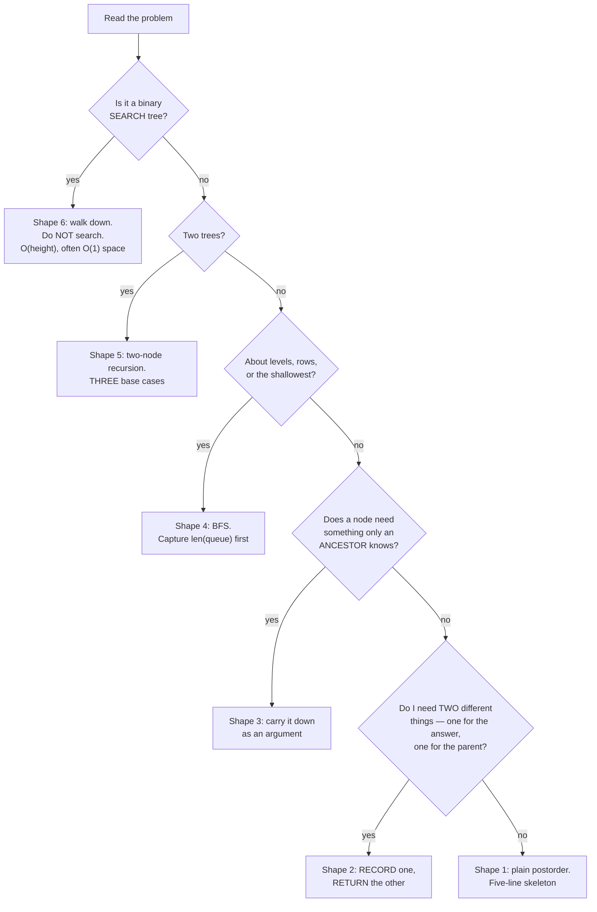

# Day 112 · DSA — Trees revision and mock round

**After today you can:** You can solve two unseen tree problems cold.

**The interviewer asks it as:** *Two problems, no hints, talk as you go.*

---

## 1. What this is, and why they ask it

Fourteen days ago you did not know what a leaf was. Since then:
[vocabulary](../day-098-what-a-tree-is/README.md), [nodes in code](../day-099-binary-trees-in-code/README.md),
[the three depth-first orders](../day-100-dfs-traversals/README.md),
[level order](../day-101-bfs-level-order/README.md),
[diameter](../day-102-height-and-diameter/README.md),
[comparisons](../day-103-tree-comparisons/README.md),
[paths](../day-104-tree-path-problems/README.md),
[lowest common ancestor](../day-105-lowest-common-ancestor/README.md),
[the BST invariant](../day-106-bst-property/README.md),
[insert and delete](../day-107-bst-operations/README.md),
[validation](../day-108-validating-a-bst/README.md),
[balance](../day-109-balanced-trees/README.md),
[reconstruction](../day-110-trees-from-traversals/README.md) and
[serialisation](../day-111-serialise-a-tree/README.md).

Three sentences. Almost every tree problem is **one of six shapes**, and the entire skill is recognising
which one in the first thirty seconds — because once you have named the shape, the code is eight lines you
have already written. The recognition is not about the words in the problem; it is about **which way the
information travels**: up from the children, down from the parent, across a level, or between two trees.
And the five recurring bugs are the same five every time, so knowing them is worth more than knowing any
individual problem.

They run a mock round because in a real interview nobody says "this is a postorder problem". They say
*"find the maximum sum of any path"*, and your first minute decides the next thirty.

---

## 2. The story

The workshop was two rooms behind a paint shop and Chandrasekhar had been making furniture in it since
1979.

His apprentice that year was a boy from the polytechnic who had been taught to draw and had never held a
chisel, and the thing he could not get over was how fast the old man decided things.

A woman brought in a broken chair. The old man turned it over, looked at it for about four seconds, and
said which joint had failed and which one he would put in instead. The boy had been staring at the same
chair for two minutes.

He asked how.

Chandrasekhar said there were five joints. That is all. Everything he had made in forty years was one of
five, or two of them together.

The boy said there must be more than five.

The old man said there are hundreds of names, and five joints. The names are for the catalogue. What you
actually have to decide is one thing: **which way does the load go?**

If the load pushes two pieces apart along their length, you need one kind. If it twists them, you need a
different one. If the piece has to come apart again for moving, that is a third. If it is a corner where
two flat pieces meet, a fourth. If it is a leg taking weight straight down, the fifth.

He said the mistake everybody makes is to look at the shape of the wood. The shape tells you nothing. Two
pieces that look identical need different joints depending on where the weight goes, and two pieces that
look nothing alike need the same joint if the load is the same.

Then he said the part the boy wrote down and kept.

He said: when I look at a chair for four seconds, I am not thinking about the joint. I am watching the
load. The joint is whatever the load tells me. If you learn the five joints you have learned nothing —
you have to learn to see where the weight is going, and then there are only five answers and it does not
matter which one it is.

The boy got quicker at it over about eight months. Not by learning more joints.

---

## 3. The idea in plain English

Chandrasekhar's question — *which way does the load go?* — is the tree question. The load is the
**information**, and the direction it travels picks the shape.

### The one question

> **Which way does the information travel?**

Four answers, and they give the six shapes.

| Information travels | Shape | Traversal | Examples |
|---|---|---|---|
| **Up** from the children, combined | simple recursion | postorder | height, count, sum, invert, mirror |
| **Up**, but you need *two* different things | the return-value trick | postorder | diameter, max path sum, balanced, largest BST subtree |
| **Down** from the parent, as an argument | carry state down | preorder | root-to-leaf paths, depth, path sum, serialisation |
| **Across** one level at a time | BFS with a queue | level order | level lists, right side view, minimum depth, zigzag |
| **Between two trees** in step | two-node recursion | any | same tree, symmetric, subtree |
| **Guided by value ordering** | walk down, do not search | — | BST search, validate, LCA, k-th smallest |

**That table is the fourteen days.** Everything else is a detail on one of those six rows.

### The universal skeleton

```python
    def solve(node):
        if node is None:
            return <the answer for an empty tree>
        left = solve(node.left)
        right = solve(node.right)
        return <combine left, right and node.val>
```

**Write those five lines before deciding anything.** Then fill in two blanks: what an empty tree returns,
and how the pieces combine. Four of the six shapes are exactly this with different blanks.

### Shape by shape, in one line each

**1 — Simple recursion.** The answer for a node is a function of the answers for its children.

```python
        return 1 + max(height(node.left), height(node.right))
```

Base case is the identity for the combining operation: `-1` for max-of-heights (edge convention), `0` for
sums and counts, `True` for "all of them satisfy".

**2 — The return-value trick.** You need one thing for the parent and a different thing for the answer.

```python
        best = max(best, left + right + node.val)   # RECORD: the answer
        return node.val + max(left, right)          # RETURN: what the parent can use
```

**Say the sentence**: *the value I return is not the value I am looking for.* A path that bends at me has
spent both my children, so my parent cannot extend it. This is [day 102](../day-102-height-and-diameter/README.md)
and [day 104](../day-104-tree-path-problems/README.md).

**3 — Carry state down.** The node needs something only an ancestor knows: a depth, a running path, a
permitted range.

```python
        walk(node.left, depth + 1)
        walk(node.left, low, node.val)      # a narrowing range — BST validation
```

**Anything passed as an argument needs no undo.** Anything mutated does — append and pop, the
[day 094](../day-094-backtracking/README.md) rule.

**4 — Level order.** The levels themselves are the answer, or you want the shallowest something.

```python
        level_size = len(queue)             # capture BEFORE draining
```

**5 — Two trees at once.** Three base cases, and the middle one is the crash.

```python
        if a is None and b is None: return True
        if a is None or b is None:  return False
```

**6 — BST ordering.** Do not search — walk down, and let the comparison discard a whole subtree.

```python
        node = node.left if target < node.val else node.right
```

### The recognition rules

Reading a problem, these are the tells:

```
 "the maximum/longest/best ... in the tree"     -> return-value trick (shape 2)
 "root to leaf"                                 -> carry state down (shape 3)
 "level" / "shallowest" / "each row"            -> BFS (shape 4)
 "are these two ..." / "is this a subtree of"   -> two-tree walk (shape 5)
 "binary search tree"                           -> shape 6; do not search
 "height / count / sum / invert"                -> simple recursion (shape 1)
 "reconstruct / serialise"                      -> markers or two traversals
```

**And one negative rule:** if the problem says *binary tree* and you catch yourself writing
`if target < node.val`, stop. **A plain binary tree gives you no direction** — search is `O(n)` and you
must look in both subtrees.

### The five bugs, which are the same five every time

**1 — The missing `None` case.** `AttributeError: 'NoneType' object has no attribute 'val'`. The base case
is not defensive coding; it *is* the recursion.

**2 — Local instead of global.** Checking a node against its children rather than against all its
ancestors. Both the [BST invariant](../day-106-bst-property/README.md) and
[balance](../day-109-balanced-trees/README.md) fail this way, and both are silent.

**3 — Returning the wrong thing to the parent.** Returning the bent path instead of one arm. Silent, and
the answer grows with depth.

**4 — Recomputing what you already have.** Calling `height` inside a walk that is already computing
heights — `O(n²)` on a chain. The fix is always the return-value trick.

**5 — Reference instead of copy.** `result.append(current)` instead of `current[:]`. Every entry is the
same empty list.

**None of the five raises**, except the first. That is why they are worth memorising as a checklist.

### The complexity table

```
 operation                      time        space
 ----------------------------   ---------   -------------
 any full traversal             O(n)        O(height) DFS / O(width) BFS
 BST search/insert/delete       O(height)   O(1) iterative
 diameter, max path sum         O(n)        O(height)
 LCA, general tree              O(n)        O(height)
 LCA, BST                       O(height)   O(1)
 serialise / deserialise        O(n)        O(n)
 reconstruct from traversals    O(n)        O(n) for the map
 validate BST                   O(n)        O(height)
 is_balanced, one pass          O(n)        O(height)
 is_balanced, naive             O(n^2)      O(height)
```

**Two sentences carry most of it.** *Time is the whole tree; space is the deepest path.* And *`O(height)`
is `O(log n)` only if balanced, and nothing guarantees that.*

### The heights that matter

```
 n = 1,000,000
   balanced      ~20        DFS stack: 20 frames.   BFS queue: ~500,000 nodes
   degenerate    999,999    DFS: RecursionError.    BFS queue: 1 node
   random BST    ~40
```

**A chain is the normal case for a BST built from sorted data**, and it breaks both the complexity and the
recursion limit. Say the risk when the constraints allow it.

---

## 4. The picture

The decision, as thirty seconds of thinking.



The six shapes, side by side, as code:

```
 1 SIMPLE                          2 RETURN-VALUE TRICK
 def f(node):                      best = -inf
   if not node: return IDENTITY    def f(node):
   l = f(node.left)                  if not node: return 0
   r = f(node.right)                 l = max(0, f(node.left))
   return COMBINE(l, r, node)        r = max(0, f(node.right))
                                     best = max(best, l + r + node.val)  ← RECORD
                                     return node.val + max(l, r)         ← RETURN

 3 CARRY DOWN                      4 LEVEL ORDER
 def f(node, state):               while queue:
   if not node: return               n = len(queue)      ← capture FIRST
   state = narrow(state, node)       for _ in range(n):
   f(node.left,  state)                node = queue.popleft()
   f(node.right, state)                ...append children...

 5 TWO TREES                       6 BST ORDERING
 def f(a, b):                      while node:
   if not a and not b: return True    if target == node.val: return node
   if not a or not b:  return False   node = node.left if target < node.val \
   return a.val == b.val and ...              else node.right
```

Where the information goes, drawn:

```
        SHAPE 1 & 2                    SHAPE 3
        (up)                           (down)

            ●                              ●
           ↗ ↖                            ↙ ↘
          ●   ●                          ●   ●
         ↗↖   ↗↖                        ↙↘   ↙↘
        ●  ● ●  ●                      ●  ● ●  ●

  children answer first;         the parent tells the child
  the parent combines            what it needs to know
  -> POSTORDER                   -> PREORDER, and no undo if
                                    passed as an argument

        SHAPE 4                        SHAPE 5
        (across)                       (in step)

        ● ← level 0                     ●        ●
       ● ● ← level 1                   ↕↕       ↕↕
      ● ● ● ← level 2                 ●  ●     ●  ●

  a queue, one row at a time      two nodes at once,
  -> O(width) space                three base cases
```

---

## 5. The code, built step by step

### Step 1 — the thirty seconds, out loud

"Is it a search tree? Are there two trees? Is it about levels? Does a node need something an ancestor
knows? Do I need two different values — one to return and one to record?" **Five questions, and the
answers pick the shape.**

### Step 2 — write the skeleton before deciding the details

```python
    def solve(node):
        if node is None:
            return ...
        left = solve(node.left)
        right = solve(node.right)
        return ...
```

**Then fill the two blanks.** Deciding the base case *after* writing the combine is much easier than the
reverse, because the base case is the identity of the combining operation.

### Step 3 — state the complexity as you write, not afterwards

"`O(n)` time — one visit per node. `O(height)` space for the stack, so twenty frames on a balanced
million-node tree and a million on a chain."

### Step 4 — run the five-bug checklist before saying you are done

```
 1. is the None case handled, and does it return the right identity?
 2. am I checking against ancestors, or only against children?
 3. is what I RETURN the same as what I want? (usually it should not be)
 4. am I recomputing something I already have?
 5. if I record a list, am I recording a COPY?
```

**Ten seconds, and it catches four bugs that do not raise.**

### Mock problem one — *"Count the nodes whose value is greater than every value on the path from the root to it."*

Talk it through:

> "Good nodes, LeetCode 1448. A node needs to know the maximum on the path from the root — that is
> information only an **ancestor** has, so this is **shape 3**: carry it down. I pass the maximum so far as
> an argument, and because it is a value rather than a mutation, there is nothing to undo. `O(n)` time,
> `O(height)` space."

```python
def good_nodes(root: "TreeNode | None") -> int:
    def walk(node, best_so_far: int) -> int:
        if node is None:
            return 0
        count = 1 if node.val >= best_so_far else 0
        best_so_far = max(best_so_far, node.val)        # NARROW, then descend
        return count + walk(node.left, best_so_far) + walk(node.right, best_so_far)

    return walk(root, float("-inf"))
```

### Mock problem two — *"Find the largest subtree sum in the tree."*

> "I need the sum of every subtree, and the answer is the largest of them. The sum of a subtree is a
> function of its children's sums — that is **up** — but the answer is not what I return. So it is **shape
> 2**: return the sum, record the maximum. Values can be negative, so I initialise the best to negative
> infinity rather than zero, and I do **not** floor the children at zero here, because a subtree sum
> includes everything below it whether I like it or not — unlike a *path*, which may stop."

```python
def largest_subtree_sum(root: "TreeNode | None") -> int:
    best = float("-inf")

    def total(node) -> int:
        nonlocal best
        if node is None:
            return 0
        s = node.val + total(node.left) + total(node.right)
        best = max(best, s)                             # RECORD
        return s                                        # RETURN
    total(root)
    return int(best)
```

**The distinction from max path sum is worth stating**: a subtree is not optional, so there is no
`max(0, ...)`. Noticing that is the whole problem.

### The complete revision file

```python
from collections import deque


class TreeNode:
    def __init__(self, val: int = 0,
                 left: "TreeNode | None" = None,
                 right: "TreeNode | None" = None) -> None:
        self.val = val
        self.left = left
        self.right = right

    def __repr__(self) -> str:
        return f"TreeNode({self.val})"


# ---- SHAPE 1: simple recursion — the answer combines the children's -------

def height(node: TreeNode | None) -> int:
    """Base case is the IDENTITY of the combining operation.
    -1 for max-of-heights, 0 for sums, True for 'all'."""
    if node is None:
        return -1
    return 1 + max(height(node.left), height(node.right))


def count_nodes(node: TreeNode | None) -> int:
    if node is None:
        return 0
    return 1 + count_nodes(node.left) + count_nodes(node.right)


def invert(node: TreeNode | None) -> TreeNode | None:
    if node is None:
        return None
    node.left, node.right = invert(node.right), invert(node.left)
    return node


# ---- SHAPE 2: return one thing, record another ---------------------------

def diameter(root: TreeNode | None) -> int:
    """RETURN the height (what the parent needs).
    RECORD the bend (the answer the parent cannot use)."""
    best = 0

    def h(node: TreeNode | None) -> int:
        nonlocal best
        if node is None:
            return -1
        left, right = h(node.left), h(node.right)
        best = max(best, left + right + 2)      # RECORD
        return 1 + max(left, right)             # RETURN

    h(root)
    return best


def max_path_sum(root: TreeNode | None) -> int:
    """Same shape, with the floor that negatives force.
    max(0, arm) because a PATH may decline a branch.
    best starts at -inf because a path must contain a node."""
    best = float("-inf")

    def arm(node: TreeNode | None) -> int:
        nonlocal best
        if node is None:
            return 0
        left = max(0, arm(node.left))
        right = max(0, arm(node.right))
        best = max(best, left + right + node.val)
        return node.val + max(left, right)

    arm(root)
    return int(best)


def is_balanced(root: TreeNode | None) -> bool:
    """Same shape with a SENTINEL instead of a recorded maximum.
    -2 is safe because a real height is never below -1."""
    def h(node: TreeNode | None) -> int:
        if node is None:
            return -1
        left = h(node.left)
        if left == -2:
            return -2
        right = h(node.right)
        if right == -2 or abs(left - right) > 1:
            return -2
        return 1 + max(left, right)

    return h(root) != -2


# ---- SHAPE 3: carry state down as an argument ----------------------------

def good_nodes(root: TreeNode | None) -> int:
    """A node needs the maximum on the path from the ROOT — only an ancestor
    knows it. Passed as a VALUE, so there is nothing to undo."""
    def walk(node: TreeNode | None, best_so_far: float) -> int:
        if node is None:
            return 0
        count = 1 if node.val >= best_so_far else 0
        best_so_far = max(best_so_far, node.val)
        return count + walk(node.left, best_so_far) + walk(node.right, best_so_far)

    return walk(root, float("-inf"))


def root_to_leaf_paths(root: TreeNode | None) -> list[list[int]]:
    """State that is MUTATED needs choose-recurse-un-choose, and a COPY."""
    out: list[list[int]] = []
    trail: list[int] = []

    def walk(node: TreeNode | None) -> None:
        if node is None:
            return
        trail.append(node.val)                  # choose
        if node.left is None and node.right is None:
            out.append(trail[:])                # COPY
        else:
            walk(node.left)
            walk(node.right)
        trail.pop()                             # un-choose

    walk(root)
    return out


def is_bst(node: TreeNode | None,
           low: float = float("-inf"),
           high: float = float("inf")) -> bool:
    """The range is state carried down. Narrows on every step, never widens."""
    if node is None:
        return True
    if not (low < node.val < high):
        return False
    return (is_bst(node.left, low, node.val)
            and is_bst(node.right, node.val, high))


# ---- SHAPE 4: level order ------------------------------------------------

def level_order(root: TreeNode | None) -> list[list[int]]:
    """len(queue) captured BEFORE draining is the whole trick."""
    if root is None:
        return []
    out: list[list[int]] = []
    queue = deque([root])
    while queue:
        size = len(queue)                       # capture FIRST
        level = []
        for _ in range(size):
            node = queue.popleft()
            level.append(node.val)
            if node.left:
                queue.append(node.left)
            if node.right:
                queue.append(node.right)
        out.append(level)
    return out


def min_depth(root: TreeNode | None) -> int:
    """BFS is genuinely FASTER here: it stops at the first leaf."""
    if root is None:
        return 0
    queue = deque([(root, 1)])
    while queue:
        node, depth = queue.popleft()
        if node.left is None and node.right is None:
            return depth
        if node.left:
            queue.append((node.left, depth + 1))
        if node.right:
            queue.append((node.right, depth + 1))
    return 0


# ---- SHAPE 5: two trees in step ------------------------------------------

def is_same(a: TreeNode | None, b: TreeNode | None) -> bool:
    """THREE base cases. The middle one is the crash if omitted."""
    if a is None and b is None:
        return True
    if a is None or b is None:
        return False
    return (a.val == b.val
            and is_same(a.left, b.left)
            and is_same(a.right, b.right))


def is_symmetric(root: TreeNode | None) -> bool:
    """is_same with the arguments CROSSED. Not is_same(left, right)."""
    def mirror(a: TreeNode | None, b: TreeNode | None) -> bool:
        if a is None and b is None:
            return True
        if a is None or b is None:
            return False
        return (a.val == b.val
                and mirror(a.left, b.right)
                and mirror(a.right, b.left))

    return root is None or mirror(root.left, root.right)


# ---- SHAPE 6: BST ordering — walk down, do not search --------------------

def bst_search(root: TreeNode | None, target: int) -> TreeNode | None:
    node = root
    while node:
        if target == node.val:
            return node
        node = node.left if target < node.val else node.right
    return None


def lca_bst(root: TreeNode | None, p: int, q: int) -> TreeNode | None:
    """The first SPLIT point is the answer. O(height), O(1)."""
    node = root
    while node:
        if p < node.val and q < node.val:
            node = node.left
        elif p > node.val and q > node.val:
            node = node.right
        else:
            return node
    return None


def kth_smallest(root: TreeNode | None, k: int) -> int | None:
    """Inorder on a BST is sorted order. Iterative so it can STOP early:
    O(height + k), not O(n)."""
    stack: list[TreeNode] = []
    node = root
    while stack or node:
        while node:
            stack.append(node)
            node = node.left
        node = stack.pop()
        k -= 1
        if k == 0:
            return node.val
        node = node.right
    return None


# ---- the two mock problems, worked --------------------------------------

def largest_subtree_sum(root: TreeNode | None) -> int:
    """Shape 2 — but with NO floor, because a subtree is not optional the
    way a path is. Noticing that is the whole problem."""
    best = float("-inf")

    def total(node: TreeNode | None) -> int:
        nonlocal best
        if node is None:
            return 0
        s = node.val + total(node.left) + total(node.right)
        best = max(best, s)
        return s

    total(root)
    return int(best)


def from_list(values: list[int | None]) -> TreeNode | None:
    if not values or values[0] is None:
        return None
    root = TreeNode(values[0])
    queue = deque([root])
    i = 1
    while queue and i < len(values):
        node = queue.popleft()
        if i < len(values) and values[i] is not None:
            node.left = TreeNode(values[i]); queue.append(node.left)
        i += 1
        if i < len(values) and values[i] is not None:
            node.right = TreeNode(values[i]); queue.append(node.right)
        i += 1
    return root


if __name__ == "__main__":
    t = from_list([3, 9, 20, None, None, 15, 7])

    print(height(t), count_nodes(t))                    # 2 5
    print(diameter(t))                                  # 3
    print(max_path_sum(from_list([-10, 9, 20, None, None, 15, 7])))     # 42
    print(is_balanced(t))                               # True
    print(good_nodes(from_list([3, 1, 4, 3, None, 1, 5])))              # 4
    print(root_to_leaf_paths(from_list([1, 2, 3])))     # [[1, 2], [1, 3]]
    print(level_order(t))                               # [[3], [9, 20], [15, 7]]
    print(min_depth(from_list([2, None, 3, None, 4])))  # 4
    print(is_same(t, from_list([3, 9, 20, None, None, 15, 7])))         # True
    print(is_symmetric(from_list([1, 2, 2, 3, 4, 4, 3])))               # True

    bst = from_list([6, 2, 8, 0, 4, 7, 9])
    print(is_bst(bst), bst_search(bst, 4))              # True TreeNode(4)
    print(lca_bst(bst, 2, 8), kth_smallest(bst, 3))     # TreeNode(6) 4

    print(largest_subtree_sum(from_list([1, -2, 3])))   # 3
    print(largest_subtree_sum(from_list([-1, -2, -3]))) # -1  <- not 0

    # the shapes that break things
    chain = None
    for v in range(1, 3001):
        chain = TreeNode(v, chain)
    print(height(chain))                                # 2999 — and a chain
```

---

## 6. What it costs

### The whole phase in one table

```
 problem family              time         extra space
 -------------------------   ----------   ----------------
 any full traversal (DFS)    O(n)         O(height)
 any full traversal (BFS)    O(n)         O(width)
 return-value trick          O(n)         O(height)
 carry state down            O(n)         O(height)
 collect all paths           O(n·height)  O(n·height) output
 two-tree comparison         O(min(n,m))  O(min height)
 subtree search, naive       O(n·m)       O(height)
 subtree via serialisation   O(n+m)       O(n+m)
 BST search/insert/delete    O(height)    O(1) iterative
 BST k-th smallest           O(height+k)  O(height)
 validate BST                O(n)         O(height)
 balanced, one pass          O(n)         O(height)
 balanced, naive             O(n²)        O(height)
 diameter, naive             O(n²)        O(height)
 serialise/deserialise       O(n)         O(n)
 reconstruct, with a map     O(n)         O(n)
 reconstruct, naive          O(n²)        O(n²)
```

**Three of those rows are the same mistake**: naive balanced, naive diameter and naive reconstruction all
recompute something already available. **The fix in all three cases is to return it instead.**

### Depth-first against breadth-first

```
 perfect tree, n = 1,000,000
   DFS stack     ~20 frames
   BFS queue     ~500,000 nodes        25,000× more

 chain, n = 10,000
   DFS stack     10,000 -> RecursionError
   BFS queue     1 node
```

**Neither wins.** DFS costs `O(height)`, BFS costs `O(width)`, and which is safe depends entirely on the
shape. Say both halves.

### The heights

```
 n           balanced   random BST   degenerate
 ---------   --------   ----------   ----------
 1,000       10         ~20          999
 1,000,000   20         ~40          999,999
 1,000,000,000  30      ~60          —
```

**Python's recursion limit is 1,000**, so any tree deeper than that breaks a recursive solution — and a
BST built from sorted data is exactly that shape.

### The three `O(n²)`s worth recognising on sight

```
 naive is_balanced      height() called at every node
 naive diameter         height() called at every node
 naive reconstruction   inorder.index() plus slicing at every node
 naive is_subtree       is_same() called at every node  (unavoidable without serialising)
 list.pop(0) anywhere   every pop shifts the whole list
 string += in a loop    every concatenation copies the whole string
```

**All six are correct and silent.** Recognising the shape — *am I recomputing something I already have?* —
is faster than remembering the list.

---

## 7. The traps

The five that account for almost every wrong answer in fourteen days.

### Trap 1 — the missing `None` case

```
 AttributeError: 'NoneType' object has no attribute 'val'
```

**The only one that raises**, which makes it the easiest. The base case is not defensive coding — it is
the bottom of the recursion, and `None` means both "empty tree" and "no child here".

### Trap 2 — checking locally when the property is global

```python
    if node.left.val < node.val and node.right.val > node.val:      # BST — WRONG
    if abs(height(root.left) - height(root.right)) <= 1:            # balance — WRONG
```

Both check one node against its children when the property must hold against **every ancestor** or at
**every node**. `[10, 5, 15, null, null, 6, 20]` is the BST counter-example; keep it ready.

### Trap 3 — returning the answer instead of what the parent needs

```python
        return max(left + right + node.val, node.val + max(left, right))    # WRONG
```

The parent cannot use a bent path. **What I return and what I record are different quantities**, and
merging them gives an answer that grows with depth, silently.

### Trap 4 — recomputing

Calling `height` inside something that is already computing heights. `O(n²)` on a chain, and it looks
perfectly reasonable. **Ask: is the thing I need already being calculated?**

### Trap 5 — reference instead of copy

```python
        out.append(trail)                   # -> [[], [], []]
```

`trail[:]`. Every path problem that collects results has this trap.

**Two more that are worth carrying:**

**The convention slip.** Height by edges or by nodes; diameter by edges or nodes; the empty tree as `-1` or
`0`. **Say which you are using before writing the base case**, and never mix them.

**Assuming balance.** `O(height)`, not `O(log n)`. Sorted insertion gives a chain, and sorted input is the
common case.

---

## 8. In the interview

### How it gets asked

- The mock: *"Two problems, no hints, talk as you go."*
- The recognition test: a problem phrased so the shape is not obvious — *"count the nodes visible from the
  root"*, *"find the deepest leaves' common ancestor"*.
- The efficiency probe: *"That is `O(n²)`. Can you do it in one pass?"*
- The space probe: *"What is the space complexity, and how does it depend on the tree?"*
- The vocabulary check: *"What is the height of a single node?"*

### What to say out loud, in the first ninety seconds

Whatever the problem:

1. **Ask the five questions.** "Is it a search tree? Two trees? About levels? Does a node need something
   only an ancestor knows? Do I need two different values — one to return and one to record?"
2. **Name the shape and the traversal together.** "The answer combines the children's answers, so this is
   postorder — the five-line skeleton."
3. **Say the base case as an identity.** "An empty tree returns zero, because I am summing" — or `-1` for
   heights, or `True` for a universal check.
4. **State both complexities immediately.** "`O(n)` time, one visit per node. `O(height)` space for the
   stack — about twenty frames on a balanced million-node tree, and a million on a chain."
5. **Flag the depth risk if the constraints allow it.** "If the tree can be a chain and `n` is 10⁵, the
   recursion exceeds Python's limit, so I would go iterative or say so."
6. **Declare conventions.** "I will count edges, so a leaf has height zero — tell me if you want nodes."

### The follow-ups

**"How do you decide the approach so quickly?"**
"I ask one question: **which way does the information travel?** If a node's answer is built from its
children's, it is postorder — a five-line skeleton with two blanks. If a node needs something only an
ancestor knows, like a depth or a permitted range, I carry it down as an argument, which also means there
is nothing to undo. If the levels themselves are the answer, or I want the shallowest anything, it is
breadth-first with a queue. If there are two trees, it is a two-node recursion with three base cases. And
if it is a search tree, I do not search at all — I walk down and let each comparison discard a subtree.
The sixth case is the one worth naming separately: when I need **two different things**, one for the
answer and one for my parent, that is the return-value trick, and it is diameter, maximum path sum,
balance and largest BST subtree all at once."

**"That is `O(n²)`. Can you do it in one pass?"**
"Yes, and the fix is the same every time: **I am recomputing something that is already being calculated.**
The naive balance check calls `height` at every node, and `height` is itself a full walk of a subtree —
so the total is the sum of all subtree sizes, which is `O(n log n)` balanced and `O(n²)` on a chain. But
the walk already *has* both children's heights at the moment it needs them. So instead of calling a
separate function, I return the height up the recursion and either record the answer in an outer variable
or return a sentinel meaning 'already failed'. That single move fixes balance, diameter, maximum path sum
and largest BST subtree — it is one technique, not four."

**"What is the space complexity?"**
"`O(height)` for a depth-first solution and `O(width)` for a breadth-first one, and I would give both
because they are opposite. On a **perfect** million-node tree, the recursion holds about twenty frames and
a level-order queue holds half a million nodes — so depth-first is twenty-five thousand times cheaper. On
a **chain**, it reverses completely: the queue holds one node and the recursion holds a million, which
exceeds Python's default limit of a thousand. So neither is universally better, and the honest answer names
the shape it depends on. If the constraints allow a skewed tree with `n` up to 10⁵, I would either write
it iteratively with an explicit stack or say the risk out loud rather than let it surprise us."

**"What is the height of a single node?"**
"Zero if I count edges, one if I count nodes, and I would state which before writing any code because
mixing them is where the off-by-one bugs come from. The textbook convention is edges, so an empty tree is
`-1` and a leaf is `0`. LeetCode's *Maximum Depth of Binary Tree* counts nodes, so an empty tree is `0` and
a leaf is `1`. The code is identical apart from the base case. The same applies to diameter — edges or
nodes, differing by one — and to whether `is_balanced` is checked at the root or at every node."

**"Give me a problem where breadth-first is genuinely better."**
"Minimum depth. Depth-first has to explore a whole branch before it knows how deep it went, so on a tree
whose left branch is ten thousand deep and whose right child is a leaf, it walks ten thousand nodes to
discover the answer was two. Breadth-first returns at the first leaf it meets, which is three nodes. It is
not just tidier — it is a different complexity in practice. The same argument applies to any 'shortest' or
'shallowest' question, and it generalises to shortest paths in an unweighted graph, where the first time
you reach a node is guaranteed to be the shortest way. Conversely I would never use breadth-first for
anything computed **from** the children, like height or subtree sums, because a level-order loop has
nowhere natural to do the combining."

**"Which of these fourteen days do you actually use most?"**
"The return-value trick, by a distance. It is the answer to diameter, maximum path sum, balance checking,
largest BST subtree and longest univalue path — five separate problems, one shape — and it is the one that
turns a plausible `O(n²)` into `O(n)`. After that, carrying state down as an argument, because it covers
every root-to-leaf question and BST validation and it removes the need for any undo. And the BST ordering
rule, because recognising that you should walk rather than search is the difference between twenty
comparisons and a million."

### A model answer

Asked, cold: *find the largest subtree sum in this tree.*

> "Let me place it before I write anything. Five questions: is it a search tree — no, you said binary
> tree. Two trees — no. About levels — no. Does a node need something only an ancestor knows — no, a
> subtree's sum depends entirely on what is below it. Do I need two different values, one to return and
> one to record — **yes**, and that is the shape.
>
> Here is why. The **sum of a subtree** is exactly what my parent needs from me: their sum is their value
> plus my sum plus my sibling's. So that is what I return. But the **answer** is the largest subtree sum
> anywhere, which is not something my parent can build from — it is a maximum over all nodes. So I record
> it separately, in a variable outside the recursion. That is the same shape as diameter and maximum path
> sum: **the value I return is not the value I am looking for.**
>
> One thing I want to get right, because it is the difference between this and maximum path sum. In
> maximum path sum I floor each arm at zero — `max(0, arm)` — because a *path* is allowed to stop, so I am
> never obliged to include a negative branch. **A subtree is not optional.** If I am summing the subtree
> rooted at a node, everything below it is in the sum whether it helps or not. So there is no floor here,
> and putting one in would give the wrong answer on any tree with negative values.
>
> The related detail: `best` starts at negative infinity, not zero. If every value in the tree is negative,
> the answer is the least-negative subtree, and starting at zero would return zero — which is not the sum
> of any subtree. Same reasoning as maximum path sum, different cause.
>
> So: an empty tree returns zero — that is the identity for addition, which is why it is the right base
> case. Otherwise the sum is my value plus both children's sums; I record it against the running maximum
> and return it.
>
> `O(n)` time, one visit per node. `O(height)` space for the recursion — twenty frames on a balanced
> million-node tree, a million on a chain, so if this could be skewed and large I would go iterative.
>
> Before I say I am done, my checklist: the `None` case returns the identity, yes. I am not checking
> anything locally that should be global, not applicable here. What I return differs from what I record,
> yes, deliberately. Am I recomputing anything — no, each sum is computed once and passed up. And I am not
> collecting lists, so there is no copy to worry about."

---

## 9. Recall card

- **One question picks the shape: which way does the information travel?** **Up, combined** → simple
  postorder (the five-line skeleton). **Up, but you need TWO things** → the **return-value trick**
  (diameter, max path sum, balanced, largest BST subtree). **Down from an ancestor** → carry it as an
  argument (paths, depths, BST ranges — and no undo needed). **Across** → BFS with `len(queue)` captured
  first. **Between two trees** → three base cases. **A BST** → walk down, do not search.
- **The universal skeleton: handle `None`, recurse both children, combine.** The base case is the
  **identity** of the combining operation — `0` for sums, `-1` for max-of-heights, `True` for "all".
- **The five bugs, and only the first one raises.** Missing `None` case · **local check where the property
  is global** (BST and balance) · returning the answer instead of what the parent needs · **recomputing
  what you already have** (`O(n²)` in balance, diameter and reconstruction) · **reference instead of
  copy**.
- **Time is the whole tree; space is the deepest path — but DFS is `O(height)` and BFS is `O(width)`, in
  opposite directions.** Perfect million-node tree: 20 frames against 500,000 queued. Chain: 1 queued
  against `RecursionError`. **`O(height)` is `O(log n)` only if balanced, and sorted input builds a
  chain.**
- **Say the convention before the base case** (edges or nodes; empty tree `-1` or `0`), **state both
  complexities as you write**, and **run the five-bug checklist before declaring done** — four of the five
  are silent.
