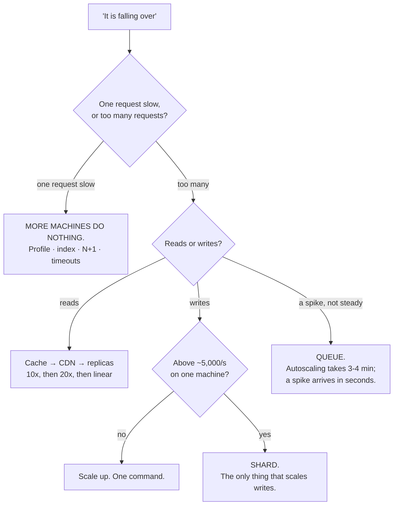

# Day 112 · System Design — Scaling revision and interview questions

**After today you can:** You can scale an unseen read-heavy system from one box to many, out loud.

**The interviewer asks it as:** *This service is falling over at 10000 QPS. Walk me through fixing it.*

---

## 1. What this is, and why they ask it

Fifteen days ago "scale" was a word. Since then:
[what scale means in numbers](../day-097-recursion-revision/README.md),
[vertical against horizontal](../day-098-what-a-tree-is/README.md),
[load balancers](../day-099-binary-trees-in-code/README.md),
[statelessness](../day-100-dfs-traversals/README.md),
[caching](../day-101-bfs-level-order/README.md),
[invalidation and eviction](../day-102-height-and-diameter/README.md),
[CDNs](../day-103-tree-comparisons/README.md),
[replication](../day-104-tree-path-problems/README.md),
[read replicas and lag](../day-105-lowest-common-ancestor/README.md),
[sharding](../day-106-bst-property/README.md),
[rebalancing and hot spots](../day-107-bst-operations/README.md),
[consistent hashing](../day-108-validating-a-bst/README.md),
[estimation](../day-109-balanced-trees/README.md),
[capacity planning](../day-110-trees-from-traversals/README.md) and
[single points of failure](../day-111-serialise-a-tree/README.md).

Three sentences. All of it collapses into **one ordered ladder** — a sequence of moves, cheapest and most
reversible first — and the skill being tested is applying them **in order** rather than reaching for the
most impressive one. Before any of it comes a **diagnosis**, because "falling over" has four different
causes and three of the moves are useless for three of them. And every move has a price, so the answer
that lands is the one that names the price at the same time as the move.

They ask *"walk me through fixing it"* because it is the only question in the phase with a wrong answer
that sounds impressive: *"I'd shard the database."* Reaching for the most expensive, least reversible move
first — before caching, before replicas, before checking whether one machine still has headroom — is the
specific failure the question is built to catch.

---

## 2. The story

The tap in the upstairs bathroom had gone to a trickle and Fareed's landlord had already had two people
look at it.

The first one had been there four hours and had taken up part of the floor to get at the pipe, found
nothing wrong, and put the floor back badly. The second had wanted to replace the pump on the roof, which
was eighteen thousand rupees, and had said the pressure was low.

The third man was older and did none of that. He stood in the bathroom for about a minute and asked three
questions.

Is it only this tap, or all of them? Only this one.

Is it bad all day, or only in the morning? All day.

Was it sudden, or has it got worse slowly? Slowly, over about a year.

Then he unscrewed the little mesh at the end of the tap with his fingers, held it up to the light, and
showed Fareed a disc of grey-white scale with about a fifth of the holes still open.

He cleaned it under the other tap with a pin, screwed it back on, and the water came out properly. Eleven
minutes.

Fareed asked how he had known.

The man said he had not known. He had **ordered** it. There were about six things it could be, and he
always did them in the same order: cheapest and quickest first, most expensive and most destructive last.
The mesh takes one minute and costs nothing. The tap washer takes ten minutes and costs twenty rupees. The
stopcock takes half an hour. The pipe means taking up the floor. The pump means eighteen thousand rupees.

He said the two men before him had both started at the wrong end, and the second one might even have been
right that the pressure was low — but you do not find that out by buying a pump, you find it out by
checking the cheap things first and seeing them all pass.

And he made a point of the three questions. He said "only this tap" ruled out four of the six before he
touched anything. If it had been every tap in the flat, he would not have looked at the mesh at all.

---

## 3. The idea in plain English

The plumber has a diagnostic followed by an ordered ladder, and that is the whole answer to *"walk me
through fixing it"*.

- The three questions are the **diagnosis**, and they eliminate most of the ladder before you start.
- "Cheapest and quickest first, most expensive and most destructive last" is the **order**.
- Buying the pump first is **sharding first**, and it is the wrong answer even when it is eventually
  needed.

### Step zero: diagnose

**Never start fixing before you know which of these it is.** They have different answers and three of them
are not helped by more machines at all.

```
 1. IS ONE REQUEST SLOW, or are there TOO MANY?
      one request slow  -> profiling, indexing, N+1 queries, a missing cache
                           MORE MACHINES DO NOTHING
      too many          -> the ladder below

 2. WHICH RESOURCE is saturated?
      CPU        -> more app servers, or cheaper code
      memory     -> bigger machines, or a leak
      disk I/O   -> indexes, or a bigger buffer pool, or SSDs
      network    -> a CDN, smaller responses
      connections-> a pooler, not more servers
      a LOCK     -> none of the above; it is a contention problem

 3. IS IT READS or WRITES?
      reads   -> cache, CDN, replicas
      writes  -> only sharding scales writes

 4. IS IT STEADY or a SPIKE?
      steady  -> capacity
      spike   -> a queue, and autoscaling will not react in time
```

**Say "throughput scales horizontally; latency does not"** — that one sentence disposes of case 1, which
is the most common misdiagnosis.

### The ladder, in order

Each rung is cheaper, faster and more reversible than the one below it. **Go down only when the one above
is exhausted.**

```
 0. MEASURE                    find the actual bottleneck        minutes      free
 1. FIX THE OBVIOUS            an index, an N+1 query,           hours        free
                               a missing timeout
 2. SCALE UP                   a bigger machine                  minutes      linear cost
 3. CACHE                      90% hit rate = 10x fewer          hours        cheap
                               reads reach the database
 4. CDN                        removes ~95% of the BYTES         hours        cheap
 5. STATELESS + LOAD BALANCER  many app servers                  days         linear
 6. READ REPLICAS              scales reads; costs lag           days         linear
 7. QUEUE / ASYNC              move work off the request path    days         cheap
 8. SHARD                      the ONLY thing that scales        months       permanent
                               writes                                          tax
 9. MULTI-REGION               latency and disaster recovery     months       very expensive
```

**Rungs 3 and 4 are where the leverage is.** A ninety percent cache hit rate removes ten times more load
than an extra replica, and it takes an afternoon.

**Rung 8 is the pump.** It is the only thing that scales writes, and its cost is not the migration — it is
that every feature built afterwards lives inside the shard key you chose.

### What each rung actually buys

```
 CACHE (90% hit)     6,000 reads/s -> 600 reach the DB          10x
 CACHE (95%)         6,000 -> 300                               20x
 CDN                 removes ~95% of BYTES, ~75% of requests
 REPLICAS            reads scale linearly; writes not at all
 STATELESS + LB      app tier scales linearly; availability too
 QUEUE               absorbs a spike INSTANTLY; autoscaling cannot
 SHARD               writes scale linearly; joins and transactions gone
```

**And the ceiling on rung 6**, which is the moment you must go to 8: **every replica applies every write**,
so at 4,000 writes a second on a 5,000-writes-a-second machine, each replica has twenty percent of itself
left for reads, and the eleventh replica adds nothing.

### The price of every move

**Naming the price at the same time as the move is what makes the answer sound experienced.**

| Move | Price |
|---|---|
| Scale up | a ceiling, downtime to resize, and **still one machine** — no availability gain |
| Cache | **staleness**, invalidation, and a **stampede** when a hot key expires |
| CDN | purges are slow; **nothing personalised**; cache-key explosion from query strings |
| Stateless | a shared session store becomes a **hot dependency on every request** |
| Replicas | **lag** — a user may not see their own write |
| Queue | the caller no longer knows the result; **at-least-once** delivery |
| Shard | **no cross-shard joins, transactions or unique constraints — permanently** |
| Multi-region | writes cannot be synchronous; conflicts or data loss |

### The five numbers to have ready

```
 86,400 s/day -> round to 100,000       1 M/day ≈ 10 QPS, 1 B/day ≈ 10,000 QPS
 one app server         ~1,000 QPS of real work
 one relational DB      ~10,000 reads/s, ~5,000 writes/s
 Redis                  ~100,000 ops/s
 cache hit rate         ~90% on a well-chosen key
 peak factor            ×3 (×100 for a scheduled event)
 replication            ×3 for storage
 utilisation target     65% — because queueing delay is u/(1−u)
```

**Those eight lines answer most numeric follow-ups.**

### The five sentences that carry the phase

1. **"Throughput scales horizontally; latency does not."** — the diagnosis.
2. **"Every replica applies every write."** — why replicas have a ceiling and sharding is the only answer
   for writes.
3. **"A cache miss must make the answer slow, never wrong."** — what may and may not be cached.
4. **"Redundancy without tested failover is a second thing that might also be broken."** — availability.
5. **"Sharding's cost is not the migration; it is every feature afterwards."** — why it is last.

### The mock: *"falling over at 10,000 QPS"*

The structure of a good answer:

```
 1. DIAGNOSE      "Slow requests or too many? Which resource? Reads or writes?
                   Steady or a spike?"                          — 30 seconds
 2. MEASURE       "What is the read-to-write ratio and where is the time going?"
 3. QUICK WINS    "Any missing index or N+1 query? Any missing timeout?"
 4. CACHE         "90% hit rate takes 9,500 reads/s down to 950."
 5. CDN           "If there is media, that removes most of the bytes before
                   anything else runs."
 6. SCALE THE TIER "Stateless app servers behind a load balancer: 10,000 peak
                   at ~1,000 each and 65% utilisation is about 15 machines."
 7. REPLICAS      "For the residual reads. Cost: lag, and read-your-own-writes."
 8. ASYNC         "Move anything not needed for the response into a queue."
 9. ONLY THEN     "If writes are the ceiling — over ~5,000/s — shard, and here
                   is the key and what it costs."
```

**Steps 1 to 3 before any architecture.** That order is the answer.

---

## 4. The picture

The ladder, with the leverage marked.

```
 cost / irreversibility
      ▲
      │  9 MULTI-REGION      ████████████  months, very expensive
      │  8 SHARD             ██████████    months, PERMANENT TAX
      │  7 QUEUE / ASYNC     ████          days
      │  6 READ REPLICAS     ████          days, costs lag
      │  5 STATELESS + LB    ████          days
      │  4 CDN               ██            hours   ← 95% of BYTES
      │  3 CACHE             ██            hours   ← 10x fewer DB reads
      │  2 SCALE UP          █             minutes
      │  1 FIX THE OBVIOUS   █             hours, free
      │  0 MEASURE           ▪             minutes, free
      └────────────────────────────────────────────────► leverage per hour spent

 GO DOWN ONLY WHEN THE RUNG ABOVE IS EXHAUSTED.
 "I'd shard it" as a first answer is buying the pump before checking the mesh.
```

The diagnosis, which comes before the ladder:



What each rung removes, on the same 10,000 QPS:

```
 starting point                          10,000 QPS, ~9,500 reads, ~500 writes
                                         all hitting one database
      │
      │  CACHE at 90%
      ▼
 after caching                           950 reads/s reach the DB     ← 10x, one afternoon
      │
      │  CDN (if there is media)
      ▼
 origin bandwidth                        down ~95%; many requests never arrive
      │
      │  STATELESS + LOAD BALANCER
      ▼
 app tier                                15 machines at 65% utilisation
      │
      │  READ REPLICAS
      ▼
 residual reads spread                   ~300/s each over 3 replicas
      │
      │  QUEUE for non-critical writes
      ▼
 synchronous writes                      500/s -> maybe 200/s on the request path
      │
      │  and ONLY IF writes are still the ceiling
      ▼
 SHARD                                   linear writes, and no cross-shard
                                         joins or transactions, for ever
```

The plumber's order, as the same picture:

```
 the mesh        1 min      free            ← check FIRST
 the washer      10 min     ₹20
 the stopcock    30 min     ₹200
 the pipe        4 hours    the floor comes up
 the pump        1 day      ₹18,000         ← the second plumber started HERE

 and the three questions eliminated four rungs before he touched anything.
```

---

## 5. How it actually works

### The full worked mock

*"This service is falling over at 10,000 QPS. Walk me through fixing it."*

**Minute 0–1: diagnose.**

> "Four questions before I change anything. **Is one request slow, or are there too many?** If a single
> query takes eight seconds, adding machines gives me ten eight-second queries — throughput scales
> horizontally, latency does not. **Which resource is saturated** — CPU, memory, disk, network,
> connections, or a lock? A lock is a contention problem and none of the usual moves help. **Reads or
> writes?** And **is it steady or a spike?**
>
> I will assume: too many requests, CPU and database-bound, read-heavy at about twenty to one, and steady
> with an evening peak."

**Minute 1–2: measure and take the free wins.**

> "Before architecture: is there a missing index, or an N+1 query pattern, or a call with no timeout? Those
> are hours of work and they routinely give more than a machine would. A missing timeout in particular is
> how a slow dependency takes the whole service down."

**Minute 2–4: the read moves.**

> "Ten thousand QPS at twenty-to-one is about 9,500 reads and 500 writes. **Cache first** — a
> well-chosen key gets around ninety percent, which takes 9,500 reads down to 950 reaching the database,
> a tenfold reduction for an afternoon's work. I would use cache-aside so that a cache failure makes the
> system slow rather than broken, a TTL on every key as a backstop, and per-key locking plus jittered TTLs
> so a hot key expiring does not send a thousand identical queries at once.
>
> **Then the CDN**, if any of this is media or static. That removes roughly ninety-five percent of the
> bytes and a large share of the requests before they reach my servers at all — for a media-heavy product
> it is the single biggest move and people skip it."

**Minute 4–6: the tier.**

> "**Make the app tier stateless** — sessions into Redis, not process memory — and put a load balancer in
> front with health checks. Then the count: 10,000 peak at roughly 1,000 QPS per server is ten machines at
> full utilisation, which is not a thing you run, so about fifteen at sixty-five percent, plus one for N+1.
> Sixty-five because queueing delay grows as `u/(1−u)` — at ninety percent utilisation requests wait nine
> times longer than at fifty.
>
> **Read replicas** for the residual reads, with the price stated: replication lag means a user may not see
> their own write, so I route a user's reads to the primary for thirty seconds after they write."

**Minute 6–8: writes and asynchrony.**

> "Five hundred writes a second is comfortable for one database, so I am **not** sharding. What I would do
> is move anything not needed for the response — notifications, analytics, search indexing, thumbnails —
> onto a **queue**. That shrinks the request path and gives me something that absorbs a spike instantly,
> which autoscaling cannot: the metric window plus boot plus warm-up plus health checks is three to four
> minutes, and a spike arrives in ten seconds."

**Minute 8–10: what would change my answer.**

> "If the write rate were 8,000 rather than 500, none of that helps and I would be sharding — by `user_id`,
> hashed, and the cost is no cross-shard joins, no cross-shard transactions and no global unique
> constraints, for ever. If it were a spike rather than steady load, I would go straight to the queue. And
> if one *request* were slow rather than there being many, I would be profiling and none of this ladder
> applies."

**That is the shape.** Diagnosis, free wins, reads, tier, writes, and an explicit statement of what would
change the answer.

### The four systems worth being able to scale

Interviewers reuse a small set. **Know the shape of each.**

```
 A READ-HEAVY FEED           ratio 100:1     cache + CDN + replicas. Shard late.
                                              Watch: celebrity fan-out.

 A CHAT SYSTEM              ratio ~1:1      caching barely helps.
                                              Shard by conversation_id early.
                                              The constraint is CONNECTIONS, not CPU.

 AN E-COMMERCE CHECKOUT     ratio 200:1     browse is cacheable; checkout is not.
                                              Inventory needs strong consistency:
                                              cache the DISPLAY, never the DECISION.

 AN ANALYTICS PIPELINE      write-heavy     queue + batch + a columnar store.
                                              Do not try to serve this from the OLTP DB.
```

**Naming which of these the prompt is, in the first minute, does a lot of the work.**

### The four things that break at each stage

```
 1 -> many app servers    connections (need a pooler) · in-process state ·
                          observability
 no cache -> cache        staleness · stampede on expiry · the read-write race
 one DB -> replicas       read-your-own-writes · monotonic reads · lag spikes
 one DB -> shards         joins · transactions · unique constraints · hot keys ·
                          rebalancing
 one region -> many       synchronous replication is impossible · conflicts
```

**Each of those lists is a follow-up waiting to be asked.**

---

## 6. The numbers

### The conversions

```
 86,400 s/day       -> round to 100,000, and say you are rounding
 1 million/day      ≈ 10 QPS
 100 million/day    ≈ 1,000 QPS
 1 billion/day      ≈ 10,000 QPS
 1 KB × 1 billion   = 1 TB
 1 MB × 1 billion   = 1 PB
```

### Machine capacities

```
 app server, real work        ~1,000 QPS
 relational DB, reads         ~10,000/s indexed
 relational DB, writes        ~5,000/s
 Redis                        ~100,000 ops/s
 network link                 ~1 GB/s
 SSD                          ~500 MB/s, ~50,000 IOPS
 connections per app server   ~20 to the DB (so 50 servers = 1,000 connections)
```

### What each move buys, quantified

```
 move              before          after           factor
 ---------------   -------------   -------------   ------
 cache 90%         6,000 reads/s   600             10x
 cache 95%         6,000           300             20x
 CDN               200 GB/hr       10 GB/hr        20x on bytes
 3 read replicas   6,000/s on 1    2,000/s each    3x
 shard × 8         10,000 w/s      1,250/s each    8x
```

### The ceilings

```
 vertical scaling      cost curve bends at ~32-64 vCPU;
                       hard stop at ~4 TB RAM or ~50,000 IOPS
 read replicas         every replica applies every write:
                       at 4,000 w/s on a 5,000 w/s machine, 20% left for reads
 one database          ~5,000 writes/s
 one app server        ~1,000 QPS
 autoscaling           3-4 minutes to react
 DNS failover          bounded below by the TTL
```

### Availability

```
 99%      3.65 days/year          99.99%    52.6 minutes
 99.9%    8.77 hours              99.999%   5.26 minutes

 in series:  six components at ~99.9% each  ->  ~99.4%  (~2 days/year)
 in parallel: two at 99.9%  ->  99.9999%  (~32 s)  — IF independent
              with 10% correlation  ->  ~99.99%  (~53 min)
```

### Utilisation

```
 utilisation   queueing delay      so, for 10,000 QPS at 1,000/server
 -----------   ---------------     ---------------------------------
 50%           1×                  20 machines
 65%           1.9×                15 machines     ← the target
 80%           4×                  13
 90%           9×                  11
 100%          unbounded           10   (and unusable)
```

### Sharding thresholds

```
 shard when   write rate > ~5,000/s and vertical scaling is exhausted
              OR the working set exceeds the largest machine (~4 TB)
 do NOT shard for read load  -> that is caching and replicas
 8 -> 9 machines             -> plain modulo moves ~89%,
                                logical shards or consistent hashing ~11%
```

---

## 7. The trade-offs

### The order is the answer, and it is defensible

**Cheapest and most reversible first.** Not because the expensive moves are wrong, but because:

- The cheap ones are often **enough** — a ninety percent cache hit rate removes ten times more load than
  another replica.
- They are **reversible**. A cache can be turned off; a shard key cannot be un-chosen.
- They **buy time to learn**. You will know much more about the workload in three months, and the shard
  key you pick then will be better.

**The one exception**: if the diagnosis says writes are the ceiling, the read moves genuinely do not help
and going down the ladder in order would be theatre. **Say the diagnosis, then jump.**

### Every move trades consistency for scale

```
 cache        stale reads
 CDN          stale content, slow purges
 replicas     read-your-own-writes violations
 queue        the caller does not know the result; at-least-once delivery
 shard        no cross-shard transactions
 multi-region no synchronous writes
```

**The pattern is one sentence: every rung buys throughput with correctness.** The design question is which
correctness you can afford to give up — and the rule from caching generalises: **the display may be stale;
the decision may not.**

### Where candidates go wrong

- **Sharding first.** The signature mistake, and it is why the question exists.
- **Not diagnosing.** Adding machines to a latency problem.
- **Forgetting the CDN.** For a media product it is the largest single move and it is invisible on most
  diagrams.
- **Treating autoscaling as headroom.** Three to four minutes of lag against a ten-second spike.
- **Not naming the price.** "Add read replicas" without "and a user may not see their own write" is half
  an answer.
- **Ignoring availability.** Every component added in series *reduces* availability, and a scaling answer
  that has quietly made the system less reliable is not a good answer.

### Where the whole ladder stops working

- **Write-heavy at genuine scale.** Sharding is the last rung and it has a floor: eventually the
  coordination costs more than the parallelism buys.
- **Strong consistency across regions.** The speed of light says no. You choose availability or
  consistency, which is [day 114](../day-114-heapify/README.md).
- **A single hot key.** No amount of sharding splits one key. Cache it, replicate it, or design a composite
  key so it cannot grow.
- **Fan-out.** One celebrity post is one write to you and fifty million to the feed system. It is invisible
  in user-facing numbers and it is the biggest trap in estimating a social product.

---

## 8. In the interview

### How it gets asked

- The mock: *"This service is falling over at 10,000 QPS. Walk me through fixing it."*
- The trap version: *"Would you shard?"* — asked early, to see whether you say yes.
- The diagnosis probe: *"How would you know what to fix?"*
- The price probe: *"What does that cost you?"*
- The limit probe: *"When does that stop working?"*

### What to say out loud, in the first ninety seconds

1. **Refuse to fix before diagnosing.** "Four questions first: is one request slow or are there too many;
   which resource is saturated; reads or writes; steady or a spike. Three of the four change the answer
   completely."
2. **Dispose of the latency case.** "If a single request is slow, more machines do nothing — throughput
   scales horizontally, latency does not. That is profiling, indexing and timeouts."
3. **Take the free wins before architecture.** "A missing index or an N+1 query is hours of work and often
   worth more than a machine."
4. **Cache, with the number.** "At twenty-to-one reads, a ninety percent hit rate takes 9,500 reads a
   second down to 950 — tenfold, in an afternoon."
5. **Give the tier count properly.** "Stateless behind a load balancer: 10,000 at a thousand each is ten
   machines at full utilisation, so about fifteen at sixty-five percent, because queueing delay grows as
   `u/(1−u)`."
6. **Say when you would shard, and refuse until then.** "Five hundred writes a second is comfortable for
   one database, so I am not sharding. I would shard above about five thousand writes a second — and the
   cost is no cross-shard joins or transactions, permanently."

### The follow-ups

**"Would you shard?"**
"Not yet, and I would want to say why rather than just no. Sharding is the only thing that scales
**writes**, so the question is whether writes are my ceiling. At 10,000 QPS with a twenty-to-one read
ratio that is about five hundred writes a second, and one relational database handles several thousand —
so writes are nowhere near the limit and sharding would solve a problem I do not have while creating
several I would keep. Its cost is not the migration; it is that **every feature built afterwards lives
inside the shard key I choose today**: no joins across shards, no transactions across shards, no global
unique constraints, and auto-increment ids that collide. I would shard when the write rate passes about
five thousand a second and vertical scaling is exhausted, or when the working set no longer fits the
largest machine. Until then the read moves — cache, CDN, replicas — do the work, and they are reversible."

**"How would you know what to fix?"**
"By diagnosing before prescribing, in four questions. **One request slow, or too many?** — because
horizontal scaling only answers the second; if a single query takes eight seconds, ten machines give me
ten eight-second queries. **Which resource is saturated?** — CPU means more servers or cheaper code, memory
means bigger machines or a leak, disk means indexes or a bigger buffer pool, network means a CDN,
connections mean a pooler rather than more servers, and a **lock** means none of those, because it is a
contention problem. **Reads or writes?** — because reads have three cheap answers and writes have one
expensive one. And **steady or a spike?** — because a spike needs a queue, and autoscaling takes three to
four minutes while a spike arrives in ten seconds. Those four questions eliminate most of the ladder
before I touch anything."

**"What does that cost you?"**
"Every rung buys throughput with correctness, and I would name the price with the move. **Caching** costs
staleness, an invalidation problem, and a stampede when a hot key expires — so a TTL on everything,
delete rather than update on write, and per-key locking. **A CDN** costs slow purges and cannot serve
anything personalised. **Statelessness** turns the session store into a hot dependency on every request.
**Read replicas** cost lag, so a user may not see their own write — I route their reads to the primary for
thirty seconds afterwards. **A queue** means the caller no longer knows the result and delivery is
at-least-once, so consumers must be idempotent. **Sharding** costs joins, transactions and unique
constraints permanently. And there is a cost people forget: every component added **in series** reduces
availability — six at 99.9 percent gives about 99.4, which is two days a year — so a scaling change can
quietly make the system less reliable."

**"When does that stop working?"**
"Each rung has a specific ceiling. **Vertical scaling**: the price per unit of power bends at around
thirty-two to sixty-four vCPU, and there is a hard stop around four terabytes of memory. **Read
replicas**: every replica applies every write, so at four thousand writes a second on a five-thousand
machine each replica has twenty percent of itself left for reads and the eleventh adds nothing — that is
the moment sharding becomes the only option. **Caching**: it stops helping when the working set does not
fit or when access is uniform, and it cannot help a write-heavy workload at all. **Autoscaling**: three to
four minutes of lag, so it saves money in the trough and not capacity at the peak. And **sharding** itself
has a floor — a single hot key cannot be split, because every row with that key value is on one machine by
definition, so that has to be designed away with a composite key rather than fixed later."

**"Walk me through it for a chat system instead."**
"That changes the answer substantially, and it is worth saying why in one sentence: **messaging is roughly
one-to-one reads to writes**, so caching and read replicas — the two cheapest rungs — barely help. The
write rate is the load. So I would shard early, by `conversation_id`, so that a conversation's messages
live together and the common query stays on one machine. And the binding constraint is usually not CPU at
all — it is **connections**: a billion users with a persistent connection at around a million per tuned
server is a thousand machines just holding sockets open. That is memory per connection, not requests per
second, and it means the design conversation is about connection handling and a pub/sub layer for
delivery, not about caching."

**"You have added all of that. Is the system more available or less?"**
"Less, unless I have been deliberate about it, and I am glad you asked because it is the thing a scaling
answer usually breaks. Components **in series** multiply their availabilities, so every dependency I add
to the critical path costs me — six at 99.9 percent gives about 99.4, which is two days a year rather than
nine hours. The mitigations are specific. Make the cache **optional** so a cache failure is slow rather
than fatal, which removes it from the product entirely. Run at least two of every stateless thing, behind
health checks, in different zones. And for each new dependency ask whether the system can **degrade** past
it instead of failing — recommendations can show a default list, search can fall back to browse. That
distinction, degradation rather than redundancy, is usually cheaper and it is what keeps the availability
arithmetic from going backwards while I make the system faster."

### A model answer

Asked: *this service is falling over at 10,000 QPS. Walk me through fixing it.*

> "I would not start fixing until I have diagnosed, because three of the four possible causes are not
> helped by the things people reach for.
>
> **Four questions.** Is **one request slow**, or are there **too many requests**? Because throughput scales
> horizontally and latency does not — if a single query takes eight seconds, ten machines give me ten
> eight-second queries. **Which resource is saturated** — CPU, memory, disk, network, connections, or a
> lock? A lock is contention and none of the usual moves touch it. **Reads or writes?** And **steady load
> or a spike?**
>
> Let me assume the common case: too many requests, read-heavy at about twenty to one, steady with an
> evening peak. So roughly 9,500 reads and 500 writes a second.
>
> **Before any architecture**, the free wins: a missing index, an N+1 query pattern, a call with no
> timeout. Those take hours and routinely beat a machine — and a missing timeout is how a slow dependency
> takes the whole service down with it.
>
> **Then cache**, because it has the most leverage per hour spent. A well-chosen key gets around ninety
> percent, which takes 9,500 reads a second down to **950** reaching the database — tenfold, in an
> afternoon. Cache-aside, so a cache failure makes the system slow rather than broken; a TTL on every key
> as the backstop for invalidation bugs; and per-key locking with jittered TTLs, so a popular key expiring
> does not send a thousand identical queries at once.
>
> **Then the CDN**, if any of this is media or static assets. That is roughly ninety-five percent of the
> bytes gone before they reach me at all, and for a media-heavy product it is the biggest single move —
> and the one people skip.
>
> **Then the tier.** Make it stateless — sessions in Redis, not process memory — behind a load balancer
> with health checks. The count: 10,000 at roughly a thousand QPS per server is ten machines at full
> utilisation, which is not a thing you run, because queueing delay grows as utilisation over one minus
> utilisation — at ninety percent, requests wait nine times longer than at fifty. So about **fifteen
> machines at sixty-five percent**, plus one for N+1, and I would check the failure case: losing one leaves
> the rest at seventy percent, which is fine.
>
> **Read replicas** for the residual reads, and I would name the price: replication lag means a user may
> not see their own write, so I route a user's reads to the primary for thirty seconds after they write.
>
> **A queue** for anything not needed in the response — notifications, analytics, search indexing. That
> shortens the request path and gives me the only thing that absorbs a spike instantly; autoscaling takes
> three to four minutes and a spike arrives in ten seconds.
>
> **And I would not shard.** Five hundred writes a second is comfortable for one database. I would shard
> when writes pass about five thousand a second, or when the working set exceeds the largest machine — and
> I would say plainly that its cost is not the migration but the permanent one: no cross-shard joins, no
> cross-shard transactions, no global unique constraints, and every future feature living inside the shard
> key I pick today.
>
> One last thing I would check, because scaling answers usually break it: every component I have added sits
> **in series** on the critical path, and availabilities multiply. Six components at 99.9 percent give
> about 99.4 — two days a year. So the cache must be **optional** rather than required, and for each new
> dependency I would ask whether the system can degrade past it rather than fail."

---

## 9. Recall card

- **Diagnose before prescribing, in four questions: one slow request or too many · which resource is
  saturated · reads or writes · steady or a spike.** *"Throughput scales horizontally; latency does not"*
  disposes of the most common misdiagnosis, and a **lock** is contention that none of the moves fix.
- **The ladder, cheapest and most reversible first: measure → fix the obvious → scale up → CACHE → CDN →
  stateless + LB → read replicas → queue → SHARD → multi-region.** Rungs 3 and 4 hold the leverage: a
  **90% hit rate is 10×** and a **CDN removes ~95% of the bytes**, both in an afternoon.
- **"I'd shard it" as a first answer is the failure the question exists to catch.** Sharding is the only
  thing that scales **writes**, so shard only above **~5,000 writes/s** or when the working set exceeds the
  biggest machine — and its cost is **not the migration but every feature afterwards**.
- **Name the price with every move**: cache → staleness and stampedes · CDN → slow purges, nothing
  personalised · stateless → a hot shared store · replicas → **lag and read-your-own-writes** · queue →
  at-least-once, caller blind · shard → **no joins, transactions or unique constraints, permanently**.
- **The numbers: 1 billion/day ≈ 10,000 QPS · app server ~1,000 QPS · DB ~10,000 reads and ~5,000 writes ·
  Redis ~100,000 ops/s · peak ×3 · size for 65% utilisation because delay is `u/(1−u)` · every replica
  applies every write.** And check the direction you moved availability: **components in series multiply**,
  so six at 99.9% is ~99.4% — make the cache **optional**, and prefer **degradation** over redundancy.
