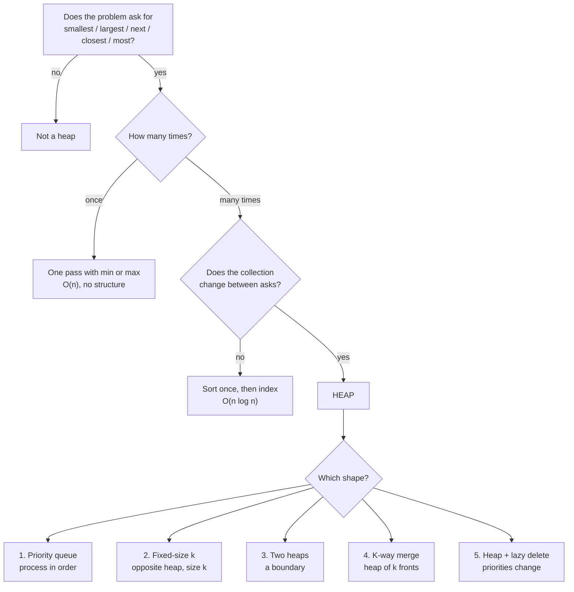

# Heaps revision and mock round

## 1. What this is, and why they ask it

Six days ago you did not know what a heap was. Today you close the topic.

This is not a new idea. It is the day you turn six days of separate lessons into one thing you can use
under pressure: a way of *recognising* that a problem wants a heap, before you have written a line.

There is exactly one question that does the recognising, and it is short:

> **Do I repeatedly need the smallest or largest thing, while the collection keeps changing?**

If yes, heap. If the collection never changes, sort once and index — a heap buys you nothing. If you need
the whole order, sort. If you need *one end, again and again, from a set that grows and shrinks* — that is
the heap's exact job, and nothing else does it in `O(log n)`.

Everything in this lesson hangs off that sentence.

By the end you will have:

- the recognition question, and the three ways problems phrase it so you do not notice
- the five shapes every heap problem in an interview takes
- the `heapq` checklist — the six things that actually go wrong in Python
- one table of costs you can recite
- two mock problems you have not seen, solved out loud, with the timing of a real round

This is a revision day. Read it with the previous six days closed.

---

## 2. The story

Meera has worked the admissions desk at a district hospital for eleven years. The desk is a narrow counter
by the front door, and from eight in the morning people arrive at it without stopping.

New staff find the desk terrifying. There is a queue, and the queue does not behave. A man with a cut hand
joins the back. Four minutes later a woman is carried in by two neighbours and everything reshuffles. A
child who has been waiting an hour is still waiting. New staff try to hold the whole line in their head —
who came when, who is where, what is fair — and by ten they are exhausted and making mistakes.

Meera does not hold the line in her head. She told a new girl why on her second day.

"Every single thing anyone asks me at this desk," she said, "is one of five questions. Not six. Five. And
before I answer any of them I ask myself one thing first: do they want the next one, or do they want the
whole list?"

The girl said that could not be true.

"Try me," said Meera. "Go on. Ask me anything you have been asked today."

The girl said: who goes in next.

"Next one."

Who are the five sickest people here.

"Next one, five times."

How many people are waiting.

"Whole list. Count them. That is not my kind of question at all, that is a different job."

The girl thought, and asked: which family is exactly in the middle of the waiting time — half have waited
longer, half less.

"Next one," said Meera, "but from both ends at once. I keep the long-waiters on my left and the short
ones on my right and I watch the two people standing at the join. That is the only hard one, and it is
still the same question."

The girl was quiet for a while. Then she said the thing that made Meera nod.

"So you never actually sort the queue."

"Sort it," said Meera. "For what? By the time I finished sorting it, it would be wrong. Two people would
have gone in and three arrived. I only ever need to know who is next. Everyone else can stand in any order
they like and it costs me nothing."

---

## 3. The idea in plain English

Meera's first question is the recognition question:

> **Do you want the next one, or the whole list?**

*Next one, repeatedly, from a collection that keeps changing* is the heap. Everything else is a different
tool. That is the whole of the recognition, and it is worth saying out loud until it is automatic, because
interview problems do not say "use a heap". They say one of three things instead.

**Phrasing one: the superlative.** "The k largest." "The closest points." "The most frequent words." "The
cheapest option available now." Any superlative, asked more than once, is the recognition question wearing a
hat.

**Phrasing two: the schedule.** "Process the events in order as they arrive." "Which meeting room frees up
first?" "Which task should the worker take next?" A schedule is a stream of *next-one* questions. The
collection changes between every question, which is exactly the condition.

**Phrasing three: the boundary.** "The median." "The 90th percentile." A boundary is two *next-one*
questions facing each other — the largest of the small half and the smallest of the large half — which is
why the boundary problems take two heaps and not one.

Then there is the negative recognition, which matters just as much. **A heap is the wrong answer when:**

- The collection is fixed. Sort once, then index. Sorting is `O(n log n)` once; a heap gives you the same
  and then makes you pop `n` times to get the order back.
- You need the whole order. Sorting is faster in practice and one line long.
- You need to find, update, or delete an arbitrary element by value. A heap cannot do this. Finding an
  element in a heap is `O(n)` — a linear scan, because a heap is only ordered along the paths from the top,
  not left to right. If a problem needs "increase the priority of task 47", you need a heap with an index
  map, or a different structure entirely.
- `k` is close to `n`. `O(n log k)` and `O(n log n)` are the same number when `k = n`, and the sort has a
  smaller constant and one line of code.

The last sentence of the story is the reason the whole structure exists. Meera never sorts the queue.
A heap does not sort. It maintains just enough order to answer *who is next* and no more — one comparison
per parent-child pair, along the paths to the top, and nothing about left-to-right. That partial order is
what makes push and pop `O(log n)` instead of `O(n)`. You are buying exactly one fact, cheaply, over and
over.

---

## 4. The picture

### The recognition, as one decision



*Notice the two questions that send you away from the heap. "Once" and "does not change" are both very
common, and both have simpler answers. The heap is the leaf you reach only after ruling those out.*

### The five shapes, side by side

```
SHAPE 1 — PRIORITY QUEUE                 SHAPE 2 — FIXED-SIZE K
"process in priority order"              "the k largest"

  heap holds: everything                   heap holds: exactly k
  size: n                                  size: k
  op:   push all, pop all                  op:   push, then pop if > k
  cost: O(n log n)                         cost: O(n log k)
  ex:   Dijkstra, task scheduler           ex:   top k frequent, k closest

                                           TRAP: the heap is the OPPOSITE
                                           kind. k largest -> MIN-heap.

SHAPE 3 — TWO HEAPS                      SHAPE 4 — K-WAY MERGE
"the median, a percentile"               "merge k sorted lists"

  low  = max-heap (small half)             heap holds: the k fronts
  high = min-heap (large half)             size: k, never n
  invariant: max(low) <= min(high)         op:   pop, emit, push successor
             sizes differ by <= 1          cost: O(n log k)
  cost: O(log n) insert, O(1) read         ex:   merge k lists, sorted matrix
  ex:   running median, sliding median
                                           TRAP: push (value, index, ...) so
                                           ties never compare the payload.

SHAPE 5 — HEAP + LAZY DELETION
"priorities change, or items expire"

  heap holds: stale entries too
  op:   push the new version; on pop,
        discard entries that are out of date
  cost: O(log n) amortised, O(n) space worst case
  ex:   Dijkstra without decrease-key, sliding-window median,
        task queue with cancellation

  TRAP: len(heap) is NOT the logical size. Track that separately.
```

*Notice that shapes 2, 4 and 5 all keep the heap small — `k`, `k`, and "however many stale entries have
piled up". The size of the heap is the single most useful thing to say out loud when you start, because it
is where the complexity comes from.*

### The array, one last time

```
       tree view                        array view
                                  index: 0   1   2   3   4   5   6
          2                       value: 2   4   3   9   5   7   8
        /   \
       4     3                    parent(i) = (i - 1) // 2
      / \   / \                   left(i)   = 2*i + 1
     9   5 7   8                  right(i)  = 2*i + 2

  RULE: every parent <= both children.
  NOT A RULE: left <= right. Look at index 1 and 2: 4 then 3.
              Look at 3 and 4: 9 then 5. Neither is sorted.
```

*Notice the "not a rule" line. Half of all heap confusion comes from expecting the array to be sorted. It
is not, it never will be, and it does not need to be — the only guaranteed fact is that index 0 holds the
minimum.*

---

## 5. The code, built step by step

This section is a set of templates. Learn these five and you can write any heap problem in an interview.
Each one is short enough to write from memory, and that is the point — you should not be *designing*
during a round, you should be recognising and then typing.

### Shape 1 — the plain priority queue

Push everything, pop in order. This is the shape when the problem says "process these in priority order".

```python
import heapq

def process_in_order(tasks: list[tuple[int, str]]) -> list[str]:
    """tasks are (priority, name). Lower number = higher priority."""
    heap = list(tasks)
    heapq.heapify(heap)                    # O(n), not n pushes
    done: list[str] = []
    while heap:
        priority, name = heapq.heappop(heap)
        done.append(name)
    return done
```

Two details worth having automatic. `heapify` is `O(n)` and n separate pushes are `O(n log n)` — when you
have all the data up front, always heapify. And the tuple orders by its first element, then its second,
which is why `(priority, name)` sorts by priority and breaks ties alphabetically for free.

### Shape 2 — the fixed-size k heap

The most common heap problem in interviews, and the one with the trap in it.

```python
def k_largest(numbers: list[int], k: int) -> list[int]:
    """The k largest values. Note: a MIN-heap."""
    heap: list[int] = []
    for value in numbers:
        heapq.heappush(heap, value)
        if len(heap) > k:
            heapq.heappop(heap)            # evict the smallest
    return heap
```

Say the trap out loud every time, because it never stops feeling backwards: **for the k largest you keep a
min-heap.** The top of a min-heap is the smallest thing you are keeping, which is exactly the thing to throw
away when a better one arrives. The heap holds the survivors; its top is the weakest survivor.

The cost is `O(n log k)`, and the space is `O(k)` — which is the real reason to do it this way. Sorting is
`O(n log n)` time and `O(n)` space. When n is a billion and k is ten, the space is what saves you.

### Shape 3 — two heaps

The boundary shape. `low` is a max-heap holding the small half; Python has no max-heap, so the values go in
negated.

```python
class Median:
    def __init__(self) -> None:
        self.low: list[int] = []           # max-heap, values NEGATED
        self.high: list[int] = []          # min-heap

    def add(self, value: int) -> None:
        heapq.heappush(self.low, -value)                    # 1. push
        heapq.heappush(self.high, -heapq.heappop(self.low)) # 2. shift
        if len(self.high) > len(self.low):                  # 3. rebalance
            heapq.heappush(self.low, -heapq.heappop(self.high))

    def median(self) -> float:
        if len(self.low) > len(self.high):
            return float(-self.low[0])
        return (-self.low[0] + self.high[0]) / 2
```

Push-shift-rebalance is one unit — never write one of the three lines without the other two. The blind push
into `low` is safe precisely *because* the shift follows it and moves `low`'s new top across, which is what
restores `max(low) <= min(high)`.

### Shape 4 — the k-way merge

```python
def merge_k(lists: list[list[int]]) -> list[int]:
    heap = [(lst[0], i, 0) for i, lst in enumerate(lists) if lst]
    heapq.heapify(heap)
    out: list[int] = []
    while heap:
        value, list_index, position = heapq.heappop(heap)
        out.append(value)
        if position + 1 < len(lists[list_index]):
            nxt = lists[list_index][position + 1]
            heapq.heappush(heap, (nxt, list_index, position + 1))
    return out
```

Three fields, always: the value to order by, the list it came from, and where in that list. The middle field
is a free tie-breaker — list indices are distinct integers, so two equal values never fall through to
comparing the payload.

### Shape 5 — the heap with lazy deletion

Used whenever an item's priority changes, or items expire, and you cannot reach into the heap to fix them.

```python
def dijkstra(graph: dict[int, list[tuple[int, int]]], start: int) -> dict[int, int]:
    best: dict[int, int] = {start: 0}
    heap = [(0, start)]
    while heap:
        distance, place = heapq.heappop(heap)
        if distance > best.get(place, float("inf")):
            continue                       # stale entry: skip it
        for neighbour, weight in graph[place]:
            candidate = distance + weight
            if candidate < best.get(neighbour, float("inf")):
                best[neighbour] = candidate
                heapq.heappush(heap, (candidate, neighbour))
    return best
```

The one line that matters is `if distance > best.get(...): continue`. You never remove the outdated entry.
You leave it in the heap and ignore it when it surfaces. That is the whole technique, and it is why real
Dijkstra implementations do not need a `decrease-key` operation.

### The `heapq` checklist

Six facts. These are the things that actually go wrong.

```python
import heapq

heapq.heapify(items)          # O(n), in place, returns None
heapq.heappush(heap, item)    # O(log n)
heapq.heappop(heap)           # O(log n), returns the SMALLEST
heap[0]                       # O(1), peek, does not remove
heapq.heappushpop(heap, x)    # push then pop, one sift, faster
heapq.heapreplace(heap, x)    # pop then push, heap must be non-empty
heapq.nlargest(k, items)      # O(n log k) when k << n
```

1. **Min-heap only.** For a max-heap, negate on the way in and on the way out. Two negations, never one.
2. **`heapify` returns `None`.** `heap = heapq.heapify(x)` gives you `None` and a confusing crash later.
3. **`heap[0]` is a peek, not a pop.** There is no `heapq.peek`.
4. **Tuples compare left to right.** Add a unique tie-breaker before any object you do not want compared.
5. **`len(heap)` is not the logical size** when you are deleting lazily. Track the real count yourself.
6. **You cannot delete an arbitrary element.** If you need to, delete it lazily or use a different structure.

### The negation, written out once

For a max-heap of tuples, negate only the key you are ordering by, and remember there is one negation on the
way in and one on the way out:

```python
max_heap: list[tuple[int, str]] = []
heapq.heappush(max_heap, (-score, name))       # in: negate
top_score, top_name = max_heap[0]
top_score = -top_score                         # out: negate back
```

### The complete solution: one file with all five shapes

```python
"""Day 119 — the five heap shapes, ready to run.

Each function is the smallest complete example of one shape.
"""

from __future__ import annotations

import heapq
from collections import Counter


# ---------- Shape 1: priority queue ----------

def schedule(tasks: list[tuple[int, str]]) -> list[str]:
    """Return task names in priority order. Lower number goes first."""
    heap = list(tasks)
    heapq.heapify(heap)
    return [heapq.heappop(heap)[1] for _ in range(len(heap))]


# ---------- Shape 2: fixed-size k ----------

def top_k_frequent(words: list[str], k: int) -> list[str]:
    """The k most frequent words. O(n log k) time, O(n) space for the counts."""
    counts = Counter(words)
    heap: list[tuple[int, str]] = []
    for word, count in counts.items():
        heapq.heappush(heap, (count, word))
        if len(heap) > k:
            heapq.heappop(heap)
    return [word for count, word in sorted(heap, reverse=True)]


def k_closest_points(points: list[tuple[int, int]], k: int) -> list[tuple[int, int]]:
    """The k points closest to the origin. Max-heap of size k, via negation."""
    heap: list[tuple[int, int, int]] = []
    for x, y in points:
        distance = x * x + y * y                  # no square root needed
        heapq.heappush(heap, (-distance, x, y))
        if len(heap) > k:
            heapq.heappop(heap)                   # evict the farthest
    return [(x, y) for negative_distance, x, y in heap]


# ---------- Shape 3: two heaps ----------

class MedianFinder:
    """Running median in O(log n) per insert, O(1) per query."""

    def __init__(self) -> None:
        self.low: list[int] = []                  # max-heap, values negated
        self.high: list[int] = []                 # min-heap

    def add(self, value: int) -> None:
        heapq.heappush(self.low, -value)
        heapq.heappush(self.high, -heapq.heappop(self.low))
        if len(self.high) > len(self.low):
            heapq.heappush(self.low, -heapq.heappop(self.high))

    def median(self) -> float:
        if not self.low:
            raise ValueError("no values yet")
        if len(self.low) > len(self.high):
            return float(-self.low[0])
        return (-self.low[0] + self.high[0]) / 2


# ---------- Shape 4: k-way merge ----------

def merge_sorted_lists(lists: list[list[int]]) -> list[int]:
    """Merge k sorted lists. O(n log k) time, O(k) heap space."""
    heap = [(lst[0], i, 0) for i, lst in enumerate(lists) if lst]
    heapq.heapify(heap)
    merged: list[int] = []
    while heap:
        value, list_index, position = heapq.heappop(heap)
        merged.append(value)
        following = position + 1
        if following < len(lists[list_index]):
            heapq.heappush(heap, (lists[list_index][following], list_index, following))
    return merged


# ---------- Shape 5: heap with lazy deletion ----------

def shortest_paths(
    graph: dict[str, list[tuple[str, int]]], start: str
) -> dict[str, int]:
    """Dijkstra with lazy deletion instead of decrease-key."""
    best: dict[str, int] = {start: 0}
    heap: list[tuple[int, str]] = [(0, start)]
    while heap:
        distance, place = heapq.heappop(heap)
        if distance > best.get(place, 10**18):
            continue                              # stale: a better route won already
        for neighbour, weight in graph.get(place, []):
            candidate = distance + weight
            if candidate < best.get(neighbour, 10**18):
                best[neighbour] = candidate
                heapq.heappush(heap, (candidate, neighbour))
    return best


if __name__ == "__main__":
    print(schedule([(3, "post"), (1, "fire"), (2, "leak")]))
    # ['fire', 'leak', 'post']

    print(top_k_frequent(["a", "b", "a", "c", "b", "a"], 2))
    # ['a', 'b']

    print(k_closest_points([(1, 1), (5, 5), (0, 2), (9, 9)], 2))
    # two closest, order not guaranteed

    finder = MedianFinder()
    for number in [5, 15, 1, 3]:
        finder.add(number)
        print(number, "->", finder.median())
    # 5 -> 5.0 / 15 -> 10.0 / 1 -> 5.0 / 3 -> 4.0

    print(merge_sorted_lists([[1, 4, 9], [2, 3], [], [0, 10]]))
    # [0, 1, 2, 3, 4, 9, 10]

    roads = {
        "home": [("market", 4), ("park", 1)],
        "park": [("market", 2), ("school", 7)],
        "market": [("school", 3)],
        "school": [],
    }
    print(shortest_paths(roads, "home"))
    # {'home': 0, 'market': 3, 'park': 1, 'school': 6}
```

Run it. Every printed line is in the comments so you can check without thinking.

---

## 6. What it costs

### The one table

| Operation | Cost | Why |
|---|---|---|
| `heappush` | `O(log n)` | one sift up, at most the height |
| `heappop` | `O(log n)` | one sift down, at most the height |
| `heap[0]` (peek) | `O(1)` | it is just index 0 |
| `heapify` | `O(n)` | not `O(n log n)` — see below |
| build by n pushes | `O(n log n)` | n separate sifts |
| find an arbitrary value | `O(n)` | the heap is not ordered left to right |
| delete an arbitrary value | `O(n)` | find it first |
| `heapq.nlargest(k, xs)` | `O(n log k)` | a size-k heap internally |
| sort | `O(n log n)` | for comparison |

### Why `heapify` is `O(n)` and not `O(n log n)`

This gets asked, so have the arithmetic ready. `heapify` sifts down from the last parent up to the root.
Most nodes are near the bottom, and nodes near the bottom sift down almost no distance.

For `n = 1,000,000`:

```
level     nodes at level     max sift distance     work
-------------------------------------------------------
bottom       500,000                0                   0
next         250,000                1             250,000
next         125,000                2             250,000
next          62,500                3             187,500
next          31,250                4             125,000
...
root               1               19                  19
                                            ------------
                                    total  ≈  1,000,000
```

Half the nodes do zero work. A quarter do one step. The sum `n/2 × 0 + n/4 × 1 + n/8 × 2 + ...` converges
to `n`. Compare with a million pushes, which is `1,000,000 × 20 = 20,000,000` steps. **Heapify is twenty
times cheaper here, and it is one line.** Use it whenever you have the data up front.

### The k versus n arithmetic

Where the fixed-size shape actually pays. Take `n = 1,000,000`:

```
approach                     comparisons              memory held
-----------------------------------------------------------------
sort, take k              20,000,000              1,000,000 items
heap of size k=10          3,300,000                     10 items
heap of size k=100         6,600,000                    100 items
heap of size k=1,000      10,000,000                  1,000 items
heap of size k=100,000    17,000,000                100,000 items
heap of size k=500,000    19,000,000                500,000 items
```

`log2(10) = 3.3`, `log2(100) = 6.6`, `log2(1,000,000) = 20`. Two things fall out. The time advantage
**shrinks as k grows** and is nearly gone by `k = n/2`. The memory advantage does not shrink — it is always
`k` against `n`, and at `k = 10` that is a hundred thousand times less. **When you justify the heap in an
interview, lead with the space.** It is the stronger argument and most candidates never make it.

### The stream argument

The third and best reason, and it has no arithmetic — it has a constraint. Sorting needs all the data at
once. If the values arrive one at a time and there are more of them than fit in memory, sorting is not slow,
it is *impossible*. A size-k heap handles an infinite stream in `O(k)` space. Say this whenever the problem
mentions a stream, a log, a feed, or "as they arrive".

---

## 7. The traps

**Trap 1: the wrong heap for the k problem.** For the k *largest* you keep a *min*-heap. Every single person
gets this backwards at first. The fix is to say what the top of the heap is *for*: it is the thing you throw
away. For the k largest, you throw away the smallest survivor.

```
k largest  -> MIN-heap of size k -> top is the weakest survivor -> evict it
k smallest -> MAX-heap of size k -> top is the worst survivor   -> evict it
```

**Trap 2: forgetting a negation, or doing it once.** For a max-heap you negate going in and negate coming
out. One negation gives you numbers that look almost right.

```python
>>> heap = []
>>> heapq.heappush(heap, -50)
>>> heapq.heappush(heap, -20)
>>> heap[0]           # forgot to negate back
-50
```

No error. Just a minus sign that flows into your answer.

**Trap 3: comparing objects that cannot be compared.**

```python
>>> import heapq
>>> class Task: pass
>>> heap = []
>>> heapq.heappush(heap, (1, Task()))
>>> heapq.heappush(heap, (1, Task()))
Traceback (most recent call last):
  File "<stdin>", line 1, in <module>
TypeError: '<' not supported between instances of 'Task' and 'Task'
```

Note *when* it fails: only when the first fields tie. It passes your first test and fails in production.
Always push a unique tie-breaker — a counter, an index — before the payload.

**Trap 4: assuming the array is sorted.**

```python
>>> heap = [5, 3, 8, 1, 9, 2]
>>> heapq.heapify(heap)
>>> heap
[1, 3, 2, 5, 9, 8]
```

`1, 3, 2` — index 1 holds 3 and index 2 holds 2. It is not sorted and never will be. Only `heap[0]` is
guaranteed. If someone asks for the second-smallest, it is *not* `heap[1]`; it is `min(heap[1], heap[2])`.

**Trap 5: `heapify` returns `None`.**

```python
>>> heap = heapq.heapify([5, 3, 8])
>>> heap[0]
Traceback (most recent call last):
  File "<stdin>", line 1, in <module>
TypeError: 'NoneType' object is not subscriptable
```

It sorts in place. Call it as a statement.

**Trap 6: popping from an empty heap.**

```python
>>> heapq.heappop([])
Traceback (most recent call last):
  File "<stdin>", line 1, in <module>
IndexError: index out of range
```

`while heap:` rather than a fixed count, or check the length.

**Trap 7: using `len(heap)` as the logical size with lazy deletion.** If half the entries are stale,
`len(heap)` is roughly twice the truth. Every rebalance and every size check reads the wrong number. Keep
your own counter.

**Trap 8: reaching for a heap when a sort is right there.** If the input is a fixed list and you need the
whole thing ordered, `sorted(items)` is faster and one line. Using a heap there is a small signal that you
are pattern-matching rather than thinking. Say the reason you chose it.

---

## 8. In the interview

### How it gets asked

Heap problems almost never say "heap". They say:

- *"Find the k most frequent elements in this list."*
- *"Return the k closest points to the origin."*
- *"Merge these sorted lists."*
- *"Design a system that tracks the median of a stream of numbers."*
- *"You have a stream of stock prices. Report the top 10 gainers at any moment."*
- *"Given a list of meetings, find the minimum number of rooms needed."*
- *"Find the shortest path in a weighted graph."* — Dijkstra is a heap problem in a coat.

And the ones that test whether you know when *not* to:

- *"Sort these million numbers."* — not a heap. Say so.
- *"Find the maximum value in this list."* — one pass, `O(n)`. Not a heap.

### The first ninety seconds

Say this, in this order, before any code:

> "Let me check what kind of question this is. I need the largest values, and I need them from a collection
> that keeps changing as I scan — so this is repeated 'give me the extreme', which is a heap rather than a
> sort.
>
> Specifically it is the fixed-size shape: I keep a heap of exactly k, and the top of it is the weakest
> thing I am keeping, so it is the one I evict when something better arrives. Since I want the k *largest*,
> the heap is a *min*-heap. That feels backwards and it is worth saying out loud.
>
> That gives me `O(n log k)` time and — this is the part I actually care about — `O(k)` space. Sorting is
> `O(n log n)` and `O(n)`. If n is a billion and k is ten, the space is the difference between this working
> and not.
>
> One more thing: because the heap only ever holds k items, this works on a stream. I never need all the
> data at once. Shall I write it?"

That is ninety seconds and it contains the recognition, the shape, the trap, both costs, and the streaming
argument. Very few candidates give the space and streaming reasons at all.

### The follow-ups

**"What if k is close to n?"**

> "Then the heap stops being worth it. `O(n log k)` and `O(n log n)` are the same thing when `k = n`, and
> sorting has a smaller constant factor and is one line. The crossover in practice is around `k = n/10`.
> Below that, heap; above it, I would sort. And if k is larger than n/2, there is a neat trick — find the
> `n - k` smallest instead and take the complement."

**"Can you do it without a heap?"**

> "Quickselect. It partitions around a pivot like quicksort but only recurses into the side containing the
> kth element, so the average is `O(n)` — better than the heap. Two catches. The worst case is `O(n²)` with
> a bad pivot, though a random pivot makes that vanishingly unlikely. And it needs the whole array in memory
> and rearranges it, so it does not work on a stream. If the data fits and I want the k largest once,
> quickselect. If it is a stream or I need to keep answering, heap."

**"How do you change an item's priority?"**

> "A heap cannot do it directly — finding the item is `O(n)` because the array is not ordered left to right.
> Two options. Keep a dictionary from item to its index in the array and update it on every swap, which
> gives `O(log n)` decrease-key but is fiddly and easy to get wrong. Or delete lazily: push the new version,
> leave the old one, and skip entries when they surface that no longer match your best-known value. That is
> one extra line and it is what real Dijkstra implementations do. The cost is memory — the heap can hold up
> to one entry per push. I would do lazy deletion unless memory was the constraint."

**"Why is heapify O(n) when n pushes are O(n log n)?"**

> "Because most nodes are near the bottom and barely move. Half the nodes are leaves and sift down zero
> steps, a quarter sift one, an eighth sift two. The sum `n/2 × 0 + n/4 × 1 + n/8 × 2 + ...` converges to n.
> Pushing is the other direction — every push starts at the bottom and can travel the full height, so every
> one of them is potentially `log n`. Practically: at a million elements heapify is about a million steps
> and n pushes is about twenty million."

### The model answer

*"Design something that returns the 10 most-viewed articles right now, over a stream of view events."*

> "Let me get the shape first. Views arrive continuously, and at any moment someone can ask for the top ten.
> So it is repeated 'give me the extreme' from a changing collection — a heap, not a sort. And k is ten
> while n is unbounded, so it is the fixed-size shape.
>
> The naive version: a dictionary from article to view count, and a min-heap of size ten holding
> `(count, article)`. On each view I bump the count. If the article is already in the heap its count is now
> stale, and if it is not in the heap I compare against `heap[0]` and swap if it beats it.
>
> Straight away there is a bug I should name. The counts inside the heap go stale, because I bump the
> dictionary but the heap holds a copy. So this is really the fifth shape — a heap with lazy deletion. When
> I pop, I check the entry's count against the dictionary and discard it if they disagree. That is one line
> and it is the line most people miss.
>
> Costs. The dictionary is `O(distinct articles)` — say ten million articles at fifty bytes, that is 500 MB,
> which is a lot but survivable on one machine. The heap is `O(k)`, nothing. Each view is `O(log k)` which
> at k = 10 is about three comparisons — at a hundred thousand views a second that is trivial.
>
> Now the honest part. At real scale you would not do this. The dictionary is the problem, not the heap —
> it grows with distinct articles and it lives on one machine. Production would use a sketch: count-min
> sketch or a Space-Saving structure, which gives approximate counts in bounded memory, a few megabytes for
> millions of items, with a small error you can bound. You trade exactness for memory, and for 'top ten
> articles' nobody cares if the tenth is occasionally the eleventh.
>
> If they wanted exact counts and a real-time window, I would shard by article ID, keep a per-shard top-k,
> and merge the shard results — which is a k-way merge, the fourth shape, so the same tool twice at
> different levels.
>
> The one thing I would push back on: 'right now' needs defining. All-time, last hour, or last day? A time
> window changes the answer completely — I would need per-bucket counts and to expire old buckets, which is
> a different structure. I would ask before building."

That answer names the shape, finds the staleness bug unprompted, gives the arithmetic, admits where the
approach fails, and asks the clarifying question. That is what a strong round sounds like.

---

### Mock round: two problems, timed

Do these before reading the walkthroughs. Twenty minutes each. Talk out loud the whole time.

#### Mock problem 1 — Task scheduler with cooldown

> You have a list of tasks, each labelled `A` to `Z`. Each unit of time you can run one task or stay idle.
> The same task cannot run twice within `n` units of time. Return the minimum time to finish everything.
>
> Example: `["A","A","A","B","B","B"]`, `n = 2` → `8`. One valid order is
> `A B idle A B idle A B`.

**Minutes 0-3, the recognition.** "Every step I need the task with the most work left that is not on
cooldown. That is repeated 'give me the largest' from a changing set — heap. Counts change as I run tasks,
so it is a plain priority queue over counts, with a side structure for the cooling-down ones."

**Minutes 3-6, the picture.** A max-heap of remaining counts. A queue of `(count, time_it_becomes_ready)`
for tasks on cooldown. Each tick: move anything whose ready-time has arrived from the queue back to the
heap; pop the heap and run it; if it has work left, put it on the cooldown queue.

**Minutes 6-15, the code.**

```python
import heapq
from collections import Counter, deque

def least_interval(tasks: list[str], n: int) -> int:
    counts = Counter(tasks)
    heap = [-count for count in counts.values()]     # max-heap via negation
    heapq.heapify(heap)
    cooling: deque[tuple[int, int]] = deque()        # (negative count, ready time)
    time = 0
    while heap or cooling:
        time += 1
        if cooling and cooling[0][1] == time:
            heapq.heappush(heap, cooling.popleft()[0])
        if heap:
            remaining = heapq.heappop(heap) + 1      # one less; less negative
            if remaining:
                cooling.append((remaining, time + n + 1))
    return time
```

**Minutes 15-20, the analysis.** "Time is `O(total tasks × log 26)`, and since there are only 26 labels the
log is a constant — effectively `O(total)`. Space is `O(26)`, constant. The negation is the trap: `+1` makes
a negative number *less* negative, which is the right direction, and `if remaining:` is true for any
non-zero value including negatives, which is exactly what I want."

If you finish early, the follow-up is always: *is there a formula?* There is —
`max((most_frequent - 1) × (n + 1) + number_of_tasks_tied_for_most, len(tasks))`. Mention that you know it
exists and that the simulation is the one you would trust under pressure.

#### Mock problem 2 — The k-th smallest sum from two arrays

> Given two sorted arrays `a` and `b`, return the k-th smallest value of `a[i] + b[j]` over all pairs.
>
> `a = [1, 7, 11]`, `b = [2, 4, 6]`, `k = 3` → `9` (the sums in order are 3, 5, 7, 9, ...).

**The recognition.** "There are `len(a) × len(b)` sums, which could be a trillion — I cannot build them all.
But I need them in increasing order and I only need the first k. Repeated 'give me the smallest' from a
changing set: heap."

**The insight, and this is the whole problem.** Think of the sums as a grid where row `i` is
`a[i] + b[0], a[i] + b[1], ...`. Every row is sorted, because `b` is sorted. So this is *merging
`len(a)` sorted lists* — the fourth shape — and stopping after k pops.

**The code.**

```python
def kth_smallest_sum(a: list[int], b: list[int], k: int) -> int:
    heap = [(a[i] + b[0], i, 0) for i in range(min(len(a), k))]
    heapq.heapify(heap)
    for _ in range(k - 1):
        total, i, j = heapq.heappop(heap)
        if j + 1 < len(b):
            heapq.heappush(heap, (a[i] + b[j + 1], i, j + 1))
    return heap[0][0]
```

**The analysis.** "The heap holds at most `min(len(a), k)` entries, so `O(k log k)` time and `O(k)` space,
regardless of how enormous the full grid is. `min(len(a), k)` rather than `len(a)` matters: if `a` has a
million entries and `k` is five, seeding a million-entry heap would be silly — I can never pop more than k
of them."

The point of this mock is the reframing. The problem does not look like a merge. Saying *"each row is
sorted, so this is a k-way merge"* out loud is the entire solution, and it is the sentence the interviewer
is listening for.

---

## 9. Recall card

**The recognition question:** do I repeatedly need the smallest or largest, from a collection that keeps
changing? Yes → heap. Fixed collection → sort. Whole order → sort. Once → one pass.

**The three phrasings:** a superlative asked repeatedly; a schedule; a boundary.

**The five shapes:**

| # | Shape | Heap holds | Cost | Example |
|---|---|---|---|---|
| 1 | Priority queue | everything | `O(n log n)` | scheduler, Dijkstra |
| 2 | Fixed-size k | exactly k, opposite kind | `O(n log k)`, `O(k)` space | top k frequent |
| 3 | Two heaps | the two halves | `O(log n)` in, `O(1)` read | running median |
| 4 | K-way merge | the k fronts | `O(n log k)` | merge k lists |
| 5 | Lazy deletion | stale entries too | `O(log n)` amortised | Dijkstra, sliding median |

**The costs:** push `O(log n)`, pop `O(log n)`, peek `O(1)`, heapify `O(n)`, find anything `O(n)`.

**Heapify is `O(n)`** because half the nodes are leaves that move zero steps: `n/2×0 + n/4×1 + n/8×2 + … → n`.

**The k trap:** k *largest* → *min*-heap. The top is the weakest survivor, the one you evict.

**The `heapq` six:** min-heap only (negate twice); `heapify` returns `None`; `heap[0]` peeks; tuples compare
left to right so add a tie-breaker; `len(heap)` lies when deleting lazily; no arbitrary delete.

**The array is not sorted.** Only `heap[0]` is guaranteed. Second-smallest is `min(heap[1], heap[2])`.

**Lead with space, not time.** `O(k)` versus `O(n)` is the strong argument, and it is the one that makes
streams possible at all.

**Not a heap when:** the data is fixed, you need the whole order, k ≈ n, or you must update items by value.

---

**Next:** [Day 120 — The trie: a tree of characters](../day-120-the-trie/README.md)

**Previous:** [Day 118 — Two heaps: the running median](../day-118-two-heaps/README.md)
