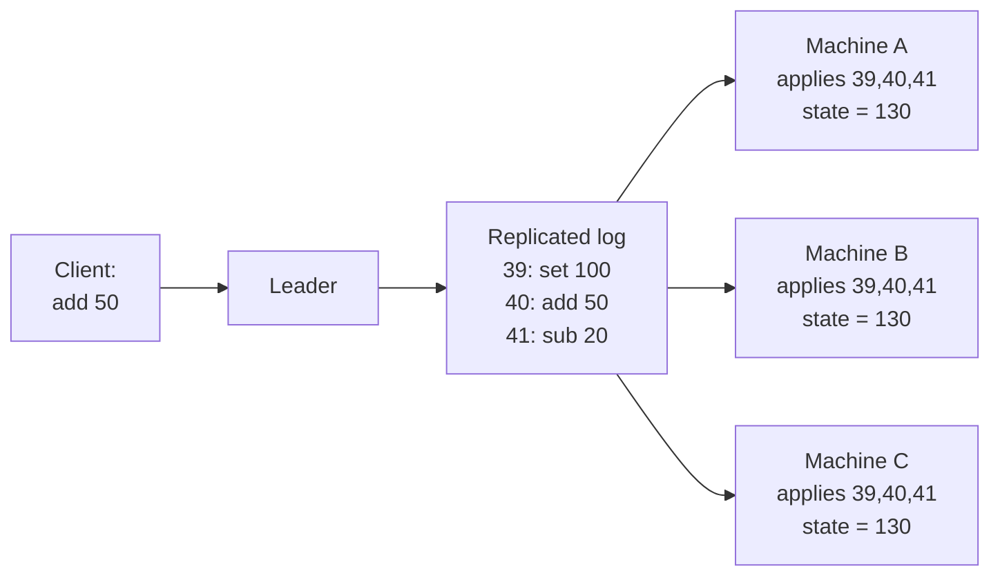
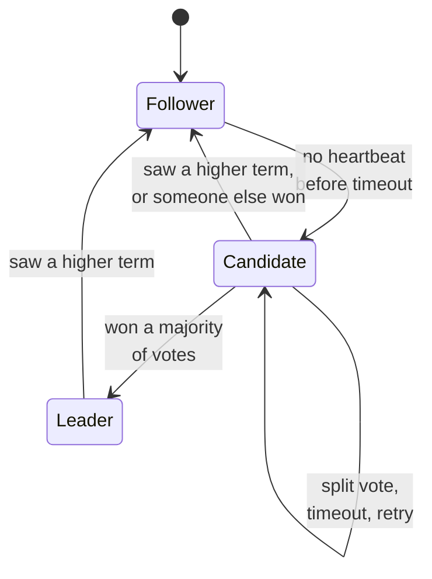

# Consensus, and Raft in plain English

## 1. What this is, and why they ask it

Yesterday you elected a leader. Today you find out that electing a leader is a *special case* of a much
bigger problem, and that the bigger problem has one good answer which almost every serious distributed
system now uses.

The bigger problem is **consensus**: getting a group of machines to agree on something, and to *stay*
agreed, even though some of them crash, some of them are slow, and messages between them get lost,
delayed, or delivered out of order.

That sounds abstract. It is not. Every one of these is the same problem:

- Who is the leader? (yesterday)
- Which machine currently owns this lock?
- What is the current configuration — how many machines are in the group, and which?
- In what order did these writes happen?
- Did this transaction commit, or not?

The answer to all five is: **agree on an ordered list of decisions, and make sure every machine has the
same list.** That is what a consensus algorithm does. Not one value — a *sequence*, forever.

Raft is the consensus algorithm you should be able to explain. It was designed in 2013 explicitly to be
understandable, because the previous standard — Paxos — was correct but famously hard to follow and harder
to implement. Raft is what runs inside etcd, Consul, CockroachDB, TiKV, MongoDB's replica sets, and the
control plane of most Kubernetes clusters on earth.

By the end you will be able to say what consensus is, describe Raft in three parts, explain why the log is
the real answer, give the numbers, and — the part that separates a good answer from a memorised one — say
when you should *not* use consensus.

---

## 2. The story

The Pazhaya Bazaar shopkeepers' association has run the same way for forty years. Every Sunday evening, five
committee members meet above the cloth shop and take decisions: who gets the corner stall for the festival,
how much the sweepers are paid, whether the water tank is repaired this month.

For thirty of those forty years the association was in a permanent, low-grade mess. Not because people were
dishonest — because people were *absent*.

Somebody would miss a Sunday. The next week they would arrive with a completely reasonable idea, the
meeting would run, and a decision would be taken that quietly contradicted one taken while they were away.
Two members would each write notes in their own diaries and the diaries would not match. Once, memorably,
two different men both believed they had been given the corner stall for the same festival, both had
witnesses, and both were right about what they remembered.

Then Ismail became secretary and changed three things, and the mess simply stopped.

The first thing was one book. Not five diaries — one book, and copies of it. Every decision goes in the
book as a numbered line. Never in the middle. Never out of order. Line 41 goes after line 40 and before
line 42, always.

The second thing was a rule about what counts. A decision is not a decision because it was said in the
room. A decision counts once **at least three of the five have written that exact line, at that exact
number, in their copy of the book.** Three out of five. Until three copies carry it, the line is only a
proposal, and Ismail will not act on it.

The third thing was the rule that made it actually work, and it took him a while to see it. Before you copy
line 41 into your book, you must first show Ismail that your book already has lines 1 to 40, and that they
match his. If your book stops at line 38, you do not get line 41. You get 39 and 40 first, in that order,
and only then 41.

A young member once objected that this was slow. Why not just let everyone write down whatever they had
heard and sort it out later?

"Because that is what we did for thirty years," Ismail said. "Look — I do not need everyone to agree.
I have never had everyone. Someone is always at a wedding. I need three, and I need the three to be
agreeing about the *same numbered line*. Then when the fourth man comes back from the wedding, he does not
argue. He copies. He was not there, so he does not get a vote on what happened. He gets a copy."

The young member asked what happens if Ismail himself misses a Sunday.

Ismail smiled at that, because it was the right question. "Then the four of you pick someone to hold the
book. And the first thing you check, before you pick anybody, is whose copy has the most lines in it. Not
who is senior. Not who shouts. Whose book is longest. Give it to him, because everything anybody agreed to
is somewhere in that book, and the man with the longest book cannot be missing it."

---

## 3. The idea in plain English

Ismail rebuilt Raft from scratch, and the three things he changed are the three parts of it.

**Consensus, defined properly.** A group of machines must agree on a value, such that:

- **Agreement** — no two machines decide different values.
- **Validity** — the value decided was actually proposed by someone (nobody invents it).
- **Termination** — every non-failed machine eventually decides.

Getting agreement on *one* value is called single-decree consensus, and it is a solved but useless problem.
Real systems need a never-ending sequence of decisions, which is why every practical consensus system is
built around **a replicated log**: an ordered, numbered list of entries, identical on every machine.

**Why the log is the whole trick.** This is the idea worth carrying out of this lesson. If every machine
starts in the same state and applies the same list of changes in the same order, every machine ends in the
same state. That is it. It is called **state machine replication**, and it converts a hard problem — "keep
five machines' data identical" — into a slightly less hard problem: "make five machines agree on the order
of a list."

You have already seen why order matters. `set balance = 100` then `add 50` gives 150. Swap them and you get
100. Same operations, different order, different money. Agreeing on the *set* of operations is not enough;
you must agree on the sequence.

**Raft in three parts.** That is genuinely all there is:

1. **Leader election.** One machine is the leader; the rest are followers. Yesterday's lesson.
2. **Log replication.** The leader takes every client request, appends it to its own log, and sends it to
   the followers. Once a majority have written it down, the entry is **committed** and can be applied.
3. **Safety.** A set of restrictions that guarantee a newly elected leader cannot destroy a committed entry.

**Commitment is the word to be careful with.** An entry in a leader's log is not yet real. It becomes real —
*committed* — the moment a majority of the group have it stored. Ismail's "three of the five have written
it down". Before that moment the leader will not tell the client "done", and will not apply it. After that
moment, the entry is permanent: it will survive any sequence of failures the group is designed to survive,
because any future majority necessarily overlaps this one.

That overlap is the same pigeonhole argument as the quorum rule from day 117. Any two majorities of five
share at least one member. So the majority that elects the next leader always contains at least one machine
that has every committed entry.

**Safety is the part people skip, and it is the interesting part.** Raft adds two restrictions:

- **The election restriction.** A machine only votes for a candidate whose log is *at least as
  up-to-date as its own*. Ismail's "whose book is longest". This is what makes it impossible to elect a
  leader that is missing a committed entry — because a candidate missing one cannot get votes from the
  majority that has it.
- **The current-term restriction.** A leader never commits an entry from a *previous* term just because it
  is now on a majority. It only counts an entry as committed once it has replicated an entry from its
  *own* term. This one is subtle and there is a famous diagram about it; the short version is that an entry
  sitting on a majority is not necessarily safe if it was written by an earlier, now-dead leader, because a
  different future leader could still legally overwrite it.

**The log-matching property**, Ismail's third rule. When the leader sends entry 41, it also says "this
should follow entry 40 from term 3". A follower whose log does not match at that point *refuses*. The leader
then walks backwards until it finds where the two logs agree, and overwrites everything after that. The
result is a strong guarantee: **if two logs contain an entry with the same index and the same term, then the
logs are identical in every entry up to that point.** One comparison verifies the entire history.

---

## 4. The picture

### State machine replication — the whole idea in one diagram



*Notice that the machines never compare their state with each other. They only agree on the list. Identical
state falls out for free, which is why this is the standard way to build a replicated anything.*

### The commit rule

```
Five machines. The leader has appended entry 41 to its own log.

  A (leader)  [...38][39][40][41]
  B           [...38][39][40][41]   <- acknowledged
  C           [...38][39][40][41]   <- acknowledged
  D           [...38][39]                (slow, or down)
  E           [...38]                    (down)

  Count of machines holding 41: A, B, C = 3 of 5 = MAJORITY
  -> entry 41 is COMMITTED
  -> the leader applies it and answers the client
  -> D and E will receive it later; they do not get a say

  Why this is permanent:
  any future leader needs 3 votes out of 5.
  Any 3 of {A,B,C,D,E} must include at least one of {A,B,C}.
  So any future leader hears from someone holding entry 41.
  And the election restriction means it cannot win without having it.
```

*Notice that D and E being behind is not an error condition. It is the normal state of a healthy cluster.
Somebody is always at a wedding.*

### The three parts, and what each one guarantees

```
  PART              GUARANTEES                       IF IT FAILS
  ----------------------------------------------------------------------
  1. Election       at most one leader per term      split brain
                    (majority + one vote per term)

  2. Replication    every follower's log becomes     divergent state
                    identical to the leader's
                    (log matching + backtracking)

  3. Safety         a new leader never loses a       committed data
                    committed entry                  silently vanishes
                    (election restriction +
                     current-term commit rule)

  The first two make it WORK. The third makes it CORRECT.
  Most explanations cover the first two and stop. Do not stop.
```

### Log repair, step by step

```
Leader (term 5) has:      [1:a][2:b][3:c][4:d][5:e]
Follower F has:           [1:a][2:b][3:x][4:y]
                                      ^^^^ diverged: entries from a dead leader

Leader sends entry 5, saying "previous is index 4, term 5".
F checks index 4: it has term 3 there, not 5.  REJECT.

Leader steps back, sends entry 4, "previous is index 3, term 5".
F checks index 3: term 3, not 5.               REJECT.

Leader steps back, sends entry 3, "previous is index 2, term 2".
F checks index 2: term 2. MATCH.               ACCEPT.

F now truncates everything after index 2 and takes the leader's entries:
F becomes:                [1:a][2:b][3:c][4:d][5:e]

The follower's uncommitted entries x and y are DESTROYED. That is allowed —
they were never committed, so no client was ever told they succeeded.
```

*Notice the last line, because it is the reassuring part. Raft does overwrite follower logs, but only
entries that were never committed, which means no client was ever promised anything about them.*

---

## 5. How it actually works

### The three states

Every machine is in exactly one of three states, and there are only four transitions between them.



The transition that surprises people is `Leader → Follower`. A leader that sees a message carrying a term
number higher than its own **immediately steps down**, without argument. It does not check whether it is
still healthy or still has followers. A higher term means the world has moved on, and the leader's job is to
notice and stop. This single rule is what stops a returning old leader from fighting.

### What a log entry contains

```python
from dataclasses import dataclass
from typing import Any

@dataclass(frozen=True)
class LogEntry:
    term: int          # the term of the leader that created this entry
    index: int         # position in the log, starting at 1
    command: Any       # what to apply, e.g. ("set", "balance", 100)
```

The `term` field is what makes log matching work. Index alone is not enough — two different leaders in two
different terms can both write an entry at index 41, and they will be different entries. `(index, term)`
identifies an entry uniquely across the whole life of the cluster.

### The leader's state

```python
@dataclass
class LeaderState:
    current_term: int
    log: list[LogEntry]
    commit_index: int              # highest entry known committed
    last_applied: int              # highest entry applied to the state machine

    next_index: dict[str, int]     # per follower: the next entry to send
    match_index: dict[str, int]    # per follower: highest entry known replicated
```

`next_index` starts optimistic — the leader assumes each follower is fully caught up — and walks backwards
on rejection. `match_index` is the pessimistic, confirmed truth, and it is what the commit calculation
reads.

### The replication cycle

```python
def append_command(self, command: Any) -> None:
    """Client request arrives at the leader."""
    entry = LogEntry(term=self.current_term, index=len(self.log) + 1, command=command)
    self.log.append(entry)
    self.replicate_to_all_followers()      # in parallel, not one by one
```

Note that the leader appends locally *first*, then sends. Its own log counts as one of the majority.

```python
def on_append_response(self, follower: str, success: bool, their_index: int) -> None:
    if success:
        self.match_index[follower] = their_index
        self.next_index[follower] = their_index + 1
        self.recompute_commit_index()
    else:
        self.next_index[follower] -= 1     # step back and retry
```

The naive backtracking is one entry per round trip, which is slow if a follower is a thousand entries
behind. Real implementations have the follower return a hint — "my log for that term starts at index 200" —
so the leader jumps straight there. Worth mentioning as a refinement.

### The commit calculation, with the restriction

This is the function that people get wrong, so read the last condition carefully.

```python
def recompute_commit_index(self) -> None:
    """Advance commit_index to the highest entry stored on a majority."""
    for candidate in range(len(self.log), self.commit_index, -1):
        holders = 1 + sum(1 for m in self.match_index.values() if m >= candidate)
        if holders <= len(self.cluster) // 2:
            continue                                    # not a majority
        if self.log[candidate - 1].term != self.current_term:
            continue                                    # THE RESTRICTION
        self.commit_index = candidate
        break
```

The `1 +` is the leader counting itself. The last check is the current-term restriction: **a leader never
declares an old-term entry committed on majority count alone.** It waits until an entry from its own term
is committed, which — because commitment is cumulative — carries all the earlier entries with it. Without
this check there is a real sequence of five failures that loses acknowledged data. It is the single most
commonly omitted rule in hand-rolled implementations.

### The vote, with the election restriction

```python
def on_vote_request(self, term: int, candidate: str,
                    their_last_index: int, their_last_term: int) -> bool:
    if term < self.current_term:
        return False                                    # stale candidate
    if term > self.current_term:
        self.current_term = term
        self.voted_for = None
        self.state = "follower"                         # step down

    if self.voted_for not in (None, candidate):
        return False                                    # one vote per term

    my_last = self.log[-1] if self.log else LogEntry(0, 0, None)
    up_to_date = (their_last_term, their_last_index) >= (my_last.term, my_last.index)
    if not up_to_date:
        return False                                    # THE RESTRICTION

    self.voted_for = candidate
    self.reset_election_timer()
    return True
```

The comparison is by **term first, then index** — a longer log with an older last term loses to a shorter
log with a newer one. This is Ismail's "whose book is longest", made precise. A candidate whose log is
missing a committed entry cannot be up-to-date relative to the majority that holds it, so it cannot win.

### The client's side, which is more awkward than people expect

Three problems the algorithm does not solve for you.

**Finding the leader.** The client contacts any machine; a follower replies "not me, try C". Clients cache
that and retry on failure. Getting this wrong is why real failover takes seconds when the election takes
milliseconds.

**Duplicate commands.** The leader commits an entry, then crashes before answering. The client retries.
Without protection, the command applies twice — and "add 50" applied twice is a real bug. The fix is a
unique client-supplied ID per command, with the state machine keeping the last-seen ID per client and
ignoring repeats. This makes commands idempotent. **Consensus gives you exactly-once ordering, not
exactly-once execution** — you have to add that yourself.

**Stale reads.** A follower can serve a read from an out-of-date log. So can a *leader* that has been
partitioned away and does not yet know it. Three options: route reads to the leader and have it confirm its
leadership with a heartbeat round first (correct, costs a round trip); use a leader lease (correct if clocks
are bounded, cheap); or read from any follower and accept staleness (fast, and fine for a lot of things).

### The snapshot problem

The log grows forever, and you cannot keep it forever. So periodically each machine writes a **snapshot** of
its state machine and discards the log entries the snapshot covers. A follower so far behind that the leader
has already discarded the entries it needs is sent the whole snapshot instead. Every real implementation has
this; it is often more code than the consensus itself.

---

## 6. The numbers

### Round trips, which is the cost that matters

```
One write, five-machine cluster, all in one data centre:

  client -> leader                       0.5 ms
  leader appends locally + fsync         1-5 ms   <- often the largest term
  leader -> followers (parallel)         0.5 ms
  follower appends + fsync               1-5 ms
  follower -> leader                     0.5 ms
  leader -> client                       0.5 ms
                                       ---------
  total                                  4-12 ms

  Note what dominates: the disk sync, not the network.
  Entries must be durable before they are acknowledged, or a crash
  loses a committed entry.
```

**The disk sync is the honest answer to "why is consensus slow".** Most people say "the network round
trips". In one data centre, two `fsync` calls cost more than the whole network path.

Across regions it flips completely:

```
Three machines, Mumbai / Singapore / Frankfurt:

  Mumbai -> Singapore     ~35 ms
  Mumbai -> Frankfurt     ~110 ms
  majority = leader + the nearer of the two = Singapore

  write latency ≈ 2 × 35 = 70 ms + disk
```

The majority is reached by the *second-fastest* member, so with three machines your latency is the round
trip to your nearest peer. Placing all three in one region gives millisecond writes and no regional
survival. This is a real design decision, not a detail.

### Throughput

```
etcd, three nodes, SSD, small values:   ~10,000-40,000 writes/sec
etcd reads (from the leader):           ~100,000+/sec
etcd reads (serialisable, any node):    much higher, may be stale

Batching is what makes this work: one round trip can carry
hundreds of entries. Per-entry cost falls; per-batch latency does not.
```

### Cluster size

| Nodes | Majority | Failures tolerated | Relative write latency |
|---|---|---|---|
| 3 | 2 | 1 | fastest |
| 5 | 3 | 2 | slower (3rd-fastest peer) |
| 7 | 4 | 3 | slower again |
| 9 | 5 | 4 | slowest |

Three for most things, five when the data is critical. Beyond five, latency climbs and the failure tolerance
you gain is rarely the thing that actually kills you. Note the tail-latency effect: with five machines you
wait for the *third* fastest, and the third-fastest of five is meaningfully slower than the second of three.

### Failover, end to end

```
leader crashes                            t = 0
follower election timeout fires           t = 150-300 ms   (randomised)
votes collected                           t = +2 ms
new leader sends first heartbeat          t = +2 ms
new leader commits a no-op from its term  t = +5 ms
clients discover the new leader           t = +100 ms to several seconds
                                          ------------------------------
  algorithm:  ~200-300 ms
  observed:   1-10 seconds
```

The gap between those last two numbers is where real incidents live. The election is fast; client
rediscovery is not. Say this in an interview.

### Data sizes — the thing consensus is *for*

```
etcd default storage quota      2 GB      (8 GB maximum, and that is a warning)
typical Kubernetes cluster      ~100 MB-1 GB of etcd data
ZooKeeper practical limit       a few GB, must fit in memory
```

**Consensus systems hold configuration, not data.** A few gigabytes, total. If a question implies putting
user data through Raft directly, that is the point to push back — unless it is one shard of a system like
CockroachDB, which runs *thousands* of separate Raft groups, one per data range, precisely so that no single
group is large or busy.

---

## 7. The trade-offs

### Consensus versus a quorum system

You saw quorums on day 117 and they look similar. They are not the same thing.

| | Quorum (Dynamo-style) | Consensus (Raft) |
|---|---|---|
| Leader | none | one, per group |
| Ordering | none — conflicts happen | total order, guaranteed |
| Conflicts | possible; you resolve them | impossible |
| Write availability | any `W` replicas | needs a majority |
| Latency | fast, tunable | one extra round trip |
| Guarantee | eventual consistency | linearizability |
| Use for | shopping carts, sessions, metrics | config, locks, leadership, money |

The trade in one sentence: **consensus buys you a guaranteed order, and you pay for it with a round trip and
with unavailability during a partition.**

### The CAP position, honestly

Raft is a **CP** system. During a network partition, the minority side stops serving writes entirely. It
does not serve stale data, and it does not accept writes it cannot order — it refuses. Three machines with
one partitioned off: the two-machine side keeps working, the single machine returns errors until the
partition heals.

That is the correct behaviour for a lock service and the wrong behaviour for a shopping cart. Match the tool
to what a wrong answer costs.

### What consensus does not give you

Be precise here, because candidates routinely over-claim.

- **Not exactly-once execution.** Ordering, yes. De-duplication, no — add client IDs.
- **Not fast reads by default.** A strictly correct read costs a round trip, unless you use a lease.
- **Not protection from bad data.** Raft replicates a wrong command perfectly to every machine.
- **Not tolerance of lying machines.** Raft assumes crash faults, not malicious ones. A compromised machine
  can corrupt the cluster. Byzantine fault tolerance is a different, much more expensive family.
- **Not scale.** One Raft group is one leader, one write path. Scaling means many groups.

### Raft versus Paxos versus ZAB

> "Multi-Paxos, Raft and ZAB all solve the same problem and all have the same fundamental cost — a majority
> and a round trip. Raft's contribution is not performance, it is that it is described in a way people can
> implement correctly. It insists on a strong leader, a log with no gaps, and it separates the three parts
> cleanly. Paxos allows more concurrency in principle, but the number of subtly broken hand-rolled Paxos
> implementations is the practical argument for Raft. ZAB is ZooKeeper's, very close to Raft in spirit, and
> predates it."

That is the right length for this question. Do not go further unless pushed.

### When not to use consensus

The most valuable judgement in this lesson.

- **When you do not need ordering.** Metrics, logs, click events, caches. Consensus is pure cost.
- **When the data is large.** Gigabytes, not terabytes. Consensus coordinates; it does not store.
- **When writes are frequent and independent.** One leader, one write path. Shard instead.
- **When you can use a database that already does this.** Any managed relational database with synchronous
  replication has consensus inside it. Do not rebuild it.
- **When one machine would do.** A single machine with good backups is linearizable, cheap, simple, and has
  no split-brain. If the availability requirement genuinely permits it, take it.

The strongest thing you can say in a round is: *"I would not implement Raft. I would run etcd, or use a
database that has consensus inside it, because the failure modes here are subtle and the value of a
hand-rolled implementation is negative."*

---

## 8. In the interview

### How it gets asked

- *"How do these five machines agree on anything?"*
- *"Explain Raft."* — and the tell: how quickly you get to the log rather than the election.
- *"What is the difference between a quorum and consensus?"*
- *"How does etcd work? How does Kubernetes store its state?"*
- *"How would you build a distributed lock?"* — leads to consensus, leases and fencing.
- *"Why is your database's failover ten seconds when the election is 200 milliseconds?"*
- *"When would you not use consensus?"* — the strongest signal of the lot.

### The first ninety seconds

> "Consensus is getting a group of machines to agree on a value and stay agreed, despite crashes, delays and
> lost messages. In practice you never need one value — you need an ordered sequence of them, so every real
> system is built on a replicated log. That is the key idea: if every machine starts identical and applies
> the same commands in the same order, they stay identical. Hard problem becomes easier problem — agree on a
> list's order.
>
> Raft has three parts. **Election**: one leader per term, chosen by majority vote, terms increasing.
> **Replication**: the leader appends every command to its log and pushes it out; once a majority have it
> stored, it is committed and can be applied and acknowledged. **Safety**: two restrictions that stop a new
> leader losing committed data — you only vote for a candidate whose log is at least as up to date as
> yours, and a leader only counts entries from its own term when advancing the commit point.
>
> The cost is a majority and a round trip per write — realistically four to twelve milliseconds in one data
> centre, dominated by the disk sync rather than the network. And it is CP: during a partition the minority
> side refuses writes rather than diverging.
>
> Which part would you like me to go deeper on?"

That covers everything, in order of importance, and ends with a question.

### The follow-ups

**"Why does the log matter more than the election?"**

> "Because the election is a means, not the end. The point of the whole system is a replicated state
> machine, and that only works if every machine applies the same commands in the same order. The leader
> exists to *assign* that order — that is its actual job. You could imagine other ways to pick a leader, but
> you cannot do without the ordered log. It is also the practical tell: candidates who have only read the
> summary talk about voting and stop there."

**"What stops a new leader from losing committed data?"**

> "Two rules working together. First, an entry is committed only when a majority holds it. Second, a
> candidate only wins with votes from a majority, and each voter refuses a candidate whose log is behind its
> own. Any two majorities of five overlap in at least one machine, so the electing majority always contains
> someone with every committed entry — and that machine will not vote for a candidate missing it.
>
> There is a second, subtler rule: a leader does not commit an entry from a previous term just because it
> now sits on a majority. It waits until it has committed an entry from its own term. There is a specific
> five-step failure sequence in the Raft paper where skipping that loses acknowledged data. It is the rule
> most hand-rolled implementations miss."

**"Why is my failover ten seconds if the election is 200 milliseconds?"**

> "Because the election is not the slow part. Clients still have to *find* the new leader. If discovery is
> through DNS with a sixty-second TTL, that is your failover time. If it is through a load balancer with a
> ten-second health check, that is your failover time. If clients cache the old leader's address and only
> retry after a thirty-second timeout, that is your failover time.
>
> Then there are the tails: the new leader may need to catch a follower up, or read a snapshot; connection
> pools reconnect; a cold cache means the first thousand queries are slow. Fixing consensus tuning here
> would be optimising the wrong number entirely."

**"Quorum or consensus for this?"**

> "What does a wrong answer cost? If two people can hold the same lock, or money can be double-spent, or
> two machines can both believe they are the leader — consensus, and pay the round trip. If the worst case
> is a deleted item reappearing in a shopping cart, or a slightly stale view count — quorum, and take the
> availability and the speed. The real question is not which is technically stronger. It is what
> inconsistency costs in this specific place."

### The model answer

*"Design a distributed lock service. A few thousand clients need to coordinate access to shared resources."*

> "Let me be clear about what a lock actually has to guarantee, because it changes everything: at most one
> holder at a time, and that must survive machine failures. So a wrong answer here has a real cost, which
> puts me on the consensus side rather than the quorum side.
>
> **What I would build.** Not a lock service. I would run etcd — three or five nodes — and put a thin client
> library in front of it. A lock is a key with a lease: acquire is a compare-and-set that succeeds only if
> the key does not exist, and it attaches a lease of, say, ten seconds. The holder renews the lease every
> three seconds in the background. If the holder dies, renewals stop, the lease expires, etcd deletes the
> key, and the next waiter's watch fires. No lock is held forever by a dead machine, and I did not write a
> consensus algorithm.
>
> **The hard part, which is not the locking.** A lock service cannot actually prevent two clients from
> acting at once. It can only prevent two from *holding the key*. Consider: client A acquires, then its
> process pauses for twelve seconds — a garbage collection pause, or the machine is descheduled. The lease
> expires. B acquires legitimately. A wakes up still believing it holds the lock and writes.
>
> No amount of consensus fixes this, because A's belief is local and stale, and A has no way to know time
> passed. The fix is **fencing**. Every acquisition returns a monotonically increasing number — etcd's
> revision number is one, for free. Every write to the protected resource carries that number. The
> *resource* rejects any write carrying a number lower than the highest it has seen. So when A wakes up and
> writes with token 33, the storage has already seen 34 from B and refuses.
>
> The important detail: the check happens **at the resource, not at the client**. You cannot trust a client
> to know it has been deposed — that is exactly what it does not know.
>
> **Numbers.** Three etcd nodes in one region: acquire is a Raft write, four to twelve milliseconds,
> dominated by the disk sync. Renewals are cheap. Thousands of clients each renewing every three seconds:
> a few thousand operations a second, well inside etcd's range. Watches are cheap — clients wait rather
> than poll. Storage: a lock key is tiny, and even a hundred thousand of them is a few megabytes against
> etcd's two-gigabyte quota.
>
> **What I would tell them honestly.** During a partition, the minority side cannot acquire or renew,
> which means it loses its locks and stops working. That is correct and it is the point — a lock service
> that stays available during a partition is not a lock service. Second, lease length is a real trade:
> ten seconds means a crashed holder blocks others for up to ten seconds, but a shorter lease means an
> unlucky pause loses the lock. I would start at ten and tune it with real data.
>
> **What I would ask before building.** How long is a lock held? If it is milliseconds, the lease machinery
> is overkill and I would look at whether the operation can be made idempotent and retried instead — that
> removes the need for a lock at all, and is very often the better answer. If it is minutes, the lease and
> fencing design is right. And what is being protected? If the resource cannot enforce a fencing token, this
> whole design is advisory only, and I would want to say that out loud rather than let anyone believe it is
> safe."

That answer refuses to build the wrong thing, names the failure that the obvious design misses, puts the
enforcement in the right place, has real numbers, and ends by questioning whether a lock is needed at all.

---

## 9. Recall card

**Consensus:** a group agrees on a value and stays agreed, despite crashes, delays and lost messages.
Agreement, validity, termination.

**The real problem is a sequence, not a value.** Hence the **replicated log**: same start state + same
commands + same order = same end state. That is **state machine replication**, and it is the whole idea.

**Raft has three parts:**
1. **Election** — one leader per term, majority vote, one vote per term.
2. **Replication** — leader appends, pushes out; a majority storing it makes it **committed**.
3. **Safety** — restrictions so a new leader cannot lose committed data.

**The two safety rules:**
- **Election restriction** — vote only for a candidate whose log is at least as up to date as yours
  (compare by term first, then index). "Whose book is longest."
- **Current-term rule** — a leader only advances the commit point on an entry from its *own* term.

**Log matching:** same index + same term ⇒ identical logs up to there. One check verifies all history.

**Commit = a majority has it stored.** Permanent, because any future majority overlaps this one.

**A leader seeing a higher term steps down immediately.** No argument.

**Numbers:** one write = 4-12 ms in one region, **dominated by the disk sync, not the network**;
~10-40k writes/sec for etcd; heartbeat 50 ms; election timeout 150-300 ms randomised; algorithmic failover
~200-300 ms but **observed failover 1-10 s because clients must rediscover the leader**; cross-region
latency = round trip to your second-nearest peer; etcd holds ~2 GB, config not data.

**Cluster sizes are odd.** 3 tolerates 1, 5 tolerates 2. Beyond 5, latency grows for little gain.

**Raft is CP.** The minority side refuses writes rather than diverging.

**It does not give you:** exactly-once execution (add client IDs), free fast reads (leases or a round trip),
protection from bad commands, tolerance of malicious machines, or scale (shard into many groups).

**Quorum vs consensus:** no order and possible conflicts, versus total order and none. Choose by what a
wrong answer costs.

**The best answer to "would you implement Raft?" is no.** Run etcd, or use a database that has it inside.

---

**Next:** [Day 120 — Distributed transactions and two-phase commit](../day-120-the-trie/README.md)

**Previous:** [Day 118 — Leader election](../day-118-two-heaps/README.md)
