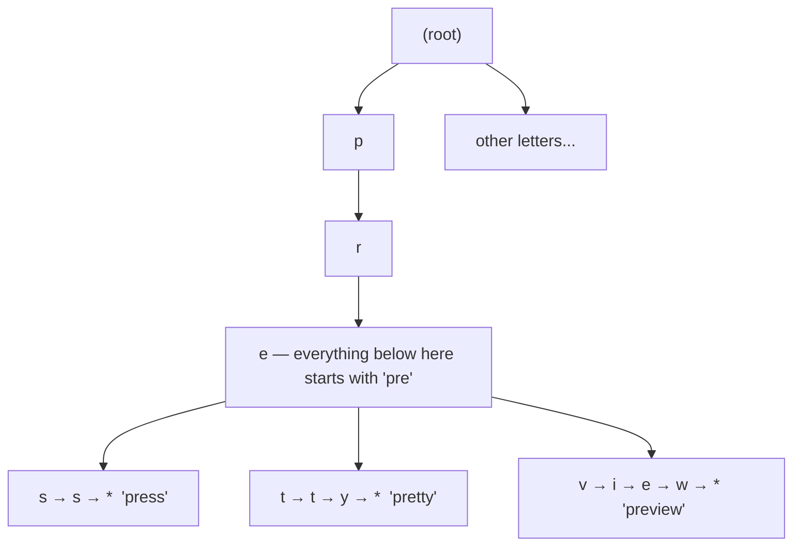

# The trie: a tree of characters

## 1. What this is, and why they ask it

You already have a way to store a set of words. A hash set. `word in words` is `O(1)`, it is one line, and
for most jobs it is the right answer. So this lesson has to start by justifying itself.

Here is the question a hash set cannot answer:

> **How many of these words start with `"pre"`?**

A hash set has no idea. Hashing destroys the relationship between `"prefix"` and `"pre"` on purpose — a good
hash function scatters similar keys to unrelated places, which is exactly what makes it fast. To answer that
question with a hash set you must look at every word you have ever stored.

The **trie** is the structure that answers it. A trie stores a set of words as a tree of characters, where
the path from the root to a node spells out a prefix, and every word sharing that prefix hangs below it. To
find everything starting with `"pre"` you walk three steps and look at what is underneath. The time depends
on the length of `"pre"`, not on how many words you have stored. A million words, ten million, a billion —
still three steps.

The name is from *retrieval*, and it is pronounced either "try" or "tree". Nobody agrees and nobody minds.
It is also called a **prefix tree**, which is the more honest name and the one worth using out loud, because
it tells you what it is for.

By the end of this lesson you will know what a trie is, why the path *is* the key, what a node actually
holds, how to build one, and — the part that gets skipped — what it costs in memory, which is the reason
tries are not used more often than they are.

Tomorrow you will do the operations properly: insert, search, prefix search, delete, and the problems that
come from them. Today is the structure itself.

---

## 2. The story

Bhaskar has looked after the post room at a boys' hostel for nine years. Four hundred boys, and on a good
day two hundred letters.

When he started, the post room had one long table. Letters came in a sack at eleven, he tipped them on the
table, and boys came and rummaged. It worked when there were eighty boys. At four hundred it was chaos —
boys pushing, letters on the floor, and every single boy touching every single letter to find his own.

So Bhaskar put up a rack of twenty-six wooden boxes and painted a letter on each. A letter for Suresh goes
in the S box. A boy looking for post opens one box and looks through what is in it, and that is all.

For a year this was wonderful. Then it stopped being wonderful, and the reason was the S box.

There were sixty-one boys with names starting with S. On a heavy day the S box held forty letters and a boy
would stand there going through all forty. Meanwhile the X box had been empty since 2019 and the Q box had
been used exactly once.

Bhaskar's fix was the thing that made the whole system work. He did not add more big boxes. He took the S
box off the rack, and inside it he put a row of small dividers, each with a second letter painted on it: Sa,
Sh, Su, Sw. Sixty-one boys, split across four dividers.

He did not do this to the X box. The X box has one boy in it. Splitting it would be silly.

Over the years the busy parts kept splitting. The Sh divider grew until he put three sub-dividers inside it
— Sha, Shi, Shu — and Sha eventually got its own three inside that. The Q box is still one box with nothing
in it. The rack is deep in some places and shallow in others, and it grew that way on its own, according to
where the letters actually were.

A new boy asked him once how he finds anything.

"I do not find anything," said Bhaskar. "I spell. Watch — Shantanu." He touched the S box, then the Sh
divider inside it, then Sha inside that. Three touches. "There. Everything for every boy whose name starts
Sha is in my hand. Eleven boys. That is a small enough pile to look through."

The boy asked whether it took longer now there were four hundred boys than when there were eighty.

Bhaskar had clearly been asked this before. "It takes as long as the name is," he said. "S-h-a. Three
touches. If eight hundred boys move in tomorrow, it is still three touches. The rack gets deeper where they
crowd, but the walk is the same walk."

---

## 3. The idea in plain English

Bhaskar built a trie, one splitting box at a time, and everything about the structure is in what he said.

**The path is the key.** This is the sentence to remember. In a hash set, a node holds the word. In a trie,
**no node holds a word at all** — the word is spelled out by the sequence of edges you followed to get
there. The letter is on the edge (or, equivalently, in the key of the child dictionary), not in the node.
The node at the end of the path `c → a → t` does not contain the string `"cat"`. It contains a flag saying
"a word ends here", and nothing else.

Beginners nearly always draw a trie with the letters inside the circles, which is fine as a picture and
misleading as a model. What is really stored at each node is *a map from the next character to the next
node*.

**Shared prefixes are stored once.** `"car"`, `"card"`, `"care"`, `"careful"` share `c-a-r`. In a hash set
that is four separate strings, and the letters `c`, `a`, `r` are stored four times. In a trie there is one
`c` node, one `a` below it, one `r` below that, and the words diverge only where they actually differ. This
is why tries are natural for dictionaries, where words genuinely do share beginnings.

**Two flags decide everything, and they are different questions.** A node needs to answer:

- *Does a word end here?* — a boolean, usually called `is_end` or `is_word`.
- *Do any words continue past here?* — implied by whether it has children.

These are independent, and confusing them is the single most common trie bug. With `"car"` and `"card"`
stored, the node at `c-a-r` has `is_end = True` **and** has a child `d`. With only `"card"` stored, that
same node has `is_end = False` and still has the child. A node with `is_end = False` is not empty — it is
a place words pass through.

**The depth is the word length, not the word count.** Bhaskar's line. A trie over a million English words
is at most about thirty levels deep, because the longest English word is about thirty letters. Adding
another million words does not make it deeper. It makes it *wider* in the middle, which costs memory but
not time. Every operation on a word of length `L` takes `O(L)` steps, full stop — no dependence on `n` at
all.

That is a genuinely unusual property. Almost every structure you have met so far has `n` in its complexity
somewhere. A trie does not.

**What it buys you over a hash set.** Exactly three things:

1. **Prefix queries.** "Does anything start with `pre`?" and "give me everything starting with `pre`" — the
   whole reason the structure exists.
2. **Sorted order for free.** Walk the children in alphabetical order and you emit the words sorted, with no
   sorting step. A hash set gives you no order at all.
3. **No hashing and no collisions.** Lookup is `O(L)` guaranteed, not `O(L)` average. A hash set must read
   the whole key to hash it — which is also `O(L)` — and then may collide. In the worst case a trie is
   strictly better; in the average case they are close.

**What it costs.** Memory, and a lot of it. This is the honest part that most explanations bury, and it is
covered properly in §6. A trie stores one node per distinct prefix, and each node carries a whole
dictionary. For a set of unrelated random strings — which share almost no prefixes — a trie can use ten to
fifty times the memory of the hash set holding the same words, and be slower besides. **A trie is only worth
it when the keys genuinely share prefixes and you genuinely need prefix queries.**

---

## 4. The picture

### A trie holding four words

```
Words stored: "car", "card", "cat", "do"

                    (root)
                   /      \
                 c          d
                 |          |
                 a          o *
                / \
               r*   t*
               |
               d*

  * = is_end is True (a word finishes here)

  Read the paths:
    root -> c -> a -> r        spells "car",  is_end -> yes, it is a word
    root -> c -> a -> r -> d   spells "card", is_end -> yes
    root -> c -> a -> t        spells "cat",  is_end -> yes
    root -> d -> o             spells "do",   is_end -> yes

  Notice what is NOT a word:
    root -> c        spells "c"   — a node exists, is_end is False
    root -> c -> a   spells "ca"  — a node exists, is_end is False

  Nine nodes hold four words totalling twelve characters.
  The prefix "ca" is stored ONCE and serves three words.
```

*Notice the two nodes with no star. `c` and `ca` exist and are not words. Existence and word-ness are
separate facts, and every trie bug lives in the gap between them.*

### What a node actually holds

```
   The picture people draw            What is actually stored
   ------------------------          ------------------------------
                                      node at path "ca":
          ( a )                         children = { 'r': <node>,
         /     \                                     't': <node> }
      ( r )   ( t )                     is_end   = False

   The letters look like they          The letter is a KEY in the parent's
   live in the circles.                dictionary. The node itself does
                                       not know which letter it is, and
                                       does not know its own prefix.
```

*Notice that a node cannot tell you what word it represents. It has no idea. Only the walk knows, which is
why any operation that needs to report words must carry the prefix down with it.*

### The prefix query, which is the entire point



*Notice that answering "what starts with `pre`?" costs three steps to reach the node, and then a walk of
only the subtree below it. The rest of the trie is never touched, however large it is.*

### Where the memory goes

```
Storing "car", "card", "cat", "do" — the good case:

  characters in the words:  3 + 4 + 3 + 2  = 12
  nodes actually created:                    9
  ratio: 0.75 nodes per character (prefixes shared)

Storing 4 random 10-character IDs — the bad case:

  "x7k2m9p4qa"
  "b3n8v1z5wc"
  "h6j0t2r7ye"
  "d9f4l3s8ug"

  characters:              40
  nodes created:           41   (nothing shares anything past the root)
  ratio: ~1.0 nodes per character

  And a node is not one byte. In Python a node with a dict is
  ~200+ bytes. So 41 nodes ≈ 8 KB to store 40 characters that
  a set would hold in about 300 bytes.
```

*Notice the second case. When keys do not share prefixes, a trie is a very expensive way to store a string
one character per object. This is the case that decides whether you should use one.*

---

## 5. The code, built step by step

### The node

Everything starts here, and it is four lines.

```python
class TrieNode:
    def __init__(self) -> None:
        self.children: dict[str, "TrieNode"] = {}
        self.is_end: bool = False
```

That is the whole data structure. No letter, no word, no parent pointer. A map to children and one flag.
Write this from memory; it is the part interviewers watch you write.

### The trie, and its root

```python
class Trie:
    def __init__(self) -> None:
        self.root = TrieNode()
```

The root is an ordinary node representing the empty prefix. It is never a word unless you deliberately
insert the empty string. Every walk starts here.

### Insert

Walk down, creating nodes for characters that are missing, and mark the last one.

```python
    def insert(self, word: str) -> None:
        node = self.root
        for character in word:
            if character not in node.children:
                node.children[character] = TrieNode()
            node = node.children[character]
        node.is_end = True
```

Five lines. The loop body is "make the child if it is not there, then step into it". The single line after
the loop is what makes this a word rather than just a path.

`setdefault` collapses the two lines into one, and is worth knowing:

```python
        for character in word:
            node = node.children.setdefault(character, TrieNode())
```

Use whichever you can write without hesitating. Clarity beats brevity in a round.

### The walk, factored out

Search and prefix search do the same walk and differ only in what they check at the end. Write the walk
once.

```python
    def _walk(self, prefix: str) -> TrieNode | None:
        """Return the node at the end of prefix, or None if the path breaks."""
        node = self.root
        for character in prefix:
            if character not in node.children:
                return None
            node = node.children[character]
        return node
```

### Search and starts_with — one line each

```python
    def search(self, word: str) -> bool:
        node = self._walk(word)
        return node is not None and node.is_end

    def starts_with(self, prefix: str) -> bool:
        return self._walk(prefix) is not None
```

**This pair is the lesson.** They walk identically. `search` demands `is_end`; `starts_with` only demands
that the path exists. If you can explain why those two lines differ by exactly that one condition, you
understand tries.

### Collecting every word under a prefix

The operation a hash set cannot do at all. Note that the prefix must be carried down, because nodes do not
know their own path.

```python
    def words_with_prefix(self, prefix: str) -> list[str]:
        start = self._walk(prefix)
        if start is None:
            return []
        found: list[str] = []
        self._collect(start, prefix, found)
        return found

    def _collect(self, node: TrieNode, so_far: str, found: list[str]) -> None:
        if node.is_end:
            found.append(so_far)
        for character in sorted(node.children):
            self._collect(node.children[character], so_far + character, found)
```

Two details worth saying out loud. `sorted(node.children)` makes the output alphabetical for free — that is
the second advantage over a hash set. And `if node.is_end` is checked *before* recursing, not instead of
it, because `"car"` being a word does not stop `"card"` from being one too.

### Counting words under a prefix, without listing them

If you only need the count, storing it on the way in is far better than counting on the way out.

```python
class CountingTrieNode:
    def __init__(self) -> None:
        self.children: dict[str, "CountingTrieNode"] = {}
        self.is_end: bool = False
        self.words_below: int = 0        # words in this subtree
```

```python
    def insert(self, word: str) -> None:
        node = self.root
        node.words_below += 1
        for character in word:
            node = node.children.setdefault(character, CountingTrieNode())
            node.words_below += 1
        node.is_end = True
```

Now `count_with_prefix` is `O(L)` instead of `O(size of the subtree)`. This is the single most useful
augmentation, and it is three extra lines.

### The array-of-26 variant

When the alphabet is fixed and small, an array is faster than a dictionary — no hashing, better memory
locality — at the cost of always allocating 26 slots even for a node with one child.

```python
class ArrayTrieNode:
    __slots__ = ("children", "is_end")

    def __init__(self) -> None:
        self.children: list["ArrayTrieNode | None"] = [None] * 26
        self.is_end = False

    def index(self, character: str) -> int:
        return ord(character) - ord("a")
```

In Python the dictionary version is usually better, because a Python list of 26 `None`s is not the compact
thing it is in C. In C++ or Java, `TrieNode*[26]` is the standard choice. Know both and say which you would
pick and why.

### The complete solution

```python
"""Day 120 — a trie, complete and runnable."""

from __future__ import annotations


class TrieNode:
    """One node. Holds a map to its children and whether a word ends here."""

    __slots__ = ("children", "is_end", "words_below")

    def __init__(self) -> None:
        self.children: dict[str, TrieNode] = {}
        self.is_end: bool = False
        self.words_below: int = 0


class Trie:
    """A prefix tree over lowercase words."""

    def __init__(self) -> None:
        self.root = TrieNode()
        self.size = 0

    # ---------- building ----------

    def insert(self, word: str) -> None:
        """Add a word. O(L) time. Inserting a duplicate is a no-op."""
        node = self.root
        path = [node]
        for character in word:
            node = node.children.setdefault(character, TrieNode())
            path.append(node)
        if node.is_end:
            return                                  # already present
        node.is_end = True
        self.size += 1
        for visited in path:
            visited.words_below += 1

    # ---------- the shared walk ----------

    def _walk(self, prefix: str) -> TrieNode | None:
        node = self.root
        for character in prefix:
            child = node.children.get(character)
            if child is None:
                return None
            node = child
        return node

    # ---------- asking ----------

    def search(self, word: str) -> bool:
        """Is this exact word stored? O(L)."""
        node = self._walk(word)
        return node is not None and node.is_end

    def starts_with(self, prefix: str) -> bool:
        """Does any stored word begin with this prefix? O(L)."""
        return self._walk(prefix) is not None

    def count_with_prefix(self, prefix: str) -> int:
        """How many stored words begin with this prefix? O(L)."""
        node = self._walk(prefix)
        return node.words_below if node else 0

    def words_with_prefix(self, prefix: str) -> list[str]:
        """Every stored word beginning with this prefix, in alphabetical order."""
        start = self._walk(prefix)
        if start is None:
            return []
        found: list[str] = []
        self._collect(start, prefix, found)
        return found

    def _collect(self, node: TrieNode, so_far: str, found: list[str]) -> None:
        if node.is_end:
            found.append(so_far)
        for character in sorted(node.children):
            self._collect(node.children[character], so_far + character, found)

    # ---------- inspecting ----------

    def node_count(self) -> int:
        """How many nodes exist. Useful for seeing the memory cost."""
        total = 0
        stack = [self.root]
        while stack:
            node = stack.pop()
            total += 1
            stack.extend(node.children.values())
        return total

    def __len__(self) -> int:
        return self.size

    def __contains__(self, word: str) -> bool:
        return self.search(word)


if __name__ == "__main__":
    trie = Trie()
    for word in ["car", "card", "care", "careful", "cat", "dog", "do"]:
        trie.insert(word)

    print(len(trie))                          # 7
    print(trie.search("car"))                 # True
    print(trie.search("ca"))                  # False  <- a path, not a word
    print(trie.starts_with("ca"))             # True   <- the difference
    print(trie.search("cars"))                # False
    print(trie.count_with_prefix("car"))      # 4  (car, card, care, careful)
    print(trie.count_with_prefix("do"))       # 2  (do, dog)
    print(trie.words_with_prefix("car"))      # ['car', 'card', 'care', 'careful']
    print(trie.words_with_prefix("z"))        # []
    print("careful" in trie)                  # True

    # Where the memory goes.
    characters = sum(len(w) for w in ["car", "card", "care", "careful", "cat", "dog", "do"])
    print(characters, trie.node_count())      # 25 characters, 16 nodes

    # The same trie built from unrelated keys: nothing is shared.
    scattered = Trie()
    for word in ["qxvz", "mkbt", "rphn", "wfjd"]:
        scattered.insert(word)
    print(16, scattered.node_count())         # 16 characters, 17 nodes
```

Run it. The last two prints are the ones to sit with: sixteen nodes for twenty-five characters of real
words, seventeen nodes for sixteen characters of random ones. That difference is the whole argument for
when to use this structure.

---

## 6. What it costs

### Time

| Operation | Cost | Note |
|---|---|---|
| `insert(word)` | `O(L)` | `L` = word length |
| `search(word)` | `O(L)` | |
| `starts_with(prefix)` | `O(L)` | |
| `count_with_prefix` | `O(L)` | with the `words_below` count |
| `words_with_prefix` | `O(L + total characters returned)` | you must build each string |
| building from `n` words | `O(total characters)` | |

**There is no `n` anywhere.** That is the headline. Searching a trie of ten words and a trie of ten billion
words takes the same number of steps for the same word.

Compare with the alternatives for a prefix query on `n` words:

```
n = 1,000,000 words, prefix "pre" of length 3, 400 matches

  hash set:      scan all 1,000,000 and test startswith  -> 1,000,000 operations
  sorted list:   binary search for the range boundaries  -> ~20 + 400 operations
  trie:          3 steps down, then walk 400 results     -> 3 + 400 operations
```

Note the middle row. **A sorted list plus binary search also answers prefix queries**, in `O(log n + k)`,
and uses far less memory. It is the right answer for a static word list. The trie wins on updates — adding
a word to a sorted list is `O(n)` because everything shifts, while the trie is `O(L)` — and on more complex
queries such as wildcards.

### Memory, which is the real story

Count nodes, then count bytes per node.

**Nodes.** One node per distinct prefix in the whole set. For real English:

```
  a dictionary of 100,000 English words
  average length 8, so 800,000 characters
  distinct prefixes (measured, roughly):  ~250,000 nodes

  ratio: about 0.3 nodes per character — heavy sharing near the top,
  almost none near the bottom.
```

**Bytes per node.** In Python this is brutal:

```
  object header                      ~56 bytes
  empty dict                         ~64 bytes  (more once it grows)
  bool                                 ~28 bytes (shared, so ~8 in practice)
  int (words_below)                    ~28 bytes
                                     -----------
  realistic total                    ~150-250 bytes per node

  250,000 nodes × 200 bytes ≈ 50 MB

  The same 100,000 words in a Python set:
    100,000 strings × (49 + 8) bytes ≈ 5.7 MB, plus set overhead ≈ 10 MB

  Trie: ~5× the memory. And that is the FAVOURABLE case, with heavy prefix sharing.
```

The array-of-26 version in C++ is worse on nodes and better per operation:

```
  TrieNode { TrieNode* children[26]; bool is_end; }
    = 26 × 8 bytes + 1 byte + padding = 216 bytes per node
  250,000 nodes × 216 = 54 MB — and most of those pointers are null.

  A node with one child wastes 25 × 8 = 200 bytes.
```

### The random-key disaster

Where a trie should never be used:

```
  1,000,000 UUIDs, 36 characters each

  shared prefixes: essentially none past the first 3-4 characters
  nodes ≈ 1,000,000 × 33 = 33,000,000
  at 200 bytes each = 6.6 GB

  The same UUIDs in a set: 1,000,000 × ~85 bytes ≈ 85 MB

  Ratio: about 78×. This is not a trade-off. It is a mistake.
```

**Say this in an interview.** "A trie is only worth its memory when the keys share prefixes. For random
identifiers it can be fifty to eighty times worse than a hash set, and slower too."

### The fixes, briefly

Three, and knowing they exist is enough for today:

- **Compressed trie (radix tree / Patricia trie).** Any chain of single-child nodes is collapsed into one
  node holding the whole substring. `"careful"` after `"care"` becomes one node holding `"ful"` instead of
  three nodes. Typically cuts nodes by 60-80%. This is what real routing tables and `etcd`'s key store use.
- **DAWG / DAFSA.** Also merge identical *suffixes*, turning the tree into a graph. A 100,000-word
  dictionary can drop to a few thousand nodes. Excellent for a fixed word list, painful to update.
- **Ternary search tree.** Three pointers per node instead of 26. Slower per step, dramatically less memory.

### The honest comparison table

| | Hash set | Sorted list | Trie |
|---|---|---|---|
| exact lookup | `O(L)` average | `O(L log n)` | `O(L)` worst case |
| prefix exists | impossible | `O(L log n)` | `O(L)` |
| all with prefix | `O(n)` scan | `O(L log n + k)` | `O(L + k)` |
| insert | `O(L)` | `O(n)` | `O(L)` |
| sorted output | no | free | free |
| memory | smallest | small | 5× to 80× larger |
| wildcards, fuzzy | no | no | yes |

---

## 7. The traps

**Trap 1: confusing "the path exists" with "a word ends here".** The defining trie bug.

```python
>>> trie = Trie()
>>> trie.insert("card")
>>> trie.search("car")
False
>>> trie.starts_with("car")
True
```

No error, no crash — just a `False` where you expected `True`, or the reverse. If `search` returns `True`
for prefixes of stored words, you forgot to check `is_end`. If autocomplete returns nothing, you probably
checked `is_end` where you should not have.

**Trap 2: forgetting `is_end` entirely on insert.** The trie builds perfectly and every `search` returns
`False`. The structure looks right when you print it. Check the last line of `insert` first.

**Trap 3: assuming a leaf means a word and a word means a leaf.** Neither holds.

```
  "car" and "card" stored:
    the node at "car" is a word AND has a child       -> word, not a leaf
  "card" stored alone:
    the node at "car" is a leaf's parent, not a word  -> not a word, has a child
```

There is one true statement: **every leaf must be a word**, because a path that leads nowhere and ends
nothing should never have been created. If you find a non-word leaf, your delete is broken.

**Trap 4: expecting a node to know its own prefix.** It does not, and cannot.

```python
>>> node = trie._walk("car")
>>> node.word
Traceback (most recent call last):
  File "<stdin>", line 1, in <module>
AttributeError: 'TrieNode' object has no attribute 'word'
```

Carry the prefix down as a parameter, or store the word on the end node — but then you are paying for it,
and you should say so.

**Trap 5: the character set.** `ord(character) - ord('a')` on anything other than lowercase ASCII:

```python
>>> ord('A') - ord('a')
-32
>>> children[-32]
```

No error — Python indexes from the end, so it silently writes into the wrong slot and corrupts the trie.
`ord('é') - ord('a')` gives 136 and *does* raise `IndexError`. Normalise the input, or use a dictionary,
which handles any character. Ask about the character set in the interview; it is a good question.

**Trap 6: building the result strings and forgetting they cost something.** `words_with_prefix("a")` on an
English dictionary returns tens of thousands of strings, and `so_far + character` allocates a new string at
every step of every path. If you only need a count, store `words_below`. If you only need the top ten,
stop early. Returning everything under `""` returns the entire dictionary.

**Trap 7: using a trie for random keys.** No error. Just several gigabytes, and it will be slower than the
set it replaced. See §6.

**Trap 8: recursion depth on long keys.** A recursive collect over keys thousands of characters long:

```python
RecursionError: maximum recursion depth exceeded
```

Python's default limit is 1000. For words it never happens. For DNA sequences or file paths it will. Use an
explicit stack if key length is unbounded.

**Trap 9: thinking a trie helps with substrings.** A trie finds *prefixes*. It cannot tell you which words
contain `"art"` in the middle. That needs a suffix trie or suffix automaton — a different structure, much
larger. If the question says "contains", a plain trie is the wrong answer.

---

## 8. In the interview

### How it gets asked

- *"Implement a trie with insert, search and startsWith."* — LeetCode 208, and the standard opener.
- *"Design autocomplete for a search box."* — the system-flavoured version.
- *"Given a board of letters and a dictionary, find every word on the board."* — word search II; the trie
  turns an impossible search into a feasible one.
- *"Design a phone contacts search that filters as you type."*
- *"Find the longest common prefix of a set of strings."*
- *"Store IP routing rules and find the longest matching prefix."* — real routers use compressed tries.
- And the one that separates candidates: *"Why not just use a hash set?"*

### The first ninety seconds

> "The reason to reach for a trie rather than a hash set is prefix queries. A hash set can tell me whether
> `'prefix'` is stored; it cannot tell me whether anything *starts with* `'pre'` without scanning
> everything, because hashing deliberately destroys the relationship between similar keys.
>
> A trie stores the words as a tree of characters. The path from the root spells the prefix — and this is
> the key idea: **no node stores a word.** A node stores a map from the next character to the next node,
> plus one boolean saying whether a word ends here. The word only exists as the walk.
>
> That gives me `O(L)` for insert, search and prefix search, where L is the length of the word — and notice
> there is no `n` in that at all. A million words or a billion, `'pre'` is three steps. I also get
> alphabetical order for free by visiting children in sorted order.
>
> What it costs is memory, and I would want to be honest about that. One node per distinct prefix, and each
> node carries a dictionary — a couple of hundred bytes in Python. For English words, where prefixes are
> shared heavily, that is maybe five times a hash set. For random identifiers, where nothing is shared, it
> can be fifty times worse and slower as well. So the question I would ask before choosing this is: do the
> keys actually share prefixes, and do I actually need prefix queries?
>
> Shall I write it?"

That is the recognition, the key idea, both costs, and the disqualifying question — in ninety seconds.

### The follow-ups

**"Why not a hash set?"**

> "For exact lookup I would use the hash set — it is smaller, simpler, and just as fast, since hashing has
> to read the whole key anyway. The trie earns its place only when I need prefixes. Three things it gives
> me that a set cannot: prefix queries in `O(L)`, sorted iteration for free, and a guaranteed worst case
> with no collisions. If none of those are needed, the trie is pure cost."

**"Why not a sorted list with binary search?"**

> "That is the better question, and for a *static* word list a sorted array is often the right answer —
> `O(L log n)` to find the prefix range, then walk it, and it uses a fraction of the memory with far better
> locality. The trie wins in two places. Updates: inserting into a sorted array is `O(n)` because everything
> shifts, against `O(L)` for the trie. And complex queries: a wildcard search like `c.t`, or searching a
> board of letters where I need to abandon a path the moment it stops being a valid prefix. A sorted array
> cannot do that pruning."

**"How would you cut the memory?"**

> "Compress the chains. Any run of single-child nodes gets collapsed into one node holding the whole
> substring — that is a radix tree, and it typically removes sixty to eighty percent of the nodes, because
> the bottom of a trie is mostly long thin chains. If the word list is fixed I would go further and merge
> identical suffixes too, which makes it a DAWG — a graph rather than a tree — and can shrink a hundred
> thousand words to a few thousand nodes. The catch is that a DAWG is very hard to update, so it suits a
> shipped dictionary, not a live index."

**"How would you return the top ten completions rather than all of them?"**

> "Storing every completion under `'a'` and then sorting is the wrong shape — that is most of the
> dictionary. Two better options. If I need them by frequency, I store at every node the best few
> completions in its subtree, precomputed at build time; then a lookup is `O(L)` and the answer is sitting
> at the node. That costs memory proportional to nodes times ten. Or I walk the subtree with a size-ten
> heap, which is yesterday's shape two, and stop when I have enough. I would use the precomputed version
> for a search box, because the read path has to be fast and the write path is a nightly build."

### The model answer

*"Design the autocomplete for a search box. As the user types, show the ten most popular completions."*

> "Let me set the shape first. This is a prefix query on every keystroke, so a hash set is out — it cannot
> answer it. A trie is the natural fit: `O(L)` per keystroke, no dependence on how many queries I have
> stored.
>
> **The structure.** A trie over past search queries. At each node I store the ten best completions in that
> subtree, precomputed — each as `(popularity, query text)`. So `'pre'` is three steps down and then I read
> a list of ten that is already sitting there. No subtree walk, no sorting, no heap at request time. The
> whole read path is: walk L nodes, return a list.
>
> **The numbers.** Say ten million distinct queries, average twenty characters. That is 200 million
> characters, but queries share prefixes heavily, so maybe 60 million nodes. At 200 bytes a node in Python
> that is 12 GB — too much for one machine, and this is exactly why I would not build it in Python. In C++
> with a compressed radix tree the node count drops by roughly seventy percent to around 18 million, and
> those nodes are smaller. Call it 2-4 GB, which fits comfortably in memory on one machine. The
> top-ten lists are the other cost: 60 million nodes × 10 entries is too much, so I would only store them at
> nodes above some depth — the first six characters, say — because nobody autocompletes a twenty-character
> prefix and if they do, walking the small subtree below it is cheap.
>
> **Serving it.** The trie is read-only at request time and rebuilt nightly from query logs. That is the
> decision that makes the whole thing easy: no concurrent writes, no locks, no invalidation. I build a new
> trie, load it, and swap. It fits in memory, so I replicate it across every serving machine and any machine
> can answer any request — no sharding by prefix, no coordination. If it did not fit, I would shard by first
> character, but I would try very hard to avoid that, because it turns one lookup into a routed one.
>
> **Latency.** Twenty-character prefix means at most twenty pointer hops in memory — under a microsecond
> for the trie itself. The real budget goes to the network and to the fact that the browser fires a request
> on every keystroke. I would debounce at about 150 milliseconds on the client and cancel in-flight requests,
> which cuts the request volume by more than half before it ever reaches me.
>
> **What I would flag.** Freshness: a nightly rebuild means a query that becomes popular this morning does
> not appear until tomorrow. If that matters — breaking news, a new product launch — I would put a small
> in-memory layer of today's trending queries in front and merge the two result lists at read time. That is
> a second, much smaller structure rather than a change to the main one.
>
> **What I would ask.** Personalised or global? Personalised completions change the design completely — I
> cannot precompute per user at that scale, so it becomes a global trie plus a small per-user history merged
> at read time. And is it multilingual? That kills the array-of-26 optimisation immediately and forces a
> map-based node, which I would probably do anyway."

That answer picks the structure for a stated reason, moves the work to build time, gives real memory
arithmetic including the point where Python fails, notices the client-side win, names the freshness
weakness, and ends with the two questions that would change the design.

---

## 9. Recall card

**A trie is a tree of characters.** The **path spells the key**. No node stores a word.

**A node holds exactly two things:** `children: dict[str, TrieNode]` and `is_end: bool`.

```python
class TrieNode:
    def __init__(self) -> None:
        self.children: dict[str, TrieNode] = {}
        self.is_end: bool = False
```

**Insert:** walk, creating missing children, then set `is_end = True` on the last node.

**Search vs starts_with — the whole lesson in two lines:**
```python
search:       node is not None and node.is_end
starts_with:  node is not None
```

**Existence and word-ness are different facts.** With `"card"` stored, the node at `"car"` exists and is not
a word. The only guarantee: **every leaf is a word.**

**Costs:** insert, search, prefix — all `O(L)`. **No `n` anywhere.** Collecting words costs
`O(L + characters returned)`.

**Three things a hash set cannot do:** prefix queries, sorted output for free, guaranteed worst case.

**The price is memory.** One node per distinct prefix, ~150-250 bytes each in Python. English words: ~5×
a hash set. Random identifiers: 50-80× worse and slower. **Only use a trie when the keys share prefixes
and you need prefix queries.**

**The real competitor is a sorted array + binary search** — `O(L log n + k)`, far less memory. The trie wins
on frequent updates and on wildcard or pruned searches.

**Shrink it with:** a radix tree (collapse single-child chains, −60-80% nodes), a DAWG (also merge suffixes,
static only), or a ternary search tree.

**Store `words_below` on every node** to answer "how many start with this?" in `O(L)`.

**A trie does prefixes, not substrings.** "Contains" needs a suffix structure.

---

**Next:** [Day 121 — Insert, search, and prefix search](../day-121-trie-operations/README.md)

**Previous:** [Day 119 — Heaps revision and mock round](../day-119-heaps-revision/README.md)
