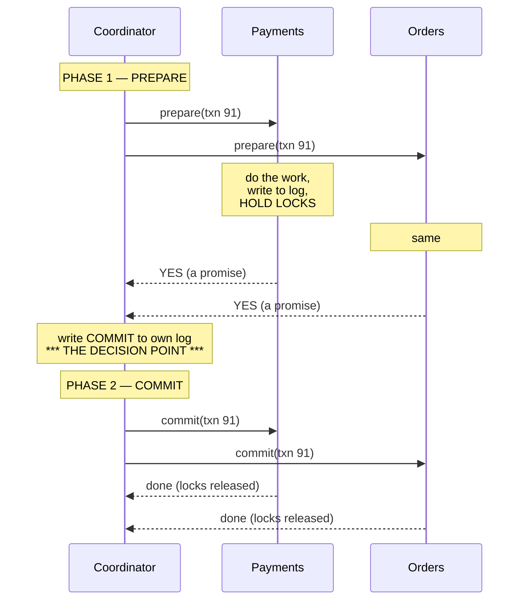

# Distributed transactions and two-phase commit

## 1. What this is, and why they ask it

A transaction on one machine is a solved problem. You learned it on day 32: begin, do several things,
commit — and if anything fails, none of it happened. All or nothing. The machine can guarantee that because
one process owns all the data and one log records the decision.

Now split the data across two machines.

> The money leaves the payments database. The order is written to the orders database. Both must happen,
> or neither.

Nothing in your toolkit does this. The payments machine can commit its half and the orders machine can fail
a millisecond later, and now money has left an account for an order that does not exist. There is no shared
log, no shared lock, no single process that owns both.

**Two-phase commit** — 2PC — is the classic answer. It has been in databases since the 1970s, it is what
`XA` means, and it is the thing every interviewer expects you to be able to describe.

It is also, in most modern designs, the wrong answer, and knowing *why* is the more valuable half of this
lesson. 2PC has a specific, well-known failure mode that blocks your system indefinitely, and a generation
of engineers built architectures specifically to avoid it. Tomorrow's lesson — the saga pattern — is what
they built instead.

So the goal today is: describe 2PC precisely, understand exactly where it breaks, know its variants and
what they cost, and be able to say clearly when you would use it and when you would not.

---

## 2. The story

Farida is buying a flat. It is the third one she has tried to buy this year, and the first two fell
through, which is why she now understands the problem better than her own lawyer.

There are four people who must all move on the same day. Farida hands over the money. The seller hands
over the keys and signs the papers. Farida's bank releases the loan. The seller's bank closes the seller's
old loan and releases the flat's papers from its vault. Four separate offices, four separate sets of
paperwork.

The first sale collapsed because everyone acted in their own order. Farida's bank released the money on a
Tuesday. The seller's bank, which had no idea, sat on the papers for eleven days because someone was on
leave. For eleven days Farida had no money and no flat. She got the money back eventually. It took four
months.

The second time, she used a woman named Kalpana, who does nothing else for a living.

Kalpana's method has two parts, and she explains it to every client the same way.

"First I ask everybody a question. Not 'do it' — a question. I ring each of the four and I say: *if I ask
you on Friday morning, can you do your part, with certainty?* And they check. The bank checks the loan is
sanctioned and the amount is sitting there. The seller checks the papers are actually in his hand and not
still at his mother's house. Each one comes back to me with one word. Yes or no.

"And if they say yes, they are not just guessing. They are promising. From that moment they set their part
aside and they do not touch it. The money is blocked. The papers are in an envelope with your name on it,
in a drawer, not being used for anything else. They have given up the right to change their minds."

The second part is shorter.

"If all four say yes, I ring all four back and say one word: go. Nobody is allowed to ask me why, nobody is
allowed to check anything, nobody is allowed to say 'actually'. They said yes. They do it.

"And if even one says no — one — I ring everybody and say: drop it. Nobody is out of pocket, because
nobody has done anything yet. That is the point of asking first."

Farida asked the obvious question. What if you fall ill on Friday morning, after everyone has said yes?

Kalpana did not brush it aside. "Then you have a bad problem," she said. "They have all set their part
aside. The bank is holding your money, blocked, doing nothing. The seller cannot sell to anybody else,
because he has promised those papers to you. And none of them can decide for themselves what to do, because
none of them knows what the others said. If the seller assumes it is off and sells elsewhere, and the bank
assumes it is on and pays out, you have a catastrophe.

"So they wait. All of them. Blocked, doing nothing, until somebody finds me. That is the flaw in my method
and I will not pretend it is not there. What I do about it is simple — my junior has a copy of every file,
and she knows to open it if I do not appear. She is not there to be clever. She is there so that somebody
alive knows what was decided."

---

## 3. The idea in plain English

Kalpana is a transaction coordinator, and her method is two-phase commit exactly.

**The problem.** A transaction touches data on several machines. Each machine can guarantee all-or-nothing
*locally*. Nobody can guarantee it *globally*, because each machine only sees its own half and each one can
fail independently.

**The roles.** One **coordinator** — Kalpana — and several **participants**, the machines holding the data.
The coordinator is not a database. It just runs the protocol and, crucially, keeps a durable record of what
it decided.

**Phase one: prepare.** The coordinator asks every participant: *can you commit this, for certain?* Each
participant does all the work — validates constraints, writes the changes to its log, takes the locks — and
then stops just short of committing. It replies `yes` or `no`.

A `yes` is not an opinion. **It is an irrevocable promise.** Having voted yes, the participant has given up
the right to abort on its own. It must be able to commit later even if it crashes and restarts in between,
which means the vote and the prepared state must be written to durable storage before the vote is sent. And
it holds its locks the entire time.

**Phase two: commit or abort.** If every vote is `yes`, the coordinator writes `COMMIT` to its own durable
log — **that write is the moment the transaction becomes real** — and then tells everyone to commit. If any
vote is `no`, or anyone fails to answer, it writes `ABORT` and tells everyone to roll back.

In phase two, participants have no say. They do what they are told, retrying forever if necessary.

**The single point that makes it correct.** The commit decision exists in exactly one place: the
coordinator's log. Not a majority, not a vote — one durable record on one machine. Everything else is
derived from it. That is what makes 2PC simple to reason about, and it is also the source of its problem.

**The problem, named.** 2PC is a **blocking protocol**. If the coordinator fails after collecting all the
yes votes but before broadcasting the decision, every participant is stuck. They cannot commit — maybe
someone voted no and the decision was abort. They cannot abort — maybe everyone voted yes and the decision
was commit. They have promised, so they cannot decide alone. They hold their locks and wait.

And they wait for a *human*, in practice. This is called the **in-doubt** or **uncertainty window**, and it
is not theoretical: DBAs who have run XA transactions in production know the experience of finding a
prepared transaction holding locks on a production table with no coordinator alive to resolve it.

**Why no clever protocol fixes it.** There is a theorem here, and it is worth being able to state:
**no atomic commit protocol can be non-blocking in the presence of network partitions.** A participant that
has voted yes and can hear nothing simply does not have the information to decide, and no amount of extra
messages creates information out of silence. Three-phase commit reduces the window but only survives crashes,
not partitions — which is why nobody uses it.

**The comparison that matters, and it comes up constantly.** 2PC and consensus are not the same thing and
not competitors:

- **Consensus** (yesterday) makes several machines agree on **one value**, and survives a minority failing,
  because it uses a majority. It needs `2f+1` machines to tolerate `f` failures.
- **2PC** makes several machines agree on **whether one transaction happened**, and needs **unanimity** —
  every participant must vote yes. One participant down means abort. It does not tolerate failures at all;
  it just avoids inconsistency.

The modern combination is to use both: run 2PC, but make the *coordinator* a replicated state machine
backed by Raft, so that the coordinator's log survives its own failure and a new coordinator can pick up
in-doubt transactions. Kalpana's junior with the copy of every file. This is what Google's Spanner and
CockroachDB do, and it is the strongest thing you can say about 2PC in an interview.

---

## 4. The picture

### The happy path



*Notice how long the locks are held: from the middle of phase one until the middle of phase two — two full
network round trips plus two disk syncs. On one machine a transaction holds locks for microseconds. Here it
is milliseconds, and if anything goes wrong, minutes.*

### The failure that defines the protocol

```
  t=0    Coordinator sends prepare to P and O
  t=1    P writes its log, locks rows, votes YES
  t=2    O writes its log, locks rows, votes YES
  t=3    Coordinator receives both votes
  t=4    Coordinator's machine loses power
         *** before writing COMMIT, before sending anything ***

  Now:
    P:  "I voted yes. I am holding locks on 4,000 rows.
         I cannot commit — maybe O voted no.
         I cannot abort — maybe the decision was commit.
         I must wait."
    O:  exactly the same.

  P and O ask each other. It does not help:
    both are in the same state, and neither knows the decision,
    because the decision was never made.

  The rows stay locked. Every other transaction touching them queues.
  This continues until the coordinator comes back, or a human intervenes.
```

*Notice the last line. The resolution is not automatic. That is the whole objection to 2PC.*

### Where the decision lives

```
  CONSENSUS (Raft)                    TWO-PHASE COMMIT
  ------------------------            ------------------------
  decision = what a MAJORITY          decision = what the COORDINATOR
             agreed                              wrote to its log

  survives f failures out of 2f+1     survives ZERO participant failures
                                      (one down = abort)

  needs a majority to vote YES        needs EVERYONE to vote YES

  question: "what value?"             question: "did it happen?"

  Combine them: run 2PC with a Raft-replicated coordinator.
  Now the decision is durable even if the coordinator machine dies.
  This is what Spanner and CockroachDB do.
```

### What each participant knows, and when

```
  participant state   can it decide alone?   holding locks?
  ------------------------------------------------------------
  before prepare      YES — just abort            no
  voted NO            YES — already aborted       no (released)
  voted YES,          NO  — THE IN-DOUBT WINDOW   YES
   no decision yet
  received decision   YES — do as told            until done

  The third row is the entire problem.
  Everything written about 2PC is about shrinking that row.
```

---

## 5. How it actually works

### The participant's side

The important thing is that a `yes` vote must be durable *before* it is sent.

```python
from enum import Enum

class Vote(Enum):
    YES = "yes"
    NO = "no"

def on_prepare(self, txn_id: str, changes: list[Change]) -> Vote:
    try:
        self.acquire_locks(changes)             # may block or time out
        self.validate(changes)                  # constraints, permissions
        self.write_to_log(txn_id, changes, state="PREPARED")
        self.fsync()                            # MUST be durable before voting
    except Exception:
        self.release_locks(txn_id)
        return Vote.NO                          # free to abort: nothing promised
    return Vote.YES                             # now committed to committing
```

If the machine dies immediately after the `fsync`, it restarts, reads `PREPARED` in its log, re-acquires
the locks, and asks the coordinator what was decided. That is why the `fsync` cannot be skipped: a vote
that does not survive a crash is a lie.

### The coordinator's side

```python
def run(self, txn_id: str, participants: list[Participant]) -> bool:
    # ---- phase 1 ----
    votes = []
    for participant in participants:
        try:
            votes.append(participant.prepare(txn_id, timeout=5.0))
        except TimeoutError:
            votes.append(Vote.NO)               # silence counts as NO

    decision = "COMMIT" if all(v is Vote.YES for v in votes) else "ABORT"

    # ---- the decision point ----
    self.log.write(txn_id, decision)
    self.log.fsync()                            # AFTER this, it is real

    # ---- phase 2 ----
    for participant in participants:
        self.deliver_forever(participant, txn_id, decision)
    return decision == "COMMIT"
```

Three lines carry all the weight.

`except TimeoutError: votes.append(Vote.NO)` — **silence is a no.** In phase one, safety is easy: when in
doubt, abort. Nobody has committed anything yet.

`self.log.fsync()` — the decision point. Before it, the transaction never happened. After it, it certainly
did, and no failure can change it.

`deliver_forever` — in phase two, silence is *not* an option. The coordinator retries until every
participant acknowledges, for hours if necessary, because the decision is already made and participants are
holding locks waiting for it.

```python
def deliver_forever(self, participant, txn_id: str, decision: str) -> None:
    delay = 0.1
    while True:
        try:
            participant.finish(txn_id, decision)
            return
        except NetworkError:
            sleep(min(delay, 30.0))
            delay *= 2
```

### Recovery, which is most of the real code

**A participant restarts.** It scans its log. For each `PREPARED` transaction with no outcome recorded, it
re-acquires the locks and asks the coordinator. It must not guess.

```python
def on_restart(self) -> None:
    for txn_id, state in self.log.scan():
        if state == "PREPARED":
            self.reacquire_locks(txn_id)
            decision = self.coordinator.ask_outcome(txn_id)   # blocks
            self.apply(txn_id, decision)
```

**The coordinator restarts.** For every transaction with a decision written, it resumes delivering it. For
every transaction that reached phase one with no decision written, it writes `ABORT` — safe, because if no
decision was recorded, nobody was ever told to commit.

```python
def on_restart(self) -> None:
    for txn_id, record in self.log.scan():
        if record.decision is None:
            self.log.write(txn_id, "ABORT")     # safe: nobody was told to commit
            self.log.fsync()
        self.resume_phase_two(txn_id)
```

**Note the asymmetry.** A participant in doubt must *ask*. A coordinator in doubt may *decide*, and always
decides abort. That is not arbitrary — the coordinator is the only party that knows nothing was broadcast.

### The presumed-abort optimisation

Every real implementation does this. If a coordinator is asked about a transaction it has no record of, it
answers `ABORT`. That means the coordinator never has to log anything for aborted transactions, and can
forget a transaction the moment it is complete. It removes a large fraction of the logging in a system where
most transactions are read-only or short.

### XA, which is what this is called in practice

`XA` is the standard interface, from 1991. Postgres, MySQL, Oracle, IBM MQ and most message brokers
implement it. In Java it is `JTA` — `UserTransaction.begin()`, `commit()` — with an application server as
the coordinator.

```sql
-- Postgres speaks 2PC directly.
BEGIN;
UPDATE accounts SET balance = balance - 500 WHERE id = 7;
PREPARE TRANSACTION 'txn-91';     -- phase 1: durable, locks held, no going back

-- ... coordinator asks the other participants ...

COMMIT PREPARED 'txn-91';         -- phase 2
-- or
ROLLBACK PREPARED 'txn-91';
```

Try this and then look at what you have created:

```sql
SELECT gid, prepared, owner FROM pg_prepared_xacts;
```

A prepared transaction survives a server restart and holds its locks the whole time. In Postgres,
`max_prepared_transactions` defaults to **zero** — the feature is off unless you deliberately enable it,
which tells you what the maintainers think of it.

### Three-phase commit, and why you should know it and not use it

3PC inserts a `pre-commit` phase between prepare and commit, so participants learn that everyone voted yes
before anyone commits. A participant that reaches pre-commit and then loses the coordinator can safely
commit on a timeout.

It fails under network partitions. Two groups can time out on opposite sides and reach opposite decisions —
which is worse than blocking, because blocking is at least safe. It also adds a third round trip.
**Mention that you know it exists, that it only helps for crashes and not partitions, and that nobody
deploys it.** That is the complete correct answer.

---

## 6. The numbers

### Latency

```
Single-machine transaction:
  begin, write, fsync, commit               ~1-5 ms   (the fsync dominates)

2PC across 3 participants, same data centre:
  phase 1: coordinator -> participants        0.5 ms
           participant work + fsync           1-5 ms
           votes back                         0.5 ms
  coordinator log write + fsync               1-5 ms
  phase 2: send decision                      0.5 ms
           participant commit + fsync         1-5 ms
           acknowledgements                   0.5 ms
                                            ----------
  total                                       5-18 ms

  So: 3-5× a local transaction, and FOUR fsyncs instead of one.
```

**The fsyncs dominate, not the network.** Same as consensus yesterday. Say it, because most people blame
the network.

Across regions it becomes untenable:

```
  Mumbai coordinator, participants in Mumbai / Singapore / Frankfurt:
    phase 1 round trip = slowest participant  = ~220 ms (Frankfurt)
    phase 2 round trip                        = ~220 ms
    total                                     ≈ 450 ms + disk

  And unlike consensus, you cannot wait for a majority.
  2PC needs EVERY participant. The slowest one sets your latency,
  every single time.
```

### The lock window, which is the real cost

```
  local transaction:  locks held for  ~1 ms
  2PC transaction:    locks held for  ~10 ms      -> 10× contention
  2PC, coordinator crashes:            minutes to hours

  What that does to throughput on a hot row:
    lock held 1 ms   -> at most ~1,000 transactions/sec on that row
    lock held 10 ms  -> at most ~100 transactions/sec
    lock held 60 s   -> everything touching that row is dead
```

**This is the argument that actually wins.** Not "2PC is slow" — "2PC multiplies lock contention by ten,
and the hot rows in your system are exactly the ones a distributed transaction wants to touch."

### Availability multiplies the wrong way

Because 2PC needs unanimity, availability is a *product*, not a majority:

```
  each participant available 99.9% of the time

  2 participants:  0.999²  = 99.80%   ->  17.5 hours down/year
  3 participants:  0.999³  = 99.70%   ->  26.3 hours
  5 participants:  0.999⁵  = 99.50%   ->  43.8 hours
  10 participants: 0.999¹⁰ = 99.00%   ->  87.6 hours

  Compare Raft with 5 nodes tolerating 2 failures:
    availability ≈ 99.9999%  ->  about 30 seconds/year
```

Two structures, opposite shapes. **Consensus gets more reliable as you add machines. 2PC gets less
reliable.** That single sentence is worth the whole section.

### The in-doubt window

```
  best case (coordinator healthy):        1-10 ms
  coordinator crashes, fast restart:      seconds to minutes
  coordinator crashes, no auto-recovery:  until a human notices
  observed in production XA incidents:    hours

  Meanwhile: locks held, queues building, unrelated transactions
  timing out because they touch one of the locked rows.
```

### What it does not cost

Fairness note: with a Raft-replicated coordinator, the in-doubt window collapses to a leader election —
a few hundred milliseconds — and the availability problem largely goes away. Spanner reports commit
latencies in the tens of milliseconds for cross-shard transactions. **2PC's reputation was earned by
single-coordinator XA in the 1990s, not by the modern version.** Say so; it is a mark of someone who has
read past the standard criticism.

---

## 7. The trade-offs

### The one-line summary

> 2PC buys you atomicity across machines, and you pay with blocking, lock contention, latency, and an
> availability that falls as you add participants.

### When 2PC is the right answer

- **Inside one database product, across its own shards.** Spanner, CockroachDB, TiDB, YugabyteDB all use
  2PC internally with a replicated coordinator. It is invisible, tuned, and correct.
- **Few participants, one data centre, short transactions.** Two or three, milliseconds long.
- **When correctness is non-negotiable and compensation is impossible.** Some financial and regulatory
  operations genuinely cannot be undone after the fact.
- **When the alternative is worse.** Sometimes eventual consistency really is unacceptable and the
  complexity of a saga exceeds the cost of blocking.

### When it is not

- **Across services you do not own.** A payment gateway will not join your XA transaction.
- **Across a wide area.** Hundreds of milliseconds, with the slowest participant setting the pace.
- **Long-running work.** A transaction spanning a human approval would hold locks for hours.
- **Many participants.** Availability decays as a product.
- **Microservices in general.** This is the big one. 2PC requires participants to expose prepare/commit and
  hold locks on your behalf, which couples them tightly — the exact opposite of why the services were split
  up. **Say this out loud: the industry moved away from 2PC not mainly because it is slow, but because it
  reintroduces the coupling that services exist to remove.**

### Against the alternatives

| Approach | Atomic? | Blocks? | Isolation | Complexity | Use when |
|---|---|---|---|---|---|
| Single database | yes | no | full | lowest | data can live together |
| 2PC / XA | yes | **yes** | full | medium | few participants, one DC, short |
| 2PC + Raft coordinator | yes | briefly | full | high | you are building the database |
| Saga (tomorrow) | no — eventual | no | **none** | high | services, long-running, wide area |
| Outbox + events | no — eventual | no | none | medium | one write plus notifications |
| Don't distribute | yes | no | full | lowest | **check this first** |

The last row is not a joke. **The best answer to a distributed transaction question is often to ask why the
data is distributed.** If two tables are always written together, they may simply belong in one database,
or in the same shard. Spanner and CockroachDB both let you co-locate related rows precisely so the
transaction stays local. Eliminating the distributed transaction beats optimising it.

### The isolation point people miss

2PC gives **atomicity** — all or nothing. It does not by itself give **isolation** across participants.
Between phase one and phase two, a reader on participant A can see the change while a reader on participant
B cannot. Getting a globally consistent *read* needs something extra — a global timestamp, snapshot
isolation, Spanner's TrueTime. This is a good detail to raise unprompted; it shows you know the difference
between the A and the I in ACID.

---

## 8. In the interview

### How it gets asked

- *"Money moves between two banks with separate databases. How do you keep it consistent?"*
- *"Your order service and inventory service have separate databases. How do you make them atomic?"*
- *"What is two-phase commit, and what is wrong with it?"* — the direct version.
- *"What happens if the coordinator dies?"* — the real question hiding inside every version.
- *"Why do microservices avoid distributed transactions?"*
- *"How does Spanner do cross-shard transactions?"* — the senior version.

### The first ninety seconds

> "The problem is that each machine can guarantee all-or-nothing for its own data, but nobody can guarantee
> it across machines, because each one can fail independently.
>
> Two-phase commit adds a coordinator. **Phase one, prepare:** it asks every participant 'can you commit
> this, for certain?' Each one does all the work, writes it durably to its log, takes its locks, and stops
> just short of committing. A yes here is not an opinion — it is an irrevocable promise, and it has to
> survive a crash, so it is fsynced before the vote is sent. **Phase two:** if every vote is yes, the
> coordinator writes COMMIT to its own log — that write is the moment the transaction becomes real — and
> tells everyone to go. Any no, or any silence, and it is abort.
>
> Now the important part, which is where it breaks. If the coordinator dies after collecting all the yes
> votes but before broadcasting the decision, every participant is stuck. They cannot commit, because maybe
> someone voted no. They cannot abort, because maybe the decision was commit. They promised, so they cannot
> decide alone. They hold their locks and wait — often for a human. 2PC is a **blocking** protocol, and
> there is a theorem saying no commit protocol can avoid that under network partitions.
>
> The cost that actually kills it in practice is not latency, it is the lock window. Locks are held across
> two network round trips instead of microseconds, so contention goes up roughly tenfold on exactly the hot
> rows you care about. And availability is a product, not a majority — every extra participant makes it
> worse, which is the opposite of consensus.
>
> Which is why for something like an order and inventory service I would reach for a saga instead. Shall I
> go into that, or into how Spanner makes 2PC workable?"

### The follow-ups

**"How do you fix the blocking?"**

> "You cannot remove it — the theorem says so under partitions. But you can shrink it a great deal. The
> modern answer is to stop making the coordinator a single machine and make it a replicated state machine
> backed by Raft. The commit decision goes into a replicated log rather than one machine's disk, so if the
> coordinator dies a new one is elected in a few hundred milliseconds, reads the log, and finishes the job.
> The in-doubt window goes from 'until a human notices' to 'one election'. That is what Spanner and
> CockroachDB do, and it is why 2PC is fine inside a modern distributed database and painful as XA between
> separate products.
>
> People will also mention three-phase commit here. It reduces the window but only survives crashes, not
> partitions — under a partition two sides can reach opposite decisions, which is worse than blocking
> because blocking is at least safe. Nobody deploys it."

**"Why don't microservices use it?"**

> "Three reasons, and the third is the real one. Availability multiplies down — five services at three
> nines gives you 99.5%. Locks are held across service boundaries, so one slow service degrades everything
> that touches the same rows. And the coupling: to be a participant, a service has to expose prepare and
> commit and hold locks on someone else's behalf, which is exactly the tight coupling the services were
> split up to remove. You end up with a distributed monolith with worse latency. The industry moved to
> sagas — a sequence of local transactions with compensating actions — trading atomicity for availability
> and accepting that there are windows where the system is visibly inconsistent."

**"What if a participant votes yes and then crashes?"**

> "That case is fine, and it is exactly what the durable vote is for. The participant wrote PREPARED to its
> log and fsynced it before voting. On restart it scans its log, finds the prepared transaction,
> re-acquires the locks, and asks the coordinator what was decided. It must not guess in either direction.
> The coordinator, meanwhile, keeps retrying delivery — in phase two it never gives up, because the decision
> is already made and everyone else is waiting on it.
>
> The reverse case is the asymmetry worth naming: a coordinator that restarts and finds a transaction with
> no decision logged writes ABORT immediately. That is safe, because if nothing was logged, nothing was
> broadcast. A participant in doubt must ask; a coordinator in doubt may decide, and always decides abort."

**"Is 2PC the same as consensus?"**

> "No, and they are not competitors. Consensus makes machines agree on a value and survives a minority
> failing, because it needs a majority — five machines tolerate two failures. 2PC decides whether one
> transaction happened and needs unanimity — one participant down means abort, so it tolerates no failures
> at all. Consensus gets more reliable as you add machines; 2PC gets less. The modern systems use both:
> 2PC for the atomicity across shards, with the coordinator's log replicated by Raft so the decision itself
> survives failure."

### The model answer

*"An order service and an inventory service have separate databases. Placing an order must reserve stock.
How do you make that atomic?"*

> "Before I design anything, I want to ask why they are separate, because the cheapest fix is often to
> remove the problem. If orders and inventory are always written together and nothing else needs them apart,
> they may simply belong in one database, or in one shard of a database that supports co-location. That
> gives me a local transaction — full atomicity, full isolation, one fsync, no coordinator. I would push on
> this first, because every option below is worse than it.
>
> Assuming they are genuinely separate services with separate teams and lifecycles:
>
> **2PC would work and I would not choose it.** Both services would expose prepare and commit, the order
> service or a coordinator would drive it, and I would get true atomicity. The costs: inventory rows are the
> hottest rows in the system, and holding locks on them across two network round trips instead of
> microseconds cuts throughput on popular items by roughly ten times. Availability becomes the product of
> both services. And inventory now has to hold locks on behalf of orders, which couples the two services
> exactly as much as sharing a database would, without the benefits.
>
> **What I would build is a saga.** Reserve the stock first, as a local transaction in inventory, with the
> reservation carrying an expiry. Then create the order, as a local transaction in orders. If the order
> creation fails, issue a compensating action: release the reservation. Each step is a local ACID
> transaction; the sequence is driven by events or by an orchestrator that keeps state.
>
> **The consequences I would state honestly, because they are real.** There is a window where stock is
> reserved and no order exists — a customer might see an item as unavailable for a few hundred milliseconds
> when it is actually free. Sagas have no isolation, so a concurrent order can see intermediate state. And
> compensation is not rollback: if the reservation succeeded and the order failed and the compensation *also*
> failed, I have leaked a reservation. That is why the reservation must expire on its own — a background job
> reclaiming reservations older than fifteen minutes is what makes the design safe, and it is the part people
> forget.
>
> **The transactional detail that matters most.** In the order service, writing the order row and publishing
> the 'order created' event must be atomic, or I get an order with no event or an event with no order. I
> would use the **outbox pattern**: write the event into an outbox table in the same local transaction as the
> order, and have a separate process read the outbox and publish. That turns a two-system problem into a
> one-database problem, and it is the single most useful trick in this whole area.
>
> **Numbers.** Say a thousand orders a second at peak, three hundred milliseconds end to end for the saga
> including the event hop. With 2PC I would have maybe ten to eighteen milliseconds per transaction but
> serialised on hot inventory rows — a popular item during a sale would become the bottleneck outright. The
> saga has no cross-service locks at all, so hot items are limited only by inventory's own local
> transaction rate.
>
> **What would change my mind.** If this were money rather than stock — if the failure mode were 'the
> customer was charged and has no order' — I would look much harder at either co-locating the data or using
> a database with built-in distributed transactions. Overselling a T-shirt is a business problem with a
> business answer, which is what makes the saga acceptable here. Losing a payment is not."

That answer questions the premise first, describes 2PC accurately, rejects it for named reasons with
numbers, proposes the alternative, states its weaknesses honestly, includes the outbox detail, and says
what would change the decision.

---

## 9. Recall card

**The problem:** each machine guarantees all-or-nothing locally; nobody guarantees it across machines.

**2PC has one coordinator and several participants.**

**Phase 1 — prepare:** "can you commit, for certain?" Participant does the work, writes it durably,
**takes locks**, votes. **A yes is an irrevocable promise** and must survive a crash — fsync before voting.

**Phase 2 — commit/abort:** all yes → coordinator writes `COMMIT` to its log (**this write is the decision
point**) → tells everyone. Any no or any silence → abort.

**Phase 1: silence = NO** (safe, nothing committed). **Phase 2: retry forever** (the decision exists).

**The flaw: 2PC blocks.** Coordinator dies after the votes, before the decision → participants cannot commit
(maybe a no), cannot abort (maybe a commit), cannot decide alone (they promised). **Locks held until a human
resolves it.** No protocol avoids this under partitions.

**The asymmetry:** participant in doubt must **ask**; coordinator in doubt **decides ABORT**.

**Numbers:** ~5-18 ms vs 1-5 ms locally, **four fsyncs**; locks held ~10× longer → ~10× less throughput on
hot rows; in-doubt window minutes to hours. Cross-region ≈ 450 ms, set by the **slowest** participant.

**Availability is a product:** 3 participants at 99.9% → 99.7%. **Consensus improves with more machines;
2PC gets worse.** Not the same problem: consensus = majority on a value; 2PC = unanimity on "did it happen".

**The modern fix:** replicate the coordinator's log with Raft. In-doubt window becomes one election.
Spanner, CockroachDB, TiDB.

**3PC:** shrinks the window, fails under partitions, nobody uses it. Know it, do not propose it.

**XA** is the standard; `PREPARE TRANSACTION` in Postgres, where `max_prepared_transactions` defaults to
**0**.

**2PC gives atomicity, not isolation** across participants — a global consistent read needs more.

**Avoid it for:** services you do not own, wide areas, long transactions, many participants, microservices.
**The real objection is coupling**, not speed.

**First question to ask: why is the data distributed at all?** Co-locating beats optimising.

---

**Next:** [Day 121 — The saga pattern](../day-121-trie-operations/README.md)

**Previous:** [Day 119 — Consensus, and Raft in plain English](../day-119-heaps-revision/README.md)
