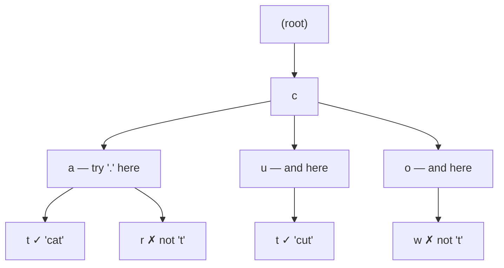

# Insert, search, and prefix search

## 1. What this is, and why they ask it

Yesterday you built the structure. Today you make it work, and you meet the operation nobody expects.

Insert, search and prefix search are the three operations every trie question asks for, and all three are
short — five lines, two lines, one line. If the interview stopped there, this would be a ten-minute lesson.

It does not stop there. The follow-up is almost always one of these two:

> **"Now delete a word."**
>
> **"Now support a wildcard: `c.t` should match `cat` and `cut`."**

Delete is the interesting one, because it is the only trie operation that is genuinely harder than it
looks. Insert only ever adds. Search only ever reads. Delete has to *remove* nodes — and deciding which
nodes may be removed is a real problem with four different cases, three of which look wrong the first time
you see them.

Wildcards are the other one, and they matter because they break the single most comforting property of a
trie. Every operation so far has followed one path. A wildcard forces you to follow *many*, which turns a
walk into a search, and the cost changes shape completely.

By the end of this lesson you will be able to write all four operations from memory, state the exact rule
for when a node may be pruned, handle wildcards with the right complexity analysis, and answer the two
problems these operations exist for: LeetCode 208 and LeetCode 211.

---

## 2. The story

The municipal park in Ravindran's town has four kilometres of gravel paths, and he has been the head
gardener for twenty-two years.

The paths were never planned. They grew. Somebody put a bench under the gulmohar tree in 1994, so a path
was laid to the bench. Later a drinking-water tap went in further along, so the path was extended past the
bench to the tap. Then a small shrine appeared off to one side, and a branch was laid from the middle of
the path to the shrine.

This is how the whole park works. A path exists because something at the end of it needs reaching.

Last month the council removed the drinking-water tap. It had not worked in three years and the pipe was
being re-laid.

A younger man on the crew asked whether they should now pull up the path to the tap, since it went nowhere.
Ravindran said yes, and then said the thing that took him about five years to learn properly.

"Walk backwards from where the tap was," he told him. "Not forwards. Backwards. And pull up the gravel as
you come. But you stop — and listen to me, this is the whole job — you stop the moment one of two things
happens.

"You stop if you reach a fork. If another path branches off here, then this bit of gravel is still being
walked on by people going to the other place. It is not dead. Leave it.

"And you stop if you reach somewhere that is itself a place. The bench under the gulmohar. Nobody is going
past the bench any more, but people still come *to* the bench. That path has to stay right up to the bench,
and only the part beyond it comes up."

The young man walked it and came back puzzled about something else. He had also been told to remove a
bench near the gate — but the path to the gate bench carried on past it, down to the pond.

"Then you take away the bench and you touch nothing else," said Ravindran. "Not one stone. The path is
still needed. It is just not a destination any more, it is a way through. People walk it every day to reach
the pond. If you pull that up because the bench is gone, you have cut off the pond."

The young man said it was strange that removing a bench sometimes meant a hundred metres of digging and
sometimes meant nothing at all.

"It is not strange," said Ravindran. "It is the same rule both times. A piece of path stays if anybody is
still using it — to get somewhere further, or to get to that spot itself. If neither, it goes. You are not
deciding about the bench. You are deciding, one step at a time on the way back, about each piece of gravel."

---

## 3. The idea in plain English

Ravindran stated trie deletion exactly, and his two stopping conditions are the two flags from yesterday.

**The three easy operations first**, so they are out of the way.

**Insert** walks the word, creating any child that is missing, and sets `is_end = True` on the final node.
The only subtlety is that inserting a word twice must not corrupt anything — with a plain `is_end` it is
naturally idempotent, but the moment you add a counter it is not, and you must check.

**Search** walks the word and returns `is_end` on the final node. If the walk falls off — a character with
no child — the answer is `False`.

**Prefix search** walks the prefix and returns whether the walk survived. It does *not* look at `is_end`.
This one line is the entire difference between the two operations, and it is what LeetCode 208 is testing.

All three share the same walk, which is why you write the walk once.

**Now delete, which is the real lesson.**

The naive idea — find the end node and set `is_end = False` — is not wrong, but it leaves rubbish behind.
Delete `"careful"` from a trie holding only that word and you have seven dead nodes forming a path to
nowhere. Do that a few thousand times and the trie is mostly corpses.

So deletion has two parts: unmark the word, then **walk back up and remove nodes that are no longer needed.**

**A node is no longer needed when both of these are true:**

1. It has **no children** — nothing continues past it.
2. Its `is_end` is **False** — no word ends here.

That is Ravindran's rule, and it is the same rule his two stopping conditions describe from the other side.
A fork is "it has children". A bench is "`is_end` is True". If either holds, stop; the node is doing a job.

**The four cases, which is what you should actually say in an interview:**

| Case | Example | What happens |
|---|---|---|
| The word is not there | delete `"cap"` from `{car}` | Do nothing. Return `False`. |
| The word is a **prefix** of another | delete `"car"` from `{car, card}` | Clear `is_end` only. **Remove no nodes.** |
| The word **extends** another | delete `"card"` from `{car, card}` | Remove the `d` node. Stop at `r`, because `is_end` is True there. |
| The word is alone on its branch | delete `"dog"` from `{dog, car}` | Remove `g`, `o`, `d`. Stop at the root. |

Cases two and three are the mirror image of each other and both catch people. Case two is Ravindran's bench
by the gate — remove the destination, keep every stone. Case three is the tap — remove the tail, stop at
the bench.

**The direction matters.** You cannot decide from the top down, because whether a node may be removed
depends on what is *below* it, and on the way down you have not looked yet. So deletion is naturally
recursive: go all the way to the end, then answer the question on the way back up. Each level asks its
child "may I remove you?" and the child answers only after it has removed what it could.

**And then wildcards, which change the shape of everything.**

Support `.` matching any single character. `search("c.t")` should find `"cat"` and `"cut"`.

Every operation so far followed one path. At a `.` you cannot know which child to enter, so **you try them
all**. That makes it a depth-first search over the trie rather than a walk, and it is why this operation is
recursive while the others are loops.

The cost changes completely. A normal search is `O(L)`. A search with `w` wildcards is up to
`O(26^w × L)` in the worst case — though in practice the trie prunes hard, because most of those 26
branches do not exist. A leading `.` is the expensive case: it forks 26 ways immediately with nothing
narrowing it down.

---

## 4. The picture

### Delete, all four cases on one trie

```
Starting trie: {car, card, cat, do, dog}

                (root)
               /      \
             c          d
             |          |
             a          o *
            / \         |
          r*   t*       g *
          |
          d*

CASE 1 — delete "cap"      (not present)
  walk c -> a -> p ... no child 'p'. Return False. Change nothing.

CASE 2 — delete "car"      (a prefix of "card")
  reach node r. Set is_end = False.
  May I remove r?  It has child 'd'.  NO.  <- a fork
  Stop. Zero nodes removed.
  Result: "car" no longer found, "card" still found.

CASE 3 — delete "card"     ("car" is still a word)
  reach node d. Set is_end = False.
  May I remove d?  No children, not a word.  YES. Remove it.
  May I remove r?  Now no children, but is_end is True. NO.  <- a bench
  Stop. One node removed.

CASE 4 — delete "dog"      (nothing else below d-o-g; "do" is a word)
  reach node g. Set is_end = False.
  May I remove g?  No children, not a word.  YES.
  May I remove o?  Now no children, but is_end is True (that is "do"). NO.
  Stop. One node removed.

CASE 4b — delete "do" as well, after "dog" is gone
  reach node o. Set is_end = False.
  May I remove o?  No children, not a word.  YES.
  May I remove d?  Now no children, not a word.  YES.
  Stop at root (never removed).
  Two nodes removed; the whole 'd' branch is gone.
```

*Notice that the same operation removed zero, one and two nodes depending only on what else was in the
trie. The rule never changed.*

### The rule, stated once

```
   +--------------------------------------------------+
   |  A node may be removed when BOTH hold:           |
   |                                                  |
   |     len(node.children) == 0                      |
   |     node.is_end is False                         |
   |                                                  |
   |  Otherwise it is still doing a job:              |
   |     children  -> words pass through it           |
   |     is_end    -> a word finishes at it           |
   +--------------------------------------------------+

   And it must be checked BOTTOM-UP, because "has children"
   is only correct after the children have been pruned.
```

### Wildcard search branches



*Notice that the `.` opens every existing child, not all 26 letters. The trie itself does the pruning — if
no word starts `cz`, that branch is never explored. This is why the `26^w` worst case almost never happens
on real words.*

### The cost of a leading wildcard

```
  search("cat")    1 path,  3 steps.                        cheap

  search("c.t")    at 'c': 1 child path
                   at '.': every child of 'c' — maybe 8
                   at 't': check one child in each
                   ≈ 8 short paths.                          fine

  search("..t")    at '.': every child of root — up to 26
                   at '.': every child of each of those — up to 26 each
                   ≈ 676 paths before the 't' filters anything
                                                             expensive

  search(".......")  seven wildcards, no filtering at all:
                   this visits every node at depth 7.
                   On an English dictionary that is most of the trie.
```

*Notice the pattern: wildcards early are expensive, wildcards late are cheap, because a real character
earlier in the pattern narrows the search before the fork happens.*

---

## 5. The code, built step by step

### The node and the shared walk

```python
class TrieNode:
    __slots__ = ("children", "is_end")

    def __init__(self) -> None:
        self.children: dict[str, "TrieNode"] = {}
        self.is_end: bool = False
```

```python
    def _walk(self, prefix: str) -> TrieNode | None:
        node = self.root
        for character in prefix:
            child = node.children.get(character)
            if child is None:
                return None
            node = child
        return node
```

Every operation except delete and wildcard search is one line on top of this.

### Insert, search, starts_with

```python
    def insert(self, word: str) -> None:
        node = self.root
        for character in word:
            node = node.children.setdefault(character, TrieNode())
        node.is_end = True

    def search(self, word: str) -> bool:
        node = self._walk(word)
        return node is not None and node.is_end

    def starts_with(self, prefix: str) -> bool:
        return self._walk(prefix) is not None
```

That is LeetCode 208, complete. Write it in ninety seconds and spend the rest of the round on the
follow-ups, which is where the marks are.

### Delete, recursively

The recursion is the natural shape because the decision is made on the way back up. The return value means
**"I have been removed; the caller may consider removing itself"**.

```python
    def delete(self, word: str) -> bool:
        """Remove a word. Returns False if it was not there."""
        if not self.search(word):
            return False                       # case 1
        self._delete(self.root, word, 0)
        return True

    def _delete(self, node: TrieNode, word: str, depth: int) -> bool:
        if depth == len(word):
            node.is_end = False                # unmark the word
            return not node.children           # prunable only if childless

        character = word[depth]
        child = node.children[character]        # safe: search() confirmed the path
        if self._delete(child, word, depth + 1):
            del node.children[character]
            return not node.children and not node.is_end

        return False                            # a descendant said stop
```

Four lines carry the meaning.

`node.is_end = False` is the actual deletion. Everything after it is cleanup.

`return not node.children` at the base case is the `is_end` half of the rule — we have just set `is_end` to
`False`, so only the children matter here.

`return not node.children and not node.is_end` is the rule in full, checked *after* the child was removed,
which is why the order of those two statements cannot be swapped.

`return False` when the child said no: once anyone below says stop, nothing above may be removed either.
The recursion unwinds without touching anything else.

### Delete, iteratively

Worth knowing, because interviewers sometimes ask for it and because it makes the bottom-up direction
visible. Record the path down, then walk it backwards.

```python
    def delete_iterative(self, word: str) -> bool:
        node = self.root
        path: list[tuple[TrieNode, str]] = []
        for character in word:
            child = node.children.get(character)
            if child is None:
                return False
            path.append((node, character))
            node = child

        if not node.is_end:
            return False
        node.is_end = False

        for parent, character in reversed(path):
            child = parent.children[character]
            if child.children or child.is_end:
                break                          # Ravindran's two stopping rules
            del parent.children[character]
        return True
```

`if child.children or child.is_end: break` is the fork and the bench, in one line.

### Wildcard search

The first operation that is a search rather than a walk.

```python
    def search_pattern(self, pattern: str) -> bool:
        """'.' matches any single character."""
        return self._match(self.root, pattern, 0)

    def _match(self, node: TrieNode, pattern: str, index: int) -> bool:
        if index == len(pattern):
            return node.is_end

        character = pattern[index]
        if character == ".":
            for child in node.children.values():
                if self._match(child, pattern, index + 1):
                    return True
            return False

        child = node.children.get(character)
        return child is not None and self._match(child, pattern, index + 1)
```

That is LeetCode 211. Note the two things that make it correct and fast: the base case still checks
`is_end` — a pattern must match a whole word, not a prefix — and the loop returns `True` on the first hit
rather than exploring the rest.

One optimisation worth mentioning: if the pattern has a fixed length, any word of a different length cannot
match. Bucketing words by length before searching removes most of the work when patterns are mostly
wildcards.

### Collecting completions, with a limit

The version you would actually ship, because returning everything under `"a"` returns the dictionary.

```python
    def completions(self, prefix: str, limit: int = 10) -> list[str]:
        start = self._walk(prefix)
        if start is None:
            return []
        found: list[str] = []
        stack: list[tuple[TrieNode, str]] = [(start, prefix)]
        while stack and len(found) < limit:
            node, so_far = stack.pop()
            if node.is_end:
                found.append(so_far)
            for character in sorted(node.children, reverse=True):
                stack.append((node.children[character], so_far + character))
        return found[:limit]
```

Explicit stack rather than recursion, so long keys cannot blow the recursion limit, and `reverse=True` on
the push so the pops come out alphabetically.

### The complete solution

```python
"""Day 121 — trie operations: insert, search, prefix, delete, wildcard."""

from __future__ import annotations


class TrieNode:
    __slots__ = ("children", "is_end")

    def __init__(self) -> None:
        self.children: dict[str, TrieNode] = {}
        self.is_end: bool = False


class Trie:
    def __init__(self) -> None:
        self.root = TrieNode()
        self.size = 0

    # ---------- the shared walk ----------

    def _walk(self, prefix: str) -> TrieNode | None:
        node = self.root
        for character in prefix:
            child = node.children.get(character)
            if child is None:
                return None
            node = child
        return node

    # ---------- insert ----------

    def insert(self, word: str) -> None:
        """O(L). Inserting an existing word is a no-op."""
        node = self.root
        for character in word:
            node = node.children.setdefault(character, TrieNode())
        if not node.is_end:
            node.is_end = True
            self.size += 1

    # ---------- search ----------

    def search(self, word: str) -> bool:
        """Is this exact word stored? O(L)."""
        node = self._walk(word)
        return node is not None and node.is_end

    def starts_with(self, prefix: str) -> bool:
        """Does any word begin with this prefix? O(L). Note: no is_end check."""
        return self._walk(prefix) is not None

    # ---------- delete ----------

    def delete(self, word: str) -> bool:
        """Remove a word and prune dead nodes. Returns False if absent."""
        if not self.search(word):
            return False
        self._delete(self.root, word, 0)
        self.size -= 1
        return True

    def _delete(self, node: TrieNode, word: str, depth: int) -> bool:
        """Returns True if this node was removed and the parent may prune too."""
        if depth == len(word):
            node.is_end = False
            return not node.children

        character = word[depth]
        child = node.children[character]
        if self._delete(child, word, depth + 1):
            del node.children[character]
            return not node.children and not node.is_end
        return False

    # ---------- wildcard ----------

    def search_pattern(self, pattern: str) -> bool:
        """'.' matches any one character. O(26^wildcards × L) worst case."""
        return self._match(self.root, pattern, 0)

    def _match(self, node: TrieNode, pattern: str, index: int) -> bool:
        if index == len(pattern):
            return node.is_end
        character = pattern[index]
        if character == ".":
            return any(
                self._match(child, pattern, index + 1)
                for child in node.children.values()
            )
        child = node.children.get(character)
        return child is not None and self._match(child, pattern, index + 1)

    # ---------- completions ----------

    def completions(self, prefix: str, limit: int = 10) -> list[str]:
        """Up to `limit` words with this prefix, alphabetically. O(L + output)."""
        start = self._walk(prefix)
        if start is None:
            return []
        found: list[str] = []
        stack: list[tuple[TrieNode, str]] = [(start, prefix)]
        while stack and len(found) < limit:
            node, so_far = stack.pop()
            if node.is_end:
                found.append(so_far)
            for character in sorted(node.children, reverse=True):
                stack.append((node.children[character], so_far + character))
        return found[:limit]

    # ---------- inspecting ----------

    def node_count(self) -> int:
        total, stack = 0, [self.root]
        while stack:
            node = stack.pop()
            total += 1
            stack.extend(node.children.values())
        return total

    def __len__(self) -> int:
        return self.size

    def __contains__(self, word: str) -> bool:
        return self.search(word)


if __name__ == "__main__":
    trie = Trie()
    for word in ["car", "card", "cat", "do", "dog"]:
        trie.insert(word)
    print(len(trie), trie.node_count())        # 5 9

    # search vs starts_with
    print(trie.search("car"), trie.search("ca"))          # True False
    print(trie.starts_with("ca"), trie.starts_with("z"))  # True False

    # case 1: absent
    print(trie.delete("cap"), trie.node_count())          # False 9

    # case 2: a prefix of another word — nothing is removed
    print(trie.delete("car"), trie.node_count())          # True 9
    print(trie.search("car"), trie.search("card"))        # False True

    # case 3: extends another word — one node goes
    trie.insert("car")
    print(trie.delete("card"), trie.node_count())         # True 8

    # case 4: alone on its branch, then the branch collapses
    print(trie.delete("dog"), trie.node_count())          # True 7
    print(trie.delete("do"), trie.node_count())           # True 5
    print(trie.starts_with("d"))                          # False

    # wildcards
    for word in ["cat", "cut", "cot", "cast"]:
        trie.insert(word)
    print(trie.search_pattern("c.t"))          # True
    print(trie.search_pattern("c..t"))         # True  (cast)
    print(trie.search_pattern("c.r"))          # True  (car)
    print(trie.search_pattern("z.t"))          # False
    print(trie.search_pattern("ca"))           # False (a prefix, not a word)

    # completions
    print(trie.completions("c"))               # ['car', 'cast', 'cat', 'cot', 'cut']
    print(trie.completions("c", limit=2))      # ['car', 'cast']
```

Run it and watch `node_count()` in the delete section: 9, 9, 8, 7, 5. Those five numbers are the four cases,
and if your implementation produces different ones, the bug is in the pruning rule.

---

## 6. What it costs

### Time

| Operation | Cost | Note |
|---|---|---|
| `insert(word)` | `O(L)` | |
| `search(word)` | `O(L)` | |
| `starts_with(prefix)` | `O(L)` | |
| `delete(word)` | `O(L)` | search once, then unwind — two passes, still `O(L)` |
| `search_pattern` | `O(L)` best, `O(26^w × L)` worst | `w` = number of wildcards |
| `completions(prefix, k)` | `O(L + k × average length)` | with the limit; unbounded without |

**Delete is `O(L)`, not `O(n)`.** People assume it must be expensive because it changes the structure. It
is not: you touch each node on one path at most twice, and the pruning is decided locally at each step.

### The wildcard arithmetic, properly

The worst case is stated as `26^w` and almost never happens. Here is why, on a real English trie of 100,000
words:

```
  pattern      branches actually explored      why
  ---------------------------------------------------------------
  "cat"        1                               no forks
  "c.t"        ~8                              'c' has ~8 real children
  ".at"        ~20                             20 letters precede "at"
  "..t"        ~350                            2 forks, but most pairs
                                               do not exist as prefixes
  "...."       ~5,000                          4 forks, still pruned hard
  ".........." (10 dots)  most of the trie     nothing prunes anything

  Theoretical worst for "..t":  26 × 26 = 676
  Actual:                       ~350
  Because "qz", "xj", "vk" and hundreds of others are not real prefixes.
```

**The trie prunes for you.** That sentence is the right answer to "isn't the wildcard version exponential?"
It is exponential in the number of wildcards, but the base is not 26 — it is the average branching factor of
your actual data, which for English is closer to 3 near the bottom.

### Where the wildcards sit

```
  "c..."   1 real character first: ~8 × 8 × 8   ≈ 500 paths
  "...t"   3 wildcards first:      26 × 26 × 26 ≈ 5,000+ paths, filtered only at the end

  Same number of wildcards. Ten times the work.
  A real character early narrows everything after it.
```

If patterns commonly start with wildcards, bucket the words by length first — a five-character pattern can
never match a four-character word, and that check is free.

### Memory during delete

Recursive delete uses `O(L)` stack. For words that is nothing. For a trie over file paths or DNA
sequences it is not:

```python
RecursionError: maximum recursion depth exceeded
```

Python's limit is 1000. If keys can be longer than that, use the iterative version.

### The two-pass question

`delete` as written calls `search` first, then recurses. That is two passes over the word. You can do it in
one, but the code becomes noticeably harder to follow because the recursion has to report both "was it
there?" and "may I be pruned?". `O(L)` either way, and `L` is small.

> "I would do the two-pass version. It is the same complexity, the search-first check makes the recursion
> assume the path exists, and it removes an entire class of bug."

That is the right thing to say. Choosing the clearer of two same-complexity options, out loud, is a signal.

---

## 7. The traps

**Trap 1: deleting a word that is a prefix of another, and pruning anyway.**

```python
>>> trie = Trie()
>>> trie.insert("car"); trie.insert("card")
>>> trie.delete("car")
True
>>> trie.search("card")     # if your pruning is wrong:
False
```

You destroyed a word you were not asked to touch. No error, no exception — a silently smaller dictionary.
This is the bug the `is_end` half of the rule exists to prevent, and it is the one interviewers probe for.

**Trap 2: deleting a word that is not there.**

```python
>>> trie = Trie()
>>> trie.insert("car")
>>> trie._delete(trie.root, "cap", 0)
Traceback (most recent call last):
  File "<stdin>", line 1, in <module>
KeyError: 'p'
```

The recursion indexes `node.children[character]` assuming the path exists. Guard with `search` first, or
check `.get()` at every level.

**Trap 3: checking prunability before removing the child.** Order matters:

```python
        if self._delete(child, word, depth + 1):
            del node.children[character]                       # first
            return not node.children and not node.is_end      # then check
```

Check before the `del` and `node.children` still contains the child you are about to remove, so nothing is
ever pruned. The trie stays correct and grows forever — the worst kind of bug, because every test passes.

**Trap 4: forgetting `is_end` in the base case.** If the base case returns `True` unconditionally, deleting
`"car"` from `{car, card}` starts pruning from the `r` node upward and takes `"card"` with it. See trap 1.

**Trap 5: the wildcard base case checking the wrong thing.**

```python
>>> trie.insert("cat")
>>> trie.search_pattern("ca")
True        # WRONG — "ca" is not a word
```

The base case must be `return node.is_end`, not `return True`. A pattern matches a *word*, not a prefix.

**Trap 6: the wildcard loop returning too early or too late.**

```python
        if character == ".":
            for child in node.children.values():
                return self._match(child, pattern, index + 1)   # WRONG
```

That returns after trying only the first child. It must be `if ...: return True` inside the loop, then
`return False` after it — try them all, succeed on any.

**Trap 7: mutating the children dictionary while iterating it.** If a delete runs inside a traversal:

```python
RuntimeError: dictionary changed size during iteration
```

Collect what you will remove, then remove it.

**Trap 8: unbounded completions.**

```python
>>> len(trie.completions(""))     # no limit
100000
```

An empty prefix matches everything. Always take a limit, and stop when it is reached rather than
truncating at the end.

**Trap 9: recursion depth on long keys.** See §6. Use the iterative delete when key length is unbounded.

**Trap 10: forgetting that delete does not shrink memory in Python straight away.** Removing nodes drops
references; the memory is reclaimed by the garbage collector, not immediately, and the process may not
return it to the operating system at all. If you are relying on delete to control memory, measure it.

---

## 8. In the interview

### How it gets asked

- *"Implement a trie with insert, search and startsWith."* — LeetCode 208. The opener, always.
- *"Add delete."* — the real question. Almost never on the LeetCode problem, almost always in an interview.
- *"Design a data structure that supports adding words and searching with `.` as a wildcard."* — LeetCode
  211, and the standard follow-up.
- *"Autocomplete: return the top ten completions for a prefix."*
- *"Given a board of letters and a word list, find every word on the board."* — LeetCode 212, where the trie
  turns an infeasible search into a feasible one.
- *"Can a sentence be split into dictionary words?"* — word break, with the trie replacing the set lookup.

### The first ninety seconds

For the 208-plus-delete version:

> "The three basic operations share one walk, so I will write the walk once. Insert walks and creates
> missing children, then marks the last node. Search walks and returns `is_end`. `startsWith` walks and
> returns whether the walk survived — same code, minus the `is_end` check. All three are `O(L)` with no
> dependence on how many words are stored.
>
> Delete is the one worth talking about. The naive version sets `is_end = False` and leaves dead nodes
> behind, so I also want to prune. The rule is: **a node may be removed only if it has no children and
> `is_end` is False** — otherwise it is still needed, either because words pass through it or because a word
> ends there.
>
> The important consequence is that this must be checked bottom-up, since 'has no children' is only true
> after the children have been pruned. So delete is naturally recursive: recurse to the end, unmark, and
> answer the prune question on the way back.
>
> There are four cases and I would test all four: the word is absent; the word is a prefix of another, where
> I remove *no* nodes at all; the word extends another, where I remove the tail and stop at the shorter
> word; and the word is alone, where the whole branch collapses. The second case is the one that breaks
> naive implementations — deleting `car` must not remove `card`.
>
> Shall I write it?"

That names the rule, the direction, and the four cases before writing a line.

### The follow-ups

**"Why must delete be bottom-up?"**

> "Because the decision depends on what is below. Coming down, I have not looked yet — a node might have a
> child that is about to be pruned, or one that must stay. Only after the recursive call returns do I know
> whether the child was removed, and only then can I evaluate 'do I have children'. That is why the
> recursive version returns a boolean meaning 'I was removed, you may consider removing yourself', and why
> the iterative version has to record the path on the way down and walk it backwards."

**"What does delete cost?"**

> "`O(L)`. That surprises people because it changes the structure, but I only ever touch nodes on one path,
> at most twice each — once going down, once coming back. There is no `n` in it. The version I would write
> does two passes, searching first and then deleting, which is still `O(L)` and lets the recursion assume
> the path exists. One-pass is possible but the recursion then has to report two different things and it
> gets harder to read for no complexity gain."

**"Now add a wildcard."**

> "That changes the shape from a walk to a search. At a real character I follow one child; at a `.` I have
> to try every child, so it becomes a depth-first search and the code becomes recursive.
>
> Worst case is `O(26^w × L)` where `w` is the number of wildcards. But in practice the trie prunes very
> hard, because most letter pairs are not real prefixes — on an English dictionary, `..t` explores about
> 350 branches, not 676. Where the wildcards *sit* matters more than how many there are: a real character
> early narrows everything after it, so `c...` is roughly ten times cheaper than `...t`.
>
> If patterns were mostly wildcards, I would bucket words by length first, since a five-character pattern
> can never match a four-character word, and that check is free."

**"How would you return the top ten completions, not all of them?"**

> "Returning everything is wrong at the start — an empty prefix returns the whole dictionary. Two options.
> If 'top' means alphabetical, I do a depth-first walk with a limit and stop as soon as I have ten, which is
> `O(L + output)` and never touches the rest of the subtree. If 'top' means most popular, the walk is the
> wrong tool — I would precompute the best ten completions at each node at build time, so a lookup is `O(L)`
> and the answer is already sitting there. That costs memory proportional to nodes times ten, so I would
> only store it above some depth. For a search box the read path has to be fast and the build is a nightly
> job, so I would precompute."

### The model answer

*"Design a data structure that supports `addWord(word)` and `search(word)`, where search may contain `.`
matching any single character."*

> "This is a trie, and the reason is the `.`. If search were exact, a hash set would be better — smaller,
> simpler, `O(L)` average. But a set cannot do wildcards at all: with `c.t` I would have to test all 26
> substitutions against the set, which is `26^w` lookups with no pruning whatsoever. The trie does the same
> search but prunes at every step, because it only explores branches that actually exist.
>
> **The structure.** A node with a children map and an `is_end` flag. `addWord` is the plain insert —
> `O(L)`.
>
> **Search.** A depth-first search rather than a walk. At a real character I take that child if it exists
> and fail if it does not. At a `.` I recurse into every child and succeed if any of them does. The base
> case, when I have consumed the whole pattern, returns `node.is_end` — not `True`, because the pattern must
> match a complete word rather than a prefix. That is the bug I would most expect to make.
>
> **Complexity.** `addWord` is `O(L)`. Search is `O(L)` with no wildcards and `O(26^w × L)` in the worst
> case. But the practical number is much lower — the base is the real branching factor of the data, around
> three near the bottom of an English trie, not 26. And the position matters more than the count: a leading
> `.` forks immediately with nothing to narrow it, so `...t` costs about ten times `c...`.
>
> **What I would add if this were real.** Bucketing by word length, since the pattern length is fixed and
> that eliminates most candidates for free. And if patterns were dominated by leading wildcards, I would
> consider indexing the reversed words in a second trie as well, so a pattern ending in real characters
> could be searched from the other end — twice the memory, but it turns the expensive case into the cheap
> one.
>
> **The trade-off I would state.** Memory. The trie holds one node per distinct prefix at a couple of
> hundred bytes each in Python, so for a large word list it is several times the size of a set. I am paying
> that specifically to get wildcard pruning. If the requirement lost the `.`, I would delete this whole
> class and use a set.
>
> **What I would ask.** How many words and how long? And do patterns tend to have wildcards at the start or
> the end? Both answers change what I would optimise, and the second one changes it a lot."

That answer justifies the structure against the obvious alternative, names the base-case bug before making
it, gives honest complexity with the practical correction, proposes two concrete optimisations, and asks
the question that would change the design.

---

## 9. Recall card

**The shared walk** — write it once; three operations sit on top of it.

```python
insert:       node = node.children.setdefault(c, TrieNode()); ... node.is_end = True
search:       node is not None and node.is_end
starts_with:  node is not None
```

**All three are `O(L)`. So is delete.** No `n` anywhere.

**Delete has two parts:** unmark the word, then prune bottom-up.

**The pruning rule — a node may be removed only if:**
```
len(node.children) == 0   AND   node.is_end is False
```
Children ⇒ words pass through it. `is_end` ⇒ a word ends at it. Either one means keep.

**It must be bottom-up**, because "has no children" is only correct after the children are pruned. Hence
recursion, returning "I was removed, you may consider removing yourself".

**The four cases:**
| Delete | From | Result |
|---|---|---|
| absent word | — | do nothing |
| `"car"` | `{car, card}` | clear `is_end`, **remove nothing** |
| `"card"` | `{car, card}` | remove `d`, stop at `r` |
| `"dog"` | `{dog}` | whole branch collapses |

**Order matters:** `del node.children[c]` **then** check prunability. Reversed, nothing is ever pruned and
every test still passes.

**Wildcard search is a DFS, not a walk.** At `.`, try every child; return `True` on the first success.
**Base case is `node.is_end`, never `True`.**

**Cost:** `O(26^w × L)` worst case, but the trie prunes — the real base is the data's branching factor
(~3 for English). **Position beats count:** `c...` ≈ 500 paths, `...t` ≈ 5,000. Bucket by length to help.

**Completions must take a limit.** An empty prefix matches everything. Stop early rather than truncating.
For top-*popular* rather than top-*alphabetical*, precompute the best ten at each node at build time.

**Use the iterative delete when keys can exceed ~1000 characters** — recursion depth.

---

**Next:** [Day 122 — Autocomplete and word dictionaries](../day-122-autocomplete/README.md)

**Previous:** [Day 120 — The trie: a tree of characters](../day-120-the-trie/README.md)
