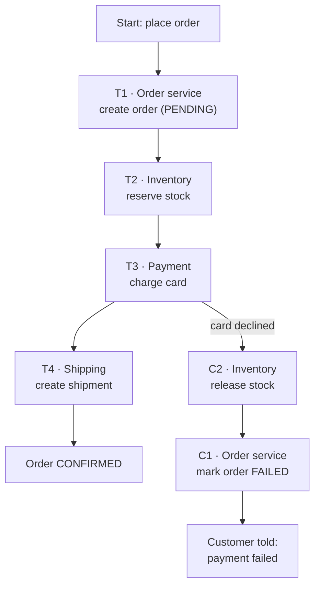

# The saga pattern

## 1. What this is, and why they ask it

Yesterday you saw why two-phase commit is unpopular: it blocks, it holds locks across machines, its
availability falls as you add participants, and it couples services together in exactly the way splitting
them up was meant to prevent.

So what do people build instead?

A **saga**. The idea is simple enough to state in one sentence:

> **Break the distributed transaction into a sequence of local transactions, and for each one, define a
> compensating action that undoes it.**

No coordinator holding everyone hostage. No locks across services. Each step commits immediately and
locally, in its own database, with ordinary ACID guarantees. If a later step fails, you do not roll back —
you cannot, the earlier steps are already committed and visible — you run the compensations backwards.

The name comes from a 1987 paper about long-running database transactions, and it has been the default
answer for cross-service consistency in microservice architectures for about a decade. Every interviewer
who asks "order service and payment service, how do you keep them consistent?" is listening for this word.

But saying "saga" is the easy half. The valuable half is knowing precisely what you gave up, because it is
more than people expect:

- **Atomicity is gone.** There are windows where half the work is done and visible.
- **Isolation is completely gone.** Another transaction can read your intermediate state and act on it.
- **Compensation is not rollback.** A refund is not the same as the payment never happening.
- **Some things cannot be compensated at all.** You cannot un-send an email.

By the end you will be able to design a saga, choose between the two ways of running one, handle the
failure of a compensation itself, name the isolation problems and their countermeasures, and — the thing
that separates a strong answer — say when a saga is the wrong choice.

---

## 2. The story

Nadia organises weddings. Not the flowers — the logistics. Six hundred guests, three days, four venues.

Every wedding she books involves the same five people: the hall, the caterer, the band, the tent hire and
the photographer. All five must be booked for the same weekend, and any one of them can turn out to be
unavailable.

For her first two years she tried to do it the sensible-sounding way. She would ring all five, get
provisional holds from everyone, and only confirm once all five had said yes. It never worked. The hall
would hold a date for forty-eight hours and no longer. The band would not hold at all — first to pay,
first served. The caterer wanted a decision the same day. Trying to freeze all five at once meant she
usually lost the band while waiting for the tent people to call back.

So she does it differently now, and she explained it to a client last month who was worried about it.

"I book them one at a time, in order, and each booking is real. Not a hold — real, paid, confirmed. Hall
first, because it is the hardest to get and everything else depends on the date. Then caterer, then tent,
then band, then photographer.

"And before I start, I write down what it costs to *undo* each one. That is the part nobody thinks about.
The hall takes twenty percent if I cancel more than a month out. The caterer takes nothing before two
weeks. The tent people take nothing. The band keeps the deposit, full stop. The photographer is fine.

"So if I get to the band and the band has gone — I do not panic, and I do not pretend the earlier bookings
did not happen, because they did. Money has moved. I go backwards. Cancel the tent, cancel the caterer,
cancel the hall. Each one costs what it costs and I know the number before I start."

The client asked the obvious thing. Why not book the band first, since it is the one that cannot be undone?

Nadia said that was the right instinct and she had learned it the expensive way. "Now I put the ones I
cannot undo *last*. If something is going to fail, I want it to fail while everything before it is still
cancellable. The moment I pay the band, I am committed, so I do not pay the band until I am certain of
everything else."

The client asked what happens if a cancellation itself fails — if the caterer will not pick up the phone.

"Then I keep ringing," said Nadia. "Every day. It is on my list and it does not come off my list until it is
done. That is the only answer there is. I cannot leave it half-cancelled and forget about it, because in
three months somebody will deliver four hundred meals to an empty hall."

And then she said the thing that the client actually needed to hear.

"There is one more thing and I will not hide it from you. Between me booking the hall and me cancelling it,
that hall shows as taken. If another family rings the hall on that Tuesday, they will be told no. They will
go somewhere else. And by Thursday it is free again and they never knew. I cannot prevent that. Nobody
can. That is simply the cost of booking things one at a time instead of all at once, and anyone who tells
you otherwise is selling you something that does not exist."

---

## 3. The idea in plain English

Nadia runs sagas, and everything important about the pattern is in what she said.

**The structure.** A saga is a sequence of local transactions `T1, T2, … Tn`, each in its own service and
its own database, each committing immediately. For each `Ti` there is a **compensating transaction** `Ci`
that semantically undoes it.

If everything succeeds, you ran `T1 … Tn` and you are done. If `T4` fails, you run `C3, C2, C1` — backwards,
in reverse order — and end up in a state that is *acceptable*, though not identical to never having started.

**Compensation is not rollback, and this distinction is the heart of the lesson.**

A rollback erases history. The database discards uncommitted changes and nobody ever saw them. A
compensation is a **new, forward transaction** that produces an offsetting effect. The original is still
in the record.

```
  rollback:      the payment never happened
  compensation:  a payment happened, then a refund happened
                 — two rows, two ledger entries, a bank fee, and
                   possibly a confused customer
```

Nadia's twenty percent cancellation charge is exactly this. The booking was real. Undoing it costs
something and leaves a trace. **Say this in an interview**; it is the sentence that shows you understand
sagas rather than having heard of them.

**Order matters, and the rule is counter-intuitive.** Put the steps that are hardest to undo **last**.
Nadia's band. If a saga is going to fail, you want it to fail while everything before it is still cheaply
reversible. The general rule: **irreversible steps go at the end**, and anything truly irreversible — an
email sent, a physical shipment dispatched, money paid to an external party — should be the final step or
sit outside the saga entirely.

**Two ways to run one, and interviewers ask you to compare them.**

**Choreography.** No central controller. Each service listens for events and reacts. Order service publishes
`OrderCreated`; payment service hears it, charges, publishes `PaymentTaken`; inventory hears that, reserves
stock, publishes `StockReserved`. Compensations work the same way in reverse — a `PaymentFailed` event
triggers whoever needs to undo.

- Simple for three steps. No extra component. Services stay decoupled.
- Becomes unreadable past four or five steps. **The workflow exists nowhere in the code** — you cannot open
  a file and read what happens. Debugging means correlating logs across services. Cyclic dependencies creep
  in.

**Orchestration.** One component — the orchestrator — holds the workflow and tells each service what to do,
one step at a time, recording progress durably as it goes.

- The whole workflow is in one place, readable and testable. Failure handling is explicit. You can query
  "where is order 4471?" and get an answer.
- One more service to run, and it must be reliable and durable — if it forgets a half-finished saga, the
  system is stuck in a partial state forever. It also risks becoming a place where business logic quietly
  accumulates.

**The practical rule:** choreography up to about three steps, orchestration beyond that. Most real order
flows have six or seven steps and end up orchestrated. Say the rule and the reason.

**What you gave up, precisely.**

Atomicity is replaced by *eventual* atomicity: eventually every step either completed or was compensated.
In between, the system is visibly half-done.

**Isolation is gone entirely, and this is the underrated problem.** In a real transaction, nobody sees your
intermediate state. In a saga, everybody does. Three specific hazards have names:

- **Lost update.** Saga A writes a value; saga B overwrites it; A compensates and clobbers B's write.
- **Dirty read.** Saga B reads data that saga A wrote and will later compensate away. B acted on something
  that ends up never having been true.
- **Fuzzy read.** Saga A reads the same row twice and gets different answers because B changed it in
  between.

Nadia's other family ringing the hall is a dirty read with a real-world consequence — they went elsewhere
based on a booking that was cancelled two days later. She was right that nobody can prevent it. What you
*can* do is limit the damage, and there are four standard countermeasures:

- **Semantic lock.** Mark the record as pending — `status = PENDING_PAYMENT` — so other readers know it is
  in flight and can decide for themselves whether to wait, refuse or proceed.
- **Commutative updates.** Design operations so order does not matter. `balance = balance - 50` composes
  safely; `balance = 450` does not. This removes lost updates outright and is the cheapest fix available.
- **Pessimistic view.** Reorder the steps so the risky state is short-lived, or so the reversible-but-visible
  effect happens as late as possible.
- **Re-read value.** Before writing, re-read and check nothing changed since you read it — optimistic
  concurrency control, one version column.

**Three rules that make sagas actually work in production**, and they are the ones people forget:

1. **Every step must be idempotent.** Messages get redelivered. A retried "charge the card" must not charge
   twice. Use a client-supplied key per step and store which keys you have processed.
2. **Compensations must be idempotent too, and must never fail permanently.** They retry forever, with
   backoff, and end in a dead-letter queue with an alert if they genuinely cannot proceed. A stuck
   compensation is a data-corruption incident waiting to happen.
3. **Every reservation must expire on its own.** This is the safety net that makes the rest tolerable. If a
   compensation is lost entirely, a stock reservation that self-expires after fifteen minutes limits the
   damage to fifteen minutes. Without it, one lost message leaks inventory permanently.

**And the piece that ties it to the database: the outbox pattern.** Every saga step does two things —
change local data and publish an event. Those two must be atomic, or you get an order with no event, or an
event for an order that was rolled back. You cannot put a database write and a message publish in one
transaction. The fix: write the event into an **outbox table in the same local transaction**, and have a
separate process read that table and publish. Two systems become one database, and the problem disappears.
It is the single most useful trick in this whole area, and it is a strong thing to mention unprompted.

---

## 4. The picture

### The happy path and the failure path



*Notice there is no `C3` on the failure path — the step that failed did not commit, so there is nothing to
undo. Compensation starts at the step **before** the one that failed.*

### Rollback versus compensation

```
  ONE DATABASE (2PC or local)          A SAGA
  ---------------------------          ------------------------------
  T1 begin                             T1 commits.  VISIBLE IMMEDIATELY.
  T2                                   T2 commits.  VISIBLE.
  T3 fails                             T3 fails.
  ROLLBACK                             C2 runs — a NEW transaction
                                       C1 runs — a NEW transaction
  Nobody ever saw T1 or T2.
  History is clean.                    History shows: T1, T2, C2, C1.
                                       Four ledger entries. A refund fee.
                                       Anyone reading in between saw
                                       a state that no longer exists.
```

### Choreography versus orchestration

```
  CHOREOGRAPHY                          ORCHESTRATION

  Order ──OrderCreated──▶ Payment          ┌──────────────┐
                             │             │ Orchestrator │
                    PaymentTaken           └──────────────┘
                             │              │   │   │   │
                             ▼              ▼   ▼   ▼   ▼
                        Inventory        Order Pay Inv Ship
                             │
                     StockReserved       Workflow lives HERE,
                             │           in one readable file.
                             ▼           State is durable.
                         Shipping        You can ask: "where is
                                          order 4471?"

  Workflow lives NOWHERE.
  To read it, you read four services
  and correlate their logs.

  Fine at 3 steps. Unreadable at 7.      One more service to run.
```

### The state machine an orchestrator actually stores

```
   PENDING ──▶ STOCK_RESERVED ──▶ PAID ──▶ SHIPPED ──▶ COMPLETED
      │              │              │
      │              │              └──▶ COMPENSATING_PAYMENT
      │              └────────────────▶ COMPENSATING_STOCK
      └───────────────────────────────▶ FAILED

  Every transition is written to durable storage BEFORE the next
  call is made. If the orchestrator dies, it restarts, reads the
  state, and continues from exactly there.

  The reason: the orchestrator's memory is not a safe place to
  keep the fact that a payment succeeded.
```

*Notice that this is a durable state machine, not a function call. That is the whole difference between an
orchestrator and a piece of application code that happens to call four services in a row.*

### The outbox pattern

```
  WRONG                                RIGHT
  ---------------------------          ------------------------------
  BEGIN                                BEGIN
    INSERT INTO orders ...               INSERT INTO orders ...
  COMMIT                                 INSERT INTO outbox
  publish("OrderCreated")                  (event, payload)
                                       COMMIT

  Crash between the two:                A separate poller reads outbox,
  an order exists, no event.            publishes, marks it sent.
  The saga never starts.
                                        Two systems become one database.
  Or publish first, then crash:         At-least-once delivery — so every
  an event for an order that            consumer must be idempotent anyway.
  does not exist.
```

---

## 5. How it actually works

### A step, and its compensation

```python
from dataclasses import dataclass
from typing import Callable

@dataclass(frozen=True)
class Step:
    name: str
    action: Callable[[dict], dict]        # do the work, return data for later steps
    compensate: Callable[[dict], None]    # undo it — must be idempotent
```

Defining both together is the discipline. If you cannot write the compensation, you have found something
that does not belong in a saga, and that is worth discovering at design time rather than in production.

### The orchestrator

```python
class SagaOrchestrator:
    def __init__(self, steps: list[Step], store: StateStore) -> None:
        self.steps = steps
        self.store = store            # durable, not memory

    def run(self, saga_id: str, context: dict) -> bool:
        completed: list[int] = []
        for index, step in enumerate(self.steps):
            self.store.record(saga_id, step.name, "STARTED")
            try:
                context |= step.action(context)
                self.store.record(saga_id, step.name, "DONE")
                completed.append(index)
            except StepFailed:
                self.store.record(saga_id, step.name, "FAILED")
                self._compensate(saga_id, completed, context)
                return False
        self.store.record(saga_id, "saga", "COMPLETED")
        return True
```

The `store.record` calls are not logging. They are the durable state that lets a restarted orchestrator
resume, and they must be written **before** the call they describe, so that a crash mid-call is recoverable.

```python
    def _compensate(self, saga_id: str, completed: list[int], context: dict) -> None:
        for index in reversed(completed):           # backwards
            step = self.steps[index]
            self._compensate_with_retries(saga_id, step, context)

    def _compensate_with_retries(self, saga_id: str, step: Step, context: dict) -> None:
        delay = 1.0
        for attempt in range(12):                   # ~1 hour with backoff
            try:
                step.compensate(context)
                self.store.record(saga_id, step.name, "COMPENSATED")
                return
            except Exception:
                sleep(min(delay, 300))
                delay *= 2
        self.store.record(saga_id, step.name, "COMPENSATION_FAILED")
        alert_a_human(saga_id, step.name)           # this is a real incident
```

**A compensation that fails permanently is not a retry problem, it is an incident.** Alert on it, page
someone, and make sure the record survives. Silently swallowing it is how systems end up with money in the
wrong place.

### Idempotency, which every step needs

```python
def charge_card(context: dict) -> dict:
    key = f"saga-{context['saga_id']}-payment"

    existing = payments.find_by_idempotency_key(key)
    if existing:
        return {"payment_id": existing.id}        # already done; do not charge again

    charge = gateway.charge(
        amount=context["total"],
        card=context["card_token"],
        idempotency_key=key,                      # the gateway checks too
    )
    payments.save(charge, idempotency_key=key)
    return {"payment_id": charge.id}
```

Two layers of protection, and both are wanted. Yours stops the second call reaching the gateway; the
gateway's stops a duplicate that slipped past you. Every serious payment API — Stripe among them — accepts
an idempotency key for exactly this reason.

### A compensation, written properly

```python
def refund_payment(context: dict) -> None:
    payment_id = context.get("payment_id")
    if payment_id is None:
        return                                     # never charged; nothing to undo

    if payments.already_refunded(payment_id):
        return                                     # idempotent

    gateway.refund(payment_id, idempotency_key=f"refund-{payment_id}")
    payments.mark_refunded(payment_id)
```

Three properties every compensation needs: safe if the original never ran, safe if run twice, and it never
raises for a reason a retry cannot fix.

### The expiry job, which is the real safety net

```python
def expire_stale_reservations() -> None:
    """Runs every minute. The thing that makes lost compensations survivable."""
    cutoff = now() - timedelta(minutes=15)
    for reservation in inventory.find_reserved_before(cutoff):
        inventory.release(reservation.id)
        log.warning("expired stale reservation %s", reservation.id)
```

If every compensation in the system were lost tomorrow, this job would still return the stock. **Design so
that no single lost message causes permanent damage.** That is the sentence to say.

### The outbox, in SQL

```sql
BEGIN;
  INSERT INTO orders (id, customer_id, total, status)
  VALUES ('4471', '88', 2499.00, 'PENDING');

  INSERT INTO outbox (id, topic, payload, created_at)
  VALUES (gen_random_uuid(), 'OrderCreated',
          '{"order_id":"4471","total":2499.00}', now());
COMMIT;
```

```python
def publish_outbox() -> None:
    for event in outbox.fetch_unsent(limit=100):
        broker.publish(event.topic, event.payload)   # may duplicate — that is fine
        outbox.mark_sent(event.id)
```

If the process dies between `publish` and `mark_sent`, the event goes out twice. That is at-least-once
delivery, and it is why every consumer must be idempotent — which they already are, from the rule above.

### Choreography, for comparison

```python
@subscribe("OrderCreated")
def on_order_created(event: dict) -> None:
    try:
        inventory.reserve(event["order_id"], event["items"])
        publish("StockReserved", {"order_id": event["order_id"]})
    except OutOfStock:
        publish("StockReservationFailed", {"order_id": event["order_id"]})

@subscribe("StockReservationFailed")
def on_stock_failed(event: dict) -> None:
    orders.mark_failed(event["order_id"])
```

Short and clean for two steps. Now imagine seven services and eleven event types, with compensations. The
question "what happens when payment fails?" has no single place to look, and that is the honest argument
for orchestration.

---

## 6. The numbers

### Latency

```
Local transaction (all data in one DB):        ~5 ms

Saga, 4 steps, orchestrated, synchronous calls:
  orchestrator -> order service       10 ms  (network + local txn)
  orchestrator -> inventory           15 ms
  orchestrator -> payment gateway    250 ms  <- an EXTERNAL call
  orchestrator -> shipping            20 ms
  state writes, 8 of them             16 ms
                                    --------
  total                             ~310 ms

Same saga, choreographed via a message broker:
  4 hops × (publish + poll + process)  ~50-200 ms per hop
  total                              ~400 ms - 2 s
```

Two things fall out. **The external payment call dominates everything** — the saga machinery is noise next
to it. And choreography is slower because every step goes through a broker; that is the price of decoupling.

Compare with 2PC on the same work: 5-18 ms but with locks held on inventory rows the whole time. **The saga
is twenty times slower end to end and holds no cross-service locks at all**, which is why it wins on hot
rows.

### Throughput

```
  2PC, hot inventory row, locks held ~10 ms:
      ~100 transactions/sec on that row, hard limit

  Saga, local transaction only, locks held ~1 ms:
      ~1,000 transactions/sec on that row

  10× more throughput on exactly the contended rows that matter.
```

**This is the strongest number in the lesson.** The saga's advantage is not latency — it is worse there. It
is contention.

### Availability

```
  2PC:  needs ALL participants up.
        4 services at 99.9%  ->  0.999⁴ = 99.6%   (35 hours/year)

  Saga: each step retries. A service being down delays the saga;
        it does not fail it.
        Effective completion rate ≈ 99.99%+, with some sagas
        simply taking longer.

  The trade: sagas convert an outage into a delay.
```

### The inconsistency window

The number an interviewer will ask for:

```
  happy path:              order visible as PENDING for ~310 ms
  payment declined:        stock reserved but unpaid for ~300 ms,
                           then released
  payment service down:    stock held until it recovers, capped by
                           the 15-minute reservation expiry
  compensation lost:       up to 15 minutes (the expiry job)
  no expiry job:           forever  <- do not build this
```

**The expiry interval is your worst-case inconsistency window.** That is a design parameter you choose,
and being able to name it is what makes the answer concrete.

### The cost of compensating

```
  1,000,000 orders/month, 2% fail after payment succeeds
    = 20,000 refunds/month

  card refund fee (typical)      ₹2-20 each
  support contacts, ~5%          1,000 tickets/month
  customer confusion: a charge and a refund on the statement

  Compare: with 2PC those 20,000 would never have been charged.
```

**Sagas move cost from engineering to operations.** Say this. It is what a senior engineer notices and a
junior one does not.

### Sizing the orchestrator

```
  1,000 orders/sec × 4 steps × 2 state writes = 8,000 writes/sec
  saga state row: ~500 bytes
  in-flight sagas at 300 ms each: ~300 rows at any moment — trivial
  completed saga history, 90 days: 2.6 bn rows × 500 B ≈ 1.3 TB
    -> archive completed sagas after 30 days
```

The orchestrator's *state* is small. Its *history* is not, and history is what you actually need when
someone asks why order 4471 is stuck.

---

## 7. The trade-offs

### The honest summary

> A saga trades atomicity and isolation for availability and decoupling. You get a system that keeps working
> when a service is down, and in exchange you get windows where the data is visibly wrong, and business
> processes — refunds, apology emails, support tickets — that exist to clean up after it.

### Saga versus 2PC

| | 2PC | Saga |
|---|---|---|
| Atomicity | real | eventual |
| Isolation | full | **none** |
| Cross-service locks | yes, for the whole transaction | none |
| Availability | product of all participants | tolerates outages as delays |
| Latency | 5-18 ms | 300 ms - 2 s |
| Throughput on hot rows | ~100/s | ~1,000/s |
| Failure mode | blocks, holds locks | visible inconsistency, then repair |
| Coupling | tight — participants expose prepare/commit | loose — plain service calls or events |
| Complexity | in the protocol | **in your application code** |

The last row matters. 2PC's complexity lives in the database and is somebody else's problem. A saga's
complexity lives in your code — every compensation, every idempotency key, every expiry job is code you
write, test and maintain. **A saga is not simpler. It moves the difficulty somewhere you can survive it.**

### Choreography versus orchestration

| | Choreography | Orchestration |
|---|---|---|
| Workflow visible | nowhere | one file |
| Extra component | none | the orchestrator |
| Coupling | loosest | services couple to the orchestrator |
| Debugging | correlate logs across services | query one state table |
| Good up to | ~3 steps | any number |
| Failure risk | cyclic event dependencies | a central place for logic to accumulate |

### When a saga is wrong

- **When compensation is impossible.** You cannot un-send an email, un-ship a parcel, or un-publish a post
  that has been screenshotted. Restructure so irreversible steps come last, or keep them out.
- **When the inconsistency window is unacceptable.** Some regulated financial operations genuinely cannot
  show a half-completed state.
- **When the data could just live together.** The best answer to a distributed-transaction question is
  often that the transaction should not be distributed. Two tables always written together may belong in
  one database or one shard.
- **When there are only two steps and one is idempotent.** Retry until it succeeds. That is not a saga, it
  is a retry, and it is much less code.
- **When the team cannot operate it.** A saga needs monitoring for stuck sagas, alerting on failed
  compensations, a dead-letter queue with a human process behind it, and a way to resume manually. Without
  those, a saga is worse than a nightly reconciliation job.

### The thing everyone underestimates

**Isolation, and it is not close.** Losing atomicity is manageable — eventually everything settles. Losing
isolation means *other transactions read your half-finished state and make decisions on it*, and those
decisions do not get compensated. Nadia's other family went to a different hall. Nothing in the saga can
reach out and un-decide that.

The countermeasures — semantic locks, commutative updates, pessimistic ordering, re-read values — all
mitigate. None eliminates. **Be able to say that plainly.** It is the difference between having read about
sagas and having run one.

---

## 8. In the interview

### How it gets asked

- *"Order service and payment service, separate databases. How do you keep them consistent?"*
- *"What is a saga? When would you use one instead of a distributed transaction?"*
- *"Choreography or orchestration — which and why?"*
- *"What happens if the compensating action itself fails?"* — the question that separates people.
- *"How do you make sure the database write and the event publish are atomic?"* — the outbox.
- *"Design a hotel or flight booking system."* — a saga in disguise, every time.

### The first ninety seconds

> "Two-phase commit would give real atomicity here and I would not use it, for three reasons: it holds locks
> on inventory rows across service calls, so throughput on popular items drops by roughly ten times;
> availability becomes the product of every participant; and it couples the services together in exactly the
> way splitting them up was meant to prevent.
>
> So: a saga. Break it into local transactions — reserve stock, take payment, create shipment — each
> committing immediately in its own database. For each one, define a compensating action that undoes it. If
> payment fails, I do not roll back, because stock is already committed and visible. I run the compensation:
> release the stock.
>
> The distinction that matters is that **compensation is not rollback.** A rollback erases history. A
> compensation is a new forward transaction — the charge happened, then a refund happened. Two ledger
> entries, a bank fee, and a customer who sees both on their statement. That is a real cost and I would name
> it up front.
>
> Two consequences I would be explicit about. Atomicity becomes eventual — there is a window, a few hundred
> milliseconds normally, where the order exists and is unpaid. And isolation is gone entirely: another
> request can read that half-finished state and act on it, and nothing compensates *that*.
>
> With four steps I would orchestrate rather than choreograph, so the workflow lives in one readable place
> and I can query where any order is. Would you like me to go through the failure handling? That is where
> the real design is."

### The follow-ups

**"What if the compensation fails?"**

> "Retry with backoff, forever — a compensation is not allowed to give up, because the alternative is
> permanently inconsistent data. It must be idempotent, so retrying is always safe. After a bounded number
> of attempts it goes to a dead-letter queue and pages a human, because at that point it is an incident, not
> a transient error.
>
> But retrying is not the real answer. The real answer is designing so that a lost compensation is
> survivable. Every reservation carries an expiry, and a background job reclaims anything older than fifteen
> minutes. If every compensation in the system vanished tomorrow, the stock still comes back — fifteen
> minutes late. **That expiry interval is my worst-case inconsistency window, and it is a number I choose
> deliberately.** Without it, one lost message leaks inventory permanently."

**"Choreography or orchestration?"**

> "Choreography for up to about three steps — no extra component, services stay decoupled, and it is easy to
> follow. Beyond that I orchestrate, and the deciding argument is not performance, it is that with
> choreography **the workflow does not exist anywhere.** To answer 'what happens when payment fails' you
> read four services and correlate their logs. With an orchestrator it is one file, and I can query one
> table to find out where order 4471 is stuck. For a seven-step order flow that is worth an extra service.
>
> The cost of an orchestrator is that it becomes a place where business logic accumulates, and that it must
> itself be durable — it writes its state before every call, so a restart resumes exactly where it stopped.
> An orchestrator that keeps saga state in memory is not an orchestrator, it is a function call with extra
> steps."

**"How do you make the database write and the event publish atomic?"**

> "You cannot put them in one transaction, so you remove the second system. **The outbox pattern:** write
> the event into an outbox table in the *same* local transaction as the business data. A separate process
> polls the outbox and publishes. Now there is one commit, and either both happened or neither did.
>
> The publisher can crash after publishing and before marking the row sent, so events can go out twice.
> That is at-least-once delivery and it is fine, because every consumer has to be idempotent anyway — a
> redelivered 'charge the card' must not charge twice. I would use a client-supplied idempotency key per
> step, checked both in my own service and at the payment gateway."

**"Where does isolation actually bite?"**

> "Three named hazards. A **dirty read** — someone reads state that gets compensated away, and acts on it. A
> **lost update** — two sagas write the same row and one compensation clobbers the other's work. A **fuzzy
> read** — the same saga reads a row twice and gets different answers.
>
> Four countermeasures, none of which is a cure. Semantic locks: mark the row `PENDING_PAYMENT` so readers
> know it is in flight. Commutative updates: `balance = balance - 50` composes safely where `balance = 450`
> does not — that is the cheapest fix and it removes lost updates outright. Pessimistic ordering: put the
> risky step where its visible window is shortest. And re-read-value with a version column, which is just
> optimistic concurrency control.
>
> I would be honest that they mitigate rather than solve. If a customer saw an item as out of stock during a
> 300-millisecond window and went elsewhere, no compensation reaches them."

### The model answer

*"Design a flight booking system. A booking reserves a seat, charges the card, issues a ticket and emails a
confirmation."*

> "Four steps across four systems, and one of them talks to an external airline. Let me set the shape first.
>
> **Why not 2PC.** The airline's reservation system is not going to join my XA transaction — that settles it
> immediately. Even if it would, holding a lock on a seat across a 250-millisecond payment call would
> destroy throughput on a popular flight, which is exactly the flight that matters.
>
> **The saga, and the ordering is the interesting decision.** Reserve seat, charge card, issue ticket, send
> email. I have ordered it that way deliberately: **the irreversible step goes last.** I can release a seat.
> I can refund a card, at a cost. I can void a ticket. I cannot un-send an email. So the email is the final
> step, and if it fails I retry it rather than compensating anything — a failed email is not a reason to
> cancel a valid booking.
>
> **Orchestrated,** not choreographed. Four steps with an external dependency and real money; I want the
> workflow in one file and the state in one table, so support can answer 'where is booking 4471?' without
> reading four services' logs.
>
> **Compensations.** Release the seat. Refund the payment — a new transaction, with a fee, visible on the
> customer's statement. Void the ticket. Each idempotent, each retried with backoff, each ending in a
> dead-letter queue with an alert if it truly cannot proceed.
>
> **The safety net.** Seat reservations expire after fifteen minutes. That single mechanism means a lost
> compensation costs me fifteen minutes of an unavailable seat rather than a seat that is unsellable
> forever. It is the most important part of the design and it is three lines of code plus a cron job.
>
> **The outbox** for every event, so the local write and the published event are atomic. At-least-once
> delivery, so every step carries an idempotency key — the payment one goes to the gateway as well, so a
> duplicate that gets past me is still caught.
>
> **Numbers.** End to end, dominated by the two external calls: ~250 ms for payment, ~200 ms for the airline,
> so roughly 500-600 ms per booking. The saga machinery is maybe 30 ms of that. At 100 bookings a second
> that is 800 state writes a second, trivial. Ninety days of saga history at 500 bytes a row is a few hundred
> gigabytes, so I would archive after thirty days.
>
> **What I would tell the business, in their words.** If payment fails after the seat is reserved, the seat
> is unavailable to other customers for a few hundred milliseconds — nobody notices. If the payment service
> is down, up to fifteen minutes. And if a card is charged and the airline then rejects the booking, the
> customer sees a charge and a refund on their statement two days apart, and some of them will ring support.
> That is a real operational cost — at a million bookings a month with two percent late failures, twenty
> thousand refunds — and it is the price of not using a distributed transaction. I would rather they know
> that number in advance than discover it.
>
> **What would change the design.** If seat inventory were mine rather than the airline's, I would look
> hard at whether the seat and the booking could live in one database, because a local transaction beats
> every option here. And if the business could not tolerate the charge-then-refund pattern at all, I would
> reorder to authorise the card first and capture only after the airline confirms — an authorisation hold is
> reversible in a way a capture is not. That is a better design and it comes from the same rule: put the
> irreversible thing last."

That answer rejects 2PC for a concrete reason, orders the steps by reversibility and says so, names the
safety net as the most important part, includes the outbox and idempotency, gives real numbers including the
operational cost, and ends with a genuinely better variant that falls out of the same principle.

---

## 9. Recall card

**A saga** = a sequence of local transactions, each with a **compensating transaction** that semantically
undoes it. `T1…Tn` forward; on failure at `Tk`, run `C(k-1)…C1` backwards.

**Compensation is not rollback.** Rollback erases history; compensation is a *new forward transaction*.
Payment + refund ≠ no payment — two ledger entries, a fee, a confused customer.

**Order by reversibility: irreversible steps go LAST.** You cannot un-send an email.

**Two styles:** **choreography** (events, no controller — up to ~3 steps; the workflow exists nowhere) and
**orchestration** (one component owns the workflow, writes state durably before every call — beyond 3
steps).

**What you gave up:** atomicity becomes eventual; **isolation is gone entirely.**

**Three isolation hazards:** dirty read, lost update, fuzzy read.
**Four countermeasures (mitigate, never cure):** semantic lock (`status = PENDING`), commutative updates
(`balance - 50`, not `balance = 450`), pessimistic ordering, re-read value.

**Three production rules:**
1. Every step idempotent — idempotency key per step, checked locally *and* at the external service.
2. Compensations idempotent, retried forever with backoff, dead-letter + alert if they truly fail.
3. **Every reservation expires on its own.** The expiry interval *is* your worst-case inconsistency window.

**The outbox pattern:** write the event to an outbox table in the same local transaction; a poller
publishes. Turns two systems into one database. At-least-once ⇒ consumers must be idempotent.

**Numbers:** saga ≈ 300 ms - 2 s vs 5-18 ms for 2PC, **but ~10× the throughput on hot rows** because there
are no cross-service locks. 2PC availability is a product (4 × 99.9% = 99.6%); a saga turns an outage into a
delay. 2% late failures on 1M orders = 20,000 refunds/month.

**Saga vs 2PC in one line:** trades atomicity and isolation for availability and decoupling — and moves the
complexity out of the protocol and **into your application code**.

**Wrong choice when:** compensation is impossible, the window is unacceptable, the data could live together,
or there are two steps and a retry would do.

---

**Next:** [Day 122 — Idempotency and exactly-once delivery](../day-122-autocomplete/README.md)

**Previous:** [Day 120 — Distributed transactions and two-phase commit](../day-120-the-trie/README.md)
