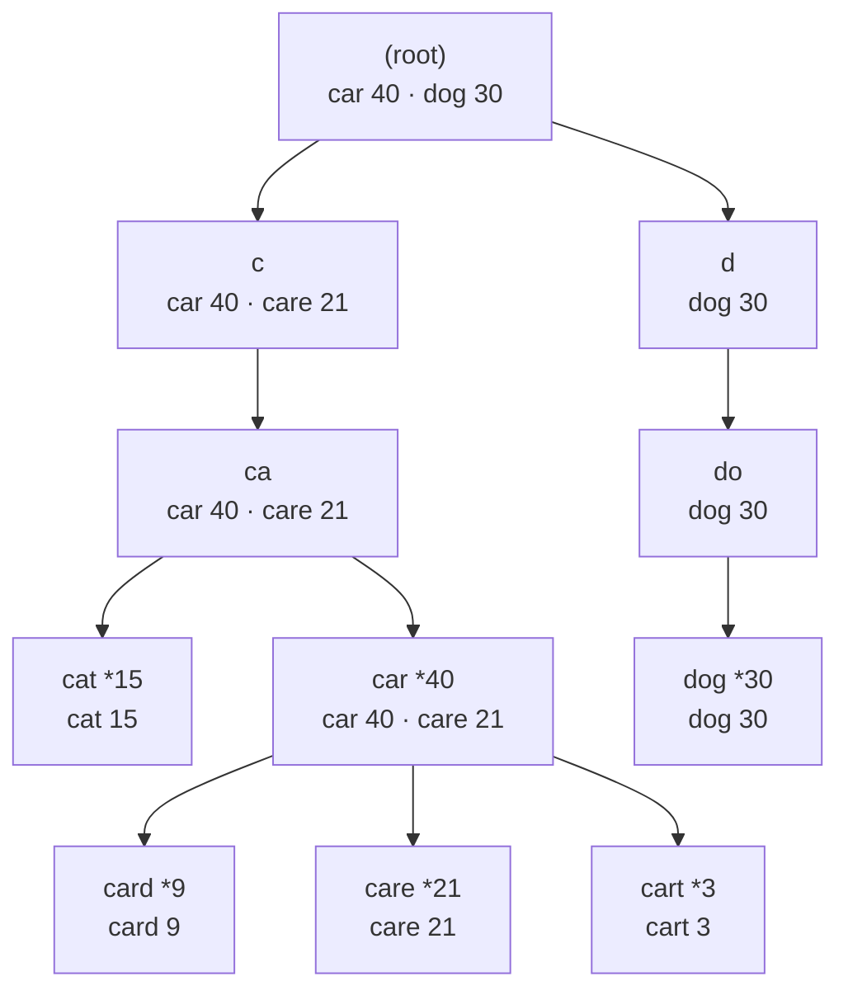

# Autocomplete and word dictionaries

## 1. What this is, and why they ask it

Autocomplete is the box that shows you five suggestions after you have typed three letters. Underneath it
is the structure you built on [day 120](../day-120-the-trie/README.md) and the walk you wrote on
[day 121](../day-121-trie-operations/README.md), plus one new step: after you reach the prefix, you have to
decide *which* of the words below it to show, and in what order.

That last step is the whole lesson. Reaching the prefix is three lines. Ranking what is underneath it is
where the design decisions live, and where the interviewer is actually looking.

They ask this because it is the one trie question that is also a system design question. "Design
autocomplete for a search box" is asked at Google, Amazon and Flipkart, in both the coding round and the
design round, and the same candidate often gives a good answer in one and a bad answer in the other. It is
also LeetCode 642 and LeetCode 1268 almost word for word, so the coding version is a known quantity — you
can walk in having already written it.

By the end of this lesson you can walk to a prefix, gather every completion below it, rank them, and then
throw that solution away and replace it with the one that stores the answers in advance. You will be able to
say what each version costs, in operations and in bytes, and name the exact situation in which the fast one
becomes wrong.

---

## 2. The story

Ramesh has stood behind the counter of the same chemist's shop for twenty-six years. It is a narrow shop on
a busy road, two customers wide, with shelves running from the floor to the ceiling behind him.

The shelves are arranged by the first letters of the name. Everything beginning with A is on the left of the
top row. B is beside it. Then C, and so on, down and across, until Z ends at the bottom right, near his
knees.

A woman comes in at half past eight with a folded strip of tablets in her hand and starts to say the name.
"Amoxi—"

Ramesh has already turned around. He does not wait for the rest of it. Three steps, left hand up, and he is
standing in front of the A shelf. Everything he could possibly need is in that one square foot of wood.

There are eleven boxes on that shelf that begin with those five letters. He does not read all eleven. At eye
level, in the front row, he keeps the four that people actually ask for — the ones he sells forty times a
week. The other seven sit behind them and above them, and he touches those maybe once a month.

So he pulls the front four, holds them up, and says the four names out loud. The woman points at the second
one. Eleven seconds, start to finish.

Once a fortnight somebody asks for something that is not in the front row. Then Ramesh has to drag the stool
over, climb up, and go through the whole shelf box by box, and that takes two minutes instead of eleven
seconds.

His nephew, who covers the shop on Sundays, cannot do this. He knows where the A shelf is. That part is
written on the wood. What he does not know is which four of the eleven to hold up first. So he holds up all
eleven, and the customer stands there reading them one by one, and the queue behind her grows.

The shelf is the easy half. The front row is the hard half, and it took Ramesh six years to get it right.

---

## 3. The idea in plain English

Take the shop apart, piece by piece.

**The shelves are the trie.** You met a **trie** on [day 120](../day-120-the-trie/README.md): a tree where
the path from the root spells a word, one character per edge. Walking "A", then "m", then "o", then "x", then
"i" is exactly Ramesh taking three steps to the A shelf. It costs one move per character, and nothing else.

**Reaching the shelf is `starts_with`.** You wrote that walk yesterday. Follow one child per character of the
prefix. If a character is missing, there is no shelf, and the answer is an empty list of suggestions. If you
get to the end, the node you are standing on is the root of a **subtree** — the whole set of words that begin
with what the user typed. A subtree is a node together with everything hanging below it.

**Gathering the boxes is a traversal.** The words under that node are not stored in a list anywhere. They are
spelled out by the paths below it. To read them you walk down every branch and collect the ones marked as
whole words. This is the depth-first search you learned on [day 100](../day-100-dfs-traversals/README.md),
run on the subtree instead of on the whole tree.

**The front row is ranking.** Ramesh does not hold up the eleven boxes in the order they sit on the shelf. He
holds up the four that sell most. To do that in code, every word needs a **weight** — a number saying how
often it is chosen. Search suggestions weight by how many people searched for that term. A code editor
weights by how recently you used the symbol.

**Ties need a rule.** Two words with the same weight must still come out in a fixed order, or your function
returns different answers on different runs and no test can pin it down. The standard rule, and the one
LeetCode 642 uses, is: **higher weight first; when weights are equal, alphabetically smaller first.**

**The nephew is the version without ranking.** He returns everything under the shelf, correct and useless. A
suggestion box that shows two thousand suggestions has not answered the question.

**Ramesh's front row is precomputation.** This is the idea worth carrying out of today. He did not decide at
half past eight which four boxes to hold up. He decided months ago, and rearranged the shelf then. When the
customer speaks, he does no thinking at all — he grabs what is already in front.

In code that means: at every node in the trie, store the top *k* words in that node's subtree, worked out in
advance. Then answering a query is walk-to-the-node, read the stored list, stop. No traversal, no sorting,
nothing proportional to how many words are underneath.

**The cost moves, it does not vanish.** Ramesh pays for the front row every time a new medicine starts
selling well and the shelf has to be rearranged. In code you pay on insert: adding one word updates the
stored list at every node along its path. That is the trade you are being asked to name — **cheap reads
bought with expensive writes, and extra memory at every node.**

**And the stool is the fallback.** Once a fortnight, somebody wants something outside the front row. If your
product needs the full ranked set and not just the top five, precomputation does not help you and you are
back to traversing.

---

## 4. The picture

Six words, with the number of times each has been searched.

```
cat 15    car 40    card 9    care 21    cart 3    dog 30
```

Here is the trie, with each node labelled by the top two words in its own subtree — Ramesh's front row,
written on every shelf rather than only the one he is standing at.



**What to notice.** A star marks a node where a whole word ends. Every node carries the best two words below
it, and those lists are *already there* before anybody types anything.

Type `ca` and you land on the `ca` node. Its stored list reads `car 40 · care 21`. You return those two and
stop. You never visit `cat`, `card` or `cart`, even though they are all underneath — and that is the point.
The unranked version visits all five.

Notice also that `car` is a whole word *and* has three children. Its own front row starts with itself. This
is the case people forget: **the prefix can be a word, and it usually deserves the top slot.**

And notice the root. Its list is what an empty search box should suggest — the two most popular things
overall. You get that for free.

Now the same trie without precomputation, which is the version you write first:

```
        type "ca"
             |
             v
        walk c -> a          2 steps
             |
             v
   +---------+---------+
   |         |         |
  cat      car -------+---------+
   |        |         |         |
 (15)     (40)      card      care      cart
                     (9)      (21)       (3)

   visit 5 word-nodes, sort 5 pairs, keep 2
```

**What to notice here.** The work is proportional to how much sits under the prefix, not to how much you
return. Typing `c` in a hundred-thousand-word dictionary walks one step and then visits six thousand nodes to
return five words.

---

## 5. The code, built step by step

Start with the node. It is yesterday's node with one field added.

```python
class Node:
    """One character position in the trie."""

    __slots__ = ("children", "weight", "top")

    def __init__(self) -> None:
        self.children: dict[str, Node] = {}
        self.weight: int = 0                    # 0 means "no word ends here"
        self.top: list[tuple[int, str]] = []    # the front row, filled in later
```

Two changes from day 121. `is_end` has become `weight`, because a word now needs a popularity number and not
just a yes-or-no. Zero doubles as "not a word", which works as long as a stored word always has a weight of
at least one. `top` is empty for now; the second half of this section fills it.

`__slots__` tells Python not to give each object a dictionary of its own attributes. On a trie with hundreds
of thousands of nodes it saves real memory, and it is a nice thing to mention out loud.

### Version one: walk, gather, rank

Insert first. It is yesterday's insert with a number on the end.

```python
def add(self, word: str, weight: int = 1) -> None:
    """Store `word`, adding `weight` to its popularity."""
    node = self.root
    for character in word:
        node = node.children.setdefault(character, Node())
    node.weight += weight
```

`setdefault` returns the existing child if there is one and creates it if there is not, which is the whole of
"walk down, building as you go" in one line. Note `+=` rather than `=`: calling `add("car", 1)` forty times
should leave `car` with weight 40, not weight 1.

Now the walk to the prefix.

```python
def _walk(self, prefix: str) -> Node | None:
    """The node at the end of `prefix`, or None if no word starts that way."""
    node = self.root
    for character in prefix:
        if character not in node.children:
            return None
        node = node.children[character]
    return node
```

This is `starts_with` from yesterday, returning the node instead of a boolean. Returning `None` rather than
raising keeps the caller simple: no shelf, no suggestions.

Then the gathering. This is the new part.

```python
def _collect(self, node: Node, so_far: str, out: list[tuple[int, str]]) -> None:
    """Append (weight, word) for every whole word in this subtree."""
    if node.weight:
        out.append((node.weight, so_far))
    for character, child in node.children.items():
        self._collect(child, so_far + character, out)
```

Four lines and both halves of a depth-first search. If the current node ends a word, record it. Then recurse
into every child, carrying the string built so far.

`so_far` is the string spelled by the path from the root. You pass it down because the node itself does not
know which character reached it — the trie stores characters on edges, not in nodes. Building `so_far +
character` copies the string at every step, which is fine for words but not for keys thousands of characters
long. The fix, if you ever need it, is a list of characters joined at the end.

Now put the three together.

```python
def suggest(self, prefix: str, k: int = 5) -> list[str]:
    """The k best completions of `prefix`, most popular first."""
    node = self._walk(prefix)
    if node is None:
        return []
    found: list[tuple[int, str]] = []
    self._collect(node, prefix, found)
    found.sort(key=lambda pair: (-pair[0], pair[1]))
    return [word for _weight, word in found[:k]]
```

The sort key is the tie rule from section 3, written out. `-pair[0]` sorts weights descending, because Python
sorts ascending and negating a number reverses it. `pair[1]` then sorts equal weights alphabetically
ascending. One tuple, two rules, in priority order.

Passing `prefix` as the starting `so_far` matters. The node you reached does not remember how you got there,
so if you pass an empty string you will get back `t`, `rd` and `re` instead of `cat`, `card` and `care`.

Sorting everything to keep five is wasteful. You met the fix on [day 116](../day-116-top-k/README.md):

```python
from heapq import nsmallest

def suggest_with_heap(self, prefix: str, k: int = 5) -> list[str]:
    node = self._walk(prefix)
    if node is None:
        return []
    found: list[tuple[int, str]] = []
    self._collect(node, prefix, found)
    best = nsmallest(k, ((-weight, word) for weight, word in found))
    return [word for _negated, word in best]
```

`nsmallest` keeps a heap of size *k* and never sorts the rest, turning `m log m` into `m log k`. The negation
inside the generator is what makes "smallest" mean "most popular", and it also keeps the alphabetical
tie-break working, because for equal negated weights the smaller string still wins.

That is version one, complete and correct. It is the right answer to LeetCode 1268 and it is what you should
write first in an interview.

### Version two: the front row

Now build Ramesh's shelf. The plan: every node stores the best *k* words in its own subtree, and `add`
maintains those lists as it walks down.

```python
def add(self, word: str, weight: int = 1) -> None:
    node = self.root
    path = [node]                                   # the root counts
    for character in word:
        node = node.children.setdefault(character, Node())
        path.append(node)
    node.weight += weight
    for ancestor in path:
        self._offer(ancestor, node.weight, word)
```

`path` collects every node from the root down to the last character, inclusive. After updating the weight,
you offer the word to each of them, because a word is in the subtree of every node along its own path and of
no others. That last clause is why this works at all: inserting `card` cannot change the front row of `dog`,
so you never have to look at it.

The offer itself:

```python
def _offer(self, node: Node, weight: int, word: str) -> None:
    """Put (weight, word) into this node's front row, keeping only the best k."""
    node.top = [pair for pair in node.top if pair[1] != word]
    node.top.append((weight, word))
    node.top.sort(key=lambda pair: (-pair[0], pair[1]))
    del node.top[self.k :]
```

Read the first line carefully, because it is the one people leave out. If `car` is already in the list with
weight 39 and you are now offering it with weight 40, appending without removing leaves the same word in the
list twice, and `suggest("ca")` returns `["car", "car", "care"]`. Remove the old entry, then add the new one.

The list has at most `k + 1` entries when you sort it, so the sort is on five or six items. That is not the
`m log m` you were trying to avoid — it is a fixed, tiny cost paid per node on the path.

Reading is now trivial.

```python
def suggest(self, prefix: str) -> list[str]:
    node = self.root
    for character in prefix:
        if character not in node.children:
            return []
        node = node.children[character]
    return [word for _weight, word in node.top]
```

No traversal. No sort. Walk the prefix, read the list, return. This function does the same amount of work for
a prefix with six thousand completions as for one with two.

### The complete solution

Both versions, in one file, ready to run.

```python
"""Autocomplete over a trie: gather-and-rank, and precomputed top-k."""

from __future__ import annotations

from heapq import nsmallest


class Node:
    """One character position in the trie."""

    __slots__ = ("children", "weight", "top")

    def __init__(self) -> None:
        self.children: dict[str, Node] = {}
        self.weight: int = 0
        self.top: list[tuple[int, str]] = []


class Autocomplete:
    """Walk to the prefix, gather everything below it, rank it, keep k.

    Reads are proportional to the size of the subtree. Writes are O(len(word)).
    Use this when the dictionary changes constantly or memory is tight.
    """

    def __init__(self) -> None:
        self.root = Node()

    def add(self, word: str, weight: int = 1) -> None:
        node = self.root
        for character in word:
            node = node.children.setdefault(character, Node())
        node.weight += weight

    def _walk(self, prefix: str) -> Node | None:
        node = self.root
        for character in prefix:
            if character not in node.children:
                return None
            node = node.children[character]
        return node

    def _collect(self, node: Node, so_far: str, out: list[tuple[int, str]]) -> None:
        if node.weight:
            out.append((node.weight, so_far))
        for character, child in node.children.items():
            self._collect(child, so_far + character, out)

    def suggest(self, prefix: str, k: int = 5) -> list[str]:
        node = self._walk(prefix)
        if node is None:
            return []
        found: list[tuple[int, str]] = []
        self._collect(node, prefix, found)
        # -weight sorts most popular first; word breaks ties alphabetically.
        best = nsmallest(k, ((-weight, word) for weight, word in found))
        return [word for _negated, word in best]


class RankedAutocomplete:
    """Every node stores the best k words beneath it, maintained on insert.

    Reads are O(len(prefix)). Writes are O(len(word) * k log k). Use this when
    reads vastly outnumber writes, which is the normal case for a search box.
    """

    def __init__(self, k: int = 5) -> None:
        self.k = k
        self.root = Node()

    def add(self, word: str, weight: int = 1) -> None:
        node = self.root
        path = [node]
        for character in word:
            node = node.children.setdefault(character, Node())
            path.append(node)
        node.weight += weight
        for ancestor in path:
            self._offer(ancestor, node.weight, word)

    def _offer(self, node: Node, weight: int, word: str) -> None:
        node.top = [pair for pair in node.top if pair[1] != word]
        node.top.append((weight, word))
        node.top.sort(key=lambda pair: (-pair[0], pair[1]))
        del node.top[self.k :]

    def suggest(self, prefix: str) -> list[str]:
        node = self.root
        for character in prefix:
            if character not in node.children:
                return []
            node = node.children[character]
        return [word for _weight, word in node.top]


if __name__ == "__main__":
    words = [("cat", 15), ("car", 40), ("card", 9), ("care", 21), ("cart", 3), ("dog", 30)]

    slow = Autocomplete()
    fast = RankedAutocomplete(k=2)
    for text, count in words:
        slow.add(text, count)
        fast.add(text, count)

    print(slow.suggest("ca", k=2))     # ['car', 'care']
    print(fast.suggest("ca"))          # ['car', 'care']
    print(slow.suggest("car", k=3))    # ['car', 'care', 'card']
    print(fast.suggest(""))            # ['car', 'dog']
    print(fast.suggest("xy"))          # []
```

Run it and you get:

```
['car', 'care']
['car', 'care']
['car', 'care', 'card']
['car', 'dog']
[]
```

The third line is the one to look at. `car` itself comes back as a suggestion for the prefix `car`, ahead of
`care` and `card`, because it is a word and it is the most popular one. If your version drops it, your
`_collect` is skipping the node it starts on.

---

## 6. What it costs

Count version one first. Let `p` be the length of the prefix, `m` the number of words under it, and `L` their
average length.

- **The walk:** `p` steps. One dictionary lookup each.
- **The traversal:** you visit every node in the subtree. A subtree holding `m` words of average length `L`
  has at most `m × L` nodes, and fewer when they share prefixes. Call it `m × L` character steps.
- **Building the strings:** `so_far + character` copies a string of growing length at each step. That adds up
  to roughly `m × L` character copies as well.
- **The ranking:** sorting is `m log m` comparisons; the heap version is `m log k`.

So `suggest` is **O(p + m·L + m log k)** and the `m·L` term dominates in practice.

Put numbers on it. Take an English dictionary of 100,000 words with an average length of 8. Type `c`:

```
words under "c"          ~ 6,000
character steps          6,000 x 8       = 48,000
heap work (k = 5)        6,000 x log2(5) = 6,000 x 2.3 = ~14,000
total                    ~62,000 operations, for five strings
```

Now type `cardio`:

```
words under "cardio"     ~ 40
character steps          40 x 8          = 320
total                    ~400 operations
```

**That 150-fold gap is the problem.** The suggestion box is slowest exactly when the user has typed least,
which is exactly when they are still typing fast. The first keystroke is the worst one.

Version two:

- **`suggest`:** `p` dictionary lookups, then copy at most `k` strings. **O(p + k)**. For `p = 1` and `k = 5`
  that is about six operations, against sixty-two thousand. Roughly ten thousand times less work.
- **`add`:** the walk is `L` steps. At each of the `L + 1` nodes on the path you rebuild a list of at most
  `k + 1` items and sort it: `k log k` plus a scan of `k`. So **O(L × k log k)**. With `L = 8` and `k = 5`
  that is about 8 × 15 = 120 operations. Version one's `add` was 8.

**Fifteen times slower on write, ten thousand times faster on read.** For a search box that reads a thousand
times per write, that trade is not close.

Space is where it bites. Count nodes first:

```
100,000 words x 8 characters       = 800,000 nodes if nothing is shared
shared prefixes in real English    ~ 250,000 nodes in practice
```

Version one stores per node: a dictionary of children, an integer, an empty list. Version two adds a list of
`k` tuples:

```
250,000 nodes x 5 entries          = 1,250,000 tuples
each tuple: 2 references x 8 bytes = 16 bytes, plus ~40 bytes tuple overhead
                                     1,250,000 x 56 = 70 MB
```

The strings themselves are shared, not copied — every entry points at the same string object the dictionary
already holds — so you pay for references, not for text. Seventy megabytes to make every keystroke free is a
trade most services take without blinking, and it is a number worth saying out loud rather than saying "some
extra memory".

If seventy megabytes is too much, store the front row only on nodes at depth 1, 2 and 3, where the subtrees
are huge, and traverse below that, where they are small. Nobody types twelve characters into a search box and
waits.

---

## 7. The traps

### The prefix that is also a word

The near-miss:

```python
def _collect(self, node, so_far, out):
    for character, child in node.children.items():
        if child.weight:
            out.append((child.weight, so_far + character))
        self._collect(child, so_far + character, out)
```

This looks tidy — check the child before descending into it — and it is wrong. It never examines the node it
was called on. Ask for completions of `car` in the sample data and you get `care`, `card` and `cart`, but not
`car`, which is the most popular word in the whole trie:

```
>>> slow.suggest("car", k=3)
['care', 'card']
```

Two results where three were asked for, and the missing one is the best one. Check the current node first,
then recurse. That is why the working version starts with `if node.weight:`.

### The empty prefix

`suggest("")` walks zero characters, lands on the root, and collects the entire dictionary. On the sample
data that is harmless. On a real one:

```
>>> len(dictionary.suggest("", k=100000))
100000
```

A hundred thousand strings built, sorted and returned because a user cleared the box. Decide what an empty
prefix means before you ship: either return the global top *k*, which version two gives you for free at the
root, or return nothing at all. Never let it fall through to the traversal.

### The heap full of nodes

Somebody always tries to push nodes onto the heap to walk the trie by popularity:

```python
import heapq
heap = [(-node.weight, node)]
heapq.heappush(heap, (-child.weight, child))
```

The moment two entries have the same weight, Python compares the second element to break the tie:

```
Traceback (most recent call last):
  File "auto.py", line 41, in <module>
    heapq.heappush(heap, (-child.weight, child))
TypeError: '<' not supported between instances of 'Node' and 'Node'
```

Two nodes with weight 0 is not a rare case in a trie; it is almost every pair. Put a tie-breaker between the
weight and the object — the string, or a counter — and it goes away. You met the same error on
[day 116](../day-116-top-k/README.md); it will keep finding you.

### The deep word

`_collect` recurses once per character. Feed it a long key, such as a URL or a DNA fragment, and:

```
Traceback (most recent call last):
  File "auto.py", line 33, in _collect
    self._collect(child, so_far + character, out)
  [Previous line repeated 995 more times]
RecursionError: maximum recursion depth exceeded
```

Python's default limit is 1000 frames and you were already several deep before `_collect` started. For
ordinary words this never happens. For anything where the key is a path or an address, rewrite `_collect`
with an explicit stack — push `(node, so_far)` and pop in a loop.

### The front row that goes stale

This is the real trap of version two, and it is the follow-up an interviewer asks when they want to separate
people.

Version two maintains the stored lists correctly when weights only ever go **up**. Now delete a word, or drop
a weight:

```python
fast.add("car", 40)     # every node on c-a-r now lists car first
fast.remove("car")      # what should the root's list say now?
```

You cannot fix the ancestors from local information. The root's list said `car 40 · dog 30`. Removing `car`
leaves a hole, and the word that should fill it might be anywhere in the trie — you do not know what it is
without traversing the subtree you were trying to avoid traversing. The stored list is a cache, and this is
cache invalidation.

The three honest answers, in the order you should offer them:

1. **Do not delete.** Set the weight to zero and let the entry age out of the list the next time something
   more popular is offered. Wrong for a while, then right. Fine for search suggestions, not fine for a
   blocklist.
2. **Rebuild the affected path.** After a delete, re-traverse the subtree of each node on the removed word's
   path and recompute its front row. Costs the traversal you were avoiding, but only on writes, and only on
   the writes that actually remove something.
3. **Rebuild everything, off to one side.** Real suggestion systems rebuild the whole structure every few
   minutes from a fresh dump and swap it in. Nothing is ever updated in place. This is what production
   systems do, and saying so is worth more than either of the first two.

Saying "the precomputed lists are a cache, so deletion is cache invalidation, and here is how I would handle
it" is the sentence that ends this line of questioning well.

---

## 8. In the interview

### How it gets asked

- *"Design autocomplete for a search box."* — the open version, coding or design round.
- *"Given a list of products and a search word, return the top three suggestions after each character
  typed."* — LeetCode 1268, asked at Amazon almost verbatim.
- *"Implement a system that suggests the top three historical queries, ranked by how often they were
  searched."* — LeetCode 642, with `#` to end an input.
- *"You have a trie. Return the five most popular words under a prefix."* — the follow-up to yesterday's
  question, and the one that catches people who only prepared insert and search.
- *"The suggestions are slow when the user has typed one letter. Why, and what do you do?"*

### The first ninety seconds

> "The structure is a trie, and the prefix walk is the easy part — one child per character, so typing `ca`
> costs two steps regardless of dictionary size. The interesting part is what happens after I land on that
> node.
>
> The straightforward version traverses the subtree, gathers every word underneath, and takes the top five
> with a bounded heap. That is correct, and I would write it first. It costs the number of words under the
> prefix, times their average length. The problem is that the cost is worst when the prefix is shortest — one
> letter into a hundred-thousand-word dictionary means visiting about six thousand words to return five, and
> the user is typing fastest at exactly that moment.
>
> So the version I would actually ship stores the top five *at every node*, computed when words are inserted.
> A query becomes: walk the prefix, read a list of five, return. Constant work after the walk.
>
> I pay for that twice. Inserts get about fifteen times more expensive, because every node on the word's path
> updates its list. And memory goes up by about seventy megabytes on a hundred-thousand-word dictionary,
> which I can compute if you want the arithmetic. For a search box, where reads outnumber writes by a
> thousand to one, that is an easy trade.
>
> The thing I would flag before you ask is that the stored lists are a cache, so deletion is the hard case.
> Shall I go into that, or would you rather I write the code first?"

### The follow-ups

**"How would you handle typos? The user types `recieve`."**

> "The trie gives me nothing here, because a typo takes me off the path at character four and I return
> nothing at all — which is worse than returning something imperfect.
>
> Three options, cheapest first. One: fuzzy walk. Allow up to one edit while walking, so at each step I can
> also try skipping a character, inserting one, or substituting one. That is a depth-first search over the
> trie with an edit budget, and it multiplies the work by roughly the alphabet size per allowed edit, so I
> would cap it at one edit and only for prefixes of four characters or more.
>
> Two: precompute. For the few thousand most common queries, store their common misspellings as extra
> entries pointing at the correct word. This is what most production systems actually do, because typos
> follow a very short distribution — a handful of mistakes account for most of them.
>
> Three: fall back to a different structure. Run the corrected-spelling path through something built for
> approximate matching and keep the trie for exact prefixes. I would not build that in the first pass.
>
> In an interview I would say option two out loud first, because it is the one that admits the distribution
> is skewed, and then offer option one as the general answer."

**"The weights change constantly. Every search updates a count. Does your precomputation survive?"**

> "Increases survive fine — that is exactly what `add` does, and it costs `L × k log k` per update. Eight
> characters and five slots is about a hundred and twenty operations per search, which at ten thousand
> searches a second is a million and a bit operations a second on one core. Tight but survivable.
>
> What does not survive is anything that lowers a weight or removes a word, because the stored lists then
> hold entries that should have been replaced by something I would have to traverse to find.
>
> So I would not update in place at all. I would keep raw counts in a separate store, and rebuild the whole
> ranked trie from scratch every five minutes in a background process, then swap the new one in atomically.
> Suggestions that are five minutes stale are completely acceptable — nobody notices — and it removes every
> invalidation problem in one move. The rebuild for a hundred thousand words is well under a second, so I can
> afford it far more often than I need it."

**"A hundred million distinct queries, not a hundred thousand words. Does this still fit in memory?"**

> "No, and I would say so rather than pretend. A hundred million queries at an average of twenty characters
> is two billion nodes at the top end; even with prefix sharing you are in the tens of gigabytes, and the
> per-node dictionary in Python is most of that.
>
> Three moves. First, prune: strip anything searched fewer than, say, five times in the last month. The
> distribution is brutally skewed, and that usually removes ninety percent of the distinct queries and one
> percent of the traffic. Second, compress: use a radix trie, where a chain of single-child nodes collapses
> into one node holding a whole substring, which cuts the node count several-fold on real text. Third,
> partition: split by first two characters across machines, so one machine holds everything starting with
> `ca`, and route the request by prefix — the request already tells you where to send it, so there is no
> lookup step.
>
> Then the front row is per machine, and the memory is per machine."

**"What do you return for an empty box?"**

> "The root's stored list, which is the globally most popular queries. In the precomputed version I get that
> for free — the root is on every word's path, so its front row is already the global top five. In the
> traversal version I would special-case it, because otherwise an empty prefix means traversing the entire
> dictionary on every page load."

### The model answer

*"Design autocomplete for a search box with a hundred thousand product names. Show three suggestions per
keystroke."*

> "Let me set the shape and then go into each piece.
>
> **The structure is a trie over the product names, with a weight on each word.** Weight is how many times
> that product was searched, or clicked; I would use clicks rather than searches if I have them, because a
> search that led nowhere is not a vote for that product.
>
> **The query path is: walk the prefix, then rank what is below it.** The walk is one step per character and
> is never the bottleneck. Ranking is.
>
> **I would write the traversal version first, to have something correct.** Gather every completion below the
> node with a depth-first search, keep the best three with a bounded heap so I am doing `m log 3` and not
> `m log m`. Tie rule stated up front: higher weight first, alphabetically smaller second, so the output is
> deterministic and testable.
>
> **Then I would show the number that makes me change it.** One letter into a hundred-thousand-name
> dictionary is about six thousand names under the prefix, eight characters each — around fifty thousand
> operations to return three strings. Per keystroke. And a hundred thousand names is a small catalogue.
>
> **So: store the top three at every node, maintained on insert.** Query becomes a walk plus a list read.
> Insert becomes eight nodes each re-sorting a four-item list, which is about a hundred operations. Memory
> goes up by roughly `250,000 nodes × 3 entries × 56 bytes`, call it forty megabytes, and those entries are
> references to strings the trie already holds, so I am not duplicating text.
>
> **The build is offline.** I do not maintain this structure live. Counts accumulate in whatever store
> already has them; a background job rebuilds the ranked trie every few minutes and swaps it in behind an
> atomic reference change. That gives me three things at once: no locking on the read path, no cache
> invalidation problem on delete, and a trivial rollback if a bad build ships.
>
> **What I would give up.** Suggestions lag reality by one build interval. For a product search box that is
> invisible. If the requirement were 'a product listed thirty seconds ago must be suggestable', I would keep
> a small second trie holding only the last few minutes of new items, query both, and merge the two
> three-item lists — which costs six comparisons.
>
> **What I would not do in the first version.** Typo tolerance, personalisation, and per-user history. Each
> is a real feature and each doubles the design. I would name them as the obvious next steps and ask which
> one you want me to take further."

---

## 9. Recall card

**The shape:** walk the prefix, then rank the subtree. The walk is `O(p)` and easy; the ranking is the lesson.

**Two versions:** gather-and-rank costs `O(p + m·L + m log k)` per query and is worst on the first keystroke;
precomputed top-`k` at every node costs `O(p + k)` per query and `O(L·k log k)` per insert.

**The tie rule, always stated:** higher weight first, then alphabetically smaller. Without it your output is
not deterministic.

**The two bugs:** `_collect` must check the node it starts on, or the prefix itself is never suggested; and
the empty prefix must be special-cased, or it traverses the whole dictionary.

**The precomputed list is a cache,** so deletion is cache invalidation. Real systems never update it in
place — they rebuild off to one side every few minutes and swap it in.
