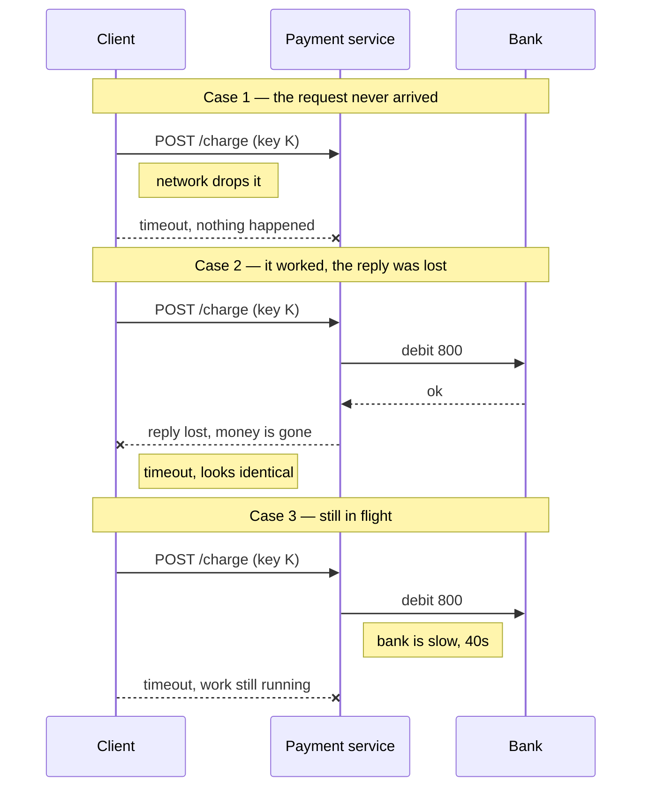
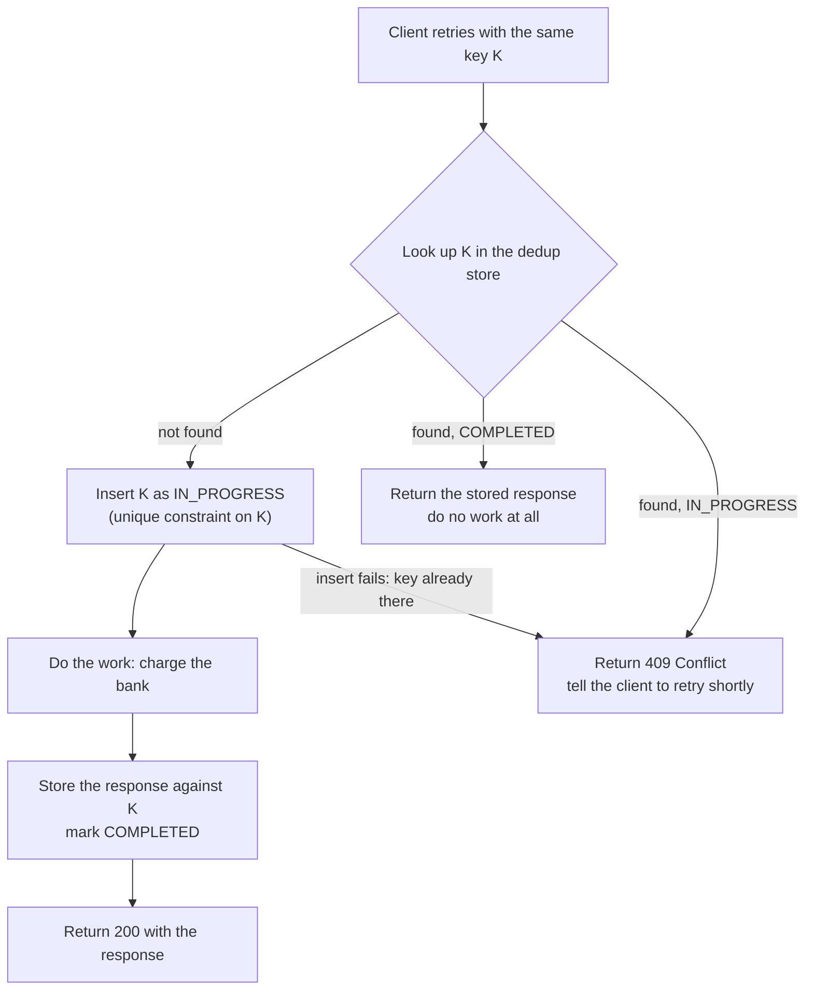

# Idempotency and exactly-once delivery

## 1. What this is, and why they ask it

An operation is **idempotent** when doing it twice has the same effect as doing it once. Setting a light
switch to "off" is idempotent. Pressing a doorbell is not. Almost every hard bug in a distributed system
comes down to something in the second category being retried.

You met retries in passing on [day 121](../day-121-trie-operations/README.md), when the saga had to retry a
compensation forever. Today is the missing half: what makes it safe to retry anything at all. And the
uncomfortable fact underneath it — that when a request times out, you genuinely do not know whether it
happened.

They ask this because it is the question that separates people who have run a payment system from people who
have read about one. "The payment request timed out. Is it safe to retry?" has a wrong answer that sounds
completely reasonable, and the right answer requires you to say out loud that **exactly-once delivery does
not exist.** Interviewers at payment companies, at Amazon, and in any round that touches queues will steer
towards this. It is also the single most common production incident in the systems you will build: the same
thing happened twice and nobody can explain why.

By the end of this lesson you can design an operation that is safe to retry, size the storage that takes,
name what a duplicate costs in rupees, and explain the difference between exactly-once *delivery*, which is
impossible, and exactly-once *effect*, which is ordinary engineering.

---

## 2. The story

The gas cylinder ran out on Tuesday evening, halfway through the cooking, so Farhan rang the distributor
first thing on Wednesday morning.

The line was bad. He gave his consumer number, all the way to the last digit, and the man on the other end
started to read it back — "Nine four three, one..." — and then the call dropped.

Farhan stood there with the phone still against his ear. He did not know whether the booking had gone
through. The man had started reading the number back, which meant he had heard it. But had he finished
writing it down? Had he pressed whatever it is he presses?

Ringing again felt risky. Two cylinders would turn up, one of which he would have to pay for and had nowhere
to keep. Not ringing felt worse. If nothing had gone through, he would find out at eight in the evening when
nothing came, and then he would be cooking on the little induction plate for three days.

He waited twenty minutes and rang again. This time he gave the consumer number first, before anything else,
before even saying what he wanted.

"Already booked," the man said, without much interest. "Ten forty-two this morning. It's on the van."

That was the whole answer, and it took four seconds.

The consumer number is not only a way of finding Farhan. It is the thing that made the second call safe.
Every booking is filed under it, and the man's screen will not accept two open bookings against the same
number on the same day. So ringing back does not book a second cylinder. It just asks, in a roundabout way,
whether the first call worked — and it can be asked as many times as you like.

Mrs D'Souza in the flat below learned the same thing from the other direction. Her own phone had no balance,
so she booked from her son's phone, in his name, because that was quicker than explaining. Then the next
morning she was not sure it had worked, so she rang from her own phone, under her own number.

Two cylinders arrived on Thursday. She paid for both.

---

## 3. The idea in plain English

Take the phone call apart.

**The dropped call is a timeout.** Farhan's phone did not tell him "the booking failed". It told him
nothing. That is exactly what a timeout is: your request went out, and no answer came back within the time
you were prepared to wait. It does not mean the work did not happen.

**There are three possibilities and you cannot tell them apart.** The request never arrived. The request
arrived, was done, and the reply was lost. Or the request arrived and is *still being worked on right now*.
From the caller's side these look identical. This is the most important sentence in the lesson: **a timeout
is not a failure; it is an unknown.**

**Retrying is the only sane response, and retrying is dangerous.** Farhan cannot sit and do nothing. Neither
can your service. So it retries — and if the first attempt did succeed, the retry is now a second, unwanted
request.

**The consumer number is an idempotency key.** An **idempotency key** is a unique label the caller attaches
to a logical operation, and keeps the same across every retry of that operation. Not a new one per attempt —
that is the whole point. Farhan's second call carried the same consumer number as his first, so the
distributor could recognise it as the same request rather than a new one.

**The distributor's screen is a deduplication store.** Before doing the work, the receiver looks up the key.
Seen before? Return the same answer as last time, do nothing new. Not seen? Do the work, record the key with
the answer.

**Mrs D'Souza shows the failure mode.** She retried with a *different* key — her son's name the first time,
her own the second. To the distributor those were two unrelated requests, and both were honoured correctly.
The key must identify the operation, not the attempt and not the caller's mood.

**Now the three delivery guarantees, which are just three positions on this problem.**

- **At-most-once:** send it, never retry. You never duplicate. You sometimes lose the request entirely.
  Fine for a metric sample, catastrophic for a payment.
- **At-least-once:** retry until acknowledged. You never lose the request. You sometimes duplicate. This is
  what almost every real system does.
- **Exactly-once:** never lost, never duplicated.

**Exactly-once delivery is not achievable, and you should say so plainly.** The reason is simple enough to
say in one breath: the last message in any exchange can always be the one that is lost, and the sender
cannot tell a lost reply from a lost request. Adding another acknowledgement just moves the problem to that
acknowledgement. No number of round trips fixes it.

**What you can have is exactly-once *effect*.** Deliver at least once, and make the processing idempotent, so
that duplicates change nothing. The message may arrive five times; the card is charged once. People call
this **effectively-once**, and it is what every system that claims exactly-once is actually doing.

**Some operations are idempotent for free.** "Set the status to `PAID`" can be applied a hundred times with
the same outcome. "Add ₹500 to the balance" cannot. When you get to choose, prefer the first shape — it is
cheaper than any machinery you could build.

---

## 4. The picture

The three outcomes hidden behind one timeout:



**What to notice.** The client's experience is byte-for-byte the same in all three cases. It sees a timeout
and nothing else. Any design that says "on timeout, assume it failed" gets case 2 wrong, and case 2 is where
the money is.

Now the fix, drawn as the path a retry actually takes:



**What to notice.** There are three branches, not two, and the third is the one people forget. If the first
attempt is *still running* when the retry arrives, the key exists but there is no stored response yet. You
must not do the work again, and you cannot return the answer, because there is no answer yet. So you refuse
and ask the caller to come back. The unique constraint on the key is what makes that safe even when both
requests hit different machines at the same millisecond.

---

## 5. How it actually works

### The key comes from the caller

The receiver cannot generate the key, because two attempts at the same operation would get two different
keys and the whole scheme collapses. So the client generates it — a UUID, or a hash of the meaningful
fields — once, before the first attempt, and reuses it for every retry of that same operation.

Stripe's API does exactly this, and it is worth naming because interviewers recognise it. You send a header:

```
POST /v1/charges
Idempotency-Key: 3f9a2c10-8e5b-4d1a-9f6c-2b7e5a0d4411
```

Stripe stores the key and the full response for **24 hours**. A retry inside that window gets the original
response, including the original charge ID, with no second charge. After 24 hours the key is forgotten, so a
retry a week later would charge again — which is why the window has to be longer than any retry policy you
allow.

PayPal, Razorpay, Adyen and AWS all have a version of this. AWS calls it a `ClientToken` on several APIs and
gives it a similar retention.

### The dedup store is a table with a unique constraint

The whole mechanism, in one table:

```sql
CREATE TABLE idempotency_keys (
    key          TEXT PRIMARY KEY,
    endpoint     TEXT        NOT NULL,
    request_hash TEXT        NOT NULL,
    state        TEXT        NOT NULL,   -- IN_PROGRESS | COMPLETED
    response     JSONB,
    created_at   TIMESTAMPTZ NOT NULL DEFAULT now()
);
```

The order of operations matters, and the order that works is **insert first, then do the work.**

1. `INSERT ... ON CONFLICT DO NOTHING` with state `IN_PROGRESS`. If zero rows were inserted, somebody else
   owns this key: read the row, and either return its stored response or return `409`.
2. Do the work.
3. `UPDATE` the row with the response and state `COMPLETED`.

Doing the work first and recording the key afterwards is the mistake. Two concurrent retries both look up,
both find nothing, and both charge the card. The `PRIMARY KEY` is doing the real work here — it is a lock
that costs nothing extra, and it is enforced by the storage engine rather than by your code.

`request_hash` catches a subtler abuse: the same key sent with a *different* body. That means a client bug,
and the right response is `422`, not a silent replay of an unrelated charge.

Rows are deleted by a nightly job, or by a TTL if the store is Redis or DynamoDB.

### HTTP already tells you which methods are safe

This is free marks in an interview.

| Method | Idempotent? | Why |
|---|---|---|
| `GET` | Yes | Reads nothing changes. |
| `PUT` | Yes | "Set the resource to this value" — same value, same result. |
| `DELETE` | Yes | Second delete finds nothing to delete; still ends deleted. |
| `POST` | **No** | "Create a new one" — twice means two. |

So `POST /orders` needs an idempotency key. `PUT /orders/4471` does not, because the caller chose the
identifier and repeating the call overwrites with the same content. Letting the client choose the ID and
using `PUT` is the cheapest way to make creation idempotent, and it is worth offering as an alternative
design.

### Kafka's version, and what it actually promises

Kafka is where the phrase "exactly-once" gets thrown around, so know what it means there.

- **The idempotent producer** (`enable.idempotence=true`) gives each producer a producer ID and stamps every
  message with a sequence number per partition. If a producer retries after a lost acknowledgement, the
  broker sees a sequence number it has already written and drops it. That removes duplicates caused by
  producer retries, within one producer session, per partition.
- **Transactions** let a consumer read from one topic, process, and write to another topic *and* commit its
  own offset in one atomic step. If it crashes halfway, neither the output nor the offset commit is visible.
- Consumers set `isolation.level=read_committed` so they never see the output of an aborted transaction.

What this gives you is exactly-once **within Kafka**. The moment your processing touches anything outside
Kafka — charging a card, sending an email, writing to Postgres — the transaction cannot cover it, and you are
back to at-least-once plus an idempotency key. Saying that sentence out loud is what shows you understand
the boundary rather than the marketing.

### Making the operation naturally idempotent

Machinery is a last resort. Four ways to avoid needing it:

- **Absolute, not relative.** `SET balance = 4500` is idempotent; `SET balance = balance + 500` is not. Where
  the domain allows an absolute write, take it.
- **Conditional writes.** DynamoDB's `ConditionExpression: attribute_not_exists(order_id)` makes "create"
  fail loudly on the second attempt instead of duplicating. Postgres gets the same with a unique index on a
  business key.
- **State machines.** `UPDATE orders SET state='SHIPPED' WHERE id=? AND state='PAID'` moves the order once
  and matches zero rows on the retry. The `WHERE` clause is the idempotency.
- **Client-chosen identifiers.** Let the client generate the order ID. Then creation is a `PUT`, and the
  primary key does your deduplication for you.

### Where the duplicates actually come from

Not just client retries. In a real system, at least five sources:

1. The client retried on timeout.
2. A load balancer or gateway retried after an upstream timeout.
3. A message queue redelivered because the consumer did not acknowledge in time.
4. The consumer crashed after doing the work and before committing its offset.
5. A human clicked the button twice, or a mobile app resumed and replayed a queued request.

The last one is why the browser's "resubmit form?" dialogue exists, and it is worth mentioning: **the same
defence handles all five,** which is the main argument for putting the key at the edge rather than sprinkling
special cases through the code.

---

## 6. The numbers

Take a payment service handling **ten million payments a day**.

**Baseline load.**

```
10,000,000 / 86,400 s          = 116 payments per second average
peak is roughly 5x average     = 580 per second
```

**How many requests end in an unknown state.** Assume a conservative 0.1% of calls to the bank time out —
network blips, bank slowness, a deploy on either side.

```
10,000,000 x 0.001             = 10,000 ambiguous requests per day
```

**What they cost if nothing is idempotent.** Suppose the client retries 30% of ambiguous requests, and the
original had in fact succeeded 60% of the time — case 2 in the diagram.

```
10,000 x 0.30 retried          = 3,000 retries
3,000 x 0.60 already succeeded = 1,800 double charges per day
1,800 x Rs 800 average         = Rs 14,40,000 charged twice, every day
```

That is fourteen lakh rupees a day of money you have to find and refund, plus 1,800 support tickets, plus the
reputational cost. **This is the number to say in an interview.** It converts "duplicates are bad" into a
budget.

**What the fix costs in storage.** Per key:

```
key (UUID as text)             36 bytes
endpoint + state + hash        ~ 80 bytes
stored response (JSON)         ~ 500 bytes
row overhead                   ~ 50 bytes
                               -----------
                               ~ 670 bytes per request
```

```
10,000,000 x 670 bytes         = 6.7 GB per day
24-hour retention              = 6.7 GB steady state
```

Under seven gigabytes. That fits in one Redis instance with room to spare, or in one Postgres table with a
`created_at` index and a nightly delete. Compare it with fourteen lakh a day and the decision makes itself.

**What the fix costs in latency and load.** One extra round trip to the dedup store on the way in, and one
write on the way out:

```
Redis lookup                   ~ 0.5 ms
Redis write                    ~ 0.5 ms
added to a payment call of     ~ 250 ms
                               = 0.4% slower
```

```
write load added               580/s x 2 writes = 1,160 extra ops/s at peak
```

Redis does hundreds of thousands of operations a second. This is not a capacity conversation.

**What a retry storm costs, if you get the policy wrong.** Three services deep, each retrying three times:

```
1 user request
x 3 retries at the gateway
x 3 retries at the service
x 3 retries at the payment worker
                               = 27 calls to the bank for one payment
```

At 580 requests per second, a bank slowdown turns 580 into 15,660 calls per second aimed at the thing that is
already struggling. Idempotency makes those 27 calls *safe*; it does not make them *free*. Bounding them is a
separate problem, and it is [day 125](../day-125-what-a-graph-is/README.md)'s.

**Kafka's version, sized.** A consumer group processing 50,000 messages a second with a dedup window of five
minutes:

```
50,000/s x 300 s               = 15,000,000 message IDs in the window
15,000,000 x 40 bytes          = 600 MB of dedup state
```

Six hundred megabytes of pure bookkeeping, held in memory, to suppress duplicates for five minutes. That is
the real price of "exactly-once", and it is why the window is always bounded.

---

## 7. The trade-offs

**You are trading storage and one extra round trip for correctness.** Roughly seven gigabytes and half a
millisecond, in the numbers above. There is almost no case where that is the wrong trade for money, orders,
or anything a user can see twice. There are cases where it is the wrong trade for high-volume, low-value
events — a duplicate page-view metric is not worth 670 bytes of protection.

**The window is finite, and that is a real hole.** Keys expire after 24 hours. A client that retries after 25
hours gets a second charge, correctly according to your design and incorrectly according to the customer. The
mitigation is to make the retention longer than the longest retry any client is permitted, and then to
enforce that permission. State the window as a number; do not leave it implicit.

**The key is the client's responsibility, and clients get it wrong.** A client that generates a fresh UUID
per HTTP attempt has idempotency in name only. A client that reuses one key for two genuinely different
payments gets the wrong money moved. Both are common. Defend with the `request_hash` check, and document the
rule in one sentence: **one key per logical operation, generated before the first attempt, kept across
retries.**

**Concurrent duplicates are harder than sequential ones.** Two retries arriving four milliseconds apart both
find no key. Only an atomic insert or a conditional write saves you, and that means the dedup store must be
strongly consistent. This rules out an eventually consistent store for the dedup table specifically —
[day 115](../day-115-heapq/README.md)'s eventual consistency is exactly the wrong property here. If the dedup
store is Redis, you need one authoritative instance or a proper `SET NX` with a single primary, not a
read-replica lookup.

**You have moved the single point of failure.** If the dedup store is down, you must choose: refuse all
writes, which is an outage, or process without deduplication, which risks duplicates. Say which one you pick
and why. For payments, refuse — a short outage is cheaper than double charges. For a notification service,
process — a duplicate push is annoying, a missing one is a broken product.

**Idempotency does not extend past your boundary.** You can make your own writes safe. You cannot un-send the
email your retry triggered, or un-fire the webhook. Anything with an external, irreversible effect must sit
behind its own key check, and the truly irreversible steps belong last in the sequence — the same ordering
rule the saga gave you on [day 121](../day-121-trie-operations/README.md).

**When would I not use this?** When the operation is already naturally idempotent. If the endpoint is
"set the user's display name to X", a retry is harmless and the whole apparatus is dead weight. Reach for the
state machine or the conditional write before you reach for a dedup table — those cost nothing and are
impossible to get wrong.

---

## 8. In the interview

### How it gets asked

- *"The payment request timed out. Is it safe to retry?"* — the direct version.
- *"How do you guarantee exactly-once processing?"* — a trap, and the answer starts by rejecting the premise.
- *"Your consumer read the message, did the work, and crashed before committing the offset. What now?"*
- *"A user double-clicked the pay button. Design so that only one charge happens."*
- *"What is the difference between at-least-once and exactly-once?"*
- *"Where does the idempotency key come from, and how long do you keep it?"* — the detail question that
  finds out whether you have actually built one.

### The first ninety seconds

> "The first thing I would say is that the timeout does not tell me the payment failed. It tells me I do not
> know. There are three possibilities and they look identical from my side: the request never arrived, it
> arrived and succeeded but the reply was lost, or it is still running at the bank right now. So 'assume it
> failed and retry' is wrong, because in the second case I have just charged the customer twice.
>
> The fix is to make the charge idempotent. The client generates an idempotency key once, before the first
> attempt — a UUID for that logical payment — and sends it on every retry. My service inserts that key into a
> dedup table with a unique constraint *before* doing any work. If the insert succeeds, I own the request and
> I do the work, then store the response against the key. If the insert conflicts, somebody has been here:
> either I return the stored response, or, if the first attempt is still in flight, I return a 409 and tell
> the client to come back shortly.
>
> Insert-before-work is the part people get backwards. If you do the work and record the key afterwards, two
> concurrent retries both see nothing and both charge.
>
> On the phrase exactly-once — I would be direct that exactly-once *delivery* is not achievable, because the
> last message in any exchange can always be lost and no extra acknowledgement fixes that. What I can build
> is at-least-once delivery plus idempotent processing, which gives exactly-once *effect*. That is what every
> system claiming exactly-once is really doing.
>
> Do you want me to size the dedup store, or go into the queue side of it?"

### The follow-ups

**"Why can't you just build exactly-once delivery?"**

> "Because the sender and the receiver never share knowledge at the same instant. Whatever the last message
> in the exchange is, it can be lost, and its sender cannot distinguish 'lost on the way there' from 'lost on
> the way back'. Adding an acknowledgement to the acknowledgement just makes that new message the last one.
> There is no protocol that terminates.
>
> So I stop trying to fix delivery and fix the effect instead. Deliver at least once — retry until
> acknowledged, accept duplicates — and make every handler idempotent so duplicates change nothing. The
> message may arrive five times and the card is debited once. That is achievable, it is what Kafka's
> transactional processing is doing behind the phrase, and it is the honest description."

**"The consumer did the work and crashed before committing its offset. Walk me through it."**

> "The message is redelivered, because from the broker's point of view it was never acknowledged. That is
> at-least-once working as designed, and I should not try to prevent it.
>
> What I do instead is make the work idempotent so the redelivery is harmless. Concretely, the message
> carries a stable ID — the order ID, or a UUID the producer stamped on it. Before processing I do a
> conditional write: `INSERT ... ON CONFLICT DO NOTHING` on that ID, or in DynamoDB a condition of
> `attribute_not_exists`. If it conflicts, I have already done this one, so I commit the offset and move on.
>
> The variant worth mentioning is when the work and the offset can live in the same store. If my consumer
> writes to Postgres, I write the business row and the consumed offset in one transaction. Then the crash
> either commits both or neither, and the redelivery never even needs the dedup check. That is a genuinely
> exactly-once pipeline, and it works precisely because there is only one store involved."

**"Two retries arrive at two different machines at the same millisecond. What happens?"**

> "Both look up the key and both find nothing, so a naive check-then-act duplicates. The unique constraint is
> what saves it: both attempt the insert, exactly one succeeds, and the loser gets a constraint violation
> rather than a green light. The loser then reads the row — if it is `COMPLETED` it returns the stored
> response, and if it is still `IN_PROGRESS` it returns a 409 with a `Retry-After`.
>
> That means the dedup store has to be strongly consistent. A read from an eventually consistent replica can
> return 'not found' for a key that was written two milliseconds ago on the primary, and then you have
> reintroduced the bug you were fixing. So: one authoritative primary for this table, or a conditional write
> that the storage engine itself serialises."

**"How long do you keep the keys, and what does that cost?"**

> "Twenty-four hours, matching Stripe, and the rule is that the retention must exceed the longest retry
> window any client is allowed. If a mobile app can queue a request offline for three days and replay it, 24
> hours is wrong and I need three days plus a margin.
>
> Cost: about 670 bytes per key including the stored response. At ten million payments a day that is 6.7 GB
> for a 24-hour window, which is one Redis instance or one modest table. Set against roughly 1,800 double
> charges a day at an average of ₹800 — fourteen lakh rupees daily — it is not a close decision.
>
> One caveat: I store the *response* as well as the key, not just the key. If I store only the key, the retry
> knows the work was done but cannot tell the client what the charge ID was, and the client is stuck."

**"What about the email you already sent?"**

> "Idempotency stops at my boundary. I can make my own writes safe; I cannot recall an email or an SMS. Two
> defences. First, ordering: the irreversible steps go last, so a failure earlier in the sequence never
> reaches them — the same rule as compensations in a saga. Second, push the key one level further out: the
> notification service itself takes an idempotency key and refuses to send twice for the same key. That turns
> the email into an idempotent operation and buys back the safety.
>
> What I would not do is claim the problem away. If the third party has no idempotency support, I say so and
> put the risk in the design explicitly."

### The model answer

*"Design a payment endpoint that a mobile app calls, where the network is unreliable and the user may
double-tap the button."*

> "Two different duplicate sources here, and I want to handle both with one mechanism.
>
> **The key is generated on the device, once per payment attempt the user starts.** Not per HTTP request. The
> app creates a UUID when the payment screen is opened, keeps it in local storage, and sends it on every
> attempt — the first one, the retry after a timeout, and the one after the app was killed and reopened. A
> double-tap reuses the same key because it is the same payment; two separate payments of the same amount get
> two keys because they are two intentions.
>
> **At the service, insert before work.** `INSERT INTO idempotency_keys (key, endpoint, request_hash, state)
> VALUES (..., 'IN_PROGRESS') ON CONFLICT DO NOTHING`. Zero rows inserted means somebody else owns it. Read
> the row: `COMPLETED` returns the stored response verbatim, `IN_PROGRESS` returns 409 with a `Retry-After`
> of two seconds. That branch is what makes concurrent duplicates safe, and it costs one round trip.
>
> **Then the work, then the response is stored against the key** in the same transaction as the business
> write if they share a store. If they do not, I write the business row and an outbox row in one transaction —
> the outbox pattern from the saga day — and a publisher moves it on. That keeps 'the charge happened' and
> 'the world was told' from diverging.
>
> **The `request_hash` guards against client bugs.** Same key, different amount, means the app is broken. I
> return 422 rather than silently replaying a charge for a different amount, because the silent version is a
> support ticket nobody can ever explain.
>
> **Downstream, the bank call carries its own reference.** Most gateways accept a merchant reference and
> deduplicate on it; I use the same key. If the gateway does not support that, I record the attempt before
> calling and reconcile against the gateway's settlement file daily. Reconciliation is not optional here —
> it is the only thing that catches the cases the key window missed.
>
> **Retention: 24 hours, sized at 6.7 GB for ten million payments a day.** That number is small enough that I
> would rather over-retain than under-retain, so if the app can replay after being offline for a weekend I
> would set it to seven days and pay 47 GB for it.
>
> **What I am explicitly not claiming.** This is not exactly-once delivery. The bank may still see two calls;
> what I guarantee is that the customer is debited once and that a retry is always safe. And if the dedup
> store is unavailable, I fail the request rather than process without protection — for payments, a short
> outage is much cheaper than a double charge, and I would make that policy explicit in the design rather
> than leave it to whoever writes the error handler."

---

## 9. Recall card

**A timeout is not a failure, it is an unknown.** Three indistinguishable cases: never arrived, succeeded but
the reply was lost, still running. Assuming failure is how double charges happen.

**Idempotent means doing it twice equals doing it once.** The key is generated by the *client*, once per
logical operation, and reused on every retry.

**Insert the key before doing the work,** with a unique constraint, and store the response against it.
Check-then-act loses to two concurrent retries; the constraint does not.

**Exactly-once delivery is impossible** — the last message can always be lost. At-least-once delivery plus
idempotent processing gives exactly-once *effect*, which is what everyone means.

**The numbers:** ~670 bytes per key, 6.7 GB a day at ten million payments, 24-hour retention, against ~1,800
double charges a day and ₹14 lakh if you skip it.
