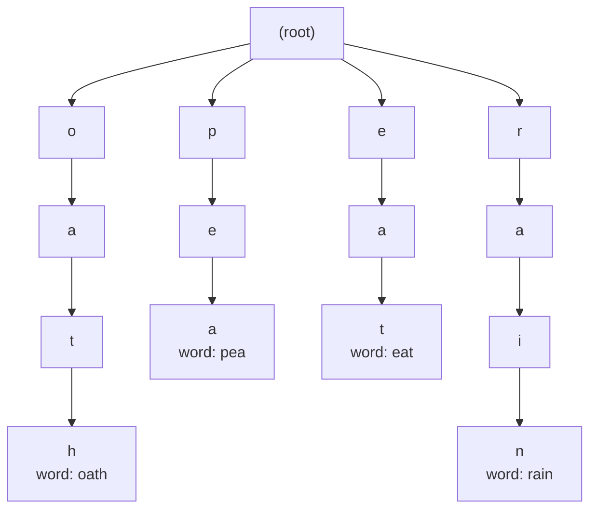

# Tries in interviews: word search II

## 1. What this is, and why they ask it

Word Search II gives you a grid of letters and a list of words, and asks which of those words you can spell
by walking from cell to neighbouring cell. It is LeetCode 212, it is marked Hard, and it is the problem the
whole trie phase has been building towards.

The reason it is famous is that the obvious solution and the good solution have the same shape. Both do a
depth-first search from every cell. The difference is one thing: the good one carries the whole word list
*with it* as it walks, so it can stop the moment no word could continue down this path. That single change
turns a solution that times out into one that finishes in a fraction of a second.

They ask it because it is the cleanest example in the whole interview canon of **combining two structures to
prune a search**. You already know backtracking on a grid from [day 96](../day-096-grid-backtracking/README.md)
and you know tries from [day 120](../day-120-the-trie/README.md). Neither alone is interesting. Putting them
together is, and the interviewer wants to watch you notice why. Google, Amazon, Microsoft and Uber all ask
it, usually as the second question when the first one went well.

By the end of this lesson you can write it from memory, explain in one sentence why searching each word
separately is the wrong shape, count the cost of both versions, and name the two optimisations that most
candidates miss.

---

## 2. The story

Balbir has delivered post to the same four buildings for thirty-one years, and Sagar Apartments is the one
that taught him everything he knows.

It is seven floors, four flats to a floor, and no lift. Twenty-eight doors, and a staircase that turns twice
between every floor.

The way he did it in his first year was one letter at a time. Pick up the top letter, read the flat, climb to
that floor, deliver it, come back down, pick up the next. Some mornings he had forty letters for Sagar and he
would climb those stairs thirty times. By ten o'clock his knees were finished and he had not started on the
other three buildings.

What he does now takes eleven minutes.

He stands at the bottom of the stairs with the whole bundle in his hand and he goes through it once, putting
it in order — ground floor first, then first, then second, all the way up. Then he climbs, once, and delivers
each floor as he passes it.

But that is only half of what he learned, and the second half is the part he is actually proud of.

At every landing he stops and looks at what is left in his hand. Not at the doors — at the bundle. If there
is nothing left for the third floor, he does not walk down the third-floor corridor at all. He does not check
the four doors. He does not even look at them. He turns and keeps climbing, and the corridor might as well
not exist.

And the bundle keeps getting lighter as he goes, so the higher he climbs, the more corridors he skips. On a
Tuesday with only six letters for the building, he walks past five of the seven floors without stepping off
the staircase.

The young man who covered for him last summer did it the old way and could not understand why it took him
two hours. He was walking every corridor on every floor, knocking to check, then going back to his bundle to
see whether anything matched. He had the bundle in one hand the whole time and never once looked at it before
walking.

---

## 3. The idea in plain English

Balbir's building is the grid. His bundle is the trie. Take it apart piece by piece.

**The grid is a set of paths.** A **grid** here is a rectangle of letters, and a path is any sequence of
neighbouring cells — up, down, left, right, no diagonals — where you never step on the same cell twice within
one word. Walking a path spells a string. The question "is `CAT` in the grid" means "is there some path whose
letters spell `CAT`".

**The naive solution searches once per word.** Take the first word. Try starting from all `M × N` cells. From
each, walk in all four directions, matching character by character against that word, and back out when it
stops matching. Then do the whole thing again for the second word. This is the summer replacement knocking on
every door.

It is correct. It is also doing the same walk over and over. If your list has `CAT`, `CAR`, `CARD` and
`CARE`, the naive version walks the `C → A` step four separate times.

**The trie carries every word at once.** A **trie** stores all the words in one tree where shared prefixes
are shared branches. `CAT`, `CAR`, `CARD` and `CARE` share the path `C → A`. So instead of asking "does this
path spell `CAT`", you ask a much better question: **"is there any word at all that starts with what I have
spelled so far?"**

That question is answered by one dictionary lookup. If the current trie node has no child for the letter in
the next cell, then no word in the entire list can continue this way, and you stop. This is Balbir looking at
the bundle before walking the corridor.

**Walking the grid and walking the trie happen together.** This is the idea to hold on to. At any moment you
are standing on a cell *and* on a trie node, and they move in lockstep. Step to a neighbouring cell whose
letter is `r`; move to that node's `r` child. If there is no `r` child, do not take the step at all.

**A word is found when the trie node says so.** Every node that ends a word is marked. When your walk lands
on one, you have spelled a complete word and you record it. You keep walking afterwards, because `CAR` being
found does not stop `CARD` from being found further along the same path.

**Backtracking is the same as [day 94](../day-094-backtracking/README.md).** Mark the cell as used before you
recurse into neighbours, and unmark it after. If you forget the unmark, a cell used by one path is
permanently unavailable to every other path, and you silently lose words. This is the bug in this problem.

**The two prunings that matter.** First, once a word is found, remove it from the trie so it cannot be found
twice — that also stops you searching for it again on every remaining start cell. Second, when a trie node
has no children left and ends no word, it is dead weight, so delete it from its parent. Over a run the trie
shrinks, and Balbir's bundle gets lighter as he climbs.

---

## 4. The picture

A four-by-four grid and four words.

```
        col 0   col 1   col 2   col 3
row 0     o       a       a       n
row 1     e       t       a       e
row 2     i       h       k       r
row 3     i       f       l       v

words:  oath   pea   eat   rain
```

The trie built from those four words, with the word stored at the ending node:



**What to notice.** The root has four children: `o`, `p`, `e`, `r`. That is the complete list of letters
worth starting from. Standing on the `f` at row 3, column 1, you look at the root, find no `f` child, and
stop immediately — one dictionary lookup, no walking at all. Twelve of the sixteen cells are eliminated that
cheaply.

Now the path that finds `oath`, drawn on the grid:

```
        col 0   col 1   col 2   col 3
      +-------+-------+-------+-------+
row 0 |  [o] ->  [a] ->  [a]  |   n   |
      +---|---+-------+---|---+-------+
row 1 |   e   |   t   |  [t]  |   e   |    <- wrong: (0,2) is 'a', not 't'
      +-------+-------+-------+-------+

      the walk that works:
      (0,0) o -> (0,1) a -> (1,1) t -> (2,1) h        spells "oath"
       root      o          oa         oat -> oath *
```

**What to notice.** Two positions move together at every step: the cell coordinate and the trie node. When
the walk reaches `(2,1)`, the node is `oath`, which is marked with a word, so `oath` is recorded. There is no
separate "now check if this is a word" pass — the trie already knows.

And the dead end, which is the point of the whole exercise:

```
      start at (1,0) 'e'  ->  root has an 'e' child, continue
      neighbours of (1,0): (0,0)='o', (2,0)='i', (1,1)='t'
        'o' -> node 'e' has no 'o' child   -> stop
        'i' -> node 'e' has no 'i' child   -> stop
        't' -> node 'e' has no 't' child   -> stop
      three lookups, zero recursion
```

**What to notice.** The naive version would have recursed into each of those three neighbours for every one
of the four words. The trie version does three dictionary lookups and returns. This is the corridor Balbir
never walks down.

---

## 5. The code, built step by step

Start with the node. One field is different from every trie you have built so far.

```python
class Node:
    """A trie node that stores the whole word at its ending position."""

    __slots__ = ("children", "word")

    def __init__(self) -> None:
        self.children: dict[str, Node] = {}
        self.word: str | None = None      # the full word, not a boolean
```

`word` instead of `is_end` is a small trick with a real payoff. When the search lands on a node that ends a
word, you need the word itself to add to the answer. Storing it here means you never have to build the string
during the walk — no `path + character` at every step, no joining a list at the end. It costs one reference
per word and saves work on every single step of every walk.

Building the trie is the insert you already know.

```python
def build(words: list[str]) -> Node:
    root = Node()
    for word in words:
        node = root
        for character in word:
            node = node.children.setdefault(character, Node())
        node.word = word
    return root
```

Nothing new. `setdefault` creates the child if it is missing. The last node gets the whole word written on it.

Now the search from one cell. This is the core, and it is worth reading twice.

```python
def explore(row: int, col: int, node: Node) -> None:
    character = board[row][col]
    child = node.children.get(character)
    if child is None:
        return                                  # no word continues this way
    if child.word is not None:
        found.append(child.word)
        child.word = None                       # do not report it twice
```

Three things happen here. The lookup `node.children.get(character)` is the whole optimisation — one dictionary
access decides whether this entire branch of the grid is worth exploring. Returning `None` is Balbir turning
away from the corridor.

Setting `child.word = None` after recording it is the first pruning. The same word can often be spelled by
several different paths, and without this line you would report it once per path. It also means the remaining
searches never look for it again.

Then the walk itself.

```python
    board[row][col] = "#"                       # mark this cell as in use
    for delta_row, delta_col in ((-1, 0), (1, 0), (0, -1), (0, 1)):
        next_row, next_col = row + delta_row, col + delta_col
        if 0 <= next_row < rows and 0 <= next_col < cols:
            if board[next_row][next_col] != "#":
                explore(next_row, next_col, child)
    board[row][col] = character                 # put it back
```

Overwriting the cell with `#` is how you stop a path from reusing a letter. `#` is never a child of any node,
so the check inside the loop is belt and braces — but it makes the intent obvious to a reader, and to an
interviewer.

The last line is the one people forget. Restoring the character is what makes this **backtracking** rather
than destruction. Without it, the first path through a cell claims it forever, and words that needed it later
simply do not appear. There is no error message. The output is just short.

Then the second pruning, which most candidates never mention:

```python
    if not child.children and child.word is None:
        del node.children[character]            # this branch is exhausted
```

Once a node has no children left and no longer ends a word, nothing below it can ever match again. Deleting
it from the parent means every future walk fails one step earlier. On a large word list this is the
difference between two seconds and two hundred milliseconds, because the trie shrinks as the run proceeds —
Balbir's bundle getting lighter.

Finally, start from everywhere.

```python
for row in range(rows):
    for col in range(cols):
        explore(row, col, root)
```

Every cell is a possible first letter, so you try all of them. The root lookup throws out most of them in one
step.

### The complete solution

```python
"""Word Search II — LeetCode 212. Trie plus backtracking on a grid."""

from __future__ import annotations


class Node:
    """A trie node that stores the whole word at its ending position."""

    __slots__ = ("children", "word")

    def __init__(self) -> None:
        self.children: dict[str, Node] = {}
        self.word: str | None = None


class Solution:
    def findWords(self, board: list[list[str]], words: list[str]) -> list[str]:
        if not board or not board[0]:
            return []

        root = Node()
        for word in words:
            node = root
            for character in word:
                node = node.children.setdefault(character, Node())
            node.word = word

        rows, cols = len(board), len(board[0])
        found: list[str] = []

        def explore(row: int, col: int, node: Node) -> None:
            character = board[row][col]
            child = node.children.get(character)
            if child is None:
                return

            if child.word is not None:
                found.append(child.word)
                child.word = None          # each word is reported once

            board[row][col] = "#"          # claim the cell for this path
            for delta_row, delta_col in ((-1, 0), (1, 0), (0, -1), (0, 1)):
                next_row, next_col = row + delta_row, col + delta_col
                if 0 <= next_row < rows and 0 <= next_col < cols:
                    if board[next_row][next_col] != "#":
                        explore(next_row, next_col, child)
            board[row][col] = character    # release it again

            # An exhausted branch can never match: cut it out of the trie.
            if not child.children and child.word is None:
                del node.children[character]

        for row in range(rows):
            for col in range(cols):
                explore(row, col, root)

        return found


if __name__ == "__main__":
    grid = [
        ["o", "a", "a", "n"],
        ["e", "t", "a", "e"],
        ["i", "h", "k", "r"],
        ["i", "f", "l", "v"],
    ]
    print(Solution().findWords(grid, ["oath", "pea", "eat", "rain"]))
    print(Solution().findWords([["a"]], ["a"]))
    print(Solution().findWords([["a", "b"], ["c", "d"]], ["abcb"]))
```

Running it:

```
['oath', 'eat']
['a']
[]
```

The third case is the one to check by hand. `abcb` cannot be spelled, because after `a → b → c` the only `b`
is the one you already used, and a cell may not be reused within a word. If your solution returns `['abcb']`,
your backtracking is wrong in a way no other test will catch.

---

## 6. What it costs

Let the grid be `M × N`, the word list have `W` words of maximum length `L`, and the alphabet have 26
letters.

**The naive version, one search per word.**

For each word you start from every cell, and from each cell the walk branches four ways at the first step and
three ways afterwards, because you cannot immediately go back where you came from:

```
starts                M x N
paths of length L     4 x 3^(L-1)
words                 W
                      ---------------------
total    W x M x N x 4 x 3^(L-1)
```

Put the LeetCode limits in: a 12 × 12 grid, 3,000 words, maximum length 10.

```
M x N          = 144
4 x 3^9        = 4 x 19,683 = 78,732
x W = 3,000    = 144 x 78,732 x 3,000 = 34,012,000,000
```

Thirty-four billion steps. That does not finish. This is why the problem is marked Hard — not because the
recursion is subtle, but because the obvious version is not a solution.

**The trie version.**

The `W` factor disappears entirely, because all the words are searched at once:

```
starts                M x N
paths                 4 x 3^(L-1)
                      ---------------------
total    M x N x 4 x 3^(L-1) = 144 x 78,732 = 11,300,000
```

Three thousand times less work, and that is before either pruning. **`W` moving out of the multiplication is
the whole answer to "why a trie".** Say it in exactly those words.

That bound is also wildly pessimistic, because the trie cuts a path the moment no word continues. The real
number is closer to the number of *prefixes that actually exist*, and on a real word list that is a few
hundred thousand steps, not eleven million. Empirically the accepted solution runs in a few hundred
milliseconds.

**Building the trie.**

```
W words x L characters = 3,000 x 10 = 30,000 insert steps
```

Negligible, and paid once.

**Space.**

```
trie nodes         W x L = 3,000 x 10 = 30,000 nodes worst case
                   fewer in practice, since prefixes are shared
recursion depth    at most L = 10 frames, plus a few
board mutation     0 extra — the "#" is written in place
output             at most W strings
```

So **O(W × L)** extra space for the trie and **O(L)** for the call stack. Writing `#` into the board instead
of keeping a separate `visited` grid saves `M × N` booleans and, more importantly, removes an entire
parameter from the recursion. Mention that you are mutating the input and restoring it — some interviewers
care, and the alternative is one line.

**What the two prunings buy.** Setting `word = None` after a find prevents duplicate reports and stops the
search re-finding the same word from a hundred different start cells. Deleting exhausted nodes shrinks the
trie as the run proceeds. On the standard test set with 3,000 words, adding the node deletion typically cuts
the runtime by half again. Neither is required for correctness of the first, and both are what a strong
answer includes.

---

## 7. The traps

### The cell you never put back

The near-miss:

```python
board[row][col] = "#"
for delta_row, delta_col in ((-1, 0), (1, 0), (0, -1), (0, 1)):
    ...
    explore(next_row, next_col, child)
# board[row][col] = character   <- left out
```

It looks harmless, because within a single path you *do* want the cell to stay claimed. The damage happens
after the path returns. On the sample grid:

```
>>> Solution().findWords(grid, ["oath", "eat"])
['oath']
```

`eat` is missing. The search for `oath` walked through `(1,1)`, left a `#` there, and `eat` needed that same
cell. No error, no warning, just a shorter list. **This is the bug in this problem**, and the way to catch it
is to run a case where two answers share a cell.

### Finding the same word many times

Without `child.word = None`:

```
>>> Solution().findWords([["a","a"],["a","a"]], ["aa"])
['aa', 'aa', 'aa', 'aa', 'aa', 'aa', 'aa', 'aa']
```

Eight paths spell `aa` on a two-by-two grid of `a`s. The judge expects one. Clearing the word after the first
find is one line and fixes it exactly, without needing a set — and it doubles as the pruning that stops you
searching for a word you have already got.

Using a `set` for `found` instead also produces the right output, and is what most people reach for. It is
worse: it hides the fact that you are still doing all that redundant work. Say that out loud if you use it.

### Checking membership per cell

The version that "uses a trie" but has not understood it:

```python
for word in words:
    for row in range(rows):
        for col in range(cols):
            if search_grid_for(word, row, col):
                found.append(word)
```

There is a trie in the file somewhere, but the loop over words is still on the outside, so `W` is still in
the multiplication. The whole point is that the word list is *inside* the walk, not outside it. On the
3,000-word test case this times out:

```
Time Limit Exceeded
Last executed input:
  board = [["a","b","c",...]] (12 x 12)
  words = ["aaaaa","aaaab",... 3000 words]
```

### The grid of one letter

A grid entirely of `a` with a word list of long strings of `a` is the classic worst case, and it is on the
judge deliberately. Every cell matches, nothing prunes, and the exponent bites:

```
board = 12 x 12 all "a"
words = ["aaaaaaaaaa"]
```

The node-deletion pruning is what saves this: once the single word is found, its whole branch is deleted, the
root has no children left, and every remaining start cell returns after one failed lookup. Without the
deletion this case is where solutions time out even *with* a trie. It is worth naming this test in the
interview — it shows you thought about the adversary.

### Recursion depth on a big grid

Long words on a large grid:

```
Traceback (most recent call last):
  File "words.py", line 34, in explore
    explore(next_row, next_col, child)
  [Previous line repeated 992 more times]
RecursionError: maximum recursion depth exceeded while calling a Python object
```

On LeetCode's limits this cannot happen — words are at most 10 characters, so the depth is at most 10. It
happens the moment someone reuses this code without a word-length limit, because the recursion is bounded by
the *trie depth*, and if you accidentally search a trie built from very long strings, you inherit their
length. Knowing which bound applies is the answer here, not raising the limit.

### Mutating the caller's board

`board[row][col] = "#"` writes into the list the caller handed you. The code restores it, so the board is
correct when the function returns — but it is not correct *during* the call, which matters if anything else
is looking, and it means the function cannot take an immutable grid. If asked, say: "I mutate and restore for
speed and to avoid a second grid; if you want it pure, I keep a `visited` set of coordinates and pass it
down, at the cost of `M × N` extra memory and one more parameter."

---

## 8. In the interview

### How it gets asked

- *"Given a board of characters and a list of words, find all words that can be formed."* — LeetCode 212, the
  standard phrasing.
- *"You already solved Word Search for one word. Now here are three thousand words."* — the two-part version,
  and the second part is the whole interview.
- *"Find all dictionary words in this letter grid."* — the Boggle phrasing.
- *"Your solution times out. What would you change?"* — asked after you give the naive answer, which is fine
  to give first as long as you know it is the naive answer.

### The first ninety seconds

> "The single-word version is a straightforward backtracking search: start from every cell, walk to
> neighbours, match characters, restore the cell on the way out. With three thousand words, running that
> three thousand times is thirty-four billion steps by my count, and it will not finish.
>
> The observation that fixes it is that those three thousand searches repeat enormous amounts of work.
> Anything starting `c-a` gets walked once per word beginning with `c-a`. So instead of asking 'does this
> path spell CAT', I want to ask 'does any word in my list start with what I have spelled so far' — and a
> trie answers that in one dictionary lookup.
>
> So: build a trie of all the words up front. Then do exactly one grid search, and carry the current trie
> node alongside the current cell. They move together — step to a neighbour with letter `r`, move to the
> node's `r` child. If there is no `r` child, no word can continue this way and I abandon the branch
> immediately, without recursing at all.
>
> I store the whole word on the node that ends it rather than a boolean, so when I land on it I can append it
> without having built the string on the way down.
>
> Two prunings I would put in from the start. After finding a word I clear it from the node, which stops
> duplicate reports and stops me finding it again from other start cells. And when a node has no children and
> ends no word, I delete it from its parent, so the trie shrinks as the run goes on. On the all-`a` worst case
> that second one is the difference between passing and timing out.
>
> Shall I write it?"

### The follow-ups

**"What is the actual complexity?"**

> "`M × N × 4 × 3^(L−1)` in the worst case, where `L` is the length of the longest word. Every cell is a
> start; from a start you branch four ways, and after that three, because you never immediately step back
> onto the cell you came from.
>
> The important part is what is *not* in that expression: `W`, the number of words. The naive version is that
> whole thing multiplied by `W`. Moving `W` out of the multiplication is the entire value of the trie, and on
> the LeetCode limits it is a factor of three thousand.
>
> I would also say that the bound is very loose. The real cost is bounded by the number of prefixes that
> exist in the word list, because the trie stops me the instant a prefix does not exist. That is why the
> accepted solution runs in a couple of hundred milliseconds instead of anything like eleven million steps.
>
> Space is `O(W × L)` for the trie, plus `O(L)` for the recursion. I mark cells in the board itself rather
> than keeping a visited grid, so there is no extra `M × N`."

**"Why store the word on the node instead of `is_end`?"**

> "Because otherwise I have to build the string as I walk — `path + character` at every step, or a list I
> join when I find something. Both cost work on every step of every path, and the vast majority of paths
> never find anything, so it is work spent on nothing.
>
> Storing the word costs one reference on the nodes that end words, which is `W` references total, and makes
> the find a single append. It also makes clearing the word after a find trivial, which is the deduplication.
>
> It is a small thing, but it is the kind of small thing that separates someone who has written this from
> someone who has read it."

**"How would you handle a grid of a thousand by a thousand?"**

> "The exponent is in the word length, not the grid size, so a large grid multiplies the number of starts
> rather than the cost per start. A million cells at, realistically, a few dozen steps each after pruning is
> tens of millions of operations — big, but linear in the grid.
>
> Two things I would add. First, a cheap frequency filter: count the letters in the grid once, and drop any
> word that needs more of some letter than the grid contains. On a big grid with a big dictionary that
> removes a lot of words for free, before any searching. Second, parallelism — the starts are completely
> independent, so I can partition the cells across workers. The only shared state is the trie, and it is read
> mostly; if I want the node-deletion pruning I either give each worker its own trie or drop that
> optimisation, and I would measure before choosing."

**"The words are a million long and the grid is small. Does the trie still win?"**

> "It wins by more, not less. The trie's cost does not grow with the word count on the search side at all —
> only the build does, at `W × L`, which is a million times ten, so ten million insert steps and a lot of
> memory. Meanwhile the naive version would be multiplying its search by a million.
>
> The pressure moves to memory. A million ten-letter words is up to ten million nodes, and a Python
> dictionary per node is heavy — realistically a gigabyte or more. If that is a problem I would use a fixed
> 26-slot list per node, or better, a radix trie that collapses single-child chains, which on English cuts
> the node count several-fold.
>
> I would also point out that with a million words and a 12 × 12 grid, almost every prefix of length two or
> three exists, so the trie prunes much later than usual. The build cost is real and the pruning is weaker.
> That is the case where I would put the letter-frequency filter in first."

### The model answer

*"Here is a 12 × 12 board and a list of 3,000 words. Return every word that appears."*

> "Let me name the shape before I write anything.
>
> **This is backtracking on a grid, plus a dictionary that tells me when to stop.** The backtracking half I
> have done before: from a cell, try four neighbours, mark the cell used, unmark on the way out. The half
> that makes this problem interesting is the stopping rule.
>
> **The naive version is one grid search per word, and I want to say why it fails rather than just avoid
> it.** Three thousand words times a hundred and forty-four starting cells times about seventy-eight thousand
> paths is thirty-four billion steps. It is not slow, it is impossible.
>
> **So I build a trie over all three thousand words first,** costing thirty thousand insert steps, and I do
> one grid search carrying a trie node beside the cell. If the node has no child for the next letter, I
> return without recursing. Every path is cut at the first character that no word contains.
>
> **On each node that ends a word I store the word itself,** not a flag, so finding is an append with no
> string building on the way down.
>
> **Two prunings, both one line.** Clear the word after finding it: that deduplicates and stops the search
> looking for it again. Delete a node from its parent once it has no children and ends no word: the trie
> shrinks as the run goes on, and on the pathological all-same-letter grid this is what stops it timing out.
>
> **Cost:** `M × N × 4 × 3^(L−1)` time, with `W` gone from the multiplication, and `O(W × L)` space for the
> trie. In practice a few hundred milliseconds.
>
> **The bug I am watching for as I write it** is forgetting to restore the cell after the loop. It produces no
> error — the answer is just missing words that needed a cell an earlier path used. So I will write the
> restore line at the same time as the mark line, and I will test with a grid where two answers overlap.
>
> **If you want it non-destructive,** I swap the in-place `#` for a set of visited coordinates: one more
> parameter and `M × N` memory. I would default to the in-place version and mention the trade rather than
> silently mutate your input."

---

## 9. Recall card

**The one sentence:** put the word list *inside* the grid walk instead of outside it, so `W` leaves the
multiplication entirely.

**Walk two things at once** — a cell and a trie node. No child for the next letter means no word continues,
so return without recursing.

**Store the word on the node, not a boolean.** Finding becomes an append, with no string built on the way
down.

**Two prunings:** clear `node.word` after a find (deduplicates and stops re-finding); delete a childless,
wordless node from its parent (the trie shrinks as you go, and this is what survives the all-`a` grid).

**The bug:** forgetting `board[row][col] = character` after the loop. No error — just missing words. Write
the restore at the same moment you write the mark.
