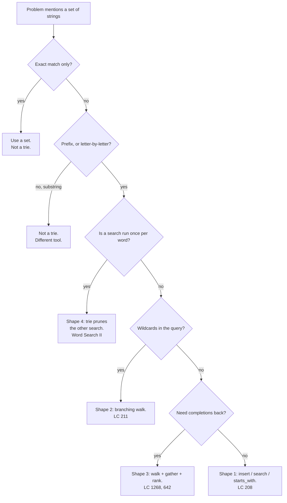

# Tries revision and mock round

## 1. What this is, and why they ask it

Four days ago you had never seen a trie. Today you close the phase, and the way to close it is not to reread
[day 120](../day-120-the-trie/README.md) — it is to answer two problems you have not seen, out loud, with a
clock running.

This lesson has two halves. The first is the compression: the recognition question, the five templates, the
costs, and the five mistakes that account for almost every trie bug. The second is a mock round — two unseen
problems, with the script for what to say in the first ninety seconds of each, and what a good answer sounds
like when it goes wrong halfway through.

The reason a revision day exists at all is that interviews do not test whether you *know* tries. They test
whether you *recognise* one in a problem that never uses the word. Nobody says "use a trie". They say "given
a list of words and a search prefix", or "the same words keep being checked against a dictionary", and you
have about ninety seconds to notice.

By the end of today you can state the recognition question in one line, write all five templates from
memory, give every operation's cost without thinking, and take two unseen problems from statement to working
code while talking.

---

## 2. The story

Joseph has been fixing wiring in the same three streets for eighteen years, and the thing that makes him fast
is that he does almost nothing for the first two minutes.

A woman calls him on a Thursday because the tube light in her kitchen has stopped working. He arrives, and he
does not open his bag. He does not touch the switch. He stands in the doorway and asks three questions.

"Did it go off all at once, or was it flickering for a few days first?"

All at once, she says.

"Anything else in the kitchen stop working at the same time? The mixer, the fridge?"

No, just the light.

"And has it happened before in this flat?"

Twice, she says. Both times in the rains.

By now he has stopped listening for anything else. He does not need to check the wiring in the wall, and he
does not need to look at the main board, because both of those would have taken the fridge down with it. He
does not need to open the switch, because a switch that is going gives you warning — it flickers first, or it
gets warm. All at once, and only the one light, and it happens in the rains: that is water getting into the
fitting itself and nothing else.

He gets the stool, unscrews the fitting, and there is the green crust on the holder, exactly where he
expected it. Eleven minutes from the doorway to done.

His apprentice, who is twenty and quick with his hands, would have been faster to open the bag and slower to
finish. He opens things. He checks the switch, then the board, then the wiring, and somewhere in the third
hour he gets to the fitting. He is not worse at the work — put the two of them in front of a corroded holder
and they will fix it in the same six minutes. What he does not have is the two minutes at the door.

Joseph says the same thing to him about once a month, and the boy has not heard it yet. "Everyone can fix it
once you know what it is. Knowing what it is, that is the job."

---

## 3. The idea in plain English

The two minutes at the door is what this lesson is for.

**The recognition question, in one line:** *am I asked about prefixes, repeatedly, over a fixed set of
strings?* If yes, trie. If any of the three parts is missing, probably not.

Take the three parts apart, because each one throws out a different wrong answer.

**"Prefixes."** Not exact matches — *prefixes*. If the question is "is this exact word in the list", a
**hash set** answers it in one step and a trie is strictly worse. You met sets on
[day 62](../day-062-sets/README.md); they beat a trie on both time and memory for exact lookup. The trie
earns its place the moment the question becomes "does anything start with this", "what completes this", or
"walk letter by letter and tell me as soon as it becomes impossible".

**"Repeatedly."** One prefix query against a list is a loop and a `startswith`. Ten thousand queries against
the same list is a trie, because you pay the build once and every query afterwards costs the length of the
query and nothing else. If the word list changes on every query, the build cost dominates and the trie loses.

**"A fixed set of strings."** The set has to be known and reasonably stable. A trie over a set that changes
completely between queries is a structure you are rebuilding rather than using.

**The four shapes it comes in.** Almost every trie interview question is one of these:

1. **Store and look up by prefix.** Insert, search, `starts_with`. LeetCode 208. This is the base, and
   everything else is built on the same three-line walk.
2. **Match with a hole in it.** A wildcard `.` matches any character, so the walk becomes a search that
   follows every child. LeetCode 211.
3. **Complete a prefix, ranked.** Walk to the node, then gather and rank what is underneath, or read a
   precomputed list. LeetCode 1268 and 642, and [day 122](../day-122-autocomplete/README.md).
4. **Prune somebody else's search.** The trie is not the answer; it is the thing that tells another search
   when to stop. Word Search II, and [day 123](../day-123-word-search-ii/README.md).

**Shape 4 is the one worth the most.** The other three are "use a trie". Shape 4 is "use a trie to make a
different search cheap", and that is the shape that turns a Hard problem into a straightforward one. The
signal for it is: *a search is being run once per word in a list.* Whenever you see that, ask whether the
list can go inside the search instead of outside it.

**What every trie operation shares.** One walk. `node = node.children[character]`, one character at a time.
Insert creates missing children on the way down. Search fails when a child is missing. `starts_with` is
search without the final `is_end` check. Delete is the walk plus a bottom-up pruning rule. Wildcards are the
walk branching. Autocomplete is the walk plus a traversal. **If you can write the walk, you can write all of
them**, and that is the thing to have automatic.

**When the answer is "not a trie".** Say these out loud too, because knowing the boundary is what makes the
recognition trustworthy:

- Exact membership only → set.
- Substring search, not prefix → a suffix structure or a proper string-matching method, not a trie of the
  words.
- A handful of words → just loop. A trie over five words is complexity for nothing.
- Very long, non-shared keys, like random hashes → a trie degenerates into a linked list per key and costs
  more memory than the strings did.

---

## 4. The picture

The recognition path, as a set of questions rather than a diagram of a structure:



**What to notice.** The first two questions throw out the cases where a trie is the wrong answer, and they
come first on purpose. Reaching for the structure you just learned is the most common way to get a phase's
worth of study wrong.

The whole phase, on one picture — the same six words, four ways:

```
words: cat car card care cart dog

SHAPE 1  search("car")        walk c-a-r, check is_end          -> True
         starts_with("ca")    walk c-a, ignore is_end           -> True

SHAPE 2  search("c.t")        c -> a? o? u? ... -> t             -> True (cat)
                              branches at the dot

SHAPE 3  suggest("ca", k=2)   walk c-a, then gather below       -> [car, care]
                              or read the stored top-2 list

SHAPE 4  grid + word list     walk the GRID, carry the NODE     -> prune early
                              no child for this letter -> stop
```

**What to notice.** Every line begins with the same word: *walk*. One motion, four uses. That is what makes
the phase memorable — you are not learning four structures, you are learning one walk and three things to do
around it.

---

## 5. The code, built step by step

Five templates. Learn these and you can write any trie problem in a round without designing anything on the
spot.

### Template 0 — the node and the walk

Everything else is built on these six lines.

```python
class Node:
    __slots__ = ("children", "is_end")

    def __init__(self) -> None:
        self.children: dict[str, Node] = {}
        self.is_end: bool = False
```

A dictionary rather than a 26-slot list, because it handles any alphabet, uses memory proportional to the
children that actually exist, and is what an interviewer expects. Mention the 26-slot array as the
alternative when memory matters and the alphabet is fixed — it is faster and denser but only for lowercase
English.

### Template 1 — insert, search, starts_with

```python
class Trie:
    def __init__(self) -> None:
        self.root = Node()

    def insert(self, word: str) -> None:
        node = self.root
        for character in word:
            node = node.children.setdefault(character, Node())
        node.is_end = True

    def _walk(self, prefix: str) -> Node | None:
        node = self.root
        for character in prefix:
            node = node.children.get(character)
            if node is None:
                return None
        return node

    def search(self, word: str) -> bool:
        node = self._walk(word)
        return node is not None and node.is_end

    def starts_with(self, prefix: str) -> bool:
        return self._walk(prefix) is not None
```

The three public methods are one line each once `_walk` exists. **The single condition separating `search`
from `starts_with` is `and node.is_end`** — say that out loud, because it is the most common one-line question
in the whole phase.

### Template 2 — delete, with the pruning rule

```python
    def delete(self, word: str) -> bool:
        """Remove `word`. Returns False if it was not there."""
        path: list[tuple[Node, str]] = []
        node = self.root
        for character in word:
            child = node.children.get(character)
            if child is None:
                return False
            path.append((node, character))
            node = child
        if not node.is_end:
            return False
        node.is_end = False
        for parent, character in reversed(path):
            child = parent.children[character]
            if child.children or child.is_end:
                break
            del parent.children[character]
        return True
```

The pruning rule, in one line: **remove a node only if it has no children and ends no word.** Both
conditions, and it must run bottom-up, which is why the loop is `reversed`. The `break` matters — the moment
one node is worth keeping, every node above it is too, so stop.

Test it on `{car, card}`: deleting `car` must leave `card` intact and remove nothing at all.

### Template 3 — the wildcard walk

```python
    def search_pattern(self, pattern: str) -> bool:
        def match(node: Node, position: int) -> bool:
            if position == len(pattern):
                return node.is_end              # NOT True
            character = pattern[position]
            if character == ".":
                return any(match(child, position + 1) for child in node.children.values())
            child = node.children.get(character)
            return child is not None and match(child, position + 1)
        return match(self.root, 0)
```

Two details that are always the bug. The base case returns `node.is_end`, never `True` — otherwise `"ca"`
matches when only `"cat"` is stored. And the dot branch must try *every* child and keep going after a
failure, which `any` does correctly; a bare `return match(...)` inside a loop gives up after the first child.

### Template 4 — gather and rank

For this one the node carries `weight: int` instead of `is_end: bool`, exactly as on
[day 122](../day-122-autocomplete/README.md) — zero means "no word ends here", and any positive number is
both a yes and a popularity.

```python
    def suggest(self, prefix: str, k: int = 5) -> list[str]:
        node = self._walk(prefix)
        if node is None:
            return []
        out: list[tuple[int, str]] = []

        def collect(node: Node, so_far: str) -> None:
            if node.weight:
                out.append((node.weight, so_far))
            for character, child in node.children.items():
                collect(child, so_far + character)

        collect(node, prefix)                    # start string is the PREFIX
        out.sort(key=lambda pair: (-pair[0], pair[1]))
        return [word for _weight, word in out[:k]]
```

Two details, both from [day 122](../day-122-autocomplete/README.md). `collect` checks the node it starts on,
or the prefix itself is never returned. And `so_far` starts as the prefix, not as an empty string.

### Template 5 — the trie that prunes a grid search

```python
def find_words(board: list[list[str]], words: list[str]) -> list[str]:
    root = Node()
    for word in words:                       # nodes here store `word`, not is_end
        node = root
        for character in word:
            node = node.children.setdefault(character, Node())
        node.word = word

    rows, cols = len(board), len(board[0])
    found: list[str] = []

    def explore(row: int, col: int, node: Node) -> None:
        character = board[row][col]
        child = node.children.get(character)
        if child is None:
            return                            # nothing continues: stop
        if child.word:
            found.append(child.word)
            child.word = None                 # report once, stop re-finding
        board[row][col] = "#"
        for dr, dc in ((-1, 0), (1, 0), (0, -1), (0, 1)):
            r, c = row + dr, col + dc
            if 0 <= r < rows and 0 <= c < cols and board[r][c] != "#":
                explore(r, c, child)
        board[row][col] = character           # RESTORE
        if not child.children and child.word is None:
            del node.children[character]      # prune the exhausted branch

    for row in range(rows):
        for col in range(cols):
            explore(row, col, root)
    return found
```

Three lines carry the whole idea: the early `return` when there is no child, the restore after the loop, and
the deletion of an exhausted node. If you can type those three from memory you have the shape.

---

## 6. What it costs

Every operation, with `L` the key length, `n` the number of keys, `Σ` the alphabet size, and `m` the number
of completions under a prefix.

| Operation | Time | Space | Note |
|---|---|---|---|
| `insert` | `O(L)` | `O(L)` new nodes worst case | Independent of `n`. |
| `search` | `O(L)` | `O(1)` | Independent of `n`. |
| `starts_with` | `O(L)` | `O(1)` | Same walk, one condition fewer. |
| `delete` | `O(L)` | `O(L)` for the path | Bottom-up prune. |
| wildcard, `w` dots | `O(Σ^w × L)` worst | `O(L)` stack | Position of the dot matters more than the count. |
| `suggest`, gathered | `O(L + m·L + m log k)` | `O(m)` | Worst on the *shortest* prefix. |
| `suggest`, precomputed | `O(L + k)` | `O(nodes × k)` extra | Insert becomes `O(L·k log k)`. |
| build | `O(n × L)` | `O(n × L)` nodes worst case | Fewer nodes when prefixes are shared. |
| Word Search II | `O(M·N·4·3^(L−1))` | `O(n × L)` | `n` is *not* in the time. |

**The sentence that matters more than the table:** every basic operation is `O(L)` and **none of them depends
on how many words are stored.** A trie with ten words and a trie with ten million words answer `search("car")`
in the same three steps. That is the property to say out loud, because it is the one a hash set does not have
for prefixes.

**Memory, worked out.** Take 100,000 English words averaging 8 characters:

```
worst case, nothing shared     100,000 x 8      = 800,000 nodes
real English, prefixes shared                   ~ 250,000 nodes

per node in Python:
  object header + __slots__     ~ 56 bytes
  empty dict                    ~ 64 bytes
  a dict with a few entries     ~ 184 bytes
                                ----------------
  call it ~150 bytes average

250,000 x 150                                   = 37 MB
```

Now the same words in a set:

```
100,000 strings x (49 bytes header + 8 chars)   ~ 5.7 MB
set table overhead                              ~ 4 MB
                                                = ~10 MB
```

**A trie costs roughly three to four times a set, and buys prefix queries.** If you never ask a prefix
question, you paid 27 MB for nothing. That comparison, with those numbers, is a strong thing to have ready.

**When memory is the constraint,** three moves in order of how much they buy:

1. A 26-slot list per node instead of a dict — faster, but wasteful when nodes are sparse; usually a wash on
   English words and a clear win on dense tries.
2. A **radix trie**, which collapses any chain of single-child nodes into one node holding a whole substring.
   On English this typically cuts the node count by half or more, because the tails of words are all
   single-child chains.
3. Do not store the trie at all — go back to a sorted list and `bisect`, which gives prefix ranges in
   `O(log n + m)` with no structure to maintain. Slower per query, dramatically smaller. Worth naming as the
   alternative you considered.

---

## 7. The traps

Five mistakes account for nearly every trie bug. Each is listed with the exact symptom, because in four of
the five there is no error message at all.

### 1. `search` that is really `starts_with`

```python
def search(self, word: str) -> bool:
    return self._walk(word) is not None     # missing the is_end check
```

Symptom: `search("ca")` returns `True` when only `"cat"` is stored.

```
>>> t.insert("cat"); t.search("ca")
True
```

Nothing crashes. Every prefix of every stored word is now a member.

### 2. Delete that takes a neighbour with it

Pruning without checking `is_end`:

```python
if not child.children:
    del parent.children[character]          # forgot: or child.is_end
```

Store `car` and `card`, delete `card`:

```
>>> t.insert("car"); t.insert("card"); t.delete("card"); t.search("car")
False
```

`car` is gone, because the `r` node had no children left after the delete and was pruned — even though it
ended a word. Both conditions or neither.

### 3. The wildcard base case

```python
if position == len(pattern):
    return True                             # should be node.is_end
```

```
>>> t.insert("cat"); t.search_pattern("ca")
True
```

Same class of bug as number 1, in a different place. Any prefix now matches.

### 4. The cell that is never restored

```python
board[row][col] = "#"
for dr, dc in (...):
    explore(...)
# missing: board[row][col] = character
```

```
>>> find_words(grid, ["oath", "eat"])
['oath']
```

No error. Just a short answer, and only when two answers share a cell — which most small test cases do not.

### 5. Reaching for a trie when a set would do

The one nobody lists as a bug, and the one that costs marks:

```python
trie = Trie()
for word in dictionary:
    trie.insert(word)
return trie.search(target)                  # exact match, one query
```

Symptom: none. It works. It is 37 MB and forty lines where a set is 10 MB and one line. An interviewer who
asks "why a trie here?" and gets no answer has learned something about you.

### And the two real error messages

Both come from the same place — recursion depth — and both are worth recognising instantly:

```
Traceback (most recent call last):
  File "trie.py", line 33, in collect
    collect(child, so_far + character)
  [Previous line repeated 995 more times]
RecursionError: maximum recursion depth exceeded
```

```
Traceback (most recent call last):
  File "trie.py", line 41, in suggest
    heapq.heappush(heap, (-weight, node))
TypeError: '<' not supported between instances of 'Node' and 'Node'
```

The first is a trie built from long keys — paths, URLs, sequences — being traversed recursively. Rewrite with
an explicit stack. The second is a heap with no tie-breaker between the priority and the object. Insert the
string, or a counter.

---

## 8. In the interview

### How it gets asked

Nobody says "trie". These are the phrasings that mean it:

- *"Implement a data structure that supports adding words and searching for them."* — shape 1.
- *"...and searching with `.` matching any character."* — shape 2.
- *"Given a list of products, return suggestions after each character typed."* — shape 3.
- *"Given a board and a list of words, return all words present."* — shape 4.
- *"You have a dictionary and a stream of characters. After each one, say whether any word just ended."* —
  shape 4 with a reversed trie.
- *"Replace every word in this sentence with its shortest root from this dictionary."* — shape 1 with an
  early stop.

The signal that outranks all of them: **a search is being run once per word in a list.** Whenever you hear
that, the word list belongs inside the search.

### The mock round

Two problems. Twenty minutes each. Say everything out loud, including the parts where you are stuck.

---

**Problem 1.** *"You are given a dictionary of words and a long string with no spaces. Return true if the
string can be split entirely into dictionary words. Then return one such splitting."*

**Minute 0 to 2 — recognise, do not code.**

> "Repeated prefix questions against a fixed word list — every time I stand at position `i` in the string I
> want to know which dictionary words start there. That is a trie.
>
> Before I commit: could a set do it? A set gives me exact membership, so I would have to try every substring
> `s[i:j]`, which is `O(n²)` substrings each hashed at `O(length)`. The trie lets me walk forward from `i`
> once and find every word starting there in a single pass, so it is `O(n)` per start instead of `O(n²)`.
> That is the reason, and I would say it rather than just asserting the trie.
>
> The second half — 'can be split' — is overlapping subproblems, so this is a trie plus memoisation. Let me
> confirm the constraints: how long is the string, how many words, and can words repeat?"

**Minute 2 to 12 — write it.**

```python
def word_break(text: str, words: list[str]) -> bool:
    root = Node()
    for word in words:
        node = root
        for character in word:
            node = node.children.setdefault(character, Node())
        node.is_end = True

    from functools import lru_cache

    @lru_cache(maxsize=None)
    def can_split(start: int) -> bool:
        if start == len(text):
            return True                       # consumed everything
        node = root
        for end in range(start, len(text)):
            node = node.children.get(text[end])
            if node is None:
                return False                  # no word continues: stop early
            if node.is_end and can_split(end + 1):
                return True
        return False

    return can_split(0)
```

Say while typing: *"The `return None` inside the loop is the trie earning its place — I stop scanning forward
the moment no dictionary word can continue, instead of testing every remaining substring."*

**Minute 12 to 16 — cost, out loud.**

> "`n` start positions, each walking forward at most `n` characters, so `O(n²)` character steps, and
> memoisation means each start is computed once. Building the trie is `O(total characters in the dictionary)`.
> Space is the trie plus `O(n)` for the memo and `O(n)` for the recursion.
>
> Without the trie it is the same `O(n²)` in the worst case but with a substring construction and a hash at
> every step, so the constant is much worse, and the early exit does not exist."

**Minute 16 to 20 — the follow-up they will ask.**

> *"Now return the actual splitting, and then all of them."*
>
> "For one splitting, I return the string instead of a boolean and prepend as I unwind. For *all* splittings,
> the answer count can be exponential — `aaaa...` with dictionary `["a","aa"]` gives Fibonacci-many results —
> so no memoisation on the *results* saves me from that; I would memoise the list of suffix-splittings per
> start, which shares structure, and I would say up front that the output size is the real bound."

---

**Problem 2.** *"Design a structure that takes characters one at a time. After each character, report whether
any word from a fixed dictionary ends at that character."*

**Minute 0 to 3 — the trap, and the recognition.**

> "The obvious move is a trie of the dictionary, and walking it forward as characters arrive. That fails
> immediately: the stream is `a, b, c, d` and the word is `cd`. By the time `c` arrives I have already walked
> off the trie at `b` and there is nothing to walk from.
>
> I could keep a set of *all* the live positions — one walker per possible start — which is correct but grows
> with the stream.
>
> The move that fixes it is to store the dictionary **reversed**. Then, when a character arrives, I walk
> *backwards* through the recent characters from the newest, matching against the reversed trie. A word ends
> here exactly when its reversal starts here going backwards. And I only need to keep as many recent
> characters as the longest word.
>
> This is LeetCode 1032 and I would say plainly that the reversal is the trick — it is not something you
> derive under pressure, it is something you recognise."

**Minute 3 to 12 — write it.**

```python
from collections import deque


class StreamChecker:
    def __init__(self, words: list[str]) -> None:
        self.root = Node()
        self.longest = 0
        for word in words:
            node = self.root
            for character in reversed(word):          # REVERSED
                node = node.children.setdefault(character, Node())
            node.is_end = True
            self.longest = max(self.longest, len(word))
        self.recent: deque[str] = deque(maxlen=self.longest)

    def query(self, letter: str) -> bool:
        self.recent.appendleft(letter)                # newest first
        node = self.root
        for character in self.recent:
            node = node.children.get(character)
            if node is None:
                return False
            if node.is_end:
                return True
        return False
```

Say while typing: *"`maxlen` on the deque is doing real work — it bounds memory to the longest word regardless
of how long the stream runs, and it means I never have to prune by hand."*

**Minute 12 to 16 — cost.**

> "Each query walks at most `L` characters where `L` is the longest word, so `O(L)` per character and
> completely independent of how many characters have arrived. Space is the trie, `O(total dictionary
> characters)`, plus `O(L)` for the buffer.
>
> The early `return False` matters more than it looks: on a real stream most queries die within two or three
> characters, so the practical cost is far below `L`."

**Minute 16 to 20 — when it goes wrong.**

If you cannot see the reversal, say so and keep working:

> "I do not see a way to avoid tracking multiple live positions yet. Let me build the correct version with a
> set of active nodes first — that is `O(number of active walkers)` per character and I can bound it by the
> longest word — and then see whether I can flip it."

That is a passing answer. **Being stuck out loud with a working fallback beats silence with a perfect one**,
and the interviewer will usually give you the hint once they see you have a correct version.

### The model answer

*"Why did you pick a trie here?"* — the question that ends most trie interviews, asked after the code works.

> "Three reasons, and I would check them in order.
>
> One, the queries are about prefixes, not exact matches. A set answers exact membership in one step and beats
> a trie on both time and memory, so if the question were only 'is this word present', I would use a set and
> say so. It is not — I need 'does anything start with this' and 'what continues from here', and that is the
> query a set cannot answer without scanning.
>
> Two, the queries are repeated against a stable set of words. I pay `O(total characters)` once to build, and
> every query afterwards costs the length of the query and nothing else — it does not grow with the number of
> words stored. That is the property I am actually buying.
>
> Three, the shape here is that a search was being run once per word in the list. Putting the word list inside
> the search removes that factor entirely. On the numbers for this problem that is a factor of three thousand.
>
> The cost is memory: roughly three to four times what a set of the same words would take — about 37
> megabytes versus 10 for a hundred thousand English words. If memory were the binding constraint I would use
> a radix trie, which collapses single-child chains and cuts the node count roughly in half, or fall back to a
> sorted list with binary search, which gives prefix ranges in `O(log n + m)` with no structure to maintain
> at all."

---

## 9. Recall card

**The recognition question:** *prefixes, repeatedly, over a fixed set of strings?* All three parts, or it is
not a trie. Exact match only → set. A search run once per word → put the list inside the search.

**One walk, four shapes:** insert/search/`starts_with`; wildcard branching; gather-and-rank; and prune
somebody else's search. Shape 4 is worth the most and is the hardest to spot.

**Every basic operation is `O(L)` and none depends on `n`.** That is the property you are buying, and it is
what a set cannot give you for prefixes.

**The five bugs, four of them silent:** missing `is_end` in `search`; pruning a node that ends a word;
wildcard base case returning `True`; the grid cell never restored; and using a trie where a set would do.

**Memory:** ~150 bytes per node, ~250,000 nodes for 100,000 English words, ~37 MB — about 3–4× a set. Radix
trie or sorted-list-plus-`bisect` are the two ways down.
