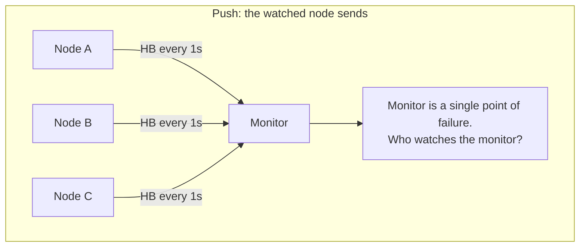
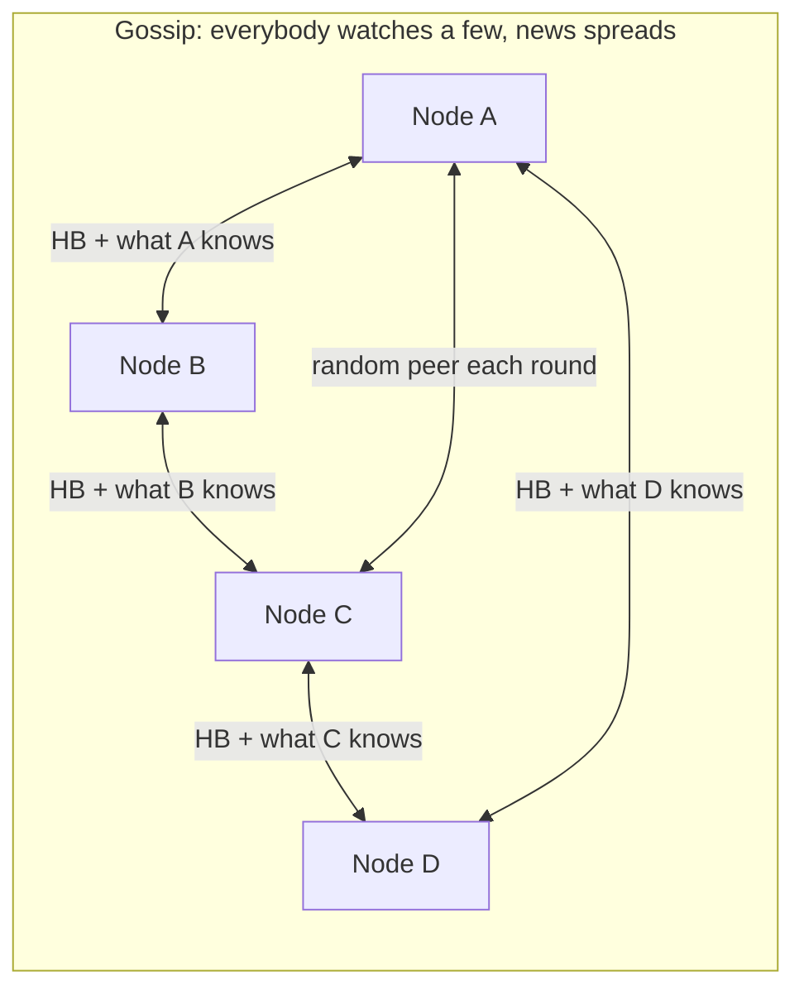

# Failure detection, heartbeats, and timeouts

## 1. What this is, and why they ask it

You cannot tell whether a machine has died. You can only tell that it has stopped answering, and those are
different facts. A machine that is dead, a machine that is overloaded, and a machine on the far side of a
broken network cable all look identical from where you are standing.

Failure detection is the machinery that turns "has not answered for a while" into a decision. Heartbeats,
timeouts, health checks and gossip are all versions of the same idea, and every one of them is a bet: you
pick a number of seconds, and you accept that sometimes you will declare a healthy machine dead and sometimes
you will keep sending work to a dead one.

They ask this because "how do you know a server has died?" is a question with no correct answer, only a
trade-off — and watching a candidate discover that live is very informative. It also underpins everything in
this phase. [Leader election](../day-118-two-heaps/README.md) starts when a failure is detected. A
[distributed lock](../day-127-graph-bfs/README.md) is unsafe precisely because a detected failure might be
wrong. Retries, circuit breakers and load-balancer health checks are all downstream of this one number.

By the end of this lesson you can design a failure detector, set the timeout from a real latency
distribution rather than a guess, name the cost of getting it wrong in both directions, and explain why the
correct answer to "is it dead?" is often "it does not matter, because I fenced it".

---

## 2. The story

Mr Pillai has lived on the second floor of the same building for thirty-one years, and he sleeps badly.

Ram Singh walks the lane at night. He starts at eleven, goes up one side and down the other, and every so
often he blows his whistle — two short blasts, then a pause, then one long one. You hear him faintly at the
top of the lane, louder as he comes past the gate, then faint again as he goes towards the temple. Round and
round until five.

Mr Pillai does not really listen for it any more. It is just there, the way the fridge is there. But he
notices when it stops.

On Tuesday it stopped.

He was lying awake anyway, and at some point he realised he had not heard the whistle for a while. He tried
to remember when the last one had been. Ten minutes? Twenty? He had not been counting, which was the problem —
by the time you notice a sound has stopped, you have already lost track of when it stopped.

So he lay there and thought about it. Ram Singh might be asleep on the plastic chair by the gate; he has been
known to. He might have gone round the back where the wall blocks the sound, which happens every round and
takes about four minutes. He might have walked down to the main road for tea, which takes twelve. He might be
lying somewhere.

Four possibilities, and from a second-floor window in the dark there is no way at all to tell them apart. All
four sound exactly the same. All four sound like silence.

At twenty-five past two he got up, put on his slippers, and went down.

He could have got up at five past two, and been wrong most nights — Ram Singh goes round the back every
round. He could have waited until three, and if something had actually happened, an hour would have been a
long time. Twenty-five minutes is not a clever number. It is just the point at which he decided that being
wrong and slightly embarrassed was cheaper than being right and too late.

Ram Singh was at the tea stall on the main road. He had been there twenty minutes. He was surprised to see
Mr Pillai and slightly annoyed by the implication, and they walked back up the lane together without saying
much.

Mr Pillai still goes down about once a month. He has never once found anything wrong. He still goes.

---

## 3. The idea in plain English

Mr Pillai built a failure detector, and every part of one is in that story.

**The whistle is a heartbeat.** A **heartbeat** is a small, regular message that says "I am alive". It
carries almost nothing else. It exists to be missed.

**The heartbeat interval is how often it comes.** Ram Singh whistles roughly every ninety seconds. In a
system this is a number you choose — every second, every five seconds — and it is the resolution of your
detector. You cannot notice a failure faster than you notice a missing heartbeat.

**The timeout is how many you let go missing before you act.** Mr Pillai waited twenty-five minutes. In a
system, the timeout is usually expressed as a multiple of the interval: "three missed heartbeats and you are
out".

**The four possibilities are the whole problem.** Asleep, behind a wall, gone for tea, or lying somewhere.
Written properly: the machine has **crashed**; the machine is **slow** because it is overloaded or
garbage-collecting; the **network** has dropped the messages; or the machine is fine and the *reply* was
lost. From outside, these are indistinguishable. **This is not a limitation of your monitoring. It is a
property of the world**, and it has a name — you cannot distinguish a crashed machine from a slow one in an
asynchronous network.

**So a failure detector does not report truth. It reports a suspicion.** The vocabulary for how wrong it can
be:

- A **false positive** is declaring a healthy machine dead. Mr Pillai walking down and finding Ram Singh at
  the tea stall. The machine was fine; you removed it from the cluster anyway.
- A **false negative** is failing to notice a machine that really has died. You keep routing work to it, and
  every request fails.

**You cannot have neither, and shortening the timeout trades one for the other.** A five-minute timeout means
Mr Pillai goes down twice a night for nothing. An hour-long timeout means a real problem waits an hour. There
is no setting that is right; there is only a setting that matches what each mistake costs you.

**Detection time is the number to state.** If heartbeats come every second and you allow three misses, the
worst case is: the machine dies just after sending one, you wait for three intervals plus the time to notice,
so detection takes a little over three seconds. **Detection time ≈ interval × misses allowed**, and you
should be able to say it as a number, not as "quickly".

**Push and pull are the two shapes.** In a **push** detector, the machine sends heartbeats to a watcher —
Ram Singh whistling. In a **pull** detector, the watcher asks the machine "are you alive?" — the watcher
calling out. Pull is what a load balancer's health check does. Push scales better, because the watched
machine does the work; pull tells you more, because you can ask a question the machine has to actually do
work to answer.

**A better detector reports a degree of suspicion, not a yes or no.** Instead of "dead after three misses",
you can track how long gaps *usually* are and say how surprising the current silence is. If Ram Singh's
whistle normally comes every ninety seconds but sometimes stretches to four minutes when he goes round the
back, then four minutes of silence is unremarkable and eleven minutes is not. This is the idea behind the
**phi accrual** detector, and its value is that the *application* gets to choose how much suspicion is enough
for its own decision.

**And the deepest point: often you should stop trying to know.** Mr Pillai's real problem is not "is Ram
Singh alive" — it is "should I do something". Systems that go furthest with this stop asking "is it dead?"
and instead make it harmless to be wrong: take the work away, revoke its permissions, make its writes get
rejected. That is **fencing**, and it is why a good answer to "how do you know it died?" often ends with
"I do not need to."

---

## 4. The picture

The timeline that shows why the timeout is a bet:

```
heartbeat interval = 1s, timeout = 3 missed

  t=0     t=1     t=2     t=3     t=4     t=5     t=6
   |       |       |       |       |       |       |
   HB      HB      HB      x       x       x      DECLARE DEAD
   ok      ok      ok    missed  missed  missed
                    ^                              ^
                    |                              |
            last known good                detection at t=6
                    <--------- 3s or more --------->

   CASE A: machine really crashed at t=2.1
           detection took 3.9s. Correct, and 3.9s of failed requests.

   CASE B: machine paused for a 2.5s garbage collection at t=2.1,
           came back at t=4.6, heartbeat at t=5 was DROPPED by a
           congested link.
           You declared a perfectly healthy machine dead.
           It does not know. It is still serving traffic.
```

**What to notice.** Case A and case B are byte-for-byte identical from the watcher's side. Nothing you can
observe distinguishes them, and no shorter timeout helps — a shorter timeout makes case B *more* likely, not
less.

Now the two shapes, and the third one that scales:





**What to notice.** In the push diagram every node talks to one monitor, which is simple and has an obvious
weakness: the monitor is now the thing whose failure nobody detects. In the gossip diagram no node talks to
more than a few peers, each message carries not just "I am alive" but "and here is what I have heard about
everyone else", and news of a failure spreads to the whole cluster in a number of rounds proportional to the
*logarithm* of the cluster size. That is why hundred-node and thousand-node clusters gossip.

---

## 5. How it actually works

### Kubernetes probes: the version you will actually configure

Kubernetes runs a pull-based detector against every container, and it distinguishes two questions that people
routinely confuse.

```yaml
livenessProbe:                 # "should I kill and restart this?"
  httpGet: { path: /healthz, port: 8080 }
  initialDelaySeconds: 30
  periodSeconds: 10
  timeoutSeconds: 1
  failureThreshold: 3          # 3 failures -> restart

readinessProbe:                # "should I send it traffic?"
  httpGet: { path: /ready, port: 8080 }
  periodSeconds: 5
  failureThreshold: 2          # 2 failures -> remove from the load balancer
```

**Liveness failing restarts the container. Readiness failing only stops traffic.** Getting these the wrong
way round is a classic production incident: a service whose liveness probe checks its database connection
will restart every pod in the fleet when the database has a blip, turning a degraded system into a dead one.
The rule is that **a liveness probe must only check things the restart can fix.** Dependencies belong in
readiness.

Detection time with those settings: `periodSeconds × failureThreshold` = 10 × 3 = **30 seconds** for
liveness, 5 × 2 = **10 seconds** for readiness, plus up to one period of luck. Say the number.

### Load balancer health checks

Every load balancer does the same thing with different names. AWS's ALB defaults are a 30-second interval, a
5-second timeout, 2 consecutive successes to be healthy and 2 failures to be unhealthy — so worst-case
detection is about 60 seconds out of the box, which surprises people. Tightening it to a 5-second interval
with a threshold of 2 gives 10-second detection at the cost of six times the health-check traffic.

The subtlety worth naming: a health check that only returns `200 OK` from a static handler tells you the
process is running, not that it can do its job. A **deep** health check that touches the database tells you
more and creates a new failure mode, because now every instance fails its check at the same instant when the
database hiccups. The usual answer is a shallow liveness check and a readiness check that reports degraded
dependencies without failing hard.

### Cassandra's phi accrual detector

Cassandra does not use a fixed timeout. It records the intervals between heartbeats from each peer, builds a
running distribution, and computes **phi** — a number that grows as the current silence becomes more
surprising given that history. Roughly, phi = 1 means about a 10% chance this is a real failure, phi = 2
about 1%, phi = 3 about 0.1%. The threshold is configurable (`phi_convict_threshold`, default 8).

Why this is better than a fixed number: a link that normally delivers in 1 ms and a link that normally
delivers in 400 ms get different effective timeouts automatically, and a cluster whose latency degrades
gradually does not suddenly start declaring everyone dead. Akka uses the same detector. It is the right answer
to "how do you pick the timeout?" when the network is heterogeneous.

### Gossip and SWIM

For large clusters, all-to-all heartbeating does not fit. **SWIM** is the protocol most modern systems use —
HashiCorp's Serf and Consul, and the membership layer inside many meshes.

Each round, a node picks one random peer and pings it. If there is no reply, it does not immediately declare
failure — it asks `k` other nodes (typically 3) to ping that peer on its behalf. This **indirect probe** is
the clever part: it distinguishes "the peer is unreachable *from me*" from "the peer is unreachable from
everyone", which removes a large class of false positives caused by one bad link. Only if all the indirect
probes also fail does the node mark the peer suspect, and suspicion spreads by gossip with a timeout before
it becomes a confirmed failure.

The cost per node per round is constant — one direct ping plus occasionally `k` indirect ones — regardless of
cluster size, which is the entire reason it exists.

### ZooKeeper, Redis Sentinel, Raft

Three more numbers worth having memorised, because they show the range:

- **ZooKeeper sessions.** A client's session has a timeout, negotiated between 2× and 20× the server's
  `tickTime` (default 2 s), so typically 4 to 40 seconds. When the session expires, every ephemeral node the
  client created is deleted — which is how ZooKeeper-based leader election and locks release automatically.
- **Redis Sentinel.** `down-after-milliseconds`, default 30,000. One sentinel deciding a master is down makes
  it *subjectively* down; a quorum agreeing makes it *objectively* down, and only then does a failover start.
  The two-stage rule exists purely to reduce false positives.
- **Raft.** Election timeout of 150–300 ms, randomised per node, with heartbeats every ~50 ms. This is two
  orders of magnitude tighter than the others because Raft nodes are on a fast local network and because an
  unnecessary election is cheap — it costs one term and a few round trips.

**The range from 150 milliseconds to 40 seconds is not inconsistency. It is each system pricing its own false
positive.** An unnecessary Raft election costs milliseconds. An unnecessary Kubernetes restart costs a cold
start and dropped connections. An unnecessary Cassandra eviction costs a rebalance of gigabytes.

### And the part that makes detection less important: fencing

Suppose you get it wrong and declare a live node dead, then hand its work to another node. Now two nodes
believe they own the same thing. The answer is not a better detector — it is to make the old one's writes
fail.

A **fencing token** is a number that increases every time ownership changes. The new owner gets token 34. The
storage layer remembers the highest token it has seen and rejects any write carrying a lower one. The old
owner wakes up from its garbage-collection pause holding token 33, writes, and is rejected. It does not need
to know it was declared dead.

This is the design that turns an unsolvable problem into a survivable one, and it is the sentence that ends
this question well: **"I cannot make detection correct, so I make incorrect detection harmless."** The blunt
hardware version is STONITH — power-cycling the suspected node — which is real, is used in database
failovers, and is worth naming as the option when fencing tokens are not available.

---

## 6. The numbers

**Detection time from the settings.**

```
heartbeat interval        1 s
failures allowed          3
worst case detection      3 x 1 s + up to 1 s of unlucky timing = ~4 s
best case detection       3 s
```

```
Kubernetes liveness defaults   10 s x 3 = 30 s
AWS ALB defaults               30 s x 2 = 60 s
Raft                           150-300 ms
Redis Sentinel                 30 s
```

**What a false negative costs — the time you keep sending work to a dead machine.** Take a service at 10,000
requests per second across 20 machines:

```
per-machine share          10,000 / 20     = 500 requests per second
detection time             30 s
requests sent to a corpse  500 x 30        = 15,000 failed requests
```

Fifteen thousand errors from one machine dying, purely because detection took 30 seconds. Drop detection to
5 seconds:

```
500 x 5                                    = 2,500 failed requests
```

**Six times fewer errors for a six-times-shorter timeout.** This is the argument for tightening.

**What a false positive costs — the other side of the same lever.** Suppose you tighten the timeout to 1
second, and your service has a p99.9 response time of 800 ms with occasional 1.5-second garbage-collection
pauses:

```
requests per machine per day     500 x 86,400  = 43,200,000
health checks per day at 1 s     86,400
fraction exceeding 1 s           ~ 0.1%
false failures per machine/day   86,400 x 0.001 = 86
x 20 machines                                   = 1,720 false evictions per day
```

Seventeen hundred unnecessary evictions a day. If each one triggers a Kubernetes restart with a 20-second
cold start:

```
1,720 x 20 s     = 34,400 seconds of lost capacity per day = 9.5 machine-hours
```

You have destroyed more capacity than the failures you were detecting. **This is the number that stops people
setting aggressive timeouts, and it is the one to bring up when an interviewer suggests one.**

**How to actually pick the timeout.** Not by guessing. From the latency distribution of the check itself:

```
p50   4 ms
p99   60 ms
p999  400 ms
max observed (GC pause)  1,500 ms

timeout = a few times p999, above the known pause
        = 2 s per check
failures allowed = 3
detection = ~6 s, false positive rate < 1 in 10,000 checks
```

**Gossip versus all-to-all.** A thousand-node cluster, heartbeats once a second:

```
all-to-all      1,000 x 999   = 999,000 messages per second
                at 100 bytes  = ~100 MB/s of pure heartbeat
```

```
SWIM            1 direct ping + occasionally 3 indirect
                ~ 4 messages per node per round
                1,000 x 4     = 4,000 messages per second
                at 100 bytes  = 400 KB/s
```

**Two hundred and fifty times less traffic**, and it does not get worse as the cluster grows, because the
per-node cost is constant. The price is that news spreads in `O(log n)` rounds rather than instantly:

```
1,000 nodes, log2(1000)   ~ 10 rounds
at 1 round per second     ~ 10 s for the whole cluster to learn
```

So gossip trades about ten seconds of propagation for a hundredfold reduction in traffic. On a thousand nodes
that is not a close decision.

**Indirect probing's effect on false positives.** If a single link drops 1% of packets:

```
direct probe alone           1% false suspicion per round
direct + 3 indirect probes   0.01^4 = 0.000001% 
```

Assuming the failures are independent — which they are not when the *node* is the problem, and that is
exactly the point. Indirect probing removes false positives caused by *one bad link* and leaves genuine node
failures detected.

---

## 7. The trade-offs

**Short timeout versus long timeout is the whole design, and it has no right answer.** Short means fast
detection and false positives that cost you capacity and churn. Long means fewer false alarms and a longer
window of requests sent into a void. What decides it is which mistake is more expensive *in this system*: for
Raft, a false election costs milliseconds, so 150 ms is right; for a Kubernetes pod with a 30-second cold
start, a false restart is expensive, so 30 seconds is right.

**Push scales, pull informs.** Push heartbeats put the cost on the watched node and scale to large fleets, but
they only prove the heartbeat thread is running — a process whose request handlers are all deadlocked will
happily keep sending heartbeats. A pull check that does real work catches that, and costs a request per check
per instance. Most systems do both: push for membership, pull for readiness.

**Deep health checks are honest and dangerous.** Checking the database in your health endpoint tells you
whether the instance can serve. It also correlates every instance's health with one dependency, so a
two-second database blip fails every check simultaneously and empties the entire fleet from the load
balancer. Report dependency health, but think very hard before failing on it.

**Centralised monitors are simple and are themselves a single point of failure.** One monitor watching
everything is easy to reason about and easy to make the cause of an outage. Gossip removes that but makes the
membership view eventually consistent — during those ten seconds, different nodes disagree about who is
alive, and any decision made on that view can be made twice.

**Phi accrual is better and harder to explain.** It adapts to real latency and avoids the "one number for a
heterogeneous network" problem. It also means your failure behaviour depends on recent history, so it is
harder to reason about, harder to test, and produces incidents that are difficult to reproduce. Cassandra and
Akka think the trade is worth it; Kubernetes does not.

**And the big one: no detector is correct, so stop relying on it for safety.** Any design where two nodes
acting at once is catastrophic must not depend on a detector being right. Add a fencing token, an ownership
epoch, or a conditional write on a version. Then a false positive costs you a wasted failover instead of
corrupted data. **If your answer to "what if the detector is wrong?" is "it will not be", you have a
correctness bug rather than a tuning problem.**

**When would I not build a failure detector at all?** When something else already has one and is better at
it. If the workload runs on Kubernetes, use probes; if state lives in a managed database, use its failover.
Writing your own heartbeat protocol for an application that already sits inside two of them is a common and
expensive mistake — you end up with three detectors that disagree, and the disagreement is the outage.

---

## 8. In the interview

### How it gets asked

- *"How do you know a server has died?"* — the direct version.
- *"How long should the timeout be?"* — the version that wants a number and a method, not a number.
- *"Your health check started failing for every instance at once. What happened?"* — almost always a deep
  check on a shared dependency.
- *"A node was declared dead but was actually just slow, and it came back. What breaks?"* — the fencing
  question.
- *"How does the cluster agree on who is alive?"* — gossip, quorum, or a coordination service.
- *"Your service restarts every pod when the database is slow. Why?"* — liveness versus readiness.

### The first ninety seconds

> "The honest starting point is that I cannot know a machine has died. I can only know it has stopped
> answering, and four different things produce that: it crashed, it is paused or overloaded, the network
> dropped my messages, or it answered and the reply was lost. From outside they are indistinguishable, and no
> amount of better monitoring separates them.
>
> So a failure detector produces a suspicion, and I design it by pricing the two ways it can be wrong. A false
> positive is declaring a healthy node dead: I lose capacity, I cause a restart or a failover, and if two
> nodes end up doing the same job, possibly worse. A false negative is not noticing a dead node: every request
> routed to it fails until I do.
>
> Concretely: heartbeats on a fixed interval, and a threshold of consecutive misses. Detection time is
> interval times threshold, so one second and three misses gives me roughly four seconds worst case, and I
> would state it as that number rather than say 'fast'.
>
> How I choose the interval is the part I would want to be judged on. Not by guessing — from the observed
> distribution of the check's own latency. If p999 is 400 milliseconds and I know there are 1.5-second
> garbage-collection pauses, a 1-second timeout will evict healthy machines all day. I would set the per-check
> timeout above the known pause, say two seconds, allow three misses, and land on about six seconds of
> detection with a false positive rate under one in ten thousand.
>
> And the thing I would say before you ask: whatever number I pick, the detector will sometimes be wrong, so I
> would not build anything whose safety depends on it being right. Do you want me to go into fencing, or into
> how this scales past a few hundred nodes?"

### The follow-ups

**"A node was declared dead, its work was reassigned, and then it came back. What happens?"**

> "Two nodes now believe they own the same work, and that is a correctness problem, not a monitoring one.
> The old node does not know it was evicted — from its side, it paused for three seconds and woke up.
>
> The fix is fencing rather than better detection. Every ownership handover increments a token. The new owner
> gets token 34; the storage layer remembers the highest token it has seen and rejects any write carrying a
> lower one. The old owner writes with token 33 and is refused. It finds out it is no longer the owner from
> the rejection, which is the only reliable channel.
>
> If the resource cannot check tokens — a legacy device, a third-party endpoint — then the blunt option is
> STONITH: the new owner power-cycles or network-isolates the old one before taking over. That is genuinely
> used in database failover, and it is worth naming because it makes the point that when you cannot make the
> old owner harmless by software, you do it by force.
>
> The sentence I would leave you with is that I cannot make detection correct, so I make incorrect detection
> harmless."

**"Every pod restarted when the database got slow. Explain."**

> "The liveness probe is checking the database. Liveness answers 'should this container be killed and
> restarted', and a restart cannot fix a slow database — so the check turns a degraded dependency into a
> fleet-wide outage, and worse, the restarts add a thundering herd of reconnections at exactly the moment the
> database is struggling.
>
> The rule is that a liveness probe only checks things a restart can fix: is the process wedged, is the event
> loop blocked, is the internal state corrupt. Anything about a dependency goes in readiness, which removes
> the instance from the load balancer without killing it, so it recovers on its own when the dependency does.
>
> I would go further and say that even readiness should usually not fail hard on a shared dependency, because
> if every instance depends on it, failing readiness everywhere empties the load balancer and turns a slow
> service into a completely unavailable one. Serving degraded is usually better than serving nothing, and
> that is a product decision I would raise explicitly."

**"How does this work with a thousand nodes?"**

> "All-to-all heartbeating does not. A thousand nodes each heartbeating every other node once a second is
> 999,000 messages a second, about 100 megabytes a second of pure liveness traffic, and it grows with the
> square of the cluster.
>
> So: gossip, and specifically SWIM, which is what Consul and Serf use. Each node picks one random peer per
> round and pings it. Constant cost per node regardless of cluster size — about 4,000 messages a second total
> for the same cluster, four hundred kilobytes.
>
> The part of SWIM worth knowing is the indirect probe. If my ping fails, I do not declare the peer dead — I
> ask three other nodes to ping it for me. That distinguishes 'unreachable from me', which is usually one bad
> link, from 'unreachable from everyone', which is a real failure, and it removes most false positives at the
> cost of one extra round trip.
>
> What I give up is instant global agreement. News spreads in about log-n rounds, so ten rounds for a thousand
> nodes, roughly ten seconds until everyone agrees. During that window different nodes have different views
> of who is alive, and any decision made on that view can be made twice — which is the fencing problem again."

**"You said pick the timeout from the distribution. Suppose the distribution changes."**

> "Then a fixed timeout is wrong twice a day, and the answer is an adaptive detector. Cassandra and Akka use
> phi accrual: instead of a fixed threshold, they keep the recent distribution of inter-heartbeat gaps per
> peer and compute a suspicion level from how surprising the current silence is given that history. A link
> that normally takes 1 millisecond and one that normally takes 400 get different effective timeouts, without
> anyone configuring either.
>
> The other advantage is that it hands the application a *number* rather than a boolean, so a cheap decision
> can act at low suspicion and an expensive one can wait for high suspicion. That is genuinely useful — you
> want to stop sending new requests much sooner than you want to trigger a failover.
>
> What I give up is predictability. The behaviour now depends on recent history, so it is harder to test and
> harder to reproduce in an incident review. Kubernetes deliberately keeps fixed thresholds for that reason,
> and I would only reach for phi accrual on a heterogeneous network where a single number genuinely does not
> fit."

### The model answer

*"Design failure detection for a fleet of two hundred stateless API servers behind a load balancer, plus a
five-node stateful cluster behind them."*

> "Two very different problems, and I would say that first, because the false-positive cost is completely
> different on the two tiers.
>
> **For the two hundred stateless servers, false positives are cheap.** Removing one healthy instance from a
> pool of two hundred costs half a percent of capacity for a few seconds. Losing a dead one from the pool
> slowly costs real errors. So I lean aggressive.
>
> Load-balancer health checks, pull-based, every 2 seconds, 2 consecutive failures to eject, 2 successes to
> return. That is about 4 to 6 seconds of detection. At 10,000 requests a second across 200 machines, each
> serves 50 per second, so a dead instance costs me roughly 250 failed requests before ejection — and with
> retries on the client, most of those are invisible to users.
>
> **The check itself is shallow** — process alive, event loop responsive, no dependency calls — because 200
> instances all checking the database every two seconds is 100 extra queries a second for nothing, and
> because a deep check would eject all 200 at once during a database blip. Dependency health is reported on a
> separate endpoint that feeds dashboards and alerts, not ejection.
>
> **Liveness is separate and much slower.** 10-second period, 3 failures, so 30 seconds, and it only checks
> things a restart fixes. I would rather be slow to restart than restart the fleet.
>
> **For the five-node stateful cluster, false positives are expensive** — an unnecessary failover means a
> leader election, a possible rebalance, and a window where two nodes might both think they are the leader.
> So: tighter heartbeats but a more careful decision. Heartbeats every 500 milliseconds between peers, and
> **no single node may declare another dead.** A quorum has to agree, which is exactly the two-stage rule Redis
> Sentinel uses — subjectively down, then objectively down. That removes the entire class of false positives
> caused by one bad link.
>
> **And the safety net that makes the numbers less critical.** Every leadership change increments an epoch,
> and every write to shared storage carries it. A node that was evicted and comes back writes with a stale
> epoch and gets rejected. That means if my detector is wrong — and over a year it will be — the cost is a
> wasted failover, not two leaders writing conflicting data.
>
> **What I would measure to know whether the numbers are right:** count of ejections per day per tier, and
> what fraction of ejected instances came back healthy within a minute. If most of them come back, my timeout
> is too tight and I am destroying capacity chasing phantom failures. That ratio is the feedback loop, and I
> would put it on a dashboard rather than tune by intuition."

---

## 9. Recall card

**You cannot distinguish dead from slow.** Crashed, paused, network-dropped, and reply-lost all look
identical. A detector reports suspicion, never truth.

**Two ways to be wrong, and you must price both.** False positive: eject a healthy node, lose capacity, cause
churn. False negative: keep sending work to a corpse. Shortening the timeout trades one for the other, and
there is no setting that avoids both.

**Detection time = interval × misses allowed.** Say it as a number. Raft 150–300 ms, Kubernetes liveness 30 s,
ALB defaults 60 s — the spread is each system pricing its own false positive.

**Pick the timeout from the check's own latency distribution** — a few times p999, above the known GC pause —
not by guessing. Liveness only checks what a restart can fix; dependencies go in readiness.

**Make wrong detection harmless.** Fencing tokens, ownership epochs, quorum before eviction. "I cannot make
detection correct, so I make incorrect detection survivable" is the sentence that ends this question.
