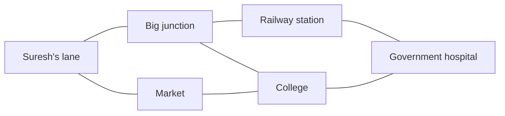

# What a graph is, and where graphs hide

## 1. What this is, and why they ask it

A graph is a set of things, and a set of connections between those things. That is the entire definition.
Two words: **vertices** for the things, **edges** for the connections.

You have been using graphs for weeks without the word. A tree is a graph. A grid is a graph. A linked list
is a graph. What changes today is that the connections stop being tidy — a vertex can have any number of
neighbours, connections can point both ways or only one, and you can walk in a circle and end up where you
started.

They ask about graphs constantly, and almost never by name. The interview question is not "traverse this
graph". It is "given a list of courses and their prerequisites", or "find the shortest sequence of word
changes", or "how many islands are in this grid". **The skill being tested is not traversal. It is
noticing.** Roughly a quarter of medium and hard interview problems are graph problems wearing a costume,
and the candidates who fail them mostly fail before writing any code, by not seeing what the vertices are.

Today is entirely about that. No shortest paths, no cycle detection — those are the next eighteen days. Today
you learn the vocabulary precisely, and you learn to read a problem statement and say out loud: *the vertices
are these, the edges are these, and the edge means this.*

By the end you can classify any graph in four words, spot a graph in a problem that never uses the word, and
say what the two numbers `V` and `E` are for any problem you are handed.

---

## 2. The story

Suresh needs to get to the government hospital on Thursday morning, and there is no bus that goes there.

He has lived in the city for nineteen years and he has never once looked at a route map. What he has instead
is a collection of facts, picked up one at a time, mostly from other people at bus stops.

He knows the 41 goes from the stop outside his lane to the big junction near the flyover, because he takes it
to work. He knows the 7 and the 12 both leave from that junction, because he has stood there and watched
them. He knows the 12 goes towards the railway station, because his brother-in-law takes it. And he knows —
this one from a man at the tea stall about three years ago — that from the railway station there is a bus that
stops right outside the hospital, though he cannot remember its number.

None of these facts is about the hospital and his house together. Each one is a small thing about two places
and how to get between them.

On Wednesday evening he sits on the steps and puts them together. Lane to junction on the 41. Junction to
station on the 12. Station to hospital on whatever that bus is. Three buses, and he has never made that
journey in his life, but he is now fairly confident it exists.

Then he thinks about it a bit more, because three buses with two changes is a lot when you have to be
somewhere by nine. He knows the 7 also leaves the junction, and he has a feeling it goes past the college. He
does not know whether anything runs from the college towards the hospital. That is a gap in what he knows,
not a gap in the city.

So on Thursday he does what he has always done. He gets on the 41, and at the junction he asks a conductor
standing by the 7: "Does this go anywhere near the government hospital?"

The conductor says take the 7 to the college, then the 19 from the gate. Two buses.

Suresh has now added two facts to the collection. The next person who asks him will get a better answer than
the one he gave himself last night.

---

## 3. The idea in plain English

Suresh's collection of facts is a graph. Take it apart carefully, because every word in this section is one
you will use for the next eighteen days.

**The places are the vertices.** A **vertex** is one of the things in your collection — a bus stop, a person, a
city, a course, a web page, a cell in a grid. The word **node** means the same thing and both are used; this
course will say vertex when talking about the structure and node when talking about code. If you have `n`
things, you have `n` vertices, and the count is written `V`.

**The bus connections are the edges.** An **edge** joins two vertices and means "these two are directly
connected". "The 41 runs from the lane to the junction" is one edge. The count of edges is written `E`. Note
that an edge is a fact about exactly two vertices — the hospital is not on any edge with Suresh's lane, which
is precisely why he needed to think.

**A path is a sequence of edges you can follow.** Lane → junction → station → hospital is a **path** of length
three. The whole point of a graph is that a question about two vertices far apart gets answered by stitching
together facts about vertices that are close together. **Almost every graph algorithm you will learn is a way
of doing that stitching.**

**Directed or undirected is the first question you ask.** An **undirected** edge works both ways: if the 41
runs lane-to-junction, it also runs junction-to-lane. A **directed** edge works one way only, and you draw it
with an arrow. One-way streets are directed. "A follows B" on a social network is directed — B does not
necessarily follow A. "A is friends with B" is undirected. Getting this wrong is the single most common
modelling mistake, and it usually produces an answer that is right on the sample input.

**Weighted or unweighted is the second question.** An **unweighted** edge just says "connected". A
**weighted** edge carries a number — a distance, a cost, a time, a fare. Suresh's graph is unweighted while
he is only asking "can I get there", and becomes weighted the moment he starts asking "which way is
cheapest".

**Cyclic or acyclic is the third.** A **cycle** is a path that starts and ends at the same vertex without
reusing an edge. Bus routes are full of cycles. Course prerequisites must not have any — if A requires B and
B requires A, nobody can ever start. A directed graph with no cycles is called a **DAG**, a directed acyclic
graph, and it turns up so often it gets its own name.

**Connected or not is the fourth.** A graph is **connected** if you can get from any vertex to any other. It
is not always. There might be a whole neighbourhood on the other side of the river with its own buses and no
route across, and a program that assumes everything is reachable from wherever it started will silently miss
it. **Assume nothing is connected until the problem says so.**

**The degree of a vertex is how many edges touch it.** The junction has high degree — many buses. Suresh's
lane has degree one. In a directed graph you count separately: **in-degree** is arrows coming in, **out-degree**
is arrows going out. In-degree is the whole idea behind topological sorting, which you meet on
[day 134](../day-134-topological-sort/README.md).

**Dense or sparse decides how you store it.** With `V` vertices, the most edges you can have is about `V²`
(everything connected to everything). A graph near that is **dense**. A graph where `E` is closer to `V` is
**sparse**. Real graphs are almost always sparse — a city has thousands of stops and each one connects to a
handful of others, not to all of them. That single observation decides tomorrow's lesson.

**Now the part that actually matters: where graphs hide.** The problem will not say "graph". It will say one
of these:

| The problem says | The vertices are | The edges are |
|---|---|---|
| "courses and prerequisites" | courses | "must be taken before" (directed) |
| "cities and flights" | cities | flights (directed, weighted by price) |
| "a grid of land and water" | cells | "is adjacent to" (undirected) |
| "words differing by one letter" | words | "one letter apart" (undirected) |
| "people and friendships" | people | friendships (undirected) |
| "tasks and dependencies" | tasks | "depends on" (directed) |
| "states of a puzzle and legal moves" | states | moves (directed) |
| "packages and their requirements" | packages | "requires" (directed) |

**The recognition question, in one line:** *are there things, and pairwise relationships between them, and is
the question about following those relationships?* If yes, it is a graph, whatever the story says.

The two questions to answer out loud before writing a single line: **what is a vertex, and what does an edge
mean?** Say them as full sentences. "A vertex is a course. An edge from A to B means A must be taken before
B." If you cannot finish those two sentences, you do not understand the problem yet, and code will not help.

---

## 4. The picture

Suresh's collection of facts, drawn:



**What to notice.** Nothing in this picture is about "the lane and the hospital". Every line is a fact about
two places that touch. The answer to Suresh's question is a *path* through the picture, and there are three
of them: via the station, via the college, and the long way round through the market. Finding the shortest is
[day 131](../day-131-unweighted-shortest-path/README.md); today it is enough to see that the question has
become "is there a path", and that the picture answers it.

Undirected against directed, on the same four vertices:

```
UNDIRECTED — friendship            DIRECTED — "follows"

    A ---- B                          A ----> B
    |      |                          ^       |
    |      |                          |       v
    C ---- D                          C <---- D

  A can reach D two ways           A -> B -> D -> C -> A
  and D can reach A                but B cannot reach A
                                   except by going all the way round
```

**What to notice.** The same four vertices and the same four connections, and a completely different set of
questions have answers. In the undirected version every vertex reaches every other. In the directed version,
`B` cannot get to `A` in one hop even though `A → B` exists. **Drawing the arrows is not decoration; it
changes the answer.**

And the vocabulary, on one small graph:

```
          (2)
    A ----------- B          V = 5  vertices: A B C D E
    |             |          E = 5  edges
 (7)|             |(1)
    |             |          degree(A) = 2   degree(B) = 3
    C ----------- D          degree(E) = 0
          (3)     |
                  |(4)       path A-B-D-C-A is a CYCLE
                  ...        E is UNREACHABLE from everything
    E                        so this graph is NOT CONNECTED
   (alone)
                             weights in brackets: this is WEIGHTED
```

**What to notice.** `E` sits there with no edges at all, and it is still a vertex. A program that starts at
`A` and walks outwards will never see it. Every graph algorithm you write from now on needs an answer to
"what about the parts I cannot reach from where I started", and the answer is usually a loop over all
vertices on the outside.

---

## 5. The code, built step by step

Today's code is about **modelling** — turning a problem statement into vertices and edges. Tomorrow is about
storage; the day after is about walking. Here you learn to build the thing.

The universal shape is a dictionary from a vertex to its list of neighbours. This is called an **adjacency
list**, and it is what you will use in roughly every graph problem you ever write.

```python
from collections import defaultdict

def build_undirected(edges: list[tuple[str, str]]) -> dict[str, list[str]]:
    """Each edge goes in twice — once in each direction."""
    graph: dict[str, list[str]] = defaultdict(list)
    for a, b in edges:
        graph[a].append(b)
        graph[b].append(a)          # <- this line is the whole difference
    return graph
```

Two appends for an undirected edge, one for a directed edge. That one line is the difference between
"friendship" and "follows", and forgetting it is the most common bug in this entire phase. `defaultdict(list)`
means a vertex with no entry yet gives you an empty list instead of raising, which saves a check on every
access.

Directed is the same function with the second append deleted:

```python
def build_directed(edges: list[tuple[str, str]]) -> dict[str, list[str]]:
    """A -> B only. B does not gain a link back to A."""
    graph: dict[str, list[str]] = defaultdict(list)
    for a, b in edges:
        graph[a].append(b)
    return graph
```

Now the modelling. Here is a grid, which never mentions graphs at all:

```python
def grid_neighbours(grid: list[list[str]], row: int, col: int) -> list[tuple[int, int]]:
    """The vertices are cells; the edges are 'is next to and also land'."""
    rows, cols = len(grid), len(grid[0])
    out = []
    for delta_row, delta_col in ((-1, 0), (1, 0), (0, -1), (0, 1)):
        r, c = row + delta_row, col + delta_col
        if 0 <= r < rows and 0 <= c < cols and grid[r][c] == "1":
            out.append((r, c))
    return out
```

There is no dictionary here and it is still a graph. The vertices are `(row, col)` pairs and the edges are
computed on demand instead of stored. **This is the most important variation in the whole phase**: an
**implicit graph**, where the neighbours are calculated rather than looked up. Grids, puzzle states and word
ladders are all implicit, and if you wait to be handed an edge list you will not recognise them.

Course prerequisites, which is the interview classic:

```python
def build_prerequisites(n: int, pairs: list[list[int]]) -> dict[int, list[int]]:
    """pairs[i] = [course, needs_first]. Edge direction is the whole question."""
    graph: dict[int, list[int]] = {course: [] for course in range(n)}
    for course, needs_first in pairs:
        graph[needs_first].append(course)     # needs_first -> course
    return graph
```

Read that append twice. The input says "to take `course`, first take `needs_first`", and the edge points from
`needs_first` **to** `course`, because the edge means "unlocks" — finish this one and the other becomes
available. You could model it the other way and everything downstream reverses. **Neither is wrong; being
unclear which one you chose is.** Say the direction out loud, in words, before you write the line.

Building the dictionary from `range(n)` instead of `defaultdict` matters here too: a course with no
prerequisites and no dependents must still appear, or your later loop over `graph` will miss it entirely.

Now something to run. The simplest possible question — can I get from here to there — with a queue, which is
tomorrow's and the next day's subject and is included today so you have a working program:

```python
from collections import deque

def reachable(graph: dict[str, list[str]], start: str, goal: str) -> bool:
    seen = {start}
    queue = deque([start])
    while queue:
        current = queue.popleft()
        if current == goal:
            return True
        for neighbour in graph[current]:
            if neighbour not in seen:
                seen.add(neighbour)           # mark on PUSH, not on pop
                queue.append(neighbour)
    return False
```

`seen` is what makes this terminate. Without it, a cycle — and Suresh's bus network is full of them — means
you go round forever. Marking a vertex as seen when you *push* it rather than when you pop it stops the same
vertex being queued twice, which matters more than it looks and is the subject of
[day 127](../day-127-graph-bfs/README.md).

### The complete solution

A small program that builds Suresh's graph, answers his question, and prints the facts about it that this
lesson names.

```python
"""Modelling a problem as a graph: vertices, edges, and the questions they answer."""

from __future__ import annotations

from collections import defaultdict, deque


def build_undirected(edges: list[tuple[str, str]]) -> dict[str, list[str]]:
    graph: dict[str, list[str]] = defaultdict(list)
    for a, b in edges:
        graph[a].append(b)
        graph[b].append(a)
    return graph


def reachable(graph: dict[str, list[str]], start: str, goal: str) -> bool:
    """Is there any path from start to goal?"""
    if start not in graph or goal not in graph:
        return False
    seen = {start}
    queue = deque([start])
    while queue:
        current = queue.popleft()
        if current == goal:
            return True
        for neighbour in graph[current]:
            if neighbour not in seen:
                seen.add(neighbour)
                queue.append(neighbour)
    return False


def components(graph: dict[str, list[str]]) -> list[list[str]]:
    """The separate pieces. A graph is not always one piece."""
    seen: set[str] = set()
    pieces: list[list[str]] = []
    for vertex in graph:                       # the OUTER loop over all vertices
        if vertex in seen:
            continue
        piece, queue = [], deque([vertex])
        seen.add(vertex)
        while queue:
            current = queue.popleft()
            piece.append(current)
            for neighbour in graph[current]:
                if neighbour not in seen:
                    seen.add(neighbour)
                    queue.append(neighbour)
        pieces.append(sorted(piece))
    return pieces


def describe(graph: dict[str, list[str]]) -> None:
    vertices = len(graph)
    half_edges = sum(len(neighbours) for neighbours in graph.values())
    edges = half_edges // 2                    # each undirected edge counted twice
    densest = vertices * (vertices - 1) // 2
    print(f"V = {vertices}, E = {edges}, max possible E = {densest}")
    print(f"density = {edges / densest:.2%}  ->  {'dense' if edges > densest / 2 else 'sparse'}")
    for vertex in sorted(graph):
        print(f"  degree({vertex}) = {len(graph[vertex])}")


if __name__ == "__main__":
    bus_routes = [
        ("lane", "junction"),
        ("junction", "station"),
        ("junction", "college"),
        ("station", "hospital"),
        ("college", "hospital"),
        ("lane", "market"),
        ("market", "college"),
        ("depot", "workshop"),        # a separate piece, across the river
    ]
    city = build_undirected(bus_routes)

    describe(city)
    print("lane -> hospital:", reachable(city, "lane", "hospital"))
    print("lane -> workshop:", reachable(city, "lane", "workshop"))
    print("pieces:", components(city))
```

Running it:

```
V = 8, E = 8, max possible E = 28
density = 28.57%  ->  sparse
  degree(college) = 3
  degree(depot) = 1
  degree(hospital) = 2
  degree(junction) = 3
  degree(lane) = 2
  degree(market) = 2
  degree(station) = 2
  degree(workshop) = 1
lane -> hospital: True
lane -> workshop: False
pieces: [['college', 'hospital', 'junction', 'lane', 'market', 'station'], ['depot', 'workshop']]
```

Look at the last two lines. `lane -> workshop` is `False`, and the graph has **two** pieces. The depot exists,
it has a bus, and no amount of walking from Suresh's lane will ever find it. Every function you write from
here needs to have decided what it does about that.

---

## 6. What it costs

Graph costs are written in terms of two numbers, and you must state both.

```
V = the number of vertices
E = the number of edges
```

**How big can `E` be?** For an undirected graph with no repeated edges and no self-loops:

```
every pair of vertices, once      V x (V - 1) / 2
V = 1,000                         1,000 x 999 / 2 = 499,500
```

For a directed graph it is `V × (V − 1)`, twice as many, because each pair can have an arrow each way.

**How big is `E` in practice?** Almost always far smaller. Three real examples:

```
city bus network      V = 5,000 stops    E ~ 15,000     E / V = 3
Facebook friendships  V = 3e9 people     E ~ 5e11       E / V ~ 170
web pages and links   V = 5e10 pages     E ~ 1.5e12     E / V ~ 30
```

In each case `E` is a small multiple of `V`, not `V²`. `E ≈ 3 × V` versus `E ≈ 500,000` for a
thousand-vertex graph is a factor of well over a hundred, and it is the reason the next lesson exists.

**A graph is sparse when `E` is close to `V` and dense when `E` is close to `V²`.** The rough dividing line
people use is `E ≈ V log V`. Assume sparse unless told otherwise; you will be right nearly every time.

**Building the adjacency list.**

```
loop over E edges, two appends each   O(E)
plus initialising V empty lists       O(V)
                                      -> O(V + E) time and space
```

**`O(V + E)` is the phrase you will say more than any other in this phase.** It means "look at every vertex
once and every edge once", and it is the cost of every basic traversal. Note that it is a *sum*, not a
product — a graph with a million vertices and three million edges is four million units of work, not three
trillion.

Count it out on the `reachable` function:

```
each vertex is pushed at most once           V pushes
each vertex is popped at most once           V pops
for each popped vertex, scan its neighbours  sum of all degrees = 2E
                                             -----------------------
total                                        V + 2E steps -> O(V + E)
```

The `2E` is because each undirected edge appears in two adjacency lists. That factor of two is real work and
it disappears into the big-O, which is fine, but say "each edge is examined twice, once from each end" if
asked to be precise.

**Space.**

```
adjacency list      V lists + 2E entries      -> O(V + E)
the seen set        at most V entries         -> O(V)
the queue           at most V entries         -> O(V)
```

Put numbers on it for a concrete case — a social graph of a million users averaging 200 friends:

```
V = 1,000,000
E = 1,000,000 x 200 / 2 = 100,000,000 edges
adjacency entries = 2E = 200,000,000
at 8 bytes per integer reference = 1.6 GB
plus 1,000,000 list objects at ~56 bytes = 56 MB
```

**1.6 GB for the edges and 56 MB for the vertices.** The edges are the memory. That ratio holds almost
everywhere and it is why "can you fit the graph in memory" is a question about `E`, never about `V`.

---

## 7. The traps

### The undirected edge added once

The near-miss, and by a wide margin the most common bug in the phase:

```python
for a, b in edges:
    graph[a].append(b)
    # graph[b].append(a)   <- forgotten
```

The symptom is not a crash. It is an answer that is right on the sample and wrong on the real input:

```
>>> city = build_undirected([("lane","junction"), ("junction","hospital")])
>>> reachable(city, "lane", "hospital")
True
>>> reachable(city, "hospital", "lane")
False
```

Reachability that works one way and not the other, in a network of buses that obviously run both ways.
**Before writing the loop, say out loud: "an edge here means A and B are connected in both directions" or "an
edge here means A comes before B".** Then write the one or two appends that sentence demands.

### The vertex with no edges

```python
graph = defaultdict(list)
for a, b in edges:
    ...
for vertex in graph:      # only vertices that appeared in some edge
    ...
```

A vertex mentioned in no edge never gets a key, so the loop skips it entirely. On "count the connected pieces
among 6 people, with these 2 friendships", the four people with no friends are four separate pieces and this
code reports two:

```
>>> components(build_undirected([("a","b"), ("c","d")]))
[['a', 'b'], ['c', 'd']]          # where are e and f?
```

Fix it by initialising every vertex up front — `{v: [] for v in range(n)}` — whenever the problem gives you a
vertex count. This is why the prerequisites builder above does exactly that.

### Assuming the graph is connected

```python
def visit_everything(graph, start):
    # BFS from start
    ...
```

Correct only if everything is reachable from `start`, which the problem must have promised. If it did not, you
need the outer loop over all vertices that `components` has. The symptom is an undercount that nothing about
the sample input reveals — sample graphs are almost always connected, and real ones are almost never.

### The graph with a cycle and no `seen` set

```python
def walk(graph, current):
    for neighbour in graph[current]:
        walk(graph, neighbour)          # no visited check
```

```
Traceback (most recent call last):
  File "graph.py", line 12, in walk
    walk(graph, neighbour)
  [Previous line repeated 996 more times]
RecursionError: maximum recursion depth exceeded
```

A tree has no cycles, so tree traversals never needed this. A graph is not a tree. **Every graph traversal
needs a `seen` set, without exception**, and forgetting it is the difference between the two structures made
concrete.

### Self-loops and repeated edges

An edge from a vertex to itself, or the same pair listed twice:

```python
edges = [("a", "a"), ("a", "b"), ("a", "b")]
```

Neither is an error, and both change your counts. `degree("a")` becomes 5. Your `E` count is wrong. A cycle
detector may report a cycle that is just a self-loop. The problem statement usually promises neither exists —
**read that line, and if it is not there, ask.**

### The off-by-one on vertex labels

Problems label vertices `0..n-1` or `1..n`, and they switch between the two without warning. Building a list
of size `n` for `1..n` labels gives you:

```
Traceback (most recent call last):
  File "graph.py", line 8, in build
    graph[a].append(b)
IndexError: list index out of range
```

The cheap defence is a dictionary rather than a list, which does not care what the labels are. The cheaper
defence is to read the constraints line before writing the loop.

---

## 8. In the interview

### How it gets asked

Nobody says "graph". These do:

- *"Given `n` courses and a list of prerequisite pairs, can all courses be finished?"*
- *"Given a grid of 1s and 0s, count the islands."*
- *"Given a start word, an end word and a dictionary, find the shortest transformation sequence."*
- *"Given flight routes and prices, find the cheapest way from A to B with at most one stop."*
- *"You have a list of accounts with email addresses. Merge the ones belonging to the same person."*
- *"Given a list of packages and what each requires, in what order do you install them?"*

And directly, usually as an opener before the real question:

- *"Is this a graph problem? What are the vertices and edges?"*

### The first ninety seconds

> "Let me name the model before I write anything, because everything else follows from it.
>
> A vertex is a course. An edge from A to B means A must be finished before B can be started — so it is
> **directed**, and I would say that explicitly, because if I get the direction wrong every later step
> inverts. It is **unweighted**, because the question is about order and not about cost. And the whole
> question is whether it contains a **cycle**, because a cycle means a set of courses that each wait for
> another and none can ever start.
>
> Two things I would check before coding. First, is the graph guaranteed connected? Usually not — there can be
> courses with no prerequisites at all and no dependents, and any loop I write has to be over every vertex,
> not only the ones reachable from where I happened to start. Second, are the vertices labelled from zero or
> from one, and can a pair repeat?
>
> For storage I would use an adjacency list — a dictionary from a course to the list of courses it unlocks.
> With `n` courses and `m` prerequisite pairs that is `O(n + m)` memory, and every traversal over it is
> `O(n + m)` time. I would not use a matrix here: the graph is sparse, most courses have one or two
> prerequisites, and a matrix would be `n²` for almost entirely empty cells.
>
> Shall I write the cycle check, or would you like me to talk through the ordering version first?"

### The follow-ups

**"Why is this a graph and not just a list of pairs?"**

> "Because the question is about following the relationships, not about the relationships themselves.
> Any individual pair is easy — 'does A come before B' is a lookup. The question being asked is 'is there a
> chain', and a chain is a path. The moment the answer requires stitching together facts about different
> pairs, you are in a graph whether you call it one or not.
>
> The practical test I use is: does the answer to the question involve anything I was not told directly? If
> the input says A→B and B→C, and I need to know about A and C, that gap is exactly what a graph algorithm
> fills."

**"How do you decide the edge direction?"**

> "By writing the meaning as an English sentence first, and only then translating it. 'To take course A, you
> must first take B' becomes either 'B unlocks A' or 'A depends on B', and those give opposite adjacency
> lists.
>
> I pick based on what I am going to traverse. If I want to walk forward from the courses I can start now to
> the ones they unlock, I store `unlocks`. If I want to walk backwards from a goal to what it needs, I store
> `depends on`. For topological sorting I want `unlocks` plus a count of incoming dependencies, so that is what
> I build.
>
> The cost of getting it wrong is not a crash — it is an answer that is confidently backwards. So I say the
> sentence out loud, and on a sample of two courses I check by hand which list is populated."

**"The grid one — where is the graph in a grid?"**

> "The vertices are cells and the edges are 'is orthogonally adjacent to'. It is undirected, unweighted, and
> the edges are not stored anywhere — they are computed from the coordinates. That is an **implicit** graph,
> and it is worth naming because it is the form people fail to recognise.
>
> The consequence is that I never build an adjacency list. I write a neighbour function that takes `(row,
> col)` and yields the valid neighbours, and every algorithm from BFS onwards works unchanged against it.
> `V` is `rows × cols` and `E` is at most `2 × rows × cols`, since each cell has at most four neighbours and
> each edge is shared — so `O(V + E)` is just `O(rows × cols)`.
>
> The same shape covers puzzle states, where a vertex is a board position and an edge is a legal move, and
> word ladders, where a vertex is a word and an edge is 'differs by one letter'. In all three, listing the
> edges up front would be enormous and computing them is trivial."

**"When is the graph too big to fit in memory?"**

> "That is a question about `E`, not `V`. On a million users with 200 friends each, `V` is a million and `E`
> is a hundred million, so the adjacency entries are two hundred million references — about 1.6 gigabytes —
> against 56 megabytes for the vertex objects. The edges are the memory, always.
>
> Three moves when it does not fit. Do not materialise it: keep it implicit and compute neighbours from
> whatever store already holds the relationships. Partition it: shard by vertex and accept that a traversal
> now crosses machines, which changes the algorithm rather than just the storage. Or compress it: for a
> static graph, a compressed sparse row layout gets a hundred million edges into two flat arrays with almost
> no overhead, which is often a five-to-ten-times saving over Python lists.
>
> I would also ask whether I need the whole graph. Most real questions touch a neighbourhood, not everything,
> and a bounded-depth traversal from a start vertex never has to see the rest."

### The model answer

*"Here is a list of accounts. Each has a name and some email addresses. Two accounts belong to the same
person if they share any email. Merge them."*

> "Let me build the model out loud first, because this problem is entirely a modelling problem — the
> traversal at the end is four lines.
>
> **The instinct is to make accounts the vertices,** with an edge between two accounts that share an email.
> That is correct and it is expensive: to find those edges I have to compare every account against every
> other, which is `n²` comparisons, and with a hundred thousand accounts that is five billion.
>
> **So I make the emails vertices too.** A vertex is either an account or an email address. An edge joins an
> account to each of its emails — undirected, unweighted. Now two accounts that share an email are connected
> through that email vertex, in two hops, and I never compared any pair of accounts directly. Building it is
> one pass over the input: `O(total emails)`.
>
> **That is the whole trick, and it is worth stating as a general one:** when a relationship between two
> things is 'they share a property', make the property a vertex. It turns a quadratic edge-building step into
> a linear one. The same move works for 'employees who worked on a shared project' or 'films with a shared
> actor'.
>
> **Then the question becomes connected components.** Each piece of the graph is one person; the emails in
> that piece are their addresses, and the name is on any account vertex in it. A traversal from every
> unvisited vertex gives me the pieces in `O(V + E)`.
>
> **Two things I would be careful about.** The graph is definitely not connected — it is supposed to have many
> pieces, one per person — so the loop is over every vertex, not from one start. And two different people can
> share a name, so I must never merge on the name; the name is data carried along, not part of the model.
> That is the trap the problem is actually setting.
>
> **Numbers.** A hundred thousand accounts averaging three emails: `V` is 100,000 accounts plus up to 300,000
> emails, so 400,000 vertices, and `E` is 300,000 account-email pairs, stored twice, so 600,000 entries.
> Around 5 megabytes and one linear pass, against five billion comparisons for the naive version.
>
> **Union-Find would also solve this** and is arguably the more natural fit for 'merge groups' — I meet it on
> a later day. Either is a good answer; what makes the answer good is putting emails in the graph, and I would
> say that first whichever traversal I then used."

---

## 9. Recall card

**A graph is things plus pairwise connections.** Vertices and edges. `V` and `E`, and you state both.

**Four questions, always, before any code:** directed or undirected? weighted or unweighted? can it have
cycles? is it connected? Getting the first one wrong gives a confidently backwards answer, not a crash.

**Say two sentences out loud before writing a line:** "A vertex is ___. An edge from A to B means ___." If
you cannot finish them, you do not understand the problem yet.

**Graphs hide** in grids (cells and adjacency), prerequisites, word ladders, puzzle states and shared
properties. An **implicit** graph computes its neighbours instead of storing them — that is the form people
fail to spot.

**Every traversal is `O(V + E)` — a sum, not a product** — and every one needs a `seen` set, because unlike a
tree, a graph has cycles. `E` is the memory, not `V`.
