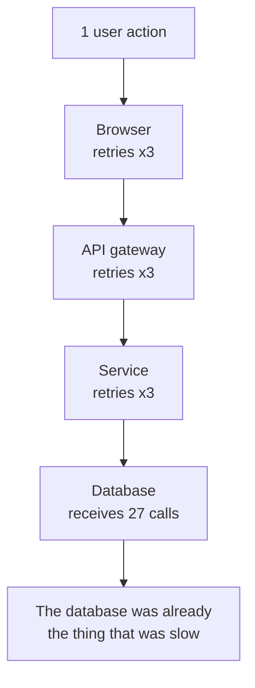
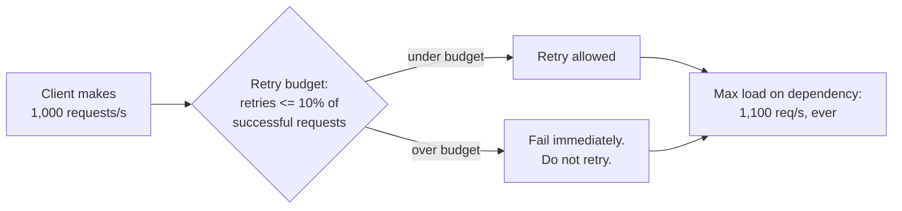

# Retries, backoff, and thundering herds

## 1. What this is, and why they ask it

A retry is the most obvious thing in distributed systems and one of the most dangerous. When a call fails,
you try again. Everyone writes that. Almost nobody writes it correctly, and the incorrect version is how a
small problem becomes an outage.

The mechanism is simple. A dependency slows down. Every caller times out and retries. Now the dependency is
receiving three times the traffic while already struggling, so more calls time out, so more retries happen.
The load that killed it was generated by the clients trying to recover from it. This is called
**retry amplification**, and its close relative — everybody doing the same thing at the same instant — is a
**thundering herd**.

They ask this because it is the most common cause of a self-inflicted outage in real systems, and because the
answer has a specific, memorable shape: exponential backoff with **jitter**, plus a **retry budget**. The
candidates who name jitter unprompted have almost always operated something. It also builds directly on
[day 122](../day-122-autocomplete/README.md) — retrying is only safe at all if the operation is idempotent —
and on [day 124](../day-124-tries-revision/README.md), because a retry is what you do about a suspected
failure.

By the end of this lesson you can write a retry policy with numbers in it, compute the amplification factor
for a layered system, explain why randomness is the essential ingredient rather than a nicety, and name the
three situations where the correct number of retries is zero.

---

## 2. The story

The power goes at twenty past nine on a Saturday morning, which is the worst possible time, and Anwar's phone
starts ringing about four minutes later.

He is the caretaker for a building of twenty-four flats. It is an old building, and the power comes and goes,
and mostly what he does about it is wait. The line comes back on its own, usually within the hour.

At twenty to ten it comes back. He hears the corridor light click on and the lift start up, and he is halfway
out of his chair to go and check the pump when everything goes off again.

He knows exactly what happened, because it has happened perhaps forty times in eleven years, and it took him
about six of those years to work out.

When the power went, nobody switched anything off. Every fridge in twenty-four flats stayed on. Every water
heater stayed on. Both the lift motors, the corridor lights, the water pump, four air conditioners on the
upper floors and whatever else. They all just stopped, still switched on, waiting.

So when the line came back, all of it started at once. Twenty-four fridges, all with warm insides, all
pulling hard. Two lift motors. The pump. Everything at the same instant, drawing far more than any of them
draws when it is just running along. And the main fuse, which is quite happy carrying the building all day,
saw that and went.

What Anwar does now takes twenty minutes and he does it in the dark with a torch.

He goes down to the meter room and pulls the main switches for the whole building. Then he waits for the line
to come back — and when it does, nothing happens, because he has turned everything off. Then he brings it
back in pieces. The corridor and the pump first. Two minutes. Then the first four flats. Two minutes. Then
the next four. All the way up.

Nobody has ever thanked him for it, because from inside a flat it just looks like the power came back a bit
slowly. What it looks like from the meter room is a fuse that stops blowing.

The one thing he has never managed to fix is the phone. When the power goes, twenty-four people call him
within about five minutes, and there is nothing he can do about any of it. He answers the first three and
puts it on silent.

---

## 3. The idea in plain English

Anwar's building is a thundering herd, and his fix is the whole lesson.

**A retry is trying again after a failure.** Straightforward, and correct in one specific circumstance: the
failure was **transient**, meaning the same call would probably succeed now. A dropped packet, a brief
network blip, a moment of overload. Retrying a transient failure is right.

**Retrying a non-transient failure is pure waste.** If the request was malformed, or the caller is not
authorised, or the record does not exist, then trying again produces the same failure, three times as
expensively. **Retry `503 Service Unavailable` and `429 Too Many Requests`. Never retry `400`, `401`, `403`
or `404`.** That single rule removes a surprising amount of pointless load.

**And a timeout is the ambiguous case.** From [day 122](../day-122-autocomplete/README.md) you know a timeout
does not mean the work did not happen. So retrying a timeout is only safe if the operation is idempotent. If
it is not, a retry can charge a card twice. **Idempotency is a prerequisite for retrying, not an optional
extra.**

**Retry amplification is why a small problem becomes a big one.** Every caller retrying three times means the
struggling service now receives three times the traffic. It was already failing at one times. This is
Anwar's fridges: the load that blew the fuse is not the building's normal load, it is everything arriving
together.

**And it multiplies through layers.** If the browser retries three times, and the gateway it calls retries
three times, and the service behind that retries three times, one user action can become twenty-seven calls
to the bottom of the stack. Nobody designed that. Each layer made a locally sensible decision.

**Backoff is waiting longer between attempts.** Instead of retrying immediately, wait one second, then two,
then four, then eight. Doubling each time is **exponential backoff**, and it does two useful things: it gives
the struggling service room to recover, and it thins out the retry traffic instead of concentrating it.

**But backoff alone does not fix the herd, and this is the part people miss.** If a thousand clients all fail
at the same instant — because the service went down at that instant — then they all wait exactly one second
and all retry at exactly the same moment. Then they all wait two seconds and retry together again. Backoff
has made the spikes further apart, but each spike is just as sharp. Anwar's fridges are all waiting the same
amount of time.

**Jitter is randomness added to the wait, and it is the essential ingredient.** Instead of waiting exactly
four seconds, wait a random amount between zero and four. Now a thousand clients spread themselves over a
four-second window instead of arriving in one instant. The peak load drops by a factor of the window width.
This is Anwar bringing the flats back four at a time, two minutes apart — except that randomness does it
without a caretaker.

**A retry budget caps the whole thing.** Rather than "each request may retry three times", say "retries may
not exceed ten percent of total requests". When everything is healthy, ten percent is plenty and nobody
notices. When everything is failing, retries are capped at ten percent extra load rather than three hundred
percent, and the service gets a chance to recover. **This is the single most effective control**, because it
bounds the amplification no matter how many layers there are.

**Retry at one layer, not at every layer.** Somebody has to decide where. The usual answer is: retry at the
edge closest to the user, where you know the whole operation, and let the inner layers fail fast and report
upward. Layers that all retry independently multiply.

**And the herd has a second form, which is not about failures at all.** When a cache entry expires and a
thousand requests all miss at the same moment, they all go to the database together. When a deploy restarts
two hundred instances at once, they all open connections together. When ten thousand devices are told to
poll "every hour on the hour", they all arrive on the hour. **Anything that synchronises independent clients
creates a herd**, and the fix is always the same: add randomness.

---

## 4. The picture

The amplification, drawn:



**What to notice.** No layer did anything unreasonable. Three retries is a normal setting. The 27 is emergent,
and nobody owns it, which is why it survives code review.

Now the herd, and what jitter does to it:

```
NO BACKOFF — 1,000 clients fail at t=0, retry immediately

  requests
  per 100ms
   1000 |####
        |####
      0 |####________________________________________
        0   0.5   1.0   1.5   2.0   2.5   3.0   3.5  s
        every retry lands in the same instant


EXPONENTIAL BACKOFF, NO JITTER — wait 1s, 2s, 4s

   1000 |    ####            ####                    ####
        |    ####            ####                    ####
      0 |____####____________####____________________####
        0   1.0             2.0                     4.0   s
        three sharp spikes instead of one. Same height.


EXPONENTIAL BACKOFF WITH FULL JITTER — wait random(0, cap)

    100 |    ##  ## # ## ### ## # ### # ## ## # ### #
        |    ## ### # ## ### ## # ### # ## ## # ### #
      0 |____#######################################____
        0   1.0             2.0                     4.0   s
        same total work, spread over the window.
        PEAK LOAD IS 10x LOWER.
```

**What to notice.** The middle picture is the one that catches people. Exponential backoff, applied correctly,
still produces a full-height spike — it just produces fewer of them. The height of the spike is what kills the
service, and only the randomness reduces the height. **Backoff spaces the herd out in time; jitter breaks the
herd up.**

And the retry budget, which is the control that does not depend on tuning:



**What to notice.** The budget is a property of the client as a whole, not of a single request. That is what
makes it work: no individual request can push total load past 110%, however many retries its own policy would
have allowed.

---

## 5. How it actually works

### The four backoff strategies, in order of how bad they are

```python
import random

# 1. Immediate retry. Never do this against a shared dependency.
delay = 0

# 2. Fixed delay. Better, but a thousand clients still arrive together.
delay = 1.0

# 3. Exponential backoff. Spikes are further apart, still full height.
delay = min(base * 2 ** attempt, cap)

# 4. Exponential backoff with FULL JITTER. This is the answer.
delay = random.uniform(0, min(base * 2 ** attempt, cap))
```

AWS published the definitive comparison of these in 2015 (the "Exponential Backoff and Jitter" article) and
the result surprised people: **full jitter — a uniform random value between zero and the computed cap — beat
every cleverer scheme they tested**, on both total completion time and load on the server. Not half the cap
plus jitter, not a small random nudge. The full range.

The "decorrelated jitter" variant, `delay = min(cap, random.uniform(base, previous_delay * 3))`, performed
comparably and recovers slightly faster. Either is a good answer; full jitter is easier to explain and is
what the AWS SDKs implement.

### A retry policy with real numbers

```python
import random
import time

def call_with_retry(operation, *, attempts: int = 3, base: float = 0.1, cap: float = 5.0):
    """Retry a transient failure with exponential backoff and full jitter."""
    for attempt in range(attempts):
        try:
            return operation()
        except Transient as error:                 # 429, 503, timeout — NOT 4xx
            if attempt == attempts - 1:
                raise
            delay = random.uniform(0, min(cap, base * 2 ** attempt))
            time.sleep(delay)
```

Four numbers, and each of them is a decision you should be able to defend:

- **`attempts = 3`.** Total attempts, not additional ones — be precise about which you mean, because "3
  retries" and "3 attempts" differ by 33% of load. Three is the usual answer because the marginal success
  rate of a fourth attempt is tiny.
- **`base = 100 ms`.** Roughly the service's p50 latency. Shorter and you retry before the first attempt could
  plausibly have succeeded.
- **`cap = 5 s`.** The point beyond which waiting is pointless because the caller has given up anyway.
- **The exception filter.** Retry timeouts, connection errors, `429`, `502`, `503`, `504`. Do not retry
  `400`, `401`, `403`, `404`, `409`, `422`. This filter removes more useless load than any tuning.

And the constraint that governs everything: **the total time across all attempts must fit inside the caller's
own timeout.** If the caller gives up after 2 seconds and your policy can sleep for 5, your last two attempts
are running for nobody.

### Retry budgets, and where they actually exist

Google's SRE book describes a per-client retry budget: retries may not exceed a fixed percentage — they use
10% — of the request rate. Envoy implements this directly:

```yaml
retry_policy:
  retry_on: "5xx,reset,connect-failure"
  num_retries: 2
  retry_budget:
    budget_percent: 20
    min_retry_concurrency: 3
```

gRPC's built-in retry support has the same idea as `retryThrottling`, with a token bucket: each failed attempt
costs a token, each success adds a fraction of one back, and when the bucket is empty retries stop entirely
until things recover. Finagle at Twitter pioneered this and reported it as one of their highest-impact
reliability changes.

**Why the budget beats tuning `num_retries`:** it degrades gracefully. Under normal conditions the budget is
never hit and every request gets its retries. Under a broad failure the budget clamps total load at 110% or
120% instead of 300%, automatically, with no operator involved.

### The other herds, and their fixes

**Cache stampede.** A popular key expires; a thousand concurrent requests all miss and all hit the database.
Three fixes, in increasing order of effort:

- **Jittered TTL.** Set expiry to `600 + random(0, 60)` seconds instead of exactly 600, so a million keys
  written together do not expire together.
- **Request coalescing** (also called single-flight). The first miss takes a lock and fetches; the others
  wait for its result. Go's `singleflight` package and Python's per-key locks do exactly this. One database
  query instead of a thousand.
- **Probabilistic early refresh.** As a key approaches expiry, each request has a small and growing chance of
  refreshing it early, so the refresh happens once, before the stampede, without a lock.

**Restart herd.** Two hundred instances restart after a deploy and all open database connections and warm
their caches simultaneously. Fix: staggered rollout — which is what a Kubernetes rolling update with
`maxSurge`/`maxUnavailable` already gives you — plus randomised startup delay.

**Cron herd.** Ten thousand devices told to sync "at midnight" all sync at midnight. Fix: hash the device ID
into the schedule so each device gets its own minute. `sync_minute = hash(device_id) % 60`. This is one line
and it converts a spike into a flat line.

**Reconnect herd.** A load balancer restarts and a hundred thousand WebSocket clients all reconnect at once —
this is the one that most often takes down the replacement. Fix: jittered reconnect on the client, and it must
be built into the client from day one because you cannot deploy a fix to disconnected clients.

### What retries look like when they are not yours

An important practical note: your retry policy is not the only one. The HTTP client library retries. The load
balancer retries. The SDK retries. The service mesh retries. Envoy will happily retry on top of your
application's retries and neither knows about the other.

The discipline is to **retry at exactly one layer and configure every other layer to zero.** Usually that
layer is the one that owns the user-facing timeout, because it is the only one that knows how much time is
left.

---

## 6. The numbers

**Amplification through layers.** Each layer's multiplier compounds:

```
browser         3 attempts
gateway         3 attempts
service         3 attempts
                -----------
3 x 3 x 3     = 27 calls to the database for one user action
```

At 1,000 user actions per second during an incident:

```
1,000 x 27    = 27,000 requests per second
                at a database that fell over at 1,200
```

**Two layers instead of three, with 2 attempts each:**

```
2 x 2         = 4x amplification instead of 27x
1,000 x 4     = 4,000 requests per second
```

Just removing a layer's retries and dropping to two attempts is a **7× reduction**, before any backoff.

**What jitter does to the peak.** A thousand clients fail simultaneously and retry at a computed delay of
4 seconds:

```
no jitter    all 1,000 arrive within ~10 ms
             peak = 1,000 / 0.01 s = 100,000 requests per second

full jitter  1,000 spread uniformly over 0-4 s
             peak = 1,000 / 4 s    = 250 requests per second
```

**A four-hundred-fold reduction in peak load, from one call to `random.uniform`.** This is the number to
quote; it is what makes jitter sound essential rather than fussy.

**Retry budget, sized.** A client doing 1,000 requests per second with a 10% budget:

```
normal:   1% of requests fail, all retried
          10 retries/s, budget is 100/s      -> never hit, full protection

incident: 100% of requests fail
          without budget: 3,000 retries/s     -> 4,000 total, 4x load
          with budget:      100 retries/s     -> 1,100 total, 1.1x load
```

**The dependency sees 1.1× instead of 4× at the exact moment it can least afford it.**

**Cache stampede, sized.** A key served 10,000 times a second with a 10-minute TTL:

```
without coalescing, on expiry:
  concurrent misses in the ~50 ms it takes to refill
  10,000/s x 0.05 s = 500 simultaneous database queries
  against a database sized for maybe 50 concurrent queries

with coalescing:  1 query. The other 499 wait ~50 ms.
```

**When does the extra latency of backoff hurt?** Full jitter's expected wait is half the cap:

```
attempt 1 fails, cap = 100 ms  -> mean wait 50 ms
attempt 2 fails, cap = 200 ms  -> mean wait 100 ms
attempt 3 succeeds
total added latency: ~150 ms on top of three call durations
```

If the p50 of the underlying call is 20 ms, a request that needed three attempts took roughly 210 ms instead
of 20. That is the cost, and it is paid only by the small fraction of requests that fail — which is exactly
why you look at p99 latency and not the mean when tuning this.

**How much do retries actually help?** With independent 1% failures:

```
1 attempt   99% success
2 attempts  1 - 0.01^2 = 99.99%
3 attempts  1 - 0.01^3 = 99.9999%
4 attempts  1 - 0.01^4 = 99.999999%
```

The third attempt takes you from four nines to six. The fourth adds two more nines that nobody will ever
measure, and costs 33% more load in an incident. **That is the argument for three, and it is a real
argument, not a convention.** It also collapses entirely when failures are *not* independent — when the
dependency is down, all attempts fail together and no number of retries helps at all.

---

## 7. The trade-offs

**Every retry is load you chose to add, at the worst possible moment.** The service you are retrying is, by
definition, the service that just failed. Retries make transient failures invisible and make sustained
failures worse. That asymmetry is the whole design problem, and the budget is the tool that resolves it,
because it lets you have the first behaviour without the second.

**Backoff trades latency for load.** Each additional attempt adds its own wait plus the call duration to the
requests that need it. If you are behind a user-facing 2-second timeout, you cannot afford three attempts
with a 5-second cap; the arithmetic has to close. When it does not, the honest answer is fewer attempts, not
a shorter cap that retries before recovery is plausible.

**Retrying is unsafe unless the operation is idempotent.** This is not a trade-off, it is a precondition. If
the operation is not idempotent and you cannot make it so with an idempotency key, the correct number of
retries is zero, and you say that rather than hoping.

**Retry at one layer, and pick the outermost one that knows the whole operation.** Retrying at every layer
multiplies. Retrying too deep means the inner layer burns the caller's remaining time budget on an operation
the caller may already have abandoned. Retrying at the edge costs a full round trip per attempt, which is
more expensive per attempt but bounded and visible.

**Jitter costs you determinism.** Two identical failures now behave differently, which makes tests flaky and
incident timelines harder to read. Accept it; the alternative is a synchronised herd. Log the actual delay
chosen so the timeline is reconstructable afterwards.

**Circuit breakers do what retries cannot.** A retry policy still sends every request at a dead dependency,
just more slowly. A circuit breaker stops sending entirely after a failure threshold and probes occasionally
to see if it has recovered. Retries handle the transient case; breakers handle the sustained one, and you
want both — which is [day 126](../day-126-graph-representation/README.md).

**When is the right number of retries zero?** Three cases, and naming them is worth marks. When the operation
is not idempotent and cannot be made so. When the failure is a client error — retrying a `400` is pure waste.
And when the caller has no time left, because a retry that lands after the user has gone is load with no
possible benefit.

---

## 8. In the interview

### How it gets asked

- *"Everything retried at once and the service died. What went wrong?"* — the direct version.
- *"How would you implement retries?"* — and the answer is judged on whether you say jitter.
- *"A popular cache key expired and the database fell over. Explain."* — cache stampede.
- *"You deployed and every instance restarted at once. What happens to the database?"*
- *"How many times would you retry, and how do you pick the number?"*
- *"Ten million devices need to check in hourly. Design that."* — the cron herd, and it is a one-line answer
  if you see it.

### The first ninety seconds

> "The failure mode here is that the retries generated the load that killed it. A dependency slows down, every
> caller times out and retries, and now it is receiving three times the traffic while already struggling. That
> is retry amplification, and it compounds through layers — browser retries three times, gateway retries three
> times, service retries three times, and one user action becomes twenty-seven calls to the thing that was
> already the bottleneck. Nobody designed the twenty-seven; each layer made a locally reasonable choice.
>
> Three fixes, and I would apply all three.
>
> First, exponential backoff with **full jitter** — a delay chosen uniformly at random between zero and the
> computed cap. The jitter is the essential part and the part people leave out. Plain exponential backoff
> still has a thousand clients waiting exactly one second and arriving in the same instant; it makes the
> spikes further apart without making them shorter. Full jitter spreads a thousand clients over a four-second
> window, which drops peak load by a factor of several hundred for one line of code. AWS published the
> comparison and full jitter beat every cleverer scheme.
>
> Second, a **retry budget**: retries may not exceed about ten percent of the request rate for that client.
> That is the control I would fight for, because it bounds amplification regardless of how many layers there
> are. Healthy, it never binds. In an incident it clamps the dependency's extra load at ten percent instead of
> three hundred.
>
> Third, **retry at exactly one layer** and set every other layer to zero attempts. Usually the layer that
> owns the user-facing timeout, because it is the only one that knows how much time is left.
>
> And the precondition before any of it: retries are only safe if the operation is idempotent, because a
> timeout does not tell me the work did not happen.
>
> Do you want me to go into the cache stampede version of this, or the circuit breaker?"

### The follow-ups

**"Why is jitter so important? Backoff already spreads them out."**

> "Backoff spreads them out in *time*; it does not make each spike smaller. If a thousand clients all fail at
> the same instant — which is what happens when a service goes down, they do not fail at random times — then
> they all compute a one-second delay and all retry one second later, together. Then two seconds later,
> together. You have turned one spike into three spikes of the same height, and the height is what kills the
> service.
>
> The arithmetic makes it concrete. A thousand clients arriving within ten milliseconds is a peak of a hundred
> thousand requests a second. The same thousand spread uniformly over four seconds is two hundred and fifty a
> second. Four hundred times lower peak, from one call to a random number generator.
>
> The counter-intuitive part, which AWS measured, is that *full* jitter wins — random between zero and the
> cap, not a small nudge around the cap. It also finishes the whole retry sequence faster on average, because
> some clients get through early and stop competing."

**"How do you choose the number of attempts?"**

> "From how much the marginal attempt buys, against what it costs in an incident. With independent one
> percent failures, one attempt is 99%, two is 99.99%, three is six nines. The fourth adds two more nines
> nobody will ever measure and costs thirty-three percent more load exactly when the dependency is dying.
> That is why three, and it is an argument rather than a convention.
>
> Then the constraint that usually decides it anyway: the total across all attempts, including the waits, has
> to fit inside the caller's own timeout. If the user-facing budget is two seconds and each call takes 200
> milliseconds, I have room for maybe three attempts with a short cap, and I would rather cut to two attempts
> than have a third that lands after everyone has given up.
>
> And the assumption behind the nines is worth saying out loud: it only holds when failures are independent.
> When the dependency is actually down, all attempts fail together, the nines are fiction, and the retries
> are purely harmful. That is what the budget and the circuit breaker are for."

**"The database fell over when a cache key expired. Walk me through it."**

> "Cache stampede. One popular key expires, and every concurrent request for it misses at the same moment and
> goes to the database together. If the key is served ten thousand times a second and a refill takes fifty
> milliseconds, that is five hundred simultaneous queries against a database sized for maybe fifty
> connections. It is not a slow query problem; it is a concurrency spike.
>
> Three fixes and I would use the first two. **Jittered TTLs** — set expiry to ten minutes plus a random
> minute, so a million keys written during a warm-up do not all expire in the same second. That is one line
> and it removes the correlated case. **Request coalescing** — the first miss takes a per-key lock and
> fetches; everyone else waits for its result. One query instead of five hundred, and the others pay fifty
> milliseconds of latency they would have paid anyway.
>
> The third, if the key is hot enough to matter, is **probabilistic early refresh**: as a key nears expiry,
> each request has a small and rising chance of refreshing it in the background. The refresh then happens
> before the stampede rather than during it, and no request ever sees a miss.
>
> What I would not do is make the TTL longer. That reduces how often it happens without changing what happens
> when it does, and it makes the data staler."

**"Ten million devices need to check in every hour. Design it."**

> "The trap is telling them all 'check in at the top of the hour', which gives me ten million requests in one
> minute — a hundred and sixty thousand a second — and nothing for the other fifty-nine.
>
> The fix is one line: derive each device's schedule from a hash of its own ID. `minute = hash(device_id) %
> 60`, and if I want finer, `second = hash(device_id) % 3600`. Now the ten million are spread evenly across
> the hour: about two thousand eight hundred a second, flat, forever. Same total work, one fiftieth of the
> peak capacity.
>
> Two details that matter. The hash must be stable across restarts and app upgrades, so it is a hash of the
> device ID and not of anything ephemeral — otherwise devices shuffle and I get transient bunching. And the
> server should never send back an exact 'retry at this time' to many clients at once; if I need to shed
> load, I send `Retry-After` with a jittered value per client.
>
> I would also add a jittered reconnect on the client for the same reason, and I would build it in from the
> first release, because when a hundred thousand devices reconnect together and take down the replacement
> instance, I cannot deploy a fix to devices that are not connected."

**"Retries or circuit breaker?"**

> "Both, and they solve different halves. Retries handle a transient failure — a dropped packet, one bad
> instance — where the same call would succeed if tried again. A circuit breaker handles a sustained one:
> after enough failures it stops sending requests entirely, fails fast, and periodically lets one probe
> through to test recovery.
>
> The reason you need the breaker is that a retry policy still sends every request at a dead dependency, just
> more politely spaced. It also makes the caller slow — every request now waits out the full backoff sequence
> before failing — so a dead dependency turns into thread exhaustion in the caller. The breaker converts that
> into an immediate, cheap failure, which is what lets the caller shed load rather than pile up.
>
> Order of operations: retry inside the breaker. Attempts that fail count against the breaker, and once it
> opens, the retry policy never runs at all."

### The model answer

*"Your checkout service calls a payment gateway. The gateway degrades for ten minutes every few weeks.
Design the client behaviour."*

> "Let me separate what I do for a two-second blip from what I do for a ten-minute degradation, because they
> need opposite responses and conflating them is the usual mistake.
>
> **First, the precondition.** The payment call must be idempotent before I retry anything. Client-generated
> idempotency key, sent on every attempt, checked at the gateway. Without that, a timeout retry can charge
> the card twice, and no amount of backoff design fixes that. If the gateway does not support idempotency
> keys, my answer to 'how many retries' is zero on the charge itself, and I move retries to a reconciliation
> job instead.
>
> **For the blip: three attempts, full jitter, tight caps.** Base 100 milliseconds — about the gateway's p50 —
> doubling, capped at one second. Expected added latency on a retried request is around 150 milliseconds. I
> retry timeouts, connection resets, `429` and `5xx`. I do not retry `400`, `402` — a declined card is not
> transient — or `403`. The whole sequence has to fit inside the checkout's own timeout, which I would set at
> around three seconds, so three attempts is the ceiling and I would verify that arithmetic rather than assume
> it.
>
> **For the ten-minute degradation: a circuit breaker, because retries are actively harmful here.** After,
> say, fifty percent of calls failing over a rolling twenty-request window, the breaker opens and every
> subsequent call fails immediately without touching the gateway. One probe every five seconds tests
> recovery. That protects two things: the gateway, which stops receiving traffic it cannot serve, and my own
> checkout service, whose threads would otherwise all be sitting in backoff sleeps.
>
> **A retry budget on top, at ten percent.** Belt and braces, and the thing I would insist on in review. It
> means that even if someone later raises `num_retries` to five in a config file, the gateway never sees more
> than 1.1× my normal rate.
>
> **What the user sees, which is the part that actually matters.** With the breaker open I do not show an
> error and lose the sale. I accept the order in a `PENDING_PAYMENT` state, tell the customer their order is
> confirmed and payment is processing, and put the charge on a queue with a slow, heavily jittered retry —
> minutes apart, for up to an hour. That converts a ten-minute outage from lost revenue into slightly delayed
> confirmation emails. The saga and its compensation from
> [day 121](../day-121-trie-operations/README.md) is what makes that safe: if the charge ultimately fails, I
> cancel the order and release the stock.
>
> **And one thing I would check in the existing system before changing anything:** how many layers are already
> retrying. The HTTP client, the service mesh and the SDK all have retry defaults, and I have seen all three
> enabled at once without anyone deciding it. I would set every layer except one to zero attempts, and the one
> that keeps them is the one that owns the user-facing timeout.
>
> **The numbers I would put on the design doc:** normal load 500 calls per second, worst case with budget 550,
> peak during recovery capped by jitter at roughly 250 per second above baseline, and a bounded ten-minute
> window where checkout completes but payment lags. Those are the four numbers I would want an on-call
> engineer to know."

---

## 9. Recall card

**Retry only transient failures.** Timeouts, `429`, `5xx`, connection resets. Never `400`/`401`/`403`/`404`.
And never retry at all unless the operation is idempotent — a timeout does not mean it did not happen.

**Amplification compounds through layers:** 3 × 3 × 3 = 27 calls to the thing that was already failing.
Retry at exactly one layer and set the others to zero.

**Backoff spaces the herd out; only jitter breaks it up.** Plain exponential backoff still lands a thousand
clients in the same instant. Full jitter — `random.uniform(0, min(cap, base × 2^attempt))` — cuts peak load by
hundreds of times, and AWS measured it beating every cleverer scheme.

**A retry budget is the control that scales:** retries capped at ~10% of the request rate. 1.1× load in an
incident instead of 4×, with no tuning and no operator.

**The other herds are the same bug:** cache stampede (jittered TTL + coalescing), restart herd (staggered
rollout), cron herd (`hash(id) % 60`), reconnect herd (jitter in the client, shipped from day one).
