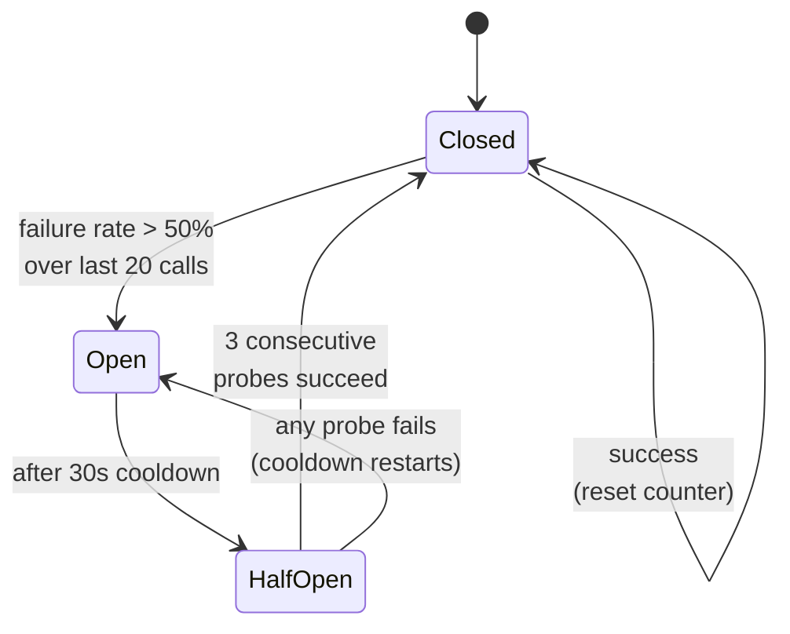
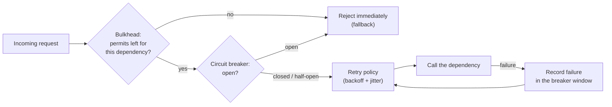

# Circuit breakers and bulkheads

## 1. What this is, and why they ask it

A **circuit breaker** stops you calling a dependency that is clearly broken. After enough failures it
"opens", and every subsequent call fails instantly without touching the network, until a periodic probe finds
that the dependency has recovered.

A **bulkhead** stops one slow dependency from consuming all of your capacity. You give each dependency its
own limited pool of workers or connections, so when one of them stalls, the requests that need it queue up in
their own compartment and everything else keeps running.

They are two answers to the same failure, and it is the failure that takes down more services than any other:
**one slow dependency, and the caller dies before the dependency does.** Not the failing service — the healthy
one in front of it. That is counter-intuitive the first time you meet it, and it is why interviewers like the
question.

Yesterday's answer, [retries with backoff](../day-125-what-a-graph-is/README.md), makes transient failures
invisible. It does nothing for a dependency that is down for ten minutes — in fact it makes that case worse,
because every request now sits in a backoff sleep before failing. Circuit breakers and bulkheads are what you
add for the sustained case, and a complete answer to "how do you handle a failing dependency" contains all
three.

By the end of this lesson you can draw the three-state machine, set every threshold with a reason, compute
how many threads a slow dependency consumes and how quickly, size a bulkhead from a latency target, and say
what your service returns when the breaker is open — which is the question that separates a design from a
mechanism.

---

## 2. The story

Rafiq's restaurant has six tables, four burners, and two people in the kitchen including him.

The fish is the problem. It always has been. The fish comes from a man who drives in from the coast, and
about one Friday in six he is late, and on those Fridays the fish that arrives at seven in the evening needs
another forty minutes before it is anything you can serve.

For years Rafiq handled it the way you would expect. Somebody orders fish, you take the order, you cook the
fish. If it takes fifty minutes, it takes fifty minutes.

What he did not see for a long time is what that does to everything else.

Table four orders fish. That order goes on a burner, and the burner is now occupied for fifty minutes. Table
two orders fish. Second burner gone. Two burners left, and one of them has the rice on it, which is always
there. So the whole restaurant — six tables — is now running on one burner.

Table five, who ordered two dosas and a coffee, which takes six minutes, waits thirty-five. They are not
waiting for fish. They did not order fish. They are waiting because there is nowhere to cook a dosa.

And then they complain, and Rafiq's assistant goes out to explain, and now there is nobody at the burner
either.

The change he made was two things, and he made them about eight years apart.

The first one was the easy one. On a night when the fish is late, he tells the boy to go round the tables and
say the fish is off the menu tonight. Not "it will be a while" — off. Then at half past eight he sticks his
head in the back, looks at what has arrived, and if it is ready he tells the boy to put it back on. If it is
not, he checks again at nine.

The second one took longer to see. He now keeps one burner — the small one on the left — for quick things
only. Dosas, eggs, reheating. Nothing that takes more than ten minutes goes on it, no matter how busy it is
and no matter how much easier it would be at the time. That burner is not available to the fish even when
three burners are free.

His assistant thought that was mad for about a year. Four burners and you are only allowed to use three for
the thing that takes longest.

But the fish stopped being able to take the whole kitchen down, and that is the entire point of it.

---

## 3. The idea in plain English

Rafiq's two changes are the two patterns, and the failure they prevent is the same one.

**Start with the failure, because everything else is a response to it.** A dependency slows down — not fails,
*slows down*. Your service calls it. That call now takes 30 seconds instead of 50 milliseconds. The thread or
task handling that request is stuck waiting.

**Your capacity is finite, and slow requests eat it.** If your service handles requests with a pool of 200
workers, and each request takes 50 milliseconds, you can serve 4,000 requests a second. If each one takes 30
seconds, you can serve about 6. The pool fills up in a few seconds, and then **every** request — including
requests that never touch the slow dependency — waits for a free worker.

**That is the whole disaster, and it is worth saying in one sentence:** a slow dependency converts into total
unavailability of the service in front of it, because the calling service runs out of capacity to wait with.
Rafiq's dosa customers waited thirty-five minutes for something that takes six.

**A circuit breaker is "the fish is off the menu tonight".** It watches the recent failure rate of calls to
one dependency. When failures exceed a threshold, it **opens**: from then on, calls to that dependency fail
instantly without being attempted. No network call, no waiting, no worker held.

**It has three states, and you must be able to name all three.**

- **Closed** — normal. Calls go through. Failures are counted.
- **Open** — tripped. Every call fails immediately. Nothing reaches the dependency.
- **Half-open** — testing. After a cooldown, a small number of calls are allowed through. If they succeed,
  the breaker closes. If any fails, it opens again and the cooldown restarts.

**Half-open is the state people forget, and it is the important one.** Without it, the breaker either stays
open forever or slams the full traffic back at a dependency that may still be broken — Rafiq putting the fish
back on the menu at half past eight without going to look at it first. Half-open is looking first.

**Failing fast is the point, and it feels wrong.** An open breaker is *deliberately returning errors* for
calls that might have succeeded. That is the trade, and it is worth being explicit about: you accept a
slightly higher error rate on one feature, in exchange for the rest of the service staying up. Waiting is not
free, and a request that waits 30 seconds and then fails is strictly worse than one that fails in a
millisecond.

**A bulkhead is the burner reserved for dosas.** The name comes from ships: a hull is divided into sealed
compartments, so a hole in one does not sink the vessel. In a service, you give each dependency its own
bounded pool — of threads, of connections, of concurrent permits — and when that pool is full, further calls
to that dependency are rejected immediately rather than queueing on the shared pool.

**The bulkhead limits the blast radius; the breaker shortens the duration.** They are not alternatives. The
bulkhead means that when the fish is slow, at most one burner's worth of the kitchen is affected, starting
from the first order. The breaker means that after a few slow orders you stop taking fish orders at all. You
want both, and if you can only have one, the bulkhead — because it works even for failures you did not
anticipate and did not configure a breaker for.

**And then the question that makes it a design rather than a mechanism: what do you return?** An open breaker
has to return *something*. Stale cached data. A default. A degraded page with the recommendations panel
missing. An honest error. **Deciding that is product work**, and a design that says "the breaker opens" without
saying what the user sees has not finished.

---

## 4. The picture

The three states, and every transition:



**What to notice.** Every arrow has a number on it, and each number is a decision you should be able to
defend. "Failure rate over the last 20 calls" rather than "20 failures" matters: a service doing 10,000
requests a second reaches 20 failures in normal operation constantly, so an absolute count trips on a healthy
system. A *rate* over a *recent window* does not.

Now the failure the bulkhead prevents, drawn as capacity:

```
NO BULKHEAD — one shared pool of 200 workers

  t = 0s     [AAAA BBBB CCCC ....................]   200 free
             A = payment (slow), B = catalogue, C = search

  t = 2s     [AAAAAAAAAAAAAAAAAAAA BBBB CC ......]   140 free
             payment calls piling up at 30s each

  t = 8s     [AAAAAAAAAAAAAAAAAAAAAAAAAAAAAAAAAA]     0 free
             every worker is waiting on payment.
             CATALOGUE AND SEARCH NOW FAIL TOO,
             and neither of them is broken.


WITH BULKHEAD — 50 payment / 100 catalogue / 50 search

  t = 8s     payment  [AAAAAAAAAAAAAAAAAAAA] 50/50 FULL
                      further payment calls rejected instantly
             catalogue[BBBB ...............] 4/100  fine
             search   [CC .................] 2/50   fine

             Payment is broken. Payment is unavailable.
             Nothing else is.
```

**What to notice.** In the second picture the payment feature is just as broken. The bulkhead does not fix it
and does not try to. What it does is make the damage *proportional* — one feature down instead of the whole
service — and that is the only property that matters at three in the morning.

And where the two sit relative to each other in a request's path:



**What to notice.** The order is bulkhead, then breaker, then retries, then the call. Retries are *inside* the
breaker, so failed attempts count towards opening it and so an open breaker prevents the retry sequence from
running at all. Putting retries outside the breaker means you retry past an open breaker, which defeats both.

---

## 5. How it actually works

### The breaker, in code

The whole mechanism is about forty lines, and writing it is a reasonable interview exercise.

```python
import time
from collections import deque


class CircuitOpen(Exception):
    """Raised instead of calling the dependency."""


class CircuitBreaker:
    def __init__(self, *, window: int = 20, threshold: float = 0.5,
                 cooldown: float = 30.0, probes: int = 3) -> None:
        self.window = window            # recent calls considered
        self.threshold = threshold      # failure fraction that trips it
        self.cooldown = cooldown        # seconds before probing
        self.probes = probes            # consecutive successes to close
        self.results: deque[bool] = deque(maxlen=window)
        self.state = "closed"
        self.opened_at = 0.0
        self.successes = 0
```

A `deque` with `maxlen` is the whole of "the last N calls" — it discards the oldest automatically, so the
failure rate is always over a recent window and never over all history.

```python
    def call(self, operation):
        if self.state == "open":
            if time.monotonic() - self.opened_at < self.cooldown:
                raise CircuitOpen("breaker is open")
            self.state = "half-open"        # cooldown elapsed: let a probe through
            self.successes = 0
        try:
            result = operation()
        except Exception:
            self._record(False)
            raise
        self._record(True)
        return result
```

`time.monotonic()` and not `time.time()`, for exactly the reason from
[day 123](../day-123-word-search-ii/README.md): a wall-clock correction can make the cooldown appear to have
elapsed instantly, or never.

```python
    def _record(self, ok: bool) -> None:
        if self.state == "half-open":
            if not ok:
                self._open()                        # one bad probe: back to open
            else:
                self.successes += 1
                if self.successes >= self.probes:
                    self.state = "closed"
                    self.results.clear()
            return
        self.results.append(ok)
        if len(self.results) == self.window:
            failures = self.results.count(False) / self.window
            if failures >= self.threshold:
                self._open()

    def _open(self) -> None:
        self.state = "open"
        self.opened_at = time.monotonic()
        self.results.clear()
```

Two details worth pointing at. The rate is only evaluated once the window is **full** — `len(self.results) ==
self.window` — so a service that has made three calls, two of which failed, does not trip at 67%. That is a
**minimum request volume** threshold, and without it breakers open constantly during low-traffic periods and
at startup.

And in half-open, a **single** failure re-opens. There is no averaging in half-open; you are asking one
question and one no is a no.

### Real implementations and their defaults

**Netflix Hystrix** made this pattern famous and is now in maintenance mode; its defaults are still the ones
everyone quotes: 20 requests minimum in a 10-second rolling window, 50% error threshold, 5-second sleep
window before half-open, and thread-pool isolation of 10 threads per dependency by default.

**Resilience4j** is Hystrix's successor in the Java world, and its shape is worth knowing:

```
slidingWindowSize: 100          # count-based or time-based
minimumNumberOfCalls: 20        # do not evaluate below this
failureRateThreshold: 50        # percent
slowCallRateThreshold: 100      # percent
slowCallDurationThreshold: 2s   # a slow call counts as a failure
waitDurationInOpenState: 30s
permittedNumberOfCallsInHalfOpenState: 5
```

The line to notice is `slowCallDurationThreshold`. **A call that takes 30 seconds and then succeeds is as bad
as a failure**, because it held a worker for 30 seconds. Counting slow calls as failures is the feature that
catches the actual disaster case, and Hystrix did not have it.

**Envoy** does it at the proxy layer as *outlier detection*, which is a nice variation: instead of one breaker
per dependency, it tracks each individual upstream host and ejects the ones that are failing.

```yaml
outlier_detection:
  consecutive_5xx: 5
  interval: 10s
  base_ejection_time: 30s
  max_ejection_percent: 50
```

`max_ejection_percent: 50` is the important safety valve — it refuses to eject more than half the hosts, on
the grounds that if more than half look broken, the problem is probably you and removing them all guarantees
an outage.

**Polly** in .NET and **gobreaker** in Go implement the same state machine. The pattern is universal; only the
configuration names change.

### Bulkheads: two implementations

**Thread-pool isolation** gives each dependency its own executor.

```
payment      -> pool of 20 threads
catalogue    -> pool of 50 threads
search       -> pool of 30 threads
```

When the payment pool is exhausted, further payment calls are rejected instantly. The cost is context
switching and about 1 MB of stack per thread, plus the calling thread now hands work to another thread — which
adds a fraction of a millisecond and, importantly, means the call can be *timed out and abandoned*, because
the caller is not the one blocked in the socket read.

**Semaphore isolation** is cheaper: a counter of permitted concurrent calls, on the calling thread.

```python
import threading

payment_permits = threading.Semaphore(20)

def call_payment(operation):
    if not payment_permits.acquire(blocking=False):
        raise BulkheadFull("payment")           # reject, do not queue
    try:
        return operation()
    finally:
        payment_permits.release()
```

No extra threads, almost no overhead. What you lose is the ability to walk away: if the call hangs, the
calling thread is still stuck in it, so a semaphore bulkhead absolutely requires a hard timeout on the call
itself. Hystrix defaulted to threads for exactly that reason; most modern async services use semaphores
because an async task is cheap and the timeout is easy.

**`blocking=False` is the entire point.** A bulkhead that queues is not a bulkhead — it is a slower version of
the shared pool. Rejecting immediately is what keeps the pressure from spreading.

**In an async service, the bulkhead is a bounded concurrency limit** — `asyncio.Semaphore(20)` or a bounded
connection pool. And note that connection pools are already bulkheads if you give each dependency its own:
one pool of 100 shared between three databases is not a bulkhead; three pools of 40 is.

### Fallbacks, which are the part that makes it a design

An open breaker must return something. In descending order of how good it is:

1. **Cached or stale data.** "Recommendations from five minutes ago." Usually invisible to the user.
2. **A degraded response.** The product page without the "customers also bought" panel. The feed without
   read receipts.
3. **A queued write.** Accept the order in `PENDING`, complete it later. This is the saga answer from
   [day 121](../day-121-trie-operations/README.md).
4. **A sensible default.** Standard shipping estimate instead of a computed one.
5. **A clear, fast error.** Worse than the others, better than a 30-second hang.

**What is never acceptable is a fallback that hides a correctness problem.** Returning "your balance is
₹0" because the balance service is down is far worse than an error. The rule: fall back on things that are
*nice to have*, never on things that are *the answer*.

---

## 6. The numbers

**How fast does a slow dependency exhaust your capacity?** This is the arithmetic that justifies the whole
lesson.

```
service worker pool                     200 workers
normal request duration                 50 ms
normal capacity            200 / 0.05 = 4,000 requests per second
```

The payment dependency goes from 50 ms to 30 s, and 10% of requests use it:

```
incoming rate                           1,000 requests per second
payment requests            1,000 x 0.1 = 100 per second
each holds a worker for                 30 s
workers consumed by payment  100 x 30   = 3,000 workers needed
workers available                       200
```

```
time to exhaust the pool     200 / 100  = 2 seconds
```

**Two seconds.** After that, the other 900 requests per second — the ones that have nothing to do with
payments — have no worker to run on. A dependency used by a tenth of your traffic takes down all of it, in
the time it takes to read this sentence.

**With a bulkhead of 20 permits for payment:**

```
payment workers capped at               20
payment throughput          20 / 30 s = 0.67 per second
payment requests rejected   100 - 0.67 = ~99 per second
workers left for everything else  200 - 20 = 180
other capacity              180 / 0.05 = 3,600 per second
```

**The payment feature is 99% broken and the rest of the service runs at 90% capacity.** That is the trade,
stated in numbers, and it is the right one.

**Sizing a bulkhead.** Little's Law gives you the number directly: concurrency = arrival rate × service time.

```
payment traffic             100 requests per second
normal payment latency      50 ms
concurrency needed  100 x 0.05 = 5
add headroom for p99 (200 ms):  100 x 0.2 = 20
                            -> pool size 20
```

**Size for the p99, not the mean, and not for the failure case.** Sizing for 30-second calls would mean a
pool of 3,000, which is exactly the unbounded behaviour you were trying to prevent.

**Breaker thresholds, and why the minimum volume matters.**

```
service at 10,000 requests/s
normal error rate                       0.1%
errors per second           10,000 x 0.001 = 10 per second
```

With an absolute threshold of "20 failures", the breaker trips **every two seconds** on a perfectly healthy
service. With a rate threshold of 50% over a window of at least 20 calls, it does not trip at all, because
0.1% is nowhere near 50%.

**What an open breaker saves.** A ten-minute outage of a dependency used by 100 requests per second:

```
without a breaker
  requests attempted        100/s x 600 s = 60,000
  each waits for a timeout  10 s
  worker-seconds consumed   60,000 x 10   = 600,000 worker-seconds
                                          = 167 worker-hours

with a breaker (opens after ~20 calls, ~4 s)
  requests attempted        ~ 20
  the rest fail in          ~ 0.1 ms
  worker-seconds consumed   ~ 200 + negligible
```

**Three thousand times less capacity burned**, and the capacity is what everything else needs.

**The half-open cost.** With a 30-second cooldown and 3 probes:

```
probes during a 10-minute outage   600 / 30 = 20 attempts
                                   x 3 probes = 60 calls
against 60,000 without a breaker
```

**Recovery time.** When the dependency comes back, the breaker notices within one cooldown:

```
worst case detection of recovery   30 s
```

That is the cost of the cooldown: up to 30 seconds of unnecessary failure after the dependency is healthy
again. A shorter cooldown recovers faster and probes a broken dependency more often. 30 seconds is the common
default because it is short relative to a human-noticeable outage and long relative to a restart.

---

## 7. The trade-offs

**An open breaker returns errors for calls that might have succeeded.** That is not a side effect, it is the
mechanism. During the cooldown, if the dependency recovered in the first second, you fail requests for 29
more seconds. Shorter cooldowns reduce that and increase load on something that may still be broken. This is
the same false-positive trade as [failure detection](../day-124-tries-revision/README.md), and you price it
the same way.

**Breakers are per-instance, and that is usually fine but occasionally wrong.** Each of your 50 service
instances has its own view. With traffic spread evenly they all trip at roughly the same time, which is fine.
With uneven traffic, an instance with low volume never fills its window and never trips. Sharing breaker state
across instances sounds appealing and introduces a coordination dependency into your failure path, which is
exactly where you least want one. Almost everyone keeps them local, and the mitigation for the low-volume case
is a time-based window rather than a count-based one.

**Bulkheads waste capacity by design.** Reserving 50 payment permits means that when payments are quiet those
50 slots sit idle while catalogue requests queue. Rafiq's assistant was right that it is inefficient; he was
wrong that inefficiency is the deciding factor. **Isolation costs utilisation, and you buy it anyway**, the
same way you pay for a spare tyre.

**Thread-pool bulkheads cost memory and a context switch; semaphore bulkheads cost you the ability to walk
away.** Threads: about 1 MB of stack each, plus scheduling. Semaphores: nearly free, but the calling thread
is the one that blocks, so a hanging call still holds it — which means a semaphore bulkhead without a hard
timeout on the call is not actually a bulkhead.

**Too many breakers is its own problem.** A service with 30 dependencies and 30 breakers has 30 sets of
thresholds that drift out of date, and an incident where four are open at once is genuinely hard to reason
about. Put breakers on the dependencies whose failure you have thought about; put bulkheads on all of them,
because bulkheads need no per-dependency tuning to be useful.

**Fallbacks can be worse than failures.** A stale recommendation is fine. A stale price is a financial
problem. A defaulted permission check is a security hole. The rule is that you fall back on things that are
nice to have and never on the answer itself, and if a dependency has no acceptable fallback, the honest design
is a fast, clear error.

**When would I not use a circuit breaker?** When the dependency is not shared and not remote — an in-process
call, a local cache — because there is no queue to protect and no network to fail. And when there is exactly
one caller and one dependency at low volume, where a breaker adds a state machine and a set of thresholds to
maintain in exchange for a failure mode that cannot happen. The bulkhead I would keep in almost every case,
because it is a bounded pool and bounded pools are good practice regardless.

---

## 8. In the interview

### How it gets asked

- *"One downstream service is slow. How do you protect the rest?"* — the direct version.
- *"What is a circuit breaker? Draw the states."*
- *"Your service went down but its own code was fine. What happened?"* — thread pool exhaustion.
- *"What do you return when the breaker is open?"* — the fallback question, and the one that separates
  candidates.
- *"How do you pick the failure threshold?"*
- *"Retries or circuit breaker?"* — both, in a specific order.

### The first ninety seconds

> "The thing to name first is that the danger is not the slow dependency — it is what waiting for it does to
> me. Let me put a number on that.
>
> Say I have 200 workers and requests normally take 50 milliseconds, so I serve 4,000 a second. Now one
> dependency goes from 50 milliseconds to 30 seconds, and only a tenth of my traffic touches it — a hundred
> requests a second. Each one holds a worker for 30 seconds. At a hundred a second I exhaust 200 workers in
> two seconds, and after that every request fails, including the 90% that never touch that dependency. **A
> dependency used by a tenth of my traffic takes down all of it in two seconds.**
>
> Two mechanisms, and they do different jobs.
>
> **A bulkhead** limits the blast radius. Each dependency gets its own bounded pool — say 20 permits for
> payment — and when it is full, further payment calls are rejected immediately rather than queueing on the
> shared pool. Payment breaks; nothing else does. Sizing comes from Little's Law: arrival rate times p99
> latency, so a hundred a second at 200 milliseconds p99 is 20. Explicitly **not** sized for the failure case,
> because that would be unbounded again.
>
> **A circuit breaker** shortens the duration. It watches the recent failure rate; above a threshold it opens
> and every call fails instantly without touching the network. After a cooldown it goes half-open and lets a
> few probes through — if they succeed it closes, if one fails it opens again. Three states, and half-open is
> the one people leave out; without it you either stay open forever or slam full traffic at something still
> broken.
>
> The two are not alternatives. The bulkhead bounds the damage from the first slow request; the breaker stops
> the calls a few seconds later. And I would say up front that the breaker only earns its place if I have
> decided what to return when it is open — that is a product decision, not a library setting.
>
> Shall I go into the thresholds or the fallbacks?"

### The follow-ups

**"How do you pick the failure threshold?"**

> "Three numbers, and the one people get wrong is the third.
>
> **The threshold is a rate, not a count** — 50% of recent calls, not 20 failures. A service doing ten
> thousand requests a second with a normal error rate of 0.1% produces ten errors a second, so an absolute
> count of 20 trips the breaker every two seconds on a perfectly healthy system.
>
> **The window is recent** — the last hundred calls, or the last ten seconds. Over all history it never trips
> during an outage because the good calls outnumber the bad ones, and it never closes afterwards for the same
> reason.
>
> **And there is a minimum call volume before the rate is evaluated at all**, typically 20. Without it, a
> low-traffic instance that has made three calls and failed two of them trips at 67% on a statistically
> meaningless sample. That is the third number and it is the one missing from most hand-rolled
> implementations.
>
> One more thing I would configure that Hystrix did not have and Resilience4j does: **count slow calls as
> failures**. A call that takes 30 seconds and then succeeds has done all the damage of a failure — it held a
> worker for 30 seconds — so a `slowCallDurationThreshold` of, say, two seconds is what actually catches the
> disaster case."

**"What does the service return when the breaker is open?"**

> "That is a product decision, and I would push back on any design that answers it with 'an error' by default.
>
> The hierarchy I would work through, best first. **Cached or stale data** — recommendations from five minutes
> ago, and the user cannot tell. **A degraded response** — the product page renders without the 'customers
> also bought' panel; nothing is broken from the user's point of view, one panel is missing. **A queued
> write** — accept the order as pending, complete the payment later, which is the saga pattern and it turns an
> outage into a delayed confirmation email. **A sensible default** — a standard shipping estimate rather than
> a computed one. And last, **a clear fast error**, which is much better than a 30-second hang but is the
> weakest option.
>
> The rule I would state is that you fall back on things that are nice to have, never on the answer itself. A
> stale recommendation is fine. A stale price is a financial incident. A defaulted authorisation check is a
> security hole. If a dependency has no acceptable fallback — an authorisation service, say — then the honest
> design is a fast error, and I would say so rather than invent a default that hides a correctness problem."

**"Bulkhead or breaker, if you can only have one?"**

> "Bulkhead, and I would justify it on coverage rather than on effectiveness.
>
> A breaker protects the dependency I configured it for, at the thresholds I chose, for the failure modes I
> anticipated. A bulkhead is a bounded pool, and it protects me from *any* dependency behaving in *any*
> unexpected way — including the one I did not think about, and including a bug in my own code that holds
> workers. Bounded resources are a property, not a policy.
>
> It also needs almost no tuning. A pool size from Little's Law is a number I can derive; a failure threshold
> and a cooldown are numbers I have to guess and revisit.
>
> The breaker's advantage is duration: with only a bulkhead, a ten-minute outage means ten minutes of calls
> that each wait for a timeout, which burns capacity and makes every affected request slow rather than
> instantly failed. So I want both. But if I am triaging a service that has neither, I add bounded pools and
> hard timeouts first, because those two changes alone remove most of the failure mode."

**"How does this interact with retries?"**

> "Retries go *inside* the breaker, and the ordering matters in both directions.
>
> Inside means failed attempts count towards opening the breaker, which is right — three failed attempts are
> stronger evidence of a problem than one. And it means that once the breaker is open, the retry policy does
> not run at all, so I am not backing off and retrying against a dependency I have already decided is down.
>
> If I put retries outside the breaker, I would retry past an open breaker, which defeats it entirely, and my
> retry-driven load would not be visible to the breaker's failure counting.
>
> The full order in the request path is: bulkhead first — do I even have a permit for this dependency — then
> the breaker, then the retry policy with backoff and jitter, then the call. Four things, each doing a
> different job: bound the concurrency, stop calling a dead thing, survive a transient blip, and do the work."

### The model answer

*"Your product page calls five services: catalogue, pricing, inventory, reviews and recommendations. One of
them will eventually be slow. Design for it."*

> "The first thing I would do is classify the five, because they are not equal and treating them equally is
> the mistake.
>
> **Catalogue and pricing are essential** — without them there is no page. **Inventory is important** — I can
> render without it but the page is worse. **Reviews and recommendations are optional** — nobody has ever
> abandoned a purchase because the recommendations panel was missing.
>
> That classification decides everything else, so I would say it out loud before any mechanism.
>
> **Every one of the five gets a bulkhead**, because bounded pools cost nothing to reason about and protect
> me from failures I have not predicted. Sizing from Little's Law: at 1,000 page views a second, a service
> called on every page at a p99 of 100 milliseconds needs 100 permits, and I would add a little headroom.
> Recommendations, at a p99 of 300 milliseconds, gets 50 permits and a hard 200-millisecond timeout — because
> it is optional, its timeout should be *tighter* than the essential services, not looser. That is
> counter-intuitive and it is right: I am willing to wait for the price, not for the recommendations.
>
> **Breakers on the three non-essential services**, with fallbacks decided in advance. Recommendations open →
> render the page without the panel. Reviews open → show the cached aggregate rating and hide the review list.
> Inventory open → show 'check availability at checkout' rather than a possibly wrong in-stock badge, because
> a wrong stock claim is a customer-service problem and a missing one is not.
>
> **No breaker on catalogue or pricing, and this is the part worth defending.** If pricing is down I cannot
> render a product page at any quality, so failing fast gains me nothing except a faster error. What those two
> get instead is aggressive caching — a short-TTL cache in front of pricing means a pricing outage degrades to
> serving prices up to sixty seconds old, which is a real product decision I would want signed off, and a far
> better outcome than an error page.
>
> **Thresholds:** 50% failure rate over a rolling 100 calls with a minimum of 20, slow calls above two seconds
> counted as failures, 30-second cooldown, 3 probes to close. Same numbers on all three breakers, because
> having three different sets of thresholds to maintain buys nothing.
>
> **The numbers that justify it.** With 200 workers and a 30-second stall on recommendations at 1,000 requests
> a second, without a bulkhead I lose the entire page in 2 seconds. With a 50-permit bulkhead I lose the
> recommendations panel and keep 150 workers, which is 75% of capacity for a service that is entirely
> functional. And with a breaker the recommendations calls stop happening at all after about 4 seconds, so
> those 50 permits come back too.
>
> **What I would monitor:** breaker state transitions as events, not as a gauge — I want an alert on 'the
> recommendations breaker opened', with the failure rate and the p99 at that moment, because a breaker opening
> is the earliest clear signal that something downstream is wrong, and it is usually more actionable than the
> latency dashboard."

---

## 9. Recall card

**The failure is the caller, not the dependency.** 200 workers, a 30-second dependency used by 10% of a
1,000/s stream, and the pool is exhausted in **2 seconds** — including the 90% of requests that never touch
it.

**Breaker = three states.** Closed (counting), open (fail instantly), half-open (probe after cooldown; one
failure re-opens). Threshold is a **rate over a recent window with a minimum call volume**, never an absolute
count. Count slow calls as failures.

**Bulkhead = a bounded pool per dependency, and it must reject rather than queue.** Size with Little's Law —
arrival rate × p99 latency — never for the failure case. It costs utilisation and buys isolation.

**Order in the request path:** bulkhead → breaker → retries → call. Retries live inside the breaker, so
attempts count towards opening it and an open breaker stops them running.

**A breaker is not finished until you have decided what it returns.** Stale data, degraded response, queued
write, sensible default, fast error — in that order. Never fall back on the answer itself.
