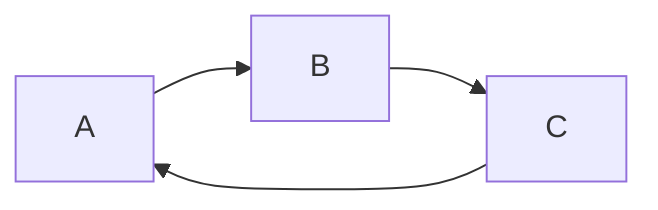

# Breadth-first search on a graph

## 1. What this is, and why they ask it

Breadth-first search visits a graph in rings. Everything one step from the start, then everything two steps
away, then three. It is nine lines of code, it never revisits a vertex, and it has one property that makes it
the single most useful algorithm in this phase: **the first time BFS reaches a vertex, it has reached it by
the fewest possible steps.**

You have written BFS before, on [day 101](../day-101-bfs-level-order/README.md), where it walked a tree level
by level. Everything changes and nothing changes. The code gains one line — a `seen` set — and that one line
is the whole difference between a tree and a graph, because a graph has cycles and a tree does not.

They ask BFS constantly, and almost always in disguise: "fewest moves", "shortest path", "minimum number of
steps", "how many levels". Interviewers at every product company use it, often as the second question, and
the reason is that it is short enough to write in ten minutes and has exactly three places to get it wrong.

By the end of this lesson you can write BFS from memory in under two minutes, say why marking a vertex when
you push rather than when you pop matters, produce distances and not just visitation, reconstruct the actual
path, and handle a graph that is not connected — which is the case sample inputs never contain and real
inputs always do.

---

## 2. The story

The doctor comes out at eleven at night and tells Devika that her father needs two units of blood, and that
the hospital's bank has none of his group.

She has one phone and about a hundred and forty numbers in it, and it is eleven at night.

She does not go through them alphabetically. She picks eleven people — the ones she would call about anything
— and she sends each of them the same message: her father's group, the hospital name, and please, whoever you
know.

Four of them ring back within ten minutes to say they are not that group but they have forwarded it on. One
does not reply at all. Two are asleep. By twenty past eleven her eleven messages have become, as far as she
can tell, somewhere over a hundred.

At twenty-five past, a number she does not recognise calls. It is a man who says his sister-in-law's
colleague is that group, lives in Malad, and can he give her the number.

Devika works out afterwards how that call reached her. Her friend Roshni sent it to about thirty people in a
group. One of them sent it to her brother. Her brother sent it to this man. Four steps: Devika, Roshni,
somebody in the group, the brother, the man. And the donor is on the fifth.

What she notices, and it stays with her, is that the answer did not come from the person who tried hardest.
It came from the shortest chain that happened to end at someone with B-negative blood. Her cousin in Pune was
still forwarding it to people at one in the morning, five and six steps out, long after it was over.

The other thing she notices is the replies that said "I've already got this from two other people."

By midnight the message had gone round and come back to her own building. Her neighbour on the ground floor
sent it to her — the original, with her own words in it, having travelled through four other phones. Everyone
who received it twice stopped, because there was no point sending it on again. The people it reached, it
reached once, by whichever chain got there first.

The donor came at half past one. His name is Sameer and Devika has never met him.

---

## 3. The idea in plain English

Devika ran a breadth-first search, and every part of one is in that night.

**The start is where you begin.** Devika. In code, the vertex you are asked to search from.

**The frontier is who you are asking right now.** Her eleven friends are the first ring. Everyone *they*
forwarded to is the second ring. **BFS processes one whole ring before it starts the next**, and that is what
"breadth-first" means: wide before deep.

**The queue holds the frontier in order.** A **queue** is a line where things come out in the order they went
in — first in, first out — which you met on [day 73](../day-073-queues/README.md). You push the start, then
repeatedly pop the front vertex and push all of its unseen neighbours to the back. Because the ring-one
vertices all go in before any ring-two vertex, they all come out first. **The queue enforces the rings by
itself; you never write any level-counting logic to get that behaviour.**

**"I've already got this from two other people" is the `seen` set.** Every vertex is recorded the first time
it is encountered and skipped forever after. Without it, a message going round in a circle never stops, and
in code you loop forever or run out of memory. **A tree traversal did not need this because a tree has no
cycles. Every graph traversal needs it, without exception.**

**Now the property that makes BFS worth learning.** When BFS first reaches a vertex, it has reached it by the
fewest edges possible. Not "usually". Always.

The reason is worth saying in one sentence, because interviewers ask: **BFS finishes ring `k` entirely before
it begins ring `k+1`, so if a vertex were reachable in `k` steps, it would already have been found in ring
`k` — it cannot first appear in ring `k+1`.** That is the whole argument, and it is enough.

The consequence: **BFS solves shortest path on an unweighted graph.** Every edge costs one step, and BFS
finds the fewest steps. Devika's donor came through the shortest chain not because anyone tried harder, but
because the search reached him at whatever ring he sat in and nothing later could reach him sooner.

**This is exactly why the property breaks when edges have weights.** If some chains are "slower" than others —
a friend who takes two hours to forward — then fewest *steps* is no longer cheapest *cost*, and BFS gives the
wrong answer. That is [day 136](../day-136-dijkstra/README.md).

**Mark a vertex when you push it, not when you pop it.** This is the detail that separates a working BFS from
one that is quietly quadratic. If you only mark on pop, a vertex with five unseen neighbours pointing at it
gets pushed five times before any of them is popped. The answer stays correct; the queue fills with
duplicates and the cost blows up. Devika's neighbour stopped forwarding the moment he *received* it the second
time, not after he had finished acting on it.

**Distances come free.** Store, alongside `seen`, how far each vertex is. When you push a neighbour of a
vertex at distance `d`, its distance is `d + 1`. One extra dictionary and the search now answers "how far",
not just "reachable".

**Paths come nearly free.** Store, for each vertex, which vertex you reached it from — its **parent**. When
you arrive at the goal, walk the parents backwards to the start and reverse. Devika reconstructed the chain
this way: the man came from the brother, who came from someone in the group, who came from Roshni.

**And the graph may not be one piece.** If some people have no phone, no chain reaches them. A single BFS from
Devika finds exactly her own **connected component**, and nothing else. Whenever the question is about *all*
vertices rather than the ones reachable from a start, you need an outer loop over every vertex. This is the
mistake sample inputs never expose.

---

## 4. The picture

Devika's network, drawn as rings:

```
        ring 0        ring 1              ring 2                ring 3

                   +-- Roshni --------+-- group person ------+-- brother --+
                   |                  |                      |             |
      Devika ------+-- Anil ----------+-- Anil's cousin      |             +-- SAMEER
                   |                  |                      |
                   +-- Meera ---------+-- Meera's sister ----+
                   |
                   +-- (8 more)

      distance:   0            1                2                 3            4
```

**What to notice.** Sameer is at distance 4. Every one of the eleven friends is at distance 1, whatever order
Devika sent the messages in. The search finishes all of ring 1 before any of ring 2 exists, and that ordering
is produced entirely by the queue.

The mechanics, step by step, on a small graph:

```
graph:  A -- B      A -- C      B -- D      C -- D      D -- E

step  queue (front -> back)   pop   push        seen
----  ----------------------  ----  ----------  --------------------
 0    [A]                     -     -           {A}
 1    [B, C]                  A     B, C        {A, B, C}
 2    [C, D]                  B     D           {A, B, C, D}
 3    [D]                     C     -  (D seen) {A, B, C, D}
 4    [E]                     D     E           {A, B, C, D, E}
 5    []                      E     -           {A, B, C, D, E}

distances:  A=0   B=1   C=1   D=2   E=3
```

**What to notice at step 3.** C looks at D, sees it is already in `seen`, and does not push it. D was
discovered from B at step 2, by a path of the same length. Whichever one got there first wins, and the other
does nothing — the "I already got this" reply. Without the `seen` check D would be pushed twice and processed
twice.

And the failure mode the `seen` set prevents:



```
without `seen`:  A, B, C, A, B, C, A, B, C, ...  forever
with `seen`:     A, B, C, done
```

**What to notice.** Three vertices and three edges is enough. You do not need a big graph to loop forever; you
need one cycle, and real graphs are full of them.

---

## 5. The code, built step by step

Start with the shape you will write ninety percent of the time.

```python
from collections import deque

def bfs(graph: dict[int, list[int]], start: int) -> set[int]:
    """Every vertex reachable from start."""
    seen = {start}
    queue = deque([start])
    while queue:
        current = queue.popleft()
        for neighbour in graph[current]:
            if neighbour not in seen:
                seen.add(neighbour)          # mark on PUSH
                queue.append(neighbour)
    return seen
```

Nine lines. Read the third-from-last one again: `seen.add(neighbour)` sits immediately before the append, not
after the pop. Section 7 shows what happens if you move it.

`deque` and not a list, because `list.pop(0)` is `O(n)` — it shifts every remaining element left — and
`deque.popleft()` is `O(1)`. On a graph with a million vertices that difference is the difference between
seconds and hours.

Now distances, which is what the interview usually actually wants.

```python
def bfs_distances(graph: dict[int, list[int]], start: int) -> dict[int, int]:
    """Fewest edges from start to every reachable vertex."""
    distance = {start: 0}
    queue = deque([start])
    while queue:
        current = queue.popleft()
        for neighbour in graph[current]:
            if neighbour not in distance:              # distance IS the seen set
                distance[neighbour] = distance[current] + 1
                queue.append(neighbour)
    return distance
```

The `seen` set has disappeared, because `distance` does its job — a vertex is seen exactly when it has a
distance. One dictionary instead of two, and the same guarantee. Vertices absent from the result are
unreachable, which is more useful than a separate check.

Then the path itself.

```python
def bfs_path(graph: dict[int, list[int]], start: int, goal: int) -> list[int] | None:
    """One shortest path from start to goal, or None if there is none."""
    parent: dict[int, int | None] = {start: None}
    queue = deque([start])
    while queue:
        current = queue.popleft()
        if current == goal:
            break                                     # found it; stop early
        for neighbour in graph[current]:
            if neighbour not in parent:
                parent[neighbour] = current
                queue.append(neighbour)
    if goal not in parent:
        return None
    ...
```

`parent` now does three jobs at once: it is the seen set, it records where each vertex was reached from, and
its keys are the reachable set. The `break` is a real optimisation — once you pop the goal, no later
discovery can beat it, so there is nothing left to learn.

Walking the parents backwards:

```python
    path = []
    node: int | None = goal
    while node is not None:
        path.append(node)
        node = parent[node]
    return path[::-1]                                 # built backwards, so reverse
```

Four lines. The start's parent is `None`, which is what terminates the walk, and it is why `parent[start]` is
set to `None` explicitly rather than left out.

Now the two things sample inputs hide. First, the graph is often not connected:

```python
def all_components(graph: dict[int, list[int]]) -> list[list[int]]:
    """Every piece, not just the one containing some start vertex."""
    seen: set[int] = set()
    pieces = []
    for vertex in graph:                              # the OUTER loop
        if vertex in seen:
            continue
        piece, queue = [], deque([vertex])
        seen.add(vertex)
        while queue:
            current = queue.popleft()
            piece.append(current)
            for neighbour in graph[current]:
                if neighbour not in seen:
                    seen.add(neighbour)
                    queue.append(neighbour)
        pieces.append(piece)
    return pieces
```

The inner block is unchanged BFS. The outer loop is the whole addition, and `seen` lives outside it so that a
vertex found in one piece is never used to start another.

Second, level-by-level processing, when the question asks about rings rather than distances:

```python
def bfs_levels(graph: dict[int, list[int]], start: int) -> list[list[int]]:
    """The vertices at distance 0, 1, 2, ... as separate lists."""
    seen = {start}
    frontier = [start]
    levels = []
    while frontier:
        levels.append(frontier)
        nxt = []
        for current in frontier:                      # one whole ring
            for neighbour in graph[current]:
                if neighbour not in seen:
                    seen.add(neighbour)
                    nxt.append(neighbour)
        frontier = nxt
    return levels
```

No queue at all. Two lists — the current ring and the next one — swapped at the end of each round. This is
often clearer than counting `len(queue)` at the top of a loop, and it is the shape to reach for whenever the
problem says "in each round" or "per minute" or "per level".

### The complete solution

```python
"""Breadth-first search on a graph: reachability, distances, paths, components."""

from __future__ import annotations

from collections import defaultdict, deque


def build(edges: list[tuple[str, str]], directed: bool = False) -> dict[str, list[str]]:
    graph: dict[str, list[str]] = defaultdict(list)
    for a, b in edges:
        graph[a].append(b)
        if not directed:
            graph[b].append(a)
    return graph


def bfs_distances(graph: dict[str, list[str]], start: str) -> dict[str, int]:
    """Fewest edges from start to every reachable vertex. O(V + E)."""
    distance = {start: 0}
    queue = deque([start])
    while queue:
        current = queue.popleft()
        for neighbour in graph[current]:
            if neighbour not in distance:
                distance[neighbour] = distance[current] + 1
                queue.append(neighbour)
    return distance


def bfs_path(graph: dict[str, list[str]], start: str, goal: str) -> list[str] | None:
    """One shortest path, or None. Ties are broken by adjacency order."""
    if start == goal:
        return [start]
    parent: dict[str, str | None] = {start: None}
    queue = deque([start])
    while queue:
        current = queue.popleft()
        for neighbour in graph[current]:
            if neighbour in parent:
                continue
            parent[neighbour] = current
            if neighbour == goal:                     # stop as soon as it is found
                path, node = [], neighbour
                while node is not None:
                    path.append(node)
                    node = parent[node]
                return path[::-1]
            queue.append(neighbour)
    return None


def components(graph: dict[str, list[str]]) -> list[list[str]]:
    """Every piece of the graph. Needed whenever the question says 'all'."""
    seen: set[str] = set()
    pieces: list[list[str]] = []
    for vertex in graph:
        if vertex in seen:
            continue
        piece, queue = [], deque([vertex])
        seen.add(vertex)
        while queue:
            current = queue.popleft()
            piece.append(current)
            for neighbour in graph[current]:
                if neighbour not in seen:
                    seen.add(neighbour)
                    queue.append(neighbour)
        pieces.append(sorted(piece))
    return pieces


if __name__ == "__main__":
    contacts = [
        ("devika", "roshni"), ("devika", "anil"), ("devika", "meera"),
        ("roshni", "group"), ("anil", "cousin"), ("meera", "sister"),
        ("group", "brother"), ("sister", "brother"),
        ("brother", "sameer"),
        ("pune_uncle", "pune_friend"),          # a separate piece
    ]
    network = build(contacts)

    distances = bfs_distances(network, "devika")
    for person in sorted(distances, key=lambda p: (distances[p], p)):
        print(f"  {distances[person]}  {person}")

    print("path:", bfs_path(network, "devika", "sameer"))
    print("unreachable:", bfs_path(network, "devika", "pune_friend"))
    print("pieces:", components(network))
```

Running it:

```
  0  devika
  1  anil
  1  meera
  1  roshni
  2  cousin
  2  group
  2  sister
  3  brother
  4  sameer
path: ['devika', 'roshni', 'group', 'brother', 'sameer']
unreachable: None
pieces: [['anil', 'brother', 'cousin', 'devika', 'group', 'meera', 'roshni', 'sameer', 'sister'], ['pune_friend', 'pune_uncle']]
```

Two things to look at. `brother` is at distance 3 and is reachable through both `group` and `sister` — the
path returned goes via `group` because `roshni` was listed first, and a different adjacency order would give
an equally short, different path. **BFS finds *a* shortest path, not *the* shortest path**, and if a problem
demands a specific one you must add a tie-break.

And `pune_friend` is `None`. The uncle's part of the network exists and Devika's search will never reach it.

---

## 6. What it costs

Count it directly from the loops.

**Time.**

```
each vertex enters the queue at most once      V pushes
                                               V pops
for each popped vertex, scan its neighbours    degree(v)
sum of all degrees                             2E  (undirected)
                                               E   (directed)
                                               ---------------------
total                                          V + 2E  ->  O(V + E)
```

**Each vertex enters the queue at most once because it is marked on push.** That single sentence is the proof,
and it is what the interviewer is listening for. If you mark on pop instead, the bound becomes `E` pushes
rather than `V`, and the cost becomes `O(V + E)` in time still but with a queue that can hold `E` entries
instead of `V`.

`O(V + E)` is a **sum**, not a product. A graph with a million vertices and five million edges is eleven
million operations — about a second in Python, instant in a compiled language.

**Space.**

```
seen / distance / parent    at most V entries    O(V)
the queue                   at most V entries    O(V)
the graph itself            V + 2E               O(V + E)
                                                 ---------
                                                 O(V + E)
```

**How big can the queue actually get?** This is the question people get wrong. It holds one ring at a time,
so its maximum size is the size of the widest ring. On a graph where one vertex connects to a million others,
the first ring is a million entries:

```
star graph, V = 1,000,001
ring 0    1 vertex
ring 1    1,000,000 vertices all queued at once
queue peak                     1,000,000 entries
at ~8 bytes per reference      8 MB, plus deque block overhead
```

On a long chain the queue never holds more than two:

```
path graph A-B-C-...-Z, V = 1,000,000
queue peak                     1 or 2 entries
```

Same `O(V)` bound, wildly different reality. **Say "the queue holds the widest level" if asked; it is more
precise than `O(V)` and shows you have thought about it.**

**Compared with the alternatives.**

```
BFS on adjacency list      O(V + E)
BFS on adjacency matrix    O(V^2)     — the row scan, from day 126
```

```
V = 10,000, E = 50,000
list    10,000 + 100,000  = 110,000 steps
matrix  10,000 x 10,000   = 100,000,000 steps      ~900x more
```

**On an implicit graph** — a grid, from [day 130](../day-130-grids-are-graphs/README.md) — the same formula
applies with `V = rows × cols` and `E ≤ 2 × rows × cols`, because each cell has at most four neighbours and
each edge is shared:

```
1,000 x 1,000 grid
V = 1,000,000
E <= 2,000,000
                          O(V + E) = 3,000,000 steps
```

**And the number that matters for interviews:** BFS is linear, so if a problem's constraints say `n <= 10^5`
vertices and `10^5` edges, BFS is comfortably fast and you do not need to justify it further. If the
constraints say `10^9`, you are not building the graph at all and the question is about something else.

---

## 7. The traps

### Marking on pop instead of on push

The near-miss, and it looks more natural than the correct version:

```python
while queue:
    current = queue.popleft()
    if current in seen:            # check on pop
        continue
    seen.add(current)              # mark on pop
    for neighbour in graph[current]:
        queue.append(neighbour)    # push without checking
```

The output is correct. The cost is not. Every vertex is pushed once per edge pointing at it, so the queue
holds `E` entries instead of `V`. On a dense graph:

```
V = 5,000 vertices, E = 12,000,000 edges
mark on push:  queue peak ~ 5,000 entries
mark on pop:   queue peak ~ 12,000,000 entries
```

```
MemoryError
```

Or, on a judge, `Time Limit Exceeded` with a solution you are certain is `O(V + E)`. **Mark on push. Say the
sentence "each vertex enters the queue at most once" as you write it, and if that sentence is not true of
your code, the code is wrong.**

### `list.pop(0)` instead of `deque.popleft()`

```python
queue = [start]
while queue:
    current = queue.pop(0)         # O(n), shifts everything left
```

No error, and correct answers on small inputs. On a large one:

```
V = 200,000
deque.popleft()  0.09 s
list.pop(0)      41 s
```

Removing from the front of a Python list moves every remaining element. Doing that `V` times is `O(V²)`.
`from collections import deque` is the fix and it should be automatic.

### No `seen` set at all

```python
def walk(graph, current):
    for neighbour in graph[current]:
        walk(graph, neighbour)
```

```
Traceback (most recent call last):
  File "bfs.py", line 6, in walk
    walk(graph, neighbour)
  [Previous line repeated 996 more times]
RecursionError: maximum recursion depth exceeded
```

Or, in the iterative version, no error at all — just a queue that grows until the process is killed. One
cycle is enough. A tree traversal never needed this, which is exactly why the habit is missing.

### Assuming one component

```python
distances = bfs_distances(graph, 0)
print(len(distances))              # "the number of vertices"
```

It is the number of vertices *reachable from 0*. On a disconnected graph that is an undercount, and the sample
input is almost certainly connected so nothing tells you. Whenever the question says "all", "every", "how
many groups" or "count the...", write the outer loop.

### The unreachable lookup

```python
distances = bfs_distances(graph, start)
print(distances[goal])
```

```
Traceback (most recent call last):
  File "bfs.py", line 14, in <module>
    print(distances[goal])
KeyError: 'pune_friend'
```

A vertex that was never reached has no entry. Use `distances.get(goal, -1)` or check membership. Returning
`-1` for "unreachable" is the convention most problems expect, and it is worth confirming with the
interviewer rather than assuming.

### BFS on a weighted graph

The subtle one, because it runs fine and gives a wrong answer:

```
A --1-- B --1-- C          BFS says A to C costs 2 steps
A --------10------- C      BFS says A to C costs 1 step

BFS returns the 1-step path. Its real cost is 10.
The 2-step path costs 2.
```

**BFS minimises the number of edges, not the sum of the weights.** They are the same thing only when every
edge costs the same. The moment weights differ, you need Dijkstra. If all the weights happen to be 0 or 1,
there is a neat middle option — 0-1 BFS with a deque — which is
[day 141](../day-141-multi-source-bfs/README.md).

---

## 8. In the interview

### How it gets asked

BFS is almost never named. These phrasings mean it:

- *"Find the shortest path from A to B."* — in an unweighted graph.
- *"What is the minimum number of moves to..."*
- *"How many steps until every orange rots / every computer is infected / everyone knows?"*
- *"Find the shortest transformation sequence from one word to another."*
- *"How many people are within two degrees of separation?"*
- *"Count the islands."* — BFS as the component-finder, not as a path-finder.

The tell, in one line: **"fewest", "minimum number of steps", or "level by level", on something with equal
step costs.**

### The first ninety seconds

> "Fewest steps on an unweighted graph is breadth-first search, and I would say why rather than assert it:
> BFS finishes every vertex at distance `k` before it looks at anything at distance `k+1`, so the first time
> it reaches a vertex it has reached it by the fewest possible edges. That is the guarantee I am relying on,
> and it holds only because every edge costs the same — if there were weights I would need Dijkstra instead.
>
> The structure is a queue and a seen set. Push the start, then repeatedly pop the front and push every unseen
> neighbour. Two details I want to get right as I write it.
>
> First, **I mark a vertex as seen when I push it, not when I pop it.** If I mark on pop, a vertex with a
> hundred edges pointing at it gets queued a hundred times before any of them is processed — the answer is
> still correct but the queue holds `E` entries instead of `V`, and on a dense graph that is a memory limit
> error. Marking on push is what makes 'each vertex enters the queue at most once' true, and that sentence is
> the complexity proof.
>
> Second, **`deque`, not a list**, because popping from the front of a list is `O(n)` and doing it `V` times
> turns a linear algorithm quadratic.
>
> For distances I use one dictionary rather than a set plus a dictionary — a vertex is seen exactly when it
> has a distance. For the actual path I keep a parent pointer and walk it back at the end.
>
> Cost is `O(V + E)` time and `O(V)` extra space, and I would note the queue's peak is the widest level, not
> the whole graph.
>
> One question before I code: is the graph guaranteed connected, and what should I return for an unreachable
> target?"

### The follow-ups

**"Prove that BFS gives the shortest path."**

> "By induction on the distance, and it is short enough to say out loud.
>
> The start is at distance 0 and is correct trivially. Suppose every vertex at true distance `k` has been
> assigned distance `k` and is in the queue before anything at distance `k+1`. When I pop a vertex at distance
> `k` and look at an unseen neighbour, that neighbour is one edge from a vertex at distance `k`, so its true
> distance is at most `k+1`. It cannot be less than `k+1`, because if it were `j ≤ k` it would have been
> discovered while processing ring `j−1`, which has already finished. So it is exactly `k+1`.
>
> The property the queue provides is that all of ring `k` is popped before any of ring `k+1`, which is exactly
> what first-in-first-out gives you when you push ring `k+1` while popping ring `k`.
>
> And the assumption I would name explicitly: every edge costs one. With weights, a two-edge path can be
> cheaper than a one-edge path, the induction breaks at the first step, and BFS confidently returns the wrong
> answer."

**"The graph is huge — a billion vertices. Now what?"**

> "BFS is linear, so the problem is not the algorithm, it is that `O(V)` memory is a billion entries and the
> graph does not fit on one machine.
>
> Three things I would do, and which one depends on the question. If I only need vertices within a small
> distance — 'friends of friends' — I bound the depth and stop, and the cost becomes the size of that
> neighbourhood rather than the graph. Two rings on a social graph with an average degree of 200 is about
> forty thousand vertices, not a billion.
>
> If I genuinely need the whole traversal, **bidirectional BFS** halves the exponent when I have both
> endpoints: search forward from the start and backward from the goal, one ring each, alternating, and stop
> when the frontiers touch. If the branching factor is `b` and the distance is `d`, that is `2 × b^(d/2)`
> instead of `b^d`. At `b = 200` and `d = 6` that is two hundred thousand vertices explored instead of sixty
> four trillion. It is the single biggest win available on a large sparse graph and it costs about fifteen
> extra lines.
>
> And if it truly does not fit, the traversal moves out of memory: keep the frontier as a set on disk or in a
> distributed store, and do each ring as a batch join against the edge list. That is what graph frameworks do,
> and the cost model changes from operations to passes over the data."

**"There are several shortest paths. Return all of them."**

> "That changes the parent structure and it is worth being careful, because the naive change is wrong.
>
> Instead of one parent per vertex, I keep a list of parents. When I reach a vertex that already has a
> distance, I do not ignore it — I check whether the distance I would assign equals the distance it already
> has. If it does, this is another equally short route, so I append to its parent list. If it is larger, I
> ignore it as before.
>
> Then reconstructing is a backwards walk that branches at every vertex with more than one parent, which is a
> depth-first search over the parent structure.
>
> The thing to flag is the output size. The number of shortest paths can be exponential in the number of
> vertices — a grid of alternating diamonds doubles the count at every level — so 'return all of them' can be
> an unbounded amount of output even though the search itself is still `O(V + E)`. I would ask whether they
> want all paths or just the count, because the count is a small extra field on each vertex and the paths are
> not."

**"Same question, but some edges cost 0 and some cost 1."**

> "Then plain BFS is wrong, but full Dijkstra is more than I need. The right tool is 0-1 BFS.
>
> Use a deque instead of a queue. When I relax an edge of weight 0, I push the neighbour to the **front**;
> when I relax an edge of weight 1, I push it to the **back**. That keeps the deque sorted by distance with at
> most two distinct values in it at any time, which is exactly the invariant a queue gives you for uniform
> weights.
>
> The cost stays `O(V + E)` — no heap, no log factor — and it is the whole answer for problems like 'minimum
> number of walls to break to cross the grid' or 'minimum sign flips', where the two costs are the only two.
> Above two distinct weights, the invariant breaks and it is Dijkstra."

### The model answer

*"Given a start word, an end word, and a dictionary, find the length of the shortest transformation sequence,
changing one letter at a time, where every intermediate word must be in the dictionary."*

> "Let me name the model first, because the whole difficulty of this problem is in the model and not in the
> search.
>
> **A vertex is a word. An edge joins two words that differ in exactly one letter.** Undirected, unweighted,
> and the question is fewest steps — so this is BFS, and the guarantee I want is that the first time I reach
> the end word I have reached it by the fewest transformations.
>
> **The graph is implicit, and building it explicitly is the trap.** With `n` words of length `L`, comparing
> every pair is `n²` comparisons at `L` each. Ten thousand words is a hundred million comparisons before the
> search even starts.
>
> **So I compute neighbours instead of storing them.** From a word of length `L`, I generate the `L × 25`
> candidates that differ in one position and keep the ones present in a set of the dictionary. For `L = 5`
> that is 125 candidate strings and 125 set lookups per word — a constant, and completely independent of how
> many words the dictionary holds. Total work is `O(V × L × 25)` instead of `O(V² × L)`, which at ten thousand
> five-letter words is 1.25 million operations instead of 500 million.
>
> **The alternative model, if `L` were large,** is to bucket words by wildcard patterns — `h*t`, `*ot`, `ho*`
> — so that all words sharing a pattern are neighbours. That is `O(V × L)` to build and `O(L)` per lookup, and
> it wins when `L` exceeds about 25. I would mention it and stay with the direct generation for ordinary
> words.
>
> **Then it is plain BFS**: distance dictionary as the seen set, mark on push, `deque`, return the distance of
> the end word or 0 if it never appears.
>
> **Two edge cases I would state before coding.** The end word may not be in the dictionary at all, in which
> case the answer is 0 and I should check that in one line before starting rather than discovering it after a
> full traversal. And the start word is conventionally not required to be in the dictionary.
>
> **If they want it faster, bidirectional BFS.** The branching factor here is genuinely large — a common
> five-letter word has dozens of neighbours — so searching from both ends and meeting in the middle roughly
> squares down the explored set. On the standard LeetCode version that is the difference between passing
> comfortably and passing marginally, and the extra code is about fifteen lines: two frontiers, always expand
> the smaller one, stop when a word appears in the other side's distance map.
>
> **Cost:** `O(V × L × 25)` time and `O(V × L)` space for the dictionary set and the frontier. I would say
> those with `L` in them rather than hiding it in the constant, because for this problem the word length is a
> real parameter."

---

## 9. Recall card

**BFS visits in rings, and the first time it reaches a vertex, that is the fewest edges.** Because ring `k`
finishes entirely before ring `k+1` begins. **True only when every edge costs the same** — weights mean
Dijkstra.

**Nine lines: `deque`, a `seen` set, pop the front, push unseen neighbours.** Never `list.pop(0)` — that is
`O(n)` and makes the whole thing quadratic.

**Mark on push, not on pop.** It is what makes "each vertex enters the queue at most once" true, and that
sentence is the complexity proof. Marking on pop gives a queue of size `E` and a memory error on a dense
graph.

**One dictionary does three jobs:** `distance` (or `parent`) is also the seen set, and its keys are the
reachable set. Walk `parent` backwards and reverse for the actual path.

**`O(V + E)` time — a sum — and `O(V)` space, where the queue's peak is the widest level.** And if the question
says "all" or "how many groups", wrap it in an outer loop over every vertex, because the graph is probably not
connected.
