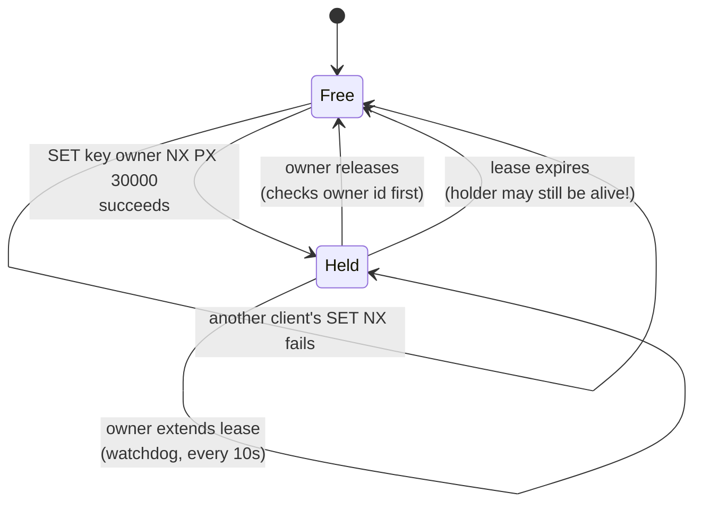

# Distributed locks

## 1. What this is, and why they ask it

A distributed lock lets one machine, out of many, say "I am the one doing this right now" — and have the
others believe it. A single cron job across ten servers. One leader among five replicas. One process rebuilding
a cache while nine others wait.

The implementation is three lines of Redis. The problem is that those three lines are not correct, and neither
is the next version, and neither is the version after that. **Every distributed lock has a failure mode where
two holders exist at once**, and the interview is entirely about whether you know which one and what you do
about it.

They ask it because it sits on top of everything in this phase. It needs
[failure detection](../day-124-tries-revision/README.md) to know when a holder has died, and it inherits that
lesson's impossibility: you cannot tell a dead holder from a slow one. It needs
[fencing](../day-124-tries-revision/README.md) to survive being wrong. It touches
[clocks](../day-123-word-search-ii/README.md), because a lease expires on a clock and clocks lie. It is the
single best question for finding out whether someone reasons about failure or recites patterns.

By the end of this lesson you can implement a lock correctly with the parts that matter, name the exact
sequence in which two processes end up holding it, explain fencing tokens well enough that an interviewer
stops asking, and — most importantly — say when the right answer is to not use a lock at all.

---

## 2. The story

The storeroom is on the ground floor behind the stairs, and there is one key. It hangs on a nail in the
watchman's cabin, on a loop of blue nylon rope with a wooden tag.

The rule has been the same for as long as anyone remembers. If you need something from the storeroom, you go
to the cabin, take the key off the nail, do what you need to do, and put it back.

The nail does all the work. You do not have to ask anyone whether the storeroom is free. If the key is on the
nail it is free, and if the nail is empty somebody is in there, and you come back later. Ganesh, who sits in
the cabin, is not part of the system at all — he just happens to be sitting near the nail.

It worked perfectly for years, and then in March a man from the third floor took the key, got a stepladder
out, and drove to his sister's house in Vasai with the key still in his pocket.

The nail was empty until Tuesday.

Nobody could get in. The society's committee met about it, and what they decided was reasonable and is also
where the trouble starts. They had a second key cut, and they gave it to Ganesh, and the rule now is that if
the nail has been empty since the previous evening, Ganesh may open the storeroom with the second key.

Which mostly works. And about once a year it produces the afternoon that everyone remembers.

A painter took the key on a Thursday morning, went up to the terrace to do something on the way, and left the
key in his bag on the terrace and forgot about it for the whole day and the whole night. Friday afternoon
Ganesh, following the rule, opened the storeroom with the second key for the plumber, who started moving the
paint tins to get at the pipe.

At which point the painter came down.

Two people in the storeroom, both certain they were allowed to be there, both correct according to the rule.
Nothing terrible happened — there was some shouting and the plumber put the tins back — but the committee had
built exactly what they had spent the year avoiding.

Ganesh's own view, which he offers to anyone who asks and which is more or less the correct one, is that you
cannot look at an empty nail and know whether the person is inside working or halfway to Vasai. The nail
cannot tell you that. Nothing hanging on a wall can.

---

## 3. The idea in plain English

Every part of a distributed lock is on that nail.

**A lock is a shared flag that only one holder may have.** The nail is the shared place. The key on it means
free; the key gone means taken. Any process wanting the resource checks the same place, so they all agree.

**In code the shared place is a single external store**, because the processes have no memory in common. Redis,
ZooKeeper, etcd, or a row in a database. The lock is a key in that store, and "taking the key" is a write
that succeeds only if nobody has written it already.

**Acquiring must be atomic — one indivisible step.** Two people cannot both reach for the key at the same
instant and both get it. In code that means the check and the write happen together, in the store, not in
your process. `SET lock_name owner NX` in Redis — `NX` meaning "only if it does not exist" — is one operation
that either succeeds or fails. **The version where you `GET` first and then `SET` is broken**, because two
processes can both `GET` "free" before either `SET`s.

**Releasing is deleting the key** — hanging it back on the nail.

**The man who drove to Vasai is a crashed holder, and he is the whole problem.** If a process takes the lock
and dies, the key never comes back and the resource is locked forever. Everything else in this lesson is a
consequence of that one failure.

**The lease is the committee's fix.** A **lease** is a lock with an expiry: the key comes back on its own after
30 seconds whether or not the holder returns it. In Redis that is `SET lock owner NX PX 30000`. Now a crashed
holder costs you 30 seconds instead of forever.

**And the lease creates the painter.** If the holder is not dead but merely slow — a long garbage-collection
pause, a stalled disk, a network hiccup — the lease expires while it is still working. Somebody else takes the
lock. The first holder wakes up believing it still holds the lock, and now two processes are inside.

**This is not a bug you can fix by choosing a better timeout.** It is exactly the impossibility from
[day 124](../day-124-tries-revision/README.md): you cannot distinguish a crashed holder from a slow one. A
longer lease means a crashed holder blocks for longer. A shorter lease means a slow holder gets overtaken more
often. **There is no setting that avoids both, and saying that out loud is the answer the interviewer wants.**

**So you stop trying to prevent two holders and make it harmless instead. That is fencing.** Every time the
lock is granted, a counter increases, and the holder is given that number — its **fencing token**. The holder
sends the token with every operation on the protected resource, and **the resource itself remembers the
highest token it has seen and rejects anything lower.**

The painter comes down holding token 33. The plumber has token 34. The storeroom has already seen 34, so the
painter's actions are refused. He finds out he no longer holds the lock from the refusal, which is the only
channel that works — nothing else can reach him while he is paused.

**Fencing is the difference between a lock that is a hint and a lock that is safe.** Without it, correctness
depends on the timeout being right, which it cannot always be. With it, an over-eager timeout costs you a
wasted handover instead of corrupted data.

**And there is one more thing to get right: only the owner may release.** If the painter comes back and hangs
his key on the nail while the plumber is inside, he has just released somebody else's lock. So the lock value
is not "taken" — it is a unique identifier for the holder, and release must check it. In Redis that check and
delete must themselves be atomic, which means a small script rather than a `GET` followed by a `DEL`.

**Finally, and this matters more than the machinery: often you should not use a lock.** The reason to lock is
usually that two writers would conflict. If you can make the write itself safe — a conditional update, a
unique constraint, an atomic increment, or routing all writes for a key to a single owner — you have removed
the problem rather than guarded it. **A lock is what you reach for when you cannot do that**, and a good answer
says so before reaching.

---

## 4. The picture

The failure everyone eventually meets, on a timeline:

```
  Client A                                    Client B
     |                                           |
 t=0 | acquire lock, lease 30s  -> OK            |
     | starts work                               |
     |                                           |
 t=5 | GC PAUSE (25 seconds)                     |
     |     ...                                   |
     |     ...                        t=30  lease EXPIRES in Redis
     |     ...                        t=31  | acquire -> OK
     |     ...                              | starts work
 t=30| wakes up. Believes it holds the lock. | still working
     | WRITES to the resource ---------------+--- WRITES to the resource
     |                                       |
     +-------------- TWO WRITERS. CORRUPTION. ----+
```

**What to notice.** Client A did nothing wrong. It acquired the lock legitimately and was paused by its own
runtime, which it cannot control and cannot detect. No lock implementation prevents this, because from
Redis's side a paused client and a dead client are the same thing.

Now the same timeline with fencing, which does not prevent it and makes it harmless:

```
  Client A                       Storage                  Client B
     |                              |                        |
 t=0 | acquire -> token 33          |                        |
     |                              |                        |
 t=5 | GC PAUSE                     |                        |
     |                              |             t=31 acquire -> token 34
     |                              |<-- write(token=34) ----|
     |                              | highest seen = 34      |
     |                              |                        |
 t=30| wakes, write(token=33) ----->|                        |
     |                              | 33 < 34  ->  REJECT    |
     |<---- 409: stale token -------|                        |
     | now knows it lost the lock   |                        |
```

**What to notice.** The rejection happens at the **storage layer**, not in client A. That placement is the
whole idea: client A cannot be trusted to check anything, because it was unconscious. The only component that
can enforce the rule is the one receiving the writes.

And the state of a lock over its lifetime:



**What to notice.** Two different arrows lead out of `Held` to `Free`, and only one of them is safe. The
expiry arrow is the one that produces two holders, and the watchdog loop — the self-transition — is what
reduces how often it fires.

---

## 5. How it actually works

### The Redis version, built correctly

Start with the version that is wrong, because you need to recognise it:

```python
# BROKEN: check-then-act is two operations
if not redis.exists("lock:report"):
    redis.set("lock:report", "me")
```

Two clients can both pass the `exists` check before either `set`s. The whole point of a lock is gone.

The correct acquire is one command:

```python
import uuid

token = str(uuid.uuid4())
acquired = redis.set("lock:report", token, nx=True, px=30_000)
#                                        ^^^^^^^^  ^^^^^^^^^^
#                             only if absent      expire in 30s
```

`nx=True` makes it atomic — Redis either creates the key or does not. `px=30000` is the lease, and it must be
set **in the same command**. Setting the key and then calling `EXPIRE` is a second broken version: a crash
between the two leaves a lock with no expiry, held forever.

The value is a random unique token, not `"locked"`, and that is what makes release safe.

Release must verify ownership, and the check and delete must be atomic too:

```python
RELEASE = """
if redis.call("get", KEYS[1]) == ARGV[1] then
    return redis.call("del", KEYS[1])
else
    return 0
end
"""
redis.eval(RELEASE, 1, "lock:report", token)
```

A Lua script runs atomically in Redis. Without it:

```python
# BROKEN
if redis.get("lock:report") == token:
    # <- the lease can expire and someone else can acquire, right here
    redis.delete("lock:report")     # deletes THEIR lock
```

This is the painter hanging his key back on the nail while the plumber is inside. It is a real production bug
and it is subtle enough that it survives review.

### The watchdog

A 30-second lease and a job that sometimes takes 45 seconds is a lock that expires mid-work every time. The
answer is not a longer lease — that just makes a crash block for longer. It is to **extend the lease while
still working**:

```python
import threading

def watchdog(redis, key, token, ttl_ms=30_000, stop=None):
    """Re-extend the lease at a third of its length, while we still hold it."""
    EXTEND = """
    if redis.call("get", KEYS[1]) == ARGV[1] then
        return redis.call("pexpire", KEYS[1], ARGV[2])
    else return 0 end
    """
    while not stop.wait(ttl_ms / 3000):          # every 10s for a 30s lease
        if not redis.eval(EXTEND, 1, key, token, ttl_ms):
            break                                # we lost it — stop working
```

Refreshing at a third of the lease gives two chances to survive a missed refresh before expiry. Redisson (the
Java Redis client) does this by default with a 30-second lease and a 10-second refresh, and calls it exactly
that — a watchdog.

**And the important half: when the extension fails, the worker must stop.** A watchdog that only extends and
never reports failure gives you a worker that carries on after losing the lock, which is the failure mode you
were trying to avoid.

### Fencing tokens

The lock hands out a monotonically increasing number:

```python
token = redis.incr("lock:report:fence")     # 33, then 34, then 35...
redis.set("lock:report", token, nx=True, px=30_000)
```

Every write to the protected resource carries it, and the resource enforces it:

```sql
UPDATE report_state
   SET data = %(data)s, fence = %(token)s
 WHERE id = %(id)s
   AND fence < %(token)s;          -- rejects a stale holder
```

Zero rows updated means you lost the lock. **The check is in the `WHERE` clause of the write, at the storage
layer** — not in the client, which may be paused, and not in the lock service, which does not see the writes.

This is Martin Kleppmann's argument against Redis-based locking as a safety mechanism, and it is the single
most cited exchange in this area. It is worth knowing both sides: Kleppmann's point is that no lock service
can guarantee mutual exclusion without the resource participating; Redis's author Antirez's reply is that for
many workloads the lock is an efficiency measure and occasional double execution is acceptable. **Both are
right about different requirements, and naming that distinction — efficiency versus correctness — is the mark
of a good answer.**

### ZooKeeper and etcd, which do it properly

ZooKeeper's recipe uses **ephemeral sequential nodes**. A client creates a node under `/lock/`, and ZooKeeper
appends a sequence number. The client with the lowest number holds the lock; everyone else watches the node
immediately below theirs and waits.

Three properties come free and are the reason to prefer this:

- **Ephemeral** means the node is deleted automatically when the client's session ends — so a crashed holder
  releases the lock without any expiry guesswork. The session is maintained by heartbeats, so this is failure
  detection built into the store.
- **Sequential** gives you a fencing token for nothing: the sequence number *is* monotonically increasing.
- **Watching the node below you** rather than the lock itself avoids the herd from
  [day 125](../day-125-what-a-graph-is/README.md) — when the holder releases, exactly one waiter wakes, not
  all of them.

etcd is equivalent with leases and a `Txn` compare-and-swap on the key's `CreateRevision`, and Kubernetes uses
exactly this for its own leader election — a `Lease` object with a holder identity and a renew deadline.

**These are still not immune to the paused-client problem** — a ZooKeeper session can expire while the client
is paused, exactly like a Redis lease. What they give you is a much better-behaved failure detector and a
fencing token you did not have to build.

### Redlock, and why it is contentious

**Redlock** is the algorithm for acquiring a lock across `N` independent Redis instances: acquire on a
majority, and only count it as held if you got most of them within a small fraction of the lease. It removes
the single-Redis single point of failure.

What it does not remove is the paused client, and it adds a dependence on bounded clock drift across the
instances. The consensus among practitioners is: **use Redlock if you want availability, use ZooKeeper or etcd
if you want correctness, and use fencing tokens either way.** Saying that sentence is enough; relitigating the
debate is not.

### And the alternatives that are usually better

Before any of this, ask whether a lock is needed at all:

- **Conditional write.** `UPDATE ... WHERE version = 7` or DynamoDB's `attribute_not_exists`. Optimistic, no
  lock, no expiry, and the storage engine enforces it.
- **Unique constraint.** "Only one job per day" is a `PRIMARY KEY (job_name, date)` and an insert that fails
  the second time. This is the correct answer to most "run this once" questions and it is one line.
- **Single owner by partition.** Route every request for a key to one machine — by consistent hashing, or by
  Kafka partition. If only one machine ever handles a key, there is nothing to lock.
- **Idempotency.** From [day 122](../day-122-autocomplete/README.md): if running twice is harmless, you do not
  need to prevent it.

**"I would not use a lock here, and here is what I would use instead" is a stronger answer than any lock
implementation.**

---

## 6. The numbers

**How long may the work take, relative to the lease?** This is the sizing question.

```
lease                          30 s
watchdog refresh interval      10 s  (lease / 3)
missed refreshes tolerated     2
```

```
p99 job duration               8 s
p999 job duration              45 s
```

With a 30-second lease and no watchdog, every job in the slowest 0.1% loses its lock mid-flight:

```
jobs per day                   100,000
p999 exceeds the lease         0.1%
                               100 jobs a day running without a lock
```

**A hundred double-executions a day** from a lock that "works". With the watchdog, the lease only expires if
the process is genuinely unresponsive for 30 seconds, which is a much rarer event.

**How often does a GC pause exceed the lease?** For a JVM service with a 4 GB heap:

```
typical young-gen pause        10-50 ms
full GC pause                  1-3 s
pathological (swap, huge heap) 10-60 s
```

```
full GCs per day per instance  ~ 20
p(pause > 30 s)                ~ 1 in 10,000 GCs
instances                      50
                               50 x 20 = 1,000 GCs/day
                               1,000 / 10,000 = ~0.1 events per day
```

**Roughly one every ten days across the fleet.** That sounds negligible until you multiply it by the cost of a
double write to a financial ledger, which is why the answer is fencing rather than a bigger number.

**What the lock costs in throughput.** A lock serialises everything it protects:

```
work under the lock            50 ms
lock acquire + release         2 ms  (two Redis round trips)
                               -----
                               52 ms per holder, serially
maximum throughput             1 / 0.052 = 19 operations per second
```

**Nineteen per second, no matter how many machines you have.** That is the real cost of a lock and it is the
number people forget. If the requirement is a thousand per second, the answer is not a faster lock — it is
partitioning, so that a thousand independent locks each do nineteen.

**Contention makes it worse.** With `n` waiters polling every 100 ms:

```
50 waiters, polling every 100 ms
                               500 Redis calls per second of pure waiting
```

Which is why ZooKeeper's watch-the-node-below is better than polling: one wake-up per release instead of
`n` per second.

**Lock service capacity.**

```
Redis SET NX                   ~ 100,000 ops/s on one instance
each acquire = 1 SET + 1 EVAL  2 ops
                               50,000 lock cycles per second
```

```
ZooKeeper write                ~ 10,000-20,000 ops/s (quorum write, fsync)
each acquire = 1 create + watches
                               ~ 10,000 lock cycles per second
```

**Redis is five times faster and ZooKeeper is safer.** That is the trade in one line, and it is why systems
often use both: ZooKeeper for the handful of leadership decisions, Redis for the high-volume
"do not do this twice right now" cases where a duplicate is annoying rather than fatal.

**Lease length against blocked time.**

```
lease 30 s, holder crashes at t=1
resource unavailable for       29 s

lease 5 s, holder crashes at t=1
resource unavailable for       4 s
but jobs longer than 5 s lose the lock constantly
```

**Short lease plus a watchdog gets you both**: a crashed holder blocks for one lease length, and a live holder
keeps extending. That combination is the answer to "how long should the lease be", and the number is "short —
10 to 30 seconds — with a refresh at a third of it".

---

## 7. The trade-offs

**A lock is a serialisation point, and that is its main cost.** Everything it protects runs one at a time.
Fifty milliseconds of work under a lock caps you at about nineteen operations a second across the entire
fleet, and adding machines does not help. Before accepting that, check whether the lock can be per-key rather
than global — a thousand independent locks scale, one global lock does not.

**Short lease versus long lease has no right answer.** Short means a crashed holder blocks briefly and a slow
holder is overtaken often. Long means the reverse. The watchdog moves the trade — refreshing while alive means
you can afford a short lease — but a watchdog cannot refresh during the pause that is the actual danger.

**Redis is fast and is not a correctness mechanism on its own.** One `SET NX` per acquire, a hundred thousand a
second, and a failure mode where two clients hold the lock. If the consequence of that is a duplicate email,
take it. If it is a duplicate ledger entry, do not — either move to ZooKeeper or etcd, or add fencing, and
preferably both.

**ZooKeeper and etcd are safer and slower and are another thing to operate.** Ten to twenty thousand writes a
second because every write is a quorum write with a disk sync. A three or five node cluster to run, monitor
and upgrade. Worth it for leadership and for anything where two holders corrupt data; overkill for
"only one worker should refresh this cache".

**Fencing tokens require the resource to cooperate, and often it will not.** A `WHERE fence < ?` clause is
easy in your own database. It is impossible against a third-party API, a legacy device, or an S3 write.
When the resource cannot check tokens, your options are to make the operation idempotent instead, to accept
the risk explicitly, or — in the hardware case — to fall back on STONITH and forcibly stop the old holder.
**Saying "fencing tokens, and here is what I do when the resource cannot check them" is a much better answer
than "fencing tokens".**

**A lock is only as available as the lock service.** If Redis is down, nothing can acquire, and every worker
stops. That is a new single point of failure introduced by the safety mechanism. Decide in advance whether you
fail closed (stop working — correct for correctness locks) or fail open (proceed unlocked — acceptable for
efficiency locks), and write it down, because otherwise whoever writes the error handler decides for you.

**When would I not use a distributed lock at all?** Whenever the write can enforce the constraint itself. A
unique constraint on `(job_name, date)`, a conditional update on a version column, an atomic increment, or
partitioning so one owner handles each key. All four are cheaper, have no expiry to tune, no lock service to
run, and no two-holders failure mode. **Reach for a lock when you must coordinate work that the storage layer
cannot express as a constraint** — and say that you looked for the constraint first.

---

## 8. In the interview

### How it gets asked

- *"Implement a distributed lock. What if the holder crashes?"* — the direct version, and the second half is
  the real question.
- *"You have a cron job on ten servers and it must run once. Design it."*
- *"How do you make sure only one worker processes this queue item?"*
- *"What is wrong with `SET NX` as a lock?"*
- *"What is a fencing token?"* — asked when the interviewer wants to skip to the end.
- *"Redis or ZooKeeper for locking?"* — a trade-off question with a real answer.

### The first ninety seconds

> "Let me build it up, because each version fixes the previous one's failure and the last failure is the
> interesting one.
>
> The naive lock is a key in a shared store, taken atomically — `SET lock value NX` in Redis, which succeeds
> only if the key does not exist. Atomic matters: a `GET` followed by a `SET` lets two clients both see it
> free.
>
> That version deadlocks the moment a holder crashes, because the key is never deleted. So: a **lease** — `SET
> lock token NX PX 30000`, expiry in the same command, because setting the key and then expiring it separately
> leaves a window where a crash gives you a permanent lock.
>
> Two more things I would get right at this level. The value is a **unique token per holder**, not a constant,
> and release checks it — otherwise a client whose lease expired can come back and delete somebody else's
> lock. And that check-and-delete has to be atomic, so it is a small Lua script, not a `GET` then a `DEL`.
>
> Then the failure that has no fix. If the holder is **not dead but paused** — a long garbage collection, a
> stalled disk — the lease expires while it is still working, someone else acquires, and the first holder wakes
> up believing it still holds the lock. Two writers. And I cannot tune my way out of it, because a longer
> lease means a crashed holder blocks longer and a shorter one gets overtaken more often. **A paused client
> and a dead client are indistinguishable from the outside.**
>
> So the answer is not to prevent it but to make it harmless: **fencing tokens**. Every grant increments a
> counter, the holder carries that number on every write, and the *resource* rejects any write with a token
> lower than the highest it has seen. The stale holder's write fails, and it learns it lost the lock from the
> rejection — which is the only channel that reaches a process that was unconscious.
>
> And before all of that, I would ask whether a lock is needed. If the constraint can be expressed as a unique
> index or a conditional update, that is strictly better. Which is the case here?"

### The follow-ups

**"What exactly goes wrong if the holder pauses? Walk me through it."**

> "Concrete timeline. Client A acquires at t=0 with a 30-second lease and starts work. At t=5 its runtime
> begins a garbage-collection pause that lasts 25 seconds — A is completely stopped, executing nothing, unable
> to observe anything.
>
> At t=30 the lease expires in Redis. Redis has no way to know A is alive; from its side an expired lease and
> a dead client look identical. At t=31 client B acquires successfully and starts working.
>
> At t=30-something A resumes. From A's point of view nothing has happened — it has no idea time passed, it
> believes it holds the lock, and it does the next thing in its function, which is a write. Two writers.
>
> The thing I want to stress is that A did nothing wrong. It did not fail to renew out of carelessness; it was
> not running. Any check A performs before writing has the same problem — it can be paused between the check
> and the write.
>
> That is why the enforcement has to be at the resource, not in the client. With fencing, A writes with token
> 33, the storage has already seen 34 from B, and the write is rejected. The corruption becomes a failed
> request, which A can handle."

**"Redis or ZooKeeper?"**

> "It depends on whether the lock is for efficiency or for correctness, and I would ask which before
> answering.
>
> **Efficiency lock** — 'it would be wasteful for two workers to rebuild this cache' — Redis. A hundred
> thousand operations a second on one instance, two round trips per lock cycle, trivially operated. If it
> occasionally lets two workers run, the cost is some duplicated work. Take the speed.
>
> **Correctness lock** — 'two workers must never both write this ledger entry' — ZooKeeper or etcd, and
> fencing tokens on top. They are slower, ten to twenty thousand writes a second because every write is a
> quorum write with a disk sync, and they are another cluster to run. What you get is a much better failure
> detector — ephemeral nodes disappear when the session ends, so a crashed holder releases without any expiry
> guesswork — and a sequence number that *is* a fencing token, for free.
>
> The other ZooKeeper advantage worth naming: waiters watch the node immediately below them in the sequence
> rather than the lock itself, so a release wakes exactly one waiter instead of all fifty. With Redis I would
> be polling, and fifty waiters polling every hundred milliseconds is five hundred wasted calls a second.
>
> On Redlock specifically: it removes Redis's single point of failure by requiring a majority across
> independent instances. It does not remove the paused-client problem and it adds an assumption about bounded
> clock drift. I would use it for availability, not for correctness, and I would still fence."

**"The job sometimes takes longer than the lease. What do you do?"**

> "Not a longer lease — that trades one failure for another, because a 5-minute lease means a crashed holder
> blocks the resource for 5 minutes.
>
> A **watchdog**: a background thread that re-extends the lease while the work is still running, typically at a
> third of the lease length, so a 30-second lease refreshes every 10 seconds and can survive two missed
> refreshes. The extension is itself conditional on still owning the lock — the same Lua check-then-`PEXPIRE`
> — so it cannot extend a lock that has already been taken by someone else. Redisson does this by default and
> calls it a watchdog.
>
> **The half people leave out is what happens when the extension fails.** If the refresh returns 'you no longer
> own this', the worker must stop immediately and treat its work as abandoned. A watchdog that silently keeps
> trying gives you a worker that carries on after losing the lock, which is the exact scenario you were
> defending against.
>
> And I would still fence, because the watchdog cannot refresh during the pause that is the actual danger."

**"Do you actually need a lock for a once-daily cron job across ten servers?"**

> "No, and I would push back on it. A unique constraint is strictly better.
>
> Create a table with a primary key of `(job_name, run_date)`. Every server tries to insert a row for today at
> the scheduled time. Exactly one insert succeeds; the other nine get a constraint violation and exit. That is
> the whole implementation, it is one statement, and the database enforces it with the same mechanism that
> makes primary keys work.
>
> Compared with a lock: no expiry to tune, no lease to refresh, no two-holders failure mode, no lock service
> to run or monitor, and a permanent record of what ran when, which is useful for debugging. The only thing it
> does not give me is mutual exclusion *during* the run — if the winner crashes halfway, nobody takes over. So
> the row also has a status and a heartbeat column, and a job that has been `RUNNING` with a stale heartbeat
> for an hour can be reclaimed by another server, which increments an attempt counter that doubles as a
> fencing token.
>
> More generally: before reaching for a lock I look for a constraint the storage layer can enforce — a unique
> index, a conditional update on a version, an atomic increment, or partitioning so one owner handles each
> key. A lock is what I use when the coordination cannot be expressed as a constraint on the data."

### The model answer

*"Ten worker machines pull jobs from a queue. A job must be processed exactly once. Design it, and tell me
what happens when a worker dies mid-job."*

> "Let me start by trying not to use a lock, because for this shape there is usually something better, and
> then say where a lock is genuinely needed.
>
> **First choice: let the queue do it.** SQS, Kafka with consumer groups, or Rabbit with acknowledgements all
> give me at-least-once delivery with an invisibility window — the message is hidden from other consumers for
> a visibility timeout, and if I do not acknowledge within it, it comes back. That *is* a lease, implemented
> by people who have already thought about this, and I get it without running a lock service.
>
> **So the real question becomes 'exactly once', and I would say plainly that exactly-once delivery does not
> exist.** What I can build is at-least-once delivery plus idempotent processing, which gives exactly-once
> effect — the day-122 answer. Each job carries a stable ID; before processing I do a conditional insert on
> that ID, and if it conflicts, the job is already done and I acknowledge and move on. **That removes the need
> for mutual exclusion entirely**, because a second delivery is harmless rather than forbidden.
>
> **Now the case where I do need a lock.** Suppose the job's work is genuinely not idempotent — it calls a
> third-party API that has no idempotency key, say. Then I need mutual exclusion, and here is the design.
>
> Lock key per job ID, in Redis, acquired with `SET lock:job:{id} {uuid} NX PX 30000`. Release via a Lua
> script that checks the token. A watchdog extending at 10 seconds, which stops the worker if the extension
> fails. Lease deliberately short, because the watchdog covers long jobs and a short lease means a crashed
> worker's job is retried in 30 seconds rather than 5 minutes.
>
> **Fencing token from `INCR lock:job:{id}:fence`,** carried into the job's own state row, with the update
> conditional on `fence < :token`. If the third-party call cannot take a token, I record the attempt with its
> token *before* making the call, so a stale holder's attempt row insert fails and it stops before calling.
> That is weaker — there is a window between the insert and the call — and I would name that weakness rather
> than pretend the design is airtight.
>
> **When a worker dies mid-job:** the queue's visibility timeout expires and the message is redelivered; the
> Redis lease expires and another worker acquires with a higher token; the job restarts from the beginning.
> That means partial work must be either idempotent or transactional — if the job wrote three of five records
> before dying, the retry must handle finding them. I would design the job's writes as upserts keyed by job ID
> so that a partial run followed by a full run is indistinguishable from one full run.
>
> **The number I would put on it.** Lock acquire and release is two Redis round trips, about 2 milliseconds,
> against a job that takes 500 milliseconds — so 0.4% overhead, fine. But the lock is per job ID, not global:
> ten thousand distinct jobs means ten thousand independent locks and the workers do not contend at all. **If
> I had used one global lock I would be capped at about two jobs a second regardless of how many workers I
> ran**, and that is the mistake I would be watching for in someone else's design.
>
> **And the operational decision I would write down:** if Redis is unavailable, workers stop rather than
> process unlocked. For a non-idempotent third-party call, a pause is much cheaper than a duplicate. If the
> work were idempotent I would fail open instead — and the fact that the answer differs is the reason to make
> the operation idempotent in the first place."

---

## 9. Recall card

**Acquire atomically with a lease in one command:** `SET key <unique-token> NX PX 30000`. Separate `SET` then
`EXPIRE` leaves a permanent lock on a crash; `GET` then `SET` is not a lock at all.

**Release must check ownership, atomically** — a Lua script, not `GET` then `DEL` — or an expired holder
deletes somebody else's lock.

**The unfixable failure: a paused holder.** The lease expires, another client acquires, the first wakes up
still believing it holds the lock. You cannot distinguish paused from dead, and no timeout setting avoids
both failure directions.

**So fence instead of preventing.** Monotonic token per grant, carried on every write, and **the resource**
rejects anything below the highest token it has seen. A wasted handover instead of corrupted data.

**Redis for efficiency locks (fast, ~100k ops/s, can double-grant); ZooKeeper or etcd for correctness locks
(ephemeral nodes release on crash, sequence numbers are free fencing tokens).** And before any of it, look for
a unique constraint, a conditional update, or a single owner per key — a lock is what you use when the storage
layer cannot express the rule.
