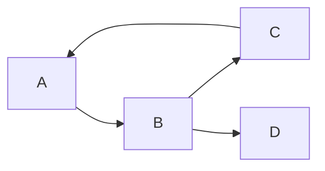
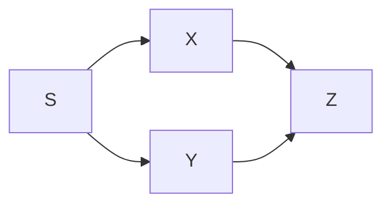

# Depth-first search on a graph

## 1. What this is, and why they ask it

Depth-first search follows one path as far as it goes, and only when it can go no further does it back up and
try the next option. Where [BFS](../day-127-graph-bfs/README.md) spreads out in rings, DFS commits to a
direction and sees it through.

The code is shorter than BFS — five lines, recursive — and the shape is one you already know from
[day 100](../day-100-dfs-traversals/README.md), where it walked a tree. As with BFS, the whole difference on
a graph is the `seen` set, because a graph has cycles.

They ask DFS because a specific family of problems has no good BFS answer. Cycle detection needs to know
which vertices are on the *current path*, and only DFS has a current path. Topological sort falls out of the
order DFS finishes vertices in. Connected components, bridges, articulation points, strongly connected
components — all DFS. **BFS answers "how far"; DFS answers "what is the structure".** Knowing which question
you have is most of what is being tested.

There is also a practical trap they enjoy: the recursive version is elegant and blows the stack on a graph
with a hundred thousand vertices in a line. Being able to write the iterative version, and knowing when you
need it, separates people who have used this from people who have read about it.

By the end of this lesson you can write DFS recursively and iteratively, say precisely when each is right,
handle a disconnected graph, explain the three colours that make cycle detection work, and name the two
problems where DFS is the only reasonable answer.

---

## 2. The story

The wedding is on Sunday and the chain is not where it should be.

Sushila has been standing in front of the steel almirah in the back bedroom since half past nine. She knows
the chain is in this room. She put it away herself after her niece's engagement, and she remembers thinking at
the time that she would not forget where.

She starts at the top shelf, on the left. There is a stack of folded sarees, and behind them a tin — the old
Britannia one — and she pulls the tin out and opens it. Inside the tin there are four small cloth pouches.
She opens the first pouch. Bangles. Second pouch: two rings and a broken earring. Third: buttons, for some
reason. Fourth: empty.

She puts the four pouches back in the tin, in the order she took them out, and the tin back behind the
sarees, and only then does she move her hand to the next thing on the top shelf.

This is how she does it, and it is why she is slow and why she will find it. She does not look in the tin,
then get distracted and look in a box on the middle shelf, then come back. She finishes the tin. Completely.
Every pouch inside it, and every fold of cloth inside every pouch, before the tin goes back.

Her daughter-in-law, who came in at ten to help, does not work this way at all and it is driving Sushila
slightly mad. The girl opens the tin, looks in one pouch, then opens a plastic box on the middle shelf, then
goes to the drawer, then comes back to the tin and cannot remember whether she checked the second pouch or
not.

By eleven Sushila is on the middle shelf. Two boxes down, and inside the second box, under a folded shawl,
there is a smaller box she does not recognise. She opens it. Inside is a paper packet, and inside the packet,
in cotton wool, is a set of her mother's bangles that she has not seen for nine years and had assumed were
gone.

She sits down on the bed with them for a while.

Then she puts the cotton wool back, and the packet in the small box, and the small box under the shawl, and
the shawl in the big box, and the big box back on the middle shelf. And she carries on with the third box,
because she has not finished the middle shelf.

She finds the chain at twenty to twelve, in the bottom drawer, in a bank envelope, exactly where a sensible
person would have put it.

---

## 3. The idea in plain English

Sushila's search is a depth-first search, and her daughter-in-law's is what happens without the discipline.

**Go deep before you go wide.** The tin is on the top shelf, and inside the tin are four pouches. DFS opens
the tin and finishes *everything inside it* before looking at the next item on the shelf. BFS would have
looked at every item on the top shelf first, then everything one level inside each of them, and so on. Same
almirah, different order.

**The call stack is the "where I am" record.** When Sushila opens the tin, then the pouch, she is three
levels deep: shelf, tin, pouch. In a recursive program that is three stack frames. Each one remembers what it
was in the middle of, so that when the pouch is finished, the tin knows which pouch is next. **You never write
that bookkeeping; the recursion does it.** You met this on [day 88](../day-088-the-call-stack/README.md).

**Backing out is the return.** Putting the pouches back and the tin back is the function returning. This is
the part people underestimate: in DFS, *finishing* a vertex is a real event, distinct from *starting* it, and
several important algorithms depend on the difference.

**The `seen` set is "I already looked there".** The daughter-in-law's problem is that she has no record, so
she re-opens the tin. In a graph with cycles, no record means an infinite loop. **Every graph DFS needs a
`seen` set** — the same non-negotiable rule as BFS, and for the same reason.

**Now the property that makes DFS different from BFS, and it is not about speed.** Both are `O(V + E)`. Both
visit every reachable vertex exactly once. What differs is *what you know while you are running*.

**At any moment during a DFS, there is a current path** — shelf → tin → pouch — and you know exactly which
vertices are on it. BFS has no such thing; its queue holds a scattered ring of vertices with no relationship
to each other.

That current path is the whole reason DFS exists as a separate tool:

- **Cycle detection.** A cycle is an edge that points back to a vertex on the *current path*. If you reach a
  vertex you have seen before but which is *finished*, that is not a cycle — it is just a different route to
  somewhere you already explored. Only DFS can tell those two cases apart, and the machinery for doing it is
  the three colours below.
- **Topological sort.** The order in which DFS *finishes* vertices, reversed, is a valid dependency order.
  That falls out for free, and it is [day 134](../day-134-topological-sort/README.md).
- **Path-shaped questions.** "Is there a path with this property", "find all paths", "what is the longest
  path in a tree" — all need the current path, all are DFS.

**The three colours.** For directed graphs you need three states per vertex, not two:

- **White** — not visited yet.
- **Grey** — visiting: started, not finished, **on the current path right now**.
- **Black** — finished: it and everything below it are done.

An edge to a **grey** vertex is a cycle, because grey means "I am inside this call, above you on the path".
An edge to a **black** vertex is fine. **Two states cannot distinguish these**, and that is exactly the bug in
most first attempts at directed cycle detection. It is [day 133](../day-133-directed-cycles/README.md), and
today you meet the vocabulary.

**Recursion is elegant and has a hard limit.** Python allows about a thousand nested calls by default. A graph
that is a straight line of a hundred thousand vertices needs a hundred thousand frames. The iterative version
with an explicit stack has no such limit, and **on any graph where `V` could exceed a few thousand, you write
the iterative one.**

**And DFS gives no shortest-path guarantee.** It finds *a* path, often a long and silly one. If the question
says "fewest", it is BFS. If the question says "is there" or "what is the structure", it is DFS.

---

## 4. The picture

The same graph, walked both ways, so the difference is visible:

```
graph:   A -- B      A -- C      B -- D      C -- E      D -- F

              A
            /   \
           B     C
           |     |
           D     E
           |
           F

DFS from A (taking B before C):        BFS from A:

  A                                      A
  +- B                                   +- B   C          <- ring 1
  |  +- D                                +- D   E          <- ring 2
  |     +- F                             +- F              <- ring 3
  +- C
     +- E

  visit order: A B D F C E              visit order: A B C D E F
  goes to the BOTTOM of the             finishes each ring
  B branch before touching C            before starting the next
```

**What to notice.** DFS reaches `F`, which is three steps away, before it touches `C`, which is one step away.
That is not a flaw — it is the definition. If the question is "how far is C", DFS is the wrong tool.

The three colours, on a directed graph with a cycle:



```
step  action              A      B      C      D     current path
----  ------------------  -----  -----  -----  ----  --------------
 1    enter A             grey   white  white  white  A
 2    enter B             grey   grey   white  white  A B
 3    enter C             grey   grey   grey   white  A B C
 4    C looks at A        grey   grey   grey   white  A B C
      A is GREY  ->  CYCLE FOUND: A is above us on the path
```

**What to notice at step 4.** `A` has been seen, and that alone tells you nothing. What matters is that `A` is
**grey** — the call to `A` has started and not returned, so `A` is on the path from the root to here, and an
edge back to it closes a loop. If `A` had been black, `C → A` would just be a second route into a finished
region.

And the case that a two-state check gets wrong:



```
DFS from S: S, X, Z (finish Z, finish X), then Y, and Y looks at Z.

Z has been SEEN.  A two-state check says "cycle!".
Z is BLACK.       Three states say "finished region, not a cycle".

There is no cycle in this graph. The two-state version is wrong.
```

**What to notice.** This shape — two paths converging on the same vertex — is completely ordinary. Any
directed graph with a shared dependency has it. The two-state cycle detector reports a cycle on a perfectly
valid dependency graph, which means "these courses cannot be completed" for a course list that is fine.

---

## 5. The code, built step by step

The recursive version first, because it is the one you should be able to write in thirty seconds.

```python
def dfs(graph: dict[int, list[int]], start: int) -> set[int]:
    seen: set[int] = set()

    def visit(vertex: int) -> None:
        seen.add(vertex)                        # mark on ENTRY
        for neighbour in graph[vertex]:
            if neighbour not in seen:
                visit(neighbour)

    visit(start)
    return seen
```

Five lines of actual work. Mark on entry — not after the loop — or a cycle sends you round again before the
mark ever happens.

Note the difference from BFS: there the mark went next to the *push*, here it goes at the top of the *call*.
Both mean the same thing: record it the instant you commit to it.

Now the iterative version, which is what you write when `V` might be large.

```python
def dfs_iterative(graph: dict[int, list[int]], start: int) -> list[int]:
    seen = {start}
    stack = [start]
    order = []
    while stack:
        vertex = stack.pop()                    # pop() from the END: a stack
        order.append(vertex)
        for neighbour in reversed(graph[vertex]):
            if neighbour not in seen:
                seen.add(neighbour)
                stack.append(neighbour)
    return order
```

**This is BFS with one character changed.** `queue.popleft()` becomes `stack.pop()`, and first-in-first-out
becomes last-in-first-out. That is the entire difference between the two algorithms, and it is worth saying
out loud in an interview because it shows you see the shared shape.

`reversed()` is cosmetic: pushing neighbours in reverse means they come off the stack in the original order,
so the visit order matches the recursive version. Drop it and the traversal is still correct, just mirrored.

**But this version cannot tell you when a vertex finishes.** It visits in something close to DFS order and
never runs any "on the way back out" code. For cycle detection and topological sort you need the finish event,
which means a slightly different iterative shape:

```python
def dfs_with_finish(graph: dict[int, list[int]], start: int) -> list[int]:
    """Iterative DFS that also reports finish order, using explicit markers."""
    seen: set[int] = set()
    finished: list[int] = []
    stack: list[tuple[int, bool]] = [(start, False)]
    while stack:
        vertex, done = stack.pop()
        if done:                                # second visit: everything below is finished
            finished.append(vertex)
            continue
        if vertex in seen:
            continue
        seen.add(vertex)
        stack.append((vertex, True))            # push the "finish me later" marker FIRST
        for neighbour in reversed(graph[vertex]):
            if neighbour not in seen:
                stack.append((neighbour, False))
    return finished
```

The trick is the boolean flag. Each vertex is pushed twice: once to be entered, and once — underneath all its
children — to be finished. When the marker comes back off the stack, everything below that vertex has already
been processed. **This is the standard way to convert any recursive post-order into an iterative one**, and it
is worth learning as a pattern rather than as a one-off.

Now the three colours, for directed cycle detection:

```python
WHITE, GREY, BLACK = 0, 1, 2

def has_cycle(graph: dict[int, list[int]], n: int) -> bool:
    colour = [WHITE] * n

    def visit(vertex: int) -> bool:
        colour[vertex] = GREY                   # on the current path
        for neighbour in graph[vertex]:
            if colour[neighbour] == GREY:
                return True                     # back edge: a cycle
            if colour[neighbour] == WHITE and visit(neighbour):
                return True
        colour[vertex] = BLACK                  # done, and everything below is done
        return False

    return any(colour[v] == WHITE and visit(v) for v in range(n))
```

Read the two colour checks. `GREY` means "this vertex is an ancestor on the path I am currently on", so an
edge to it closes a loop. `BLACK` is skipped silently — it is a finished region, and re-entering it would
only waste time.

The `any(...)` at the end is the outer loop over all vertices. **A directed graph can easily have a cycle that
is unreachable from vertex 0**, so starting from one vertex is not enough. This is the disconnected-graph
mistake in its most damaging form.

And the undirected version, which needs a different check entirely:

```python
def has_cycle_undirected(graph: dict[int, list[int]], n: int) -> bool:
    seen = [False] * n

    def visit(vertex: int, parent: int) -> bool:
        seen[vertex] = True
        for neighbour in graph[vertex]:
            if not seen[neighbour]:
                if visit(neighbour, vertex):
                    return True
            elif neighbour != parent:           # seen, and not where we came from
                return True
        return False

    return any(not seen[v] and visit(v, -1) for v in range(n))
```

**In an undirected graph every edge looks like a back edge**, because `A—B` puts `A` in `B`'s adjacency list
and vice versa. So `B` looking at `A` and finding it seen is not a cycle — it is the edge you just walked. The
`parent` parameter excludes exactly that one case. No colours needed, because there is no direction to be
confused about. This is [day 132](../day-132-undirected-cycles/README.md).

### The complete solution

```python
"""Depth-first search on a graph: recursive, iterative, components, and cycles."""

from __future__ import annotations

import sys
from collections import defaultdict

WHITE, GREY, BLACK = 0, 1, 2


def build(edges: list[tuple[int, int]], n: int, directed: bool = False) -> dict[int, list[int]]:
    graph: dict[int, list[int]] = {v: [] for v in range(n)}
    for a, b in edges:
        graph[a].append(b)
        if not directed:
            graph[b].append(a)
    return graph


def dfs_recursive(graph: dict[int, list[int]], start: int) -> list[int]:
    """Visit order. Elegant; limited by Python's recursion depth (~1000)."""
    seen: set[int] = set()
    order: list[int] = []

    def visit(vertex: int) -> None:
        seen.add(vertex)
        order.append(vertex)
        for neighbour in graph[vertex]:
            if neighbour not in seen:
                visit(neighbour)

    visit(start)
    return order


def dfs_iterative(graph: dict[int, list[int]], start: int) -> list[int]:
    """Same traversal, no recursion limit. BFS with a stack instead of a queue."""
    seen = {start}
    stack = [start]
    order: list[int] = []
    while stack:
        vertex = stack.pop()
        order.append(vertex)
        for neighbour in reversed(graph[vertex]):
            if neighbour not in seen:
                seen.add(neighbour)
                stack.append(neighbour)
    return order


def components(graph: dict[int, list[int]]) -> list[list[int]]:
    """Every piece. The outer loop is the whole point."""
    seen: set[int] = set()
    pieces: list[list[int]] = []
    for start in graph:
        if start in seen:
            continue
        piece, stack = [], [start]
        seen.add(start)
        while stack:
            vertex = stack.pop()
            piece.append(vertex)
            for neighbour in graph[vertex]:
                if neighbour not in seen:
                    seen.add(neighbour)
                    stack.append(neighbour)
        pieces.append(sorted(piece))
    return pieces


def has_cycle_directed(graph: dict[int, list[int]], n: int) -> bool:
    """Three colours. GREY means 'on the current path', which is the cycle test."""
    colour = [WHITE] * n

    def visit(vertex: int) -> bool:
        colour[vertex] = GREY
        for neighbour in graph[vertex]:
            if colour[neighbour] == GREY:
                return True
            if colour[neighbour] == WHITE and visit(neighbour):
                return True
        colour[vertex] = BLACK
        return False

    return any(colour[v] == WHITE and visit(v) for v in range(n))


if __name__ == "__main__":
    undirected = build([(0, 1), (0, 2), (1, 3), (2, 4), (3, 5), (6, 7)], 8)
    print("recursive :", dfs_recursive(undirected, 0))
    print("iterative :", dfs_iterative(undirected, 0))
    print("components:", components(undirected))

    acyclic = build([(0, 1), (0, 2), (1, 3), (2, 3)], 4, directed=True)
    cyclic = build([(0, 1), (1, 2), (2, 0), (1, 3)], 4, directed=True)
    print("diamond has cycle?", has_cycle_directed(acyclic, 4))
    print("triangle has cycle?", has_cycle_directed(cyclic, 4))

    # The recursion limit, demonstrated.
    line = build([(i, i + 1) for i in range(5000)], 5001)
    print("iterative on a 5,000-long chain:", len(dfs_iterative(line, 0)))
    try:
        dfs_recursive(line, 0)
    except RecursionError as error:
        print("recursive on the same chain:", type(error).__name__, "-", error)
```

Running it:

```
recursive : [0, 1, 3, 5, 2, 4]
iterative : [0, 1, 3, 5, 2, 4]
components: [[0, 1, 2, 3, 4, 5], [6, 7]]
diamond has cycle? False
triangle has cycle? True
iterative on a 5,000-long chain: 5001
recursive on the same chain: RecursionError - maximum recursion depth exceeded
```

Three things to look at. The first two lines are identical, which is the point of `reversed()`. The diamond —
`0→1→3` and `0→2→3` — correctly reports **no** cycle, which a two-state check would get wrong. And the last
two lines are the reason the iterative version exists: the same graph, one function works and one does not.

---

## 6. What it costs

**Time is identical to BFS**, and for the same reason.

```
each vertex is entered once                    V
for each, scan its neighbours                  degree(v)
sum of degrees                                 2E undirected, E directed
                                               -------------------------
                                               V + 2E  ->  O(V + E)
```

**DFS and BFS have exactly the same complexity.** They differ in the *order* of the visits and in *what
information is available* during the run, not in the amount of work. If you ever say one is faster than the
other, you have said something false.

**Space is where they differ in character, though not in the bound.**

```
seen set             O(V)
call stack (or explicit stack)   O(depth of the deepest path)
```

Both are `O(V)` in the worst case, but the shapes that hit the worst case are opposite:

```
                       BFS peak            DFS peak
star graph             1,000,000 (ring 1)  2
(one hub, many leaves)

path graph             2                   1,000,000 (the whole chain)
(a straight line)
```

**BFS is expensive on wide graphs; DFS is expensive on deep ones.** That is a genuinely useful thing to say
when asked which to use, and it is the one memory difference between them.

**The recursion limit, with numbers.**

```
Python's default recursion limit         1,000
frames already used before your call     ~ 20-40
usable depth                             ~ 960

a graph that is a chain of 5,000 vertices needs 5,000 frames
                                         -> RecursionError
```

Raising the limit is possible and is usually the wrong answer:

```python
sys.setrecursionlimit(200_000)
```

Each Python frame is roughly 500 bytes of interpreter state plus C stack, and the C stack is typically 8 MB
by default:

```
200,000 frames x ~1 KB of C stack        = 200 MB
                                         -> Segmentation fault (not a Python error)
```

**A segfault is worse than a `RecursionError`** — no traceback, no message, nothing to debug. So: use the
iterative version when `V` might exceed a few thousand, and mention that you know `setrecursionlimit` exists
and why you did not use it.

**On a grid**, which is the most common implicit graph:

```
1,000 x 1,000 grid of all-passable cells
V = 1,000,000
worst-case DFS depth = 1,000,000 (a snaking path through every cell)
                     -> recursion is impossible; iterative is mandatory
```

This is the exact case that fails on LeetCode's larger island problems, and it fails as a segfault or a stack
overflow rather than as anything readable.

**The extra cost of the finish-order version.**

```
plain iterative DFS       V pushes
with finish markers       2V pushes (each vertex pushed twice)
                          -> same O(V + E), 2x the stack traffic
```

Twice the pushes, same complexity. Worth it only when you actually need the finish event — cycle detection,
topological sort, strongly connected components.

---

## 7. The traps

### `RecursionError` on a deep graph

The most common real failure:

```
Traceback (most recent call last):
  File "dfs.py", line 21, in visit
    visit(neighbour)
  File "dfs.py", line 21, in visit
    visit(neighbour)
  [Previous line repeated 995 more times]
RecursionError: maximum recursion depth exceeded
```

It does not need an unusual graph. A linked-list-shaped graph, a long corridor in a grid, a chain of package
dependencies — all reach a thousand easily. **The tell in the constraints is `n <= 10^5`.** If you see that,
write the iterative version.

And do not "fix" it with `sys.setrecursionlimit(10**6)`:

```
Segmentation fault (core dumped)
```

That is what happens when Python's limit is raised past what the C stack can hold. You have replaced a clear
error with an unclear crash.

### Marking after the loop instead of on entry

```python
def visit(vertex):
    for neighbour in graph[vertex]:
        if neighbour not in seen:
            visit(neighbour)
    seen.add(vertex)          # <- too late
```

On any graph with a cycle, `A` calls `B` calls `A` — and `A` is not in `seen` yet, because it is still inside
its loop:

```
RecursionError: maximum recursion depth exceeded
```

Mark on entry, first line of the function. The same rule as BFS's "mark on push".

### Two states instead of three, on a directed graph

```python
def visit(vertex):
    seen.add(vertex)
    for neighbour in graph[vertex]:
        if neighbour in seen:
            return True                 # "cycle"
        if visit(neighbour):
            return True
    return False
```

On the diamond `0→1→3`, `0→2→3`:

```
>>> has_cycle_two_state(diamond, 4)
True
```

There is no cycle. `3` was reached from `1`, finished, and then `2` looked at it and found it seen. **Seen
does not mean on the current path.** You need grey and black, or an explicit "currently on the stack" set
alongside `seen`.

### Forgetting the parent check on an undirected graph

```python
def visit(vertex):
    seen[vertex] = True
    for neighbour in graph[vertex]:
        if seen[neighbour]:
            return True                 # "cycle"
        ...
```

```
>>> has_cycle_undirected_broken({0: [1], 1: [0]}, 2)
True
```

Two vertices and one edge, and it reports a cycle. `0` walks to `1`; `1` looks at `0` and finds it seen. But
that is the same edge, walked backwards. **In an undirected graph every edge appears in both adjacency lists**,
so you must exclude the vertex you came from.

The subtlety: excluding by *vertex* is wrong if the graph can have two parallel edges between the same pair,
because those genuinely are a cycle. If parallel edges are possible, exclude by *edge* instead.

### Only searching from one start

```python
if has_cycle_from(graph, 0):
    ...
```

A directed graph can have a cycle in a region unreachable from vertex 0. On a course-schedule problem where
courses 5, 6 and 7 form a loop that nothing else points into, this reports no cycle and the answer is wrong.
**Wrap it in a loop over every vertex, with `seen` shared across the iterations.**

### Assuming DFS finds the shortest path

```python
path = dfs_path(graph, "A", "F")
print(len(path))                        # "the shortest distance"
```

It is *a* path. On the story's graph, DFS from `A` might reach `F` via `B → D → F` or, with a different
adjacency order, wander through half the graph first. There is no guarantee and no partial one. **"Fewest" is
BFS. Always.**

---

## 8. In the interview

### How it gets asked

- *"Traverse this graph depth-first. What if it is disconnected?"* — the direct version, and the second half
  is what is actually being tested.
- *"Does this directed graph contain a cycle?"* — the three-colours question.
- *"Count the connected components / count the islands."* — either traversal works; DFS is shorter.
- *"Find all paths from A to B."* — DFS, because it needs the current path.
- *"Your solution works on the small cases and crashes on the big one."* — recursion depth.
- *"BFS or DFS here, and why?"* — the question that wants the one-line rule.

### The first ninety seconds

> "DFS: go as deep as possible down one branch before backing up. Recursively it is five lines — mark on
> entry, then for each unseen neighbour, recurse. The mark has to be the first line of the function, not after
> the loop, or a cycle re-enters before the mark happens.
>
> Two things I would say before writing it.
>
> First, **it needs an outer loop over every vertex**, because the graph is probably not connected and a
> single start only finds its own component. For a directed graph this matters even more — a cycle can sit in
> a region nothing points into, so starting from vertex 0 can report 'no cycle' on a graph that has one. The
> `seen` set lives outside the loop so a vertex found in one component never starts a new one.
>
> Second, **I would write it iteratively if `n` can be large.** Python's recursion limit is about a thousand
> usable frames, and a graph that is a straight line of a hundred thousand vertices needs a hundred thousand.
> Raising the limit trades a `RecursionError` for a segmentation fault, which is worse because there is no
> traceback. The iterative version is BFS with `stack.pop()` instead of `queue.popleft()` — genuinely one
> character of difference — so it costs nothing to write.
>
> Cost is `O(V + E)` time and `O(V)` space, exactly the same as BFS. **They differ in what you know while
> running, not in how much work they do.** DFS has a current path, which is what cycle detection and
> topological sort need. BFS has rings, which is what shortest path needs.
>
> Which is it here — do you want reachability, or is there something about the structure you need?"

### The follow-ups

**"BFS or DFS? Give me the rule."**

> "One line: **'fewest' or 'shortest' means BFS; 'is there' or anything about structure means DFS.**
>
> The reason is what each one has available. BFS finishes ring `k` before ring `k+1`, so the first time it
> reaches a vertex it is by the fewest edges — that guarantee is the only reason to prefer it, and it only
> holds when every edge costs the same.
>
> DFS has a current path — the chain of calls from the root to where I am now — and BFS has nothing
> equivalent, because its queue holds a scattered ring. Cycle detection needs to ask 'is this vertex on my
> current path'. Topological sort needs to know when a vertex *finishes*, which only DFS has a notion of.
> Finding all paths needs the path.
>
> If neither property matters — 'count the components', 'is B reachable from A' — either works and I would
> pick DFS because it is shorter, unless the graph might be deep, in which case BFS avoids the stack problem
> without any extra code.
>
> And on memory, they fail on opposite shapes: BFS's queue holds the widest level, so a hub with a million
> neighbours is expensive; DFS's stack holds the longest path, so a million-vertex chain is expensive."

**"Why three colours? Two seems enough."**

> "Because 'seen' answers the wrong question. What I need to know is not 'have I been here' but 'am I here
> right now, higher up on this same path' — because a cycle is an edge that points back at an ancestor.
>
> Concretely: take a diamond, `0→1→3` and `0→2→3`. DFS goes 0, 1, 3, finishes 3, finishes 1, comes back to 0,
> goes to 2, and 2 looks at 3. With two states, 3 is 'seen' and I report a cycle. There is no cycle — 3 is a
> shared dependency, which is completely normal in any real dependency graph.
>
> Three states fix it. Grey means started and not finished, so it is on the current path and an edge to it is
> a genuine back edge. Black means finished, so it and everything below it are done and an edge to it is just
> a second route into explored territory — I skip it silently.
>
> The equivalent formulation, if colours feel heavy, is a `seen` set plus an `on_stack` set, with vertices
> removed from `on_stack` as the call returns. Same thing, and the removal on the way out is the part people
> forget.
>
> This is also exactly why undirected cycle detection is a *different* algorithm rather than the same one:
> there, every edge appears in both adjacency lists, so every edge looks like a back edge, and the fix is to
> exclude the vertex you came from rather than to track colours."

**"Convert your recursive DFS to iterative, including the finish order."**

> "The plain conversion is easy: a stack, pop from the end, push unseen neighbours. That gives me the same
> visit order — reversed if I want to match exactly — and removes the depth limit.
>
> What that version loses is the finish event. Recursion gives me 'on the way back out' for free; a plain
> stack loop has no equivalent moment.
>
> The standard fix is to push each vertex twice with a flag. When I first pop a vertex I push it straight back
> with the flag set, *then* push its children on top. Because the children are above it on the stack, they all
> get fully processed before the flagged copy comes back off — and when it does, everything below that vertex
> is finished. So the flagged pop is exactly the recursive function's return point.
>
> That doubles the number of pushes, which is the same complexity and about twice the stack traffic, and it is
> the general recipe for turning any post-order recursion into a loop. I would use it for topological sort and
> for strongly connected components; for plain traversal I would not bother."

**"Find all paths from A to B."**

> "DFS, and this is the one case where the `seen` set works differently, which is worth flagging because it
> looks like a bug.
>
> For a normal traversal, once a vertex is seen it is never revisited. Here, a vertex that is not on the
> *current* path may well be on a different valid path, so I mark it on entry and **unmark it on the way out**
> — that is backtracking, from [day 94](../day-094-backtracking/README.md). What I am tracking is not 'have I
> ever visited' but 'is this on the path I am currently building', which is exactly the grey set again.
>
> The cost is completely different from a traversal. There is no `O(V + E)` bound, because the number of
> paths can be exponential — a graph of `k` diamonds in series has `2^k` paths — so the honest complexity is
> `O(number of paths × path length)`, output-bound rather than graph-bound.
>
> So the first thing I would ask is whether they want all the paths or just the count, because on a DAG the
> count is a simple DP over vertices in topological order and is linear, while enumerating them cannot be."

### The model answer

*"Given `n` courses numbered 0 to n−1 and a list of prerequisite pairs, determine whether all courses can be
finished."*

> "Let me state the model, then the algorithm, then the two things that make it wrong if I skip them.
>
> **A vertex is a course. An edge from A to B means A must be taken before B** — so it is directed, and the
> question 'can all courses be finished' is exactly 'is this graph acyclic', because a cycle is a set of
> courses each waiting on another with no possible starting point.
>
> **So: directed cycle detection with three colours.** White is untouched, grey is 'started, on my current
> path', black is 'finished'. I DFS from every white vertex; if I ever reach a grey vertex, that vertex is an
> ancestor of where I am now and I have closed a loop, so I return true for 'has cycle'. Reaching a black
> vertex is fine and I skip it.
>
> **The first thing that makes it wrong if I skip it is two states instead of three.** Prerequisite graphs are
> full of shared dependencies — two courses both requiring linear algebra — and a two-state check reports a
> cycle on that perfectly valid shape. I would say this out loud because it is the actual bug in most
> submissions.
>
> **The second is the outer loop.** A course catalogue is not a connected graph, and a cycle can easily sit
> among courses that nothing else points into. Starting from course 0 and stopping would report success on a
> catalogue that is broken. So the loop is over all `n` vertices, with the colour array shared.
>
> **The third thing, which is about the input rather than the algorithm: I would build the adjacency list
> from `range(n)`, not from the pairs**, so that a course with no prerequisites and no dependents still exists
> in the structure. Otherwise my outer loop silently skips it — harmless here, but the same omission breaks
> the follow-up question about ordering.
>
> **Cost:** `O(V + E)` time, `O(V)` space for the colours and the stack. With `n` up to ten thousand and edges
> similar, that is instant.
>
> **On recursion:** the constraints here allow `n = 10^5` in the harder variant, and a chain of a hundred
> thousand prerequisites is a legal input, so I would write it iteratively with an explicit stack and the
> two-push finish marker. If the constraints were small I would write it recursively for readability and say
> that I was choosing readability knowingly.
>
> **And the follow-up they will ask is 'now give me a valid order',** which is the same traversal with one
> addition: append each vertex to a list when it turns black, then reverse the list. That reversed finish
> order is a topological sort, and it comes free from the algorithm I have already written — which is a good
> reason to build the three-colour version rather than a two-set version even when the question only asks for
> yes or no."

---

## 9. Recall card

**DFS goes deep, then backs up.** Recursively: mark on entry — first line, not after the loop — then recurse
into unseen neighbours. Iteratively: it is BFS with `stack.pop()` instead of `queue.popleft()`.

**Same `O(V + E)` as BFS.** The difference is what you know while running: DFS has a **current path**, BFS has
rings. Fewest steps → BFS. Cycles, topological order, all-paths, structure → DFS.

**Three colours for directed cycles.** White unvisited, **grey = on the current path**, black finished. An
edge to grey is a cycle; an edge to black is a shared dependency and is fine. Two states report a cycle on a
plain diamond.

**Undirected is a different check:** every edge appears in both adjacency lists, so exclude the vertex you
came from rather than tracking colours.

**Write it iteratively when `n` can exceed a few thousand.** ~960 usable frames by default, and
`setrecursionlimit` turns a `RecursionError` into a segfault. And always loop over every vertex — a directed
cycle can hide in a region nothing points into.
