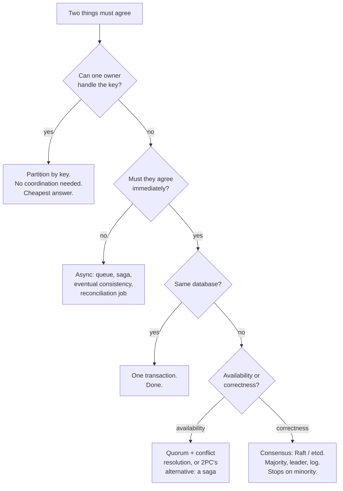

# Distributed systems revision and interview questions

## 1. What this is, and why they ask it

Sixteen days ago you did not know what a quorum was. Today the phase closes, and the way to close it is not to
reread it — it is to answer questions about a system you have never seen, out loud, with someone pushing back.

This lesson has two halves. The first compresses the phase into the shape it actually has: one problem, and
about eight responses to it. The second is a mock design round on an unseen system, written out — the
questions in the order they come, and what a good answer sounds like, including the parts where you have to
say "I do not know, here is how I would find out".

The reason this phase matters more than its size suggests is that **it is the part of system design that
cannot be memorised.** You can memorise what Kafka is. You cannot memorise what happens when the payment
succeeded but the reply was lost, because the answer depends on the system in front of you. Interviewers know
this, which is why the follow-ups in a senior design round almost always walk into this territory: *what if
that node dies, what if that message arrives twice, what if the two of them disagree.*

By the end of today you can state the one problem underneath the whole phase, name the eight responses to it
and when each applies, quote the dozen numbers that make an answer concrete, and take an unseen design from
"what if it fails" to a defended answer.

---

## 2. The story

Sunil has catered four hundred and six weddings and he no longer thinks about food.

He thinks about the gas.

Eleven years ago, at a wedding in Panvel, two cylinders ran out within twenty minutes of each other at a
quarter past eight, with four hundred people waiting, and it took ninety minutes to get replacements from a
shop that had already closed. He has never forgotten it and it has shaped everything he has done since.

So now he carries a spare cylinder for every two in use. Not one spare — one per two. It costs him money and
space in the van and he does it every single time, including for a lunch for sixty.

There are eleven of these rules and they are all like that.

He never sends both vans by the same road. If there is a way to go by the highway and a way to go through the
town, the rice and the vegetables go one way and the sweets and the serving staff go the other. Two vans, two
roads, because a lorry turned over on the Pune highway in 2019 and everything he owned was behind it for four
hours.

He arrives with food for fifteen percent more people than he was told. Every family under-counts. Every one of
them.

He puts one man at the entrance whose only job is to count people going in and to tell Sunil the number at
half past seven. That man does nothing else all evening. His nephew thinks it is a waste of a person.

And the rule his nephew argues with most: if the sweet is going to be late, Sunil takes it off the counter and
puts out fruit instead, and he decides that at eight o'clock, not at nine when people are already standing
there. Something is served. It is not what was promised. Nobody complains about fruit; everybody complains
about an empty counter with a sign on it.

His nephew asked him once, quite reasonably, why he does not just work with better suppliers so that none of
this is necessary.

Sunil said something that the nephew repeated to other people for years afterwards, usually getting it
slightly wrong.

What he said was that he has worked with the best suppliers in the district for twenty years, and the good
ones fail about as often as the bad ones — they just fail less stupidly. The gas runs out. The van is late.
The count is wrong. It is going to happen at some percentage of four hundred weddings no matter who he hires,
and the only question that has ever mattered is whether the guests find out.

---

## 3. The idea in plain English

Sunil has arrived at the single idea underneath this entire phase.

**One problem: partial failure.** A distributed system is one where some of it can be broken while the rest
carries on. That sounds mild and it is the source of every difficulty in sixteen days of material. In a single
program, a component either works or the whole program crashes. In a distributed system, one machine is
unreachable while nine are fine, and the nine have to decide what to do about it — **without being able to
tell whether the tenth is dead, slow, or perfectly healthy behind a broken cable.**

Everything in the phase is a response to that. Here are the eight, each in one line, each with the day it
came from.

**1. You cannot tell dead from slow.** [Day 124](../day-124-tries-revision/README.md). Heartbeats and timeouts
produce a *suspicion*, never a fact, and every timeout is a bet between declaring healthy nodes dead and
sending work to corpses.

**2. A timeout is not a failure — it is an unknown.** [Day 122](../day-122-autocomplete/README.md). The request
may have succeeded with the reply lost. Which is why retrying is only safe when the operation is idempotent,
and why every write worth money carries a client-generated key.

**3. Time does not order events.** [Day 123](../day-123-word-search-ii/README.md). Clock skew exceeds the gap
between related events routinely, so you order by causality — happens-before, Lamport counters, vector clocks
— and use the monotonic clock for every duration.

**4. You cannot have consistency and availability during a partition.** Days 113–115. CAP is a forced choice
that only bites while the network is broken, and the real spectrum is linearizable at one end and eventually
consistent at the other, with session guarantees in between.

**5. Agreement costs a majority.** Days 116–119. A quorum — `R + W > N` — gives you overlap; Raft gives you an
agreed order via a replicated log and a leader with a lease. Both need more than half the nodes, and both stop
serving writes when they cannot get one.

**6. Atomicity across services is a lie you replace with compensation.** Days 120–121. Two-phase commit gives
real atomicity and blocks on the coordinator; a saga gives eventual atomicity with compensating transactions,
no isolation, and an outbox to make the write and the event atomic.

**7. Retrying makes small failures invisible and large ones worse.** [Day 125](../day-125-what-a-graph-is/README.md).
Exponential backoff with **full jitter**, a retry budget, and retries at exactly one layer.

**8. Bound everything, and fail fast when the bound is hit.**
[Day 126](../day-126-graph-representation/README.md). A bulkhead per dependency and a circuit breaker on top,
because the service that dies is usually the healthy one in front of the slow one.

**And the ninth, which is not a mechanism but a stance, and is Sunil's actual point:** you do not prevent
failure, you make it survivable. Fencing tokens instead of a better failure detector. Idempotency instead of
exactly-once delivery. A degraded response instead of an error. Fruit instead of an empty counter.

**The recognition question for this whole phase, in one line:** *what happens if this component is
unreachable, and what does the user see?* If you cannot answer both halves for every box in your diagram, the
design is not finished.

**And the three answers that are always available**, in the order to reach for them:

1. **Remove the coordination.** One owner per key, a unique constraint, a conditional write, an idempotent
   operation. Cheapest, safest, and always worth a sentence before anything else.
2. **Bound the damage.** Bulkheads, budgets, quorums, leases. Nothing is unlimited.
3. **Make being wrong survivable.** Fencing, compensation, reconciliation, expiry jobs.

---

## 4. The picture

The whole phase as one decision path:



**What to notice.** The first question throws out the most work, and most real designs land in the top two
boxes. Reaching for consensus is a strong move that should be justified, not a default.

And the failure ladder — what happens to one request as things go wrong, with the day each defence came from:

```
request arrives
    |
    v
[bulkhead]  permits left for this dependency?   <- day 126
    | no -> reject instantly, fallback
    v yes
[breaker]   is this dependency known-broken?    <- day 126
    | open -> fail fast, fallback
    v closed
[idempotency key] have I done this already?     <- day 122
    | yes -> return the stored response
    v no
[retry policy] backoff + full jitter, budget    <- day 125
    v
[the call]  ---- timeout ----> UNKNOWN, not failed   <- day 122
    |                              |
    v success                      v
[fencing token checked at          retry if idempotent,
 the storage layer]  <- day 124    else reconcile later
    v
[write + outbox in one txn]  <- day 121
```

**What to notice.** Six defences, and each one is cheap. None of them is clever. The design work is knowing
which ones a given request needs, and what the user sees at each exit point.

---

## 5. How it actually works

The compression. Everything worth having automatic, in one place.

### The consistency spectrum

| Level | Guarantee | Cost | Where |
|---|---|---|---|
| Linearizable | Every read sees the latest write, globally | Consensus, a round trip to a majority | etcd, ZooKeeper, Spanner |
| Sequential | Everyone sees the same order, maybe stale | Leader with a log | Raft-backed stores |
| Causal | If A caused B, everyone sees A first | Vector clocks or HLCs | CockroachDB, MongoDB sessions |
| Read-your-writes | You see your own writes | Sticky routing or a session token | Most web apps |
| Eventual | Replicas converge, given quiet | Nothing | Cassandra, DynamoDB default, DNS |

**The move that wins interviews is choosing per-operation, not per-system.** A social feed can be eventually
consistent and its "did my post go through" read must be read-your-writes. Same system, two levels.

### Quorums

```
N replicas, W acknowledge a write, R answer a read
R + W > N   ->  read and write sets overlap  ->  a read sees the latest write
W > N/2     ->  writes are serialised (no two conflicting writes both succeed)
```

```
N=3 W=2 R=2   the standard: survives one node down, both ways
N=3 W=3 R=1   fast reads, no write tolerance
N=3 W=1 R=1   fast everything, eventual consistency, conflicts possible
```

### Raft, in five lines

Leader elected by majority vote with randomised 150–300 ms election timeouts. All writes go to the leader,
which appends to its log and replicates. An entry is **committed** once a majority have it. Followers apply
committed entries in log order. A leader that cannot reach a majority steps down.

**Why it matters in a design:** anything using Raft stops accepting writes when a majority is unreachable.
That is a deliberate availability sacrifice and you should say so when you place it.

### Distributed transactions

**2PC:** prepare, then commit. Real atomicity, and the coordinator's failure between the two phases leaves
every participant holding locks and waiting. Blocking, slow, and it couples availability multiplicatively.

**Saga:** local transactions plus compensating actions. Eventual atomicity, **no isolation**, compensation is
not rollback — a refund is a new transaction with a fee, not an erasure. Order the steps so the irreversible
one is last. Orchestrate beyond about three steps.

**Outbox:** write the business row and the event row in the same local transaction; a publisher polls and
emits. Makes "the write happened" and "the world was told" atomic, at the cost of at-least-once publication.

### Idempotency

Client generates the key, once per logical operation, reused on every retry. Receiver inserts the key with a
unique constraint **before** doing the work, stores the response against it, and returns three ways: fresh,
stored response, or `409` while in flight. Exactly-once delivery is impossible; at-least-once plus idempotent
processing gives exactly-once effect.

### Clocks

Skew 0.1–5 ms in a data centre, 10–100 ms across regions. Order by causality, not timestamps. Monotonic clock
for every duration. Last-write-wins discards data inside the skew window and is Cassandra's default. HLCs are
the modern default; TrueTime buys global order for ~10 ms of commit-wait.

### Failure handling

Detection time = interval × misses allowed. Pick the timeout from the check's p999, not from a guess. Liveness
only checks what a restart fixes. Gossip (SWIM) past a few hundred nodes, with indirect probes. Retries:
exponential backoff, **full jitter**, three attempts, a 10% budget, one layer. Bulkhead per dependency sized by
Little's Law; circuit breaker with a failure *rate* over a recent window and a minimum call volume; and decide
the fallback before you decide the thresholds.

### Locks

`SET key <token> NX PX 30000`, release by Lua script checking the token, watchdog refreshing at a third of the
lease. The paused holder is unfixable — fence at the storage layer. Redis for efficiency locks, etcd or
ZooKeeper for correctness locks. And look for a unique constraint first.

---

## 6. The numbers

The dozen numbers that make an answer concrete. If you can quote these, your answers stop sounding like
vocabulary.

**Latency, the ladder everything is measured against:**

```
memory read                       100 ns
SSD random read                   100 us      (1,000x memory)
same-datacentre round trip        0.5 ms      (5,000x memory)
cross-region round trip (US-EU)   80 ms
cross-planet (US-India)           200 ms
```

**Clocks:**

```
NTP skew, one datacentre          0.1 - 5 ms
NTP skew, across regions          10 - 100 ms
unsynchronised drift              ~2.6 s per day
TrueTime epsilon                  1 - 7 ms; commit-wait ~10 ms per write
```

**Failure detection:**

```
Raft election timeout             150 - 300 ms
Kubernetes liveness default       10 s x 3 = 30 s
AWS ALB health check default      30 s x 2 = 60 s
Redis Sentinel down-after         30 s
ZooKeeper session                 4 - 40 s
```

**Retries and breakers:**

```
retry attempts                    3
backoff base                      ~ service p50, e.g. 100 ms
retry budget                      10% of request rate
breaker threshold                 50% failure rate over >= 20 recent calls
breaker cooldown                  30 s
amplification, 3 layers x 3       27x
```

**Throughput:**

```
Redis SET NX                      ~100,000 ops/s per instance
ZooKeeper/etcd writes             ~10,000 - 20,000 ops/s (quorum + fsync)
Postgres single-row writes        ~10,000/s; hot row with locks ~200/s
Kafka per partition               ~10 MB/s, ~50,000 msgs/s
```

**And the derived ones you compute live, which is what actually impresses:**

```
capacity exhaustion
  200 workers, 100 req/s at 30 s each  ->  pool gone in 2 s

bulkhead size (Little's Law)
  100 req/s x 0.2 s p99                ->  20 permits

lock throughput
  50 ms of work under a lock           ->  ~19 ops/s, whatever the fleet size

dedup storage
  10M requests/day x 670 B x 24 h      ->  6.7 GB

writes unorderable by timestamp
  10,000 writes/s x 50 ms skew         ->  500 writes

jitter's effect on peak
  1,000 clients over 4 s vs 10 ms      ->  400x lower peak
```

**A worked example of the arithmetic an interviewer wants to see.** "Ten million payments a day, and you must
not double-charge":

```
10,000,000 / 86,400            = 116 payments/s average
peak at 5x                     = 580/s
timeouts at 0.1%               = 10,000 ambiguous requests/day
30% retried, 60% had succeeded = 1,800 double charges/day
x Rs 800 average               = Rs 14,40,000/day at risk
dedup store: 670 B x 10M       = 6.7 GB for a 24-hour window
added latency                  = 1 ms on a 250 ms call = 0.4%
```

**Six lines, and the design decides itself.** That is the skill: not knowing that idempotency keys exist, but
turning "duplicates are bad" into fourteen lakh rupees a day against seven gigabytes.

---

## 7. The trade-offs

The five that come up in every round, each stated as the sentence you would actually say.

**Consistency against availability, but only during a partition.** "CAP forces the choice only while the
network is broken. The rest of the time I have both, and what I am really trading day to day is latency
against consistency — every consistency guarantee costs a round trip to somebody." Choose per operation: the
balance is linearizable, the profile picture is eventual.

**Synchronous against asynchronous.** "Synchronous is simple and couples availability — my uptime becomes the
product of every dependency's. Asynchronous decouples and costs me ordering, duplicate handling and a
much harder debugging story." Move work off the request path when the user does not need the answer, and say
what the user sees in the gap.

**Strong coordination against no coordination.** "Consensus gives me one agreed answer and stops serving when
it cannot reach a majority. No coordination gives me availability and conflicts I have to resolve. In between
is a single owner per key, which is what I would try first because it gives me strong ordering per key with no
protocol at all."

**Detecting failure fast against detecting it correctly.** "Any timeout is a bet. Short means I eject healthy
nodes and lose capacity; long means I send work to corpses. There is no setting that avoids both, so I price
the two mistakes and then make being wrong survivable — fence, so a false positive costs a wasted failover
rather than corrupted data."

**Doing the work twice against not doing it at all.** "At-least-once with idempotent handlers, essentially
always. At-most-once loses data silently and exactly-once does not exist. The cost is a dedup store and a
discipline that every handler must be idempotent, which is a real engineering constraint on every team that
touches the system."

**And the meta-trade-off worth naming out loud:** every one of these mechanisms adds a component that can
itself fail. A dedup store, a lock service, a breaker's shared state. **The best answer to a distributed
systems problem is often to make it not a distributed systems problem** — one owner, one transaction, one
constraint — and a candidate who reaches for that first is rated above one who reaches for Raft first.

---

## 8. In the interview

### How it gets asked

Rarely as a topic. Almost always as a follow-up in the middle of a design:

- *"Your write succeeded on two of three replicas. What do you tell the user?"*
- *"That service is down. What happens to a request that arrives now?"*
- *"The message was delivered twice. Is that a problem?"*
- *"Both nodes think they are the leader. How did that happen and what does it break?"*
- *"You put a queue there. What if the consumer crashes after processing but before acknowledging?"*
- *"How do you know that node is dead?"*

**The pattern to notice: every one of them is 'what if this specific thing goes wrong'.** Preparing for this
phase means having an answer ready for every box in a diagram you have not drawn yet.

### The mock round

*"Design a system that lets users transfer money between accounts. Two banks, two databases. Forty-five
minutes."* — and then the interruptions.

**Minute 0 to 3 — set the shape, name the hard part.**

> "The core operation is: debit account A at bank 1, credit account B at bank 2. Two databases, so no single
> transaction. That is the whole difficulty and everything else follows from it.
>
> Before I design anything I want to state the requirements I am assuming, because they change the answer.
> Money must never be created or destroyed — a debit without a credit is a bug I cannot ship. A transfer may
> be *slow*, and that is acceptable; people accept 'processing' on a bank transfer. And I must never
> double-debit, which is a stronger requirement than never double-crediting, because customers notice one and
> not the other.
>
> Is that the right framing, or is there a latency requirement I should design to?"

**Minute 3 to 12 — the design, with the failure named at each step.**

> "**A saga, orchestrated, with an outbox.** Two-phase commit is off the table: the other bank will not join my
> transaction, and even if it would, holding a lock on an account across a cross-bank call would be
> unacceptable on a busy account.
>
> The steps are: create a transfer record in `PENDING`, debit A, credit B, mark `COMPLETE`. Compensation for
> the debit is a credit back to A — and I would say immediately that **that is not a rollback**. It is a second
> real transaction, visible on the customer's statement, and for a cross-bank transfer it may carry a fee. The
> customer sees both entries.
>
> **The orchestrator writes its state before every call**, so a restart resumes exactly where it stopped rather
> than reissuing a debit it already made.
>
> **Every step carries an idempotency key**, generated once per transfer and reused on every retry, checked at
> the bank if it supports it and in my own dedup table if not. Insert-before-work with a unique constraint,
> so two concurrent retries cannot both debit.
>
> **The transfer record and the outbox row go in one local transaction**, so 'the debit happened' and 'the
> world was told' cannot diverge."

**Minute 12 — first interruption.** *"The debit succeeded and the credit call timed out. What now?"*

> "A timeout is an unknown, not a failure, so I have three possibilities and I must not guess: the credit
> never happened, it happened and the reply was lost, or it is still in flight.
>
> So I do not compensate immediately, and that is the important decision. I **query** — the credit carried an
> idempotency key, so I ask the other bank 'what happened to key X'. If it says completed, I mark the transfer
> complete and stop. If it says nothing, I retry with the same key, which is safe precisely because of the
> key.
>
> I retry with backoff and jitter for a bounded time — say five minutes. Beyond that I stop retrying forward
> and compensate: credit the money back to A, mark the transfer `FAILED`, notify the customer.
>
> And I would name what makes that safe: **if the credit does eventually land after I have compensated, I have
> created money.** So the compensation carries its own key and the credit must be cancellable, or — better —
> the design uses a `RESERVED` state at the destination rather than a direct credit, so the compensation is
> releasing a reservation rather than reversing a completed credit. I would push for that in the requirements
> conversation."

**Minute 18 — second interruption.** *"Your orchestrator is running on three machines. How do you stop two of
them from processing the same transfer?"*

> "First I would try to remove the need. **Partition by transfer ID** — consistent hashing, or a Kafka
> partition keyed by transfer ID — so exactly one machine ever handles a given transfer. That gives me mutual
> exclusion for free and with no lock service.
>
> If that is not available, then a lock: `SET lock:transfer:{id} {uuid} NX PX 30000`, released by a Lua script
> that checks the token, with a watchdog refreshing at ten seconds.
>
> And I would immediately name the failure that lock does not solve: if a holder pauses for longer than the
> lease — a garbage collection, a stalled disk — the lease expires, another machine acquires, and the first
> wakes up believing it still holds it. Two orchestrators, both issuing debits.
>
> So the lock hands out a **fencing token**, and the transfer record's update is conditional on it: `UPDATE
> transfers SET state = ... WHERE id = ? AND fence < ?`. Zero rows updated means I lost the lock and I stop.
> The enforcement is at the storage layer because the paused machine cannot be trusted to check anything.
>
> The honest summary is that the lock is an efficiency measure and the fencing token is the correctness
> measure."

**Minute 26 — third interruption.** *"The other bank is down for two hours. What does the user see?"*

> "This is a product decision as much as an engineering one, so I would say what I would build and flag the
> decision.
>
> **A circuit breaker on the other bank**, opening at a 50% failure rate over the last twenty-odd calls. Once
> open, I stop attempting — which protects them from a retry storm and protects me from having every worker
> sitting in a backoff sleep. That second half is the one people forget: without the breaker my own service
> dies of thread exhaustion two seconds after theirs does.
>
> **A bulkhead sized by Little's Law**, so even before the breaker opens, calls to that bank can consume at
> most, say, twenty permits and never the whole pool. Transfers to *other* banks keep working throughout,
> which is the property I actually care about.
>
> **What the user sees: the transfer is accepted and shows as pending, not failed.** The money leaves their
> available balance immediately — I hold it — and the transfer sits in a queue with a slow, heavily jittered
> retry, minutes apart, for up to twenty-four hours. That turns a two-hour outage into a delayed
> confirmation rather than a rejected transfer.
>
> **And I would insist on the expiry job**, because it is the safety net for everything above: any transfer in
> `PENDING` for more than twenty-four hours is compensated automatically and the customer is refunded and
> told. That single mechanism means a lost message costs me twenty-four hours of a held balance instead of
> money stuck forever. **That interval is my worst-case inconsistency window and it is a number I choose
> deliberately.**"

**Minute 34 — fourth interruption.** *"How do you know the money is right at the end of the day?"*

> "Reconciliation, and I would put it in the design rather than treat it as an operations concern, because
> everything above is best-effort and this is the thing that catches what it misses.
>
> Every night, compare my ledger against the other bank's settlement file: every transfer I think completed,
> every one they think completed, and the symmetric difference. Three buckets — mine only, theirs only,
> amounts disagree — and each gets a defined action rather than an alert.
>
> **The reason I would defend this in front of a sceptical interviewer** is that idempotency keys expire after
> twenty-four hours, breakers can be wrong, and a compensation can land in a dead-letter queue at three in the
> morning. Every mechanism in this design has a failure mode, and reconciliation is the only one that has the
> *ground truth* rather than a local opinion. In a payment system it is not a nice-to-have; it is where the
> real correctness lives, and the rest is there to keep its workload small.
>
> I would also make it a metric, not a job: 'unreconciled transfers older than one hour' on a dashboard, with
> a page at some threshold. That number going up is the earliest honest signal that something in the design is
> wrong."

**Minute 40 — the last one.** *"What would you build first?"*

> "The ledger with the idempotency key and the reconciliation job, in that order, before any of the resilience
> machinery.
>
> The reason is that a correct ledger with no breaker degrades badly under failure but never loses money. A
> beautiful resilience layer over a ledger that can double-debit loses money quietly, and quietly is the
> problem. So: get the write path provably safe, get the daily comparison running, and then add bulkheads,
> breakers and jittered retries as the load justifies them.
>
> The one exception is the bulkhead, which I would put in from day one, because it is a bounded pool rather
> than a policy — it needs no tuning and it protects me from failures I have not thought of yet."

### The model answer

*"In one minute: what actually makes distributed systems hard?"*

> "Partial failure, and specifically that you cannot observe it accurately.
>
> In a single program, a thing works or it crashes. In a distributed system, one component is unreachable
> while the rest carries on — and from outside, a crashed machine, a paused machine, and a broken cable are
> indistinguishable. Every hard problem in the field comes from that one fact.
>
> You cannot tell dead from slow, so failure detection produces a suspicion and every timeout is a bet.
> A timeout on a request is an unknown rather than a failure, so retrying needs idempotency. Clocks disagree
> by more than the gap between related events, so timestamps do not order anything and you fall back on
> causality. Agreement needs a majority, and a majority is not always available. Atomicity across services is
> unachievable, so you compensate instead of rolling back.
>
> And the practical conclusion, which I think is the actual answer: **you stop trying to be correct about
> what happened and start making it survivable to be wrong.** Fencing tokens instead of a perfect failure
> detector. Idempotent handlers instead of exactly-once delivery. Reconciliation instead of trusting the write
> path. A degraded response instead of an error.
>
> The best move available is usually to remove the coordination entirely — one owner per key, one transaction,
> one unique constraint — and I would look for that before reaching for consensus, because every mechanism I
> add is another component that can fail partially."

---

## 9. Recall card

**One problem: partial failure, unobservable.** Dead, slow, and unreachable look identical from outside. Every
other idea in the phase is a response to that.

**Eight responses:** suspicion not truth (detection); a timeout is an unknown (idempotency); causality not
clocks; CAP only bites during a partition; agreement costs a majority (quorum, Raft); atomicity across
services becomes compensation (saga, outbox); backoff with **full jitter** and a budget; bound everything
(bulkhead) and fail fast (breaker).

**The stance that matters more than the mechanisms:** do not prevent failure, make it survivable. Fencing,
idempotency, compensation, expiry jobs, reconciliation.

**Reach in this order:** remove the coordination (one owner, one constraint) → bound the damage → make being
wrong survivable. Consensus is a strong move, not a default.

**Have the numbers ready:** 0.5 ms same-datacentre / 80 ms cross-region, skew 0.1–5 ms local and 10–100 ms
remote, Raft 150–300 ms, 3 retries at 10% budget with full jitter, breaker at 50% over ≥20 calls,
`R + W > N`, 27× amplification, and the two-second pool exhaustion.
