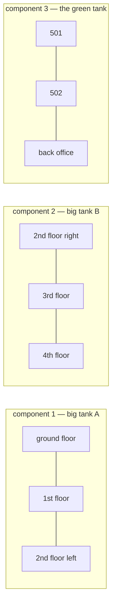

# Connected components

## 1. What this is, and why they ask it

A **connected component** is a piece of a graph where every vertex can reach every other, and no vertex can
reach anything outside it. A graph is not necessarily one thing. It is a collection of separate pieces, and
counting them is one of the most frequently asked graph questions there is.

The algorithm is four lines longer than the traversal you already know: loop over every vertex, and whenever
you find one you have not seen, run a traversal from it and count that as one more piece. The `seen` set is
shared across every run, which is what stops you counting a piece twice.

They ask this because it is the smallest possible problem that punishes the assumption everyone makes. Sample
inputs are connected. Real inputs are not. A solution that starts from vertex 0 and stops passes every
example in the problem statement and fails the hidden test. Interviewers know this and choose the test
deliberately.

It is also the question underneath a surprising number of problems that never mention graphs: counting
islands in a grid, merging duplicate accounts, grouping people into friend circles, finding how many
components a network breaks into when a cable is cut. **The words "how many groups" almost always mean
connected components**, and recognising that is the actual skill.

By the end of this lesson you can count components with either traversal, label every vertex with which piece
it belongs to, handle a grid, name the case where Union-Find is the better answer, and say what changes when
the graph is directed — because the answer there is genuinely different and it is the follow-up.

---

## 2. The story

Anil has been the plumber for the four buildings on Nehru Road for twenty-two years, and until last March he
believed, like everybody else, that Sagar Apartments had one water system.

The complaint was ordinary. Flat 302 said their kitchen tap had gone weak. Anil went up, checked the tap,
checked the line, found nothing obviously wrong, and did the thing he does when nothing is obviously wrong,
which is to go up to the terrace and start closing valves.

There are three tanks on that terrace. Everybody knows about the two big ones. The third is smaller, sits
behind the lift machine room, and has a coat of green paint on it from some year in the nineties.

He closed the valve on the first big tank and sent the watchman round the building to see which taps had
stopped. Twenty minutes later the watchman came back with a list. Ground floor, first floor, and the left
half of the second floor. Nothing above that.

He opened it again and closed the second tank. This time it was the right half of the second floor, all of
the third, and the fourth.

That accounted for everything except three flats. 501, 502, and the office on the ground floor at the back.

Those three, it turned out, are on the green tank. They have been on the green tank since 1994, when somebody
added the fifth floor and could not be bothered to run the line all the way down to the main tanks. Nobody
currently alive in the building knew this. The three flats had never had a problem, so nobody had ever had a
reason to find out.

Anil said the thing that struck him afterwards was how simple the method was, and how nobody had ever done it.
You close one valve. You see who stops. Everything that stopped is on that tank, and everything that did not,
is not. Then you do it again with the next one. When every tap in the building has been accounted for, you
know how many separate systems there are, and you did not need to look at a single pipe inside a wall.

It took him one afternoon and a watchman.

The weak tap in 302 was a blocked aerator, which he fixed in four minutes.

---

## 3. The idea in plain English

Anil found the connected components of a plumbing network, and his method is exactly the algorithm.

**A connected component is a piece where everything reaches everything.** In an undirected graph, if you can
get from `A` to `B` then you can get from `B` to `A`, so "reaches" carves the vertices into groups with no
edges between them. The green-tank flats are a component: connected to each other, connected to nothing else.

**Closing a valve and seeing what stops is a traversal.** Anil picks a tank and finds everything reachable
from it. In code you pick a vertex and run BFS or DFS from it; everything the traversal touches is in that
vertex's component. This is [day 127](../day-127-graph-bfs/README.md) or
[day 128](../day-128-graph-dfs/README.md) unchanged — **the traversal is not the new part.**

**The new part is the outer loop.** After the first traversal you have one component and a set of vertices you
have accounted for. Then you look for a vertex you have *not* accounted for and start again from there. Each
fresh start is one more component. Anil did this three times and stopped when every tap was on his list.

**The `seen` set is shared across every run, and that is the whole trick.** If you reset it between
traversals, the second run walks back over the first component and you count the same piece repeatedly. Anil
kept one list for the whole afternoon, not one per tank.

So the algorithm is:

```
count = 0
for every vertex:
    if it has not been seen:
        count += 1
        traverse from it, marking everything reachable as seen
```

**Four lines around a traversal you already have.** That is genuinely all of it, and it is worth noticing how
small the addition is compared with how often the omission is the bug.

**Labelling is barely more work than counting.** Instead of a counter, keep a dictionary from each vertex to
its component number, filled in during the traversal. Then "are `A` and `B` in the same group?" is a
comparison of two labels, and "how big is the largest group?" is a count. Most real problems want the labels,
not the count.

**BFS or DFS makes no difference here.** Both visit exactly the vertices in the component, both cost
`O(V + E)`, and the component you get is identical. Use DFS if you want fewer lines; use BFS if the graph
might be deep enough to overflow the stack.

**Grids are the most common disguise.** A grid of land and water cells is a graph where the vertices are
cells and the edges are "next to, and both land". Counting islands is counting connected components, and the
outer loop is the double loop over every cell. **You will meet this again properly on
[day 130](../day-130-grids-are-graphs/README.md)**; the point today is that the algorithm is unchanged.

**Union-Find is the other way to do this, and there is a rule for when.** If the edges are given all at once
and you traverse afterwards, a traversal is simpler and just as fast. If edges arrive *one at a time* and you
must answer "how many groups now?" after each one, a traversal means re-running the whole thing per edge, and
you want **Union-Find** — a structure that merges groups in nearly constant time. That is
[day 138](../day-138-union-find/README.md). **The rule: static graph → traversal; edges arriving over time →
Union-Find.**

**And directed graphs are a different question, which is the follow-up.** In a directed graph, `A → B` does
not mean `B → A`, so "reaches" is no longer symmetric and there are two different things you might mean:

- **Weakly connected** — connected if you ignore the arrow directions. Just run the undirected algorithm on
  the graph with every edge doubled.
- **Strongly connected** — every vertex can reach every other *following the arrows*. This is a genuinely
  harder problem and needs a different algorithm.

**If someone asks you to count components on a directed graph, ask which one they mean.** It is a real
ambiguity and asking is the right move.

---

## 4. The picture

Anil's building, as a graph:



**What to notice.** There are no edges between the boxes. That is what makes them components rather than just
clusters — not that they are loosely connected, but that they are *not connected at all*. A traversal starting
anywhere in one box can never reach another box, however long you let it run.

The algorithm, traced:

```
vertices: 0 1 2 3 4 5 6 7 8
edges:    0-1  1-2  3-4  5-6  6-7  7-5

outer loop  vertex  seen?   action                  seen after      count
----------  ------  ------  ----------------------  --------------  -----
    1         0      no     traverse -> {0,1,2}     {0,1,2}           1
    2         1      YES    skip                    {0,1,2}           1
    3         2      YES    skip                    {0,1,2}           1
    4         3      no     traverse -> {3,4}       {0,1,2,3,4}       2
    5         4      YES    skip                    ...               2
    6         5      no     traverse -> {5,6,7}     {0..7}            3
    7         6      YES    skip                    ...               3
    8         7      YES    skip                    ...               3
    9         8      no     traverse -> {8}         {0..8}            4
                                                                      ---
                                                    four components
```

**What to notice at row 9.** Vertex `8` has no edges at all, and it is still a component — a group of one.
This is the case that a `defaultdict` built only from the edge list silently loses, because `8` never becomes
a key. On "how many friend circles are there among six people with these two friendships", the four people
with no friends are four circles, and the answer is six, not two.

And the shared-`seen` mistake, drawn:

```
CORRECT: one seen set for the whole run

  run 1 from 0:  seen = {0,1,2}          count 1
  run 2 from 3:  seen = {0,1,2,3,4}      count 2      <- 0,1,2 still there
  run 3 from 5:  seen = {0,...,7}        count 3


WRONG: seen reset inside the loop

  run from 0:  seen = {0,1,2}   count 1
  run from 1:  seen = {0,1,2}   count 2   <- same piece, counted again
  run from 2:  seen = {0,1,2}   count 3   <- and again
  ...
  answer: 9 components for a graph that has 4
```

**What to notice.** The wrong version returns `V` — one per vertex — which looks like a plausible answer and
is not obviously wrong on a small example where every vertex is isolated.

---

## 5. The code, built step by step

Start with counting, which is the version most problems ask for.

```python
from collections import deque

def count_components(graph: dict[int, list[int]]) -> int:
    seen: set[int] = set()                    # ONE set, outside the loop
    count = 0
    for start in graph:                       # every vertex, not just one
        if start in seen:
            continue
        count += 1
        _flood(graph, start, seen)
    return count
```

Six lines, and two of them are the entire lesson: `seen` is declared before the loop, and the loop is over
every vertex. Everything else you already had.

The flood itself is yesterday's traversal with nothing added:

```python
def _flood(graph: dict[int, list[int]], start: int, seen: set[int]) -> None:
    """Mark everything reachable from start. Iterative, so no depth limit."""
    stack = [start]
    seen.add(start)
    while stack:
        vertex = stack.pop()
        for neighbour in graph[vertex]:
            if neighbour not in seen:
                seen.add(neighbour)
                stack.append(neighbour)
```

`seen` is passed in rather than created here, which is what makes it shared. If this function created its own,
every call would start from nothing and you would get the wrong answer shown in section 4.

Now labelling, which is what you usually actually want:

```python
def label_components(graph: dict[int, list[int]]) -> dict[int, int]:
    """Map every vertex to its component number, 0, 1, 2, ..."""
    label: dict[int, int] = {}
    current = 0
    for start in graph:
        if start in label:                    # `label` IS the seen set
            continue
        stack = [start]
        label[start] = current
        while stack:
            vertex = stack.pop()
            for neighbour in graph[vertex]:
                if neighbour not in label:
                    label[neighbour] = current
                    stack.append(neighbour)
        current += 1
    return label
```

The `seen` set has disappeared again, the same trick as BFS distances: a vertex is seen exactly when it has a
label. One dictionary, three jobs — the seen set, the labels, and the count is `max(label.values()) + 1`.

With labels, two useful questions become one line each:

```python
same_group = label[a] == label[b]
sizes = Counter(label.values())
largest = max(sizes.values())
```

Now the grid version, because it comes up more than the plain one:

```python
def count_islands(grid: list[list[str]]) -> int:
    if not grid or not grid[0]:
        return 0
    rows, cols = len(grid), len(grid[0])
    count = 0
    for row in range(rows):
        for col in range(cols):               # the double loop IS the outer loop
            if grid[row][col] != "1":
                continue
            count += 1
            _sink(grid, row, col, rows, cols)
    return count
```

The double loop over cells is exactly the outer loop over vertices. Every unvisited land cell starts a new
island.

```python
def _sink(grid: list[list[str]], row: int, col: int, rows: int, cols: int) -> None:
    """Flood this island, marking cells as visited by overwriting them."""
    stack = [(row, col)]
    grid[row][col] = "0"                      # mark immediately, on push
    while stack:
        r, c = stack.pop()
        for dr, dc in ((-1, 0), (1, 0), (0, -1), (0, 1)):
            nr, nc = r + dr, c + dc
            if 0 <= nr < rows and 0 <= nc < cols and grid[nr][nc] == "1":
                grid[nr][nc] = "0"            # mark on push, not on pop
                stack.append((nr, nc))
```

Overwriting the grid is the `seen` set — a visited land cell becomes water, so nothing revisits it. It costs
no extra memory and it mutates the caller's input, which you should mention. The alternative is a separate
`visited` grid of the same size.

`grid[nr][nc] = "0"` sits next to the append, not after the pop, for the reason from
[day 127](../day-127-graph-bfs/README.md): otherwise the same cell is pushed once per neighbour that sees it,
and the stack fills with duplicates.

### The complete solution

```python
"""Connected components: counting, labelling, sizes, and the grid version."""

from __future__ import annotations

from collections import Counter


def build(n: int, edges: list[tuple[int, int]]) -> dict[int, list[int]]:
    """From range(n), so a vertex with no edges still exists."""
    graph: dict[int, list[int]] = {v: [] for v in range(n)}
    for a, b in edges:
        graph[a].append(b)
        graph[b].append(a)
    return graph


def label_components(graph: dict[int, list[int]]) -> dict[int, int]:
    """Vertex -> component id. The dict doubles as the seen set."""
    label: dict[int, int] = {}
    current = 0
    for start in graph:
        if start in label:
            continue
        stack = [start]
        label[start] = current
        while stack:
            vertex = stack.pop()
            for neighbour in graph[vertex]:
                if neighbour not in label:
                    label[neighbour] = current
                    stack.append(neighbour)
        current += 1
    return label


def count_components(graph: dict[int, list[int]]) -> int:
    labels = label_components(graph)
    return len(set(labels.values()))


def component_sizes(graph: dict[int, list[int]]) -> list[int]:
    labels = label_components(graph)
    return sorted(Counter(labels.values()).values(), reverse=True)


def count_islands(grid: list[list[str]]) -> int:
    """Grid version. Mutates the grid, marking visited land as water."""
    if not grid or not grid[0]:
        return 0
    rows, cols = len(grid), len(grid[0])
    count = 0
    for row in range(rows):
        for col in range(cols):
            if grid[row][col] != "1":
                continue
            count += 1
            stack = [(row, col)]
            grid[row][col] = "0"
            while stack:
                r, c = stack.pop()
                for dr, dc in ((-1, 0), (1, 0), (0, -1), (0, 1)):
                    nr, nc = r + dr, c + dc
                    if 0 <= nr < rows and 0 <= nc < cols and grid[nr][nc] == "1":
                        grid[nr][nc] = "0"
                        stack.append((nr, nc))
    return count


if __name__ == "__main__":
    # Anil's building: three systems, plus a disconnected outdoor tap.
    building = build(9, [(0, 1), (1, 2), (3, 4), (5, 6), (6, 7), (7, 5)])
    print("count :", count_components(building))
    print("labels:", label_components(building))
    print("sizes :", component_sizes(building))

    islands = [
        list("11000"),
        list("11000"),
        list("00100"),
        list("00011"),
    ]
    print("islands:", count_islands(islands))
    print("after  :", ["".join(row) for row in islands])
```

Running it:

```
count : 4
labels: {0: 0, 1: 0, 2: 0, 3: 1, 4: 1, 5: 2, 6: 2, 7: 2, 8: 3}
sizes : [3, 3, 2, 1]
islands: 3
after  : ['00000', '00000', '00000', '00000']
```

Two things to look at. Vertex `8` gets its own label, `3`, and shows up in the sizes as a group of one — the
isolated vertex handled correctly, which only works because `build` used `range(n)`.

And the last line: the grid is now entirely water. The function destroyed its input. That is fine when the
caller does not need it and is a real problem when it does — say so before you write it, and offer the
separate `visited` grid as the alternative.

---

## 6. What it costs

**Time.**

```
the outer loop                      V iterations
each vertex is flooded at most once (shared seen set)
total flooding work                 V + 2E
                                    ------------------
total                               O(V + E)
```

**The outer loop does not multiply anything.** This is the point people get wrong when they first see it. The
loop runs `V` times, but the body only does real work the first time it lands in each component, and across
all components every vertex and every edge is touched exactly once. The other `V − (number of components)`
iterations are a single `in` check.

**So counting components costs exactly the same as one traversal.** Not `V` traversals — one traversal's worth
of work, spread across several starts.

Put numbers on it:

```
V = 1,000,000 vertices, E = 3,000,000 edges, 40,000 components
outer loop checks               1,000,000
flood work                      1,000,000 + 6,000,000 = 7,000,000
                                -------------------------------
total                           ~8,000,000 operations
```

Eight million steps, about a second in Python. The forty thousand components change nothing about the cost.

**Space.**

```
seen / label     V entries         O(V)
stack or queue   at most V         O(V)
the graph        V + 2E            O(V + E)
```

**On a grid:**

```
rows x cols cells
V = rows x cols
E <= 2 x rows x cols          (4 neighbours each, each edge shared)
                              O(rows x cols)

1,000 x 1,000 grid  ->  1,000,000 cells, ~3,000,000 steps
```

Marking by overwriting the grid means `O(1)` extra space for visitation instead of `O(rows × cols)` — a
million booleans saved, which is a real number worth stating.

**Compared with the alternative.** For a static graph:

```
traversal          O(V + E) once
Union-Find         O(E x alpha(V)) to build, then O(alpha(V)) per query
                   alpha is the inverse Ackermann function: <= 4 for any
                   input that fits in the universe, so effectively constant
```

Both are effectively linear, and for a one-shot count the traversal is simpler. **The comparison changes
completely when edges arrive over time:**

```
m edges arriving one at a time, "how many components now?" after each

traversal per query      m x O(V + E)   = quadratic. Unusable.
Union-Find               m x O(alpha)   = effectively m operations
```

```
m = 100,000 edges, V = 100,000
traversal:   100,000 x 200,000  = 20,000,000,000 steps
Union-Find:  100,000 x ~4       = 400,000 steps
```

**Fifty thousand times faster**, and that gap is the entire reason Union-Find exists. Say it as "static graph
→ traversal, incremental edges → Union-Find" and you have answered the follow-up before it arrives.

---

## 7. The traps

### Starting from one vertex

The near-miss, and the most common wrong answer to any "how many" graph question:

```python
seen = set()
_flood(graph, 0, seen)
return len(seen)          # "the number of vertices"
```

On a connected sample it is right. On the real input:

```
>>> graph = build(9, [(0,1), (1,2), (3,4), (5,6), (6,7), (7,5)])
>>> len(flood_from_zero(graph))
3                          # the answer is 9
```

No error, and the sample in the problem statement almost certainly does not catch it. **Whenever the question
contains "all", "every", "how many groups", or "count the", the outer loop is required.**

### Resetting `seen` inside the loop

```python
for start in graph:
    seen = set()                    # <- inside
    if start in seen:               # always False now
        continue
    count += 1
    _flood(graph, start, seen)
```

```
>>> count_components_broken(building)
9
```

Nine components for a graph with four. The `in` check is now meaningless, so every vertex starts a new
traversal and every traversal is counted. The answer is always `V`, which is plausible enough to survive a
glance.

### Building from the edges instead of the vertex count

```python
graph = defaultdict(list)
for a, b in edges:
    graph[a].append(b)
    graph[b].append(a)
return count_components(graph)
```

```
>>> count_components(from_edges_only(9, [(0,1),(1,2),(3,4),(5,6),(6,7),(7,5)]))
3                          # vertex 8 does not exist, so it is not counted
```

Vertex `8` has no edges, never becomes a key, and is silently dropped. On "six people, two friendships, how
many friend circles", the answer is six and this returns two. **When the problem gives you `n`, build from
`range(n)`.**

### Marking on pop in the grid version

```python
while stack:
    r, c = stack.pop()
    if grid[r][c] == "0":
        continue
    grid[r][c] = "0"              # mark on pop
    for dr, dc in ...:
        stack.append((nr, nc))    # push without checking
```

Correct answers, and on a large all-land grid:

```
1,000 x 1,000 grid, all land
mark on push:  stack peak ~ 2,000 entries
mark on pop:   stack peak ~ 2,000,000 entries
```

```
MemoryError
```

Each cell gets pushed once per neighbour that sees it — up to four times — and on a million-cell grid that is
four million stack entries.

### Recursion on a grid

```python
def sink(grid, r, c):
    grid[r][c] = "0"
    for dr, dc in ((-1,0),(1,0),(0,-1),(0,1)):
        if in_bounds and grid[r+dr][c+dc] == "1":
            sink(grid, r+dr, c+dc)
```

```
Traceback (most recent call last):
  File "islands.py", line 8, in sink
    sink(grid, r + dr, c + dc)
  [Previous line repeated 993 more times]
RecursionError: maximum recursion depth exceeded
```

A 1,000 × 1,000 grid of all land is a single island whose DFS depth is a million. This is the standard failure
on the larger island test cases, and raising the recursion limit turns it into a segmentation fault. Write the
iterative version.

### Counting components on a directed graph

```python
count_components(directed_graph)    # what does this even mean?
```

It runs. It returns a number. The number is neither the weakly connected count (because you did not double
the edges) nor the strongly connected count (which needs a different algorithm entirely). It is the number of
times a forward-only traversal happened to start, which depends on the iteration order of the dictionary.

**Ask which one is meant.** If it is weak, symmetrise the edges first. If it is strong, that is a different
algorithm and you should say so.

---

## 8. In the interview

### How it gets asked

The word "component" is rare. These mean it:

- *"How many connected components does this graph have?"* — the direct version.
- *"Count the number of islands."* — the grid version, and the most-asked graph question anywhere.
- *"How many friend circles / provinces / groups are there?"*
- *"Given accounts with shared emails, merge them."* — components after a modelling step.
- *"A cable is cut. Does the network split?"* — components before and after.
- *"What is the size of the largest group?"* — labels rather than a count.

### The first ninety seconds

> "This is connected components, and the algorithm is the traversal plus four lines — but the four lines are
> where it goes wrong, so let me be explicit about them.
>
> I loop over **every** vertex. If a vertex has not been seen, I increment the count and run a traversal from
> it, marking everything reachable. The `seen` set is declared **outside** the loop and shared across every
> traversal, which is what stops a piece being counted more than once.
>
> Two mistakes I would flag before writing. First, starting from a single vertex — that only finds the
> component containing it, and the sample input for this kind of problem is almost always connected, so
> nothing tells you. Second, if I build the adjacency structure from the edge list alone, any vertex with no
> edges never appears, and an isolated vertex is a component of size one. So I build from `range(n)`.
>
> Cost is `O(V + E)` — the same as a single traversal, not `V` traversals, because the shared `seen` set means
> every vertex and edge is touched exactly once across all the runs. Space is `O(V)`.
>
> I would use DFS with an explicit stack rather than recursion, because if this is the grid version a
> thousand-by-thousand grid of all land is a single component a million deep, and recursion dies there.
>
> One question: is the graph directed? If it is, 'components' is ambiguous — weakly connected means ignoring
> the arrows, strongly connected means every vertex reaches every other following them, and those are
> different algorithms."

### The follow-ups

**"Why is this `O(V + E)` and not `V` times `O(V + E)`?"**

> "Because the outer loop runs `V` times but only does work the first time it lands in each component.
>
> Concretely: the loop body is an `in` check, which is `O(1)`, and then a traversal — but the traversal only
> happens if the vertex is unseen. Once a component has been flooded, every other vertex in it fails the check
> and costs one lookup.
>
> So the total flooding work across all the starts is: every vertex is pushed exactly once, and every edge is
> examined exactly twice, once from each end. That is `V + 2E` regardless of how the vertices are distributed
> among components. Add the `V` cheap checks from the outer loop and it is still `O(V + E)`.
>
> The thing that makes it work is the shared `seen` set. If I reset it per traversal, then it genuinely would
> be `V` traversals and the cost would be `O(V × (V + E))` — and it would also give the wrong answer, which is
> the more obvious symptom."

**"Edges arrive one at a time and I need the count after each. Now what?"**

> "Then the traversal is the wrong tool and I would switch to Union-Find, and I would justify it with the
> arithmetic.
>
> Re-running the traversal after each edge is `m` traversals, so `O(m × (V + E))`. With a hundred thousand
> edges and a hundred thousand vertices that is about twenty billion steps. Not viable.
>
> Union-Find keeps each vertex pointing at a representative for its group. Adding an edge means finding both
> endpoints' representatives and, if they differ, pointing one at the other and decrementing a component
> counter. With path compression and union by rank, each operation is effectively constant — the true bound is
> inverse Ackermann, which is at most 4 for any input that will ever exist.
>
> So the whole sequence is about `m × 4` operations, four hundred thousand instead of twenty billion.
>
> The rule I would state is: **static graph, count once → traversal. Edges arriving over time, count as you go
> → Union-Find.** And the converse is worth saying too — Union-Find cannot easily handle *removing* an edge,
> so if edges are being deleted, neither works well and you are into much harder territory."

**"The grid is a thousand by a thousand and your solution crashes."**

> "Recursion depth. A thousand-by-thousand grid that is all land is one island, and a depth-first search
> through it goes a million calls deep. Python's usable limit is under a thousand frames.
>
> Two things I would change. Rewrite the flood iteratively with an explicit stack — same algorithm, no limit.
> And mark cells as visited when I **push** them, not when I pop them, because on a grid each cell has up to
> four neighbours that could push it, so marking on pop lets the stack grow to four million entries on a
> million-cell grid.
>
> I would not raise the recursion limit. Past roughly a hundred thousand frames Python exhausts the C stack
> and you get a segmentation fault instead of a `RecursionError` — no traceback, nothing to debug. That is a
> worse failure, not a fix.
>
> On memory: I mark visited cells by overwriting the land with water, which costs nothing and destroys the
> caller's grid. If the grid must be preserved I keep a separate visited array, which is a million booleans —
> about a megabyte as a `bytearray`. I would ask which the caller wants rather than silently mutating."

**"How many components are there if I remove this vertex?"**

> "Recompute is the honest first answer: delete the vertex and its edges, run the count again, `O(V + E)`.
> Fine if the question is asked once.
>
> If they are asking it for *every* vertex, that is `V × O(V + E)` and there is a much better answer:
> **articulation points**, found by a single DFS. A vertex is an articulation point — a cut vertex — if
> removing it increases the component count, and there is a linear-time DFS that finds all of them at once by
> tracking, for each vertex, the earliest ancestor reachable from its subtree.
>
> The same machinery finds **bridges** — edges whose removal disconnects the graph — which is the version of
> this question asked about cables rather than routers.
>
> I would not write that from memory unprompted; it is a known algorithm with a couple of fiddly details
> around the root vertex. But naming it and saying it is one linear DFS rather than `V` of them is the answer
> to 'can you do better than recomputing'."

### The model answer

*"A company has a list of employees. Each employee has an ID and a list of the IDs of people they have worked
with directly. Teams are defined as groups of people connected through shared projects. How many teams are
there, and how large is the biggest one?"*

> "Let me do the modelling in one sentence and then be careful about the two things this problem is actually
> testing.
>
> **A vertex is an employee. An edge joins two employees who have worked together directly.** Undirected —
> working together is symmetric — and unweighted. A team is a connected component, and the questions are the
> count and the largest size.
>
> **So: label rather than count.** I keep a dictionary from employee to team number, filled in during the
> traversal, and increment the team number each time the outer loop starts a fresh flood. The count is the
> number of distinct labels and the largest team is the most common one — a `Counter` over the values. Both
> questions from one pass.
>
> **The first thing this problem is testing is the isolated employee.** Someone who has never worked with
> anyone is a team of one. If I build the adjacency structure only from the collaboration lists, that person
> never appears and I undercount both answers. So I initialise from the full employee list. In an interview I
> would say this out loud because it is the difference between the sample passing and the hidden test passing.
>
> **The second is the symmetry of the input.** Real data of this shape is often one-directional — A's list
> mentions B but B's list does not mention A, because somebody filled in a form. If I trust the input to be
> symmetric and it is not, I get too many teams. So I add every edge in both directions when building,
> regardless of what the input claims, which is one extra line and removes the whole class of problem. I would
> mention that I am doing it defensively rather than because the spec said so.
>
> **Cost:** `O(V + E)` time and `O(V)` space. With ten thousand employees averaging thirty collaborators,
> that is `10,000 + 300,000` — about a third of a million steps, instant.
>
> **Iterative traversal, not recursive**, because a company where everyone is connected in a long chain of
> collaborations is a perfectly plausible input and would be ten thousand frames deep.
>
> **The follow-up I would expect** is 'now people join and collaborations get added over time, keep the counts
> live'. That is Union-Find rather than a traversal: each new collaboration is two finds and possibly a union,
> effectively constant, and I keep a running component count and a size per representative. Re-running the
> traversal per edge would be quadratic and would not survive.
>
> **And one thing I would raise as a product question rather than an engineering one:** this definition makes
> everyone connected through any chain into one team, so a single person who has worked with two departments
> merges them. If the real question is 'who works closely together', components are too blunt and the answer
> is a clustering measure rather than connectivity. I would ask before building, because the two give very
> different answers on real collaboration data."

---

## 9. Recall card

**Components are the traversal plus four lines:** loop over **every** vertex, and when one is unseen, count a
new component and flood from it. **The `seen` set lives outside the loop** — resetting it inside returns `V`.

**Cost is `O(V + E)`, the same as one traversal, not `V` of them,** because the shared `seen` set means every
vertex and edge is touched once across all the starts.

**Label instead of counting** when you need sizes or "same group?" — one dictionary does the seen set, the
labels and the count.

**Build from `range(n)`, not from the edge list.** A vertex with no edges is a component of size one, and a
`defaultdict` built from edges silently loses it.

**Static graph → traversal. Edges arriving over time → Union-Find** (`m × 4` instead of `m × (V + E)`). And on
a directed graph, "components" is ambiguous — ask whether they mean weakly or strongly connected.
