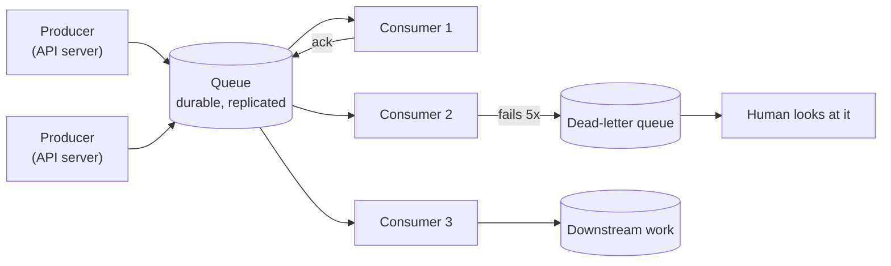

# Message queues: why async changes everything

## 1. What this is, and why they ask it

A **message queue** is a place to put work so that somebody else does it later. The caller writes a message,
gets an acknowledgement immediately, and goes away. A separate process picks the message up and does the
actual job.

That one change — the caller not waiting — is the most consequential thing you can do to an architecture. It
turns a four-second signup into a two-hundred-millisecond signup. It lets a service survive a traffic spike
that would otherwise have killed it. It means a dependency being down stops being an outage and becomes a
backlog.

And it costs you a great deal. You lose the answer, so the user must find out some other way. You lose
ordering unless you work for it. You gain duplicates, which every consumer must now handle. And you gain a
debugging story where the interesting event happened somewhere else, four seconds ago, in a process nobody was
watching.

They ask this because the phrase "just put a queue in front of it" is the most common half-answer in system
design, and the follow-ups find out whether you know what you traded. This is also the first day of a new
phase: everything up to now was about how distributed systems fail. From here you are assembling the actual
components — queues, streams, object stores, search indexes, caches — into designs.

By the end of this lesson you can say exactly which work belongs off the request path, compute what
asynchrony buys in latency and in capacity, name the four things you give up, size a queue and its consumers,
and answer the question that decides whether the design is any good: **what does the user see while the work
has not happened yet?**

---

## 2. The story

Iqbal's tailoring shop is nine feet wide and has been on that corner since his father's time.

For most of the year it is quiet. Somebody brings a shirt to be altered, Iqbal measures, and if it is small
he does it there — the man waits twenty minutes on the bench by the door and takes it with him.

Then there are the six weeks before Diwali.

In those six weeks he takes something like sixty orders a day, and he can stitch about twenty-five. That
arithmetic does not work and everybody who has ever run a small shop knows exactly what it feels like.

His father's way was to take the work and be vague. "Come next week." Then next week it was not ready, and
the man came back on Thursday and it was still not ready, and there was an argument at the counter while four
other people waited.

What Iqbal does is different and it is the whole thing.

He has a pad of numbered tags, the kind with a wire loop. When you bring cloth in, he measures — that takes
four minutes — writes the number on a slip, ties the tag to the bundle, and says a date. Not "next week". A
date, out loud, that he has worked out from how many bundles are already on the shelf behind him.

Then you leave. The shop is empty behind you in four minutes instead of forty, and the next person is at the
counter.

The shelf behind him is the whole system. In the quiet season it has two or three bundles on it. In the third
week of October it has a hundred and forty, and when he looks at it he knows immediately that the date he is
telling people has to move from four days to nine.

Two things about that shelf that he has learnt the hard way.

The first is that the shelf can save him, but only for so long. A busy Saturday puts thirty bundles on it and
he clears them over the following week. But if every day is a busy Saturday, the shelf does not help at all —
it just grows, and the date he quotes goes from nine days to twenty, and at some point people stop coming
back for the bundle at all.

The second is that when something goes wrong, it goes wrong quietly. In 2019 a bundle slipped down behind the
shelf and stayed there for five months. Nobody noticed. The man who brought it in did not come back to ask,
because he had assumed it was lost and bought something else, and Iqbal did not know it was missing because
it was not in front of him. That is the difference between the man on the bench and the bundle on the shelf.
The man on the bench, you cannot forget.

---

## 3. The idea in plain English

Iqbal's shelf is a message queue, and everything about queues is on it.

**Synchronous means the caller waits.** The man on the bench for twenty minutes. In code: your service calls
another service, blocks, and returns to the user only when the whole thing is done. The user's response time
is the sum of everything you did.

**Asynchronous means the caller hands over the work and leaves.** Write the message, get an acknowledgement,
respond. The user's response time is the time to write the message — a millisecond or two — and nothing else.

**The queue is the shelf.** A **queue** is a durable, ordered store of messages that a producer writes to and
a consumer reads from. Durable matters: if the shop burns down the bundles are gone, so a real queue writes
messages to disk and replicates them before acknowledging.

**The tag with a date on it is what the user gets instead of an answer.** This is the part that separates a
design from a diagram. If the user no longer waits for the work, they must find out about it some other way —
a status they can poll, a notification, an email, a page that says "processing". **A design that moves work
into a queue and does not say what the user sees has not finished.**

**Decoupling in time is the first thing you buy.** The producer and the consumer no longer have to be running
at the same moment. Iqbal takes orders when the shop is open and stitches when it is quiet. If the stitching
stops entirely for a day, the counter keeps working. **A dependency being down becomes a backlog rather than
an outage**, and that is worth more than the latency improvement.

**Absorbing a burst is the second.** The shelf holds thirty bundles from a busy Saturday and they are cleared
over the week. In a system, a spike of ten thousand requests a second against a consumer that can do a
thousand a second is fine for a while: the queue holds the difference. **This is called buffering, and it only
works for bursts, not for sustained overload.** If the average arrival rate exceeds the average processing
rate, the queue grows without limit and the delay grows with it. Iqbal's nine days becoming twenty.

**Smoothing the load is the third.** The consumer processes at its own steady pace instead of at whatever rate
requests happen to arrive, which means you size it for the *average* rather than for the peak. That is often a
five-to-ten-times reduction in the machines you need.

**Now the four things you give up, and you must be able to name all four.**

**One: you lose the answer.** The caller gets an acknowledgement, not a result. If the work fails, the caller
has already gone. Everything about error handling changes — there is nobody to return a `400` to.

**Two: you gain duplicates.** Queues deliver **at-least-once**: if the consumer does not acknowledge in time,
the message comes back. That is not a bug, it is the design, and it means **every consumer must be
idempotent** — [day 122](../day-122-autocomplete/README.md)'s lesson, now a hard requirement rather than good
practice.

**Three: you lose ordering, unless you pay for it.** With ten consumers reading from one queue, message 5 can
finish before message 3. Ordering is only available *per partition* or *per key*, and getting it means
routing related messages to the same place, which limits how much you can parallelise.

**Four: debugging becomes archaeology.** The thing that went wrong happened in another process, at another
time, triggered by a message you cannot see any more. This is Iqbal's bundle behind the shelf: nothing failed
loudly, it just never happened, and nobody found out for five months. **The answer is a correlation ID on
every message and a dead-letter queue**, and both belong in the design from the start rather than after the
first incident.

**The rule for what goes in a queue, in one line:** *does the user need the result to continue?* Sending the
welcome email — no. Resizing the uploaded image — no. Charging the card — usually yes, though "accepted,
processing" is a legitimate product decision. Validating the password — obviously yes.

---

## 4. The picture

The same signup, both ways:

```
SYNCHRONOUS — the user waits for everything

  user --> API ---> write user row        80 ms
                --> send welcome email  1,400 ms   <- an external service
                --> create Stripe cust    600 ms   <- another one
                --> warm the cache        200 ms
                --> index for search      120 ms
           <---                          -------
  response                               2,400 ms

  and if the email provider is down, the signup FAILS.


ASYNCHRONOUS — the user waits for what matters

  user --> API ---> write user row         80 ms
                --> publish 4 messages      6 ms
           <---                           ------
  response                                 86 ms

           queue --> worker: email
                 --> worker: Stripe
                 --> worker: cache
                 --> worker: search

  and if the email provider is down, the message waits.
  The signup succeeded.
```

**What to notice.** The latency went from 2,400 ms to 86 ms — a factor of 28 — but the more important change
is the last line of each block. In the synchronous version, the availability of the signup is the *product* of
five services' availability. In the asynchronous version it is one service's.

Now the shape of a queue system, with the parts that are always there:



**What to notice.** The acknowledgement arrow going back from the consumer is the whole delivery guarantee: a
message is only removed once a consumer says it is done. And the dead-letter queue is not optional decoration
— without it, a message that always fails is retried forever and blocks or floods the system.

And the thing that decides whether the design works, drawn as a rate:

```
  arrival rate  L  (messages per second)
  service rate  M  (messages per second, all consumers combined)

  L < M      queue stays near empty. Delay = processing time.        HEALTHY
  L = M      queue length is unstable, delay grows unpredictably.    FRAGILE
  L > M      queue grows without limit. Delay grows without limit.   BROKEN

  a burst of B extra messages with L < M:
      drain time = B / (M - L)

  30,000 message burst, M = 1,000/s, L = 800/s
      drain time = 30,000 / 200 = 150 seconds
```

**What to notice.** The drain time depends on the *headroom*, `M − L`, not on `M`. A consumer running at 95%
utilisation has almost no headroom and takes an enormous time to recover from a burst. That is why queue
systems are sized for `M ≈ 2 × L`, not `M ≈ L`.

---

## 5. How it actually works

### The three shapes of message system

They get conflated constantly, and knowing the difference is worth marks.

| | **Task queue** | **Log / stream** | **Pub-sub bus** |
|---|---|---|---|
| Message is | consumed and gone | retained for a period | delivered to all subscribers |
| Readers | compete for messages | each track their own position | each get a copy |
| Order | none, or per group | strict per partition | none |
| Replay | no | yes, rewind the offset | no |
| Examples | SQS, RabbitMQ, Celery | Kafka, Kinesis, Pulsar | SNS, Redis pub-sub |
| Use for | "do this job" | "this happened" | "tell everyone" |

**The distinction that matters most is consumed-and-gone versus retained.** A task queue is for work: once the
email is sent, the message has no further value. A log is for events: "user 4471 signed up" may be interesting
to the analytics team next month, so it stays for a week and anyone can read it from any point. Choosing a
task queue when you needed replay is expensive to fix later.

### Delivery guarantees, concretely

**At-most-once:** the consumer acknowledges before processing. Crash after the ack means the message is lost.
Almost nobody wants this.

**At-least-once:** the consumer acknowledges after processing. Crash after processing and before the ack means
redelivery. **This is what every queue actually does**, and it is why idempotency is mandatory.

**Exactly-once:** does not exist as delivery. What exists is at-least-once plus idempotent processing —
[day 122](../day-122-autocomplete/README.md). Kafka's transactions give exactly-once *within Kafka* by
committing the output and the consumer offset atomically; the moment you touch anything outside, you are back
to keys and dedup tables.

### The visibility timeout

The mechanism nearly every queue uses, and the source of the most common queue bug.

```
consumer receives message  ->  message becomes INVISIBLE to others for N seconds
consumer processes it
consumer acknowledges      ->  message is deleted

if N seconds pass with no ack  ->  message becomes visible again
                                   another consumer receives it
```

SQS defaults to 30 seconds and allows up to 12 hours. The bug is a job that takes longer than the timeout:

```
visibility timeout   30 s
job duration         45 s

t=0   consumer A receives, starts work
t=30  message becomes visible again
t=31  consumer B receives the SAME message, starts the same work
t=45  A finishes and acknowledges
t=76  B finishes and acknowledges (the message is already gone)

  the work was done twice, and nothing reported an error
```

**Two fixes, and you should name both.** Extend the visibility while working — SQS calls this
`ChangeMessageVisibility`, and it is the same watchdog pattern as the distributed lock on
[day 127](../day-127-graph-bfs/README.md). Or make the work idempotent so the duplicate is harmless, which
you need anyway.

### Dead-letter queues

A message that fails is retried. A message that fails *every time* — malformed JSON, a reference to a deleted
record, a bug — is retried forever, consuming capacity and, in an ordered queue, blocking everything behind
it. That is a **poison message**.

```
maxReceiveCount: 5    ->  after 5 failed attempts, move to the DLQ
```

The dead-letter queue is where those go. Three things to say about it:

- **Alert on its depth, not just its existence.** A DLQ nobody looks at is a data-loss mechanism with extra
  steps.
- **Keep the failure reason** with the message, or triage is guesswork.
- **Make replay easy.** Most DLQ contents are fixable — a bug is deployed, and the messages should go back
  through. If replaying requires a hand-written script each time, it will not happen.

### Ordering, and what it costs

Ordering is per partition, never global. Kafka hashes the message key to choose a partition, and messages with
the same key land on the same partition and are consumed in order by one consumer.

```
key = user_id   ->  all events for one user are ordered
                ->  parallelism is limited to the number of partitions
                ->  a hot key (one very active user) becomes a hot partition
```

SQS FIFO queues use a `MessageGroupId` the same way, and cap throughput at 300 messages per second per group
(3,000 with batching) — against effectively unlimited for a standard queue. **That number is the price of
ordering** and it is worth quoting.

### Backpressure, and what to do when the queue grows

A queue absorbing a burst is working. A queue growing steadily is a system that is broken and has not noticed
yet. Four responses:

1. **Scale the consumers.** The correct answer when the work is parallelisable. Autoscale on queue depth or on
   message age, not on consumer CPU — CPU looks fine on a consumer that is keeping up with a queue it is not
   draining.
2. **Shed load at the producer.** Reject new work rather than accept work you cannot do. A bounded queue with
   a rejection at the edge is more honest than an unbounded one with an eight-hour delay.
3. **Prioritise.** Separate queues for different classes, so a flood of low-value work does not delay
   password-reset emails.
4. **Fix the consumer.** Often the real answer, and often the slowest.

**The metric that matters is message age, not queue depth.** A queue with a million messages that are all two
seconds old is healthy. A queue with fifty messages that are four hours old is broken. Alert on the oldest
message's age.

### Real systems, briefly

- **SQS.** Managed, effectively unlimited standard queues, at-least-once, no ordering; FIFO variant with
  ordering and a throughput cap. Simplest correct choice on AWS.
- **RabbitMQ.** Rich routing — exchanges, bindings, topic patterns — plus priorities and delays. More
  operational work; the right answer when routing logic is complex.
- **Kafka.** A log, not a queue: retention, replay, consumer groups, ordering per partition, very high
  throughput. Chosen when events have more than one consumer or when replay matters.
  [Day 130](../day-130-grids-are-graphs/README.md) is entirely about it.
- **Redis lists / Streams.** Fast and simple; Redis Streams add consumer groups and acknowledgements. Durability
  depends on your Redis persistence settings, which is the caveat.
- **Celery, Sidekiq, BullMQ.** Application-level task queues on top of one of the above. What most teams
  actually use for "send this email".

---

## 6. The numbers

**What asynchrony buys in latency.** The signup from section 4:

```
synchronous
  user row write            80 ms
  welcome email          1,400 ms
  payment customer         600 ms
  cache warm               200 ms
  search index             120 ms
                         --------
                         2,400 ms
```

```
asynchronous
  user row write            80 ms
  4 queue publishes          6 ms
                         --------
                            86 ms      ->  28x faster
```

**What it buys in availability.** Synchronous couples them multiplicatively:

```
each service          99.9%  available
five in series        0.999^5 = 99.5%
                      -> 3.6 hours of downtime a month
```

```
async: only the user row and the queue are in the path
        0.999 x 0.9999 = 99.89%
                      -> 48 minutes a month
```

**Four and a half times less downtime**, from moving four calls off the request path.

**What it buys in capacity.** Traffic that peaks at five times its average:

```
average          1,000 requests/s
peak             5,000 requests/s
work per request 50 ms of CPU

synchronous: size for the peak
  5,000 x 0.05 = 250 cores

asynchronous: size for the average, buffer the peak
  1,000 x 0.05 = 50 cores
                 -------------
                 5x fewer machines
```

**Queue sizing.** With `L` arrivals and `M` service capacity:

```
peak burst           5,000/s for 60 s   = 300,000 messages
steady capacity      1,000/s
arrival during drain 1,000/s
                     -> net drain rate = 1,000 - 1,000 = 0 ... 
```

That last line is the trap, and it is why you size for headroom:

```
consumers at 2x average    M = 2,000/s
drain rate                 2,000 - 1,000 = 1,000/s
drain a 300,000 backlog    300,000 / 1,000 = 300 seconds
peak queue depth           300,000 messages
storage at 2 KB each       600 MB
```

**Five minutes to recover from a one-minute spike**, and six hundred megabytes of queue. Both numbers are
fine; both are worth stating rather than assuming.

**How many consumers?** Little's Law again:

```
target throughput    1,000 messages/s
processing time      200 ms each
concurrency needed   1,000 x 0.2 = 200 concurrent workers
per machine (50 threads)  200 / 50 = 4 machines
```

**Cost of a managed queue.** SQS at roughly $0.40 per million requests, and each message is at least two
requests (send, receive) plus a delete:

```
100,000,000 messages/day
x 3 API calls              = 300,000,000 requests/day
                           = 9,000,000,000/month
x $0.40 per million        = $3,600/month
```

**Batching is the lever.** SQS allows 10 messages per API call:

```
with batches of 10         = $360/month
```

**A factor of ten for one parameter**, and it is the first thing to check on a queue bill.

**Ordering's cost, in throughput:**

```
SQS standard    effectively unlimited
SQS FIFO        300 messages/s per message group
                3,000/s with batching

Kafka           ordering per partition
                parallelism capped at the partition count
                12 partitions -> at most 12 consumers doing useful work
```

**Latency added by the hop:**

```
publish to SQS         5 - 20 ms
publish to Kafka       1 - 5 ms (batched, async)
end-to-end delivery    50 ms - seconds, depending on consumer lag
```

So the user's request gets *faster* and the work itself gets *slower* — from 1.4 seconds to potentially
several seconds before the email actually goes. **That is the trade in one sentence, and it is fine for an
email and not fine for a login.**

---

## 7. The trade-offs

**You trade the answer for the latency.** The caller gets an acknowledgement, not a result. Every design that
does this owes an answer to "how does the user find out?" — a status endpoint they poll, a websocket push, an
email, or a page that just says "we are processing this". Choosing badly here is what makes an async design
feel broken even when it works.

**You trade correctness-by-default for idempotency-by-discipline.** At-least-once delivery is not a
configuration you can turn off. Every consumer must handle the same message twice, forever, including the ones
written next year by someone who has not read this. That is an ongoing engineering constraint on the whole
team, not a one-time implementation cost, and it is the reason to keep the number of queues small.

**You trade ordering for parallelism.** Ten consumers on one queue means no order. Ordering means routing by
key to a single consumer per key, which caps your parallelism at the number of keys or partitions and makes a
hot key a hot partition. SQS FIFO's 300 messages per second per group is what that costs, concretely.

**You trade a loud failure for a quiet one.** A synchronous failure returns a `500` to a user who complains. An
async failure is a message in a dead-letter queue at three in the morning that nobody has alerted on. **This
is the single biggest practical cost** and the mitigations are unglamorous: correlation IDs, DLQ depth alerts,
oldest-message-age alerts, and a replay path that someone has actually tested.

**A queue does not create capacity.** It absorbs bursts. If the average arrival rate exceeds the average
service rate, the queue grows without bound and the delay grows with it, and the system is broken in a way
that looks healthy on every dashboard except message age. **"Put a queue in front of it" is not a fix for an
undersized consumer**, and saying that out loud is worth marks.

**And a queue is a component that can fail.** It is durable, replicated and highly available, and it is still
another thing to operate, another dependency in the write path, and another bill. For a small system,
a database table with a status column and a polling worker is a perfectly good queue and has none of the
operational overhead. **The transactional-outbox version of that is often strictly better than a real queue**,
because the write and the enqueue are then in the same transaction.

**When would I not use a queue?** When the user needs the result to continue — a login, a search, a price. When
the work takes less time than publishing the message, which is common for small database writes. When strict
global ordering is required and the volume is low, where a single synchronous path is simpler and correct. And
when the team is small and the work is rare, because the operational cost of a queue is paid every day and the
benefit is paid only under load.

---

## 8. In the interview

### How it gets asked

- *"The signup email takes four seconds. Fix the latency."* — the direct version.
- *"How would you handle a traffic spike ten times normal?"*
- *"What happens if the consumer crashes halfway through?"*
- *"How do you guarantee the messages are processed in order?"*
- *"The queue is growing. What do you do?"*
- *"Queue or Kafka?"* — a real question with a real answer.

### The first ninety seconds

> "Four seconds of that is work the user does not need the result of. The account row is written in eighty
> milliseconds; the email, the payment-provider customer, the cache warm and the search index are the other
> 2.3 seconds, and none of them changes what I return.
>
> So: write the user row synchronously, publish messages for the other four, return. The response goes from
> about 2.4 seconds to under a hundred milliseconds.
>
> The bigger win is availability rather than latency, and I would lead with it. Synchronously, my signup's
> availability is the product of five services — five at three nines is 99.5%, which is three and a half hours
> a month. Asynchronously only the database and the queue are in the request path, so it is about 99.9%, and
> the email provider being down becomes a backlog instead of a failed signup.
>
> Now what I am giving up, because 'put a queue in front of it' is only half an answer.
>
> **I lose the result**, so I need to decide what the user sees. For a welcome email, nothing — they will
> never know. For anything they might ask about, a status they can check.
>
> **I get duplicates.** Queues are at-least-once, so the consumer will occasionally see the same message
> twice — most often because it crashed after doing the work and before acknowledging. Every consumer has to
> be idempotent: the email sender keys on `(user_id, email_type)` and does nothing if a row already exists.
> That is a permanent constraint on everyone who writes a consumer, not a one-off.
>
> **I lose ordering** across consumers, which for these four jobs does not matter, and I would say why rather
> than ignore it.
>
> **And failures become invisible**, so a dead-letter queue with an alert on its depth and a correlation ID on
> every message go in from the start, not after the first incident.
>
> Do you want me to size the consumers, or go into what happens when the queue starts growing?"

### The follow-ups

**"The consumer crashed halfway through. Walk me through it."**

> "The message was never acknowledged, so the queue redelivers it. That is at-least-once working as designed
> and I would not try to prevent it.
>
> Mechanically: on receipt the message became invisible for a visibility timeout — 30 seconds by default on
> SQS. The consumer crashed, no acknowledgement arrived, the timer expired, the message became visible again,
> and another consumer picked it up.
>
> What matters is that the work must be safe to repeat. The consumer's first action is a conditional insert on
> the message's ID — `INSERT ... ON CONFLICT DO NOTHING` — and if that conflicts, the job is already done and
> I acknowledge and move on. Half-done work is the harder case, and the answer is to design each consumer's
> writes as upserts keyed by the message ID, so a partial run followed by a full run is indistinguishable from
> one clean run.
>
> The related bug worth naming: if the job legitimately takes longer than the visibility timeout, the message
> is redelivered while the first consumer is still working, and the work happens twice with no crash involved.
> The fixes are to extend the visibility while working — the same watchdog pattern as a distributed lock — or
> to rely on idempotency, which I need anyway.
>
> And after a few failed attempts the message goes to a dead-letter queue rather than being retried forever,
> because a malformed message will fail identically every time and will otherwise consume capacity
> indefinitely."

**"How do you guarantee ordering?"**

> "Ordering is per key, never global, and I would ask what actually needs to be ordered before designing for
> it — usually it is 'events for one user' rather than 'all events'.
>
> Mechanically: partition by a key. In Kafka, the message key is hashed to a partition, and one consumer in a
> group owns a partition, so all messages with the same key are processed in order by one consumer. In SQS
> FIFO it is a `MessageGroupId` and the same idea.
>
> Two costs. **Parallelism is capped by the number of partitions** — twelve partitions means at most twelve
> consumers doing useful work, and adding a thirteenth does nothing. And **a hot key becomes a hot partition**:
> if one user generates a third of the traffic, one consumer gets a third of the work and the rest idle.
>
> SQS FIFO has a hard number worth quoting: 300 messages a second per group, 3,000 with batching, against
> effectively unlimited for a standard queue. That is what ordering costs.
>
> The alternative I would offer is to not need it. If consumers are idempotent *and* commutative — or if the
> message carries a version and the consumer ignores anything older than what it has already applied — then
> out-of-order delivery is harmless and I keep unlimited parallelism. That is usually the better design and it
> is worth ten minutes of thought before accepting the partition cap."

**"The queue depth is growing. What do you do?"**

> "First, I would check the right metric. Depth alone does not tell me much — a million messages that are two
> seconds old is a healthy high-throughput queue. **The number that matters is the age of the oldest message.**
> Fifty messages that are four hours old is a broken system.
>
> If the age is growing, the arrival rate exceeds the service rate and the queue will grow without limit. A
> queue absorbs bursts; it does not create capacity. So there are four responses.
>
> **Scale the consumers**, and autoscale on queue depth or message age, not on consumer CPU — a consumer that
> is falling behind looks perfectly busy on CPU. This is the right answer when the work parallelises and the
> downstream can take it.
>
> **Shed load at the producer.** If I genuinely cannot process it, accepting it and quoting a four-hour delay
> is worse than rejecting it now. A bounded queue with a clear rejection at the edge is more honest.
>
> **Prioritise.** Split into separate queues by class, so a bulk import does not delay password-reset emails.
> One queue for everything means the least important work sets the latency of the most important.
>
> **Or fix the consumer**, which is often the real answer and the slowest. I would look at what it waits on —
> usually a downstream service or an unbatched database write.
>
> And I would size for headroom rather than for parity. Consumers at 95% utilisation take forever to drain a
> burst, because the drain rate is service minus arrival, not service. A one-minute spike of 300,000 messages
> at 2,000 a second capacity against 1,000 a second arrivals takes five minutes to clear; at 1,100 a second it
> takes fifty."

**"Queue or Kafka?"**

> "The question I would actually ask is whether the message is *work* or an *event*.
>
> A task queue — SQS, RabbitMQ — is for work. 'Send this email.' One consumer does it, acknowledges, and the
> message is gone. Consumers compete, scaling is trivial, and there is no ordering to think about.
>
> A log — Kafka — is for events. 'User 4471 signed up.' It stays for a retention period, several independent
> consumer groups can read it at their own pace, each tracking its own offset, and any of them can rewind and
> replay.
>
> Three things push me to Kafka. **More than one consumer wants the same event** — email, analytics, and the
> recommendation model all care about a signup, and with a task queue I would be publishing three messages and
> keeping the list of interested parties in the producer. **Replay matters** — a bug in the analytics consumer
> is fixed by rewinding the offset and reprocessing a week, which a task queue simply cannot do. And
> **throughput is very high**, where Kafka's sequential-write design is an order of magnitude cheaper.
>
> Three things push me to SQS. Operational simplicity, because Kafka is a real cluster to run and SQS is an
> API call. Per-message retries and a dead-letter queue, which are built in for a task queue and are your own
> problem in Kafka. And genuinely independent tasks with no ordering requirement, where partitions buy nothing.
>
> For a signup email in a system that is not already running Kafka, I would use a task queue and say so. For
> a stream of user activity that four teams want, Kafka."

### The model answer

*"An image upload feature: users upload a photo, it needs to be resized into four sizes, scanned for
inappropriate content, and appear in their gallery. Design it."*

> "Let me split this by what the user needs before the response returns, because that decides the whole shape.
>
> **Synchronous: accept the bytes, validate them, store the original, create the record.** Validation means
> size, type and dimensions — cheap checks that let me reject a bad upload with a real error message while the
> user is still there. The original goes to object storage, and the API returns a photo ID and a status of
> `PROCESSING`. That is maybe 200 milliseconds plus the transfer.
>
> **Asynchronous: everything else, as separate messages.** Resize into four sizes, run the content scan, index
> for search, update the gallery cache. The resize is CPU-heavy and takes a few seconds for a large image; the
> content scan is an external API that might take two seconds or might be down. Neither belongs in the request.
>
> **What the user sees is the part I would spend most time on**, because this is where async designs feel
> broken. The photo appears in their gallery immediately, showing the original with a blurred or low-quality
> placeholder, marked as processing. When the resize completes the client swaps in the real thumbnail — either
> by polling a status endpoint every couple of seconds, or over an existing websocket if there is one. The
> user never sees an empty screen and never waits for a spinner.
>
> **The content scan is the interesting case,** and I would raise it rather than wait to be asked. It has to
> complete before the photo is visible to *anyone else*, even though it is asynchronous. So the photo is
> visible to its owner immediately and enters the public feed only after the scan passes. That is a product
> decision with a real risk window, and I would want it stated explicitly rather than implied by the
> architecture.
>
> **Idempotency:** every message carries the photo ID, and every consumer's write is keyed on it — the resize
> writes to a deterministic object key, so doing it twice overwrites with identical bytes and is harmless. The
> content scan records its verdict with a conditional insert. Neither consumer cares how many times it runs,
> which is what makes at-least-once delivery a non-issue.
>
> **Ordering:** the four resize jobs are independent, so no ordering needed and I get unlimited parallelism.
> The only ordering that matters is 'scan before public visibility', and I get that by making visibility
> depend on the scan's recorded verdict rather than on message order — which is much more robust than relying
> on the queue.
>
> **Sizing.** Ten thousand uploads an hour is about three a second, peaking at maybe fifteen. Four resize jobs
> each is sixty messages a second at peak, at roughly two seconds of CPU each: Little's Law gives 120
> concurrent workers, so about four machines at 32 workers. I would autoscale on the age of the oldest message
> with a target of thirty seconds, and size the steady state at roughly twice the average so a burst drains in
> minutes rather than hours.
>
> **Failure handling.** Five attempts, then the dead-letter queue, with the photo marked `FAILED` and the user
> told — 'we could not process this image, please try again' is far better than a photo that stays 'processing'
> forever, which is the default behaviour if nobody designs this. An alert on DLQ depth and on oldest-message
> age, and a correlation ID equal to the photo ID on every message so one log query reconstructs the whole
> lifecycle.
>
> **And the thing I would not do:** put the original upload itself through the queue. The bytes are megabytes,
> queues are for small messages, and the object store already gives me durability. The message carries the
> object key, not the image."

---

## 9. Recall card

**Async means the caller hands over the work and leaves.** Latency goes from the sum of everything to the time
to write one message — 2,400 ms to 86 ms on a typical signup — and availability stops being the product of
every dependency's.

**A queue absorbs bursts; it does not create capacity.** If arrivals exceed service rate the queue grows
without limit. Size consumers at about **2× average**, because drain rate is `M − L`, not `M`. Alert on
**oldest-message age**, not depth.

**Four things you give up:** the answer (so design what the user sees); ordering (per key only — SQS FIFO caps
at 300/s per group); at-most-once (delivery is at-least-once, so **every consumer must be idempotent**); and
loud failures (so correlation IDs and a dead-letter queue from day one).

**Visibility timeout is the classic bug:** a job longer than the timeout gets redelivered while still running,
and the work happens twice with no crash. Extend it while working, or rely on idempotency.

**Work → task queue (SQS, RabbitMQ). Events → log (Kafka),** when several consumers want the same thing or
replay matters. And the rule for what goes in a queue: *does the user need the result to continue?*
