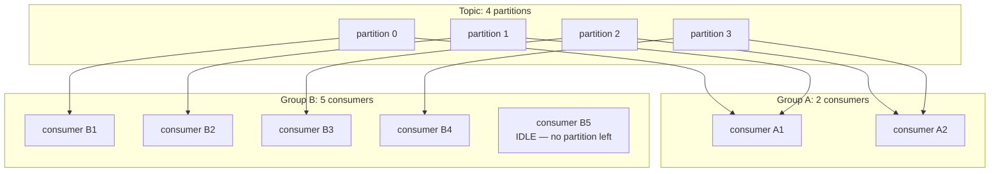

# Kafka, explained

## 1. What this is, and why they ask it

Kafka is a log. Not a queue — a log. Messages are appended to the end, they stay for a retention period, and
each reader keeps track of its own position rather than consuming and destroying.

That one difference explains everything else about it. Because messages are not removed, several independent
teams can read the same stream for different purposes. Because each reader has its own position, one of them
can rewind a week and reprocess. Because the storage is an append-only file rather than a mutable structure,
one machine can absorb hundreds of megabytes a second on ordinary disks.

They ask about Kafka because it is in almost every large architecture and because the phrase "we'll put it on
Kafka" is said far more often than it is understood. The questions that actually separate people are narrow
and specific: *how does Kafka guarantee ordering?* — the answer is "it does not, except per partition, and
here is why". *What happens when a consumer is added?* *What is a consumer group?* *What have you lost by
choosing it over a queue?*

You met the general shape yesterday on [day 129](../day-129-connected-components/README.md); today is the
specific product, its vocabulary, and the numbers that let you place it in a design and defend it.

By the end of this lesson you can describe topics, partitions, offsets and consumer groups accurately, explain
exactly what ordering guarantee exists and what it costs, size a cluster from a throughput requirement, and
say the two or three sentences about replication and lag that show you have operated one.

---

## 2. The story

The set-top box in the Menon house records the nine o'clock serial every night, and keeps thirty days.

Nobody in the house watches it at nine o'clock.

Mrs Menon is the only one who is more or less up to date. She watches two or three a week, in the afternoon,
and she is currently on the episode from last Thursday. She knows this because the box remembers where she
stopped.

Her husband is eleven episodes behind. He knows exactly which one he is on — the one where the older brother
comes back from Dubai — and he picks up from there whenever he has an evening free, which is not often. When
he sits down and presses play, it does not matter at all what his wife has watched. The box has one copy of
each episode and two positions in it.

Their son, who is nineteen, watches four at a time on Sunday afternoons and complains about the whole thing
while he does it. He is somewhere between his parents.

And Sarita, who comes to cook and stays for a couple of hours in the afternoon, watches on the small
television in the kitchen and is further behind than anybody, because she only gets twenty minutes at a
stretch.

Four people, one recording, four different places in it. Nobody's watching removes anything. If Mrs Menon
finishes an episode, it is still there for her husband. That is the part that took a while for everyone to get
used to, because it is not how a video shop worked.

There are two rules and the house has learnt both the hard way.

The first is that you cannot watch them out of order. Not really. You can, physically, but the son tried it
once and had no idea what was going on, because episode 34 refers to things that happened in 31. The order
they were recorded in is the order they mean anything in.

The second is the thirty days. Sarita fell forty-one days behind during the monsoon when her mother was ill,
and when she came back the eleven oldest episodes were simply not there any more. The box had overwritten
them. Nobody had done anything wrong; the box holds thirty days and she was outside it.

Mr Menon now checks how far behind he is every couple of weeks, and if it gets past about twenty he watches
three in one evening to get back inside the window. He describes this as "catching up", and it is exactly
that.

---

## 3. The idea in plain English

The Menons' set-top box is Kafka, and the mapping is close enough to be useful for the rest of your career.

**The recording is a topic, and it is a log.** A **topic** is a named stream of messages — `orders`,
`page-views`, `payments`. Messages are appended to the end and never modified. **This is the single most
important thing about Kafka and the thing people get wrong: reading does not remove.** A traditional queue
hands out a message and deletes it. Kafka hands out a copy and the message stays.

**Each viewer's position is an offset.** An **offset** is just a number — the position in the log that a
particular reader has got to. The log is numbered 0, 1, 2, 3 upwards, forever. Mrs Menon is at 112 and her
husband at 101. Kafka stores these positions; the messages themselves are untouched by anyone's reading.

**Thirty days is the retention.** Kafka keeps messages for a configured period — seven days is the common
default — or up to a configured size, and then deletes the oldest. **Nothing in the system knows or cares
whether anyone read them.** Sarita losing eleven episodes is a consumer whose lag exceeded the retention, and
it is the most common way data is silently lost in a Kafka system.

**How far behind you are is consumer lag.** **Lag** is the difference between the newest offset in the log and
where a consumer has got to. Mr Menon being eleven episodes behind is a lag of 11. **Lag is the single most
important thing to monitor in a Kafka deployment**, because a lag that grows steadily means the consumer
cannot keep up, and a lag that reaches the retention means data loss.

**Watching in order matters, and here is where the analogy has to stretch.** A topic is not one log. It is
split into **partitions** — independent logs that together make up the topic. Think of it as the serial being
recorded onto four separate discs, with each episode going to one disc.

**Ordering is guaranteed within a partition and nowhere else.** Episodes on disc 1 are in order relative to
each other. An episode on disc 1 and an episode on disc 3 have no defined order at all. **This is the answer
to "how does Kafka guarantee ordering", and the honest version is: it does not, globally. It guarantees order
per partition.**

**Which partition a message goes to is decided by its key.** Kafka hashes the message key and takes the
remainder. So every message with the same key lands on the same partition and is therefore ordered relative to
the others with that key. **Key by `user_id` and all events for one user are ordered; events for different
users are not, and usually you do not care.**

**Partitions exist for parallelism, and that is the trade.** Four partitions can be read by four consumers at
once, so four times the throughput. But ordering only holds within each one, so **the more you parallelise the
less order you have.** One partition gives you total order and no parallelism at all.

**A consumer group is a set of readers that share the work.** Each partition is assigned to exactly one
consumer in the group, so the group collectively reads every message exactly once. Add a consumer and the
partitions are redistributed — that is a **rebalance**. **A consumer group is one logical reader**, whatever
its member count.

**Different groups are completely independent** — that is the Menons. The analytics team's group and the
email team's group each have their own offsets and each see every message. Adding a fifth consumer group costs
the cluster almost nothing in storage, because there is still one copy of the data.

**And the consequence of "one partition per consumer": more consumers than partitions is wasted.** Twelve
partitions and twenty consumers means eight consumers sit idle. **Partition count is the ceiling on your
parallelism**, and it is chosen up front and is awkward to increase later, because increasing it changes which
partition a given key hashes to — and therefore breaks the per-key ordering you were relying on.

**Replication is how it survives a machine dying.** Each partition has a leader and some followers. Writes go
to the leader, followers copy them, and the set that is caught up is the **in-sync replica set** (ISR). If the
leader dies, one of the in-sync followers is promoted. `replication.factor = 3` and `min.insync.replicas = 2`
is the standard setting: three copies, and a write is only acknowledged when at least two have it.

---

## 4. The picture

A topic with three partitions, and two consumer groups reading it independently:

```
TOPIC "orders"

  partition 0:  [ 0 ][ 1 ][ 2 ][ 3 ][ 4 ][ 5 ]           <- append here
  partition 1:  [ 0 ][ 1 ][ 2 ][ 3 ]                     <- append here
  partition 2:  [ 0 ][ 1 ][ 2 ][ 3 ][ 4 ][ 5 ][ 6 ]      <- append here
                              ^              ^
                              |              |
       group "email"          |              |    group "analytics"
       p0 offset 3            |              |    p0 offset 5
       p1 offset 2            |              |    p1 offset 4
       p2 offset 2 -----------+              +--- p2 offset 6

  ONE copy of the data. TWO independent positions in it.
  The email group is behind. That costs the analytics group nothing.
```

**What to notice.** The partitions have different lengths, because the key hash sends different amounts of
traffic to each. That is normal, and a badly chosen key makes it extreme — which is the hot-partition problem
below.

Now consumer group assignment, and what a rebalance does:



**What to notice.** Group A has two consumers for four partitions, so each takes two. Group B has five
consumers for four partitions, so one does nothing at all — **the partition count is a hard ceiling on useful
parallelism**, and scaling past it requires more partitions, not more machines.

And the key-to-partition mapping, which is where ordering comes from:

```
producer sends (key="user_4471", value={...})

    partition = hash("user_4471") % 3  =  1

    every message for user_4471 -> partition 1  -> in order, one consumer

    key = null  ->  round-robin across partitions  ->  NO ordering at all


  HOT PARTITION:
    key = "country"  on a topic where 60% of traffic is one country

    partition 0: 60% of all messages     <- one consumer doing 60% of the work
    partition 1: 25%
    partition 2: 15%

    adding consumers does not help. The key is wrong.
```

**What to notice.** The key choice decides both the ordering guarantee you get and how evenly work is spread.
Those two requirements pull against each other, and reconciling them is the actual design work.

---

## 5. How it actually works

### Why it is fast

Kafka's throughput comes from three deliberately unclever decisions, and being able to name them is worth
marks.

**It appends to a file.** No index to update, no tree to rebalance, no in-place modification. Writes are
sequential, and sequential disk writes on spinning disks run at hundreds of megabytes a second — comparable to
random *memory* access. Most storage systems are slow because they seek; Kafka never seeks on write.

**It hands bytes straight from the page cache to the socket.** Messages are written to the OS page cache and
read from it, and Kafka uses `sendfile` to copy from the file to the network without passing through
application memory. That is **zero-copy**, and it removes two copies and two context switches per message.

**It batches everything.** Producers accumulate messages for a few milliseconds and send them in one request;
consumers fetch many at once; batches are compressed as a unit, which compresses far better than per-message.
Batching is why per-message overhead effectively disappears at volume.

The consequence worth stating: **Kafka does not keep messages in memory and does not try to.** It relies on the
operating system's page cache, which means a broker with 64 GB of RAM has 64 GB of hot log cached for free,
and consumers reading near the tail never touch a disk at all.

### The producer's durability choices

```properties
acks=0     # fire and forget. Fastest. Loses data on any failure.
acks=1     # the leader has it. Loses data if the leader dies before followers copy.
acks=all   # all in-sync replicas have it. Slowest. Safe.
```

`acks=all` with `min.insync.replicas=2` and `replication.factor=3` is the configuration for anything you care
about: the write is acknowledged once two of three copies exist, and it survives one broker dying. If only one
replica is in sync, the producer gets an error rather than a false acknowledgement — which is the point.

```properties
enable.idempotence=true   # producer ID + sequence number; dedupes producer retries
```

This gives exactly-once semantics for producer retries within a session, per partition, by having the broker
drop a sequence number it has already written. It is on by default in recent versions and it is worth turning
on knowingly.

### Consumer offsets and where the duplicate comes from

Consumers commit their offsets back to Kafka, into an internal topic called `__consumer_offsets`. The choice
that matters:

```
auto-commit every 5 s      (enable.auto.commit=true, the default)
  process a message, crash before the next commit
  -> up to 5 seconds of messages are reprocessed

manual commit after processing
  -> at-least-once: crash between processing and commit means one redelivery

manual commit before processing
  -> at-most-once: crash after commit means the message is lost
```

**Almost everyone wants manual commit after processing, plus idempotent handlers.** The default auto-commit is
convenient and gives you a five-second replay window on every crash, which is fine for metrics and not fine
for anything else.

### Rebalancing, and why it hurts

When a consumer joins or leaves a group, partitions are reassigned. In the classic protocol this is a
**stop-the-world** event: every consumer stops, the assignment is recomputed, and everyone resumes. On a large
group that can take seconds, during which nothing is consumed and lag grows.

Three things trigger it, and two are avoidable:

- A consumer genuinely joining or leaving. Unavoidable and intended.
- A deploy restarting every consumer. Mitigate with **static membership** (`group.instance.id`), which lets a
  restarting consumer reclaim its own partitions without a full rebalance.
- A consumer taking too long between polls and being declared dead (`max.poll.interval.ms`, default 5
  minutes). **This is the classic Kafka incident**: a slow message causes a rebalance, the rebalance causes lag,
  the lag causes more slow processing, and the group thrashes. The fix is to bound processing time or reduce
  `max.poll.records`.

**Cooperative sticky assignment** (the modern default) reassigns only the partitions that must move rather
than stopping everything, and it is worth naming as the thing you would enable.

### Log compaction

Alongside time-based retention, a topic can be **compacted**: instead of deleting old messages by age, Kafka
keeps the *latest* message for each key and discards earlier ones.

That turns a topic into a durable, replayable snapshot of current state — "the current address of every user"
rather than "every address change". It is how Kafka Connect stores connector state, how Kafka stores consumer
offsets, and how the Kafka-Streams state stores are backed. **Worth knowing because "how do I get the current
value, not the history" has an answer inside Kafka rather than requiring a database.**

### What replaced ZooKeeper

Kafka used ZooKeeper for cluster metadata — broker registration, topic configuration, controller election —
until **KRaft**, which uses Kafka's own Raft implementation and removes the external dependency. ZooKeeper mode
is removed in Kafka 4.0. If asked, the useful sentence is: "metadata used to live in ZooKeeper and now lives in
an internal Raft-replicated log, which removes a whole system from the deployment."

### When it is the wrong tool

- **Task queues with per-message retry and delay.** Kafka has no per-message acknowledgement and no built-in
  dead-letter behaviour; a poison message blocks its partition unless you build the handling yourself. SQS or
  RabbitMQ give you that for free.
- **Request-reply.** Kafka is one-directional. Correlating a reply topic is possible and unpleasant.
- **Small systems.** A three-broker cluster plus monitoring is real operational work for a workload a database
  table would handle.
- **Very large messages.** The default cap is 1 MB. Put the payload in object storage and send the reference.

---

## 6. The numbers

**Throughput per broker.**

```
sequential disk write            ~ 100-500 MB/s per disk
Kafka per broker, real world     ~ 100-300 MB/s sustained
messages/s at 1 KB each          ~ 100,000 - 300,000 per broker
```

**Sizing a cluster from a requirement.** Take one million messages a second at 1 KB each:

```
1,000,000 x 1 KB                 = 1 GB/s incoming
replication factor 3             = 3 GB/s written across the cluster
per broker at 250 MB/s           3,000 / 250 = 12 brokers
                                 + headroom  -> 15-16 brokers
```

**Storage.**

```
1 GB/s x 86,400 s                = 86 TB/day of raw messages
x 3 replicas                     = 259 TB/day
x 7 days retention               = 1.8 PB
```

```
with 5x compression (snappy on JSON is typically 4-6x)
                                 = ~360 TB
per broker over 16 brokers       = ~23 TB each
```

**That last step is the one to show.** Compression on a Kafka topic is often the difference between a plausible
cluster and an implausible one, and it costs a few percent of CPU.

**Partition count.**

```
target throughput        1,000,000 msg/s
per-partition throughput ~ 10 MB/s, so ~10,000 msg/s at 1 KB
partitions needed        1,000,000 / 10,000 = 100 minimum
                         x2 for headroom and future growth = 200
```

And the constraint from the consumer side:

```
consumers you want to run    50
partitions must be >= 50     or some consumers idle
partition count is also the ORDERING granularity
```

**Rule of thumb: partitions = max(throughput requirement, desired consumer parallelism), with headroom, and
not more than a few thousand per broker**, because each partition costs open file handles, memory for its
index, and rebalance time.

**Consumer lag, and the number that matters.**

```
production rate           50,000 msg/s
consumption rate          45,000 msg/s
lag growth                5,000 msg/s
                          = 18,000,000 messages per hour behind

retention                 7 days = 604,800 s
time until data loss      604,800 x 5,000 = 3 billion messages of headroom
                          at 5,000/s growth: it takes 7 days to fall out of retention
```

**Seven days of retention is seven days of warning**, and that is the real argument for generous retention: it
is not about replay, it is about how long you have to notice.

**Latency.**

```
producer batch wait (linger.ms)   0 - 100 ms, typically 5
broker write + replication         2 - 10 ms with acks=all
consumer fetch                     1 - 50 ms
                                   -----------------------
end to end, well-tuned             10 - 50 ms
end to end, batched for throughput 100 - 500 ms
```

**Kafka is not a low-latency system by default and can be tuned to be one**, at the cost of throughput. If
someone needs single-digit milliseconds, `linger.ms=0` and small batches get you there and cut throughput
several-fold.

**Rebalance cost.**

```
classic eager rebalance, 50 consumers    2 - 30 seconds of zero consumption
at 50,000 msg/s                          100,000 - 1,500,000 messages of lag created
cooperative sticky                       only moving partitions pause
```

**What a hot partition costs.**

```
100 partitions, evenly keyed
  each consumer handles 10,000 msg/s     -> fine

100 partitions, one key is 30% of traffic
  that partition:  300,000 msg/s          -> one consumer, one partition
  per-partition ceiling ~10,000 msg/s     -> 30x over capacity
  lag on that partition grows forever
```

**And adding brokers does not help at all.** This is the failure mode that surprises people: the cluster is at
20% utilisation and one partition is melting.

---

## 7. The trade-offs

**Ordering against parallelism, and you cannot have both.** One partition gives you total order and one
consumer's worth of throughput. A hundred partitions give you a hundred consumers and order only within each.
The design work is choosing a key that gives you the ordering you actually need — usually per entity — while
spreading traffic evenly. Those two goals conflict whenever your entities have wildly different volumes.

**Retention against storage cost.** Long retention is what makes replay possible and gives you time to notice
a lagging consumer. It also multiplies your storage by the replication factor. Seven days at a gigabyte a
second is a petabyte before compression, and that is a real bill.

**Kafka's durability against its operational weight.** Three brokers minimum, disks, monitoring, partition
planning, rebalance tuning, and a team that knows what `min.insync.replicas` does. For a workload that is
genuinely a queue, SQS is an API call and has none of that. **Choose Kafka when you need the log, not when you
need a queue.**

**No per-message acknowledgement.** This is the concrete thing you lose against a task queue. A message that
always fails blocks its partition, because the consumer cannot skip it without advancing the offset past it.
Retry and dead-letter handling are your code, not the broker's. Every mature Kafka deployment ends up building
retry topics and a DLQ topic, and that is a real cost to weigh.

**Partition count is chosen early and is awkward to change.** Increasing it changes `hash(key) % partitions`,
so existing keys move and per-key ordering breaks across the change. You can only add partitions, never
remove. **Over-provision modestly at the start** — twice what you need — because it is much easier than
migrating later.

**Exactly-once is exactly-once within Kafka only.** Transactions cover a read-process-write where both ends
are Kafka. The moment the consumer charges a card or writes to Postgres, the guarantee ends and you are back
to idempotency keys from [day 122](../day-122-autocomplete/README.md). Saying this precisely is one of the
better signals a candidate can give.

**When would I not use Kafka?** When there is one producer and one consumer and no replay requirement — that
is a queue, and a queue is simpler. When the messages are large. When I need per-message delay or priority.
And when the team is three people, because the operational cost is paid every week and the benefit only
arrives at scale. Managed Kafka removes some but not all of that.

---

## 8. In the interview

### How it gets asked

- *"How does Kafka guarantee ordering?"* — the classic, and the answer starts by narrowing the claim.
- *"What is a consumer group?"*
- *"You added five consumers and throughput did not change. Why?"*
- *"How would you size a Kafka cluster for a million messages a second?"*
- *"Kafka or SQS?"*
- *"A consumer is falling behind. What do you do?"*
- *"What happens when a broker dies mid-write?"*

### The first ninety seconds

> "The first thing I would say is that Kafka is a log rather than a queue, because everything else follows
> from that. Messages are appended and kept for a retention period; reading does not remove them; each
> consumer group tracks its own offset. So several independent teams can read the same stream, and any of them
> can rewind and reprocess — neither of which a task queue can do.
>
> **On ordering, the honest answer is that Kafka does not guarantee global ordering and cannot.** A topic is
> split into partitions, each of which is an independent append-only log, and ordering holds *within a
> partition only*. Two messages in different partitions have no defined order at all.
>
> What you control is which partition a message lands in: Kafka hashes the message key. So if I key by user
> ID, every event for one user is on one partition and therefore ordered, while events for different users are
> not — and usually that is exactly the guarantee the business actually needs.
>
> **The cost is that ordering and parallelism trade directly against each other.** One partition means total
> order and one consumer's throughput. A hundred partitions means a hundred consumers and order only per key.
> And a poorly chosen key gives me a hot partition — if one key is thirty percent of traffic, one consumer
> gets thirty percent of the work and adding brokers does not help at all.
>
> A consumer group is a set of consumers sharing the partitions of a topic, each partition assigned to exactly
> one member, so the group as a whole reads every message once. Different groups are completely independent
> and cost the cluster nothing extra, because there is still one copy of the data.
>
> Shall I size a cluster, or go into what happens when a consumer falls behind?"

### The follow-ups

**"You added five consumers and throughput did not change."**

> "Almost certainly more consumers than partitions. Each partition is assigned to exactly one consumer in a
> group, so if there are twelve partitions and I run seventeen consumers, five of them are assigned nothing
> and sit idle. **The partition count is a hard ceiling on useful parallelism.**
>
> The fix is more partitions, and it is not free. Adding partitions changes `hash(key) % partition_count`, so
> existing keys start landing somewhere new — which breaks per-key ordering across the boundary and means a
> consumer can see a user's newer event before an older one that is still queued on the old partition. If
> ordering matters I would either drain the topic first, or create a new topic with the right count and
> migrate.
>
> The second possibility, if partitions are not the issue, is a hot partition: the work is not evenly
> distributed because the key is skewed. That looks identical from a throughput dashboard and completely
> different from a per-partition lag dashboard, which is why per-partition lag is the metric I would ask to
> see.
>
> And the third: the consumers are not the bottleneck at all — they are waiting on a downstream database, and
> adding more of them just adds contention."

**"A consumer group's lag is growing. Walk me through it."**

> "Lag is how far behind the newest offset a consumer is, and a lag that grows means the consumption rate is
> below the production rate. It will not recover on its own.
>
> First I would check whether it is uniform or on specific partitions. Uniform means genuinely undersized
> consumers; concentrated on one or two partitions means a skewed key, and adding consumers will not help.
>
> If it is uniform: scale consumers up to the partition count, and if I am already at it, add partitions.
> Check whether the consumer is doing something per-message that could be batched — the usual culprit is
> single-row database writes where a batch would be fifty times faster.
>
> **The number that makes this urgent is the retention.** With seven days of retention and lag growing at five
> thousand messages a second, I can compute exactly how long until the consumer's offset falls off the start of
> the log — and at that point Kafka has already deleted messages the consumer never read, silently. There is no
> error; the consumer just resets to the earliest available offset and a gap exists in whatever it was
> building. **That is the main way data is lost in a Kafka system** and it is why I would alert on lag as a
> *time* — 'the oldest unread message is four hours old' — rather than as a message count.
>
> The emergency option is to increase retention temporarily to buy time, which is a config change and costs
> only disk."

**"Kafka or SQS?"**

> "The question is whether the message is an event or a task.
>
> **A task** — 'send this email' — has one owner, is done once, and then has no further value. SQS is right:
> per-message retries, visibility timeouts, a dead-letter queue, no partitions to plan, and it is an API call
> rather than a cluster.
>
> **An event** — 'user 4471 signed up' — may interest several teams, and might need to be reprocessed. Kafka
> is right: multiple consumer groups read the same data independently, retention lets any of them rewind, and
> throughput is an order of magnitude higher per pound.
>
> The concrete thing I give up by choosing Kafka is per-message acknowledgement. A message that always fails
> blocks its partition, because the consumer cannot advance past it without committing an offset that skips
> it. Retry topics and a dead-letter topic are code I have to write, whereas SQS gives me `maxReceiveCount`
> and a DLQ for free. Every mature Kafka deployment builds that eventually.
>
> If a system needs both — and most do — I would run both rather than force one to do the other's job: Kafka
> for the event backbone, a task queue for work items with per-message retry semantics."

**"What happens if a broker dies mid-write?"**

> "It depends on `acks`, and this is where the configuration is the answer.
>
> With `acks=all`, `replication.factor=3` and `min.insync.replicas=2`: the producer's write is only
> acknowledged once at least two replicas have it. If the leader dies before acknowledging, the producer gets
> an error or a timeout and retries — and with `enable.idempotence=true` the retry carries a producer ID and
> sequence number, so if the write had actually landed the broker drops the duplicate. One of the remaining
> in-sync replicas is elected leader, and no acknowledged write is lost.
>
> With `acks=1`, the leader acknowledges as soon as it has the message locally. If it dies before a follower
> copies it, that write is gone and the producer believes it succeeded. That is silent data loss, and it is the
> default in some client versions, which is why I would check it rather than assume.
>
> The setting that catches people is `min.insync.replicas=1` with `replication.factor=3` — it looks safe and
> it means a single surviving replica can acknowledge writes, so you can lose acknowledged data with two
> failures. `min.insync.replicas=2` means the cluster refuses writes rather than accepting unsafe ones, which
> is a deliberate availability sacrifice and the right one for anything that matters.
>
> On the consumer side, a broker failure triggers a metadata refresh and possibly a rebalance; consumers
> resume from their committed offsets, which is why processing must be idempotent — some messages after the
> last commit will be redelivered."

### The model answer

*"Design the event pipeline for an e-commerce site. Order events need to reach the warehouse system, the
analytics warehouse, the email service, and a fraud model. Volume is 5,000 orders a second at peak."*

> "Four consumers of the same events, one of which needs replay for model retraining — that is the shape that
> makes this Kafka rather than a queue, and I would say that first.
>
> **One topic, `orders`, with four independent consumer groups.** Warehouse, analytics, email, fraud. Each
> tracks its own offset, each sees every event, and adding a fifth team later costs the cluster nothing —
> there is still one copy of the data. If I used a task queue I would either be publishing four copies of every
> message or maintaining the subscriber list in the producer, and adding a consumer would mean changing the
> producer.
>
> **Key by `order_id`.** That gives me ordering per order, which is the guarantee that actually matters —
> `order.created` before `order.paid` before `order.shipped` — while spreading load evenly, because order IDs
> are uniformly distributed. **I would explicitly not key by customer or by warehouse**, both of which are
> skewed enough to create hot partitions: a few large customers, and a few big warehouses.
>
> **Partitions: sixty.** Five thousand orders a second at maybe 2 KB each is 10 MB a second, which one
> partition could nearly handle — but partition count is also my consumer parallelism ceiling and my headroom
> for growth, and it cannot be reduced later. Sixty gives every group room to run up to sixty consumers, at
> about 85 messages a second per partition, which is nothing. The cost of over-provisioning modestly is a few
> file handles; the cost of under-provisioning is a migration.
>
> **Replication 3, `min.insync.replicas` 2, `acks=all`, idempotent producer.** Order events are money. The
> write is acknowledged when two of three copies exist, the cluster refuses writes rather than accepting unsafe
> ones when it cannot get two, and producer retries do not duplicate.
>
> **Retention: thirty days, not seven.** The fraud model retrains on historical events, so replay is a
> first-class requirement rather than a safety net. Storage: 10 MB/s × 86,400 × 30 days × 3 replicas is about
> 78 TB, and with compression on JSON — typically four to six times — call it 15 TB, spread across six brokers.
> That is comfortable and I would rather pay for it than lose the ability to rewind.
>
> **The outbox pattern at the producer.** The order row and the event row go into the same database
> transaction, and a publisher moves events to Kafka. Without that, a crash between the database commit and the
> Kafka publish means an order exists that nothing downstream knows about — and that is a warehouse that never
> ships. This is the detail I would insist on.
>
> **Every consumer is idempotent**, because delivery is at-least-once and a consumer crash between processing
> and committing an offset guarantees redelivery. The warehouse consumer keys on order ID with a conditional
> insert; the email consumer keys on `(order_id, email_type)`; analytics deduplicates on ingest.
>
> **Retry and dead-letter topics**, because Kafka gives me neither. A consumer that fails a message publishes
> it to `orders.retry.5m`, and after a few attempts to `orders.dlq`, with an alert on DLQ depth. Otherwise a
> single malformed event blocks its partition indefinitely — which is the most common Kafka outage I would be
> designing against.
>
> **Monitoring: per-partition consumer lag, expressed in time, per group.** 'The email group's oldest unread
> message is four hours old' is actionable; 'lag is 2.3 million' is not. And an alert well before lag
> approaches retention, because that boundary is where data is lost silently.
>
> **What I would flag as out of scope but real:** the warehouse consumer talks to a legacy system with no
> idempotency support, so 'process each order exactly once' there is not achievable by Kafka's transactions —
> those only cover Kafka-to-Kafka. That consumer needs its own dedup table keyed on order ID, and I would name
> it as the weakest link in the design rather than let the architecture diagram imply it is solved."

---

## 9. Recall card

**Kafka is a log, not a queue.** Messages are appended, kept for a retention period, and **reading does not
remove them** — each consumer group tracks its own offset, so many teams read the same data and any of them
can rewind.

**Ordering is per partition only.** The message key is hashed to choose a partition, so key by entity to get
per-entity ordering. **Ordering and parallelism trade directly**, and a skewed key gives a hot partition that
no amount of extra brokers fixes.

**A consumer group is one logical reader.** Each partition goes to exactly one member, so **more consumers
than partitions means idle consumers** — the partition count is a hard ceiling, chosen early and awkward to
raise.

**`acks=all`, `replication.factor=3`, `min.insync.replicas=2`** for anything that matters, plus an idempotent
producer. `min.insync.replicas=1` looks safe and silently permits data loss.

**Monitor consumer lag as a time, and alert long before it reaches retention** — a consumer that falls outside
the window loses messages with no error at all. And Kafka gives you no per-message retry or DLQ: you build
retry topics yourself, or use a task queue for work.
