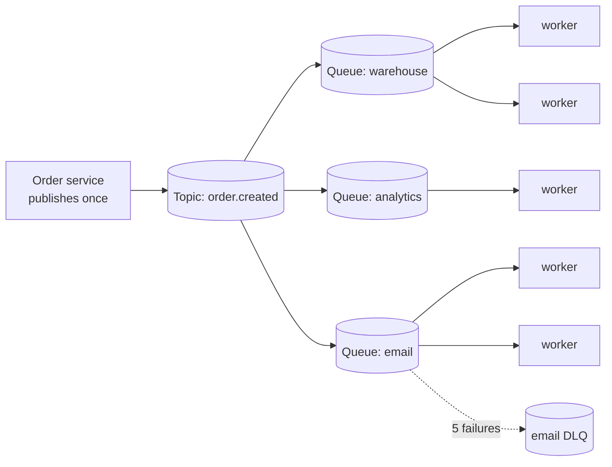

# Publish-subscribe versus point-to-point

## 1. What this is, and why they ask it

There are two ways to deliver a message, and choosing wrongly is one of the most expensive mistakes in an
architecture because it is very hard to undo later.

**Point-to-point** means one message, one recipient. The message goes into a queue, one consumer takes it, does
the work, and it is gone. This is what a task queue does.

**Publish-subscribe** means one message, every interested recipient. The publisher does not know who is
listening, and each subscriber gets its own copy. This is what a topic does.

They ask this because "one event, five consumers — queue or topic?" is a question with a correct answer and
because the wrong answer has a specific, recognisable smell: the publisher ends up holding a list of everyone
who cares, and adding a sixth consumer means changing and redeploying the publisher. **The real subject here
is coupling**, not message delivery, and interviewers use this question to find out whether you think about
who has to change when a requirement changes.

You met queues on [day 129](../day-129-connected-components/README.md) and Kafka on
[day 130](../day-130-grids-are-graphs/README.md). Today is the decision between the two shapes, the hybrid
that is what most real systems actually use, and the delivery guarantees that differ between them in a way
that catches people.

By the end of this lesson you can pick the shape from the requirement in one sentence, describe the
fan-out pattern that gives you both, name what each shape does about retries and failures, and explain why
"tell everyone" and "do this once" need different machinery even though both look like sending a message.

---

## 2. The story

Manohar has been the watchman at Sai Krupa for nine years, and he does two completely different jobs with the
same voice.

The first one happens when the tanker comes.

The building's borewell has never been enough in April and May, so a tanker arrives some afternoons, and when
it does everybody in all twenty-two flats needs to know within about two minutes, because the tanker fills the
underground tank and then people run their motors and fill their own. If you miss it you wait for the next
one.

So when the tanker turns into the gate, Manohar stands in the middle of the compound and shouts. Twice, loudly,
facing up. Then he walks to the back and shouts again for the flats that face the other way.

He does not know who hears him. He does not have a list. He does not go door to door. Some flats are empty in
the afternoon and those people simply miss it, and that is understood by everyone. Some flats have somebody
who runs down to check the motor, some do not bother because they filled yesterday. Whether anyone acts on it
is not his business. His job is that the announcement went out.

The second job is completely different, and it happens twenty times a day.

A courier turns up with a parcel for flat 402. Manohar signs for it, and then he takes it up to 402, or if
nobody is in he keeps it in the cabin and tells them when they come home.

He does not shout about the parcel. Nobody in 301 needs to know that 402 got a parcel. And crucially, the
parcel has to reach exactly one place — if it somehow got delivered to two flats there would be a problem,
and if it got delivered to none there would be a bigger one, because the man in 402 is waiting for it and will
ask.

So the parcel gets a record in the register, and it gets handed over, and if the person is not at home it stays
in the cabin until they are. It is not finished until somebody has taken it.

Manohar has never once confused the two. Nobody has ever had to explain the difference to him.

The new man who covered for him in December got it wrong the first week. A parcel came for 402 and he was busy,
so he announced it in the compound — "parcel for 402!" — and went back to the gate. Nobody came. The parcel sat
there for two days, and the man in 402 was quite reasonably annoyed, because he had been told nothing and the
announcement had gone to twenty-one people who did not care.

---

## 3. The idea in plain English

Manohar's two jobs are the two patterns, and the new man's mistake is the failure mode.

**Point-to-point is the parcel.** One message, exactly one recipient, and it is not finished until somebody has
taken it. In code: a **queue**. A producer writes; several consumers may be reading the queue, but each message
goes to exactly one of them. The consumers **compete** for messages.

**Publish-subscribe is the shout.** One message, every interested party gets a copy. In code: a **topic**. A
publisher writes; every **subscriber** receives it. The subscribers do not compete — they each get everything.

**The publisher does not know who is listening, and that is the point.** Manohar does not have a list of flats
that care about water. If a new family moves in, he does not change what he does. **Adding a subscriber does
not touch the publisher**, and that is the property you are buying.

**Point-to-point cares about completion; pub-sub cares about the announcement.** The parcel has to reach
somebody, so it is retried, held, and tracked. The shout goes out once — if you were not home, you missed it,
and Manohar does not chase you. This difference runs through everything: **queues have acknowledgements and
retries per message; a pure pub-sub broadcast often does not.**

**The wrong shape shows up as a specific smell.** If you use point-to-point where you needed pub-sub, the
publisher ends up with a list of recipients — publishing five copies of the same event to five queues, with the
list of interested parties hard-coded in the producer. Then adding a sixth consumer means changing and
redeploying the producer, and the producer's team has to care about the analytics team's requirements. **That
coupling is the cost, and it is invisible until the day somebody wants to add a consumer.**

**And the other way round is the new man's mistake.** Using pub-sub where you needed point-to-point means
either nobody does the work, or everybody does it — five subscribers all charging the same card.

**The vocabulary that tells you which one a system is offering:**

- **Queue** — competing consumers, message consumed once. SQS, RabbitMQ queues, Celery.
- **Topic** — every subscriber gets a copy. SNS, Redis pub-sub, MQTT, RabbitMQ fanout exchanges.
- **Consumer group** — Kafka's answer, and it is genuinely both: **within** a group, consumers compete like a
  queue; **between** groups, each gets everything like a topic. That is why Kafka can serve both patterns from
  one topic, and it is worth naming precisely because people describe Kafka as "a queue" and it is not.

**The hybrid is what real systems use, and it has a name: fan-out.** Publish once to a topic; each interested
team subscribes with **its own queue**. Now every team gets a copy — that is the pub-sub half — and within a
team, several workers compete for messages from their own queue with proper retries and a dead-letter queue —
that is the point-to-point half. **SNS to SQS is exactly this**, and it is the most common messaging shape in
production systems.

**The delivery guarantee differs, and this catches people.** A queue holds a message until somebody
acknowledges it. A pure broadcast — Redis pub-sub, for instance — delivers to whoever is connected *at that
moment* and forgets. A subscriber that was restarting misses the message permanently, with no error anywhere.
**"Fire and forget" is a real category and you must know which one you are using**, because it looks identical
in a diagram.

**And the filtering question.** In pub-sub, every subscriber gets everything by default, and often a subscriber
only wants a slice — "orders over ten thousand rupees", "events for the Mumbai region". Filtering at the broker
saves the subscriber from receiving and discarding; filtering at the subscriber is simpler and wastes
bandwidth. SNS supports message-attribute filters; Kafka does not, so you filter in the consumer or split into
separate topics.

---

## 4. The picture

The two shapes side by side:

```
POINT-TO-POINT (queue)                 PUBLISH-SUBSCRIBE (topic)

  producer                               publisher
     |                                       |
     v                                       v
  +-------+                              +-------+
  | queue |                              | topic |
  +-------+                              +-------+
   /  |  \                                /  |  \
  v   v   v                              v   v   v
 C1  C2  C3                             S1  S2  S3

 message 1 -> C1 only                   message 1 -> S1 AND S2 AND S3
 message 2 -> C2 only                   message 2 -> S1 AND S2 AND S3
 message 3 -> C1 only

 consumers COMPETE                      subscribers each get EVERYTHING
 more consumers = more throughput       more subscribers = same throughput,
                                        more total work
```

**What to notice.** Adding a consumer to a queue makes the system faster. Adding a subscriber to a topic makes
it do more work. Those are opposite effects and people conflate them constantly — "we'll add another consumer
to scale up" is right for a queue and meaningless for a topic.

The fan-out hybrid, which is what you should draw in an interview:



**What to notice.** The publisher has one arrow and knows about nothing downstream. Each team owns a queue,
scales its own workers independently, and has its own dead-letter queue — so the email team's poison message
does not affect the warehouse team at all. **Adding a fourth team is one new queue and one new subscription,
and the order service is not redeployed.**

And the anti-pattern, drawn so you recognise it:

```
  Order service
     |
     +-----> warehouse queue
     |
     +-----> analytics queue        <- the producer now holds the LIST
     |
     +-----> email queue
     |
     +-----> fraud queue            <- adding this line = a producer deploy

  Every consumer's existence is a fact the producer must know.
  The analytics team's requirements are now the order team's problem.
```

**What to notice.** It works. It is not slow. The cost is entirely organisational, and it arrives months later
in the form of "we need the order team to deploy before we can launch".

---

## 5. How it actually works

### The systems, and which shape each gives you

| System | Shape | Retries per message | Notes |
|---|---|---|---|
| SQS | Queue | Yes, with DLQ | Competing consumers, at-least-once |
| SNS | Topic | Only to HTTP/Lambda targets | Usually fans out to SQS |
| SNS → SQS | Both | Yes, per queue | **The standard production shape** |
| RabbitMQ direct | Queue | Yes | Routing by exact key |
| RabbitMQ fanout exchange | Topic | Via bound queues | Each bound queue gets a copy |
| RabbitMQ topic exchange | Filtered pub-sub | Via bound queues | Wildcard routing keys |
| Kafka | Both | No, build it yourself | Groups compete; groups are independent |
| Redis pub-sub | Topic, fire-and-forget | **No** | Missed if not connected |
| Redis Streams | Both | Yes, via consumer groups | The durable version |
| MQTT | Topic | QoS-dependent | Device fan-out |

**The row worth memorising is Redis pub-sub.** It is the classic "we used pub-sub and messages vanished"
story: `PUBLISH` delivers to currently connected subscribers and to nobody else. A subscriber that is
restarting, or briefly disconnected, misses the message with no error and no record. It is genuinely useful —
cache invalidation, live dashboards, presence — and genuinely wrong for anything you must not lose. **Redis
Streams is the durable alternative and is what you want most of the time.**

### RabbitMQ's exchanges, which is the clearest model

RabbitMQ separates publishing from routing, and the vocabulary is worth borrowing even when talking about other
systems.

A publisher writes to an **exchange**, never to a queue. The exchange's type decides what happens next:

```
direct exchange   routing key must match exactly       -> point-to-point
fanout exchange   ignore the key, copy to every bound queue -> pub-sub
topic exchange    wildcard match: "order.*.created"    -> filtered pub-sub
headers exchange  match on message attributes          -> rarely used
```

```
publish to a topic exchange with key "order.mumbai.created"

  queue A bound to "order.#"           -> receives it
  queue B bound to "order.mumbai.*"    -> receives it
  queue C bound to "order.delhi.*"     -> does not
  queue D bound to "payment.#"         -> does not
```

**The useful idea here is that the same publish can be point-to-point or pub-sub depending on what the
receivers have bound.** The publisher's code is identical in both cases, which is exactly the decoupling you
want.

### Kafka's version, precisely

Kafka does both with one mechanism and it is worth being able to state it exactly:

```
one topic, 6 partitions

  consumer group "warehouse"  with 3 consumers
      -> each consumer gets 2 partitions
      -> the group collectively sees every message ONCE   (queue behaviour)

  consumer group "analytics"  with 1 consumer
      -> that consumer gets all 6 partitions
      -> it also sees every message                       (pub-sub behaviour)

  the two groups have independent offsets and do not affect each other
```

**Within a group: competing consumers. Between groups: broadcast.** Say it in that form and it lands.

What Kafka does not give you is per-message retry, so a consumer that fails one message either blocks its
partition or must publish it to a retry topic itself. **That is the thing SQS gives you free and Kafka does
not**, and it is a real reason to put SQS behind SNS rather than use Kafka for work items.

### Filtering, and where to do it

```
SNS message-attribute filter:
    {"region": ["mumbai"], "amount": [{"numeric": [">", 10000]}]}
    -> the subscriber never receives what it does not want
```

Three places you can filter, in increasing order of waste:

1. **At the broker** — SNS filter policies, RabbitMQ topic bindings. The subscriber receives only what it
   wants. Cheapest, and limited to whatever the broker can express.
2. **In the consumer** — receive everything, discard most. Simple, and you pay network and processing for
   messages you throw away. Fine when the filtered fraction is large.
3. **Separate topics per category** — `orders.mumbai`, `orders.delhi`. Perfect filtering, and it multiplies
   the number of topics and makes cross-category consumers awkward.

**The rule: filter at the broker when it can express the condition, in the consumer when the discard rate is
low, and split topics only when the categories are genuinely separate concerns.**

### Ordering, which differs between the shapes

A queue with competing consumers has **no ordering** — message 3 can finish before message 1 because different
workers picked them up. Ordering requires either one consumer or partitioning by key, and both cap throughput.

A topic delivers to each subscriber independently, so each subscriber sees messages in whatever order that
subscriber's own path preserves. **Pub-sub does not make ordering easier or harder; it multiplies whatever
ordering problem you already had by the number of subscribers.**

### Idempotency is required in both, for different reasons

- **Queue:** at-least-once redelivery after a consumer crash.
- **Pub-sub with durable subscriptions:** the same, per subscriber.
- **Fan-out:** both, plus the possibility that the fan-out itself duplicates.

**There is no shape here that removes the need for idempotent consumers.**

---

## 6. The numbers

**What fan-out costs.** One event, five subscribers:

```
publish                    1 message written
delivered                  5 copies
storage (durable queues)   5 x message size
processing                 5 x the work
```

```
10,000 orders/s x 2 KB
  point-to-point           10,000 x 2 KB   = 20 MB/s
  fan-out to 5             50,000 x 2 KB   = 100 MB/s
```

**Five times the delivery volume for the same business events.** That is the honest cost of pub-sub and it is
worth stating before someone discovers it on the bill.

**Kafka's version is much cheaper, and this is the strongest argument for it in a fan-out design:**

```
Kafka: one copy stored, 5 consumer groups read it
  storage                  10,000 x 2 KB = 20 MB/s (x replication)
  network out              5 x 20 MB/s   = 100 MB/s
```

```
SNS -> 5 SQS queues: 5 stored copies AND 5 x network
Kafka, 5 groups:      1 stored copy  AND 5 x network
```

**The network cost is the same; the storage cost is five times lower.** At 20 MB/s with seven days of
retention that is the difference between 12 TB and 60 TB.

**Cost in money, on managed services:**

```
SNS publish        $0.50 per million
SQS operations     $0.40 per million (send + receive + delete = 3 calls)

10,000 orders/s = 864,000,000 orders/month

point-to-point (1 queue)
  SQS: 864M x 3 = 2.6B ops     = $1,040/month

fan-out to 5 queues
  SNS: 864M publishes           = $432
  SQS: 864M x 5 x 3 = 13B ops   = $5,200
                                -----------
                                  $5,632/month
```

```
with SQS batching (10 messages per call)
  SQS: 1.3B ops                 = $520
                                  $952/month total
```

**Batching is a factor of five to ten on the bill and it is the first thing to check.**

**Adding a subscriber: what changes.**

```
point-to-point, producer holds the list
  code change in the producer      1 pull request
  producer deploy                  yes
  coordination between teams       yes
  risk to existing consumers       non-zero

fan-out
  new queue + subscription         1 config change
  producer deploy                  NO
  coordination                     none
  risk to existing consumers       zero
```

**The engineering cost of the wrong shape is not measured in milliseconds.** It is measured in how many teams
have to be in the room.

**Throughput characteristics:**

```
queue, N consumers        throughput scales with N (up to the broker's limit)
topic, N subscribers      throughput per subscriber unchanged;
                          total broker work scales with N
```

```
SQS standard              effectively unlimited, ~3,000 msg/s per queue guidance
SQS FIFO                  300 msg/s per message group (3,000 batched)
SNS                       ~9,000 publishes/s per topic (soft limit, raisable)
Redis pub-sub             ~1,000,000 msg/s, zero durability
Kafka                     ~100,000+ msg/s per broker, durable
```

---

## 7. The trade-offs

**Pub-sub buys you decoupling and costs you visibility.** The publisher does not know who is listening, which
is the entire benefit — and it also means nobody can answer "who consumes this event?" without going and
looking. A topic with eleven subscribers, three of which are abandoned services nobody remembers, is a normal
outcome after three years. **Mitigate with a registry: subscriptions documented and reviewed**, and it is worth
saying that this is a process answer rather than a technical one.

**Point-to-point buys you certainty and costs you flexibility.** You know exactly who does the work, you get
per-message retries and a dead-letter queue, and you can trace a message end to end. What you pay is that
adding a second interested party means changing the producer or building a fan-out you should have had from the
start.

**Fan-out gives you both and multiplies your storage and your operational surface.** Five queues means five
sets of alarms, five DLQs, five sets of consumer scaling, and five copies of every message. It is the right
default for events with several consumers, and it is not free.

**Filtering at the broker saves bandwidth and limits what you can express.** SNS filter policies handle
equality, prefixes and numeric comparisons; anything more complex has to happen in the consumer. Pushing
filtering into the broker also moves business logic into infrastructure configuration, where it is harder to
test and easier to forget.

**Fire-and-forget pub-sub is a different product wearing the same word.** Redis pub-sub delivers to whoever is
connected and forgets. That is perfect for cache invalidation, where a missed message costs one stale read, and
catastrophic for order events. **The failure is silent** — no error, no metric, no DLQ — which makes it the
worst kind of wrong choice.

**And ordering is not helped by either shape.** Competing consumers destroy order; multiple subscribers each
have their own ordering problem. If order matters you are partitioning by key and capping parallelism,
whichever shape you picked.

**When would I not use pub-sub?** When there is exactly one consumer and no realistic prospect of a second —
a queue is simpler, cheaper and easier to reason about, and the fan-out can be introduced later with the
consumer's queue kept in place. When the "event" is really a command — "charge this card" has one correct
recipient, and broadcasting a command is how you get five charges. And when the volume is enormous and the
consumers few, where Kafka's single-copy model beats a real fan-out on storage by the number of subscribers.

---

## 8. In the interview

### How it gets asked

- *"One event, five consumers. Queue or topic?"* — the direct version.
- *"How do you add a new consumer without touching the producer?"*
- *"What is the difference between a queue and a topic?"*
- *"You are using Redis pub-sub and messages are going missing. Why?"*
- *"How does Kafka do both?"*
- *"Should this be an event or a command?"* — the framing question underneath all of it.

### The first ninety seconds

> "Topic, and specifically a fan-out: publish once to a topic, and each of the five consumers subscribes with
> its own queue.
>
> The reason is not delivery, it is coupling. If I use five queues and have the producer write to all of them,
> it works — but the producer now holds the list of everyone who cares. Adding a sixth consumer means a code
> change and a deploy of the producer, and the new team has to coordinate with the producer's team to launch.
> With a topic, the producer publishes one message and knows about nothing downstream; adding a consumer is one
> new subscription and one new queue, and the producer is not touched.
>
> **The reason I want a queue per consumer rather than plain pub-sub** is that each team then gets proper
> per-message semantics: their own retries, their own dead-letter queue, their own scaling, and their own
> backlog. If the email consumer hits a poison message, the warehouse consumer is completely unaffected. Plain
> pub-sub to five endpoints gives me none of that.
>
> On AWS that is SNS in front of five SQS queues, which is the standard shape. On Kafka it is one topic and
> five consumer groups, which gets me the same decoupling with one stored copy instead of five — within a group
> consumers compete like a queue, and between groups every group sees everything.
>
> The costs I would name up front: five times the delivery volume and five times the storage on the SQS
> version; five sets of alarms and DLQs to operate; and reduced visibility, because nobody can now answer 'who
> consumes this event' without looking it up.
>
> Are these five consumers doing genuinely different things, or is this one job being split for throughput?
> Because if it is the second, it is one queue with five workers and none of this applies."

### The follow-ups

**"Why not just have the producer write to five queues?"**

> "It works and it is the shape I would push back on, because the cost is organisational rather than technical
> and it arrives later.
>
> The producer now contains a list of its consumers. That means three things. Adding a consumer is a code
> change and a deploy of a service that has nothing to do with the new requirement — so the analytics team's
> launch is blocked on the order team's release cycle. The producer's failure handling gets more complicated,
> because it now has to decide what to do if four writes succeed and the fifth fails. And the producer's owners
> end up fielding questions about downstream systems they do not run.
>
> There is also a correctness wrinkle worth naming: five separate writes are not atomic. If the process dies
> after three of them, three consumers have the event and two do not, and there is no record of the
> discrepancy. With a topic there is one write and the broker handles the fan-out, so it is one thing that
> either happened or did not.
>
> The one case where I would accept it is two consumers that are genuinely never going to become three, where
> the extra topic is more machinery than the problem needs. But I would say that out loud as a deliberate
> choice rather than let it happen by default."

**"Messages are disappearing from our Redis pub-sub. What is going on?"**

> "Redis pub-sub is fire-and-forget. `PUBLISH` delivers to subscribers that are connected **at that instant**
> and to nobody else. There is no buffer, no storage, no acknowledgement and no replay. A subscriber that is
> restarting, or briefly disconnected by a network blip, or slow enough to have its output buffer filled and
> be dropped, misses those messages permanently — and nothing anywhere reports an error.
>
> That is not a bug, it is what it is for. It is genuinely good at cache invalidation, live dashboards and
> presence, where a missed message costs you one stale read and the next message fixes it.
>
> It is completely wrong for anything you must not lose, and the reason it keeps happening is that the API
> looks identical to a durable system. There is no signal in the code that tells you the difference.
>
> The fix, in increasing order of change: **Redis Streams** with consumer groups gives me durability,
> acknowledgements and replay on the same server. Or move to a real broker — SNS to SQS, or Kafka — if the
> events matter enough to justify it. I would also add a monitoring answer regardless: if messages can be lost
> silently, I want a sequence number per publisher so a subscriber can at least *detect* a gap."

**"Should this be an event or a command?"**

> "This is the question underneath the whole choice and I would rather answer it than the queue-or-topic
> question, because it settles that one.
>
> **A command** is an instruction to one recipient: 'charge this card', 'send this email', 'ship this order'.
> It has one correct handler, it must happen exactly once in effect, and the sender expects it to be carried
> out. Commands are point-to-point. Broadcasting a command is how you get five charges on one card.
>
> **An event** is a statement of fact: 'order 4471 was placed'. It has already happened, the publisher has no
> opinion about who should react, and zero or five recipients are both fine. Events are pub-sub.
>
> The naming is the tell. If the message is a verb in the imperative — `SendEmail` — it is a command. If it is
> a noun and a past-tense verb — `OrderPlaced` — it is an event.
>
> And the design advice that follows: **publish events, not commands, when you have a choice**, because an
> event does not need to know its recipients and a command does. 'Order placed' lets the email service decide
> to send an email; 'send order confirmation email' means the order service has decided that, and now the order
> service knows about emails."

**"How does Kafka give you both, exactly?"**

> "Through consumer groups, and the precise sentence is: **within a group, consumers compete; between groups,
> every group sees everything.**
>
> Concretely: a topic with six partitions. The warehouse group runs three consumers, so each gets two
> partitions and the group collectively processes every message once — that is queue behaviour. The analytics
> group runs one consumer, which gets all six partitions and also sees every message — and its offsets are
> completely independent of the warehouse group's. Add a third group and it costs the cluster nothing extra in
> storage, because there is still one copy of the log.
>
> That single-copy property is Kafka's real advantage in a fan-out design. SNS to five SQS queues stores five
> copies; Kafka with five groups stores one. At 20 MB a second with seven days of retention that is 12 TB
> against 60 TB.
>
> What Kafka does not give me is per-message acknowledgement, so there is no built-in retry or dead-letter
> behaviour — a message that always fails blocks its partition unless I build retry topics myself. That is the
> concrete thing SQS gives me free, and it is why I would not automatically choose Kafka for work items even in
> a system that already runs Kafka for events."

### The model answer

*"A ride-hailing app. When a trip ends, several things must happen: charge the rider, pay the driver, send both
receipts, update the driver's rating eligibility, feed the analytics warehouse, and check for fraud. Design the
messaging."*

> "The first thing I would do is sort those six into events and commands, because they are not the same kind of
> message and putting them all on one bus is the mistake.
>
> **`TripCompleted` is one event, published once to a topic.** It is a statement of fact with a trip ID, rider,
> driver, distance, duration and fare. The trip service publishes it and knows nothing about who reacts.
>
> **Analytics, fraud, and rating eligibility are pure subscribers.** They react to the fact, nothing depends on
> their answer in the trip's own flow, and if a fourth team wants trip data next quarter they add a
> subscription and nobody deploys anything. Each gets its own queue behind the topic, so each has independent
> retries, its own backlog, and its own dead-letter queue. Fraud being slow must not delay analytics.
>
> **Charging the rider is not an event, it is a command, and I would treat it differently.** It has exactly one
> correct handler, it moves money, and it must not happen twice. So the trip service — or a payment
> orchestrator subscribed to the topic — sends a `ChargeRider` command to a dedicated queue with an idempotency
> key equal to the trip ID. Point-to-point, one consumer group, per-message retry, DLQ, and reconciliation. If
> I broadcast that as an event and let a payment service 'react', I have lost the ability to say who is
> responsible for it happening exactly once.
>
> **Paying the driver is the same shape** and I would make it a separate command on a separate queue, not
> bundled with the charge, because the two fail independently and one failing must not block the other. The
> saga from [day 121](../day-121-trie-operations/README.md) governs the pair: if the charge is ultimately
> impossible, the driver payment still happens and the loss is written off — a business decision I would
> confirm rather than assume.
>
> **Receipts are events, or rather they are triggered by them.** The receipt service subscribes to
> `PaymentCaptured` rather than to `TripCompleted`, because a receipt for a payment that failed is worse than a
> late receipt. That ordering constraint comes from the data, not from the message bus, which is the robust
> way to express it.
>
> **Shape: SNS topic to SQS queues, or a Kafka topic with consumer groups**, and I would choose on volume. At a
> million trips a day — about twelve a second — SNS to SQS is simpler and the storage multiplication does not
> matter. At a hundred times that, Kafka's single stored copy across five groups saves real money, and I would
> accept building retry topics.
>
> **Every consumer is idempotent on the trip ID**, because both shapes are at-least-once. The charge consumer
> uses a dedup table with a unique constraint; the analytics consumer deduplicates on ingest; the receipt
> consumer keys on `(trip_id, recipient)`.
>
> **What I would monitor:** per-queue oldest-message age rather than depth, and DLQ depth per consumer with a
> named owner for each. And I would keep a subscription registry, because the failure mode of pub-sub two years
> in is eleven subscribers of which three belong to services nobody remembers deploying."

---

## 9. Recall card

**Point-to-point: one message, one consumer, consumers compete.** Pub-sub: one message, every subscriber gets a
copy, and **the publisher does not know who is listening** — which is the whole point.

**The smell of the wrong choice:** the producer holds a list of its consumers, so adding a consumer means
deploying the producer. Adding a consumer to a queue makes the system *faster*; adding a subscriber to a topic
makes it do *more work*.

**Fan-out is the production shape:** publish once to a topic, one queue per consumer. Pub-sub decoupling plus
per-consumer retries, DLQs and scaling. SNS → SQS, or a Kafka topic with one consumer group per team.

**Kafka does both with consumer groups:** *within* a group consumers compete; *between* groups every group sees
everything — and it stores one copy where SNS→SQS stores five.

**Redis pub-sub is fire-and-forget** — delivered only to whoever is connected right now, lost silently
otherwise. Fine for cache invalidation, wrong for anything that matters; Redis Streams is the durable version.
And: **publish events (facts, past tense, many listeners), send commands (imperatives, one handler).**
