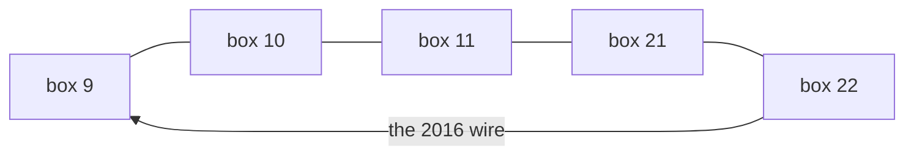

# Cycle detection in an undirected graph

## 1. What this is, and why they ask it

A cycle is a path that leaves a vertex and comes back to it without reusing an edge. Detecting one in an
undirected graph is a traversal with a single extra condition, and that condition is the entire lesson,
because the obvious version of it is wrong.

The obvious version says: if I reach a vertex I have already seen, that is a cycle. In a directed graph that
is nearly right. In an **undirected** graph it is completely wrong, and it reports a cycle on a graph with two
vertices and one edge — because an undirected edge `A—B` appears in both adjacency lists, so the moment you
walk from `A` to `B` and look around, you see `A`, which you have obviously already seen.

**The fix is to ignore the vertex you just came from**, and it is one parameter. Getting that right, and being
able to say why the directed version needs a completely different mechanism, is what the question tests.

They ask it because it is short enough for a warm-up and because it underlies things they will ask next.
"Is this graph a tree?" is "connected and acyclic". "Can these `n − 1` edges connect everything?" is the same.
Union-Find, which arrives on [day 138](../day-138-union-find/README.md), detects cycles as a side effect of
building groups, and comparing the two approaches is a standard follow-up.

By the end of this lesson you can write the DFS version with the parent check and the BFS version, say
precisely why the parent check is needed and when excluding by vertex is not enough, detect a cycle with
Union-Find, and state the edge-count shortcut that answers the question with no traversal at all.

---

## 2. The story

The intercom in Ashirwad Society has never worked properly, and in February Vasant finally set out to find out
why.

He is an electrician, sixty-one, and he has done work in that building since it was put up. The intercom runs
on a wire that goes from flat to flat through a series of small grey junction boxes screwed to the wall at the
corner of every landing. There are about thirty of them.

Nobody has a drawing of it. The man who wired it originally died in 2011 and the work was extended twice after
that by people who did not ask him anything.

So Vasant did the only thing available, which was to walk it.

He started at the box by the main gate, opened it, and picked one of the wires leaving it. He followed it to
the next box and put a chalk mark on that one. Then a wire out of that box to the next, chalk. Then the next.
Up the stairs, along the second-floor landing, through the box behind the lift shaft, and on.

The rule he gave himself was simple. If he ever opened a box and found chalk already on it, then this wire had
come round in a loop, and that was worth knowing, because a loop in that wiring is exactly the kind of thing
that makes an intercom hum.

Twenty minutes in, he hit the problem with the rule.

He had gone from box 14 to box 15, and box 15 had two wires leaving it — the one he came in on, and one more.
He opened the second one, followed it, and it went to box 14. Which had chalk on it.

He stood there for a second and then laughed at himself, because of course it did. He had just come from box
14. The wire between 14 and 15 is one wire. Looking at it from the 15 end and finding that it goes to 14 is
not a discovery. It is the same wire he walked in on.

So he added a second half to the rule, and it is the whole of what he learnt that morning: **a chalked box only
means a loop if it is not the box you just came from.**

With that, the walk went properly. He found the real loop at about eleven — a wire from box 22 running all the
way down the back of the building to box 9, put in by somebody in about 2016, presumably because it was
shorter than going round. Two paths to the same place.

He cut it, and the humming stopped.

---

## 3. The idea in plain English

Vasant's rule, both halves, is the algorithm.

**A cycle is a path that returns to where it started without reusing an edge.** That last clause is what makes
undirected cycle detection different from directed. Walking `A → B → A` is not a cycle, because you used the
same edge twice — you went out and came back on the one wire. A cycle needs at least three distinct vertices
in an undirected simple graph.

**The traversal is unchanged.** DFS or BFS, a `seen` set, exactly as on
[day 128](../day-128-graph-dfs/README.md). Nothing new.

**The naive condition: "I reached a vertex already in `seen`, so there is a cycle."** In a directed graph this
is nearly right. In an undirected graph it is wrong on the smallest possible input, because an undirected edge
is stored twice — `graph[A]` contains `B` and `graph[B]` contains `A`. So walking `A → B` and then looking at
`B`'s neighbours immediately shows `A`, which is in `seen`. That is not a loop, it is **the edge you just
walked, seen from the other end.**

**The fix: pass down where you came from, and skip it.** Each recursive call carries the vertex that called
it — its **parent** — and the check becomes "seen, **and not my parent**". That is Vasant's second half.

```
if neighbour not in seen:      recurse with parent = current
elif neighbour != parent:      CYCLE
```

**Two lines, and the `elif` is the algorithm.**

**Why the directed version cannot use this.** In a directed graph, `A → B` puts `B` in `A`'s list and puts
nothing in `B`'s list. So there is no mirror edge to ignore, and the parent check has nothing to do. What a
directed graph needs instead is the three-colour scheme from
[day 128](../day-128-graph-dfs/README.md) — grey means "on the current path" — because there the danger is
reaching an *ancestor*, and a vertex that is merely `seen` might be a finished region rather than an ancestor.
**Two different problems that share a name.** [Day 133](../day-133-directed-cycles/README.md) is the other one.

**And the case where excluding by vertex is not enough.** If the graph can have two separate edges between the
same pair — **parallel edges** — then `A—B` twice genuinely *is* a cycle, and skipping "the parent vertex"
wrongly ignores it. The fix is to exclude by **edge** rather than by vertex: pass the id of the edge you came
in on. Most problems promise no parallel edges; when they do not, ask.

**A self-loop is also a cycle**, trivially — an edge from a vertex to itself. The parent check does not catch
it, because the neighbour equals the current vertex and not the parent. One extra condition, or a promise from
the problem statement.

**BFS works too, with the same idea.** Store each vertex's parent in a dictionary rather than passing it down,
and the condition is identical. Use BFS when the graph might be deep enough to overflow the recursion stack.

**And there is a shortcut that answers the question with no traversal at all.** A connected undirected graph
with `V` vertices and no cycle is a **tree**, and a tree has exactly `V − 1` edges. So:

```
E > V - 1  ->  there is definitely a cycle
E < V - 1  ->  the graph cannot be connected
E = V - 1  ->  cycle if and only if it is disconnected
```

**On a graph promised to be connected, "is `E ≥ V`" answers the whole question in constant time.** That is
worth knowing, worth saying, and worth not using when connectivity is not promised — because a graph with
`V = 5`, `E = 4` can be a tree, or it can be a triangle plus a separate edge.

**Union-Find is the other real answer.** Process the edges one at a time: for each, check whether its two
endpoints are already in the same group. If they are, this edge closes a cycle. If not, merge them. That is
effectively linear and it is the right tool when edges arrive over time — the same rule as
[day 129](../day-129-connected-components/README.md).

---

## 4. The picture

Vasant's mistake, drawn:

```
        walk 14 -> 15, then look at 15's neighbours

        box 14 [chalked]  ------  box 15 [chalked]
              ^                        |
              |                        |
              +------------------------+
                 the SAME wire, seen
                 from the other end

        naive rule:  "14 is chalked!"  ->  reports a cycle
        real rule:   "14 is my parent" ->  skip it
```

**What to notice.** There is one wire and two views of it. Every undirected edge produces exactly this false
alarm, once, at every vertex — which is why the naive version reports a cycle on literally any graph with an
edge in it.

The real loop:



```
walk:  9 -> 10 -> 11 -> 21 -> 22, then 22 looks at 9

  9 is seen.      yes
  9 is my parent? no — my parent is 21
                  -> CYCLE
```

**What to notice.** The vertex that closes the cycle is not the one you came from, and it is not adjacent in
the walk. That is the difference between a genuine back edge and the mirror of the edge you just used.

And the edge-count shortcut, on three small graphs:

```
   TREE                  CYCLE                DISCONNECTED

   A                     A --- B              A --- B      D --- E
   |                     |     |
   B --- C               +-----+              C
   |
   D

   V=4, E=3              V=3, E=3             V=5, E=3
   E = V-1               E > V-1              E = V-1
   no cycle              CYCLE, certain       cannot tell from
                         with no traversal    the counts alone
                                              (here: no cycle)
```

**What to notice.** The middle case is decided by arithmetic. The right-hand case is not — `E = V − 1` with a
disconnected graph could be a triangle plus two isolated vertices, which has a cycle, or two separate paths,
which does not. **The shortcut only decides things when the graph is promised connected, or when `E` is large
enough that no arrangement avoids a cycle.**

---

## 5. The code, built step by step

The recursive version first, because it is four lines of logic.

```python
def has_cycle(graph: dict[int, list[int]], n: int) -> bool:
    seen: set[int] = set()

    def visit(vertex: int, parent: int) -> bool:
        seen.add(vertex)
        for neighbour in graph[vertex]:
            if neighbour not in seen:
                if visit(neighbour, vertex):     # pass myself down as the parent
                    return True
            elif neighbour != parent:            # seen, and NOT where I came from
                return True
        return False

    return any(v not in seen and visit(v, -1) for v in range(n))
```

Three things to point at.

`visit(neighbour, vertex)` passes the current vertex down as the child's parent. That is how the child knows
which neighbour to ignore.

The `elif` is the whole algorithm. `neighbour in seen` alone is not enough; `neighbour in seen and neighbour !=
parent` is the condition.

`-1` as the root's parent is a value no real vertex has, so the root ignores nothing. If your vertices are
strings, use `None`.

And the `any(...)` at the end is the outer loop from
[day 129](../day-129-connected-components/README.md). **A cycle can live in a component that has no connection
to vertex 0**, so starting from one vertex is not enough.

Now the iterative BFS version, which you write when the graph might be deep:

```python
from collections import deque

def has_cycle_bfs(graph: dict[int, list[int]], n: int) -> bool:
    seen: set[int] = set()
    for start in range(n):
        if start in seen:
            continue
        parent = {start: -1}                     # parent map instead of a parameter
        seen.add(start)
        queue = deque([start])
        while queue:
            current = queue.popleft()
            for neighbour in graph[current]:
                if neighbour not in seen:
                    seen.add(neighbour)
                    parent[neighbour] = current
                    queue.append(neighbour)
                elif neighbour != parent[current]:
                    return True
        # continue to the next component
    return False
```

Identical condition, different bookkeeping: the parent lives in a dictionary rather than on the call stack.

There is a subtlety here worth knowing. In BFS on an undirected graph, `neighbour != parent[current]` can fire
for two vertices in the same ring that share an edge — and that *is* a genuine cycle, so the answer is right.
But it also means BFS may detect the cycle from a different place than DFS would. Both are correct; the
witnesses differ.

Handling parallel edges, when the problem allows them:

```python
def has_cycle_edge_ids(adj: dict[int, list[tuple[int, int]]], n: int) -> bool:
    """adj[v] holds (neighbour, edge_id). Excludes the EDGE you came in on."""
    seen: set[int] = set()

    def visit(vertex: int, in_edge: int) -> bool:
        seen.add(vertex)
        for neighbour, edge_id in adj[vertex]:
            if edge_id == in_edge:               # the same wire, not a loop
                continue
            if neighbour not in seen:
                if visit(neighbour, edge_id):
                    return True
            else:
                return True
        return False

    return any(v not in seen and visit(v, -1) for v in range(n))
```

The only change is excluding by `edge_id` rather than by vertex. Now two separate edges between `A` and `B`
correctly report a cycle, because the second one has a different id.

The Union-Find version, which is the one to offer when edges arrive over time:

```python
def has_cycle_union_find(n: int, edges: list[tuple[int, int]]) -> bool:
    parent = list(range(n))

    def find(x: int) -> int:
        while parent[x] != x:
            parent[x] = parent[parent[x]]        # path compression, halving
            x = parent[x]
        return x

    for a, b in edges:
        ra, rb = find(a), find(b)
        if ra == rb:
            return True                          # both ends already connected
        parent[ra] = rb
    return False
```

**Read the `if`: an edge whose two endpoints are already in the same group must close a cycle**, because they
were already connected by some other path. That is the entire idea, and it is why Union-Find detects cycles
without ever traversing.

And the shortcut, for the case where it applies:

```python
def is_tree(n: int, edges: list[tuple[int, int]]) -> bool:
    """A tree is connected AND acyclic. E = V-1 plus connected is enough."""
    if len(edges) != n - 1:
        return False                             # too many -> cycle; too few -> disconnected
    return count_components(build(n, edges)) == 1
```

With `E = V − 1` established, connectivity alone decides it: a connected graph with exactly `V − 1` edges
cannot have a cycle, because any cycle would need an extra edge somewhere.

### The complete solution

```python
"""Cycle detection in an undirected graph: DFS, BFS, Union-Find, and the counting shortcut."""

from __future__ import annotations

from collections import defaultdict, deque


def build(n: int, edges: list[tuple[int, int]]) -> dict[int, list[int]]:
    graph: dict[int, list[int]] = {v: [] for v in range(n)}
    for a, b in edges:
        graph[a].append(b)
        graph[b].append(a)
    return graph


def has_cycle_dfs(graph: dict[int, list[int]], n: int) -> bool:
    """Recursive. The parent parameter is the whole algorithm."""
    seen: set[int] = set()

    def visit(vertex: int, parent: int) -> bool:
        seen.add(vertex)
        for neighbour in graph[vertex]:
            if neighbour not in seen:
                if visit(neighbour, vertex):
                    return True
            elif neighbour != parent:
                return True
        return False

    return any(v not in seen and visit(v, -1) for v in range(n))


def has_cycle_bfs(graph: dict[int, list[int]], n: int) -> bool:
    """Iterative. Same condition; the parent lives in a dict. No recursion limit."""
    seen: set[int] = set()
    for start in range(n):
        if start in seen:
            continue
        parent = {start: -1}
        seen.add(start)
        queue = deque([start])
        while queue:
            current = queue.popleft()
            for neighbour in graph[current]:
                if neighbour not in seen:
                    seen.add(neighbour)
                    parent[neighbour] = current
                    queue.append(neighbour)
                elif neighbour != parent[current]:
                    return True
    return False


def has_cycle_union_find(n: int, edges: list[tuple[int, int]]) -> bool:
    """An edge between two vertices already in one group closes a cycle."""
    parent = list(range(n))

    def find(x: int) -> int:
        while parent[x] != x:
            parent[x] = parent[parent[x]]
            x = parent[x]
        return x

    for a, b in edges:
        ra, rb = find(a), find(b)
        if ra == rb:
            return True
        parent[ra] = rb
    return False


def quick_verdict(n: int, edges: list[tuple[int, int]], connected: bool) -> str:
    """Arithmetic only. Decides some cases in O(1)."""
    e = len(edges)
    if e > n - 1:
        return "cycle, certain"
    if connected and e == n - 1:
        return "no cycle, certain (it is a tree)"
    if e < n - 1:
        return "cannot be connected; cycle unknown"
    return "unknown without a traversal"


if __name__ == "__main__":
    tree = [(0, 1), (0, 2), (1, 3)]
    ring = [(0, 1), (1, 2), (2, 0)]
    two_pieces = [(0, 1), (1, 2), (2, 0), (3, 4)]

    for name, n, edges in (("tree", 4, tree), ("ring", 3, ring), ("two pieces", 5, two_pieces)):
        graph = build(n, edges)
        print(f"{name:12} dfs={has_cycle_dfs(graph, n)!s:5} "
              f"bfs={has_cycle_bfs(graph, n)!s:5} "
              f"uf={has_cycle_union_find(n, edges)!s:5} "
              f"| {quick_verdict(n, edges, connected=False)}")

    # The two-vertex case that breaks the naive rule.
    pair = build(2, [(0, 1)])
    print("single edge :", has_cycle_dfs(pair, 2), "(must be False)")
```

Running it:

```
tree         dfs=False bfs=False uf=False | unknown without a traversal
ring         dfs=True  bfs=True  uf=True  | cycle, certain
two pieces   dfs=True  bfs=True  uf=True  | unknown without a traversal
single edge : False (must be False)
```

Two things to look at. The `tree` row shows the shortcut being honest: with `E = 3` and `V = 4` it is
`E = V − 1`, and because we did not promise connectivity, arithmetic alone cannot decide — the traversal has
to. The `two pieces` row is the same arithmetic reaching the same non-answer on a graph that *does* have a
cycle, which is exactly why the shortcut is a shortcut and not a solution.

And the last line is the test that matters most. Two vertices, one edge, and the answer must be `False`. If
your implementation says `True` there, the parent check is missing and nothing else you test will tell you.

---

## 6. What it costs

**DFS and BFS.**

```
each vertex visited once                       V
each vertex's neighbours scanned once          2E  (each edge twice, once per end)
                                               -----------------------
                                               O(V + E) time
seen set + parent map                          O(V)
recursion stack or queue                       O(V)
                                               -----------------------
                                               O(V) space
```

Both traversals are the same. There is no version of this problem where one is faster.

**Early exit is worth a lot in practice.** The moment a cycle is found you return, and a graph with a cycle
near the start is decided in a handful of steps:

```
V = 1,000,000, E = 3,000,000, a triangle among the first few vertices
worst case      4,000,000 steps
actual          ~ 10 steps
```

The worst case is a graph with no cycle at all, where you must visit everything to be sure.

**Union-Find.**

```
per edge: two finds and possibly one union
with path compression and union by rank/size:  O(alpha(V)) each
alpha is inverse Ackermann: <= 4 for any n that fits in the universe
                                               -----------------------
                                               O(E x alpha(V)) ~ O(E)
parent array                                   O(V)
```

**Effectively linear too**, so for a one-shot answer on a static graph the two are equivalent and the traversal
is fewer lines. Where they diverge:

```
edges arriving one at a time, answer after each

traversal   m x O(V + E)      quadratic
Union-Find  m x O(alpha)      linear
```

```
m = 100,000 edges, V = 100,000
traversal:   100,000 x 300,000 = 30,000,000,000 steps
Union-Find:  100,000 x 4       = 400,000 steps
```

**Seventy-five thousand times faster**, and that gap is the whole reason to know both.

**The counting shortcut.**

```
E > V - 1                O(1)   -> cycle, certain
connected and E = V - 1  O(1)   -> no cycle, certain
everything else                 -> you still need the traversal
```

On a promised-connected graph this is the fastest possible answer and it is worth saying before you write
anything:

```
V = 10,000,000, E = 10,000,001, connected
answer: cycle. Zero traversal, one comparison.
```

**A cheap early check that helps in practice**, even when it cannot decide:

```
if len(edges) > n - 1: return True     # one comparison, catches many inputs
```

**Space, compared:**

```
DFS recursive     O(V) stack — and RecursionError past ~1,000 depth
BFS iterative     O(V) queue — no limit
Union-Find        O(V) array — the smallest constant of the three
```

For `V = 10^6`, Union-Find is one list of a million integers, about 8 MB. The traversal needs a `seen` set and
a parent map — two hash structures, closer to 100 MB in Python. **When memory is tight, Union-Find wins on
constants even though all three are `O(V)`.**

---

## 7. The traps

### The missing parent check

The near-miss, and it fails on the smallest possible graph:

```python
def visit(vertex):
    seen.add(vertex)
    for neighbour in graph[vertex]:
        if neighbour in seen:
            return True                  # "cycle"
        if visit(neighbour):
            return True
    return False
```

```
>>> graph = build(2, [(0, 1)])
>>> has_cycle_broken(graph, 2)
True
```

Two vertices, one edge, and it reports a cycle. The walk goes `0 → 1`, then `1` looks at its neighbours and
finds `0`, which is in `seen` — because it is the vertex we came from, along the one edge that exists.

**Every undirected graph with at least one edge triggers this.** Test with a single edge before anything else;
it is the fastest possible way to find out whether the check is there.

### Excluding the parent by vertex when parallel edges exist

```python
elif neighbour != parent:
    return True
```

With edges `[(0, 1), (0, 1)]` — two separate wires between the same pair:

```
>>> has_cycle_dfs(build_multi(2, [(0,1), (0,1)]), 2)
False
```

That is wrong: two distinct edges between the same pair form a cycle of length two. The parent check
suppresses both mirror views and one genuine edge along with them.

The fix is to exclude by edge id rather than by vertex. Most problems promise simple graphs, so **ask whether
parallel edges are possible** rather than assuming either way.

### Self-loops

```python
edges = [(0, 0)]
```

```
>>> has_cycle_dfs(build(1, [(0, 0)]), 1)
False
```

`0` looks at its neighbour `0`, which is in `seen` — but `0` is also its own parent value... actually its
parent is `-1`, so `neighbour != parent` is true and it *should* return `True`. Whether it does depends on
whether your builder added the self-loop once or twice. **That ambiguity is the point:** self-loops are an
edge case that different implementations handle differently by accident. Either handle them explicitly with
`if neighbour == vertex: return True`, or confirm the problem excludes them.

### Only searching from one vertex

```python
return visit(0, -1)
```

A graph whose only cycle is among vertices 7, 8 and 9, with nothing connecting them to vertex 0:

```
>>> has_cycle_from_zero(graph, 10)
False                                # there is a triangle at 7-8-9
```

The outer loop over every vertex, with `seen` shared, is required. The sample input for these problems is
almost always connected, so nothing warns you.

### Using the directed algorithm

```python
colour = [WHITE] * n
# ... grey/black three-colour scheme ...
```

On an undirected graph, the three-colour scheme reports a cycle immediately, for the same reason as the naive
version: walking `A → B` makes `A` grey, and `B` sees `A` as grey. **The colours do not save you** — they solve
a different problem, which is reaching an *ancestor* in a directed graph.

Conversely, using the parent check on a **directed** graph misses cycles, because there is no mirror edge and
the check simply never fires usefully.

**The two algorithms are not interchangeable and the word "cycle" is the same in both.** Confirm which kind of
graph you have before choosing.

### Recursion depth

```
Traceback (most recent call last):
  File "cycles.py", line 9, in visit
    if visit(neighbour, vertex):
  [Previous line repeated 995 more times]
RecursionError: maximum recursion depth exceeded
```

A graph that is a long path — a chain of 100,000 vertices — needs 100,000 frames. `n <= 10^5` in the
constraints means write the BFS version or the Union-Find version.

---

## 8. In the interview

### How it gets asked

- *"Does this undirected graph contain a cycle?"* — the direct version.
- *"Given `n` nodes and a list of edges, is this a valid tree?"* — LeetCode 261, and it is this plus
  connectivity.
- *"Can these edges be added without creating a loop?"* — Union-Find framing.
- *"Find the edge that, when removed, makes this a tree."* — LeetCode 684, redundant connection.
- *"How many extra edges do you need to connect all the components?"* — components plus the edge count.

### The first ninety seconds

> "A traversal with one extra condition, and the condition is the interesting part.
>
> The naive version says 'if I reach a vertex I have already seen, that is a cycle'. In an undirected graph
> that is wrong on the smallest possible input, and I would demonstrate why: an undirected edge `A—B` is stored
> in both adjacency lists, so as soon as I walk from `A` to `B` and look at `B`'s neighbours, I see `A`, which
> is in `seen`. That is not a loop — it is the same edge, seen from the other end. Two vertices, one edge, and
> the naive check reports a cycle.
>
> So I pass down the vertex I came from, and the condition becomes: **seen, and not my parent.** That is the
> whole algorithm.
>
> I would write it either as DFS with the parent as a parameter, or as BFS with a parent dictionary — same
> condition, and I would choose BFS if `n` can be large, because a graph that is a long chain overflows the
> recursion stack at about a thousand.
>
> Two other things I would set up before coding. The loop is over **every** vertex with a shared `seen` set,
> because a cycle can sit in a component that nothing connects to where I started. And I would ask whether
> parallel edges or self-loops are possible, because excluding 'the parent vertex' also wrongly excludes a
> genuine second edge between the same pair — if those are allowed, I exclude by edge id instead.
>
> `O(V + E)` time and `O(V)` space.
>
> And before any of that: if the graph is promised connected, `E > V − 1` answers the question in one
> comparison, because a connected acyclic graph is a tree and has exactly `V − 1` edges. Is it connected?"

### The follow-ups

**"Why does the directed version need something different?"**

> "Because the thing that makes undirected tricky does not exist there, and a different thing does.
>
> In an undirected graph, every edge appears in both adjacency lists, so every edge produces one false alarm —
> and that is what the parent check suppresses.
>
> In a directed graph, `A → B` puts `B` in `A`'s list and nothing in `B`'s. There is no mirror edge, so there
> is nothing for a parent check to do. What matters instead is whether the vertex I have reached is an
> **ancestor** — still on the path from the root to where I am now — because an edge back to an ancestor closes
> a loop, while an edge into a region I have already finished exploring does not.
>
> So the directed version needs three states: white for untouched, grey for 'started and not finished, so on my
> current path', black for finished. An edge to grey is a cycle; an edge to black is a shared dependency and is
> fine. Two states cannot tell those apart, and the classic failure is a diamond — `0→1→3` and `0→2→3` — where
> a two-state check reports a cycle on a graph that has none.
>
> **Same word, two genuinely different algorithms**, and the first thing I would establish about any cycle
> question is which kind of graph it is."

**"Solve it with Union-Find instead."**

> "Process the edges one at a time. For each edge, find the representative of both endpoints. If they are the
> same, the two vertices were already connected by some other path, so this edge closes a cycle. If they
> differ, merge the two groups and carry on.
>
> That is about eight lines and it never traverses anything.
>
> With path compression and union by size, each operation is effectively constant — inverse Ackermann, at most
> four for any realistic input — so the whole thing is `O(E)` with a very small constant, and the memory is one
> array of `V` integers rather than a `seen` set and a parent map.
>
> For a one-shot answer on a static graph, the traversal is fewer lines and I would probably write that. **The
> case where Union-Find is not just an alternative but the only option is edges arriving over time** — 'after
> each new connection, is there a loop yet?'. Re-running a traversal per edge is `m × O(V + E)`, which at a
> hundred thousand edges and vertices is thirty billion steps; Union-Find is four hundred thousand.
>
> It is also the natural fit for the redundant-connection problem, where you want the *first* edge that creates
> a cycle — Union-Find gives you that directly, and a traversal would need extra work to identify which edge
> was responsible."

**"Is this a valid tree?"**

> "A tree is connected and acyclic, and the cheapest way to check both is to use the arithmetic first.
>
> If `E ≠ V − 1`, it is not a tree, immediately — too many edges guarantees a cycle, too few guarantees it is
> disconnected. That is one comparison and it rejects most invalid inputs.
>
> Once `E = V − 1` holds, I only need to check **one** of the two properties, because with exactly `V − 1`
> edges, connected implies acyclic and acyclic implies connected. So a single traversal from vertex 0 that
> visits all `V` vertices is sufficient — if it does, it is a tree; if it does not, it is not.
>
> That is a nice simplification and I would say why it works: a connected graph on `V` vertices needs at least
> `V − 1` edges, and any cycle means some vertex is reachable two ways, which means the remaining edges cannot
> reach everything. So with exactly `V − 1`, the two failure modes cannot occur separately.
>
> Union-Find gives the same answer in one pass: run through the edges, return false the moment an edge joins
> two vertices already in the same group, and at the end check that there is exactly one group left."

**"Which edge would you remove to break the cycle?"**

> "Depends on which edge they want, and I would ask.
>
> With Union-Find and edges processed in the given order, the **first** edge that joins two already-connected
> vertices is the one that created the cycle in that ordering. That is what LeetCode's redundant-connection
> problem wants — the last edge in the input that can be removed — and Union-Find gives it with no extra work.
>
> If they want a specific edge — the heaviest, or one whose removal disconnects nothing else — that is
> different. Any edge *on* the cycle can be removed without disconnecting the graph, and finding the cycle's
> edges means recording the DFS path: when the back edge is found, the cycle is the path from the ancestor down
> to the current vertex, plus the back edge itself. So I keep the current path as a list, and when `neighbour
> in seen and neighbour != parent`, I slice the path from `neighbour` onwards.
>
> And the related question that uses the same machinery is **bridges** — edges whose removal *does* disconnect
> the graph. An edge is a bridge exactly when it is on no cycle, and there is a linear DFS that finds all of
> them at once by tracking the earliest ancestor reachable from each subtree. I would name that rather than
> write it unprompted."

### The model answer

*"You are given `n` computers numbered 0 to n−1 and a list of cables, each connecting two computers. Determine
whether the network contains a redundant cable — one that could be removed without disconnecting anything."*

> "A redundant cable is exactly an edge that lies on a cycle, so this is undirected cycle detection with a
> small extra step to identify the edge. Let me build it up.
>
> **First, the arithmetic, because it costs one comparison.** A connected network with no redundancy is a tree
> and has exactly `n − 1` cables. If there are more, redundancy is certain before I look at anything. If there
> are fewer, the network is definitely already disconnected, which is a different problem the operator probably
> cares about more. I would say both of those out loud because they are free.
>
> **Then the detection.** Union-Find, and I would choose it over a traversal here specifically because the
> question asks *which* cable rather than *whether*. Processing the cables in order, the first one whose two
> endpoints are already in the same group is the cable that closed a loop — everything before it was
> tree-building. A traversal would tell me a cycle exists and then need more work to name the responsible edge.
>
> **The implementation is the standard one:** a parent array, `find` with path compression, and union by size
> so the trees stay shallow. Each cable is two finds and at most one union, effectively constant, so the whole
> pass is `O(E)` with an `O(V)` array — for a million computers that is one list of a million integers, about 8
> megabytes, against a `seen` set and parent map for a traversal, which in Python would be an order of
> magnitude more.
>
> **What I would be careful about.** The network is almost certainly not connected — that is often the actual
> problem being investigated — so I must not stop at the first component. Union-Find handles that naturally,
> since it never assumes connectivity. And I would ask about two input possibilities: can the same pair be
> cabled twice, and can a cable loop back to the same computer? Both are physically plausible here, unlike in
> an abstract problem. A duplicate cable between the same pair *is* redundancy and Union-Find catches it
> correctly, because the second one finds both endpoints already merged — **which is a case the DFS parent
> check would silently miss**, and that is a real argument for Union-Find on this particular problem.
>
> **What I would return.** Not just a boolean. The list of redundant cables, and the component count at the
> end — because 'there is one redundant cable and the network is in three pieces' is a completely different
> operational situation from 'there is one redundant cable and everything is connected', and the second number
> costs nothing once the structure exists.
>
> **The follow-up I would expect** is 'now cables are added one at a time and I want to know each time' — and
> the answer is that Union-Find already does that. It is an online algorithm; the traversal is not. Re-running
> a traversal after each of a hundred thousand cables would be thirty billion steps against four hundred
> thousand."

---

## 9. Recall card

**A cycle returns to a vertex without reusing an edge.** In an undirected graph every edge is stored twice, so
"already seen" fires once per edge and is not a cycle — it is the edge you walked in on, viewed from the other
end.

**The condition is `seen AND not the parent`.** Pass the current vertex down as the child's parent (DFS) or
keep a parent map (BFS). Test with two vertices and one edge: the answer must be `False`.

**Directed is a different algorithm.** No mirror edges there, so the parent check does nothing; you need three
colours, where **grey means on the current path**. Establish which kind of graph you have first.

**Union-Find detects a cycle without traversing:** an edge whose endpoints are already in the same group closes
one. Effectively `O(E)`, smaller constant memory, works **online** as edges arrive — and it catches parallel
edges that the parent check misses.

**The free check: a connected acyclic graph has exactly `V − 1` edges.** `E > V − 1` means a cycle, with no
traversal. And once `E = V − 1`, checking connectivity alone decides "is this a tree".
