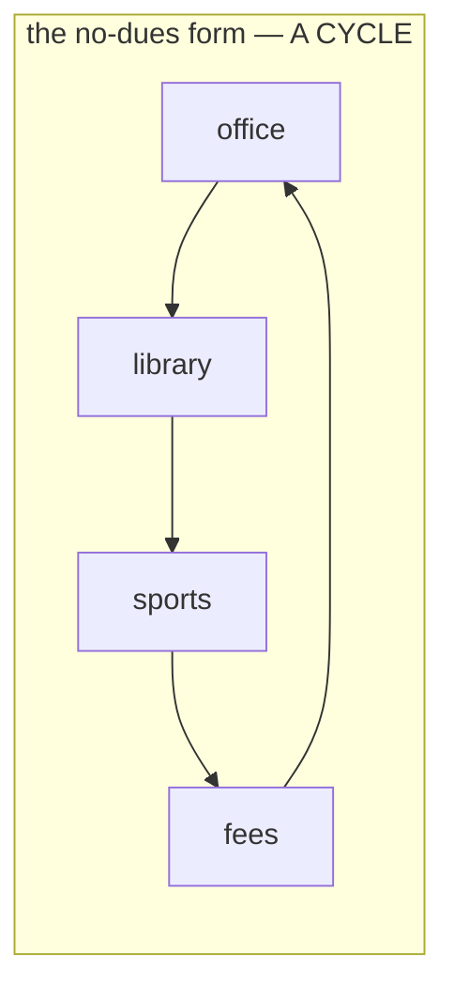
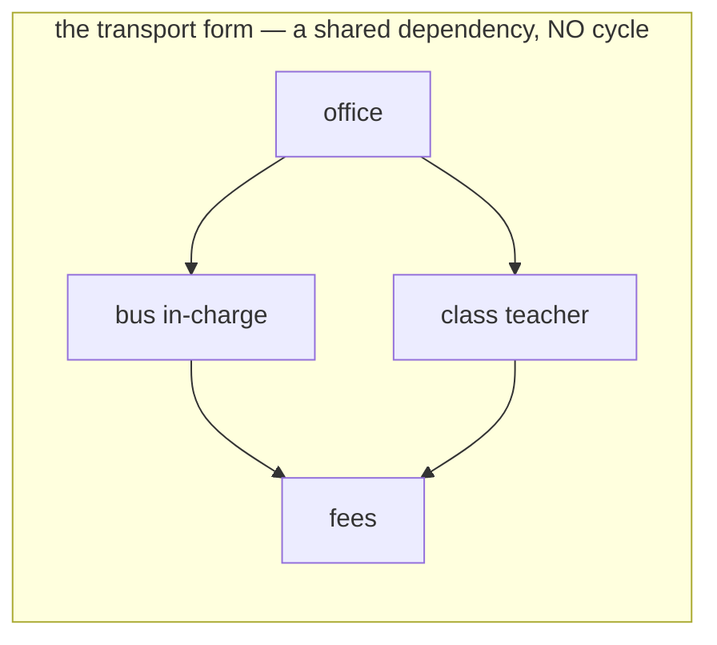

# Cycle detection in a directed graph

## 1. What this is, and why they ask it

In a directed graph a cycle is a set of vertices that each wait for the next, all the way round. Nothing in
the set can ever go first. That is why the question matters: a directed cycle means a schedule that cannot be
run, a build that cannot be ordered, a set of courses nobody can start.

The algorithm is a depth-first search with three states instead of two. **White** for untouched, **grey** for
"started and not finished — so it is on the path I am standing on right now", **black** for finished. An edge
to a grey vertex is a cycle. An edge to a black vertex is not.

That distinction is the entire lesson, and the two-state version — "have I seen this before?" — is wrong in a
way that is easy to miss, because it reports a cycle on the most ordinary shape in dependency graphs: two
things depending on the same third thing.

They ask this because it is the gateway to topological sort, which is [day 134](../day-134-topological-sort/README.md),
and because "can all courses be finished?" (LeetCode 207) is one of the most-asked graph questions anywhere.
It is also the cleanest example in the whole course of a bug that only appears on realistic input: every small
test passes, and a graph with one shared dependency fails.

By the end of this lesson you can write the three-colour version recursively and iteratively, explain grey
versus black in one sentence, use Kahn's in-degree method as the second answer, return the actual cycle rather
than just a boolean, and say precisely why the undirected algorithm from
[yesterday](../day-132-undirected-cycles/README.md) does not work here.

---

## 2. The story

Sunita needs a no-dues certificate before she can collect her son's school leaving papers, and she has taken
the morning off work to get it.

She starts at the school office at ten past nine. The clerk there looks at her form, turns it round, and points
at a box near the bottom.

"Library clearance first. Second floor."

The library is on the second floor and there is nobody at the desk until twenty to ten. When the woman comes,
she reads the form and shakes her head.

"This needs the sports department stamp. They have to confirm he returned the kit."

Sports is in the annexe behind the ground. The man there is helpful and quick and he tells her, without even
sitting down, that he cannot stamp anything until the fee section confirms the term fees are cleared, because
last year there was some trouble about it.

The fee section is back in the main building, first floor, and the queue is eleven people long. At half past
eleven she gets to the counter.

The woman at the fee section listens to the whole thing, takes the form, looks at it for a moment, and says
the sentence that ends Sunita's morning.

"We can't clear the fees until the office gives us the no-dues certificate."

Sunita stands there.

She has walked to four places and every one of them is waiting for one of the others, and the last one is
waiting for the first one. Nobody in that loop is being difficult. Every one of them has a reasonable rule and
every rule points at somebody else in the same circle. There is no first step, and there is no amount of
walking that will find one.

What is worth noticing, and what she works out on the bus, is that this is not the same as being sent to two
places. Earlier in the year she had needed a transport form, and for that the office had wanted both the bus
in-charge's signature and the class teacher's, and both of *them* had wanted the fee section's stamp. That
was three offices and two of them wanting the same thing, and it took forty minutes, and it worked perfectly
well.

Two people waiting on the same third person is fine. There is still somebody who can go first.

Four people waiting on each other in a ring is a different thing entirely, and no amount of patience fixes it.

---

## 3. The idea in plain English

Sunita's morning is a directed cycle, and her observation on the bus is the three-colour rule.

**A directed edge means "this must happen first".** The fee section pointing at the office is an edge from the
office to the fee section — office first, fee section after. The direction carries the whole meaning, and
[day 125](../day-125-what-a-graph-is/README.md) made the point that getting it backwards produces a
confidently wrong answer.

**A cycle means nothing can go first.** Office → library → sports → fees → office. Every vertex in that loop
waits for another vertex in the loop. There is no starting point, and unlike an undirected loop, this is not a
convenience issue — it makes the whole thing impossible.

**Now the two states that are not enough.** The naive check is "if I reach a vertex I have seen before, that is
a cycle". Sunita's transport form is the counter-example: the bus in-charge and the class teacher both wait on
the fee section. Walking office → bus in-charge → fees, then back up and office → class teacher → fees, you
reach the fee section a second time. **You have seen it before, and there is no cycle.** It is a shared
dependency, which is the most ordinary thing in any real dependency graph.

**So "seen" is the wrong question. The right question is "am I currently inside it?"**

**Three states, and the middle one is the whole idea:**

- **White** — not visited. Nobody has been here.
- **Grey** — visiting. The call to this vertex has started and has not returned, so **this vertex is on the
  path from the root down to where I am standing right now.** It is an ancestor of me.
- **Black** — finished. This vertex and everything below it have been fully explored and returned.

**An edge to a grey vertex is a cycle**, because grey means "you are above me on this path", and an edge back
up to an ancestor closes a loop. That is the fee section pointing at the office while Sunita is still standing
in the chain that started at the office.

**An edge to a black vertex is fine.** Black means "I finished that region and came back out". Reaching it
again is a second route into explored territory — the transport form's fee section, visited and done, and
being pointed at again by a different department.

**And an edge to a white vertex is just the search continuing.**

**The colours are exactly "recursion stack" versus "visited".** If you prefer sets to colours, keep a `seen`
set and an `on_stack` set, add to both on entry and **remove from `on_stack` on the way out**. That removal is
the line people forget, and forgetting it turns the algorithm back into the two-state version.

**Why yesterday's parent check does not work here.** In an undirected graph, every edge appears in both
adjacency lists, so every edge produces one false alarm — and the parent check suppresses it. In a directed
graph, `A → B` puts `B` in `A`'s list and nothing in `B`'s. There is no mirror edge, so there is nothing for a
parent check to suppress, and it would simply never fire usefully. **Same word, two different problems, two
different algorithms**, and the first thing to establish about any cycle question is which kind of graph you
have.

**The second algorithm is Kahn's, and it is worth knowing because it comes with a bonus.** Count each vertex's
**in-degree** — how many arrows point at it. Repeatedly take any vertex with in-degree zero (nothing is
waiting on it, so it can go now), output it, and decrement the in-degree of everything it points at. If you
run out of zero-in-degree vertices before outputting all of them, the ones left form a cycle.

That is Sunita's problem stated the other way: **a cycle is exactly the set of offices where nobody has
in-degree zero.** And the bonus is that the output order is a valid schedule — a topological sort — so Kahn's
answers "is there a cycle" and "give me a valid order" with one pass. That is
[day 134](../day-134-topological-sort/README.md), and it is why most people reach for Kahn's on the course-
schedule family.

**Returning the actual cycle** takes one more thing: keep the current path as a list, and when you find a grey
vertex, the cycle is the slice of the path from that vertex onwards. Interviewers ask for this as the
follow-up, and it costs about four lines.

---

## 4. The picture

Sunita's two mornings, side by side:





**What to notice.** In the second picture the fee section is reached twice, from two different places, and
there is no cycle. **A two-state check reports a cycle on the second picture**, which is why it is wrong: the
second picture is what almost every real dependency graph looks like.

The colours during a walk, traced:

```
graph:  0 -> 1,  1 -> 2,  2 -> 0,  1 -> 3

step  action                    0      1      2      3     path
----  ------------------------  -----  -----  -----  ----  --------
 1    enter 0                   GREY   white  white  white  [0]
 2    enter 1                   GREY   GREY   white  white  [0,1]
 3    enter 2                   GREY   GREY   GREY   white  [0,1,2]
 4    2 looks at 0              GREY   GREY   GREY   white  [0,1,2]
      0 is GREY  ->  CYCLE.  The cycle is path[index_of(0):] = [0,1,2]
```

And the diamond, where two states fail:

```
graph:  0 -> 1,  0 -> 2,  1 -> 3,  2 -> 3

step  action              0      1      2      3
----  ------------------  -----  -----  -----  -----
 1    enter 0             GREY   white  white  white
 2    enter 1             GREY   GREY   white  white
 3    enter 3             GREY   GREY   white  GREY
 4    3 has no edges      GREY   GREY   white  BLACK    <- 3 finishes
 5    1 finishes          GREY   BLACK  white  BLACK
 6    enter 2             GREY   BLACK  GREY   BLACK
 7    2 looks at 3        GREY   BLACK  GREY   BLACK
      3 is BLACK  ->  fine, skip.        (two-state: "seen!" -> WRONG)
 8    2 finishes, 0 finishes.  No cycle.  Correct.
```

**What to notice at step 7.** Vertex `3` has been visited, and it is not on the current path — it finished at
step 4. Grey and black are what tell those two situations apart, and `seen` cannot.

Kahn's, on the same two graphs:

```
CYCLE GRAPH  0->1, 1->2, 2->0, 1->3

  in-degrees:  0:1   1:1   2:1   3:1
  vertices with in-degree 0:  NONE
  -> cannot start at all -> cycle, immediately


DIAMOND  0->1, 0->2, 1->3, 2->3

  in-degrees:  0:0   1:1   2:1   3:2
  take 0  -> decrement 1 and 2  ->  1:0  2:0
  take 1  -> decrement 3        ->  3:1
  take 2  -> decrement 3        ->  3:0
  take 3
  output 4 of 4 vertices  ->  no cycle, and [0,1,2,3] is a valid order
```

**What to notice.** Kahn's never recurses and never colours anything. It just repeatedly asks "who can go
now?", and a cycle is the state where the answer is "nobody" while work remains.

---

## 5. The code, built step by step

The three-colour recursive version, which is the one to have automatic.

```python
WHITE, GREY, BLACK = 0, 1, 2

def has_cycle(graph: dict[int, list[int]], n: int) -> bool:
    colour = [WHITE] * n

    def visit(vertex: int) -> bool:
        colour[vertex] = GREY                       # on the current path
        for neighbour in graph[vertex]:
            if colour[neighbour] == GREY:
                return True                         # back edge: a cycle
            if colour[neighbour] == WHITE and visit(neighbour):
                return True
        colour[vertex] = BLACK                      # finished, and so is everything below
        return False

    return any(colour[v] == WHITE and visit(v) for v in range(n))
```

Read the two colour tests. `GREY` returns true immediately. `BLACK` is skipped silently by falling through
both conditions — no check needed, because neither branch matches.

`colour[vertex] = BLACK` is on the way *out*, after the loop. That placement is the whole difference between
grey and black, and moving it before the loop turns this back into the two-state version.

The `any(...)` is the outer loop over every vertex. **A directed cycle can sit in a region that nothing points
into**, so starting from vertex 0 and stopping is a real bug with no symptom on a connected sample.

Now the same thing with sets, if you find colours awkward:

```python
def has_cycle_sets(graph: dict[int, list[int]], n: int) -> bool:
    seen: set[int] = set()
    on_path: set[int] = set()

    def visit(vertex: int) -> bool:
        seen.add(vertex)
        on_path.add(vertex)
        for neighbour in graph[vertex]:
            if neighbour in on_path:
                return True
            if neighbour not in seen and visit(neighbour):
                return True
        on_path.remove(vertex)                      # THE line people forget
        return False

    return any(v not in seen and visit(v) for v in range(n))
```

`on_path.remove(vertex)` on the way out is exactly `colour = BLACK`. Leave it out and every visited vertex
stays "on the path" forever, which is the two-state bug in a different costume.

**Returning the cycle itself**, which is the standard follow-up:

```python
def find_cycle(graph: dict[int, list[int]], n: int) -> list[int] | None:
    colour = [WHITE] * n
    path: list[int] = []

    def visit(vertex: int) -> list[int] | None:
        colour[vertex] = GREY
        path.append(vertex)
        for neighbour in graph[vertex]:
            if colour[neighbour] == GREY:
                return path[path.index(neighbour):] + [neighbour]
            if colour[neighbour] == WHITE:
                found = visit(neighbour)
                if found:
                    return found
        colour[vertex] = BLACK
        path.pop()                                  # leaving this vertex
        return None
    ...
```

`path` mirrors the grey set — push on entry, pop on exit — so when a grey vertex is found, the cycle is the
slice from where it appears to the end. `path.index(neighbour)` is a linear scan; if you need it fast, keep a
dictionary from vertex to its position in the path.

Now the iterative version, because a chain of a hundred thousand dependencies is a legal input:

```python
def has_cycle_iterative(graph: dict[int, list[int]], n: int) -> bool:
    colour = [WHITE] * n
    for start in range(n):
        if colour[start] != WHITE:
            continue
        stack = [(start, iter(graph[start]))]
        colour[start] = GREY
        while stack:
            vertex, neighbours = stack[-1]
            nxt = next(neighbours, None)
            if nxt is None:                         # exhausted: this vertex finishes
                colour[vertex] = BLACK
                stack.pop()
                continue
            if colour[nxt] == GREY:
                return True
            if colour[nxt] == WHITE:
                colour[nxt] = GREY
                stack.append((nxt, iter(graph[nxt])))
    return False
```

The trick is storing an **iterator** with each stack entry, so a vertex is only marked black when its
neighbours are exhausted. That reproduces the recursive version's "on the way out" moment exactly, and it is a
cleaner conversion than the two-push marker technique when you need the finish event.

And Kahn's, which is often the better answer:

```python
from collections import deque

def has_cycle_kahn(graph: dict[int, list[int]], n: int) -> bool:
    in_degree = [0] * n
    for vertex in range(n):
        for neighbour in graph[vertex]:
            in_degree[neighbour] += 1

    queue = deque(v for v in range(n) if in_degree[v] == 0)
    output = 0
    while queue:
        vertex = queue.popleft()
        output += 1
        for neighbour in graph[vertex]:
            in_degree[neighbour] -= 1
            if in_degree[neighbour] == 0:
                queue.append(neighbour)
    return output != n                              # left over  ->  cycle
```

**`output != n` is the cycle test**, and it reads well: if some vertices were never emitted, nothing ever
brought their in-degree to zero, which means each is waiting on something in a loop.

No recursion, no colours, and the emitted order is a valid schedule — so the same function answers the
follow-up question for free.

### The complete solution

```python
"""Cycle detection in a directed graph: three colours, iterative, Kahn's, and the cycle itself."""

from __future__ import annotations

from collections import deque

WHITE, GREY, BLACK = 0, 1, 2


def build(n: int, edges: list[tuple[int, int]]) -> dict[int, list[int]]:
    """edges are (from, to). Built from range(n) so isolated vertices exist."""
    graph: dict[int, list[int]] = {v: [] for v in range(n)}
    for a, b in edges:
        graph[a].append(b)
    return graph


def has_cycle(graph: dict[int, list[int]], n: int) -> bool:
    """Three colours. GREY = on the current path. O(V + E)."""
    colour = [WHITE] * n

    def visit(vertex: int) -> bool:
        colour[vertex] = GREY
        for neighbour in graph[vertex]:
            if colour[neighbour] == GREY:
                return True
            if colour[neighbour] == WHITE and visit(neighbour):
                return True
        colour[vertex] = BLACK
        return False

    return any(colour[v] == WHITE and visit(v) for v in range(n))


def find_cycle(graph: dict[int, list[int]], n: int) -> list[int] | None:
    """The cycle itself, as a list of vertices, or None."""
    colour = [WHITE] * n
    path: list[int] = []

    def visit(vertex: int) -> list[int] | None:
        colour[vertex] = GREY
        path.append(vertex)
        for neighbour in graph[vertex]:
            if colour[neighbour] == GREY:
                return path[path.index(neighbour):] + [neighbour]
            if colour[neighbour] == WHITE:
                found = visit(neighbour)
                if found is not None:
                    return found
        colour[vertex] = BLACK
        path.pop()
        return None

    for vertex in range(n):
        if colour[vertex] == WHITE:
            found = visit(vertex)
            if found is not None:
                return found
    return None


def has_cycle_iterative(graph: dict[int, list[int]], n: int) -> bool:
    """No recursion limit. The stored iterator gives the 'finished' moment."""
    colour = [WHITE] * n
    for start in range(n):
        if colour[start] != WHITE:
            continue
        colour[start] = GREY
        stack = [(start, iter(graph[start]))]
        while stack:
            vertex, neighbours = stack[-1]
            nxt = next(neighbours, None)
            if nxt is None:
                colour[vertex] = BLACK
                stack.pop()
                continue
            if colour[nxt] == GREY:
                return True
            if colour[nxt] == WHITE:
                colour[nxt] = GREY
                stack.append((nxt, iter(graph[nxt])))
    return False


def kahn(graph: dict[int, list[int]], n: int) -> list[int] | None:
    """A valid order, or None if there is a cycle. Answers both questions."""
    in_degree = [0] * n
    for vertex in range(n):
        for neighbour in graph[vertex]:
            in_degree[neighbour] += 1
    queue = deque(v for v in range(n) if in_degree[v] == 0)
    order: list[int] = []
    while queue:
        vertex = queue.popleft()
        order.append(vertex)
        for neighbour in graph[vertex]:
            in_degree[neighbour] -= 1
            if in_degree[neighbour] == 0:
                queue.append(neighbour)
    return order if len(order) == n else None


if __name__ == "__main__":
    ring = build(4, [(0, 1), (1, 2), (2, 0), (1, 3)])          # office -> ... -> office
    diamond = build(4, [(0, 1), (0, 2), (1, 3), (2, 3)])       # shared dependency
    far = build(6, [(0, 1), (3, 4), (4, 5), (5, 3)])           # cycle nothing points into

    for name, graph, n in (("ring", ring, 4), ("diamond", diamond, 4), ("far cycle", far, 6)):
        print(f"{name:10} recursive={has_cycle(graph, n)!s:5} "
              f"iterative={has_cycle_iterative(graph, n)!s:5} "
              f"kahn={(kahn(graph, n) is None)!s:5} "
              f"cycle={find_cycle(graph, n)}")
```

Running it:

```
ring       recursive=True  iterative=True  kahn=True  cycle=[0, 1, 2, 0]
diamond    recursive=False iterative=False kahn=False cycle=None
far cycle  recursive=True  iterative=True  kahn=True  cycle=[3, 4, 5, 3]
```

Three things to look at. The **diamond** row must be `False` — that is the test that catches a two-state
implementation, and it is the only one that does. The **far cycle** row has a loop among vertices 3, 4 and 5
that nothing reachable from 0 touches, so a search starting only at vertex 0 would report `False`. And
`find_cycle` returns the loop with its first vertex repeated at the end, which is the conventional way to make
the closure explicit.

---

## 6. What it costs

**Three-colour DFS.**

```
each vertex coloured GREY once, BLACK once      2V
each edge examined once                          E   (directed: once, not twice)
                                                 ------------------------------
                                                 O(V + E) time
colour array                                     O(V)
recursion stack or explicit stack                O(V)
                                                 ------------------------------
                                                 O(V) space
```

Note `E` and not `2E`: a directed edge lives in exactly one adjacency list, so the sum of out-degrees is `E`.
That is a factor-of-two difference from the undirected case and worth stating precisely if asked.

**Early exit matters and the worst case is the acyclic graph:**

```
V = 1,000,000, E = 3,000,000, cycle among the first few vertices
worst case      4,000,000 steps
actual          ~ 10 steps

no cycle at all -> every vertex and edge must be examined -> the full 4,000,000
```

**Kahn's.**

```
computing in-degrees        one pass over all edges     E
each vertex queued once                                 V
each edge decremented once                              E
                                                        --------------
                                                        O(V + E) time
in-degree array + queue                                 O(V) space
```

**Identical complexity to the DFS version.** The choice between them is not about speed.

**Where they differ in practice:**

```
                        three-colour DFS        Kahn's
recursion               yes (unless converted)  never
gives a valid order     only via finish order   directly
gives the cycle itself  easily, via the path    only the set of leftovers
memory constant         colour array + stack    in-degree array + queue
detects which vertices  the cycle, exactly      everything in or reachable
are in the cycle                                from a cycle
```

**Kahn's tells you a cycle exists and which vertices are stuck; it does not hand you the loop.** The
three-colour version hands you the loop and needs care about recursion depth. Say that distinction and pick on
what the question asks for.

**Recursion depth, with the arithmetic:**

```
Python usable frames                ~960
a chain of dependencies 100,000 long -> 100,000 frames
                                     -> RecursionError
sys.setrecursionlimit(10**6)         -> Segmentation fault (no traceback)
```

```
constraints say n <= 10^5   ->  write the iterative version or use Kahn's
constraints say n <= 2000   ->  recursion is fine
```

**Memory constants at scale:**

```
V = 1,000,000

colour array (list of ints)         ~8 MB
in-degree array                     ~8 MB
seen + on_path as Python sets       ~100 MB  (hash tables, boxed ints)
```

**Arrays indexed by vertex number beat sets by an order of magnitude in Python**, so when vertices are
`0..n-1`, use lists. Sets are for string or tuple vertices.

**And the cost of the follow-up:**

```
has_cycle                O(V + E)
find_cycle               O(V + E) plus path.index, which is O(path length) per hit
                         -> keep a position dict for O(1) if it matters
kahn returning an order  O(V + E), same pass
```

---

## 7. The traps

### Two states instead of three

The near-miss, and the one that matters:

```python
def visit(vertex):
    seen.add(vertex)
    for neighbour in graph[vertex]:
        if neighbour in seen:
            return True                 # "cycle"
        if visit(neighbour):
            return True
    return False
```

```
>>> diamond = build(4, [(0,1), (0,2), (1,3), (2,3)])
>>> has_cycle_two_state(diamond, 4)
True
```

There is no cycle. Vertex `3` was reached from `1`, finished, and then `2` reached it again. **A shared
dependency is the most common shape in any real dependency graph** — two modules importing the same library,
two courses requiring the same prerequisite — so this bug fires on essentially every realistic input while
passing every trivial test.

### Forgetting to remove from the path set

```python
def visit(vertex):
    seen.add(vertex)
    on_path.add(vertex)
    for neighbour in graph[vertex]:
        if neighbour in on_path:
            return True
        if neighbour not in seen and visit(neighbour):
            return True
    return False                        # on_path.remove(vertex) missing
```

Identical symptom to the two-state bug, because `on_path` now grows monotonically and becomes `seen`. The
removal is what makes the set mean "currently in progress", and there is no error to tell you it is missing.

### Marking BLACK before the loop

```python
def visit(vertex):
    colour[vertex] = BLACK              # <- wrong place
    for neighbour in graph[vertex]:
        if colour[neighbour] == GREY:
            return True
        ...
```

Nothing is ever grey, so no cycle is ever found:

```
>>> has_cycle_broken(ring, 4)
False                                    # there is a 0->1->2->0 cycle
```

**A false negative, which is worse than a false positive**, because the system happily schedules something
impossible.

### Only starting from one vertex

```python
return visit(0)
```

```
>>> far = build(6, [(0,1), (3,4), (4,5), (5,3)])
>>> visit_from_zero(far)
False                                    # 3->4->5->3 is a cycle
```

In a directed graph this is much more likely than in an undirected one, because "reachable from vertex 0" is a
far smaller set when edges only go one way. **The outer loop over all vertices, with a shared colour array, is
required.**

### Using the undirected parent check

```python
def visit(vertex, parent):
    seen.add(vertex)
    for neighbour in graph[vertex]:
        if neighbour not in seen:
            if visit(neighbour, vertex): return True
        elif neighbour != parent:
            return True
```

On a directed graph there are no mirror edges for the parent check to suppress, so it mostly behaves like the
two-state version — reporting cycles on diamonds — while also missing a genuine two-vertex cycle `A → B → A`,
because `A` *is* `B`'s parent:

```
>>> has_cycle_with_parent_check(build(2, [(0,1), (1,0)]), 2)
False                                    # 0 -> 1 -> 0 is a cycle
```

**Wrong in both directions at once.** Yesterday's algorithm and today's are not interchangeable.

### Recursion depth

```
Traceback (most recent call last):
  File "cycles.py", line 11, in visit
    if colour[neighbour] == WHITE and visit(neighbour):
  [Previous line repeated 995 more times]
RecursionError: maximum recursion depth exceeded
```

A build system with a long dependency chain, a package graph, or the adversarial input on a judge. `n <= 10^5`
in the constraints means Kahn's or the iterative version.

### Building the graph from the edges only

```python
graph = defaultdict(list)
for a, b in edges:
    graph[a].append(b)
for vertex in graph:                    # misses vertices with no outgoing edges
    ...
```

A course with no prerequisites and no dependents never becomes a key. For the boolean answer that is harmless;
for Kahn's it is fatal, because `len(order) == n` will never hold if some vertices are not in the structure at
all. **Build from `range(n)`.**

---

## 8. In the interview

### How it gets asked

- *"Does this directed graph contain a cycle?"* — the direct version.
- *"Can all courses be finished?"* — LeetCode 207, and the follow-up is "now give me an order".
- *"Detect a circular dependency in this build system / package manager."*
- *"Find the cycle, not just whether one exists."*
- *"Why does your undirected solution not work here?"*
- *"Which vertices are involved in the deadlock?"*

### The first ninety seconds

> "Depth-first search with three states, and the middle state is the whole algorithm.
>
> White is untouched. **Grey means I have started this vertex and not finished it, so it is on the path from
> the root down to where I am standing right now** — it is an ancestor of me. Black means it and everything
> below it are finished.
>
> An edge to a grey vertex is a cycle, because it points back up at an ancestor. An edge to a black vertex is
> not a cycle — it is a second route into a region I have already fully explored.
>
> **The reason two states fail is worth showing rather than asserting.** Take a diamond: 0 points to 1 and 2,
> and both 1 and 2 point to 3. DFS goes 0, 1, 3, finishes 3, finishes 1, comes back to 0, goes to 2, and 2
> looks at 3. With a plain `seen` set, 3 has been seen and I report a cycle. There is no cycle — that is a
> shared dependency, which is what every real dependency graph is full of. So the check has to be 'is it on my
> current path', not 'have I been here'.
>
> Two things about the structure. **The loop is over every vertex**, because in a directed graph a cycle can
> easily sit in a region nothing points into, and 'reachable from vertex 0' is a much smaller set than in an
> undirected graph. And **I would write it iteratively, or use Kahn's, if `n` can be large** — a chain of a
> hundred thousand dependencies overflows the stack, and raising the limit gives a segfault instead of an
> error.
>
> `O(V + E)` time — note `E`, not `2E`, because a directed edge is in exactly one adjacency list — and `O(V)`
> space.
>
> **The alternative I would probably actually write is Kahn's**, because it answers the follow-up for free:
> repeatedly take a vertex with in-degree zero and remove it; if you cannot output all `n`, the leftovers are
> in a cycle, and if you can, the order you emitted them in is a valid schedule. Do you want the boolean, or
> the order?"

### The follow-ups

**"Why exactly does the undirected version not work?"**

> "Because the two graphs have opposite problems.
>
> In an undirected graph, every edge appears in **both** adjacency lists, so walking `A` to `B` and then
> looking at `B`'s neighbours always shows `A`. Every edge produces exactly one false alarm, and the parent
> check exists to suppress it.
>
> In a directed graph, `A → B` puts `B` in `A`'s list and puts nothing in `B`'s. There is no mirror edge, so
> the parent check has nothing to suppress — and worse, it actively breaks things: on a genuine two-vertex
> cycle `A → B → A`, `B` looks at `A`, finds it seen, and skips it because `A` is its parent. So the parent
> check both fails to help and introduces a false negative.
>
> What the directed case actually needs is the ancestor question, which the parent check cannot express
> because a cycle can close on a vertex several levels up, not just the immediate parent.
>
> So: **undirected needs 'is this the edge I came in on', directed needs 'is this vertex still on my path'.**
> Different questions, different mechanisms, and the first thing I establish about a cycle problem is which
> kind of graph I have."

**"Return the actual cycle."**

> "One extra list, and it mirrors the grey set exactly.
>
> I keep a `path` list: append on entry, pop on exit — so at any moment `path` holds precisely the grey
> vertices, in order from the root. When I find an edge to a grey vertex, that vertex appears somewhere in
> `path`, and the cycle is the slice from its position to the end, plus the vertex again to close it.
>
> `path.index(v)` is a linear scan of the path, which is fine when you return immediately, but if I needed to
> find many cycles I would keep a dictionary from vertex to its index in the path so that lookup is `O(1)`.
>
> The pop on the way out is the same line as `colour = BLACK`, and forgetting it is the same bug — `path`
> stops meaning 'currently in progress' and starts meaning 'ever visited'.
>
> One thing worth noting: this returns *a* cycle, the first one the search happens to close, not the shortest
> or the most important. If they wanted the smallest cycle, that is a different problem — a BFS from each
> vertex looking for a way back — and much more expensive at `O(V × (V + E))`."

**"Kahn's or DFS? Which would you write?"**

> "Kahn's, for most versions of this question, and I would say why rather than treat it as a preference.
>
> Three reasons. It answers 'is there a cycle' **and** 'give me a valid order' in the same pass, and the second
> is almost always the follow-up. It has no recursion, so a hundred-thousand-long dependency chain is not a
> problem. And the mechanism reads like the domain — 'take anything nothing is waiting on, remove it, repeat'
> is how a person would actually schedule the work.
>
> What DFS gives me that Kahn's does not is the cycle itself. Kahn's tells me which vertices were never
> emitted, and that set is everything in a cycle **plus everything downstream of one**, so it over-reports for
> debugging purposes. If the question is 'which packages are in the circular dependency', I want the
> three-colour DFS with the path.
>
> They are the same complexity, `O(V + E)`, so this is entirely about which output you need."

**"Which vertices are actually in the deadlock?"**

> "Kahn's leftovers are not the answer, and I would say so, because it is a subtle over-report: a vertex that
> merely *depends* on something in a cycle also never reaches in-degree zero, so it appears in the leftovers
> without being in any cycle itself.
>
> The precise answer is the **strongly connected components** of the graph with more than one vertex — a set
> where every vertex can reach every other one following the arrows is exactly a set of things mutually
> waiting. Tarjan's or Kosaraju's algorithm finds all of them in `O(V + E)`, and each non-trivial component is
> one independent deadlock. A single vertex with a self-loop counts too.
>
> That is also the right answer operationally, because a build system with three separate circular
> dependencies wants three reports, not one big blob.
>
> I would not write Tarjan's from memory unprompted — it has a couple of fiddly details around the low-link
> values — but naming it, saying it is one linear DFS, and explaining why the Kahn's leftovers are the wrong
> set is the substance of the answer."

### The model answer

*"A build system has modules and dependencies. Detect circular dependencies, report them clearly to the
developer, and if there are none, produce a build order."*

> "Two outputs are wanted, so I would use two algorithms rather than force one to do both jobs badly.
>
> **The model first.** A vertex is a module. An edge from A to B means **A must be built before B** — so the
> edge points from the dependency to the dependent, and I would state that direction as an English sentence
> before writing it, because the input file almost certainly expresses it the other way round ("module B
> requires A") and reversing it silently is the classic bug.
>
> **The happy path is Kahn's.** Compute in-degrees, seed a queue with everything at zero — the modules with no
> dependencies — and repeatedly emit and decrement. If all `n` modules come out, there is no cycle and the
> emitted order is a valid build order. One pass, `O(V + E)`, no recursion, which matters because a real
> dependency chain can be thousands deep.
>
> **A nice property I would use:** if I want to *parallelise* the build, Kahn's gives me that for free.
> Everything in the queue at the same moment has no unbuilt dependencies, so it can all be built
> simultaneously. Emitting level by level rather than one at a time turns the topological sort into a build
> schedule with a critical path, and that is often what the user actually wants.
>
> **The unhappy path is where the design work is.** If Kahn's cannot emit everything, there is at least one
> cycle, and 'circular dependency detected' is a useless error message. So I run a second pass over the
> unemitted vertices only — three-colour DFS carrying the path — and report the actual loop:
> `auth → session → user → auth`. That is the difference between an error a developer can act on and one they
> file a ticket about.
>
> **And I would report *all* the cycles, not the first one.** Kahn's leftovers can contain several independent
> loops plus everything downstream of them, so after finding and reporting one cycle I would continue the DFS
> over the remaining unvisited vertices. The rigorous version is strongly connected components — each
> non-trivial component is exactly one circular dependency group — and I would name that as what I would use
> if the codebase is large enough that developers hit multiple cycles at once.
>
> **What I would be careful about in the input.** Modules with no dependencies and nothing depending on them
> must still appear, so the structure is built from the full module list rather than from the dependency
> pairs — otherwise `len(order) == n` never holds and I report a phantom cycle. A module depending on itself is
> a legal input and a real cycle, and Kahn's handles it naturally since its in-degree never reaches zero. And I
> would deduplicate repeated dependency declarations, because a duplicate edge inflates the in-degree and
> leaves a module permanently unbuildable — **that is a cycle report on a graph with no cycle**, which is the
> most confusing possible failure.
>
> **Cost:** `O(V + E)` for the order, `O(V + E)` for the cycle report, `O(V)` memory. For a hundred thousand
> modules with half a million dependency edges that is well under a second, and the in-degree array as a list
> of integers is about a megabyte, against maybe ten times that if I used sets keyed by module name — so I
> would map names to integers once up front."

---

## 9. Recall card

**Three colours: white untouched, grey = started and not finished, so **on the current path**, black =
finished.** An edge to grey is a cycle; an edge to black is a shared dependency and is fine.

**Two states report a cycle on a diamond** — `0→1→3`, `0→2→3` — which is the shape every real dependency graph
is full of. If you use sets instead of colours, the missing line is `on_path.remove(vertex)` on the way out.

**Yesterday's parent check is wrong here, in both directions:** there are no mirror edges for it to suppress,
and it silently misses a genuine `A → B → A`.

**Kahn's is usually the better answer:** repeatedly take a vertex with in-degree zero; if fewer than `n` come
out, the leftovers are stuck in or behind a cycle — and the emitted order is a valid schedule, which is the
follow-up. Same `O(V + E)`, no recursion.

**Loop over every vertex** (a directed cycle hides easily in an unreachable region), **build from `range(n)`**,
and write it iteratively or use Kahn's when `n` can exceed a few thousand.
